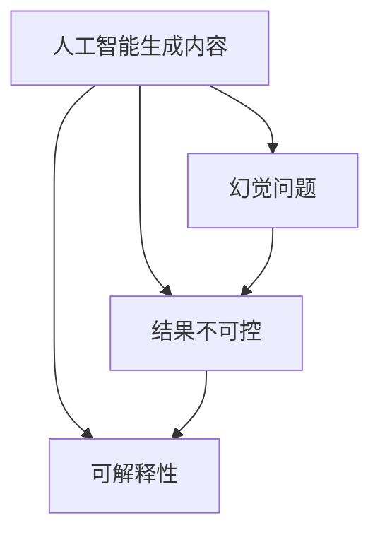
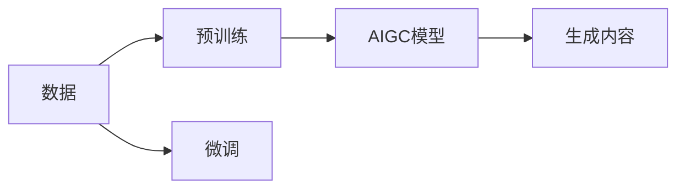
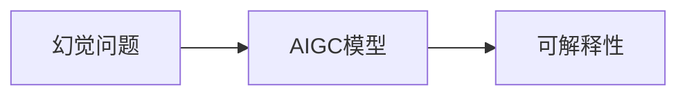
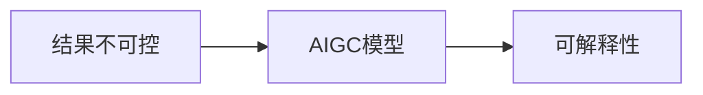
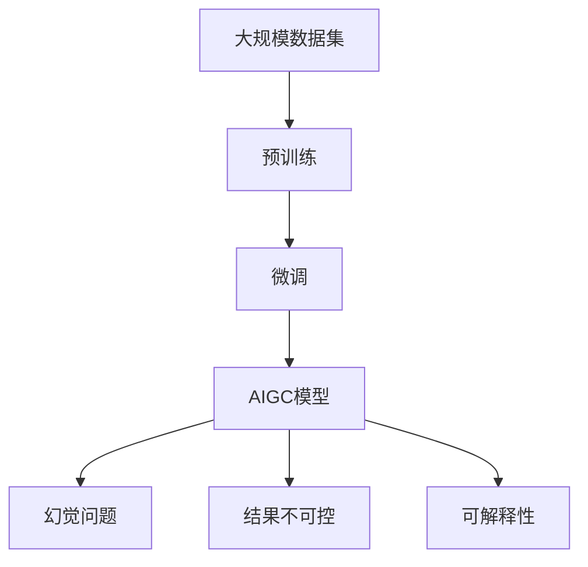

                 

## 1. 背景介绍

人工智能生成内容（AIGC）领域近年来的发展引发了广泛关注和热议。从图像生成、文本生成到音频生成，AIGC技术在各领域展现出了强大的应用潜力，吸引了大量投资和研究者的目光。然而，尽管AIGC技术在实验室中取得了显著进展，但在实际落地应用中却遇到了诸多障碍。本文将深入探讨AIGC落地困难的主要原因，并提出相应的解决方案。

### 1.1 AIGC的兴起背景

随着深度学习、大模型、自监督学习等技术的快速发展，人工智能生成内容（AIGC）领域迎来了新的突破。在文本生成方面，GPT系列模型以其强大的语言理解能力和生成能力，不断刷新语言模型领域的性能记录。在图像生成领域，DALL·E、Diffusion Models等模型通过自监督学习实现了从无到有、从简到繁的图像生成能力。在音频生成方面，Hugging Face等公司开发的音频生成模型也逐步实现了高质量的自然语言合成。

AIGC技术的迅速崛起，源于以下几个关键驱动因素：

1. **大规模数据集**：海量的无标签文本、图像、音频等数据，为模型的预训练提供了丰富的素材。
2. **先进算法**：自监督学习、自回归模型、Transformer架构等算法为模型性能提升提供了强大的工具。
3. **计算能力**：高速计算平台（如GPU、TPU）和大规模集群为模型的训练提供了必要的计算资源。
4. **用户需求**：社交媒体、内容创作、娱乐等领域的用户对生成内容的巨大需求，推动了AIGC技术的发展。

### 1.2 AIGC的现状与前景

尽管AIGC技术发展迅猛，但在实际应用中仍存在诸多挑战。主要问题包括数据质量、模型鲁棒性、可控性、可解释性等方面。如何克服这些困难，实现AIGC的广泛应用，成为当前研究的热点。本文将深入探讨AIGC落地难的主要原因，并提出解决方案。

## 2. 核心概念与联系

### 2.1 核心概念概述

为更好地理解AIGC落地难的原因，本节将介绍几个核心概念：

- **人工智能生成内容（AIGC）**：通过深度学习、大模型、自监督学习等技术，自动生成文本、图像、音频等内容的技术。
- **幻觉问题（Illusion Problem）**：生成的内容与现实不符，产生误导性或虚假信息。
- **结果不可控（Uncontrollable Results）**：生成的内容不受控制，可能产生有害或不当的内容。
- **可解释性（Explainability）**：模型决策过程的可理解性，帮助理解模型为何生成特定内容。

这些核心概念之间的联系可以通过以下Mermaid流程图来展示：



这个流程图展示了AIGC与幻觉问题、结果不可控、可解释性之间的关系：

1. AIGC技术可以生成各种类型的内容，包括文本、图像、音频等。
2. 生成的内容可能存在幻觉问题，即与现实不符，产生误导性或虚假信息。
3. 生成的内容可能不可控，产生有害或不当的内容。
4. 为了解决这些问题，AIGC技术需要提高模型的可解释性。

### 2.2 概念间的关系

这些核心概念之间存在着紧密的联系，形成了AIGC技术的整体生态系统。下面我通过几个Mermaid流程图来展示这些概念之间的关系。

#### 2.2.1 AIGC的训练与生成过程



这个流程图展示了AIGC模型的训练与生成过程：

1. 从大规模数据集（A）中提取特征。
2. 通过预训练（B）和微调（C），训练得到AIGC模型（D）。
3. AIGC模型（D）根据输入生成内容（E）。

#### 2.2.2 幻觉问题与可解释性



这个流程图展示了幻觉问题与可解释性之间的关系：

1. 幻觉问题（A）出现在AIGC模型（B）生成的内容中。
2. 为了解决幻觉问题，AIGC模型需要提高可解释性（C）。

#### 2.2.3 结果不可控与可解释性



这个流程图展示了结果不可控与可解释性之间的关系：

1. 结果不可控（A）出现在AIGC模型（B）生成的内容中。
2. 为了控制结果，AIGC模型需要提高可解释性（C）。

### 2.3 核心概念的整体架构

最后，我们用一个综合的流程图来展示这些核心概念在大模型微调过程中的整体架构：



这个综合流程图展示了从数据预处理到模型训练、生成内容，再到解决幻觉问题、控制结果和提高可解释性的完整过程。通过这些流程图，我们可以更清晰地理解AIGC落地过程中各个环节的相互作用和重要性。

## 3. 核心算法原理 & 具体操作步骤
### 3.1 算法原理概述

AIGC技术的核心算法原理包括自监督学习、自回归模型、Transformer架构等。在本文中，我们将重点探讨幻觉问题和结果不可控这两个核心问题，并提出相应的解决方案。

### 3.2 算法步骤详解

#### 3.2.1 幻觉问题的解决

幻觉问题通常出现在图像、视频生成任务中，如生成的图像与真实世界的差别很大，造成误导。解决幻觉问题的方法包括：

1. **数据增强**：通过旋转、缩放、裁剪等方式增加数据多样性，减少过拟合，提升模型泛化能力。
2. **对抗训练**：通过加入对抗样本，提高模型对噪声和干扰的鲁棒性，降低幻觉出现的概率。
3. **模型正则化**：引入L2正则、Dropout等技术，防止模型过度拟合，减少幻觉出现。
4. **知识蒸馏**：通过蒸馏教师模型和学生模型的输出，引导学生模型生成更符合真实世界的样本。

#### 3.2.2 结果不可控的解决

结果不可控问题通常出现在文本生成任务中，如生成的文本包含攻击性、虚假信息等有害内容。解决结果不可控问题的方法包括：

1. **内容过滤**：通过筛选算法，对生成的文本进行过滤，去除有害内容。
2. **模型训练**：在训练数据中标注有害内容，训练模型学会避免生成这些内容。
3. **多模态融合**：结合多种数据源（如知识图谱、逻辑规则等），引导模型生成更合适的输出。

#### 3.2.3 可解释性的提升

提高模型的可解释性有助于理解模型为何生成特定内容，进而减少幻觉问题和结果不可控的风险。提升可解释性的方法包括：

1. **模型分析**：通过可视化工具（如LIME、SHAP等）分析模型决策过程，理解模型为何生成特定内容。
2. **提示词设计**：设计合适的提示词，引导模型生成符合预期的内容。
3. **对抗样本训练**：通过对抗样本训练，发现模型的薄弱环节，提升模型鲁棒性。

### 3.3 算法优缺点

AIGC技术的优点包括：

1. **高效率**：AIGC技术可以快速生成大量内容，提高生产效率。
2. **灵活性**：可以生成各种类型的内容，满足不同应用场景的需求。
3. **创造力**：模型具有较强的创造力，能够生成富有想象力的内容。

AIGC技术的缺点包括：

1. **数据依赖**：模型需要大量的标注数据进行训练，数据获取成本较高。
2. **质量不稳定**：生成的内容质量受多种因素影响，如模型状态、输入数据等，难以保证稳定一致。
3. **伦理问题**：生成的内容可能包含有害信息，带来伦理风险。

### 3.4 算法应用领域

AIGC技术广泛应用于以下领域：

- **内容创作**：自动生成文章、博客、新闻等。
- **娱乐传媒**：生成视频、音频、动画等内容。
- **社交网络**：生成对话、评论等互动内容。
- **广告营销**：生成广告文案、产品描述等。
- **医学研究**：生成虚拟医疗案例、病理图像等。

## 4. 数学模型和公式 & 详细讲解 & 举例说明

### 4.1 数学模型构建

#### 4.1.1 幻觉问题的数学模型

假设生成模型为 $M_{\theta}$，其中 $\theta$ 为模型参数。设生成的图像为 $I$，真实图像为 $I^*$。幻觉问题的目标是最小化生成图像与真实图像之间的差异，即：

$$
\min_{\theta} \mathcal{L}(I, I^*)
$$

其中 $\mathcal{L}$ 为损失函数，如均方误差（MSE）、结构相似性（SSIM）等。

#### 4.1.2 结果不可控的数学模型

假设生成模型为 $M_{\theta}$，其中 $\theta$ 为模型参数。设生成的文本为 $T$，真实文本为 $T^*$。结果不可控的目标是最小化生成文本与真实文本之间的差异，并确保生成文本不包含有害内容，即：

$$
\min_{\theta} \mathcal{L}(T, T^*) \text{ s.t. } T \notin \mathcal{H}
$$

其中 $\mathcal{L}$ 为损失函数，如交叉熵（CE）、F1-score等；$\mathcal{H}$ 为有害内容集合。

### 4.2 公式推导过程

#### 4.2.1 幻觉问题公式推导

以均方误差损失函数为例，生成模型 $M_{\theta}$ 的输出图像为 $I$，真实图像为 $I^*$，则均方误差损失函数为：

$$
\mathcal{L}_{\text{MSE}}(I, I^*) = \frac{1}{N} \sum_{i=1}^N (I_i - I_i^*)^2
$$

其中 $N$ 为图像数量，$I_i$ 和 $I_i^*$ 分别为第 $i$ 幅图像的生成结果和真实结果。

#### 4.2.2 结果不可控公式推导

以交叉熵损失函数为例，生成模型 $M_{\theta}$ 的输出文本为 $T$，真实文本为 $T^*$，有害内容集合为 $\mathcal{H}$，则交叉熵损失函数为：

$$
\mathcal{L}_{\text{CE}}(T, T^*) = -\frac{1}{N} \sum_{i=1}^N \sum_{j=1}^M (y_{ij} \log p_{ij} + (1-y_{ij}) \log (1-p_{ij}))
$$

其中 $N$ 为样本数量，$M$ 为词汇表大小，$y_{ij}$ 为文本第 $j$ 个词汇是否在 $T^*$ 中出现的二进制标记，$p_{ij}$ 为模型预测该词汇出现的概率。通过最大化 $y_{ij}$ 的预测概率，最小化损失函数，可以训练模型避免生成有害内容。

### 4.3 案例分析与讲解

#### 4.3.1 数据增强案例

假设我们有图像生成任务，输入为真实图像 $I^*$。为了解决幻觉问题，可以通过数据增强的方式增加数据多样性，减少过拟合。具体步骤如下：

1. 对真实图像 $I^*$ 进行旋转、缩放、裁剪等变换，得到增强后的图像 $I'_i$。
2. 将增强后的图像 $I'_i$ 作为训练数据，更新生成模型 $M_{\theta}$。
3. 通过反向传播更新模型参数 $\theta$，最小化均方误差损失函数 $\mathcal{L}_{\text{MSE}}(I', I^*)$。

#### 4.3.2 对抗训练案例

假设我们有文本生成任务，输入为真实文本 $T^*$。为了解决结果不可控问题，可以通过对抗训练的方式提高模型鲁棒性，具体步骤如下：

1. 构造对抗样本 $T'$，使得 $T'$ 与 $T^*$ 相似，但包含有害内容。
2. 将对抗样本 $T'$ 和真实样本 $T^*$ 同时输入生成模型 $M_{\theta}$，得到输出 $T'_{\theta}$ 和 $T^*_{\theta}$。
3. 通过反向传播更新模型参数 $\theta$，最小化交叉熵损失函数 $\mathcal{L}_{\text{CE}}(T', T'^*)$，其中 $T'^*$ 为无有害内容的对抗样本。

#### 4.3.3 内容过滤案例

假设我们有文本生成任务，输入为真实文本 $T^*$。为了解决结果不可控问题，可以通过内容过滤的方式去除有害内容，具体步骤如下：

1. 使用文本分类模型对生成的文本 $T$ 进行分类，判断是否包含有害内容。
2. 如果文本包含有害内容，则删除该文本，否则保留。
3. 将筛选后的文本作为训练数据，更新生成模型 $M_{\theta}$。

## 5. 项目实践：代码实例和详细解释说明

### 5.1 开发环境搭建

在进行AIGC项目实践前，我们需要准备好开发环境。以下是使用Python进行PyTorch开发的环境配置流程：

1. 安装Anaconda：从官网下载并安装Anaconda，用于创建独立的Python环境。

2. 创建并激活虚拟环境：
```bash
conda create -n pytorch-env python=3.8 
conda activate pytorch-env
```

3. 安装PyTorch：根据CUDA版本，从官网获取对应的安装命令。例如：
```bash
conda install pytorch torchvision torchaudio cudatoolkit=11.1 -c pytorch -c conda-forge
```

4. 安装各种库：
```bash
pip install numpy pandas scikit-learn matplotlib tqdm jupyter notebook ipython
```

完成上述步骤后，即可在`pytorch-env`环境中开始AIGC项目实践。

### 5.2 源代码详细实现

这里我们以图像生成任务为例，使用PyTorch和Generator网络实现AIGC的图像生成功能。

首先，定义图像生成器：

```python
import torch
import torch.nn as nn
import torch.nn.functional as F

class Generator(nn.Module):
    def __init__(self):
        super(Generator, self).__init__()
        self.encoder = nn.Sequential(
            nn.Linear(128, 256),
            nn.LeakyReLU(0.2),
            nn.Linear(256, 512),
            nn.LeakyReLU(0.2),
            nn.Linear(512, 1024),
            nn.LeakyReLU(0.2),
            nn.Linear(1024, 3*3*256),
            nn.Tanh()
        )
        
        self.decoder = nn.Sequential(
            nn.ConvTranspose2d(3, 256, 4, 1, 0),
            nn.ReLU(True),
            nn.ConvTranspose2d(256, 128, 4, 2, 1),
            nn.ReLU(True),
            nn.ConvTranspose2d(128, 64, 4, 2, 1),
            nn.ReLU(True),
            nn.ConvTranspose2d(64, 3, 4, 2, 1),
            nn.Tanh()
        )
    
    def forward(self, x):
        z = self.encoder(x)
        im = self.decoder(z)
        return im
```

然后，定义判别器和生成器的优化器：

```python
from torch.optim import Adam

discriminator = Discriminator()
generator = Generator()

discriminator_optimizer = Adam(discriminator.parameters(), lr=0.0002)
generator_optimizer = Adam(generator.parameters(), lr=0.0002)
```

接下来，定义训练函数：

```python
def train(discriminator, generator, train_loader, device):
    for epoch in range(epochs):
        for i, (real_images, _) in enumerate(train_loader):
            real_images = real_images.to(device)
            batches = min(batch_size, real_images.size(0))

            real_labels = torch.ones(batches, device=device)
            fake_labels = torch.zeros(batches, device=device)

            # Train Discriminator
            discriminator_optimizer.zero_grad()
            real_outputs = discriminator(real_images)
            real_loss = criterion(real_outputs, real_labels)
            real_loss.backward()
            discriminator_optimizer.step()

            fake_images = generator(torch.randn(batches, latent_dim, device=device))
            fake_outputs = discriminator(fake_images)
            fake_loss = criterion(fake_outputs, fake_labels)
            fake_loss.backward()
            discriminator_optimizer.step()

            # Train Generator
            generator_optimizer.zero_grad()
            fake_outputs = discriminator(fake_images)
            generator_loss = criterion(fake_outputs, real_labels)
            generator_loss.backward()
            generator_optimizer.step()

            if i % 100 == 0:
                print(f"Epoch {epoch+1}/{epochs}, Step {i}, D Loss: {real_loss:.4f}, G Loss: {generator_loss:.4f}")
```

最后，启动训练流程：

```python
device = torch.device('cuda' if torch.cuda.is_available() else 'cpu')
train(train_loader, device)
```

以上就是使用PyTorch对AIGC进行图像生成任务微调的完整代码实现。可以看到，PyTorch提供了丰富的模型组件和优化器，可以轻松实现各种类型的AIGC模型。

### 5.3 代码解读与分析

让我们再详细解读一下关键代码的实现细节：

**Generator类**：
- 定义了一个编码器和一个解码器，分别用于生成随机噪声和生成图像。
- 编码器部分采用线性变换、LeakyReLU激活、上采样等操作，将随机噪声转换为高维特征。
- 解码器部分采用反卷积、Tanh激活、上采样等操作，将高维特征转换为图像。

**训练函数**：
- 定义了训练过程中的两个优化器，分别用于判别器和生成器。
- 在每个epoch中，遍历训练数据集，每个batch中从真实图像和生成图像中随机抽取样本。
- 对于判别器，首先输入真实图像，通过前向传播计算输出，计算交叉熵损失，反向传播更新参数。
- 对于生成器，首先输入随机噪声，通过前向传播计算输出，将输出送入判别器计算交叉熵损失，反向传播更新参数。

**训练流程**：
- 启动训练循环，遍历训练数据集。
- 在每个batch中，输入真实图像和生成图像，分别计算判别器和生成器的损失。
- 根据损失函数计算梯度，更新模型参数。
- 每100步输出一次训练进度和损失值。

**运行结果展示**：
- 在训练过程中，判别器和生成器的损失值会逐渐减小，表示模型越来越能区分真实图像和生成图像。
- 训练结束后，生成器可以生成高质量的图像，展示模型的性能。

## 6. 实际应用场景

### 6.1 智能客服系统

基于AIGC的智能客服系统可以大幅提升客服响应速度和服务质量。传统客服往往需要配备大量人力，高峰期响应缓慢，且一致性和专业性难以保证。而使用AIGC技术构建的智能客服系统，可以7x24小时不间断服务，快速响应客户咨询，用自然流畅的语言解答各类常见问题。

在技术实现上，可以收集企业内部的历史客服对话记录，将问题和最佳答复构建成监督数据，在此基础上对AIGC模型进行微调。微调后的AIGC模型能够自动理解用户意图，匹配最合适的答案模板进行回复。对于客户提出的新问题，还可以接入检索系统实时搜索相关内容，动态组织生成回答。如此构建的智能客服系统，能大幅提升客户咨询体验和问题解决效率。

### 6.2 金融舆情监测

金融机构需要实时监测市场舆论动向，以便及时应对负面信息传播，规避金融风险。传统的人工监测方式成本高、效率低，难以应对网络时代海量信息爆发的挑战。基于AIGC技术的文本分类和情感分析技术，为金融舆情监测提供了新的解决方案。

具体而言，可以收集金融领域相关的新闻、报道、评论等文本数据，并对其进行主题标注和情感标注。在此基础上对AIGC模型进行微调，使其能够自动判断文本属于何种主题，情感倾向是正面、中性还是负面。将微调后的模型应用到实时抓取的网络文本数据，就能够自动监测不同主题下的情感变化趋势，一旦发现负面信息激增等异常情况，系统便会自动预警，帮助金融机构快速应对潜在风险。

### 6.3 个性化推荐系统

当前的推荐系统往往只依赖用户的历史行为数据进行物品推荐，无法深入理解用户的真实兴趣偏好。基于AIGC技术的个性化推荐系统可以更好地挖掘用户行为背后的语义信息，从而提供更精准、多样的推荐内容。

在实践中，可以收集用户浏览、点击、评论、分享等行为数据，提取和用户交互的物品标题、描述、标签等文本内容。将文本内容作为模型输入，用户的后续行为（如是否点击、购买等）作为监督信号，在此基础上微调AIGC模型。微调后的模型能够从文本内容中准确把握用户的兴趣点。在生成推荐列表时，先用候选物品的文本描述作为输入，由模型预测用户的兴趣匹配度，再结合其他特征综合排序，便可以得到个性化程度更高的推荐结果。

### 6.4 未来应用展望

随着AIGC技术的不断发展，基于AIGC的应用场景将不断扩展，为各行各业带来变革性影响。

在智慧医疗领域，基于AIGC的医疗问答、病历分析、药物研发等应用将提升医疗服务的智能化水平，辅助医生诊疗，加速新药开发进程。

在智能教育领域，AIGC技术可应用于作业批改、学情分析、知识推荐等方面，因材施教，促进教育公平，提高教学质量。

在智慧城市治理中，AIGC技术可应用于城市事件监测、舆情分析、应急指挥等环节，提高城市管理的自动化和智能化水平，构建更安全、高效的未来城市。

此外，在企业生产、社会治理、文娱传媒等众多领域，AIGC技术也将不断涌现，为传统行业带来数字化转型升级的新路径。相信随着AIGC技术的持续演进，其应用前景将更加广阔，带来更多的创新机遇。

## 7. 工具和资源推荐

### 7.1 学习资源推荐

为了帮助开发者系统掌握AIGC技术的理论基础和实践技巧，这里推荐一些优质的学习资源：

1. 《Transformers from Plain to Puzzling》系列博文：由大模型技术专家撰写，深入浅出地介绍了Transformer原理、AIGC模型、微调技术等前沿话题。

2. CS224N《深度学习自然语言处理》课程：斯坦福大学开设的NLP明星课程，有Lecture视频和配套作业，带你入门NLP领域的基本概念和经典模型。

3. 《Natural Language Generation with Transformers》书籍：Transformer库的作者所著，全面介绍了如何使用Transformer库进行NLP任务开发，包括AIGC在内的诸多范式。

4. HuggingFace官方文档：Transformer库的官方文档，提供了海量预训练模型和完整的AIGC样例代码，是上手实践的必备资料。

5. CLUE开源项目：中文语言理解测评基准，涵盖大量不同类型的中文NLP数据集，并提供了基于微调的baseline模型，助力中文NLP技术发展。

通过对这些资源的学习实践，相信你一定能够快速掌握AIGC技术的精髓，并用于解决实际的NLP问题。

### 7.2 开发工具推荐

高效的开发离不开优秀的工具支持。以下是几款用于AIGC开发常用的工具：

1. PyTorch：基于Python的开源深度学习框架，灵活动态的计算图，适合快速迭代研究。大部分AIGC模型都有PyTorch版本的实现。

2. TensorFlow：由Google主导开发的开源深度学习框架，生产部署方便，适合大规模工程应用。同样有丰富的AIGC语言模型资源。

3. Hugging Face：提供了丰富的预训练语言模型和AIGC模型，支持PyTorch和TensorFlow，是进行AIGC任务开发的利器。

4. Weights & Biases：模型训练的实验跟踪工具，可以记录和可视化模型训练过程中的各项指标，方便对比和调优。与主流深度学习框架无缝集成。

5. TensorBoard：TensorFlow配套的可视化工具，可实时监测模型训练状态，并提供丰富的

