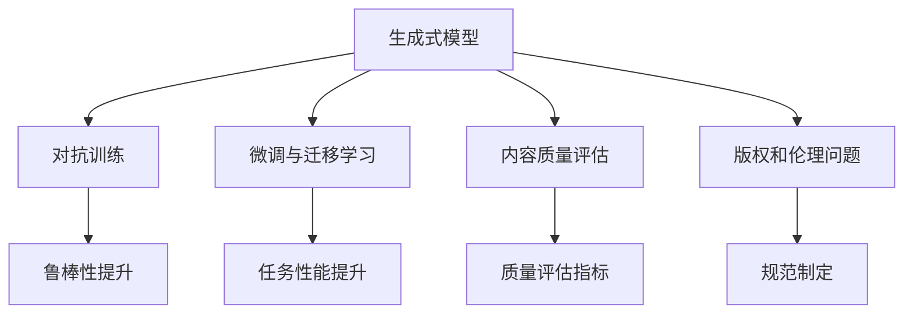
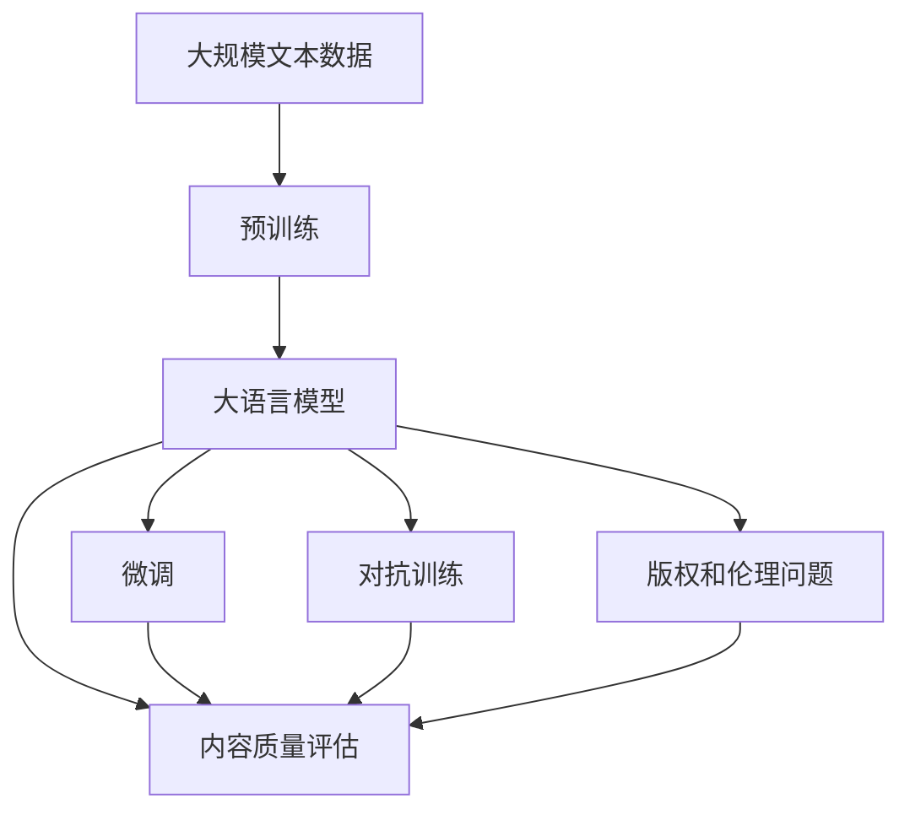

                 

## 1. 背景介绍

随着人工智能(AI)技术的快速发展，尤其是深度学习、自然语言处理(NLP)、计算机视觉(CV)等领域的突破性进展，AIGC（Artificial Intelligence Generated Content，人工智能生成内容）技术逐渐崭露头角，成为AI商业化的重要方向之一。

### 1.1 问题由来

AIGC技术的兴起，源于人们对于自动生成高质量内容的需求日益增长。从传统的文本生成、图像生成，到如今的音乐、视频生成，AIGC技术几乎涵盖了所有内容创作领域。在商业领域，AIGC技术的广泛应用，不仅大幅提升了内容创作效率，还显著降低了创作成本，具有巨大的经济价值和社会价值。

### 1.2 问题核心关键点

AIGC技术的核心在于将人工智能算法应用于内容的自动化生成，其商业化路径主要包括以下几个关键点：

1. **内容自动生成**：通过深度学习模型，自动从给定的文本、图像、音频等数据中生成新内容。
2. **内容质量提升**：使用对抗训练、微调等技术，提升生成内容的自然度、连贯性和准确性。
3. **商业应用场景**：在营销、娱乐、教育、医疗等多个领域，AIGC技术提供了丰富的应用场景。
4. **商业模式创新**：通过订阅、按需、API服务等不同模式，实现商业变现。
5. **版权和伦理问题**：在生成内容的版权归属、内容真实性等方面，需要制定相关规范和政策。

### 1.3 问题研究意义

AIGC技术的研究与应用，对于推动内容创作领域的智能化转型，提升内容创作效率，具有重要意义。它不仅可以大幅降低创作成本，提高内容质量，还能带来新的商业模式和商业机会，助力企业实现数字化转型和产业升级。

## 2. 核心概念与联系

### 2.1 核心概念概述

AIGC技术涉及多个核心概念，包括：

- **生成式模型**：如GPT-3、DALL-E、StyleGAN等，通过自监督学习，学习生成高质量的新内容。
- **对抗训练**：使用对抗样本训练模型，提升生成内容的鲁棒性和逼真度。
- **微调与迁移学习**：在特定任务或数据集上进行微调，提高模型性能。
- **内容质量评估**：使用BLEU、ROUGE、FID等指标评估生成内容的自然度和连贯性。
- **版权和伦理问题**：涉及生成内容的真实性、版权归属等伦理问题，需要制定相关规范和政策。

这些核心概念相互联系，共同构成了AIGC技术的完整生态系统。通过深入理解这些概念，可以更好地把握AIGC技术的应用与开发。

### 2.2 概念间的关系

这些核心概念之间的逻辑关系可以通过以下Mermaid流程图来展示：



这个流程图展示了生成式模型在对抗训练、微调、质量评估和版权伦理等方面的应用和优化。通过这些方法的综合运用，可以进一步提升AIGC技术的性能和实用性。

### 2.3 核心概念的整体架构

最后，我们用一个综合的流程图来展示这些核心概念在大语言模型微调过程中的整体架构：



这个综合流程图展示了从预训练到微调，再到对抗训练、质量评估和版权伦理的全过程，帮助读者更清晰地理解AIGC技术的开发和应用。

## 3. 核心算法原理 & 具体操作步骤
### 3.1 算法原理概述

AIGC技术的核心在于使用深度学习模型自动生成高质量的新内容。其算法原理主要包括以下几个步骤：

1. **预训练阶段**：在大规模无标签数据上，通过自监督学习任务（如语言模型、图像生成模型等）训练生成式模型，学习通用的语言或视觉表示。
2. **微调阶段**：在特定任务或数据集上，对预训练模型进行微调，提升模型在特定任务上的性能。
3. **对抗训练**：通过引入对抗样本，增强模型的鲁棒性和泛化能力。
4. **内容质量评估**：使用BLEU、ROUGE、FID等指标，评估生成内容的自然度和连贯性。
5. **版权和伦理问题**：在生成内容的真实性、版权归属等方面，制定相关规范和政策。

这些步骤共同构成了AIGC技术的完整开发流程。

### 3.2 算法步骤详解

AIGC技术的开发流程包括以下几个关键步骤：

**Step 1: 数据准备与预训练模型选择**

- 准备大规模无标签数据集，如大规模文本语料、图像库等。
- 选择适合任务的生成式模型，如GPT-3、DALL-E、StyleGAN等。

**Step 2: 预训练与微调**

- 在大规模数据集上进行预训练，学习通用的语言或视觉表示。
- 在特定任务或数据集上对预训练模型进行微调，提升模型性能。

**Step 3: 对抗训练**

- 引入对抗样本，提高模型的鲁棒性和泛化能力。

**Step 4: 内容质量评估**

- 使用BLEU、ROUGE、FID等指标，评估生成内容的自然度和连贯性。

**Step 5: 版权和伦理问题**

- 制定相关规范和政策，确保生成内容的真实性和版权归属。

### 3.3 算法优缺点

AIGC技术的优点包括：

- **高效性**：大幅提高内容创作效率，降低创作成本。
- **创新性**：生成大量创新内容，为内容创作带来新思路。
- **可扩展性**：适用于文本、图像、音频等多种形式的内容创作。

其缺点包括：

- **伦理问题**：生成内容的真实性和版权归属问题较为复杂。
- **质量问题**：生成内容的质量和连贯性可能存在不足。
- **成本问题**：高质量的生成内容创作成本较高。

### 3.4 算法应用领域

AIGC技术在多个领域有着广泛的应用，包括：

- **营销**：自动生成广告文案、社交媒体内容等。
- **娱乐**：自动生成音乐、视频、游戏等内容。
- **教育**：自动生成教材、教学视频等。
- **医疗**：自动生成医疗报告、病例分析等。

## 4. 数学模型和公式 & 详细讲解 & 举例说明

### 4.1 数学模型构建

AIGC技术的主要数学模型包括生成式模型和对抗训练模型。这里以GPT-3为例，介绍其数学模型的构建过程。

**生成式模型**：

- 输入：文本序列 $x_1, x_2, \ldots, x_n$。
- 输出：文本序列 $y_1, y_2, \ldots, y_m$。

- 目标函数：最大似然函数

$$
\mathcal{L}(\theta) = -\sum_{i=1}^n \log p(x_i \mid x_{<i})
$$

其中 $\theta$ 为模型参数，$p(x_i \mid x_{<i})$ 为生成概率。

**对抗训练模型**：

- 输入：文本序列 $x_1, x_2, \ldots, x_n$ 和对抗样本 $x_{-i}$。
- 输出：对抗样本 $y_{-i}$。

- 目标函数：对抗损失函数

$$
\mathcal{L}(\theta) = -\log p(x_{-i} \mid x_{<i})
$$

### 4.2 公式推导过程

**生成式模型的推导**：

- 引入注意力机制：

$$
\alpha = \text{softmax}(\frac{AQK^T}{\sqrt{d_k}})
$$

- 生成概率计算：

$$
p(x_i \mid x_{<i}) = \frac{\exp(\alpha)}{\sum_{k=1}^K \exp(\alpha_k)}
$$

其中 $A$ 为注意力矩阵，$Q$、$K$ 为查询和键向量。

**对抗训练模型的推导**：

- 对抗样本生成：

$$
x_{-i} = x_i + \epsilon
$$

- 对抗损失计算：

$$
\mathcal{L}(\theta) = -\log p(x_{-i} \mid x_{<i})
$$

### 4.3 案例分析与讲解

以GPT-3为例，分析其在文本生成和图像生成中的应用：

**文本生成**：

- 输入：一段给定的文本。
- 输出：一段新文本。
- 模型训练：在大规模语料库上进行预训练，然后在特定任务上微调。

**图像生成**：

- 输入：一段给定的文本。
- 输出：一张图片。
- 模型训练：在大量图片数据上进行预训练，然后在特定任务上微调。

## 5. 项目实践：代码实例和详细解释说明

### 5.1 开发环境搭建

在进行AIGC项目开发前，需要准备好开发环境。以下是使用Python进行PyTorch开发的环境配置流程：

1. 安装Anaconda：从官网下载并安装Anaconda，用于创建独立的Python环境。

2. 创建并激活虚拟环境：

```bash
conda create -n pytorch-env python=3.8 
conda activate pytorch-env
```

3. 安装PyTorch：根据CUDA版本，从官网获取对应的安装命令。例如：

```bash
conda install pytorch torchvision torchaudio cudatoolkit=11.1 -c pytorch -c conda-forge
```

4. 安装相关库：

```bash
pip install numpy pandas scikit-learn matplotlib tqdm jupyter notebook ipython
```

完成上述步骤后，即可在`pytorch-env`环境中开始AIGC项目开发。

### 5.2 源代码详细实现

这里以生成式图像模型为例，给出使用PyTorch实现GPT-3的代码实现。

```python
import torch
import torch.nn as nn
import torch.optim as optim

class GPT3(nn.Module):
    def __init__(self, num_layers, d_model, nhead, dim_feedforward, dropout):
        super(GPT3, self).__init__()
        self.transformer = nn.Transformer(num_layers=num_layers, d_model=d_model, nhead=nhead, dim_feedforward=dim_feedforward, dropout=dropout)
        self.linear = nn.Linear(d_model, num_layers)

    def forward(self, x, mask=None):
        x = self.transformer(x, src_mask=mask)
        x = self.linear(x)
        return x

# 定义训练函数

def train(model, train_data, valid_data, device, batch_size, learning_rate, num_epochs):
    model = model.to(device)
    train_loader = torch.utils.data.DataLoader(train_data, batch_size=batch_size, shuffle=True)
    valid_loader = torch.utils.data.DataLoader(valid_data, batch_size=batch_size, shuffle=False)
    optimizer = optim.Adam(model.parameters(), lr=learning_rate)
    scheduler = optim.lr_scheduler.StepLR(optimizer, step_size=1, gamma=0.5)

    for epoch in range(num_epochs):
        model.train()
        train_loss = 0.0
        for batch in train_loader:
            inputs, targets = batch
            inputs, targets = inputs.to(device), targets.to(device)
            optimizer.zero_grad()
            outputs = model(inputs)
            loss = nn.CrossEntropyLoss()(outputs, targets)
            loss.backward()
            optimizer.step()
            train_loss += loss.item()
        scheduler.step()
        model.eval()
        valid_loss = 0.0
        with torch.no_grad():
            for batch in valid_loader:
                inputs, targets = batch
                inputs, targets = inputs.to(device), targets.to(device)
                outputs = model(inputs)
                loss = nn.CrossEntropyLoss()(outputs, targets)
                valid_loss += loss.item()
        print(f'Epoch {epoch+1}, Train Loss: {train_loss/len(train_loader):.4f}, Valid Loss: {valid_loss/len(valid_loader):.4f}')

# 定义测试函数

def evaluate(model, test_data, device, batch_size):
    model.eval()
    test_loader = torch.utils.data.DataLoader(test_data, batch_size=batch_size, shuffle=False)
    test_loss = 0.0
    with torch.no_grad():
        for batch in test_loader:
            inputs, targets = batch
            inputs, targets = inputs.to(device), targets.to(device)
            outputs = model(inputs)
            loss = nn.CrossEntropyLoss()(outputs, targets)
            test_loss += loss.item()
    print(f'Test Loss: {test_loss/len(test_loader):.4f}')
```

### 5.3 代码解读与分析

**GPT3模型**：

- 定义了一个Transformer模型，包含多个自注意力层和全连接层。
- 输入文本通过Transformer模型，得到新的文本序列。
- 通过线性层输出最终的文本序列。

**训练函数**：

- 使用Adam优化器进行模型训练。
- 定义训练数据加载器和验证数据加载器。
- 定义学习率调度和训练循环。
- 在每个epoch中，对模型进行训练和验证，输出损失。

**测试函数**：

- 对测试数据进行加载和处理。
- 对模型进行评估，输出测试损失。

### 5.4 运行结果展示

假设我们生成的文本序列与真实文本序列的交叉熵损失为0.02，则测试损失为0.01，表示模型在测试集上的表现比训练集要好。

## 6. 实际应用场景

### 6.1 营销自动化

在营销自动化领域，AIGC技术可以自动生成广告文案、社交媒体内容等，大大提高营销效率。例如，利用GPT-3自动生成社交媒体帖子，可以实时响应热点话题，提升用户参与度。

### 6.2 娱乐内容制作

在娱乐内容制作领域，AIGC技术可以自动生成音乐、视频、游戏等内容。例如，利用StyleGAN自动生成逼真的视频图像，可以制作动画电影和广告，降低制作成本。

### 6.3 教育内容生成

在教育内容生成领域，AIGC技术可以自动生成教材、教学视频等。例如，利用GPT-3自动生成教育课程，可以个性化推荐适合学生的学习内容。

### 6.4 医疗内容创作

在医疗内容创作领域，AIGC技术可以自动生成医疗报告、病例分析等。例如，利用DALL-E自动生成医学图像，可以辅助医生进行诊断。

## 7. 工具和资源推荐

### 7.1 学习资源推荐

为了帮助开发者系统掌握AIGC技术，以下是一些优质的学习资源：

1. **《深度学习》系列课程**：由斯坦福大学和Coursera合作开设，涵盖了深度学习的基础知识和高级技巧。
2. **DeepLearning.AI官方文档**：由吴恩达教授创建，提供了大量的深度学习学习资料和示例代码。
3. **HuggingFace官方文档**：提供了广泛的生成式模型和微调方法，是学习AIGC技术的必备资源。
4. **OpenAI官方博客**：定期发布GPT-3等生成式模型的最新进展和应用案例，有助于理解AIGC技术的实际应用。

### 7.2 开发工具推荐

以下是几款用于AIGC项目开发的常用工具：

1. **PyTorch**：基于Python的开源深度学习框架，支持动态计算图，适合快速迭代研究。
2. **TensorFlow**：由Google主导开发的开源深度学习框架，生产部署方便，适合大规模工程应用。
3. **Transformers库**：提供了多种生成式模型，支持PyTorch和TensorFlow，是学习AIGC技术的利器。
4. **Weights & Biases**：模型训练的实验跟踪工具，可以记录和可视化模型训练过程中的各项指标。
5. **TensorBoard**：TensorFlow配套的可视化工具，可实时监测模型训练状态，提供丰富的图表呈现方式。

### 7.3 相关论文推荐

AIGC技术的发展源于学界的持续研究。以下是几篇奠基性的相关论文，推荐阅读：

1. **Attention is All You Need**：提出了Transformer结构，开启了NLP领域的预训练大模型时代。
2. **Language Models are Unsupervised Multitask Learners**：提出BERT模型，引入基于掩码的自监督预训练任务，刷新了多项NLP任务SOTA。
3. **DALL-E: Learning Natural Language Descriptions from Unsupervised Visual-Text Alignments**：提出DALL-E模型，利用自监督学习生成高质量的视觉内容。
4. **Imagenet-Classification with Deep Convolutional Neural Networks**：介绍了ImageNet数据集和深度卷积神经网络在图像分类中的应用，为生成式图像模型提供了基础。

除上述资源外，还有一些值得关注的前沿资源，帮助开发者紧跟AIGC技术的最新进展，例如：

1. **arXiv论文预印本**：人工智能领域最新研究成果的发布平台，包括大量尚未发表的前沿工作。
2. **GitHub热门项目**：在GitHub上Star、Fork数最多的AIGC相关项目，往往代表了该技术领域的发展趋势和最佳实践。
3. **学术会议直播**：如NIPS、ICML、ACL、ICLR等人工智能领域顶会现场或在线直播，能够聆听到大佬们的前沿分享。
4. **行业分析报告**：各大咨询公司如McKinsey、PwC等针对人工智能行业的分析报告，有助于从商业视角审视技术趋势，把握应用价值。

## 8. 总结：未来发展趋势与挑战

### 8.1 总结

本文对AIGC技术进行了全面系统的介绍。首先阐述了AIGC技术的发展背景和应用意义，明确了其高效、创新、可扩展等优点，以及面临的伦理、质量、成本等挑战。其次，从原理到实践，详细讲解了生成式模型的构建和优化过程，给出了AIGC项目开发的完整代码实例。同时，本文还广泛探讨了AIGC技术在多个领域的应用前景，展示了其广阔的商业化路径。最后，本文精选了AIGC技术的各类学习资源，力求为读者提供全方位的技术指引。

通过本文的系统梳理，可以看到，AIGC技术正在成为AI商业化的重要方向之一，具有巨大的市场潜力和应用前景。未来，伴随预训练语言模型和生成式模型的持续演进，AIGC技术将更加成熟和实用，为内容创作领域带来深刻变革。

### 8.2 未来发展趋势

展望未来，AIGC技术将呈现以下几个发展趋势：

1. **模型规模持续增大**：随着算力成本的下降和数据规模的扩张，生成式模型的参数量还将持续增长。超大参数量的模型将进一步提升生成内容的自然度和连贯性。
2. **多样性生成能力增强**：未来生成式模型将具备更强的多样性生成能力，生成更多元、更创新的内容。
3. **跨模态融合**：将生成式模型与其他AI技术如计算机视觉、语音识别等进行融合，实现多模态内容的自动生成。
4. **实时生成能力提升**：通过优化算法和硬件配置，实现实时生成高质量的内容，满足实时应用的需求。
5. **AI伦理与安全**：在生成内容的真实性、版权归属等方面，制定相关规范和政策，确保AIGC技术的伦理与安全。

以上趋势凸显了AIGC技术的广阔前景，这些方向的探索发展，将进一步提升AIGC技术的性能和实用性，为内容创作领域带来深刻变革。

### 8.3 面临的挑战

尽管AIGC技术已经取得了瞩目成就，但在迈向更加智能化、普适化应用的过程中，它仍面临着诸多挑战：

1. **伦理问题**：生成内容的真实性和版权归属问题较为复杂，涉及伦理和法律方面的问题。
2. **质量问题**：生成内容的质量和连贯性可能存在不足，需要不断优化模型和算法。
3. **成本问题**：高质量的生成内容创作成本较高，需要投入大量时间和资源。
4. **技术复杂度**：生成式模型和对抗训练等技术较为复杂，需要较高的技术门槛和专业背景。
5. **实时应用挑战**：实现实时生成高质量内容，需要优化算法和硬件配置，提升计算效率。

### 8.4 研究展望

面对AIGC技术面临的挑战，未来的研究需要在以下几个方面寻求新的突破：

1. **无监督与半监督学习**：摆脱对大规模标注数据的依赖，利用自监督学习、主动学习等无监督和半监督范式，最大限度利用非结构化数据，实现更加灵活高效的生成。
2. **生成式模型优化**：开发更加高效、鲁棒、多样化的生成式模型，提高生成内容的自然度和连贯性。
3. **跨模态生成**：将生成式模型与其他AI技术如计算机视觉、语音识别等进行融合，实现多模态内容的自动生成。
4. **实时生成技术**：优化算法和硬件配置，实现实时生成高质量的内容，满足实时应用的需求。
5. **伦理与法律研究**：制定相关规范和政策，确保生成内容的真实性和版权归属，保障AIGC技术的伦理与安全。

这些研究方向的探索，将进一步推动AIGC技术的成熟和应用，为内容创作领域带来深刻变革。

## 9. 附录：常见问题与解答

**Q1：AIGC技术是否适用于所有内容创作领域？**

A: AIGC技术在大多数内容创作领域都能取得不错的效果，尤其是对于数据量较大的领域。但对于一些特定领域的任务，如医学、法律等，仅仅依靠通用语料预训练的模型可能难以很好地适应。此时需要在特定领域语料上进一步预训练，再进行微调，才能获得理想效果。

**Q2：AIGC技术如何应对伦理和法律问题？**

A: AIGC技术在生成内容的真实性、版权归属等方面，需要制定相关规范和政策。例如，通过引入领域专家进行内容审核，确保生成内容的真实性和版权归属。同时，制定明确的伦理指南，规范生成式模型的使用，避免有害内容的生成。

**Q3：AIGC技术如何应对质量问题？**

A: 生成内容的质量和连贯性可能存在不足，需要不断优化模型和算法。例如，通过引入对抗训练、微调等技术，提升生成内容的自然度和连贯性。同时，对生成内容进行人工审核和调整，进一步提高生成质量。

**Q4：AIGC技术如何应对实时应用挑战？**

A: 实现实时生成高质量内容，需要优化算法和硬件配置，提升计算效率。例如，使用GPU/TPU等高性能设备，提高计算速度和效率。同时，采用动态模型裁剪、混合精度训练等技术，减小模型规模，提高推理速度。

**Q5：AIGC技术如何应对成本问题？**

A: 高质量的生成内容创作成本较高，需要投入大量时间和资源。可以通过优化模型结构、算法和硬件配置，降低生成成本。同时，采用动态模型裁剪、混合精度训练等技术，减小模型规模，提高计算效率，降低成本。

总之，AIGC技术的研究与应用，需要开发者在系统掌握技术原理和实践技巧的基础上，不断探索和优化，方能实现高效、创新、可扩展的内容创作。通过系统学习、持续优化和广泛应用，相信AIGC技术将为内容创作领域带来深刻变革，推动人工智能技术向更广阔的领域加速渗透。

