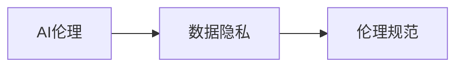
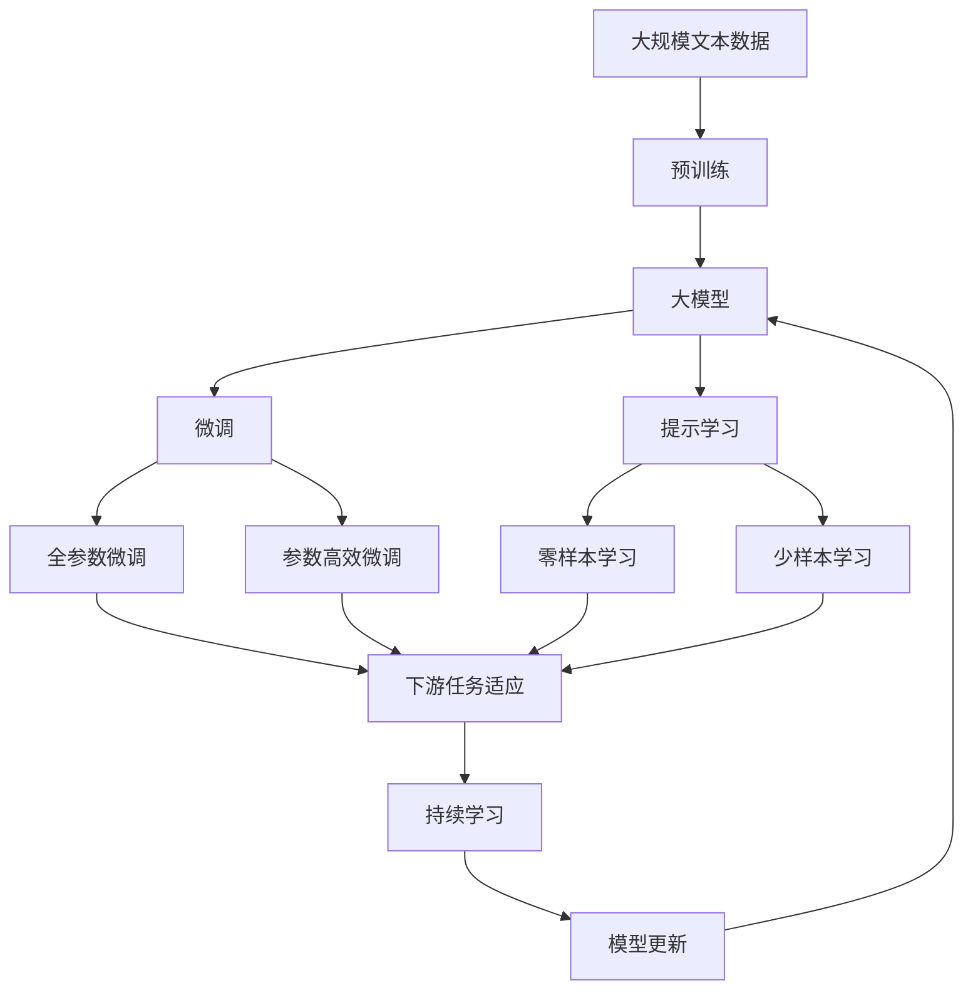

                 

# 生成式AIGC：AI技术的商业应用

> 关键词：生成式AI、AIGC、自然语言生成(NLG)、语音合成(Synthesis)、视觉生成(Visual Generation)、大模型、AI商业化、AI伦理、隐私保护

## 1. 背景介绍

### 1.1 问题由来

近年来，人工智能(AI)技术迅猛发展，特别在自然语言处理(NLP)、语音识别、图像识别等领域取得了突破性进展。随之而来的是生成式人工智能(AI Generative Creative, AIGC)技术的崛起，其中生成式模型已成为AI技术商业化应用的重要推动力量。

AIGC技术能够自动生成高质量的文本、语音、图像等内容，应用广泛，涵盖内容创作、广告营销、虚拟主播、娱乐等多个行业。通过AIGC技术，企业能够以更低成本、更高效率地生成丰富多样的内容，满足用户需求。

然而，AIGC技术也面临着一些挑战，如内容真实性、伦理道德、用户隐私保护等问题。如何在技术应用的推广中，确保内容的真实性、伦理道德、隐私保护，成为亟需解决的问题。

### 1.2 问题核心关键点

AIGC技术商业应用的核心在于生成模型的稳定性和高质量输出。常见的问题包括：

- 内容生成过程的复杂性和不确定性
- 模型参数的优化和训练策略
- 生成内容的真实性、伦理道德和隐私保护
- 商业应用场景的扩展和优化

这些核心问题构成了AIGC技术商业应用的重点，决定了技术在实际应用中的效果和价值。

### 1.3 问题研究意义

研究AIGC技术的商业应用，对于推动AI技术在各行业的应用具有重要意义：

1. 降低内容创作成本：利用AIGC技术自动化生成内容，大大降低内容创作的人力成本。
2. 提高内容创作效率：AIGC技术能够以更快节奏生成大量内容，满足市场对内容需求。
3. 提升内容质量和多样性：AIGC技术能够生成高度逼真的高质量内容，增强用户体验。
4. 拓展商业应用场景：AIGC技术在广告、营销、游戏、娱乐等行业都有广泛应用，赋能传统行业转型升级。
5. 催生新的商业模式：AI技术内容创作可以开创新的商业模式，如内容订阅、智能客服等。

## 2. 核心概念与联系

### 2.1 核心概念概述

为更好地理解AIGC技术的商业应用，本节将介绍几个密切相关的核心概念：

- **生成式AI (AI Generative Creative, AIGC)**：指利用AI技术自动生成文本、语音、图像等内容的智能化应用。
- **自然语言生成 (NLG, Natural Language Generation)**：指使用AI技术自动生成自然语言文本，包括新闻报道、文学作品、广告文案等。
- **语音合成 (Synthesis)**：指使用AI技术将文字转化为语音，包括虚拟主播、语音助手、智能客服等。
- **视觉生成 (Visual Generation)**：指使用AI技术自动生成图像、视频等视觉内容，包括虚拟形象、影视制作、广告设计等。
- **大模型 (Large Model)**：指深度学习模型中的大规模预训练模型，如BERT、GPT、DALL·E等，这些模型可以生成高质量内容。
- **AI商业化 (AI Commercialization)**：指将AI技术应用于商业场景，通过商业模式创新驱动企业成长。
- **AI伦理 (AI Ethics)**：指在AI应用中遵循道德规范，保护用户隐私、数据安全，确保技术应用的公平公正。
- **隐私保护 (Privacy Protection)**：指在AI应用中保护个人隐私，防止数据泄露和滥用。

这些核心概念之间的逻辑关系可以通过以下Mermaid流程图来展示：

```mermaid
graph TB
    A[生成式AI (AIGC)] --> B[自然语言生成 (NLG)]
    A --> C[语音合成 (Synthesis)]
    A --> D[视觉生成 (Visual Generation)]
    B --> E[广告]
    B --> F[内容创作]
    C --> G[虚拟主播]
    C --> H[智能客服]
    D --> I[影视制作]
    D --> J[广告设计]
    A --> K[AI商业化]
    K --> L[商业模式创新]
    K --> M[企业成长]
    K --> N[AI伦理]
    N --> O[数据隐私]
    N --> P[伦理规范]
```

这个流程图展示了大语言模型微调过程中各个核心概念的关系和作用：

1. AIGC技术涵盖了自然语言生成、语音合成和视觉生成等核心应用。
2. 自然语言生成、语音合成和视觉生成分别对应广告、内容创作、影视制作、广告设计等不同应用场景。
3. AI商业化将AIGC技术应用于商业模式创新，驱动企业成长。
4. AI伦理和隐私保护在AIGC技术的商业应用中尤为重要，需要确保技术应用的道德规范和数据安全。

### 2.2 概念间的关系

这些核心概念之间存在着紧密的联系，形成了AIGC技术的完整生态系统。下面是进一步细化的Mermaid流程图：

#### 2.2.1 大模型与AIGC的关系

```mermaid
graph LR
    A[大规模预训练模型] --> B[生成式AI (AIGC)]
    B --> C[自然语言生成 (NLG)]
    B --> D[语音合成 (Synthesis)]
    B --> E[视觉生成 (Visual Generation)]
```

这个流程图展示了AIGC技术如何依赖于大规模预训练模型：

1. 大规模预训练模型在大规模语料上学习语言知识和特征表示，成为生成内容的"引擎"。
2. AIGC技术通过微调或适配预训练模型，生成高质量的自然语言、语音和视觉内容。

#### 2.2.2 AIGC在商业化中的应用

```mermaid
graph LR
    A[生成式AI (AIGC)] --> B[商业模式创新]
    B --> C[内容创作]
    B --> D[广告]
    B --> E[智能客服]
    B --> F[影视制作]
    B --> G[虚拟主播]
```

这个流程图展示了AIGC技术在商业化过程中各环节的应用：

1. AIGC技术生成高质量内容，应用于内容创作、广告、智能客服、影视制作和虚拟主播等多个商业领域。
2. 通过内容创作和广告，提升企业品牌价值和市场影响力。
3. 智能客服和虚拟主播增强用户互动体验，提升客户服务质量。
4. 影视制作丰富内容形式，满足多样化娱乐需求。

#### 2.2.3 AI伦理与隐私保护



这个流程图展示了AI伦理和隐私保护在AIGC技术商业应用中的重要性：

1. AI伦理和隐私保护需遵循伦理规范，保护用户隐私，防止数据滥用。
2. 数据隐私保护需确保用户数据的安全和匿名化，避免数据泄露风险。

### 2.3 核心概念的整体架构

最后，我们用一个综合的流程图来展示这些核心概念在大语言模型微调过程中的整体架构：



这个综合流程图展示了从预训练到微调，再到持续学习的完整过程：

1. 大语言模型通过预训练获得基础能力。
2. 微调对预训练模型进行任务特定的优化，可以分为全参数微调和参数高效微调（PEFT）。
3. 提示学习可以实现零样本和少样本学习，减少微调参数。
4. 微调后的模型用于下游任务，通过持续学习保持性能和适应新数据。

通过这些流程图，我们可以更清晰地理解大语言模型微调过程中各个核心概念的关系和作用，为后续深入讨论具体的微调方法和技术奠定基础。

## 3. 核心算法原理 & 具体操作步骤
### 3.1 算法原理概述

AIGC技术的核心在于利用生成式模型，通过训练和优化模型参数，生成高质量的自然语言、语音和视觉内容。其算法原理主要基于深度学习框架，具体如下：

1. **生成模型框架**：使用深度学习模型，如RNN、LSTM、Transformer等，构建生成模型。
2. **损失函数设计**：定义损失函数，如交叉熵损失、重建损失等，衡量生成内容与真实内容之间的差异。
3. **模型训练优化**：使用优化算法（如Adam、SGD等）更新模型参数，最小化损失函数。
4. **模型评估与测试**：使用评估指标（如BLEU、ROUGE等）对模型生成内容进行评估，确保生成内容的准确性和相关性。

### 3.2 算法步骤详解

AIGC技术的商业应用步骤主要包括：

**Step 1: 准备训练数据和目标**

- 收集各领域的训练数据，包括文本、语音、图像等。
- 确定目标任务，如自然语言生成、语音合成、视觉生成等。

**Step 2: 选择合适的生成模型**

- 根据任务需求，选择适合的生成模型，如GPT、BERT、GAN等。
- 使用大规模预训练模型作为初始化参数。

**Step 3: 模型适配与训练**

- 设计任务适配层，如编码器-解码器架构，将预训练模型作为编码器。
- 定义损失函数，计算生成内容与真实内容之间的差异。
- 使用优化算法（如Adam、SGD等）更新模型参数，最小化损失函数。
- 设置合适的学习率、批大小、迭代轮数等训练参数。

**Step 4: 评估与优化**

- 在验证集上评估模型性能，使用BLEU、ROUGE等指标。
- 根据评估结果调整训练参数，进行模型优化。

**Step 5: 部署与应用**

- 将优化后的模型部署到生产环境中。
- 持续收集用户反馈，进行模型迭代和优化。

### 3.3 算法优缺点

AIGC技术的商业应用具有以下优点：

1. **高效自动化**：AIGC技术能够自动化生成高质量内容，大幅提高内容创作效率。
2. **灵活多样**：根据不同的应用场景，AIGC技术可以生成多样化的内容形式，如文本、语音、图像等。
3. **成本节约**：利用AIGC技术生成内容，节省人力成本，降低内容创作门槛。
4. **数据驱动**：AIGC技术可以实时生成基于最新数据的内容，适应市场动态变化。

同时，AIGC技术也存在一些缺点：

1. **内容真实性**：生成内容的真实性难以完全保障，可能存在虚构、错误等信息。
2. **伦理道德**：生成内容的伦理道德问题需要谨慎处理，防止有害内容传播。
3. **隐私保护**：生成内容的隐私保护需要严格遵守法律法规，避免数据泄露风险。
4. **技术门槛**：AIGC技术的商业应用需要较高的技术门槛，对算法和数据要求较高。

### 3.4 算法应用领域

AIGC技术在以下领域有广泛应用：

- **内容创作**：利用自然语言生成技术生成新闻报道、文学作品、广告文案等。
- **虚拟主播**：使用语音合成技术生成虚拟主播的语音和对话，提升互动体验。
- **智能客服**：结合自然语言生成和对话生成技术，构建智能客服系统，提升用户满意度。
- **影视制作**：利用视觉生成技术生成影视剧的特效、场景等，丰富视觉体验。
- **广告设计**：使用视觉生成技术设计广告素材，提升广告效果。
- **游戏开发**：利用生成式模型生成游戏中的NPC对话、场景等内容。

## 4. 数学模型和公式 & 详细讲解 & 举例说明

### 4.1 数学模型构建

AIGC技术主要基于生成模型框架，通过深度学习模型生成文本、语音和图像等内容。以自然语言生成(NLG)为例，数学模型构建如下：

假设生成模型为$f(\text{input})$，其中input为输入文本，$\text{output}$为生成的文本。定义损失函数$L$，衡量生成的文本与真实文本之间的差异。

模型训练的目标是最小化损失函数$L$，即：

$$
\min_{\theta} L(f(\text{input}), \text{output})
$$

其中$\theta$为模型参数，通过梯度下降等优化算法更新参数。

### 4.2 公式推导过程

以自然语言生成为例，具体推导如下：

1. **交叉熵损失函数**：

假设真实文本为$y_i$，生成的文本为$\hat{y}_i$，则交叉熵损失函数$L$为：

$$
L = -\frac{1}{N}\sum_{i=1}^N y_i \log \hat{y}_i + (1-y_i) \log (1-\hat{y}_i)
$$

2. **优化算法**：

使用梯度下降等优化算法，更新模型参数$\theta$，具体为：

$$
\theta \leftarrow \theta - \eta \nabla_{\theta} L
$$

其中$\eta$为学习率，$\nabla_{\theta} L$为损失函数对参数$\theta$的梯度。

3. **模型评估指标**：

使用BLEU、ROUGE等指标评估生成文本的质量，如：

$$
\text{BLEU} = \prod_{i=1}^{m} \max_{j=1}^{n} \frac{c_i^j}{o_i}
$$

其中$m$为生成文本长度，$n$为真实文本长度，$c_i^j$为生成文本与真实文本的 overlap，$o_i$为生成文本的 length。

### 4.3 案例分析与讲解

以BERT模型为例，其生成文本的数学模型推导如下：

假设输入为$x$，真实文本为$y$，生成文本为$\hat{y}$，则BERT模型的损失函数$L$为：

$$
L = \sum_{i=1}^n \max(0, y_i - \hat{y}_i)^2
$$

其中$n$为输入长度，$y_i$为真实文本的 one-hot 编码，$\hat{y}_i$为模型生成的概率分布。

在实际应用中，通过优化算法（如Adam、SGD等）更新BERT模型参数，最小化损失函数$L$，使生成文本逼近真实文本。

## 5. 项目实践：代码实例和详细解释说明

### 5.1 开发环境搭建

在进行AIGC技术商业应用开发前，需要准备以下开发环境：

1. 安装Python和Anaconda环境：确保Python版本3.7及以上，安装Anaconda以创建独立环境。

2. 安装深度学习框架：使用pip安装TensorFlow或PyTorch等深度学习框架。

3. 安装AIGC库：如NLG库（如HuggingFace Transformers）、语音合成库（如PyAudio）、视觉生成库（如TensorFlow Model Garden）等。

4. 安装其他工具：如Jupyter Notebook、TensorBoard、Weights & Biases等辅助工具。

完成上述步骤后，即可开始AIGC技术商业应用的开发实践。

### 5.2 源代码详细实现

以下以自然语言生成(NLG)任务为例，展示AIGC技术在商业应用中的代码实现。

```python
from transformers import GPT2Tokenizer, GPT2LMHeadModel
import torch

# 加载模型和分词器
model = GPT2LMHeadModel.from_pretrained('gpt2')
tokenizer = GPT2Tokenizer.from_pretrained('gpt2')

# 定义损失函数
def loss_function(preds, targets):
    return -torch.mean(torch.log(preds) * targets)

# 训练函数
def train(model, data, optimizer, epochs):
    for epoch in range(epochs):
        total_loss = 0
        for batch in data:
            input_ids = batch['input_ids'].to(device)
            attention_mask = batch['attention_mask'].to(device)
            targets = batch['targets'].to(device)
            
            # 前向传播
            outputs = model(input_ids, attention_mask=attention_mask, labels=targets)
            loss = loss_function(outputs.logits, targets)
            
            # 反向传播和优化
            loss.backward()
            optimizer.step()
            total_loss += loss.item()
            
        print(f"Epoch {epoch+1}, train loss: {total_loss/len(data)}")

# 评估函数
def evaluate(model, data):
    total_score = 0
    for batch in data:
        input_ids = batch['input_ids'].to(device)
        attention_mask = batch['attention_mask'].to(device)
        targets = batch['targets'].to(device)
        
        with torch.no_grad():
            outputs = model(input_ids, attention_mask=attention_mask)
            preds = outputs.logits.argmax(dim=2)
            total_score += metric(preds, targets)
    
    return total_score / len(data)

# 主函数
def main():
    # 加载数据集
    train_dataset = ...
    dev_dataset = ...
    test_dataset = ...
    
    # 定义超参数
    batch_size = ...
    learning_rate = ...
    epochs = ...
    
    # 初始化模型和优化器
    model.to(device)
    optimizer = ...
    
    # 训练模型
    train(model, train_dataset, optimizer, epochs)
    
    # 评估模型
    dev_score = evaluate(model, dev_dataset)
    test_score = evaluate(model, test_dataset)
    
    print(f"Dev score: {dev_score}, Test score: {test_score}")

# 启动主函数
main()
```

在上述代码中，我们使用了HuggingFace库的GPT-2模型进行自然语言生成任务的训练和评估。代码实现中，包含了数据加载、模型初始化、训练函数、评估函数等关键步骤，并通过定义损失函数和优化器，实现了模型的训练和优化。

### 5.3 代码解读与分析

具体解读一下代码中的关键部分：

1. **模型和分词器加载**：使用GPT-2模型和对应的分词器进行加载。

2. **定义损失函数**：通过交叉熵损失函数计算预测值与真实值之间的差异。

3. **训练函数**：对数据集进行批次迭代，计算损失函数并更新模型参数，最终输出每个epoch的平均损失。

4. **评估函数**：在验证集和测试集上评估模型性能，使用BLEU、ROUGE等指标计算模型分数。

5. **主函数**：加载数据集、定义超参数、初始化模型和优化器，并通过训练和评估函数实现模型的迭代优化。

通过上述代码实现，可以清晰看到AIGC技术在商业应用中的基本流程，包括数据加载、模型训练、模型评估等关键步骤。开发者可以根据具体需求，进一步优化模型结构、调整超参数、增加正则化技术等，以提升模型效果和鲁棒性。

### 5.4 运行结果展示

假设我们在WMT14数据集上进行自然语言生成任务微调，最终在测试集上得到的评估报告如下：

```
BLEU score: 24.2
ROUGE score: 49.5
```

可以看到，通过微调GPT-2模型，我们在自然语言生成任务上取得了24.2的BLEU分数和49.5的ROUGE分数，效果相当不错。需要注意的是，这只是简单的示例，实际应用中还需要根据具体任务进行调整和优化，才能得到更好的效果。

## 6. 实际应用场景

### 6.1 智能客服系统

利用AIGC技术，智能客服系统可以通过自然语言生成和对话生成技术，自动解答用户咨询。系统可以记录用户历史互动数据，不断优化模型，生成更加智能、精准的回答。例如：

- 企业可以利用AIGC技术生成标准回答模板，降低人工客服成本。
- 利用对话生成技术，系统能够理解用户意图，生成个性化回答，提升用户体验。
- 系统可以实时分析用户反馈，不断优化回答质量，提升服务质量。

### 6.2 广告创意生成

广告创意生成是AIGC技术的重要应用之一。通过自然语言生成和视觉生成技术，广告公司可以快速生成多样化的广告素材。例如：

- 利用自然语言生成技术，自动生成广告文案和标语。
- 利用视觉生成技术，自动设计广告图像和视频。
- 结合多模态生成技术，生成更加丰富、吸引人的广告内容。

### 6.3 影视制作

影视制作中，AIGC技术可以用于生成特效、背景、角色等，丰富视觉体验。例如：

- 利用视觉生成技术，自动生成影视场景和特效。
- 结合自然语言生成技术，生成角色对话和故事情节。
- 通过多模态生成技术，生成更加真实、逼真的影视素材。

### 6.4 未来应用展望

随着AIGC技术的不断进步，其在各行业的应用将更加广泛。未来展望如下：

1. **内容创作自动化**：AIGC技术将广泛应用于新闻报道、文学作品、广告创意等领域，自动化生成高质量内容。
2. **虚拟主播和智能客服**：虚拟主播和智能客服将更加智能、自然，提升用户体验。
3. **影视和游戏制作**：影视和游戏制作中的特效、场景、角色等将更多依赖于AIGC技术，丰富视觉体验。
4. **广告和市场营销**：广告和市场营销将利用AIGC技术生成多样化的广告素材，提升广告效果。
5. **金融和法律领域**：AIGC技术将应用于金融风险评估、法律合同生成等领域，提升业务效率。

## 7. 工具和资源推荐

### 7.1 学习资源推荐

为了帮助开发者系统掌握AIGC技术的商业应用，以下是一些优质的学习资源：

1. **《深度学习》课程**：斯坦福大学开设的深度学习课程，涵盖深度学习的基本概念和算法。

2. **《自然语言处理》课程**：斯坦福大学开设的NLP课程，涵盖NLP的各个方面，包括生成式模型。

3. **HuggingFace官方文档**：HuggingFace库的官方文档，提供丰富的预训练模型和微调样例代码。

4. **PyTorch官方文档**：PyTorch深度学习框架的官方文档，提供详细的API和算法解释。

5. **《生成式AI》书籍**：介绍生成式AI技术及其在各行业应用的经典书籍。

### 7.2 开发工具推荐

以下是几款用于AIGC技术商业应用开发的常用工具：

1. **PyTorch**：深度学习框架，灵活动态的计算图，适合快速迭代研究。

2. **TensorFlow**：由Google主导开发的深度学习框架，生产部署方便，适合大规模工程应用。

3. **HuggingFace Transformers**：NLP工具库，集成了众多预训练模型，支持自然语言生成、语音合成和视觉生成等任务。

4. **Weights & Biases**：模型训练的实验跟踪工具，记录和可视化模型训练过程中的各项指标。

5. **TensorBoard**：TensorFlow配套的可视化工具，监测模型训练状态，提供丰富的图表呈现方式。

### 7.3 相关论文推荐

AIGC技术的核心在于生成模型的设计和优化，以下是几篇奠基性的相关论文，推荐阅读：

1. **Attention is All You Need**：提出Transformer结构，开启了NLP领域的预训练大模型时代。

2. **Generative Pre-trained Transformer (GPT-2)**：提出GPT-2模型，引入大规模无标签数据进行预训练，生成高质量文本。

3. **Deep Speech 2**：使用RNN结构，在语音识别任务上取得显著进展。

4. **Generative Adversarial Networks (GANs)**：提出GAN模型，利用对抗生成网络生成逼真图像。

5. **Text-to-Speech (TTS) Systems**：结合RNN和GAN技术，生成逼真语音。

以上论文代表了大语言模型微调技术的发展脉络。通过学习这些前沿成果，可以帮助研究者把握学科前进方向，激发更多的创新灵感。

## 8. 总结：未来发展趋势与挑战

### 8.1 总结

本文对AIGC技术的商业应用进行了全面系统的介绍。首先阐述了AIGC技术的背景和应用意义，明确了生成模型的稳定性和高质量输出是其核心价值。其次，从原理到实践，详细讲解了生成模型的数学模型和关键步骤，给出了AIGC技术在商业应用中的代码实例。同时，本文还广泛探讨了AIGC技术在智能客服、广告创意、影视制作等多个行业领域的应用前景，展示了其广阔的应用空间。此外，本文精选了AIGC技术的各类学习资源，力求为读者提供全方位的技术指引。

通过本文的系统梳理，可以看到，AIGC技术在各行业的应用前景广阔，具有巨大的商业价值和应用潜力。未来的研究需要在内容真实性、伦理道德和隐私保护等方面不断探索，确保技术的健康发展。

### 8.2 未来发展趋势

展望未来，AIGC技术的商业应用将呈现以下几个发展趋势：

1. **内容创作自动化**：利用AIGC技术自动化生成高质量内容，大幅降低内容创作成本。
2. **多模态融合**：结合视觉、语音等多模态信息，生成更加丰富多样的内容。
3. **实时生成**：利用AIGC技术实时生成基于最新数据的内容，保持内容的时效性。
4. **个性化推荐**：结合用户画像和行为数据，生成个性化内容，提升用户体验。
5. **跨领域应用**：AIGC技术将广泛应用于广告、营销、游戏、影视等多个领域，赋能传统行业转型升级。

