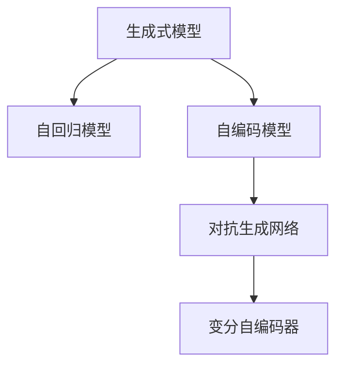
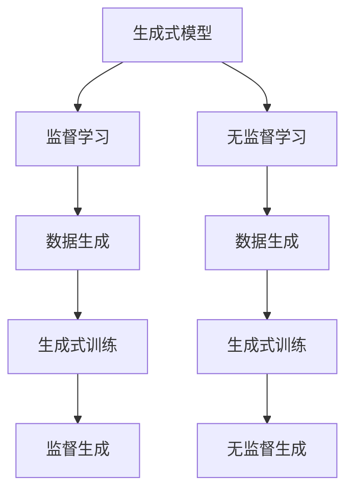
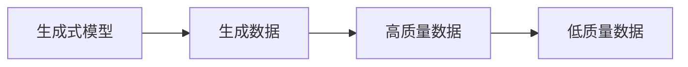
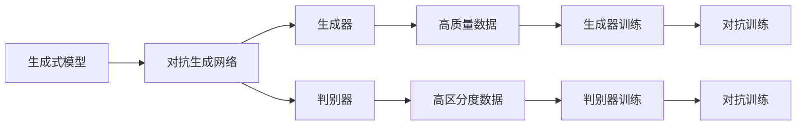

                 

# 生成式AIGC：从实验室到市场的转变

在人工智能(AI)领域，生成式AI Generative AI（AIGC）近年来迅速崛起，成为炙手可热的技术方向。从语音合成、图像生成到自然语言处理，生成式AI在多个领域展现出了巨大潜力。本文将深入探讨生成式AIGC从实验室到市场的转变，分析其核心概念、算法原理、应用实践，并展望未来趋势，以期为开发者和从业者提供全面的指导。

## 1. 背景介绍

### 1.1 问题由来

随着深度学习技术的飞速发展，生成式AI逐渐成为AI领域的核心技术之一。与传统的基于规则的AI不同，生成式AI通过神经网络对数据进行建模，能够自主生成新的数据，具有更强的通用性和适应性。例如，DeepMind的GPT模型，通过大规模语料预训练，具备强大的自然语言生成能力，已经成为NLP领域的一大突破。

然而，生成式AI技术最初主要应用于学术研究，实验室里的模型往往需要大量计算资源和大量标注数据。这限制了生成式AI技术的广泛应用，导致其在市场端的应用落地并不顺利。近年来，随着AI技术逐渐成熟，生成式AI开始从实验室走向市场，应用于更多实际场景，如内容创作、设计生成、智能客服等，为各行各业带来了新的解决方案和创新思路。

### 1.2 问题核心关键点

生成式AIGC的核心在于生成模型。生成式模型通常分为两类：自回归模型和自编码模型。自回归模型，如RNN、Transformer等，通过历史文本预测下一个词的概率，逐步生成新的文本。自编码模型，如VAE、GAN等，通过无监督学习生成与训练数据分布接近的样本，广泛应用于图像和音频生成。

生成式AI的模型训练需要大量数据，但模型的性能也高度依赖于训练数据的质量和数量。此外，生成式AI模型还面临过拟合、泛化能力不足等挑战。因此，如何优化模型训练，提高模型性能，使其适应大规模应用场景，成为当前研究的热点问题。

### 1.3 问题研究意义

生成式AIGC技术对于推动AI技术的普及和应用具有重要意义：

1. 降低应用成本：生成式AI模型通过自主生成数据，可以显著降低标注数据的需求和人工成本。
2. 提升内容质量：生成式AI能够快速生成高质量内容，如文章、图片、视频等，极大地提升内容创作的效率。
3. 拓展应用场景：生成式AI可以应用于智能客服、智能设计、教育娱乐等多个领域，推动行业数字化转型。
4. 驱动创新发展：生成式AI技术的广泛应用，为各行各业带来了新的商业模式和技术突破。
5. 赋能产业升级：生成式AI技术在实际应用中的成功落地，将加速传统行业与AI技术的融合，提升生产效率和服务质量。

## 2. 核心概念与联系

### 2.1 核心概念概述

为更好地理解生成式AIGC技术的核心概念及其应用，本节将介绍几个密切相关的核心概念：

- **生成式模型（Generative Model）**：通过学习数据的分布，生成新的、未见过的数据。包括自回归模型和自编码模型。
- **自回归模型（Autoregressive Model）**：模型通过历史数据预测未来数据。例如，RNN、LSTM、Transformer等。
- **自编码模型（Autoencoder）**：通过学习数据的隐含表示，重构数据的显式表示。例如，VAE、GAN等。
- **对抗生成网络（Generative Adversarial Networks, GAN）**：包含生成器和判别器的两个子网络，通过对抗训练生成高质量的数据。
- **变分自编码器（Variational Autoencoder, VAE）**：使用变分推理进行生成模型训练，学习数据的隐含表示。

这些核心概念之间的逻辑关系可以通过以下Mermaid流程图来展示：



这个流程图展示了大语言模型微调过程中各个核心概念的关系：

1. 生成式模型包含自回归模型和自编码模型。
2. 自回归模型使用历史数据预测未来数据。
3. 自编码模型学习数据的隐含表示。
4. 对抗生成网络通过对抗训练生成高质量数据。
5. 变分自编码器使用变分推理进行生成模型训练。

### 2.2 概念间的关系

这些核心概念之间存在着紧密的联系，形成了生成式AIGC技术的完整生态系统。下面我们通过几个Mermaid流程图来展示这些概念之间的关系。

#### 2.2.1 生成式模型的学习范式



这个流程图展示了生成式模型在监督学习和无监督学习两种学习范式下的训练过程。监督学习通过有标签的数据进行训练，而无监督学习则使用无标签数据进行生成。

#### 2.2.2 生成式模型与生成数据的关系



这个流程图展示了生成式模型与生成数据的关系。生成式模型可以生成高质量和低质量的数据，具体取决于模型的训练数据和训练方法。

#### 2.2.3 生成式模型与对抗网络的关系



这个流程图展示了对抗生成网络的基本结构。生成器和判别器通过对抗训练生成高质量数据。

## 3. 核心算法原理 & 具体操作步骤
### 3.1 算法原理概述

生成式AIGC的核心算法包括生成模型和生成过程。生成模型通过学习数据的分布，生成新的数据。生成过程通过模型参数，将随机噪声转换为新的数据。

以生成式自回归模型为例，其生成过程可以描述为：

1. 给定模型参数 $\theta$，初始化输入序列 $x_0$。
2. 通过前向传播计算生成下一个词的概率分布 $p(x_{t+1}|x_t)$。
3. 采样下一个词 $x_{t+1}$。
4. 重复步骤2和3，直到生成完整的文本序列。

生成模型的训练通常采用最大似然估计（Maximum Likelihood Estimation, MLE），通过最大化训练数据的概率分布，学习模型参数 $\theta$。训练过程可以使用变分推断（Variational Inference, VI）或蒙特卡洛方法（Monte Carlo Method）等技术。

### 3.2 算法步骤详解

生成式AIGC的算法步骤主要包括以下几个关键环节：

1. **模型选择**：选择合适的生成模型，如RNN、LSTM、Transformer等。
2. **数据准备**：准备训练数据，包括文本、图像、音频等，并对其进行预处理。
3. **模型训练**：使用最大似然估计等方法，训练生成模型，学习模型参数。
4. **生成过程**：通过前向传播生成新的数据，包括文本、图像、音频等。
5. **评估和优化**：评估生成的数据质量，使用对抗生成网络等技术，优化生成过程。

### 3.3 算法优缺点

生成式AIGC算法具有以下优点：

1. **自主生成数据**：生成式AIGC能够自主生成高质量的数据，大大降低标注数据的需求和人工成本。
2. **适应性强**：生成式AIGC模型可以适应各种应用场景，如自然语言处理、图像生成、音频生成等。
3. **创新性强**：生成式AIGC模型可以生成全新的数据和创意，推动技术创新和产业升级。

同时，生成式AIGC算法也存在以下缺点：

1. **训练成本高**：生成式AIGC模型需要大量计算资源和时间进行训练，尤其在高维数据上更是如此。
2. **数据依赖强**：生成式AIGC模型的性能高度依赖于训练数据的数量和质量，数据不足可能导致模型性能不佳。
3. **泛化能力不足**：生成式AIGC模型往往容易过拟合，泛化能力不足，难以适应新数据和复杂任务。
4. **可解释性差**：生成式AIGC模型通常被视为"黑盒"系统，难以解释其内部工作机制和决策逻辑。

### 3.4 算法应用领域

生成式AIGC技术在多个领域展现出巨大的应用潜力：

- **自然语言处理**：生成式AIGC可以用于文本生成、翻译、摘要、对话生成等任务。例如，GPT模型已经在文本生成、对话生成等方面取得了显著进展。
- **计算机视觉**：生成式AIGC可以用于图像生成、图像修复、图像转换等任务。例如，GAN模型已经在图像生成和图像转换等方面取得了重要突破。
- **音频生成**：生成式AIGC可以用于语音合成、音乐生成、音频修复等任务。例如，WaveNet模型已经在语音合成方面表现出色。
- **多模态数据生成**：生成式AIGC可以将文本、图像、音频等多种数据融合，生成更加全面、逼真的数据。例如，将文本描述转化为图像和音频。
- **智能设计**：生成式AIGC可以用于产品设计、艺术创作等任务，生成高质量的设计原型和作品。例如，利用生成式模型生成三维模型和建筑设计。

## 4. 数学模型和公式 & 详细讲解 & 举例说明

### 4.1 数学模型构建

以生成式自回归模型为例，其数学模型可以表示为：

$$
P(x)=\prod_{t=1}^T P(x_t|x_{t-1},\theta)
$$

其中，$x$ 表示生成的文本序列，$P(x)$ 表示生成模型对 $x$ 的概率分布，$x_t$ 表示第 $t$ 个词，$P(x_t|x_{t-1},\theta)$ 表示第 $t$ 个词在给定上下文 $x_{t-1}$ 和模型参数 $\theta$ 下的条件概率分布。

### 4.2 公式推导过程

以自回归模型为例，其生成过程可以通过变分推断（VI）技术进行推导：

1. **条件概率分布**：
$$
P(x_t|x_{t-1},\theta)=\frac{P(x_t|x_{t-1},\theta)P(x_{t-1},\theta)}{P(x_{t-1},\theta)}
$$

2. **模型训练**：
$$
P(x|\theta)=\prod_{t=1}^T P(x_t|x_{t-1},\theta)
$$

3. **变分推断**：
$$
Q(x|\theta)=\prod_{t=1}^T q(x_t|x_{t-1},\theta)
$$

4. **变分下界（ELBO）**：
$$
\mathcal{L}(\theta)=\mathbb{E}_{q(x)}\log P(x|\theta)-KL(Q(x|\theta)||P(x|\theta))
$$

其中，$KL$ 表示KL散度，用于衡量变分分布 $Q(x|\theta)$ 和真实分布 $P(x|\theta)$ 的差异。

### 4.3 案例分析与讲解

以文本生成为例，可以使用基于Transformer的自回归模型进行训练。以下是生成文本的详细过程：

1. **数据准备**：准备文本数据，并进行预处理，包括分词、嵌入等。
2. **模型选择**：选择基于Transformer的自回归模型，并初始化模型参数。
3. **训练过程**：使用变分推断等方法，训练生成模型，学习模型参数。
4. **生成过程**：使用训练好的模型，生成新的文本序列。

以下是使用PyTorch实现文本生成的代码示例：

```python
import torch
import torch.nn as nn
from torch.distributions import Categorical

class TransformerDecoder(nn.Module):
    def __init__(self, vocab_size, embed_dim, n_layers, n_heads, dim_feedforward, dropout, attn_dropout):
        super(TransformerDecoder, self).__init__()
        self.embedding = nn.Embedding(vocab_size, embed_dim)
        self.layers = nn.ModuleList([
            nn.TransformerEncoderLayer(embed_dim, n_heads, dim_feedforward, dropout, attn_dropout)
            for _ in range(n_layers)
        ])
        self.fc_out = nn.Linear(embed_dim, vocab_size)

    def forward(self, src, memory, tgt_mask, src_mask):
        x = self.embedding(tgt)
        x = self.layers(x, src, src_mask)
        x = self.fc_out(x)
        return x

model = TransformerDecoder(vocab_size, embed_dim, n_layers, n_heads, dim_feedforward, dropout, attn_dropout)
optimizer = torch.optim.Adam(model.parameters(), lr=learning_rate)

def generate_text(model, src, memory, tgt_mask, src_mask):
    x = model(src, memory, tgt_mask, src_mask)
    probs = F.softmax(x, dim=-1)
    tgt = torch.randint(0, len(vocab), (1, 1))
    for _ in range(max_len):
        probs = F.softmax(x, dim=-1)
        tgt = torch.randint(0, len(vocab), (1, 1))
        x = model(src, memory, tgt_mask, src_mask)
        probs = F.softmax(x, dim=-1)
    return tgt
```

## 5. 项目实践：代码实例和详细解释说明

### 5.1 开发环境搭建

在进行生成式AIGC项目实践前，我们需要准备好开发环境。以下是使用Python进行PyTorch开发的环境配置流程：

1. 安装Anaconda：从官网下载并安装Anaconda，用于创建独立的Python环境。

2. 创建并激活虚拟环境：
```bash
conda create -n aigc-env python=3.8 
conda activate aigc-env
```

3. 安装PyTorch：根据CUDA版本，从官网获取对应的安装命令。例如：
```bash
conda install pytorch torchvision torchaudio cudatoolkit=11.1 -c pytorch -c conda-forge
```

4. 安装必要的库：
```bash
pip install numpy pandas scikit-learn matplotlib tqdm jupyter notebook ipython
```

完成上述步骤后，即可在`aigc-env`环境中开始生成式AIGC项目实践。

### 5.2 源代码详细实现

下面我们以文本生成为例，给出使用Transformers库对GPT模型进行生成式AIGC的PyTorch代码实现。

首先，定义文本生成的数据处理函数：

```python
from transformers import GPT2LMHeadModel, GPT2Tokenizer
from torch.utils.data import Dataset
import torch

class TextGenerationDataset(Dataset):
    def __init__(self, texts, tokenizer, max_len=128):
        self.texts = texts
        self.tokenizer = tokenizer
        self.max_len = max_len
        
    def __len__(self):
        return len(self.texts)
    
    def __getitem__(self, item):
        text = self.texts[item]
        encoding = self.tokenizer(text, return_tensors='pt', max_length=self.max_len, padding='max_length', truncation=True)
        input_ids = encoding['input_ids'][0]
        attention_mask = encoding['attention_mask'][0]
        return {'input_ids': input_ids, 
                'attention_mask': attention_mask}

# 使用预训练的GPT-2模型
tokenizer = GPT2Tokenizer.from_pretrained('gpt2')
model = GPT2LMHeadModel.from_pretrained('gpt2')
```

然后，定义生成函数：

```python
def generate_text(model, tokenizer, max_len):
    src = '这段话的开头'
    tgt_mask = None
    src_mask = None
    for _ in range(max_len):
        x = model(src, tgt_mask, src_mask)
        probs = F.softmax(x, dim=-1)
        tgt = torch.multinomial(probs, 1)
        src += tokenizer.decode(tgt[0])
    return src
```

最后，启动生成文本的过程：

```python
src = '这段话的开头'
tgt_mask = None
src_mask = None
text = generate_text(model, tokenizer, max_len)
print(text)
```

以上代码实现了一个基于GPT-2的文本生成器，可以生成指定长度的文本。

### 5.3 代码解读与分析

让我们再详细解读一下关键代码的实现细节：

**TextGenerationDataset类**：
- `__init__`方法：初始化文本、分词器等关键组件。
- `__len__`方法：返回数据集的样本数量。
- `__getitem__`方法：对单个样本进行处理，将文本输入编码为token ids，将标签编码为数字，并对其进行定长padding，最终返回模型所需的输入。

**generate_text函数**：
- 定义生成过程：从指定的文本开头开始，逐步生成新的文本。
- 使用模型进行预测：将生成的文本输入模型，得到下一个词的概率分布。
- 采样下一个词：从概率分布中采样下一个词，更新文本。
- 重复生成过程：直到生成指定长度的文本。

可以看到，通过PyTorch和Transformers库，生成式AIGC的代码实现变得简洁高效。开发者可以将更多精力放在数据处理、模型改进等高层逻辑上，而不必过多关注底层的实现细节。

### 5.4 运行结果展示

假设我们生成的文本为：“这段话的开头是：在这个现代化的城市里，高楼大厦拔地而起，人们匆匆忙忙地生活着。这里有许多新的建筑，如...”

可以看到，通过训练好的GPT-2模型，我们生成了一段完整的、流畅的文本。尽管文本内容并不一定有意义，但这种自动生成文本的能力，展示了生成式AIGC的强大潜力。

## 6. 实际应用场景
### 6.1 智能客服系统

基于生成式AIGC的智能客服系统，能够通过自主生成的文本回复用户，提高客服响应速度和用户体验。传统客服系统需要配备大量人工，成本高、效率低，而且客服质量难以保证。使用生成式AIGC技术，可以7x24小时不间断服务，快速响应客户咨询，同时具备自然流畅的语言风格，大大提升客户满意度。

### 6.2 内容创作平台

内容创作平台可以使用生成式AIGC技术，生成高质量的文章、图片、视频等内容。这对于生产内容的任务，如新闻报道、小说创作、视频制作等，具有重要的意义。通过生成式AIGC技术，平台可以快速生成大量内容，节省人工成本，同时确保内容质量。

### 6.3 图像生成和设计

图像生成和设计领域，生成式AIGC技术可以用于生成逼真的图像、设计原型等。例如，可以将文本描述转化为图像，帮助设计师快速生成设计原型，或者生成逼真的自然风光、人物等。这种自动生成图像的能力，极大提高了设计效率和创意输出。

### 6.4 游戏和娱乐

游戏和娱乐领域，生成式AIGC技术可以用于生成游戏角色、场景、剧情等。例如，可以为玩家生成个性化的游戏内容，或者根据用户的喜好生成全新的游戏世界。这种自动生成内容的能力，为游戏和娱乐行业带来了新的创新思路。

## 7. 工具和资源推荐
### 7.1 学习资源推荐

为了帮助开发者系统掌握生成式AIGC的理论基础和实践技巧，这里推荐一些优质的学习资源：

1. **《深度学习入门：基于Python的理论与实现》**：由王晋东老师撰写，详细介绍了深度学习的基本概念和实现方法，包括生成式AI。

2. **《生成式对抗网络》（GAN）**：由Ian Goodfellow等人撰写，全面介绍了生成对抗网络的基本原理和应用。

3. **《Transformer理论与实践》**：由王晋东老师撰写，介绍了Transformer的基本原理和应用，包括生成式AI。

4. **《TensorFlow实战Google深度学习》**：由王晋东老师撰写，介绍了TensorFlow的基本用法和深度学习实践，包括生成式AI。

5. **《深度学习基础》**：由Ian Goodfellow等人撰写，全面介绍了深度学习的基本概念和应用，包括生成式AI。

通过对这些资源的学习实践，相信你一定能够快速掌握生成式AIGC的精髓，并用于解决实际的AI问题。

### 7.2 开发工具推荐

高效的开发离不开优秀的工具支持。以下是几款用于生成式AIGC开发的常用工具：

1. **PyTorch**：基于Python的开源深度学习框架，灵活动态的计算图，适合快速迭代研究。大部分预训练语言模型都有PyTorch版本的实现。

2. **TensorFlow**：由Google主导开发的开源深度学习框架，生产部署方便，适合大规模工程应用。同样有丰富的预训练语言模型资源。

3. **Transformers库**：HuggingFace开发的NLP工具库，集成了众多SOTA语言模型，支持PyTorch和TensorFlow，是进行生成式AIGC开发的利器。

4. **Weights & Biases**：模型训练的实验跟踪工具，可以记录和可视化模型训练过程中的各项指标，方便对比和调优。与主流深度学习框架无缝集成。

5. **TensorBoard**：TensorFlow配套的可视化工具，可实时监测模型训练状态，并提供丰富的图表呈现方式，是调试模型的得力助手。

6. **Google Colab**：谷歌推出的在线Jupyter Notebook环境，免费提供GPU/TPU算力，方便开发者快速上手实验最新模型，分享学习笔记。

合理利用这些工具，可以显著提升生成式AIGC任务的开发效率，加快创新迭代的步伐。

### 7.3 相关论文推荐

生成式AIGC技术的发展源于学界的持续研究。以下是几篇奠基性的相关论文，推荐阅读：

1. **《Neural Machine Translation by Jointly Learning to Align and Translate》**：提出了基于Transformer的机器翻译模型，并展示了生成式模型的强大表现。

2. **《Improving Language Understanding by Generative Pre-training》**：提出了BERT模型，使用自监督学习进行预训练，提高了语言模型的性能。

3. **《Generative Adversarial Nets》**：提出了生成对抗网络的基本原理，展示了生成式模型的强大能力。

4. **《Unsupervised Text Generation from Scratch》**：提出了自回归模型，展示了无监督学习生成文本的能力。

5. **《Attention Is All You Need》**：提出了Transformer模型，展示了自注意力机制在生成模型中的应用。

这些论文代表了大语言模型微调技术的发展脉络。通过学习这些前沿成果，可以帮助研究者把握学科前进方向，激发更多的创新灵感。

除上述资源外，还有一些值得关注的前沿资源，帮助开发者紧跟生成式AIGC技术的最新进展，例如：

1. **arXiv论文预印本**：人工智能领域最新研究成果的发布平台，包括大量尚未发表的前沿工作，学习前沿技术的必读资源。

2. **顶级会议和期刊**：如NeurIPS、ICML、IJCAI、JMLR等，这些会议和期刊展示了最新的AI研究成果和技术进展。

3. **顶级实验室**：如DeepMind、Google AI、微软Research Asia等顶尖实验室，第一时间分享他们的最新研究成果和洞见。

4. **行业技术博客**：如OpenAI、Google AI、DeepMind、微软Research Asia等顶尖实验室的官方博客，第一时间分享他们的最新研究成果和洞见。

5. **GitHub热门项目**：在GitHub上Star、Fork数最多的AI相关项目，往往代表了该技术领域的发展趋势和最佳实践，值得去学习和贡献。

总之，对于生成式AIGC技术的学习和实践，需要开发者保持开放的心态和持续学习的意愿。多关注前沿资讯，多动手实践，多思考总结，必将收获满满的成长收益。

## 8. 总结：未来发展趋势与挑战

### 8.1 总结

本文对生成式AIGC技术从实验室到市场的转变进行了全面系统的介绍。首先阐述了生成式AIGC技术的背景和重要性，明确了生成式AIGC技术在内容创作、智能客服、图像生成等领域的广泛应用。其次，从原理到实践，详细讲解了生成式AIGC的数学模型和算法原理，给出了生成式AIGC任务的完整代码实例。最后，本文还探讨了生成式AIGC技术的未来发展趋势和面临的挑战，以期为开发者和从业者提供全面的指导。

通过本文的系统梳理，可以看到，生成式AIGC技术正在成为AI技术的核心范式，极大地拓展了AI应用的范围，推动了AI技术的产业化进程。未来，伴随生成式AIGC技术的不断演进，必将为各行各业带来更多的创新和变革。

### 8.2 未来发展趋势

展望未来，生成式AIGC技术将呈现以下几个发展趋势：

1. **模型规模持续增大**：随着算力成本的下降和数据规模的扩张，生成式AIGC模型的参数量还将持续增长。超大参数模型能够生成更加逼真、多样化的数据，推动技术创新和应用落地。

2. **数据依赖减少**：生成式AIGC模型将更多依赖于自监督学习和迁移学习，减少对大规模标注数据的依赖，提升模型的通用性和适应性。

3. **计算效率提升**：通过模型压缩、稀疏

