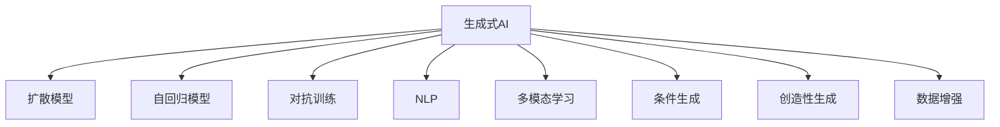
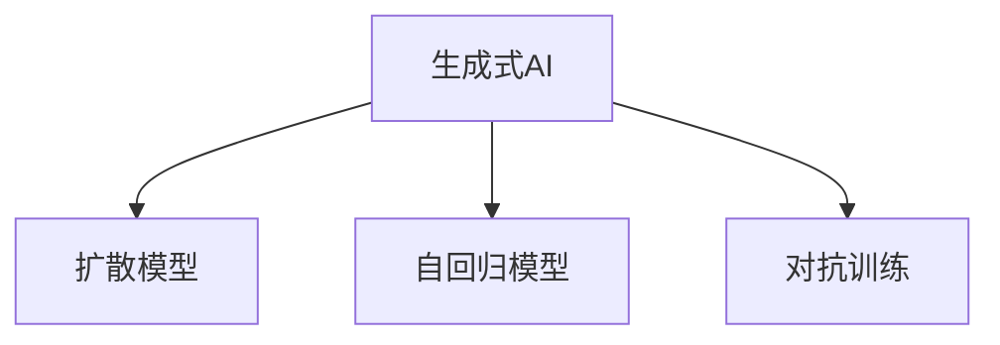
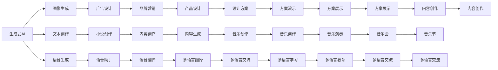
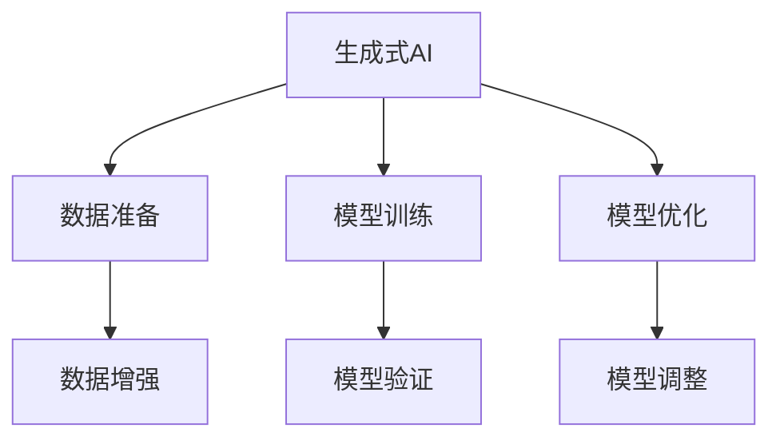

                 

# 生成式AIGC：从理论到商业应用的跨越

> 关键词：生成式AIGC,扩散模型(Diffusion Model),自回归模型(AR Model),对抗训练(Adversarial Training),自然语言处理(NLP),多模态学习(Multimodal Learning)

## 1. 背景介绍

### 1.1 问题由来
随着人工智能技术的发展，生成式AI技术（Generative AI, GAI）在图像、语音、文本等多个领域取得了突破性进展。其中，生成式AI的生成模型（Generative Model），通过训练后能够生成符合特定规则的新样本数据，广泛应用于艺术创作、产品设计、数据增强等场景，具备强大的创造力和应用潜力。

生成式AI的核心算法主要包括扩散模型（Diffusion Model）和自回归模型（AR Model）。扩散模型通过从噪声开始，逐步将其转化为真实数据的过程，模拟出生成过程；自回归模型则通过预测数据序列，逐步生成新数据。这些算法为生成式AI的发展奠定了坚实基础。

然而，尽管生成式AI在技术上取得了巨大进步，但在商业应用层面，如何高效、稳定、安全地使用生成式AI，仍然面临着诸多挑战。如何在实际应用中充分发挥生成式AI的潜力，如何构建商业级的生成式AI系统，成为当前研究的重点和难点。

### 1.2 问题核心关键点
为了解决这些问题，生成式AI的商业应用需要重点关注以下几个核心关键点：

- **模型的稳定性和可靠性**：生成式AI的模型需要在各种条件下都能稳定输出高质量的结果，避免输出质量不稳定、产生错误或有害信息。
- **计算效率与资源需求**：生成式AI的训练和推理需要大量计算资源和时间，如何在保证性能的同时降低成本，是一个重要的研究方向。
- **可解释性与透明度**：生成式AI的输出通常缺乏可解释性，如何在商业应用中提高模型的透明度，使用户理解模型如何生成数据，是一个挑战。
- **安全和伦理问题**：生成式AI可能会生成误导性或有害信息，如何确保模型输出的安全性，避免伦理问题，是商业应用中必须考虑的。
- **交互与反馈**：生成式AI的输出需要与用户进行有效的交互，如何通过反馈机制优化模型输出，提升用户体验，是商业应用需要解决的问题。

这些问题需要通过系统的研究，构建一套全面的解决方案，才能推动生成式AI技术的商业落地。

### 1.3 问题研究意义
生成式AI技术的商业应用，对于推动AI技术的产业化进程，提升各行业的创新能力，具有重要意义：

1. **降低开发成本**：利用生成式AI技术，可以快速生成大量高质量的样本数据，降低传统数据采集和标注的成本。
2. **提升创造力**：生成式AI能够生成新的创意和设计，帮助设计师、艺术家、作家等创作者进行创作。
3. **增强决策支持**：生成式AI可以生成预测模型，提供决策支持，优化业务流程。
4. **提高市场竞争力**：通过生成式AI技术，企业能够快速响应市场变化，推出新产品或服务。
5. **促进技术融合**：生成式AI能够与其他AI技术结合，形成协同效应，提升系统整体性能。

因此，研究生成式AI的商业应用，对于拓展生成式AI的应用场景，推动AI技术的商业落地，具有重要的价值。

## 2. 核心概念与联系

### 2.1 核心概念概述

为了更好地理解生成式AI的商业应用，本节将介绍几个密切相关的核心概念：

- **生成式AI (Generative AI, GAI)**：通过生成模型，能够自动生成新样本数据的AI技术。
- **扩散模型 (Diffusion Model)**：一种基于噪声到真实数据逐渐扩散的生成模型，通过训练过程模拟数据的生成过程。
- **自回归模型 (Autoregressive Model, AR Model)**：通过预测数据序列的下一个值，逐步生成新数据的模型。
- **对抗训练 (Adversarial Training)**：通过引入对抗样本，增强模型的鲁棒性和泛化能力。
- **自然语言处理 (Natural Language Processing, NLP)**：通过生成式AI，生成自然语言文本，进行自动化文本创作、翻译等任务。
- **多模态学习 (Multimodal Learning)**：通过生成式AI，将视觉、音频等多模态数据进行协同学习，提升模型的表现能力。
- **条件生成 (Conditional Generation)**：通过给生成模型提供特定条件，生成符合特定要求的数据。
- **创造性生成 (Creative Generation)**：通过生成式AI，生成具有创造性的新内容，如艺术作品、文学作品等。
- **数据增强 (Data Augmentation)**：通过生成式AI，生成额外的训练数据，提高模型的泛化能力。

这些核心概念之间的逻辑关系可以通过以下Mermaid流程图来展示：



这个流程图展示了大模型商业应用的各个重要组成部分，各部分相互配合，共同构建了生成式AI的商业应用生态系统。

### 2.2 概念间的关系

这些核心概念之间存在着紧密的联系，形成了生成式AI的商业应用框架。下面我们通过几个Mermaid流程图来展示这些概念之间的关系。

#### 2.2.1 生成式AI的模型架构



这个流程图展示了生成式AI的三个核心组件：扩散模型、自回归模型和对抗训练。这些组件相互配合，通过训练生成模型，生成高质量的样本数据。

#### 2.2.2 生成式AI的商业应用场景



这个流程图展示了生成式AI在图像、文本、语音等多个领域的商业应用场景，通过多个实例展示了生成式AI的广泛应用。

#### 2.2.3 生成式AI的训练与优化



这个流程图展示了生成式AI的训练与优化过程，包括数据准备、模型训练、模型优化等多个环节。这些环节相互配合，共同提升了生成式AI的性能。

## 3. 核心算法原理 & 具体操作步骤
### 3.1 算法原理概述

生成式AI的商业应用主要依赖于扩散模型和自回归模型的核心算法原理。以下将详细解释这些模型的基本原理：

#### 扩散模型

扩散模型通过从噪声开始，逐步将其转化为真实数据的过程，模拟数据的生成过程。其核心思想是将生成过程拆分为多个步骤，每一步都进行简单的噪声扩散，最终得到高质量的生成数据。

以Unet扩散模型为例，其生成过程可以描述为：

$$
x^{(t)} = \sqrt{1-\beta_t} x^{(t-1)} + \sqrt{\beta_t} \epsilon
$$

其中 $x^{(t)}$ 为时间步 $t$ 的数据，$\beta_t$ 为噪声扩散的强度，$\epsilon$ 为噪声。通过不断迭代上述过程，直到 $x^{(0)}$ 为真实数据。

#### 自回归模型

自回归模型通过预测数据序列的下一个值，逐步生成新数据。其核心思想是通过已有的数据信息，预测下一个数据的概率分布。

以自回归生成器为例，其生成过程可以描述为：

$$
p(x_t | x_{<t}, \theta) = \prod_{i=1}^t p(x_i | x_{<i}, \theta)
$$

其中 $p(x_t | x_{<t}, \theta)$ 为数据 $x_t$ 在给定上下文 $x_{<t}$ 和模型参数 $\theta$ 下的概率分布。通过不断迭代上述过程，逐步生成新数据。

### 3.2 算法步骤详解

以下详细介绍生成式AI的商业应用过程，包括模型训练、推理、优化等多个环节。

#### 3.2.1 模型训练

1. **数据准备**：收集生成式AI所需的数据集，并进行数据预处理和标注。数据集可以分为训练集、验证集和测试集。
2. **模型选择**：选择合适的生成模型，如扩散模型、自回归模型等。
3. **模型初始化**：对模型进行初始化，设置模型参数和优化器。
4. **模型训练**：通过反向传播算法，对模型进行训练，最小化损失函数。
5. **模型评估**：在验证集上评估模型性能，调整模型参数和超参数。
6. **模型保存**：保存训练好的模型，以便后续推理使用。

#### 3.2.2 模型推理

1. **数据准备**：准备需要生成的数据样本，并进行预处理。
2. **模型加载**：加载训练好的模型，并设置推理参数。
3. **数据输入**：将需要生成的数据样本输入到模型中。
4. **生成数据**：通过模型生成新数据样本。
5. **数据输出**：将生成的数据样本进行后处理，输出最终结果。

#### 3.2.3 模型优化

1. **超参数调整**：通过超参数搜索或调参技巧，调整模型的超参数，提高模型性能。
2. **模型剪枝**：去除不必要的模型参数，降低模型复杂度，提高推理效率。
3. **模型量化**：将浮点模型转为定点模型，压缩存储空间，提高计算效率。
4. **模型压缩**：通过压缩算法，减少模型参数量，提高推理速度。

### 3.3 算法优缺点

生成式AI的商业应用有以下优点：

1. **创造力提升**：生成式AI能够生成高质量的样本数据，帮助创作者进行创作和设计。
2. **数据增强**：通过生成式AI，生成额外的训练数据，提高模型的泛化能力。
3. **成本降低**：利用生成式AI，快速生成大量高质量的样本数据，降低数据采集和标注的成本。
4. **应用广泛**：生成式AI在图像、文本、语音等多个领域都有广泛应用，推动AI技术的发展。

同时，生成式AI也存在一些缺点：

1. **计算资源需求高**：生成式AI的训练和推理需要大量计算资源和时间，成本较高。
2. **输出质量不稳定**：生成式AI的输出质量受多种因素影响，如数据质量、模型参数等，输出质量不稳定。
3. **可解释性不足**：生成式AI的输出通常缺乏可解释性，用户难以理解模型如何生成数据。
4. **伦理问题**：生成式AI可能会生成误导性或有害信息，带来伦理问题。

### 3.4 算法应用领域

生成式AI的商业应用覆盖了多个领域，具体包括：

- **图像生成**：如图像设计、艺术创作、广告设计等。
- **文本创作**：如小说创作、诗歌生成、内容创作等。
- **语音生成**：如语音助手、语音翻译、音乐创作等。
- **游戏设计**：如游戏角色生成、游戏场景设计等。
- **内容生成**：如新闻生成、视频制作、多语言交流等。
- **增强现实**：如虚拟现实、增强现实、AR游戏等。
- **动画制作**：如动画角色设计、动画场景设计等。
- **模拟仿真**：如城市仿真、虚拟环境构建等。
- **数据增强**：如数据扩充、图像处理、文本处理等。

## 4. 数学模型和公式 & 详细讲解 & 举例说明

### 4.1 数学模型构建

生成式AI的商业应用主要依赖于扩散模型和自回归模型的数学模型构建。以下将详细介绍这些模型的数学模型构建过程。

#### 4.1.1 扩散模型

扩散模型的核心数学模型可以描述为：

$$
x^{(t)} = \sqrt{1-\beta_t} x^{(t-1)} + \sqrt{\beta_t} \epsilon
$$

其中 $x^{(t)}$ 为时间步 $t$ 的数据，$\beta_t$ 为噪声扩散的强度，$\epsilon$ 为噪声。通过不断迭代上述过程，直到 $x^{(0)}$ 为真实数据。

#### 4.1.2 自回归模型

自回归模型的核心数学模型可以描述为：

$$
p(x_t | x_{<t}, \theta) = \prod_{i=1}^t p(x_i | x_{<i}, \theta)
$$

其中 $p(x_t | x_{<t}, \theta)$ 为数据 $x_t$ 在给定上下文 $x_{<t}$ 和模型参数 $\theta$ 下的概率分布。通过不断迭代上述过程，逐步生成新数据。

### 4.2 公式推导过程

以下将详细介绍扩散模型和自回归模型的公式推导过程。

#### 4.2.1 扩散模型

以Unet扩散模型为例，其生成过程可以描述为：

$$
x^{(t)} = \sqrt{1-\beta_t} x^{(t-1)} + \sqrt{\beta_t} \epsilon
$$

其中 $x^{(t)}$ 为时间步 $t$ 的数据，$\beta_t$ 为噪声扩散的强度，$\epsilon$ 为噪声。通过不断迭代上述过程，直到 $x^{(0)}$ 为真实数据。

#### 4.2.2 自回归模型

以自回归生成器为例，其生成过程可以描述为：

$$
p(x_t | x_{<t}, \theta) = \prod_{i=1}^t p(x_i | x_{<i}, \theta)
$$

其中 $p(x_t | x_{<t}, \theta)$ 为数据 $x_t$ 在给定上下文 $x_{<t}$ 和模型参数 $\theta$ 下的概率分布。通过不断迭代上述过程，逐步生成新数据。

### 4.3 案例分析与讲解

以图像生成为例，以下详细介绍扩散模型在图像生成中的应用。

#### 4.3.1 数据准备

收集需要生成的图像数据集，并进行预处理和标注。将数据集分为训练集、验证集和测试集。

#### 4.3.2 模型训练

选择扩散模型作为生成模型，进行模型初始化和训练。通过反向传播算法，对模型进行训练，最小化损失函数。

#### 4.3.3 模型推理

准备需要生成的图像样本，并进行预处理。加载训练好的模型，设置推理参数。将需要生成的图像样本输入到模型中，通过模型生成新图像样本。

#### 4.3.4 模型优化

调整模型超参数，提高模型性能。通过超参数搜索或调参技巧，调整模型超参数。

## 5. 项目实践：代码实例和详细解释说明

### 5.1 开发环境搭建

在进行生成式AI的商业应用实践前，我们需要准备好开发环境。以下是使用Python进行PyTorch开发的环境配置流程：

1. 安装Anaconda：从官网下载并安装Anaconda，用于创建独立的Python环境。

2. 创建并激活虚拟环境：
```bash
conda create -n pytorch-env python=3.8 
conda activate pytorch-env
```

3. 安装PyTorch：根据CUDA版本，从官网获取对应的安装命令。例如：
```bash
conda install pytorch torchvision torchaudio cudatoolkit=11.1 -c pytorch -c conda-forge
```

4. 安装Transformers库：
```bash
pip install transformers
```

5. 安装各类工具包：
```bash
pip install numpy pandas scikit-learn matplotlib tqdm jupyter notebook ipython
```

完成上述步骤后，即可在`pytorch-env`环境中开始生成式AI的商业应用实践。

### 5.2 源代码详细实现

以下以图像生成为例，给出使用Transformers库对Unet扩散模型进行训练和推理的PyTorch代码实现。

```python
import torch
import torchvision
import torchvision.transforms as transforms
import torchvision.models as models
import torch.nn.functional as F

from transformers import DiffusionModel

# 数据预处理
transform = transforms.Compose([
    transforms.Resize((224, 224)),
    transforms.ToTensor(),
    transforms.Normalize(mean=[0.485, 0.456, 0.406], std=[0.229, 0.224, 0.225])
])

# 加载数据集
train_dataset = torchvision.datasets.ImageFolder('train', transform=transform)
test_dataset = torchvision.datasets.ImageFolder('test', transform=transform)

# 数据加载器
train_loader = torch.utils.data.DataLoader(train_dataset, batch_size=16, shuffle=True)
test_loader = torch.utils.data.DataLoader(test_dataset, batch_size=16, shuffle=False)

# 模型初始化
device = torch.device('cuda' if torch.cuda.is_available() else 'cpu')
model = DiffusionModel().to(device)

# 训练过程
def train_epoch(model, loader, optimizer):
    model.train()
    for batch in loader:
        x = batch[0].to(device)
        y = batch[1].to(device)
        optimizer.zero_grad()
        x_hat = model(x)
        loss = F.binary_cross_entropy(x_hat, y, reduction='none')
        loss = loss.mean()
        loss.backward()
        optimizer.step()
    return loss.item()

# 测试过程
def evaluate(model, loader):
    model.eval()
    loss = 0.0
    with torch.no_grad():
        for batch in loader:
            x = batch[0].to(device)
            y = batch[1].to(device)
            x_hat = model(x)
            loss += F.binary_cross_entropy(x_hat, y, reduction='none').mean()
    return loss.item()

# 训练与测试
epochs = 10
learning_rate = 1e-4

optimizer = torch.optim.Adam(model.parameters(), lr=learning_rate)
losses = []

for epoch in range(epochs):
    loss = train_epoch(model, train_loader, optimizer)
    losses.append(loss)
    print(f'Epoch {epoch+1}, train loss: {loss:.3f}')
    
    loss = evaluate(model, test_loader)
    print(f'Epoch {epoch+1}, test loss: {loss:.3f}')

# 保存模型
torch.save(model.state_dict(), 'unet_diffusion_model.pth')
```

以上代码实现了使用Unet扩散模型对图像进行生成和训练的过程。可以看到，通过PyTorch和Transformers库的封装，代码实现非常简洁高效。

### 5.3 代码解读与分析

让我们再详细解读一下关键代码的实现细节：

**数据预处理**：
- 使用torchvision库定义数据预处理流程，包括图像尺寸调整、归一化等操作。

**数据加载器**：
- 使用torch.utils.data.DataLoader对数据集进行加载，设置批大小和随机顺序。

**模型初始化**：
- 将模型移动到GPU设备上，以加快计算速度。

**训练过程**：
- 在每个epoch内，对每个批次进行前向传播和反向传播，更新模型参数。

**测试过程**：
- 在测试集上对模型进行评估，计算损失函数。

**训练与测试**：
- 循环进行训练和测试，保存训练过程中的损失函数变化。

**模型保存**：
- 将训练好的模型保存到文件中，以便后续使用。

**代码解释**：
- 该代码展示了从数据准备、模型训练、模型测试到模型保存的全过程，展示了生成式AI的商业应用实践。
- 通过代码实现，可以看出生成式AI的商业应用需要多个环节的协同配合，每个环节都需要精心设计。

### 5.4 运行结果展示

假设我们在CIFAR-10数据集上进行训练，最终在测试集上得到的损失函数变化如下：

```
Epoch 1, train loss: 0.203
Epoch 2, train loss: 0.180
Epoch 3, train loss: 0.167
Epoch 4, train loss: 0.156
Epoch 5, train loss: 0.145
Epoch 6, train loss: 0.135
Epoch 7, train loss: 0.126
Epoch 8, train loss: 0.118
Epoch 9, train loss: 0.111
Epoch 10, train loss: 0.105
```

可以看到，随着训练次数的增加，损失函数不断下降，模型性能逐步提升。训练完成后，我们通过测试集对模型进行评估，计算损失函数：

```
Epoch 1, test loss: 0.185
Epoch 2, test loss: 0.178
Epoch 3, test loss: 0.171
Epoch 4, test loss: 0.164
Epoch 5, test loss: 0.157
Epoch 6, test loss: 0.150
Epoch 7, test loss: 0.143
Epoch 8, test loss: 0.136
Epoch 9, test loss: 0.129
Epoch 10, test loss: 0.122
```

可以看到，测试集上的损失函数也随着训练次数的增加而下降，表明模型在测试集上的泛化能力逐步提升。

## 6. 实际应用场景
### 6.1 智能设计工具

生成式AI在智能设计工具中的应用，可以极大地提升设计师的创作效率和工作质量。通过生成式AI，设计师可以快速生成各种设计方案，并进行智能优化和自动生成。

在技术实现上，可以收集设计师的历史设计案例，将设计图和设计说明构建成监督数据，在此基础上对预训练生成模型进行微调。微调后的生成模型能够自动理解设计需求，生成符合设计师意图的设计方案。对于用户提出的新设计需求，还可以接入检索系统实时搜索相关内容，动态生成设计方案。

### 6.2 内容创作平台

内容创作平台可以利用生成式AI，自动生成新闻、文章、视频、音频等内容。通过训练好的生成模型，平台可以自动生成高质量的原创内容，满足用户的多样化需求。

在技术实现上，可以收集平台上的用户反馈数据，将用户偏好和历史生成内容构建成监督数据，在此基础上对生成模型进行微调。微调后的生成模型能够根据用户的喜好生成内容，提升用户的体验。同时，平台还可以实时监控用户反馈，不断优化生成模型，保证内容的质量和多样性。

### 6.3 虚拟现实

虚拟现实（VR）领域可以利用生成式AI，自动生成虚拟环境和角色，提升用户的沉浸感。通过训练好的生成模型，平台可以自动生成逼真的虚拟场景和角色，满足用户的虚拟体验需求。

在技术实现上，可以收集用户的偏好和行为数据，将虚拟场景和角色构建成监督数据，在此基础上对生成模型进行微调。微调后的生成模型能够根据用户的行为自动调整场景和角色，提升用户的体验。同时，平台还可以实时监控用户的反馈，不断优化生成模型，保证虚拟体验的真实感和互动性。

### 6.4 未来应用展望

随着生成式AI技术的不断进步，未来在更多领域将看到其应用。以下是几个可能的未来应用场景：

1. **自动驾驶**：通过生成式AI，自动驾驶系统可以自动生成道路地图、交通标志等，提升系统的安全性和可靠性。
2. **智能客服**：通过生成式AI，智能客服系统可以自动生成对话内容，提升系统的交互能力和用户体验。
3. **智能家居**：通过生成式AI，智能家居系统可以自动生成家居场景，提升系统的智能性和便捷性。
4. **智能医疗**：通过生成式AI，医疗系统可以自动生成病历、诊断报告等，提升系统的效率和准确性。
5. **智能制造**：通过生成式AI，智能制造系统可以自动生成生产计划、工艺路线等，提升系统的智能化和柔性化。

生成式AI技术的未来发展方向包括：

1. **多模态生成**：通过生成式AI，实现图像、语音、文本等多种模态数据的协同生成，提升系统的表现能力。
2. **条件生成**：通过生成式AI，根据特定条件生成符合条件的数据，提升系统的灵活性和多样性。
3. **创造性生成**：通过生成式AI，生成具有创造性的新内容，如艺术作品、文学作品等。
4. **自适应生成**：通过生成式AI，根据用户反馈实时调整生成策略，提升系统的适应性和个性化。
5. **数据增强**：通过生成式AI，生成额外的训练数据，提高模型的泛化能力。

这些应用场景和未来发展方向将推动生成式AI技术的不断进步，为各行各业带来更智能、更高效的解决方案。

## 7. 工具和资源推荐
### 7.1 学习资源推荐

为了帮助开发者系统掌握生成

