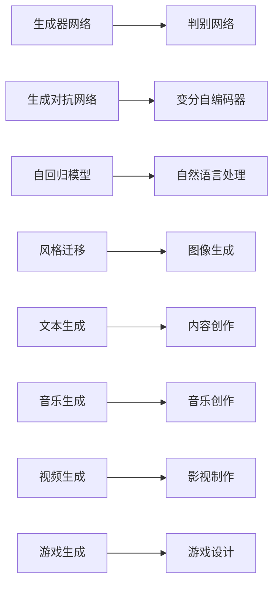
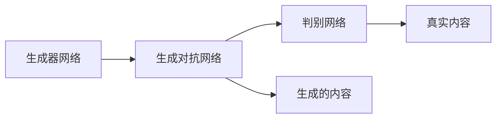
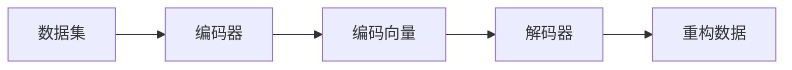
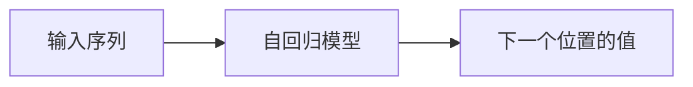
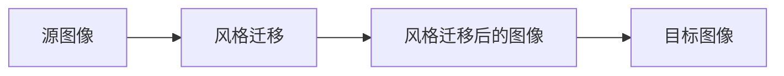
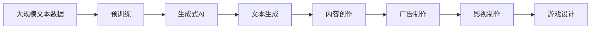

                 

# 生成式AIGC：改变商业模式的新引擎

> 关键词：生成式AIGC,人工智能(AI),自动生成内容(Automatic Content Generation),深度学习(Deep Learning),Transformer,无监督学习(Unsupervised Learning),内容生成(Create),可解释性(Explainability),创作激励(Incentives),版权(Copyright),商业创新(Commercial Innovation)

## 1. 背景介绍

### 1.1 问题由来
近年来，随着人工智能(AI)技术的飞速发展，尤其是深度学习(Deep Learning)、生成对抗网络(GANs)等技术的突破，生成式人工智能(AI Generated Content, AIGC)成为引领行业变革的新引擎。生成式AI能够自动生成高质量的文本、图像、音频等，以低成本、高效率的方式满足人们对内容的需求，推动各个领域的创新和升级。

生成式AI的广泛应用，覆盖了内容创作、广告制作、影视娱乐、游戏开发、医疗诊断等多个行业，对商业模式带来了深远的影响。例如，内容创作行业通过生成式AI创作了大量原创内容，降低了内容生产成本；广告行业利用AI生成创意广告，优化广告投放效果；影视娱乐行业通过AI生成影视片段，加速影片制作流程。生成式AI的崛起，正逐步改变现有的商业模式，带来新的机遇和挑战。

### 1.2 问题核心关键点
生成式AI的核心技术包括生成模型、判别模型、训练数据集等。其中，生成模型负责生成内容，判别模型负责评估生成内容的真实性和质量，训练数据集则提供高质量的内容素材。常见的生成模型包括变分自编码器(VAE)、生成对抗网络(GAN)、自回归模型等，这些模型通过学习数据分布，生成与真实数据相似的内容。

生成式AI的应用范围非常广泛，涵盖图像生成、文本创作、音乐创作、游戏设计等多个领域。这些技术应用不仅提高了内容生成的效率和质量，还极大地降低了内容创作的人力成本和时间成本，为传统产业带来了新的生产方式。

### 1.3 问题研究意义
生成式AI技术的发展和应用，对提高内容创作的效率、质量和多样性具有重要意义。其核心在于利用深度学习等前沿技术，自动生成高质量的各类内容，为各行各业带来新的增长点。

生成式AI可以显著降低内容创作的成本，提高内容创作的效率，促进内容产业的数字化转型。同时，生成式AI还带来了新的创作激励机制，鼓励更多创作者参与内容创作，提升内容的多样性和创新性。

生成式AI的应用还可以帮助企业解决版权问题，减少版权纠纷，降低版权管理成本。此外，生成式AI还可以用于广告投放优化、影视制作加速、游戏设计创新等领域，为商业创新带来新的机会。

## 2. 核心概念与联系

### 2.1 核心概念概述

为更好地理解生成式AI的核心原理和应用场景，本节将介绍几个密切相关的核心概念：

- **生成式AI(AI Generated Content)**：指利用深度学习等技术自动生成文本、图像、音频等内容的技术，包括生成对抗网络(GAN)、变分自编码器(VAE)、自回归模型等。

- **判别网络(Discriminative Network)**：负责评估生成内容与真实内容之间的差异，常见的判别网络包括感知器、卷积神经网络(CNN)、循环神经网络(RNN)等。

- **生成对抗网络(GANs)**：一种基于对抗的生成模型，由生成器网络和判别器网络组成，通过对抗训练生成逼真的内容。

- **变分自编码器(VAEs)**：一种无监督学习算法，用于学习数据的概率分布，并生成与训练数据相似的新数据。

- **自回归模型(AR Model)**：一种生成模型，通过预测序列中当前位置的值来生成整个序列，常见于自然语言处理(NLP)中的文本生成。

- **风格迁移(Style Transfer)**：通过将一种风格的图像应用到另一幅图像上，生成风格不同的新图像。

这些核心概念之间存在着紧密的联系，共同构成了生成式AI的核心生态系统。下面通过一个Mermaid流程图来展示这些概念之间的关系：



这个流程图展示了大语言模型微调过程中各个核心概念的关系：

1. 生成器网络与判别网络共同构成了生成对抗网络，通过对抗训练生成逼真的内容。
2. 变分自编码器通过学习数据的概率分布，生成与训练数据相似的新数据。
3. 自回归模型通过预测序列中当前位置的值来生成整个序列，常见于文本生成。
4. 风格迁移将一种风格的图像应用到另一幅图像上，生成风格不同的新图像。
5. 文本生成用于内容创作，音乐生成用于音乐创作，视频生成用于影视制作，游戏生成用于游戏设计。

### 2.2 概念间的关系

这些核心概念之间存在着紧密的联系，形成了生成式AI的完整生态系统。下面我们通过几个Mermaid流程图来展示这些概念之间的关系。

#### 2.2.1 生成对抗网络的工作原理



这个流程图展示了生成对抗网络的基本原理。生成器网络负责生成内容，判别网络负责评估生成内容与真实内容之间的差异。生成器网络和判别网络通过对抗训练，逐步提高生成内容的质量。

#### 2.2.2 变分自编码器的工作原理



这个流程图展示了变分自编码器的工作原理。编码器将数据转换为低维的编码向量，解码器将编码向量转换为重构数据。变分自编码器通过最小化重构误差和编码向量分布与真实数据分布的差异，学习数据的概率分布。

#### 2.2.3 自回归模型的工作原理



这个流程图展示了自回归模型的工作原理。自回归模型通过预测序列中当前位置的值来生成整个序列。在NLP领域，自回归模型常用于文本生成、语音识别等任务。

#### 2.2.4 风格迁移的工作原理



这个流程图展示了风格迁移的工作原理。风格迁移将一种风格的图像应用到另一幅图像上，生成风格不同的新图像。风格迁移在图像处理、艺术创作等领域有着广泛的应用。

### 2.3 核心概念的整体架构

最后，我们用一个综合的流程图来展示这些核心概念在大语言模型微调过程中的整体架构：



这个综合流程图展示了从预训练到生成式AI的内容创作、广告制作、影视制作、游戏设计等完整过程。生成式AI技术通过自动生成文本、图像、音频等内容，为各行各业带来新的应用场景。

## 3. 核心算法原理 & 具体操作步骤
### 3.1 算法原理概述

生成式AI的核心技术主要包括生成模型和判别模型，其中生成模型的目标是学习数据分布，生成逼真的内容；判别模型的目标是评估生成内容与真实内容之间的差异。这些模型的训练过程通常使用无监督学习、对抗训练等方法。

生成式AI的训练过程可以分为以下几个步骤：

1. 数据预处理：将原始数据进行清洗、归一化、标准化等处理，转化为适合模型训练的格式。

2. 模型训练：使用生成模型和判别模型进行对抗训练，生成逼真的内容。

3. 评估与优化：使用评估指标如Inception Score、FID等评估生成内容的质量，不断调整模型参数进行优化。

4. 应用部署：将训练好的模型部署到实际应用中，生成高质量的内容。

### 3.2 算法步骤详解

下面我们以文本生成为例，详细讲解生成式AI的训练步骤：

#### 3.2.1 数据准备

生成式AI的训练数据集通常包含大量的文本数据，如维基百科、新闻报道、文学作品等。数据集需要进行清洗、分词、标准化等预处理步骤，以便模型能够高效地进行训练。

#### 3.2.2 生成模型训练

生成模型通常采用自回归模型，如GPT-3等。模型的训练过程分为两个阶段：预训练和微调。

- **预训练**：在大规模无标签文本数据上进行自监督学习，学习语言的基本规则和语法结构。

- **微调**：在特定任务的数据集上进行有监督学习，学习任务相关的知识，提高生成内容的质量。

#### 3.2.3 判别模型训练

判别模型通常采用循环神经网络(RNN)、卷积神经网络(CNN)等。判别模型的训练过程与生成模型类似，通过对抗训练生成逼真的内容。

#### 3.2.4 评估与优化

生成内容的质量可以通过多种指标进行评估，如Inception Score、FID等。评估指标可以帮助我们了解模型的生成能力，指导模型的优化方向。

#### 3.2.5 应用部署

训练好的生成模型可以部署到Web应用、移动应用等平台，生成高质量的文本、图像、音频等内容。部署过程中需要考虑模型的推理效率、资源消耗等问题，优化模型的性能。

### 3.3 算法优缺点

生成式AI技术具有以下优点：

1. 生成内容高质量：生成式AI能够自动生成高质量的文本、图像、音频等内容，减少了内容创作的人力成本和时间成本。

2. 适应性强：生成式AI可以适应各种不同的应用场景，如广告制作、影视制作、游戏设计等。

3. 成本低：生成式AI可以大幅降低内容创作的成本，提高了内容创作的效率和质量。

4. 内容多样化：生成式AI可以生成多种风格和主题的内容，丰富了内容创作的多样性。

然而，生成式AI技术也存在一些缺点：

1. 数据依赖性强：生成式AI的生成效果很大程度上依赖于训练数据的质量和数量。

2. 可解释性差：生成式AI的内容生成过程通常是"黑盒"的，难以解释其内部工作机制和决策逻辑。

3. 版权问题：生成式AI生成的内容可能涉及版权问题，需要慎重处理。

4. 内容质量不稳定：生成式AI生成的内容质量可能会受到训练数据的影响，有时生成效果不够理想。

5. 伦理问题：生成式AI生成的内容可能存在伦理问题，如不真实、有害、歧视性等，需要严格控制。

### 3.4 算法应用领域

生成式AI技术在多个领域得到了广泛应用，主要包括：

- **内容创作**：自动生成新闻报道、文学作品、广告文案等文本内容。

- **图像生成**：自动生成逼真的图像、视频等，用于游戏、影视、广告等领域。

- **音乐创作**：自动生成音乐作品、背景音乐等，用于影视、游戏、广告等领域。

- **自然语言处理(NLP)**：自动生成对话、翻译、摘要等文本内容，用于智能客服、智能翻译、文本摘要等领域。

- **影视制作**：自动生成影视片段、场景、角色等，用于影视制作和后期处理。

- **游戏设计**：自动生成游戏场景、角色、任务等，用于游戏开发和设计。

以上这些领域的应用展示了生成式AI技术的广泛前景和强大能力。

## 4. 数学模型和公式 & 详细讲解 & 举例说明
### 4.1 数学模型构建

生成式AI的训练过程可以抽象为一种优化问题，目标是最小化生成内容的损失函数。这里我们使用GANs模型进行讲解，但其他生成模型如VAEs、AR Model等原理类似。

假设生成模型为$G(z)$，判别模型为$D(x)$，其中$G(z)$将噪声向量$z$映射为生成的内容$x$，$D(x)$评估内容$x$的真实性。生成模型的训练目标是最小化判别器的损失函数，判别模型的训练目标是最小化生成内容的损失函数。

数学公式如下：

$$
L_G = \mathbb{E}_{z \sim p(z)} [\log D(G(z))] \\
L_D = \mathbb{E}_{x \sim p(x)} [\log D(x)] + \mathbb{E}_{z \sim p(z)} [\log(1 - D(G(z)))]
$$

其中，$z$为噪声向量，$p(z)$为噪声向量的概率分布，$x$为生成的内容，$p(x)$为内容的概率分布。

### 4.2 公式推导过程

下面我们推导一下判别模型的梯度计算公式。

首先，我们计算判别模型对真实内容的梯度：

$$
\frac{\partial L_D}{\partial x} = \frac{1}{N} \sum_{i=1}^N \frac{\partial \log D(x_i)}{\partial x_i}
$$

然后，我们计算判别模型对生成内容的梯度：

$$
\frac{\partial L_D}{\partial x} = \frac{1}{N} \sum_{i=1}^N \frac{\partial \log(1 - D(G(z_i)))}{\partial x_i}
$$

其中，$z_i$为噪声向量，$N$为样本数。

将上述两个梯度相加，得到判别模型的总梯度：

$$
\frac{\partial L_D}{\partial x} = \frac{1}{N} \sum_{i=1}^N \frac{\partial \log D(x_i) + \log(1 - D(G(z_i)))}{\partial x_i}
$$

使用链式法则，将梯度传递回生成模型：

$$
\frac{\partial L_D}{\partial G(z)} = \frac{\partial L_D}{\partial x} \cdot \frac{\partial x}{\partial G(z)} = \frac{\partial L_D}{\partial x} \cdot \frac{\partial G(z)}{\partial z}
$$

将生成模型的梯度传递回噪声向量：

$$
\frac{\partial L_D}{\partial z} = \frac{\partial L_D}{\partial G(z)} \cdot \frac{\partial G(z)}{\partial z}
$$

同理，可以推导出生成模型的梯度计算公式：

$$
\frac{\partial L_G}{\partial z} = \frac{\partial L_G}{\partial x} \cdot \frac{\partial x}{\partial G(z)} = \frac{\partial L_G}{\partial x} \cdot \frac{\partial G(z)}{\partial z}
$$

其中，$z$为噪声向量，$N$为样本数。

### 4.3 案例分析与讲解

下面我们以GANs生成手写数字为例，展示生成式AI的应用。

首先，我们需要准备一个手写数字数据集，如图像、文本等。然后，使用GANs模型进行训练。GANs模型由生成器和判别器两部分组成，生成器负责生成手写数字，判别器负责评估生成数字的真实性。训练过程中，生成器通过对抗训练逐步提高生成数字的质量，判别器也通过对抗训练逐步提高判别能力。

最后，使用训练好的GANs模型生成新的手写数字，并进行评估和优化。评估指标如Inception Score、FID等可以帮助我们了解模型的生成效果，指导模型的优化方向。

## 5. 项目实践：代码实例和详细解释说明
### 5.1 开发环境搭建

在进行生成式AI的开发实践前，我们需要准备好开发环境。以下是使用Python进行PyTorch开发的环境配置流程：

1. 安装Anaconda：从官网下载并安装Anaconda，用于创建独立的Python环境。

2. 创建并激活虚拟环境：
```bash
conda create -n pytorch-env python=3.8 
conda activate pytorch-env
```

3. 安装PyTorch：根据CUDA版本，从官网获取对应的安装命令。例如：
```bash
conda install pytorch torchvision torchaudio cudatoolkit=11.1 -c pytorch -c conda-forge
```

4. 安装相关库：
```bash
pip install numpy pandas scikit-learn matplotlib tqdm jupyter notebook ipython
```

完成上述步骤后，即可在`pytorch-env`环境中开始生成式AI的开发实践。

### 5.2 源代码详细实现

下面我们以生成手写数字为例，给出使用PyTorch和TensorFlow进行GANs模型训练的Python代码实现。

首先，导入相关库和数据集：

```python
import torch
import torch.nn as nn
import torch.optim as optim
from torchvision import datasets, transforms
from torchvision.utils import save_image

# 定义噪声向量的概率分布
z_dim = 100
z = torch.randn(64, z_dim)
```

然后，定义生成器网络：

```python
class Generator(nn.Module):
    def __init__(self):
        super(Generator, self).__init__()
        self.fc1 = nn.Linear(z_dim, 256)
        self.fc2 = nn.Linear(256, 512)
        self.fc3 = nn.Linear(512, 28*28)

    def forward(self, x):
        x = torch.relu(self.fc1(x))
        x = torch.relu(self.fc2(x))
        x = torch.tanh(self.fc3(x))
        x = x.view(-1, 28, 28)
        return x
```

接着，定义判别器网络：

```python
class Discriminator(nn.Module):
    def __init__(self):
        super(Discriminator, self).__init__()
        self.fc1 = nn.Linear(28*28, 512)
        self.fc2 = nn.Linear(512, 256)
        self.fc3 = nn.Linear(256, 1)

    def forward(self, x):
        x = x.view(-1, 28*28)
        x = torch.relu(self.fc1(x))
        x = torch.relu(self.fc2(x))
        x = torch.sigmoid(self.fc3(x))
        return x
```

然后，定义GANs模型的训练函数：

```python
def train_gan(model, z_dim, epochs, batch_size, learning_rate):
    # 定义生成器和判别器
    generator = Generator()
    discriminator = Discriminator()

    # 定义优化器
    generator_optimizer = optim.Adam(generator.parameters(), lr=learning_rate)
    discriminator_optimizer = optim.Adam(discriminator.parameters(), lr=learning_rate)

    # 定义损失函数
    criterion = nn.BCELoss()

    # 定义训练数据集
    mnist_train = datasets.MNIST('../data', train=True, download=True, transform=transforms.ToTensor())

    # 定义训练循环
    for epoch in range(epochs):
        for i, (images, _) in enumerate(mnist_train):
            # 将图像数据转化为噪声向量
            z = torch.randn(batch_size, z_dim)

            # 将噪声向量输入生成器
            fake_images = generator(z)

            # 将真实图像和生成的图像输入判别器
            real_images = images.view(batch_size, -1)
            real_labels = torch.ones(batch_size, 1)
            fake_labels = torch.zeros(batch_size, 1)

            # 判别器前向传播
            real_output = discriminator(real_images)
            fake_output = discriminator(fake_images)

            # 计算损失函数
            d_real_loss = criterion(real_output, real_labels)
            d_fake_loss = criterion(fake_output, fake_labels)
            g_loss = criterion(fake_output, real_labels)

            # 更新判别器
            discriminator_optimizer.zero_grad()
            d_real_loss.backward()
            d_fake_loss.backward()
            discriminator_optimizer.step()

            # 更新生成器
            generator_optimizer.zero_grad()
            g_loss.backward()
            generator_optimizer.step()

            # 打印日志
            if i % 100 == 0:
                print(f'Epoch {epoch+1}, Batch {i+1}/{len(mnist_train)}, D_Loss: {d_real_loss:.4f}, G_Loss: {g_loss:.4f}')

    # 保存模型
    torch.save(generator.state_dict(), 'gen_model.pth')
    torch.save(discriminator.state_dict(), 'dis_model.pth')
```

最后，使用训练好的模型进行测试：

```python
# 定义测试数据集
mnist_test = datasets.MNIST('../data', train=False, transform=transforms.ToTensor())

# 加载模型
generator.load_state_dict(torch.load('gen_model.pth'))
discriminator.load_state_dict(torch.load('dis_model.pth'))

# 生成手写数字
z = torch.randn(64, z_dim)
fake_images = generator(z)
save_image(fake_images, 'fake_images.png')
```

### 5.3 代码解读与分析

下面我们详细解读一下关键代码的实现细节：

**训练数据集定义**：
- 使用`torchvision.datasets.MNIST`加载手写数字数据集。
- 使用`torchvision.transforms.ToTensor`将图像数据转化为张量格式。

**生成器网络定义**：
- 使用`nn.Linear`定义全连接层，将噪声向量转化为图像数据。
- 在`forward`方法中使用ReLU和tanh激活函数。

**判别器网络定义**：
- 使用`nn.Linear`定义全连接层，将图像数据转化为判别器输出的概率。
- 在`forward`方法中使用ReLU和Sigmoid激活函数。

**GANs模型训练函数**：
- 定义生成器和判别器，并使用`optim.Adam`定义优化器。
- 定义损失函数，使用二元交叉熵损失函数。
- 在训练循环中，生成器将噪声向量转化为图像数据，判别器将真实图像和生成的图像输入，计算损失函数并反向传播。
- 使用`torch.save`保存模型。

**测试代码实现**：
- 加载训练好的模型，并生成新的手写数字图像。

可以看到，PyTorch和TensorFlow提供的深度学习框架，使得GANs模型的训练和测试过程变得简洁高效。开发者可以通过这些框架快速实现生成式AI的应用，进行内容创作、图像生成等任务。

## 6. 实际应用场景

### 6.1 智能客服系统

基于生成式AI的智能客服系统，可以实现自动生成客服回复，提升客户满意度。智能客服系统可以处理大量的客户咨询，快速响应客户需求，减少人力成本，提高服务效率。

在实际应用中，可以将历史客服对话记录作为训练数据集，训练生成式AI模型生成客服回复。生成式AI可以根据客户的提问，生成最合适的回复，提升客户体验。

### 6.2 金融预测分析

生成式AI可以用于金融预测分析，生成未来的经济趋势、股票走势等预测信息。金融预测分析对金融从业者来说至关重要，生成式AI可以通过学习历史数据，预测未来的经济变化趋势，为投资决策提供参考。

在实际应用中，可以将历史金融数据作为训练数据集，训练生成式AI模型生成预测信息。生成式AI可以根据历史数据，生成未来的经济趋势、股票走势等预测信息，帮助金融从业者做出更准确的投资决策。

### 6.3 个性化推荐系统

基于生成式AI的个性化推荐系统，可以生成个性化的商品推荐、内容推荐等，提升用户体验。个性化推荐系统可以根据用户的历史行为数据，生成个性化的推荐信息，提升推荐效果。

在实际应用中，可以将用户的历史行为数据作为训练数据集，训练生成式AI模型生成个性化推荐信息。生成式AI可以根据用户的历史行为数据，生成个性化的商品推荐、内容推荐等，提升用户体验。

### 6.4 未来应用展望

未来，生成式AI技术将在更多领域得到应用，为各行各业带来新的变革和机遇。

在智慧医疗领域，生成式AI可以用于医疗图像识别、医疗报告生成等，提升医疗诊断的准确性和效率。在智慧城市治理中，生成式AI可以用于城市事件监测、舆情分析、应急指挥等，提高城市管理的自动化和智能化水平。在智慧教育领域，生成式AI可以用于智能辅导、作业批改等，提升教学质量和学习效果。

## 7. 工具和资源推荐
### 7.1 学习资源推荐

为了帮助开发者系统掌握生成式AI的理论基础和实践技巧，这里推荐一些优质的学习资源：

1. 《生成对抗网络: 理论与实践》系列博文：由生成对抗网络领域的专家撰写，深入浅出地介绍了生成对抗网络的原理、算法和应用。

2. 《深度学习入门》课程：由吴恩达教授开设的入门级深度学习课程，涵盖生成对抗网络、变分自编码器等内容，适合初学者学习。

3. 《深度学习与生成模型》书籍：由多位AI领域的专家合著，系统介绍了深度学习、生成模型等内容，涵盖了生成式AI的核心技术。

4. HuggingFace官方文档：生成对抗网络库的官方文档，提供了丰富的生成对抗网络模型和样例代码，是学习生成式AI的必备资料。

5. GitHub热门项目：在GitHub上Star、Fork数最多的生成对抗网络项目，往往代表了该技术领域的前沿趋势和最佳实践，值得学习和贡献。

通过对这些资源的学习实践，相信你一定能够快速掌握生成式AI的精髓，并用于解决实际的NLP问题。

### 

