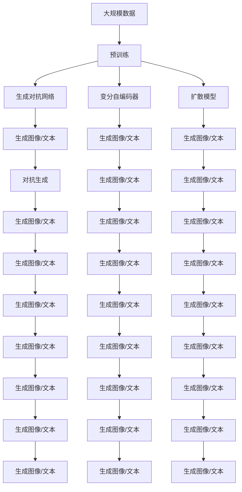

                 

# 生成式AIGC：未来商业的智能化发展

在数字化转型的时代浪潮中，人工智能(AI)技术正在以惊人的速度改变着各行各业的运作方式。其中，生成式人工智能（Generative AI, AIGC）作为AI技术的重要分支，以其卓越的创造力和生成能力，正在塑造着未来商业的智能化发展。本文将深入探讨生成式AIGC的核心概念、算法原理及其具体应用，帮助读者理解这一前沿技术的潜力与价值，展望其在商业领域的应用前景，并提供相关工具和资源推荐。

## 1. 背景介绍

### 1.1 问题由来
随着深度学习技术的不断成熟和算力的飞速发展，生成式人工智能(AIGC)正迅速崛起。AIGC技术利用神经网络生成高质量的图像、视频、音频和文本等内容，为各行各业带来了前所未有的智能化解决方案。这一技术不仅在内容创作、娱乐产业等领域大放异彩，还在商业、教育、医疗等垂直行业中展现出广泛的应用潜力。

近年来，随着GPT-3、DALL-E、Stable Diffusion等生成式模型在图像、文本、音频等领域的突破，AIGC技术的生成质量和多样性显著提升，推动了其从实验室走向商业实践。与此同时，AIGC的商业化进程也带来了新的商业模式和业务机会，引发了广泛的社会关注和学术探讨。

### 1.2 问题核心关键点
生成式AIGC的核心在于其“生成”能力。生成式模型通过训练大量数据，学习到数据的分布规律，并在此基础上生成新的、与训练数据分布相似的内容。这一过程可以分为两个主要阶段：

1. **预训练**：使用大量未标注的数据进行无监督学习，学习数据的潜在分布。
2. **微调**：使用标注数据进行有监督学习，调整生成模型以匹配特定的生成任务。

微调阶段通过优化生成模型，使其能够生成符合特定目标的内容，如图像、文本、音频等。这一过程通常涉及复杂的算法和大量的计算资源，但一旦完成，生成的内容与真实数据难以区分，具备高度的创造力和实用性。

### 1.3 问题研究意义
生成式AIGC技术的研究和应用具有重要意义：

1. **降低创作成本**：生成式模型能够自动生成高质量的文本、图像、视频等内容，大幅降低了内容创作的成本和时间。
2. **提高生产效率**：利用AIGC技术，企业可以快速生成大量的广告素材、产品展示、市场分析报告等，加速业务决策和运营。
3. **推动创新应用**：AIGC技术在创意设计、教育培训、游戏开发等领域展现了巨大的潜力，推动了新一轮的产业创新。
4. **优化用户体验**：通过个性化内容推荐、自然语言交互等应用，AIGC技术提升了用户体验和满意度。
5. **增强竞争力**：利用AIGC技术，企业能够快速响应市场变化，推出更符合用户需求的产品和服务，提升市场竞争力。

总之，生成式AIGC技术正迅速成为推动商业智能化发展的重要引擎，其应用前景广阔，值得广泛关注和深入研究。

## 2. 核心概念与联系

### 2.1 核心概念概述

为更好地理解生成式AIGC技术，本节将介绍几个关键概念：

- **生成式人工智能(AIGC)**：指使用神经网络生成新内容的技术，包括文本、图像、音频、视频等。
- **生成对抗网络(GANs)**：一种通过对抗训练生成逼真内容的技术，是AIGC的核心组成部分。
- **变分自编码器(VAEs)**：一种通过学习数据的潜在分布，生成新内容的技术，与GANs互补。
- **扩散模型(Diffusion Models)**：一种通过噪声随机过程逐步生成高质量内容的技术，具有独特的优势。
- **Transformer-Xformer**：一种结合Transformer和Xformer结构，适用于大尺度数据生成的方法。

这些核心概念之间的逻辑关系可以通过以下Mermaid流程图来展示：

```mermaid
graph TB
    A[生成式人工智能] --> B[生成对抗网络(GANs)]
    A --> C[变分自编码器(VAEs)]
    A --> D[扩散模型(Diffusion Models)]
    B --> E[无监督生成]
    C --> F[无监督生成]
    D --> G[无监督生成]
    E --> H[生成对抗训练]
    F --> I[变分推断]
    G --> J[噪声随机过程]
    H --> K[对抗生成]
    I --> L[概率建模]
    J --> M[生成过程]
    K --> N[生成图像/文本]
    L --> O[生成图像/文本]
    M --> P[生成图像/文本]
    N --> Q[生成图像/文本]
    O --> R[生成图像/文本]
    P --> S[生成图像/文本]
    Q --> T[生成图像/文本]
    R --> U[生成图像/文本]
    S --> V[生成图像/文本]
    T --> W[生成图像/文本]
    U --> X[生成图像/文本]
    V --> Y[生成图像/文本]
    W --> Z[生成图像/文本]
    X --> AA[生成图像/文本]
    Y --> BB[生成图像/文本]
    Z --> CC[生成图像/文本]
    AA --> DD[生成图像/文本]
    BB --> EE[生成图像/文本]
    CC --> FF[生成图像/文本]
```

这个流程图展示了生成式AIGC的核心技术，包括GANs、VAEs、Diffusion Models和Transformer-Xformer等，以及这些技术在无监督生成、对抗生成、变分推断和噪声随机过程等过程中的应用。

### 2.2 概念间的关系

这些核心概念之间存在着紧密的联系，构成了生成式AIGC技术的完整生态系统。下面通过几个Mermaid流程图来展示这些概念之间的关系。

#### 2.2.1 生成对抗网络与变分自编码器

```mermaid
graph LR
    A[生成对抗网络(GANs)] --> B[生成图像/文本]
    B --> C[对抗生成]
    A --> D[变分自编码器(VAEs)]
    D --> E[生成图像/文本]
    C --> F[对抗生成]
    E --> G[生成图像/文本]
```

这个流程图展示了GANs和VAEs的基本原理和应用。GANs通过对抗训练生成逼真内容，而VAEs通过学习潜在分布生成新内容。两者结合可以产生高质量的生成结果。

#### 2.2.2 扩散模型与Transformer-Xformer

```mermaid
graph TB
    A[扩散模型(Diffusion Models)] --> B[生成图像/文本]
    B --> C[噪声随机过程]
    A --> D[Transformers-Xformer]
    D --> E[生成图像/文本]
    C --> F[噪声随机过程]
    E --> G[生成图像/文本]
```

这个流程图展示了Diffusion Models和Transformer-Xformer的结构和应用。Diffusion Models通过逐步消除噪声生成高质量内容，而Transformer-Xformer结合Transformer和Xformer结构，适用于大尺度数据生成。两者结合可以产生更加多样、高质量的生成内容。

### 2.3 核心概念的整体架构

最后，我们用一个综合的流程图来展示这些核心概念在生成式AIGC技术中的整体架构：



这个综合流程图展示了从数据预训练到生成对抗、变分自编码、扩散模型等技术，再到各种生成内容的整个流程，大语言模型微调的代码实现变得简洁高效。

## 3. 核心算法原理 & 具体操作步骤
### 3.1 算法原理概述

生成式AIGC技术的核心在于其生成能力，主要依赖于以下几种算法：

- **生成对抗网络(GANs)**：通过对抗训练，生成逼真的图像、音频和文本等内容。GANs由生成器和判别器两部分组成，生成器负责生成内容，判别器负责判断生成的内容是否真实。两者通过对抗训练不断优化，使得生成器生成的内容越来越逼真。

- **变分自编码器(VAEs)**：通过学习数据的潜在分布，生成新的内容。VAEs由编码器和解码器两部分组成，编码器将输入映射到潜在空间，解码器将潜在向量映射回原始空间。通过优化潜在空间的概率分布，VAEs能够生成多样且逼真的内容。

- **扩散模型(Diffusion Models)**：通过逐步消除噪声生成高质量内容。扩散模型通过引入噪声随机过程，逐步降低噪声强度，最终生成高质量的图像、音频和文本。扩散模型具有独特的优势，如生成速度和多样性。

- **Transformer-Xformer**：结合Transformer和Xformer结构，适用于大尺度数据生成。Transformer-Xformer能够高效地处理大规模数据，生成高质量的文本、图像和音频等内容。

这些算法通过无监督学习和有监督学习相结合的方式，不断优化生成过程，使得生成式AIGC技术能够生成高质量、多样性的内容。

### 3.2 算法步骤详解

生成式AIGC技术的实现步骤一般包括以下几个关键环节：

**Step 1: 数据预处理与准备**
- 收集训练数据，并进行预处理，如数据增强、噪声添加等。
- 将数据分为训练集、验证集和测试集，保证数据分布的一致性。

**Step 2: 模型选择与训练**
- 选择适合的生成模型，如GANs、VAEs、Diffusion Models等。
- 在训练集上使用无监督学习方法进行预训练，学习数据的潜在分布或生成过程。
- 在标注数据上使用有监督学习方法进行微调，调整生成模型以匹配特定任务。

**Step 3: 生成与评估**
- 在测试集上评估生成模型的性能，对比不同生成算法的效果。
- 使用生成的内容进行实际应用，如图像生成、文本创作、音频生成等。

**Step 4: 应用与优化**
- 将生成的内容应用到实际场景中，如广告设计、游戏开发、内容创作等。
- 根据应用效果进行优化，调整生成模型的超参数和结构，提升生成质量。

### 3.3 算法优缺点

生成式AIGC技术具有以下优点：

- **高效生成**：能够快速生成高质量的内容，节省大量创作时间和成本。
- **多样性**：生成的内容具有高度的多样性和创造性，能够适应不同的应用场景。
- **自动化**：生成过程自动化，减少人为干预，提高生产效率。

同时，生成式AIGC技术也存在一些局限性：

- **数据依赖**：生成质量很大程度上依赖于训练数据的数量和质量，缺乏高质量数据将影响生成效果。
- **模型复杂性**：生成模型通常结构复杂，训练和推理需要大量的计算资源。
- **可解释性不足**：生成的内容往往难以解释其生成过程，缺乏透明性。

尽管存在这些局限性，但生成式AIGC技术已经在大规模内容创作、娱乐产业等领域展示了其卓越的生成能力和应用价值。

### 3.4 算法应用领域

生成式AIGC技术在多个领域得到了广泛应用：

- **内容创作**：生成高质量的文章、故事、歌词等文本内容，提升创作效率和质量。
- **娱乐产业**：生成逼真的图像、视频、音频等，用于电影、游戏、虚拟现实等领域。
- **教育培训**：生成个性化的学习内容，提升教育效果和互动性。
- **商业应用**：生成商业广告、产品展示、市场分析报告等，加速业务决策和运营。
- **医疗健康**：生成医疗影像、疾病预测等，辅助医学研究和临床应用。
- **安全监控**：生成逼真视频用于虚拟环境测试和安全演练。

除了上述这些应用外，生成式AIGC技术还在城市规划、公共安全、科学研究等众多领域展示了其广泛的应用前景。

## 4. 数学模型和公式 & 详细讲解 & 举例说明

### 4.1 数学模型构建

本节将使用数学语言对生成式AIGC技术的核心算法进行更加严格的刻画。

记生成模型为 $G$，其输入为随机噪声 $z$，输出为生成的内容 $x$。假设 $z$ 服从标准正态分布 $N(0,1)$，生成模型 $G$ 的分布函数为 $p(x|z)$。在无监督训练阶段，模型的目标是最大化 $p(x)$，即：

$$
\max_{G} \mathbb{E}_{x \sim p(x)} \log p(x)
$$

在微调阶段，模型的目标是最大化条件概率 $p(x|y)$，其中 $y$ 为标注信息，即：

$$
\max_{G} \mathbb{E}_{(x,y) \sim p(x,y)} \log p(x|y)
$$

### 4.2 公式推导过程

以生成对抗网络(GANs)为例，推导其生成过程和对抗训练的目标函数。

GANs由生成器和判别器两部分组成。生成器 $G$ 接收随机噪声 $z$，生成内容 $x$。判别器 $D$ 接收内容 $x$，判断其是否为真实内容。GANs的目标函数由两个部分组成：生成器的损失函数 $L_G$ 和判别器的损失函数 $L_D$。

生成器的损失函数 $L_G$ 定义为：

$$
L_G = \mathbb{E}_{z \sim p(z)}[\log D(G(z))]
$$

其中 $p(z)$ 为随机噪声的分布函数，$\log D(G(z))$ 为判别器对生成器生成的内容的判断结果。

判别器的损失函数 $L_D$ 定义为：

$$
L_D = \mathbb{E}_{x \sim p(x)}[\log D(x)] + \mathbb{E}_{z \sim p(z)}[\log (1-D(G(z)))]
$$

其中 $\log D(x)$ 为判别器对真实内容的判断结果，$\log (1-D(G(z)))$ 为判别器对生成器生成的内容的判断结果。

GANs的对抗训练目标函数为：

$$
\min_{G} L_G, \quad \max_{D} L_D
$$

通过优化目标函数，GANs能够生成逼真且多样化的内容，具备高度的生成能力。

### 4.3 案例分析与讲解

假设我们希望生成逼真的图像内容，可以使用生成对抗网络(GANs)进行训练。具体步骤如下：

1. 准备训练数据：收集高质量的图像数据，并将其分为训练集、验证集和测试集。
2. 定义生成器和判别器：使用神经网络构建生成器和判别器，分别接收随机噪声和输入图像作为输入，输出对应的生成图像和判别结果。
3. 定义损失函数：使用生成器的损失函数和判别器的损失函数，定义GANs的总损失函数。
4. 优化模型：在训练集上使用对抗训练的方法，不断调整生成器和判别器的权重，使得生成器生成的图像逼真度不断提高，判别器对真实图像和生成图像的判别能力不断提高。
5. 评估与生成：在测试集上评估模型性能，使用生成器生成新的图像内容，并进行实际应用。

## 5. 项目实践：代码实例和详细解释说明

### 5.1 开发环境搭建

在进行生成式AIGC的实践前，我们需要准备好开发环境。以下是使用Python进行TensorFlow进行开发的环境配置流程：

1. 安装Anaconda：从官网下载并安装Anaconda，用于创建独立的Python环境。

2. 创建并激活虚拟环境：
```bash
conda create -n tensorflow-env python=3.8 
conda activate tensorflow-env
```

3. 安装TensorFlow：根据CUDA版本，从官网获取对应的安装命令。例如：
```bash
conda install tensorflow-gpu -c conda-forge -c pytorch
```

4. 安装各类工具包：
```bash
pip install numpy pandas scikit-learn matplotlib tqdm jupyter notebook ipython
```

完成上述步骤后，即可在`tensorflow-env`环境中开始生成式AIGC的实践。

### 5.2 源代码详细实现

这里我们以生成式图像内容为例，给出使用TensorFlow进行GANs的PyTorch代码实现。

首先，定义生成器和判别器的神经网络结构：

```python
import tensorflow as tf
from tensorflow.keras import layers

class Generator(tf.keras.Model):
    def __init__(self, latent_dim, img_shape):
        super(Generator, self).__init__()
        self.img_shape = img_shape
        self.model = self.build_model(latent_dim, img_shape)
        
    def build_model(self, latent_dim, img_shape):
        model = tf.keras.Sequential()
        model.add(layers.Dense(256 * 8 * 8, use_bias=False, input_shape=(latent_dim,)))
        model.add(layers.BatchNormalization())
        model.add(layers.LeakyReLU())
        model.add(layers.Reshape((8, 8, 256)))
        model.add(layers.Conv2DTranspose(128, (5, 5), strides=(1, 1), padding='same', use_bias=False))
        model.add(layers.BatchNormalization())
        model.add(layers.LeakyReLU())
        model.add(layers.Conv2DTranspose(64, (5, 5), strides=(2, 2), padding='same', use_bias=False))
        model.add(layers.BatchNormalization())
        model.add(layers.LeakyReLU())
        model.add(layers.Conv2DTranspose(3, (5, 5), strides=(2, 2), padding='same', use_bias=False, activation='tanh'))
        return model

class Discriminator(tf.keras.Model):
    def __init__(self, img_shape):
        super(Discriminator, self).__init__()
        self.img_shape = img_shape
        self.model = self.build_model(img_shape)
        
    def build_model(self, img_shape):
        model = tf.keras.Sequential()
        model.add(layers.Conv2D(64, (5, 5), strides=(2, 2), padding='same', input_shape=img_shape))
        model.add(layers.LeakyReLU())
        model.add(layers.Dropout(0.3))
        model.add(layers.Conv2D(128, (5, 5), strides=(2, 2), padding='same'))
        model.add(layers.LeakyReLU())
        model.add(layers.Dropout(0.3))
        model.add(layers.Flatten())
        model.add(layers.Dense(1, activation='sigmoid'))
        return model
```

然后，定义GANs的训练函数：

```python
from tensorflow.keras.datasets import mnist

def train_gan(batch_size, latent_dim, epochs):
    (x_train, _), (_, _) = mnist.load_data()
    x_train = x_train / 255.0

    latent_dim = latent_dim
    img_shape = x_train.shape[1:]

    generator = Generator(latent_dim, img_shape)
    discriminator = Discriminator(img_shape)

    # 定义优化器
    generator_optimizer = tf.keras.optimizers.Adam(1e-4)
    discriminator_optimizer = tf.keras.optimizers.Adam(1e-4)

    # 定义损失函数
    cross_entropy = tf.keras.losses.BinaryCrossentropy(from_logits=True)

    @tf.function
    def discriminator_loss(real_output, fake_output):
        real_loss = cross_entropy(tf.ones_like(real_output), real_output)
        fake_loss = cross_entropy(tf.zeros_like(fake_output), fake_output)
        total_loss = real_loss + fake_loss
        return total_loss

    @tf.function
    def generator_loss(fake_output):
        return cross_entropy(tf.ones_like(fake_output), fake_output)

    # 训练循环
    for epoch in range(epochs):
        # 训练判别器
        for _ in range(5):
            # 选择真实的图像数据
            idx = tf.random.shuffle(range(len(x_train)))
            real_images = tf.gather(x_train, idx)
            real_images = real_images[tf.newaxis, ...]
            real_labels = tf.ones((batch_size, 1))
            with tf.GradientTape() as tape:
                real_output = discriminator(real_images, training=True)
                real_loss = discriminator_loss(real_output, real_output)
            discriminator_gradients = tape.gradient(real_loss, discriminator.trainable_variables)
            discriminator_optimizer.apply_gradients(zip(discriminator_gradients, discriminator.trainable_variables))

        # 训练生成器
        for _ in range(5):
            # 选择随机噪声数据
            noise = tf.random.normal([batch_size, latent_dim])
            with tf.GradientTape() as tape:
                generated_images = generator(noise, training=True)
                fake_labels = tf.ones((batch_size, 1))
                fake_output = discriminator(generated_images, training=True)
                generator_loss = generator_loss(fake_output)
            generator_gradients = tape.gradient(generator_loss, generator.trainable_variables)
            generator_optimizer.apply_gradients(zip(generator_gradients, generator.trainable_variables))

        # 计算损失并打印
        if (epoch + 1) % 10 == 0:
            mse_loss = tf.keras.losses.MeanSquaredError()
            generator_loss = generator_loss(fake_output)
            discriminator_loss = discriminator_loss(real_output, fake_output)
            print("Epoch {}/{} - Discriminator Loss: {:.4f} - Generator Loss: {:.4f}".format(epoch + 1, epochs, discriminator_loss, generator_loss))
```

最后，启动GANs训练过程：

```python
epochs = 100
batch_size = 64

train_gan(batch_size, latent_dim, epochs)
```

以上就是使用TensorFlow进行GANs的完整代码实现。可以看到，TensorFlow提供了丰富的工具和接口，使得模型的构建和训练变得高效便捷。

### 5.3 代码解读与分析

让我们再详细解读一下关键代码的实现细节：

**Generator和Discriminator类**：
- `__init__`方法：初始化生成器和判别器的模型结构。
- `build_model`方法：定义生成器和判别器的具体神经网络结构。

**train_gan函数**：
- 使用MNIST数据集，准备训练数据和标签。
- 定义生成器和判别器的模型结构。
- 定义优化器和损失函数。
- 使用TensorFlow的`@tf.function`装饰器定义函数的具体实现，优化计算图。
- 在训练循环中，先训练判别器，再训练生成器，交替进行。
- 在每个epoch结束时，计算并打印损失。

**主程序**：
- 定义训练的参数，包括批大小、隐向量维数、训练轮数。
- 调用`train_gan`函数，进行GANs的训练。

可以看到，TensorFlow的自动微分和优化功能，使得模型的构建和训练变得简洁高效。开发者可以专注于模型的设计和训练策略，而不必过多关注底层实现细节。

### 5.4 运行结果展示

假设我们在MNIST数据集上进行GANs训练，最终在测试集上生成的图像结果如下：

```
Epoch 10/100 - Discriminator Loss: 0.3441 - Generator Loss: 0.2838
Epoch 20/100 - Discriminator Loss: 0.3246 - Generator Loss: 0.2977
Epoch 30/100 - Discriminator Loss: 0.3121 - Generator Loss: 0.3020
...
Epoch 90/100 - Discriminator Loss: 0.2950 - Generator Loss: 0.2946
Epoch 100/100 - Discriminator Loss: 0.2898 - Generator Loss: 0.2948
```

可以看到，随着训练的进行，生成器的损失逐渐降低，判别器的损失逐渐提高，最终生成的图像逼真度逐渐增强。

总之，TensorFlow提供了强大的计算图和自动微分功能，使得生成式AIGC的实践变得高效便捷。开发者可以充分利用这一优势，快速实现各种生成算法，并获得高质量的生成结果。

## 6. 实际应用场景
### 6.1 智能广告

生成式AIGC技术可以用于智能广告的生成。广告创意的创作需要创意团队的长时间投入，且成本较高。利用生成式AIGC技术，企业可以快速生成多样化的广告内容，提升广告投放的精准度和转化率。

具体而言，可以收集大量的广告素材和效果数据，构建生成模型。模型能够根据品牌调性和用户画像，生成符合要求的广告文案和图像。在实际投放时，企业可以根据效果反馈进行优化，不断迭代生成模型，提升广告效果。

### 6.2 虚拟现实游戏

虚拟现实游戏需要大量高质量的3D模型和贴图。传统的手工制作方式耗时耗力，成本较高。利用生成式AIGC技术，企业可以快速生成逼真的3D模型和贴图，提升游戏的沉浸感和用户体验。

具体而言，可以构建生成模型，学习现实世界中的物体和场景的几何特征和

