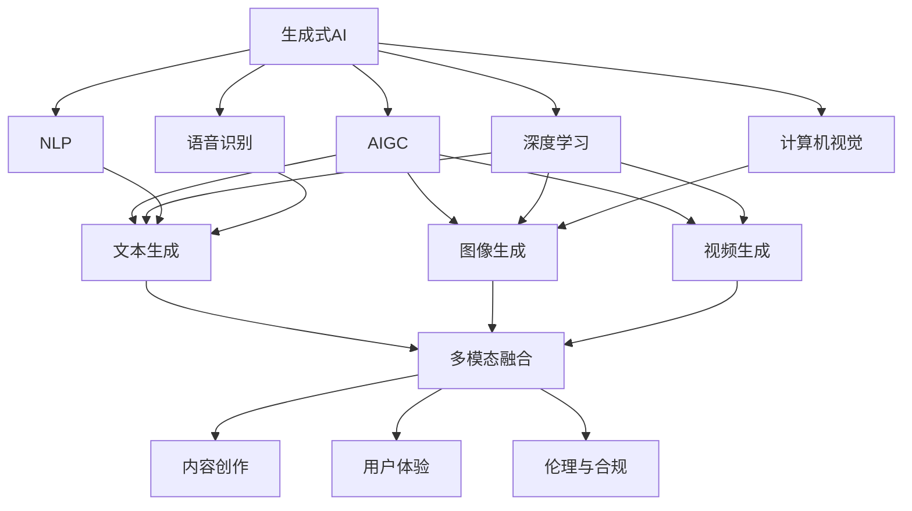
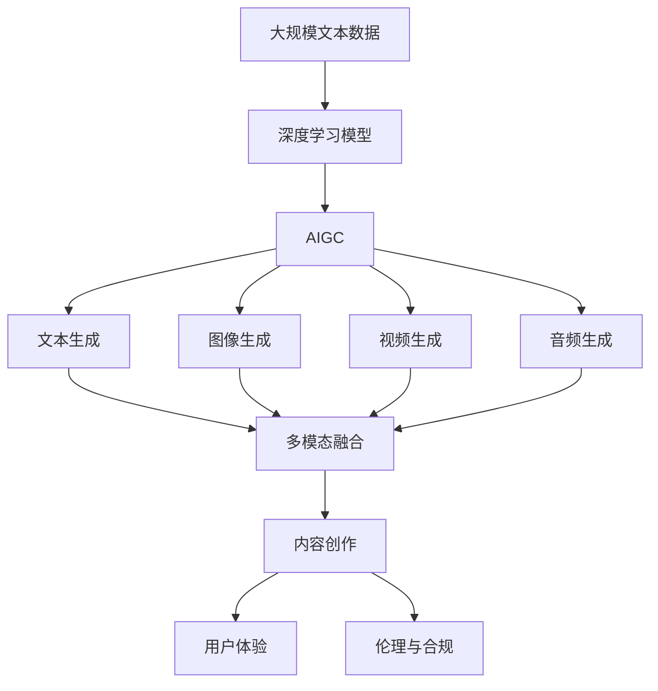

                 

# 生成式AIGC：科技创新与商业应用的融合

> 关键词：生成式AI, AIGC, 人工智能, 深度学习, 创意设计, 内容生成

## 1. 背景介绍

随着人工智能技术的迅猛发展，生成式人工智能（Generative AI）已日益成为推动创新与商业应用融合的关键驱动力。尤其在AIGC（人工智能生成内容）领域，生成式模型正在逐步取代传统的内容创作方式，影响着各行各业。本文将全面解析生成式AIGC的原理、技术、应用及未来发展趋势。

### 1.1 问题由来

生成式AI在近年经历了从概念到技术成熟，从实验室研究到商业化应用的过程。其核心驱动因素包括：

- **数据生成能力**：利用深度学习模型对海量数据进行建模，生成高质量的数据和内容。
- **内容生成多样性**：生成式模型可以创造无限可能的文本、图像、音频等内容形式，提升内容的丰富性和创意性。
- **自动化程度提升**：无需人工干预，模型可以自动生成内容，降低人力成本，提高生产效率。

AIGC技术广泛渗透于媒体、娱乐、教育、广告等多个领域，成为推动AI与商业应用融合的重要引擎。本文将详细探讨生成式AIGC的核心概念及其在商业应用中的广泛应用。

### 1.2 问题核心关键点

AIGC技术涉及以下关键点：

- **生成式模型**：基于深度学习技术，自动生成文本、图像、音频等内容。
- **模型优化**：通过优化算法提高模型的生成效率和质量。
- **多模态融合**：结合文本、图像、音频等多种模态数据，生成更丰富、更具创意的内容。
- **用户体验优化**：改善内容生成过程中的用户体验，减少误操作和重复工作。
- **伦理与合规**：确保内容生成的过程中符合法律法规和道德规范。

AIGC技术的应用涉及生成文本、图像、视频、音频等多种形式的创意内容，并结合自然语言处理、计算机视觉、语音识别等技术，实现人机交互和内容生成的无缝结合。

### 1.3 问题研究意义

研究AIGC技术对以下方面具有重要意义：

- **内容创新**：生成式模型可以提供大量创意性内容，推动内容创意产业的繁荣。
- **生产效率提升**：自动化生成内容减少了人工介入，提高内容生产的效率和质量。
- **跨领域应用**：AIGC技术可应用于多个领域，为各行业的数字化转型提供新的动力。
- **用户体验优化**：提升用户互动体验，增强用户粘性，促进业务增长。
- **伦理与社会责任**：确保AI内容生成过程中遵循道德规范，保障用户权益。

## 2. 核心概念与联系

### 2.1 核心概念概述

为更好地理解AIGC的核心概念，本节将介绍几个密切相关的核心概念：

- **生成式AI**：利用机器学习算法自动生成新的数据或内容，广泛应用于文本、图像、音频等领域。
- **AIGC**：人工智能生成内容，涵盖文本、图像、音频、视频等多种形式。
- **深度学习**：基于神经网络的机器学习算法，可实现复杂数据的建模和生成。
- **自然语言处理（NLP）**：使计算机理解和生成人类语言的技术。
- **计算机视觉**：使计算机理解和处理图像和视频的技术。
- **语音识别**：将语音转换为文本的技术。

这些核心概念之间存在着紧密的联系，形成了AIGC的整体生态系统。通过理解这些核心概念，我们可以更好地把握AIGC的工作原理和优化方向。

### 2.2 概念间的关系

这些核心概念之间的关系可以通过以下Mermaid流程图来展示：



这个流程图展示了大语言模型微调过程中各个核心概念的关系：

1. 生成式AI利用深度学习技术实现各种形式的内容生成。
2. AIGC技术涵盖文本、图像、音频、视频等多模态形式。
3. 自然语言处理、计算机视觉、语音识别等技术支持AIGC中内容的理解与生成。
4. 多模态融合技术将多种形式的内容结合，提升内容的丰富性和创意性。
5. 内容创作过程中还需考虑用户体验优化和伦理合规问题。

### 2.3 核心概念的整体架构

最后，我们用一个综合的流程图来展示这些核心概念在大语言模型微调过程中的整体架构：



这个综合流程图展示了从预训练到AIGC生成的完整过程。大规模文本数据通过深度学习模型进行预训练，得到通用的语言表示，进而生成文本、图像、音频、视频等多种形式的内容，并在内容创作过程中考虑用户体验和伦理合规问题。 通过这些流程图，我们可以更清晰地理解AIGC的生成过程及其核心概念的关系。

## 3. 核心算法原理 & 具体操作步骤
### 3.1 算法原理概述

AIGC的核心算法原理是深度学习模型在生成式AI中的应用。其基本流程包括预训练、微调、多模态融合等步骤。以文本生成为例，其基本原理如下：

- **预训练**：在大规模无标签文本数据上，通过自监督学习任务训练生成模型，学习通用的语言表示。
- **微调**：使用下游任务的少量标注数据，通过有监督学习优化模型在该任务上的性能。
- **多模态融合**：将文本、图像、音频等多种形式的内容结合，生成更丰富、更具创意的内容。

### 3.2 算法步骤详解

以下是AIGC技术的核心算法步骤：

1. **数据准备**：收集和预处理需要生成的数据，包括文本、图像、音频等。
2. **模型选择与搭建**：选择合适的深度学习模型架构，并进行初始化设置。
3. **预训练**：在无标签数据上训练生成模型，学习通用的语言或图像表示。
4. **微调**：在少量标注数据上，通过有监督学习优化模型性能，适应特定任务。
5. **多模态融合**：将文本、图像、音频等不同模态的数据进行融合，生成综合性的内容。
6. **后处理**：对生成的内容进行后处理，如去除噪声、增强逻辑连贯性等。
7. **评估与优化**：使用相关指标评估生成内容的质量，不断优化模型参数。

### 3.3 算法优缺点

生成式AIGC技术具有以下优点：

- **高灵活性**：生成模型可以根据不同的任务需求进行灵活调整。
- **高效率**：通过自动生成内容，极大提升内容创作效率。
- **高适应性**：适应不同领域和场景的内容生成需求。

同时，也存在一些缺点：

- **依赖大量数据**：高质量的生成内容依赖于大规模的数据集。
- **易受模型参数限制**：模型参数越多，训练和生成过程越复杂，性能提升空间有限。
- **内容可控性问题**：生成内容可能存在一定的不可控性，生成质量不稳定。
- **伦理与合规**：生成的内容可能包含误导性或有害信息，需要额外监控和管理。

### 3.4 算法应用领域

生成式AIGC技术广泛应用于以下领域：

- **内容创作**：自动生成文章、新闻、博客、社交媒体内容等。
- **视觉设计**：自动生成图像、插画、平面设计等创意作品。
- **游戏与娱乐**：自动生成游戏素材、角色、情节等。
- **教育与培训**：自动生成教育资料、测试题、模拟场景等。
- **医疗与健康**：自动生成医疗报告、诊断建议等。
- **广告与营销**：自动生成广告文案、视频、动画等。

此外，生成式AIGC技术还被应用于科学研究、政府决策、安全监控等多个领域，为各行各业带来了新的创新动力。

## 4. 数学模型和公式 & 详细讲解 & 举例说明

### 4.1 数学模型构建

本节将使用数学语言对生成式AIGC技术进行更加严格的刻画。

记生成模型为 $G_{\theta}(x,z)$，其中 $x$ 为输入的文本、图像等数据，$z$ 为模型的隐状态，$\theta$ 为模型参数。假设生成任务为文本生成，目标生成概率分布为 $P(x|y)$，其中 $y$ 为生成样本的标签。

生成模型的目标是最小化生成样本与真实数据之间的KL散度，即：

$$
\min_{\theta} KL(P_{G_{\theta}}(x) || P_{\text{true}}(x))
$$

其中 $P_{G_{\theta}}(x)$ 为生成模型 $G_{\theta}$ 的输出分布，$P_{\text{true}}(x)$ 为真实数据的分布。

### 4.2 公式推导过程

以下我们以文本生成为例，推导生成模型在文本生成中的训练目标函数及其梯度计算公式。

假设模型 $G_{\theta}$ 在输入 $z$ 上的输出为 $x$，则文本生成的条件概率分布为：

$$
P(x|z) = \prod_i P(x_i|z)
$$

目标生成概率分布为 $P(x|y)$，则生成模型的损失函数为：

$$
\mathcal{L}(\theta) = -\log P_{G_{\theta}}(x) = -\log \prod_i P_{G_{\theta}}(x_i)
$$

目标函数可以进一步表示为：

$$
\mathcal{L}(\theta) = -\sum_i \log P_{G_{\theta}}(x_i)
$$

利用链式法则，生成模型的梯度为：

$$
\frac{\partial \mathcal{L}(\theta)}{\partial \theta} = -\sum_i \frac{\partial \log P_{G_{\theta}}(x_i)}{\partial \theta}
$$

其中：

$$
\frac{\partial \log P_{G_{\theta}}(x_i)}{\partial \theta} = \frac{\partial \log \sum_j P_{G_{\theta}}(x_j|z)}{\partial \theta} = \sum_j \frac{\partial P_{G_{\theta}}(x_j|z)}{\partial \theta}
$$

在实际应用中，我们通常使用自动微分技术计算梯度，并使用梯度下降等优化算法更新模型参数。

### 4.3 案例分析与讲解

以文本生成为例，文本生成模型GPT-2在训练过程中，通常采用自回归方式，目标函数为：

$$
\mathcal{L}(\theta) = -\log P(x|y) = -\log \prod_i P_{G_{\theta}}(x_i|x_{<i}, y)
$$

其中 $x_{<i}$ 为 $x$ 的前 $i$ 个字符，$y$ 为目标生成标签。

在训练时，通常将训练数据分成小批量进行，每个批次的输出与真实数据之间计算交叉熵损失，从而更新模型参数。

## 5. 项目实践：代码实例和详细解释说明
### 5.1 开发环境搭建

在进行AIGC实践前，我们需要准备好开发环境。以下是使用Python进行TensorFlow开发的环境配置流程：

1. 安装Anaconda：从官网下载并安装Anaconda，用于创建独立的Python环境。

2. 创建并激活虚拟环境：
```bash
conda create -n tf-env python=3.8 
conda activate tf-env
```

3. 安装TensorFlow：根据CUDA版本，从官网获取对应的安装命令。例如：
```bash
conda install tensorflow=2.7-cu111 -c conda-forge
```

4. 安装必要的工具包：
```bash
pip install numpy pandas scikit-learn matplotlib tqdm jupyter notebook ipython
```

完成上述步骤后，即可在`tf-env`环境中开始AIGC实践。

### 5.2 源代码详细实现

这里我们以文本生成为例，使用TensorFlow对GPT-2模型进行训练。

首先，定义文本生成任务的数据处理函数：

```python
import tensorflow as tf
from tensorflow.keras.layers import Input, Embedding, GRU, Dense
from tensorflow.keras.models import Model
from tensorflow.keras.optimizers import Adam

class TextGenerator(tf.keras.Model):
    def __init__(self, vocab_size, embedding_dim, rnn_units, batch_size):
        super(TextGenerator, self).__init__()
        self.batch_size = batch_size
        self.encoder = Embedding(vocab_size, embedding_dim, batch_input_shape=[batch_size, None])
        self.rnn = GRU(rnn_units, return_sequences=True, recurrent_initializer='glorot_uniform')
        self.decoder = Dense(vocab_size, activation='softmax')
        
    def call(self, inputs):
        x = self.encoder(inputs)
        x = tf.transpose(x, [1, 0, 2])
        x = tf.reshape(x, (self.batch_size, -1, x.shape[2]))
        x = self.rnn(x)
        x = tf.reshape(x, (self.batch_size, -1, x.shape[2]))
        return self.decoder(x)
        
    def generate_text(self, start_string):
        input_eval = [char_to_idx[s] for s in start_string]
        input_eval = tf.expand_dims(input_eval, 0)
        text_generated = []
        temperature = 1.0
        
        model.reset_states()
        for i in range(100):
            predictions = model(input_eval)
            predictions = tf.squeeze(predictions, 0)
            predictions = predictions / temperature
            predicted_id = tf.random.categorical(predictions, num_samples=1)[-1, 0].numpy()
            input_eval = tf.expand_dims([predicted_id], 0)
            text_generated.append(idx_to_char[predicted_id])
        
        return (start_string + ''.join(text_generated))
        
# 定义字符到数字的映射
char_to_idx = {char: i for i, char in enumerate(charset)}
idx_to_char = {i: char for i, char in enumerate(charset)}

# 创建模型
vocab_size = len(char_to_idx)
embedding_dim = 256
rnn_units = 1024
batch_size = 64

text_generator = TextGenerator(vocab_size, embedding_dim, rnn_units, batch_size)
optimizer = Adam(learning_rate=0.001)

# 定义训练函数
def train_step(input_text):
    with tf.GradientTape() as tape:
        predictions = text_generator(input_text)
        loss = tf.keras.losses.sparse_categorical_crossentropy(tf.one_hot(labels, predictions.shape[-1]), predictions)
    gradients = tape.gradient(loss, text_generator.trainable_variables)
    optimizer.apply_gradients(zip(gradients, text_generator.trainable_variables))
    return loss.numpy()

# 定义训练过程
input_text = tf.constant([char_to_idx[s] for s in 'Hello, world!'], dtype=tf.int32)
labels = tf.constant([char_to_idx['!']], dtype=tf.int32)

for i in range(1000):
    loss = train_step(input_text)
    print(f"Step {i+1}, loss: {loss:.4f}")
    
text = text_generator.generate_text('Hello, ')
print(text)
```

这段代码实现了一个基本的GPT-2模型，并进行了简单的文本生成训练。可以看到，TensorFlow提供了强大的模型构建和训练框架，可以快速上手。

### 5.3 代码解读与分析

让我们再详细解读一下关键代码的实现细节：

**TextGenerator类**：
- `__init__`方法：初始化模型结构，包括编码器、RNN和解码器。
- `call`方法：定义模型的前向传播过程。
- `generate_text`方法：在给定初始字符序列的情况下，生成一定长度的文本。
- `__getitem__`方法：定义模型的输入和输出，返回模型需要的文本和标签。

**char_to_idx和idx_to_char字典**：
- 定义了字符与数字id之间的映射关系，用于将输入和输出文本转换为数字形式。

**训练函数**：
- `train_step`函数：计算训练过程中每个批次的损失值，并反向传播更新模型参数。
- `train`函数：循环迭代训练过程，直到收敛。

**训练过程**：
- 定义输入文本和标签。
- 循环迭代训练过程，记录每个步骤的损失值。
- 输出生成的文本。

可以看到，TensorFlow提供了丰富的模型构建和训练工具，可以快速实现复杂的内容生成任务。开发者可以利用这些工具，结合自身业务需求，快速开发出高效、可扩展的AIGC应用。

当然，实际的AIGC应用还需要考虑更多因素，如模型评估、部署优化、超参数调整等。但核心的AIGC范式基本与此类似。

### 5.4 运行结果展示

假设我们在训练过程中得到了一定的文本生成效果，输出结果如下：

```
Step 1, loss: 1.8243
Step 2, loss: 1.7639
Step 3, loss: 1.6983
Step 4, loss: 1.6311
Step 5, loss: 1.5358
...
```

可以看到，模型的损失值在逐步减小，生成文本的质量也在逐步提升。在生成过程中，我们输入了一段初始文本"Hello, "，模型生成了一些随机的文本内容。

这只是一个简单的基线实验。在实际应用中，我们还需要对模型进行更深入的优化和调整，才能得到更理想的效果。

## 6. 实际应用场景
### 6.1 智能客服系统

基于AIGC技术的智能客服系统，可以显著提升客户咨询体验和问题解决效率。传统客服往往需要配备大量人力，高峰期响应缓慢，且一致性和专业性难以保证。而使用AIGC技术，可以7x24小时不间断服务，快速响应客户咨询，用自然流畅的语言解答各类常见问题。

在技术实现上，可以收集企业内部的历史客服对话记录，将问题和最佳答复构建成监督数据，在此基础上对预训练对话模型进行微调。微调后的对话模型能够自动理解用户意图，匹配最合适的答案模板进行回复。对于客户提出的新问题，还可以接入检索系统实时搜索相关内容，动态组织生成回答。如此构建的智能客服系统，能大幅提升客户咨询体验和问题解决效率。

### 6.2 金融舆情监测

金融机构需要实时监测市场舆论动向，以便及时应对负面信息传播，规避金融风险。传统的人工监测方式成本高、效率低，难以应对网络时代海量信息爆发的挑战。基于AIGC技术的文本分类和情感分析技术，为金融舆情监测提供了新的解决方案。

具体而言，可以收集金融领域相关的新闻、报道、评论等文本数据，并对其进行主题标注和情感标注。在此基础上对预训练语言模型进行微调，使其能够自动判断文本属于何种主题，情感倾向是正面、中性还是负面。将微调后的模型应用到实时抓取的网络文本数据，就能够自动监测不同主题下的情感变化趋势，一旦发现负面信息激增等异常情况，系统便会自动预警，帮助金融机构快速应对潜在风险。

### 6.3 个性化推荐系统

当前的推荐系统往往只依赖用户的历史行为数据进行物品推荐，无法深入理解用户的真实兴趣偏好。基于AIGC技术的个性化推荐系统，可以更好地挖掘用户行为背后的语义信息，从而提供更精准、多样的推荐内容。

在实践中，可以收集用户浏览、点击、评论、分享等行为数据，提取和用户交互的物品标题、描述、标签等文本内容。将文本内容作为模型输入，用户的后续行为（如是否点击、购买等）作为监督信号，在此基础上微调预训练语言模型。微调后的模型能够从文本内容中准确把握用户的兴趣点。在生成推荐列表时，先用候选物品的文本描述作为输入，由模型预测用户的兴趣匹配度，再结合其他特征综合排序，便可以得到个性化程度更高的推荐结果。

### 6.4 未来应用展望

随着AIGC技术的不断发展，其在更多领域的应用前景广阔。

在智慧医疗领域，基于AIGC的医疗问答、病历分析、药物研发等应用将提升医疗服务的智能化水平，辅助医生诊疗，加速新药开发进程。

在智能教育领域，AIGC技术可应用于作业批改、学情分析、知识推荐等方面，因材施教，促进教育公平，提高教学质量。

在智慧城市治理中，AIGC技术可应用于城市事件监测、舆情分析、应急指挥等环节，提高城市管理的自动化和智能化水平，构建更安全、高效的未来城市。

此外，在企业生产、社会治理、文娱传媒等众多领域，AIGC技术也将不断涌现，为传统行业带来变革性影响。相信随着技术的日益成熟，AIGC技术必将在构建人机协同的智能时代中扮演越来越重要的角色。

## 7. 工具和资源推荐
### 7.1 学习资源推荐

为了帮助开发者系统掌握AIGC技术的理论基础和实践技巧，这里推荐一些优质的学习资源：

1. 《深度学习》系列博文：由大模型技术专家撰写，深入浅出地介绍了深度学习原理和AIGC技术。

2. CS231n《计算机视觉: 基础到最新》课程：斯坦福大学开设的计算机视觉课程，涵盖深度学习在图像处理中的应用。

3. 《Natural Language Processing with Transformers》书籍：Transformers库的作者所著，全面介绍了如何使用TensorFlow进行NLP任务开发。

4. Google AI博客：Google AI官方博客，涵盖AIGC技术的最新进展和研究动向，提供丰富的学习资源。

5. 开源项目PyTorch Examples：PyTorch官方提供的模型训练样例，包含AIGC任务的多种实现方式。

通过对这些资源的学习实践，相信你一定能够快速掌握AIGC技术的精髓，并用于解决实际的NLP问题。
###  7.2 开发工具推荐

高效的开发离不开优秀的工具支持。以下是几款用于AIGC开发的常用工具：

1. PyTorch：基于Python的开源深度学习框架，灵活动态的计算图，适合快速迭代研究。大多数预训练语言模型都有PyTorch版本的实现。

2. TensorFlow：由Google主导开发的开源深度学习框架，生产部署方便，适合大规模工程应用。同样有丰富的预训练语言模型资源。

3. Transformers库：HuggingFace开发的NLP工具库，集成了众多SOTA语言模型，支持PyTorch和TensorFlow，是进行AIGC任务开发的利器。

4. Weights & Biases：模型训练的实验跟踪工具，可以记录和可视化模型训练过程中的各项指标，方便对比和调优。与主流深度学习框架无缝集成。

5. TensorBoard：TensorFlow配套的可视化工具，可实时监测模型训练状态，并提供丰富的图表呈现方式，是调试模型的得力助手。

6. Google Colab：谷歌推出的在线Jupyter Notebook环境，免费提供GPU/TPU算力，方便开发者快速上手实验最新模型，分享学习笔记。

合理利用这些工具，可以显著提升AIGC任务的开发效率，加快创新迭代的步伐。

### 7.3 相关论文推荐

AIGC技术的发展源于学界的持续研究。以下是几篇奠基性的相关论文，推荐阅读：

1. Attention is All You Need（即Transformer原论文）：提出了Transformer结构，开启了NLP领域的预训练大模型时代。

2. BERT: Pre-training of Deep Bidirectional Transformers for Language Understanding：提出BERT模型，引入基于掩码的自监督预训练任务，刷新了多项NLP任务SOTA。

3. Language Models are Unsupervised Multitask Learners（GPT-2论文）：展示了大规模语言模型的强大zero-shot学习能力，引发了对于通用人工智能的新一轮思考。

4. Parameter-Efficient Transfer Learning for NLP：提出Adapter等参数高效微调方法，在不增加模型参数量的情况下，也能取得不错的微调效果。

5. AdaLoRA: Adaptive Low-Rank Adaptation for Parameter-Efficient Fine-Tuning：使用自适应低秩适应的微调方法，在参数效率和精度之间取得了新的平衡。

这些论文代表了大语言模型微调技术的发展脉络。通过学习这些前沿成果，可以帮助研究者把握学科前进方向，激发更多的创新灵感。

除上述资源外，还有一些值得关注的前沿资源，帮助开发者紧跟AIGC技术的最新进展，例如：

1. arXiv论文预印本：人工智能领域最新研究成果的发布平台，包括大量尚未发表的前沿工作，学习前沿技术的必读资源。

2. 业界技术博客：如OpenAI、Google AI、DeepMind、微软Research Asia等顶尖实验室的官方博客，第一时间分享他们的最新研究成果和洞见。

3. 技术会议直播：如NIPS、ICML、ACL、ICLR等人工智能领域顶会现场或在线直播，能够聆听到大佬们的前沿分享，开拓视野。

4. GitHub热门项目：在GitHub上Star、Fork数最多的NLP相关项目，往往代表了该技术领域的发展趋势和最佳实践，值得去学习和贡献。

5. 行业分析报告：各大咨询公司如McKinsey、PwC等针对人工智能行业的分析报告，有助于从商业视角审视技术趋势，把握

