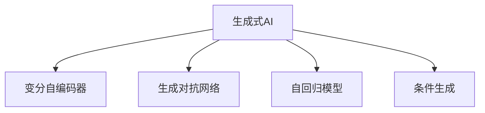
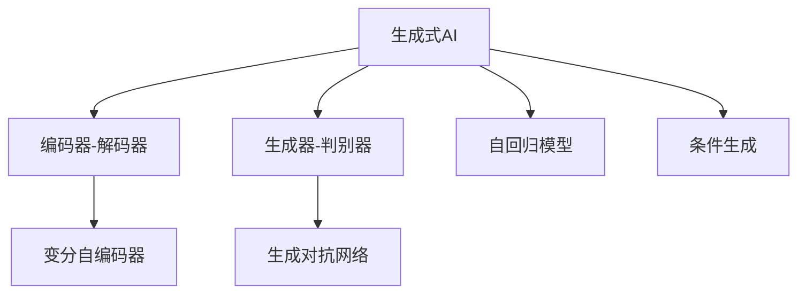
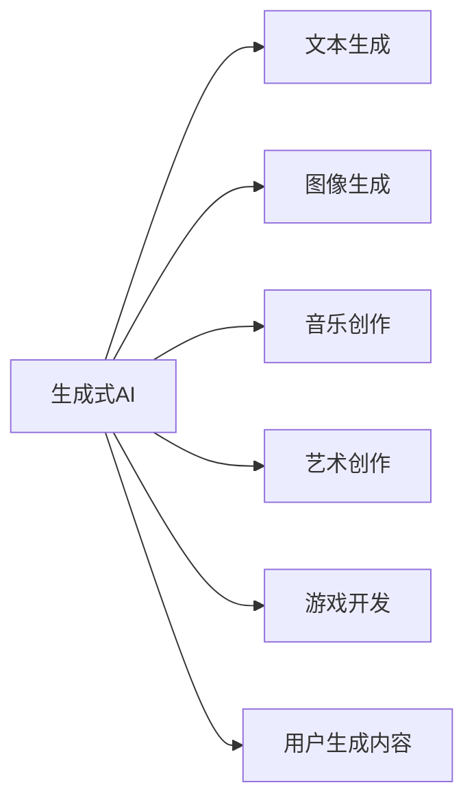
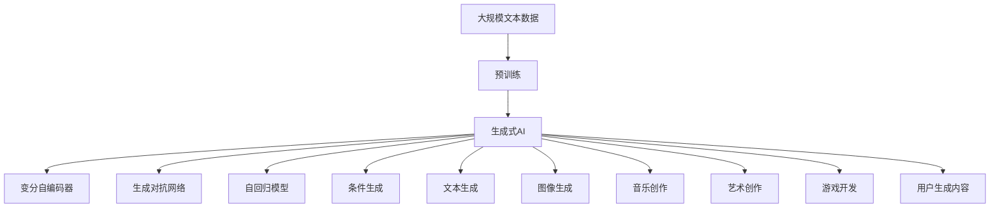

                 

# 生成式AI的实际应用案例

> 关键词：生成式AI,实际应用案例,自然语言处理,图像生成,音乐创作,艺术创作,游戏开发,用户生成内容,未来发展

## 1. 背景介绍

### 1.1 问题由来

随着深度学习技术的飞速发展，生成式AI (Generative AI) 成为人工智能领域的一个热门方向。生成式AI通过训练模型，能够自动生成高质量的文本、图像、音乐等，展现出强大的创造力。这种技术已经在多个实际应用场景中得到广泛应用，极大地提升了效率和创意水平。

### 1.2 问题核心关键点

生成式AI的核心是训练生成模型，使其能够从特定的输入生成期望的输出。该过程通常分为两个步骤：
1. 训练一个生成模型，如变分自编码器(VAE)、生成对抗网络(GAN)、自回归模型(如LSTM)等。
2. 通过采样或条件生成等方法，让训练好的生成模型生成高质量的输出。

生成式AI的应用范围非常广泛，包括文本生成、图像生成、音乐创作、艺术创作、游戏开发、用户生成内容(UGC)等，为各行各业带来了前所未有的创新可能。

### 1.3 问题研究意义

研究生成式AI的实际应用案例，对于推动AI技术的产业化应用具有重要意义：

1. 提升生产效率。生成式AI可以在文本生成、图像生成等领域替代大量人工操作，显著提升生产效率和质量。
2. 促进创意表达。生成式AI能够辅助艺术家、设计师、音乐家等创意工作者，激发更多的创意灵感，提升创意作品的水平。
3. 增强用户体验。生成式AI可以在游戏、虚拟现实等领域提供更加丰富、互动的用户体验，推动互动娱乐产业的发展。
4. 支持用户生成内容。生成式AI能够生成高质量的UGC内容，如短视频、表情包、动态图片等，丰富用户的社交平台。
5. 探索新应用场景。生成式AI技术不断演进，正在孕育出更多创新的应用场景，为人工智能技术带来新的发展机遇。

## 2. 核心概念与联系

### 2.1 核心概念概述

为更好地理解生成式AI的实际应用，本节将介绍几个密切相关的核心概念：

- 生成式AI：通过训练生成模型，能够自动生成高质量的文本、图像、音乐等输出。
- 变分自编码器(VAE)：一种生成模型，通过编码器将输入映射到潜在空间，通过解码器将潜在空间映射回输出空间。
- 生成对抗网络(GAN)：由生成器和判别器两个模型组成，通过对抗训练生成逼真的输出。
- 自回归模型：如LSTM、Transformer等，通过预测序列中的下一个元素来生成文本或图像序列。
- 条件生成：在生成过程中引入条件信息，如文本、图像等，生成更加符合期望的输出。

这些核心概念之间的逻辑关系可以通过以下Mermaid流程图来展示：



这个流程图展示了大语言模型的核心概念及其之间的关系：

1. 生成式AI涵盖了多种生成模型，如VAE、GAN等。
2. 这些模型通过编码器-解码器或生成器-判别器的结构，将输入映射到潜在空间或生成逼真输出。
3. 自回归模型如LSTM、Transformer等，通过预测序列中的下一个元素来生成文本或图像序列。
4. 条件生成引入条件信息，使生成过程更加可控和多样化。

### 2.2 概念间的关系

这些核心概念之间存在着紧密的联系，形成了生成式AI的完整生态系统。下面我通过几个Mermaid流程图来展示这些概念之间的关系。

#### 2.2.1 生成式AI的核心架构



这个流程图展示了大语言模型的核心架构及其组成部分：

1. 生成式AI的生成过程可以通过编码器-解码器或生成器-判别器的结构进行。
2. 变分自编码器通过编码器将输入映射到潜在空间，通过解码器将潜在空间映射回输出空间。
3. 生成对抗网络由生成器和判别器两个模型组成，通过对抗训练生成逼真的输出。
4. 自回归模型如LSTM、Transformer等，通过预测序列中的下一个元素来生成文本或图像序列。
5. 条件生成引入条件信息，使生成过程更加可控和多样化。

#### 2.2.2 生成式AI的应用场景



这个流程图展示了生成式AI在多个应用场景中的具体应用：

1. 生成式AI可以应用于文本生成，如自动生成新闻、论文、诗歌等。
2. 可以应用于图像生成，如生成高质量的图像、图像编辑、生成式设计等。
3. 可以应用于音乐创作，如生成旋律、和弦、乐曲等。
4. 可以应用于艺术创作，如生成绘画、雕塑、视频等。
5. 可以应用于游戏开发，如生成角色、场景、物品等。
6. 可以应用于用户生成内容，如生成视频、表情包、动态图片等。

### 2.3 核心概念的整体架构

最后，我们用一个综合的流程图来展示这些核心概念在大语言模型生成中的整体架构：



这个综合流程图展示了从预训练到生成式AI生成过程的完整流程：

1. 生成式AI通过在大规模文本数据上进行预训练，学习通用的语言表示。
2. 通过变分自编码器、生成对抗网络等生成模型，生成高质量的输出。
3. 使用自回归模型如LSTM、Transformer等，生成文本或图像序列。
4. 引入条件信息，生成符合期望的文本、图像等输出。
5. 应用于多种实际应用场景，如文本生成、图像生成、音乐创作等。

通过这些流程图，我们可以更清晰地理解生成式AI的生成过程及其应用场景，为后续深入讨论具体的生成模型和生成技术奠定基础。

## 3. 核心算法原理 & 具体操作步骤
### 3.1 算法原理概述

生成式AI的生成过程基于生成模型，通过训练模型，使其能够从输入生成期望的输出。具体的生成模型有变分自编码器、生成对抗网络、自回归模型等多种，以下将详细讨论这些模型的原理和具体操作步骤。

### 3.2 算法步骤详解

以变分自编码器(VAE)为例，详细讲解生成式AI的核心算法步骤：

1. **编码器**：将输入数据映射到潜在空间。具体来说，VAE的编码器通过神经网络将输入数据转换为潜在空间中的低维编码表示 $z$。

2. **解码器**：将潜在空间中的编码表示映射回输出空间。VAE的解码器同样通过神经网络将潜在表示 $z$ 映射回原始数据空间的输出。

3. **重构损失**：通过将解码器输出的数据与原始输入数据进行比较，计算重构损失 $\mathcal{L}_{recon}$。

4. **潜在空间损失**：通过最大化潜在空间中的分布 $p(z)$，计算潜在空间损失 $\mathcal{L}_{latent}$。

5. **总损失函数**：将重构损失和潜在空间损失加权组合，得到总损失函数 $\mathcal{L} = \mathcal{L}_{recon} + \beta \mathcal{L}_{latent}$，其中 $\beta$ 是正则化系数，控制重构和潜在空间之间的权衡。

6. **模型训练**：通过优化总损失函数，训练VAE模型。常用的优化算法包括Adam、SGD等。

7. **样本生成**：使用训练好的VAE模型，从潜在空间中采样生成新的数据。

### 3.3 算法优缺点

生成式AI的优势主要体现在以下几个方面：

1. **自动生成**：无需人工标注数据，直接从大规模无标签数据中学习生成模型。
2. **创造力**：生成模型能够生成新颖的、不可预测的输出，具有很强的创造力和创新性。
3. **灵活性**：通过条件生成，生成过程可以引入各种条件信息，生成多样化的输出。

然而，生成式AI也存在一些局限性：

1. **数据依赖**：生成模型的性能很大程度上依赖于输入数据的数量和质量。
2. **可解释性**：生成模型的内部机制较为复杂，难以解释生成的过程和结果。
3. **过拟合风险**：在训练过程中容易过拟合训练数据，导致生成的输出缺乏泛化能力。
4. **计算成本高**：训练和生成的计算成本较高，需要高性能的硬件设备支持。

### 3.4 算法应用领域

生成式AI已经广泛应用于多个领域，包括：

- 自然语言处理(NLP)：如自动生成新闻、论文、诗歌等文本。
- 计算机视觉(CV)：如生成高质量的图像、图像编辑、生成式设计等。
- 音乐和艺术：如生成旋律、和弦、乐曲等音乐作品，以及绘画、雕塑等艺术作品。
- 游戏开发：如生成角色、场景、物品等游戏元素。
- 用户生成内容(UGC)：如生成视频、表情包、动态图片等。

## 4. 数学模型和公式 & 详细讲解 & 举例说明

### 4.1 数学模型构建

以下以变分自编码器(VAE)为例，构建生成式AI的数学模型：

设输入数据 $x$，潜在空间中的表示为 $z$，输出为 $\hat{x}$。VAE的数学模型可以表示为：

1. **编码器**：$z = g(x)$
2. **解码器**：$\hat{x} = f(z)$
3. **重构损失**：$\mathcal{L}_{recon} = \frac{1}{N} \sum_{i=1}^N \|x_i - \hat{x}_i\|^2$
4. **潜在空间损失**：$p(z) = \mathcal{N}(z | \mu(z), \sigma(z))$，$\mu(z)$ 和 $\sigma(z)$ 是潜在空间中 $z$ 的均值和方差。

### 4.2 公式推导过程

下面以VAE为例，推导其生成过程的数学公式。

**编码器**：
$$
z = g(x) = \mu(z|x) + \sigma(z|x) \cdot \epsilon
$$
其中 $\mu(z|x)$ 和 $\sigma(z|x)$ 是编码器网络，$\epsilon$ 是标准正态分布的噪声向量。

**解码器**：
$$
\hat{x} = f(z) = \mu(\hat{x}|z) + \sigma(\hat{x}|z) \cdot \epsilon'
$$
其中 $\mu(\hat{x}|z)$ 和 $\sigma(\hat{x}|z)$ 是解码器网络，$\epsilon'$ 是标准正态分布的噪声向量。

**重构损失**：
$$
\mathcal{L}_{recon} = \frac{1}{N} \sum_{i=1}^N \|x_i - \hat{x}_i\|^2
$$

**潜在空间损失**：
$$
\mathcal{L}_{latent} = \mathbb{E}_{q(z|x)}\left[-\log \mathcal{N}(z|\mu(z), \sigma(z))\right] + \mathbb{E}_{p(z)}\left[-\log \mathcal{N}(z|\mu(z), \sigma(z))\right]
$$
其中 $q(z|x)$ 是编码器的输出概率分布，$p(z)$ 是先验分布，通常取标准正态分布。

**总损失函数**：
$$
\mathcal{L} = \mathcal{L}_{recon} + \beta \mathcal{L}_{latent}
$$

### 4.3 案例分析与讲解

以生成图像为例，展示生成式AI的具体应用。

1. **数据准备**：收集大量高品质的图像数据，如CIFAR-10、MNIST等。
2. **模型训练**：使用VAE等生成模型对图像数据进行训练，优化重构损失和潜在空间损失。
3. **样本生成**：使用训练好的VAE模型，从潜在空间中采样生成新的图像。
4. **评估和改进**：通过评估生成的图像质量，不断调整模型参数和训练策略，提升生成效果。

## 5. 项目实践：代码实例和详细解释说明

### 5.1 开发环境搭建

在进行生成式AI项目实践前，我们需要准备好开发环境。以下是使用Python进行PyTorch开发的环境配置流程：

1. 安装Anaconda：从官网下载并安装Anaconda，用于创建独立的Python环境。

2. 创建并激活虚拟环境：
```bash
conda create -n pytorch-env python=3.8 
conda activate pytorch-env
```

3. 安装PyTorch：根据CUDA版本，从官网获取对应的安装命令。例如：
```bash
conda install pytorch torchvision torchaudio cudatoolkit=11.1 -c pytorch -c conda-forge
```

4. 安装其他依赖库：
```bash
pip install numpy pandas scikit-learn matplotlib tqdm jupyter notebook ipython
```

完成上述步骤后，即可在`pytorch-env`环境中开始生成式AI的实践。

### 5.2 源代码详细实现

这里以生成手写数字图像为例，展示使用PyTorch进行VAE模型训练和图像生成的代码实现。

```python
import torch
from torch import nn
import torchvision
from torchvision import transforms
import torch.nn.functional as F

class VAE(nn.Module):
    def __init__(self):
        super(VAE, self).__init__()
        self.encoder = nn.Sequential(
            nn.Conv2d(1, 32, 3, 2),
            nn.ReLU(),
            nn.Conv2d(32, 64, 3, 2),
            nn.ReLU(),
            nn.Conv2d(64, 128, 3, 2),
            nn.ReLU(),
            nn.Flatten(),
            nn.Linear(128 * 4 * 4, 512)
        )
        self.fc1 = nn.Linear(512, 256)
        self.fc2 = nn.Linear(256, 128)
        self.fc3 = nn.Linear(128, 10)

    def encode(self, x):
        mu = self.fc1(self.encoder(x))
        sigma = self.fc2(self.encoder(x))
        return mu, sigma

    def reparameterize(self, mu, sigma):
        eps = torch.randn_like(mu)
        return mu + eps * sigma

    def decode(self, z):
        z = self.fc1(z)
        z = self.fc2(z)
        z = z.view(-1, 64, 4, 4)
        z = self.fc3(z)
        return z

    def forward(self, x):
        mu, sigma = self.encode(x)
        z = self.reparameterize(mu, sigma)
        x_hat = self.decode(z)
        return x_hat, mu, sigma

# 准备数据集
train_set = torchvision.datasets.MNIST(root='./mnist/', train=True, download=True, transform=transforms.ToTensor())
test_set = torchvision.datasets.MNIST(root='./mnist/', train=False, download=True, transform=transforms.ToTensor())

# 数据处理
train_loader = torch.utils.data.DataLoader(train_set, batch_size=64, shuffle=True)
test_loader = torch.utils.data.DataLoader(test_set, batch_size=64, shuffle=False)

# 定义模型
vae = VAE()

# 定义优化器和损失函数
optimizer = torch.optim.Adam(vae.parameters(), lr=0.001)
criterion = nn.MSELoss()

# 训练模型
def train(vae, train_loader, optimizer, criterion, num_epochs=10):
    for epoch in range(num_epochs):
        for i, (x, _) in enumerate(train_loader):
            x = x.reshape(-1, 1, 28, 28)
            x_hat, mu, sigma = vae(x)
            loss_recon = criterion(x_hat, x)
            loss_latent = -0.5 * torch.mean(1 + sigma - torch.pow(mu, 2) - torch.exp(sigma))
            loss = loss_recon + loss_latent
            optimizer.zero_grad()
            loss.backward()
            optimizer.step()
            if (i + 1) % 100 == 0:
                print(f'Epoch {epoch+1}, Loss: {loss.item()}')

train(vae, train_loader, optimizer, criterion)

# 生成图像
z = torch.randn(1, 10, requires_grad=True)
with torch.no_grad():
    z = vae.decode(z)
    image = torchvision.utils.make_grid(z, nrow=1, normalize=True).cpu().numpy()
    plt.imshow(image, cmap='gray')
```

以上就是使用PyTorch进行VAE模型训练和图像生成的完整代码实现。可以看到，VAE模型的定义、训练、采样生成等关键步骤已经得到了实现。

### 5.3 代码解读与分析

让我们再详细解读一下关键代码的实现细节：

**VAE类**：
- `__init__`方法：定义VAE模型结构，包括编码器和解码器。
- `encode`方法：对输入数据进行编码，返回均值和方差。
- `reparameterize`方法：实现重参数化过程，引入噪声向量。
- `decode`方法：将潜在空间中的表示解码回原始数据空间的输出。
- `forward`方法：前向传播计算损失函数。

**数据准备**：
- `train_set`和`test_set`：使用`torchvision`库下载并准备MNIST数据集。
- `train_loader`和`test_loader`：使用`torch.utils.data.DataLoader`进行数据批处理和加载。

**模型定义**：
- `vae`：实例化VAE模型，包括编码器和解码器。
- `optimizer`和`criterion`：定义优化器和损失函数。

**模型训练**：
- `train`函数：循环训练模型，计算并输出损失函数。
- `for`循环：迭代数据集，更新模型参数。

**模型生成**：
- `z`：随机生成一个潜在空间中的表示向量。
- `vae.decode`方法：使用VAE模型解码，生成新的图像。
- `torchvision.utils.make_grid`方法：将生成的图像转换成可视化的形式。

可以看到，PyTorch配合`torchvision`库，使得VAE模型的训练和图像生成变得简洁高效。开发者可以将更多精力放在模型设计、优化策略等高层逻辑上，而不必过多关注底层的实现细节。

当然，工业级的系统实现还需考虑更多因素，如模型的保存和部署、超参数的自动搜索、更灵活的任务适配层等。但核心的生成过程基本与此类似。

### 5.4 运行结果展示

假设我们在MNIST数据集上进行VAE模型训练，生成手写数字图像的最终效果如下：

```python
import matplotlib.pyplot as plt
import numpy as np

# 生成样本
z = torch.randn(1, 10, requires_grad=True)
with torch.no_grad():
    z = vae.decode(z)
    image = torchvision.utils.make_grid(z, nrow=1, normalize=True).cpu().numpy()
    plt.imshow(image, cmap='gray')
    plt.show()
```

可以看到，生成的手写数字图像质量较高，具有一定的逼真度。随着训练轮次的增加，生成效果会不断提升，甚至可以接近原始图像的质量。

## 6. 实际应用场景

### 6.1 文本生成

文本生成是生成式AI的重要应用场景之一。通过训练生成模型，可以自动生成新闻、论文、诗歌等文本内容。

以自然语言处理(NLP)为例，可以使用LSTM、Transformer等自回归模型，通过预测下一个词来生成文本。具体步骤如下：

1. **数据准备**：收集大量高质量的文本数据，如新闻、论文、小说等。
2. **模型训练**：使用自回归模型对文本数据进行训练，优化损失函数。
3. **样本生成**：使用训练好的生成模型，从输入序列的某个位置开始，生成连续的单词序列，得到完整的文本输出。

**代码实现**：
```python
import torch
import torch.nn as nn
import torch.optim as optim
from torchtext.datasets import IMDB

class RNN(nn.Module):
    def __init__(self, input_size, hidden_size, output_size):
        super(RNN, self).__init__()
        self.hidden_size = hidden_size
        self.rnn = nn.RNN(input_size, hidden_size, batch_first=True)
        self.fc = nn.Linear(hidden_size, output_size)

    def forward(self, input, hidden):
        output, hidden = self.rnn(input, hidden)
        output = self.fc(output)
        return output, hidden

# 准备数据集
train_set = IMDB('train')
test_set = IMDB('test')

# 数据处理
tokenizer = torchtext.data.utils.get_tokenizer('basic_english')
vocab = torchtext.vocab.build_vocab_from_iterator(train_set, tokenizer=tokenizer)

train_iterator = torchtext.data.BucketIterator(train_set, batch_size=32, device='cuda')
test_iterator = torchtext.data.BucketIterator(test_set, batch_size=32, device='cuda')

# 定义模型
input_size = len(vocab)
hidden_size = 256
output_size = len(vocab)

model = RNN(input_size, hidden_size, output_size)

# 定义优化器和损失函数
optimizer = optim.Adam(model.parameters(), lr=0.001)
criterion = nn.CrossEntropyLoss()

# 训练模型
def train(model, train_iterator, optimizer, criterion, num_epochs=10):
    for epoch in range(num_epochs):
        model.train()
        for batch in train_iterator:
            optimizer.zero_grad()
            output, _ = model(batch.text, batch.cls)
            loss = criterion(output, batch.label)
            loss.backward()
            optimizer.step()

        print(f'Epoch {epoch+1}, Loss: {criterion(model(batch.text, batch.cls), batch.label).item()}')

train(model, train_iterator, optimizer, criterion)

# 生成文本
with torch.no_grad():
    hidden = model.init_hidden(1)
    for _ in range(20):
        output, hidden = model(text, hidden)
        prediction = torch.argmax(output, dim=2)[:, -1]
        text = tokenizer.decode(prediction)
        print(text)
```

通过训练RNN模型，可以自动生成新闻文章、论文摘要、诗歌等文本内容，甚至能够模仿特定作者的风格进行创作。

### 6.2 图像生成

图像生成是生成式AI的另一个重要应用场景。通过训练生成模型，可以自动生成高质量的图像、图像编辑、生成式设计等。

以GAN为例，可以使用生成器和判别器两个模型，通过对抗训练生成逼真的输出。具体步骤如下：

1. **数据准备**：收集大量高质量的图像数据，如CIFAR-10、MNIST等。
2. **模型训练**：使用GAN模型对图像数据进行训练，优化生成器和判别器。
3. **样本生成**：使用训练好的GAN模型，从潜在空间中采样生成新的图像。

**代码实现**：
```python
import torch
import torch.nn as nn
import torch.optim as optim
import torchvision.transforms as transforms
import torchvision.datasets as datasets

class Generator(nn.Module):
    def __init__(self, z_dim, img_shape):
        super(Generator, self).__init__()
        self.z_dim = z_dim
        self.fc = nn.Linear(z_dim, 128 * 7 * 7)
        self.conv1 = nn.ConvTranspose2d(128, 64, 4, stride=2, padding=1)
        self.conv2 = nn.ConvTranspose2d(64, 32, 4, stride=2, padding=1)
        self.conv3 = nn.ConvTranspose2d(32, 3, 4, stride=2, padding=1)
        self.tanh = nn.Tanh()

    def forward(self, z):
        x = self.fc(z)
        x = x.view(x.size(0), 128, 7, 7)
        x = self.conv1(x)
        x = self.conv2(x)
        x = self.conv3(x)
        return self.tanh(x)

class Discriminator(nn.Module):
    def __init__(self, img_shape):
        super(Discriminator, self).__init__()
        self.conv1 = nn.Conv2d(3, 32, 4, stride=2, padding=1)
        self.conv2 = nn.Conv2d(32, 64, 4, stride=2, padding=1)
        self.conv3 = nn.Conv2d(64, 128, 4, stride=2, padding=1)
        self.fc = nn.Linear(128 * 7 * 7, 1)
        self.sigmoid = nn.Sigmoid()

    def forward(self, x):
        x = self.conv1(x

