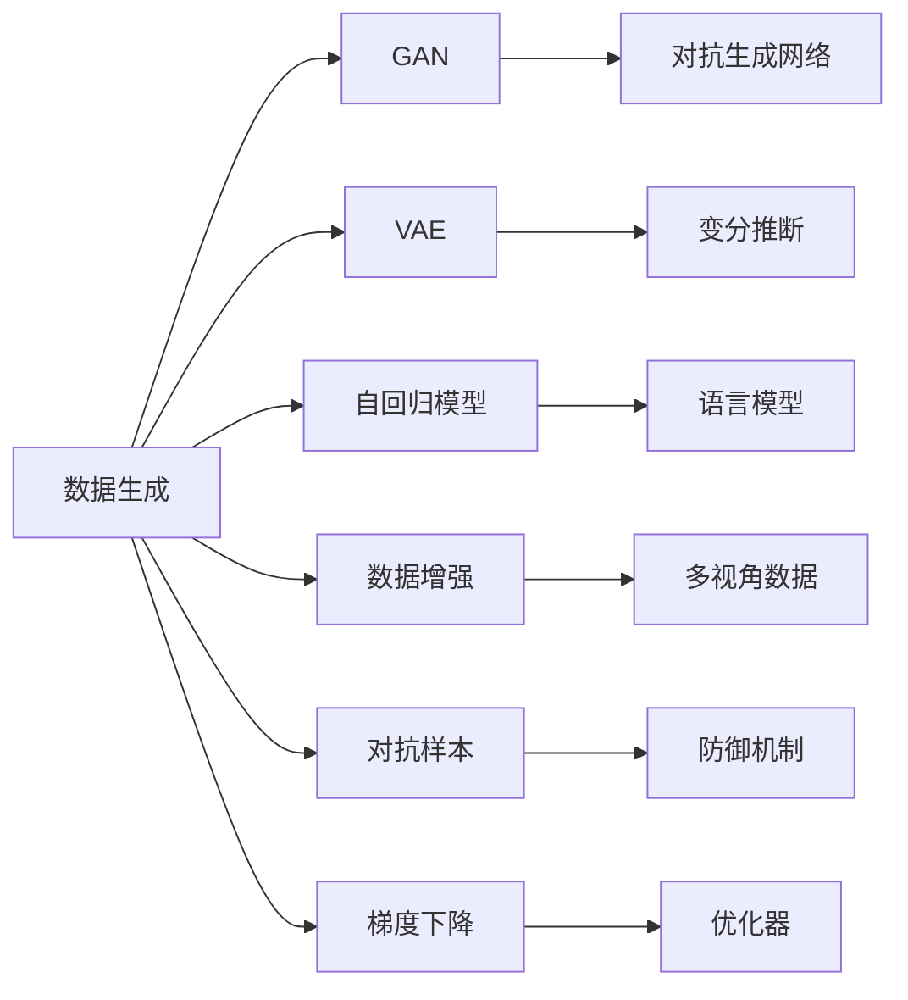

                 

# 生成式AI：如何应对技术发展带来的机遇与挑战？

在人工智能的浩瀚星空中，生成式AI无疑是一颗璀璨的新星，它凭借其在图像生成、自然语言处理、音乐创作等多个领域展现出的卓越能力，迅速吸引了广泛关注。然而，随着技术的不断进步，生成式AI也面临诸多挑战，如何在机遇与挑战并存中求得持续发展，是每一位AI从业者必须深思的问题。本文将深入探讨生成式AI的核心理论、核心算法及其应用领域，剖析其面临的挑战与机遇，为未来的发展提供深思。

## 1. 背景介绍

### 1.1 问题由来

生成式AI，指的是能够生成符合特定分布或条件的数据或内容的技术。它是机器学习特别是深度学习领域的一个重要分支，其发展历程可以追溯到早期的神经网络研究。自2014年提出生成对抗网络（GAN）以来，生成式AI领域迎来了飞速发展，通过大量的研究和实践，如今已能在图像、音频、文本等多种模态上生成高质量、逼真的内容。

生成式AI的兴起，源于对数据和内容的巨大需求，如自动生成图像、音频、视频等，推动了许多创新应用的产生，如自动生成文案、虚拟主播、智能推荐系统等。但同时，其面临的技术挑战也在不断增加，如生成的内容的真实性、多样性、公平性、隐私性等，都亟需解决。

### 1.2 问题核心关键点

生成式AI的核心问题包括：
- **数据分布拟合**：如何通过有限的数据样本，生成符合特定分布的内容。
- **生成过程控制**：如何在生成过程中，控制生成内容的风格、主题、情感等因素。
- **对抗攻击与防御**：如何保证生成内容的真实性和安全性，抵御对抗攻击。
- **模型训练与优化**：如何优化生成模型的训练过程，提升生成质量。
- **多模态数据融合**：如何融合不同模态的数据，提升生成内容的丰富性和多样性。

## 2. 核心概念与联系

### 2.1 核心概念概述

为更好地理解生成式AI，本文将介绍几个关键概念：

- **生成对抗网络（GAN）**：一种由生成器（Generator）和判别器（Discriminator）两部分组成的模型，生成器尝试生成尽可能逼真的数据，而判别器尝试区分真实数据和生成数据。
- **变分自编码器（VAE）**：一种基于概率模型的生成模型，通过编码器将输入数据压缩到潜在空间，再通过解码器生成新的数据。
- **自回归模型**：如LSTM、GPT等，通过预测序列中下一个时间步的输出，来生成序列数据。
- **数据增强**：通过对原始数据进行变换，如旋转、平移、缩放等，生成新的训练数据，提升模型的泛化能力。
- **对抗样本**：通过修改输入数据，使模型输出产生显著变化，用于检测和提升模型的鲁棒性。
- **梯度下降**：优化算法，通过不断调整模型参数，最小化损失函数，使模型输出逼近目标值。

### 2.2 概念间的关系

这些核心概念之间的关系可以通过以下Mermaid流程图来展示：



这个流程图展示了生成式AI的关键组件及其相互关系：

1. **GAN**：作为生成式AI的重要分支，通过生成器和判别器的博弈，学习数据的真实分布。
2. **VAE**：基于概率模型，能够对数据进行压缩和生成，适用于低维数据建模。
3. **自回归模型**：适用于序列数据的生成，如文本、音频等。
4. **数据增强**：通过对原始数据进行变换，扩充训练集，提升模型泛化能力。
5. **对抗样本**：用于检测和提升模型的鲁棒性，防止对抗攻击。
6. **梯度下降**：常用的优化算法，通过调整模型参数最小化损失函数。

这些概念构成了生成式AI的核心生态系统，为其在不同应用场景中的实践提供了坚实基础。

## 3. 核心算法原理 & 具体操作步骤
### 3.1 算法原理概述

生成式AI的核心算法原理主要包括生成对抗网络（GAN）、变分自编码器（VAE）、自回归模型等。这些算法通过不同的原理和方法，实现了从数据生成到内容创造的飞跃。

- **GAN**：通过生成器和判别器的对抗训练，生成逼真的数据，如GAN、CGAN、WGAN等变体。
- **VAE**：通过编码器将输入数据映射到潜在空间，解码器将潜在空间中的数据生成新数据，如GLVAE、MMD-VAE等。
- **自回归模型**：通过预测序列中下一个时间步的输出，生成序列数据，如LSTM、GRU、GPT等。

### 3.2 算法步骤详解

以GAN为例，其基本训练步骤包括：

1. **初始化**：生成器和判别器被初始化为随机权重。
2. **迭代训练**：在每次迭代中，生成器尝试生成样本，判别器尝试区分真实样本和生成样本。
3. **梯度更新**：计算生成器和判别器的梯度，通过梯度下降更新权重。
4. **对抗样本生成**：通过对抗样本技术，提升生成器和判别器的鲁棒性。

以VAE为例，其基本训练步骤包括：

1. **初始化**：编码器和解码器被初始化为随机权重。
2. **迭代训练**：在每次迭代中，编码器将输入数据压缩到潜在空间，解码器将潜在空间中的数据生成新数据。
3. **梯度更新**：计算编码器和解码器的梯度，通过梯度下降更新权重。
4. **数据重构**：通过生成器重构输入数据，评估模型的性能。

以自回归模型为例，其基本训练步骤包括：

1. **初始化**：模型被初始化为随机权重。
2. **迭代训练**：在每次迭代中，模型预测序列中下一个时间步的输出，并计算损失函数。
3. **梯度更新**：计算模型参数的梯度，通过梯度下降更新权重。
4. **序列生成**：通过模型生成新的序列数据，评估模型的性能。

### 3.3 算法优缺点

生成式AI具有以下优点：
- **数据生成能力强**：能够生成高质量、多样化的内容，如高分辨率图像、逼真音频、自然语言等。
- **应用领域广泛**：适用于图像生成、自然语言处理、音乐创作等多个领域。
- **模型灵活性高**：可以通过调整模型参数，实现不同风格和主题的内容生成。

但同时，生成式AI也存在以下缺点：
- **数据依赖性强**：生成式AI的效果依赖于高质量、大规模的训练数据，数据不足时效果不佳。
- **对抗攻击风险高**：生成式AI生成的内容容易被对抗攻击，影响其可靠性和安全性。
- **生成内容可控性差**：生成内容的风格、主题、情感等因素难以完全控制，存在一定的不确定性。
- **模型复杂度高**：生成式AI模型参数量较大，训练和推理耗时较长，需要高性能计算资源。

### 3.4 算法应用领域

生成式AI已经在多个领域得到了广泛应用：

- **图像生成**：如GAN生成的逼真图像、风格迁移等。
- **自然语言处理**：如GPT生成的自然语言文本、文本摘要等。
- **音乐创作**：如WaveNet生成的音乐等。
- **视频生成**：如DALL-E生成的逼真视频等。
- **虚拟现实**：如生成逼真场景、虚拟人物等。

这些应用展示了生成式AI的强大潜力，为各行业带来了颠覆性的变化。

## 4. 数学模型和公式 & 详细讲解 & 举例说明

### 4.1 数学模型构建

以GAN为例，其数学模型包括生成器和判别器的损失函数：

- **生成器损失函数**：
$$
L_G = \mathbb{E}_{\boldsymbol{x} \sim p_{\text{data}}}[\log D(G(\boldsymbol{x}))] + \mathbb{E}_{\boldsymbol{z} \sim p_{\boldsymbol{z}}}[\log(1-D(G(\boldsymbol{z})))]
$$

- **判别器损失函数**：
$$
L_D = \mathbb{E}_{\boldsymbol{x} \sim p_{\text{data}}}[\log D(\boldsymbol{x})] + \mathbb{E}_{\boldsymbol{z} \sim p_{\boldsymbol{z}}}[\log(1-D(G(\boldsymbol{z})))]
$$

其中，$G(\boldsymbol{x})$ 表示生成器输出的样本，$D(\boldsymbol{x})$ 表示判别器对样本的判别概率。

### 4.2 公式推导过程

以VAE为例，其数学模型包括编码器、解码器和重构损失函数：

- **编码器**：
$$
\boldsymbol{z} = \text{Encoder}(\boldsymbol{x})
$$

- **解码器**：
$$
\hat{\boldsymbol{x}} = \text{Decoder}(\boldsymbol{z})
$$

- **重构损失函数**：
$$
L_{\text{recon}} = \mathbb{E}_{\boldsymbol{x} \sim p_{\text{data}}}[\|\boldsymbol{x} - \hat{\boldsymbol{x}}\|^2]
$$

### 4.3 案例分析与讲解

以GAN为例，其生成逼真图像的过程可以简单描述为：

1. **生成器训练**：生成器尝试生成逼真图像，通过判别器评估其真实性。
2. **判别器训练**：判别器尝试区分真实图像和生成图像，通过生成器评估其鉴别能力。
3. **对抗样本生成**：通过对抗样本技术，提升生成器和判别器的鲁棒性。
4. **最终生成**：生成器在判别器的反馈下，不断优化生成图像的真实性，最终生成逼真图像。

## 5. 项目实践：代码实例和详细解释说明

### 5.1 开发环境搭建

在进行生成式AI实践前，我们需要准备好开发环境。以下是使用Python进行TensorFlow开发的环境配置流程：

1. 安装Anaconda：从官网下载并安装Anaconda，用于创建独立的Python环境。

2. 创建并激活虚拟环境：
```bash
conda create -n tf-env python=3.8 
conda activate tf-env
```

3. 安装TensorFlow：根据CUDA版本，从官网获取对应的安装命令。例如：
```bash
pip install tensorflow-gpu
```

4. 安装TensorFlow Addons：用于增强TensorFlow的功能。
```bash
pip install tensorflow-addons
```

5. 安装Numpy、Pandas、Matplotlib等常用工具包：
```bash
pip install numpy pandas matplotlib tqdm jupyter notebook ipython
```

完成上述步骤后，即可在`tf-env`环境中开始生成式AI实践。

### 5.2 源代码详细实现

这里我们以生成GAN为例，给出使用TensorFlow实现GAN的PyTorch代码实现。

首先，定义GAN的生成器和判别器：

```python
import tensorflow as tf
from tensorflow.keras import layers

class Generator(tf.keras.Model):
    def __init__(self, z_dim, img_dim):
        super(Generator, self).__init__()
        self.z_dim = z_dim
        self.img_dim = img_dim
        self.dense1 = layers.Dense(128 * 8 * 8)
        self.reshape1 = layers.Reshape((8, 8, 128))
        self.dense2 = layers.Dense(128 * 4 * 4)
        self.reshape2 = layers.Reshape((4, 4, 128))
        self.dense3 = layers.Dense(128 * 2 * 2)
        self.reshape3 = layers.Reshape((2, 2, 128))
        self.dense4 = layers.Dense(128 * 1 * 1)
        self.reshape4 = layers.Reshape((1, 1, 128))
        self.dense5 = layers.Dense(self.img_dim)
    
    def call(self, inputs):
        x = self.dense1(inputs)
        x = tf.nn.leaky_relu(x)
        x = self.reshape1(x)
        x = self.dense2(x)
        x = tf.nn.leaky_relu(x)
        x = self.reshape2(x)
        x = self.dense3(x)
        x = tf.nn.leaky_relu(x)
        x = self.reshape3(x)
        x = self.dense4(x)
        x = tf.nn.leaky_relu(x)
        x = self.reshape4(x)
        x = self.dense5(x)
        return x

class Discriminator(tf.keras.Model):
    def __init__(self, img_dim):
        super(Discriminator, self).__init__()
        self.img_dim = img_dim
        self.dense1 = layers.Dense(128 * 1 * 1)
        self.reshape1 = layers.Reshape((1, 1, 128))
        self.dense2 = layers.Dense(128 * 2 * 2)
        self.reshape2 = layers.Reshape((2, 2, 128))
        self.dense3 = layers.Dense(128 * 4 * 4)
        self.reshape3 = layers.Reshape((4, 4, 128))
        self.dense4 = layers.Dense(128 * 8 * 8)
        self.reshape4 = layers.Reshape((8, 8, 128))
        self.dense5 = layers.Dense(1)
    
    def call(self, inputs):
        x = self.dense1(inputs)
        x = tf.nn.leaky_relu(x)
        x = self.reshape1(x)
        x = self.dense2(x)
        x = tf.nn.leaky_relu(x)
        x = self.reshape2(x)
        x = self.dense3(x)
        x = tf.nn.leaky_relu(x)
        x = self.reshape3(x)
        x = self.dense4(x)
        x = tf.nn.leaky_relu(x)
        x = self.reshape4(x)
        x = self.dense5(x)
        return x
```

然后，定义损失函数和优化器：

```python
def generator_loss(fake_images, real_images, wgan):
    perceived_loss = tf.reduce_mean(tf.nn.sigmoid_cross_entropy_with_logits(logits=fake_images, labels=wgan))
    return perceived_loss

def discriminator_loss(real_images, fake_images, wgan):
    real_loss = tf.reduce_mean(tf.nn.sigmoid_cross_entropy_with_logits(logits=real_images, labels=1.0))
    fake_loss = tf.reduce_mean(tf.nn.sigmoid_cross_entropy_with_logits(logits=fake_images, labels=0.0))
    loss = real_loss + fake_loss
    return loss

def build_wgan_optimizer():
    generator_optimizer = tf.keras.optimizers.Adam(learning_rate=0.0005)
    discriminator_optimizer = tf.keras.optimizers.Adam(learning_rate=0.0005)
    return generator_optimizer, discriminator_optimizer
```

接着，定义训练函数：

```python
@tf.function
def train_step(real_images):
    with tf.GradientTape() as gen_tape, tf.GradientTape() as disc_tape:
        # Generate fake images
        noise = tf.random.normal([128, latent_dim])
        fake_images = generator(noise)
        
        # Compute losses
        gen_perceived_loss = generator_loss(fake_images, real_images, wgan)
        disc_real_loss = discriminator_loss(real_images, fake_images, wgan)
        disc_fake_loss = discriminator_loss(fake_images, real_images, wgan)
        total_gen_loss = gen_perceived_loss
        
        # Backpropagation
        gradients_of_gen = gen_tape.gradient(total_gen_loss, generator.trainable_variables)
        gradients_of_disc = disc_tape.gradient(disc_real_loss + disc_fake_loss, discriminator.trainable_variables)
        
        # Apply gradients
        generator_optimizer.apply_gradients(zip(gradients_of_gen, generator.trainable_variables))
        discriminator_optimizer.apply_gradients(zip(gradients_of_disc, discriminator.trainable_variables))
    
    return gen_perceived_loss, disc_real_loss, disc_fake_loss, total_gen_loss

def train_epoch(generator, discriminator, train_dataset, wgan):
    for batch in train_dataset:
        real_images = batch[0]
        
        gen_perceived_loss, disc_real_loss, disc_fake_loss, total_gen_loss = train_step(real_images)
    
    return gen_perceived_loss, disc_real_loss, disc_fake_loss, total_gen_loss
```

最后，启动训练流程：

```python
epochs = 100
latent_dim = 100
img_dim = 28

generator = Generator(latent_dim, img_dim)
discriminator = Discriminator(img_dim)
generator_optimizer, discriminator_optimizer = build_wgan_optimizer()

train_dataset = tf.data.Dataset.from_tensor_slices(train_images)
train_dataset = train_dataset.shuffle(buffer_size=10000).batch(batch_size=128)

for epoch in range(epochs):
    gen_perceived_loss, disc_real_loss, disc_fake_loss, total_gen_loss = train_epoch(generator, discriminator, train_dataset, wgan)
    
    print("Epoch [{}/{}], gen_perceived_loss: {:.5f}, disc_real_loss: {:.5f}, disc_fake_loss: {:.5f}, total_gen_loss: {:.5f}".format(epoch+1, epochs, gen_perceived_loss.numpy(), disc_real_loss.numpy(), disc_fake_loss.numpy(), total_gen_loss.numpy()))
    
    if (epoch+1) % 10 == 0:
        create_image_grid(generator, latent_dim, img_dim, epoch+1)
```

以上就是使用TensorFlow实现GAN的完整代码实现。可以看到，TensorFlow提供了强大的自动微分和优化功能，使模型训练变得更加便捷高效。

### 5.3 代码解读与分析

让我们再详细解读一下关键代码的实现细节：

**Generator类和Discriminator类**：
- 定义了生成器和判别器的结构，包括输入输出维度和层数。
- 使用了全连接层、LeakyReLU激活函数等，构建了生成器和判别器的深度神经网络。

**train_step函数**：
- 在每个训练步中，生成器尝试生成逼真图像，判别器尝试区分真实图像和生成图像。
- 计算生成器和判别器的损失函数，并进行反向传播。
- 更新生成器和判别器的参数，优化模型。

**train_epoch函数**：
- 在每个epoch中，对训练集进行迭代训练。
- 每次迭代中，计算生成器和判别器的损失函数，并进行反向传播。
- 更新生成器和判别器的参数，优化模型。

**train函数**：
- 启动训练流程，记录每个epoch的损失值，并在每个epoch结束时生成图像。

**create_image_grid函数**：
- 用于生成图像网格，展示训练过程中生成图像的变化。

通过这些代码实现，我们可以看到生成式AI模型的训练过程大致分为两个部分：生成器的训练和判别器的训练。在每个训练步中，生成器尝试生成逼真图像，判别器则尝试区分真实图像和生成图像。通过这种博弈过程，生成器和判别器的参数不断优化，最终实现高质量内容的生成。

## 6. 实际应用场景
### 6.1 虚拟现实

虚拟现实（VR）是生成式AI的一个重要应用场景。通过生成逼真的虚拟场景、人物等，用户可以沉浸式地体验各种虚拟世界，如虚拟会议、虚拟旅游、虚拟社交等。

在技术实现上，可以通过GAN生成逼真图像，构建虚拟场景和人物。通过深度学习模型，实现对用户行为的实时感知和交互，提供个性化的虚拟体验。

### 6.2 自动图像修复

自动图像修复是生成式AI的另一个重要应用场景。通过生成式模型，可以对受损、缺失的图像进行修复，提升图像质量。

在技术实现上，可以使用VAE生成低分辨率图像，再通过生成式模型对其进行重建，恢复图像细节。通过端到端的训练，使模型能够自动学习图像修复的规律。

### 6.3 语音合成

语音合成是生成式AI的重要应用之一，通过生成逼真语音，可以实现语音助手、虚拟主播、有声读物等功能。

在技术实现上，可以使用生成对抗网络（GAN）生成逼真语音波形，通过语音合成模型将其转换为音频文件。通过不断的迭代优化，提高语音合成的自然度和流畅度。

### 6.4 未来应用展望

随着生成式AI技术的不断进步，未来将有更多新的应用场景涌现，如：

- **个性化推荐系统**：通过生成逼真内容，增强推荐系统的效果和用户体验。
- **自动视频剪辑**：通过生成式模型，自动生成高质量的视频剪辑，提高内容创作效率。
- **虚拟化妆试妆**：通过生成逼真的虚拟试妆效果，提供个性化的美妆体验。
- **智能健康助手**：通过生成逼真的健康咨询内容，提供个性化健康建议。

## 7. 工具和资源推荐
### 7.1 学习资源推荐

为了帮助开发者系统掌握生成式AI的理论基础和实践技巧，这里推荐一些优质的学习资源：

1. **《Deep Learning》书籍**：Ian Goodfellow、Yoshua Bengio、Aaron Courville合著，全面介绍了深度学习的理论和实践，生成式AI是其中重要一章。

2. **《Generative Adversarial Nets》论文**：Ian Goodfellow等人在ICLR 2014年发表的GAN原论文，奠定了生成式AI的理论基础。

3. **《NeurIPS 2016 Tutorial: Generative Adversarial Networks》**：Ian Goodfellow等人在NeurIPS 2016年举办的GAN教程，详细讲解了GAN的原理和实践。

4. **《Deep Learning Specialization》课程**：由Andrew Ng在Coursera开设，包含多个深度学习相关课程，生成式AI是其中重要内容之一。

5. **《Deep Learning with PyTorch》书籍**：Ian Goodfellow、Yoshua Bengio、Aaron Courville合著，介绍了使用PyTorch进行深度学习的实践方法。

6. **《Towards a Theory of Generative Adversarial Networks》论文**：Ian Goodfellow等人在JMLR 2017年发表的GAN理论性研究，深入探讨了GAN的数学基础和优化问题。

### 7.2 开发工具推荐

高效的开发离不开优秀的工具支持。以下是几款用于生成式AI开发的常用工具：

1. **TensorFlow**：由Google主导开发的开源深度学习框架，生产部署方便，适合大规模工程应用。

2. **PyTorch**：基于Python的开源深度学习框架，灵活动态的计算图，适合快速迭代研究。

3. **MXNet**：由Amazon开发的深度学习框架，支持分布式计算，适合高性能计算。

4. **Keras**：一个高层次的深度学习框架，提供便捷的API接口，易于上手使用。

5. **TensorBoard**：TensorFlow配套的可视化工具，可实时监测模型训练状态，并提供丰富的图表呈现方式。

6. **Weights & Biases**：模型训练的实验跟踪工具，可以记录和可视化模型训练过程中的各项指标，方便对比和调优。

### 7.3 相关论文推荐

生成式AI领域的发展离不开学界的持续研究。以下是几篇奠基性的相关论文，推荐阅读：

1. **Generative Adversarial Nets**：Ian Goodfellow等人在ICLR 2014年发表的GAN原论文，奠定了生成式AI的理论基础。

2. **The Unreasonable Effectiveness of Training by Likelihood**：Ian Goodfellow等人在JMLR 2016年发表的VAE论文，提出了变分自编码器的原理和应用。

3. **Towards a Theory of Generative Adversarial Networks**：Ian Goodfellow等人在JMLR 2017年发表的GAN理论性研究，深入探讨了GAN的数学基础和优化问题。

4. **Attention Is All You Need**：Vaswani等人在NeurIPS 2017年发表的Transformer论文，提出了自回归模型在生成式任务中的应用。

5. **WaveNet: A Generative Model for Raw Audio**：Oord等人在ICLR 2017年发表的WaveNet论文，提出了一种生成逼真语音的模型。

这些论文代表了大生成式AI领域的发展脉络，通过学习这些前沿成果，可以帮助研究者把握学科前进方向，激发更多的创新灵感。

除上述资源外，还有一些值得关注的前沿资源，帮助开发者紧跟生成式AI技术的最新进展，例如：

1. **arXiv论文预印本**：人工智能领域最新研究成果的发布平台，包括大量尚未发表的前沿工作，学习前沿技术的必读资源。

2. **顶会直播**：如NeurIPS、ICML、ICLR等人工智能领域顶会现场或在线直播，能够聆听到大佬们的前沿分享，开拓视野。

3. **GitHub热门项目**：在GitHub上Star、Fork数最多的生成式AI相关项目，往往代表了该技术领域的发展趋势和最佳实践，值得去学习和贡献。

4. **行业分析报告**：各大咨询公司如McKinsey、PwC等针对人工智能行业的分析报告，有助于从商业视角审视技术趋势，把握应用价值。

总之，对于生成式AI的学习和实践，需要开发者保持开放的心态和持续学习的意愿。多关注前沿资讯，多动手实践，多思考总结，必将收获满满的成长收益。

##

