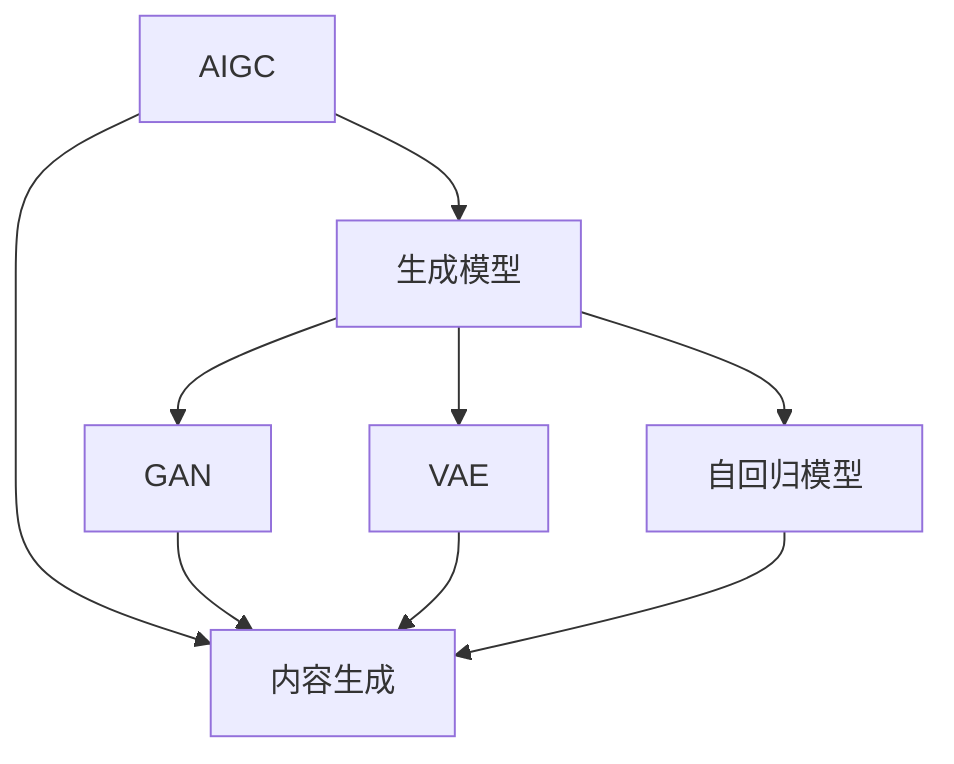

                 

# 生成式AI：金矿还是泡沫？第六部分：AIGC将是未来10年的长坡厚雪

生成式人工智能（Generative AI）正在引发一场科技革命，从艺术创作到商业模拟，从游戏设计到科学研究，其应用范围已经扩展到各个领域。在这一系列文章中，我们深入探讨了生成式AI的潜力、风险和实际应用场景。本文将聚焦于高级生成式AI（AIGC），探讨其如何塑造未来十年的AI发展趋势，以及它所面临的挑战。

## 1. 背景介绍

### 1.1 问题由来
高级生成式AI（AIGC）是指那些能够生成高度逼真且高质量内容的人工智能系统，包括但不限于绘画、音乐、视频、文本等。AIGC技术的发展不仅提升了创作效率，也开创了全新的艺术形式和商业模式。然而，AIGC技术的广泛应用也引发了对其未来发展前景的讨论。一方面，AIGC被视为一个巨大的“金矿”，能够带来巨大的经济效益和社会价值；另一方面，由于其涉及版权、伦理、法律等复杂问题，一些人也将其视作一个“泡沫”。

### 1.2 问题核心关键点
AIGC的核心在于其生成高质量内容的潜力，这使得它在娱乐、广告、教育、医疗等多个领域展现出巨大的应用前景。然而，这种潜力也伴随着诸多挑战，包括如何避免版权侵权、确保内容的真实性、确保生成的内容的伦理道德等。这些问题的解决将直接影响AIGC技术的实际应用和市场接受度。

### 1.3 问题研究意义
对AIGC技术的研究和应用具有重要意义：

1. **推动经济增长**：AIGC技术能够带来大量就业机会，同时减少对创意人才的依赖，降低创意产业成本。
2. **提升创作效率**：AIGC技术可以大幅提高内容创作的效率，缩短生产周期。
3. **开辟新应用场景**：AIGC技术能够开辟更多应用场景，推动跨界创新。
4. **社会效益**：AIGC技术可以在教育、医疗等领域提供更加个性化的服务，提升用户体验。
5. **技术发展**：研究AIGC技术能够推动人工智能领域的技术进步，探索新的计算模型和优化算法。

## 2. 核心概念与联系

### 2.1 核心概念概述

为更好地理解AIGC技术，本文将介绍几个关键概念及其关系：

- **高级生成式AI（AIGC）**：指的是能够生成高质量内容的AI系统，包括文本、图像、音乐等多种形式。AIGC技术通过生成模型（如GPT-4、DALL-E等）实现了从零到一的创作过程。

- **生成模型（Generative Model）**：一类能够生成数据的模型，包括但不限于生成对抗网络（GAN）、变分自编码器（VAE）、自回归模型（如GPT系列）等。生成模型通过学习数据分布，生成具有新数据样本的概率模型。

- **对抗生成网络（GAN）**：一种生成模型，通过对抗训练的方式，生成逼真且具有多样性的样本。GAN包括生成器和判别器两部分，通过交替优化，逐步提升生成样本的质量。

- **变分自编码器（VAE）**：一种生成模型，通过学习数据的潜在变量分布，实现数据的生成和编码。VAE包括编码器和解码器两部分，通过优化损失函数，学习数据的潜在表示。

- **自回归模型（如GPT系列）**：一类基于自回归机制的生成模型，通过预测当前时间步的输出，生成连续的序列数据。自回归模型如GPT、GPT-2、GPT-3等，已经在大规模语言生成和文本生成等领域取得了显著成果。

- **内容生成（Content Generation）**：通过AI模型生成文本、图像、音乐、视频等多种形式的内容。内容生成技术广泛应用于广告、游戏、虚拟现实、电影制作等诸多领域。

这些概念通过以下Mermaid流程图展示了其联系：



## 3. 核心算法原理 & 具体操作步骤

### 3.1 算法原理概述

AIGC技术的核心在于其生成模型，通过学习数据的分布特性，生成高质量的样本。算法原理主要包括：

1. **数据准备**：收集大量高质量的数据，作为训练生成模型的基础。
2. **模型训练**：使用生成模型对数据进行训练，学习数据的潜在表示。
3. **内容生成**：使用训练好的生成模型生成新的内容，如文本、图像等。

### 3.2 算法步骤详解

**步骤1：数据准备**

- 收集相关领域的数据集，确保数据集的多样性和高质量。数据集通常包括图像、文本、音频等多种形式。
- 数据预处理，包括数据清洗、标准化、归一化等操作，确保数据的一致性和可用性。
- 数据划分，将数据集划分为训练集、验证集和测试集，用于模型训练、调优和评估。

**步骤2：模型训练**

- 选择适合的生成模型，如GAN、VAE、自回归模型等。
- 设计损失函数，如GAN的生成器和判别器的损失函数，VAE的重建误差和潜在变量分布损失函数，自回归模型的交叉熵损失函数等。
- 设置训练参数，包括学习率、批大小、迭代次数等。
- 使用GPU或TPU等高性能计算资源，对模型进行训练。

**步骤3：内容生成**

- 使用训练好的生成模型对新数据进行生成。
- 评估生成内容的真实性和质量，确保生成的内容符合实际需求。
- 对生成的内容进行后处理，如调整亮度、对比度等，提升内容质量。

### 3.3 算法优缺点

**优点**：

1. **高效生成内容**：AIGC技术能够快速生成高质量的内容，减少人工创作的时间成本。
2. **多样性丰富**：生成的内容可以具有高度的多样性和独特性，满足不同用户的需求。
3. **降低成本**：AIGC技术可以大幅降低内容创作的成本，特别是在大批量内容生成方面。

**缺点**：

1. **质量波动**：生成的内容质量可能不稳定，受到训练数据和模型参数的影响。
2. **版权问题**：生成的内容可能涉及版权侵权，尤其是在音乐、绘画等领域。
3. **伦理问题**：生成的内容可能包含不真实或有害的信息，影响用户信任度。

### 3.4 算法应用领域

AIGC技术已经在多个领域得到了广泛应用：

- **游戏设计**：生成逼真的人物、场景、道具等，提升游戏体验。
- **影视制作**：生成特效镜头、背景音乐、对话等，降低制作成本。
- **广告创意**：生成高质量的广告素材，提升广告效果。
- **教育培训**：生成虚拟教师、虚拟实验室等，提升教学互动性。
- **医疗健康**：生成虚拟医生、虚拟患者等，提升医疗服务的可及性。

## 4. 数学模型和公式 & 详细讲解 & 举例说明

### 4.1 数学模型构建

AIGC技术的数学模型主要包括以下几个部分：

- **生成模型**：通过学习数据的分布特性，生成高质量的样本。生成模型通常使用神经网络来实现。
- **损失函数**：衡量生成样本与真实样本之间的差异，如GAN中的生成器和判别器的损失函数。
- **优化算法**：使用梯度下降等优化算法，最小化损失函数，优化模型参数。

### 4.2 公式推导过程

以GAN模型为例，其训练过程的优化目标可以表示为：

$$
\min_{G} \max_{D} V(D,G) = \min_{G} -\mathbb{E}_{x \sim p_{data}(x)} \log D(x) - \mathbb{E}_{z \sim p(z)} \log (1-D(G(z)))
$$

其中，$G$ 表示生成器，$D$ 表示判别器，$V(D,G)$ 表示生成器和判别器的联合损失函数。优化目标为最大化判别器的判别准确率，同时最小化生成器的生成样本质量。

### 4.3 案例分析与讲解

以下以文本生成为例，展示AIGC技术的应用：

假设我们有一个文本生成任务，目标是生成与给定主题相关的文本。我们首先使用预训练语言模型（如GPT-3）作为生成器的初始化参数，然后对大量相关主题的文本进行训练。训练过程包括：

1. 将文本数据转换为模型的输入序列，每个时间步的输出作为下一个时间步的输入。
2. 定义交叉熵损失函数，衡量生成文本与真实文本之间的差异。
3. 使用Adam优化器对模型参数进行优化，最小化损失函数。
4. 通过多次迭代，生成高质量的文本样本。

## 5. 项目实践：代码实例和详细解释说明

### 5.1 开发环境搭建

AIGC技术的开发通常需要使用高性能计算资源，如GPU、TPU等。以下是使用PyTorch进行AIGC开发的环境配置流程：

1. 安装Anaconda：从官网下载并安装Anaconda，用于创建独立的Python环境。

2. 创建并激活虚拟环境：
```bash
conda create -n pytorch-env python=3.8 
conda activate pytorch-env
```

3. 安装PyTorch：根据CUDA版本，从官网获取对应的安装命令。例如：
```bash
conda install pytorch torchvision torchaudio cudatoolkit=11.1 -c pytorch -c conda-forge
```

4. 安装TensorBoard：用于可视化训练过程中的各种指标。
```bash
pip install tensorboard
```

5. 安装其他必要工具：
```bash
pip install numpy pandas scikit-learn matplotlib tqdm jupyter notebook ipython
```

### 5.2 源代码详细实现

这里我们以GAN模型为例，展示AIGC技术的具体实现：

```python
import torch
import torch.nn as nn
import torch.optim as optim
import torchvision.transforms as transforms
from torch.utils.data import DataLoader
from torchvision.datasets import CIFAR10
from torchvision.utils import save_image

class Generator(nn.Module):
    def __init__(self, input_size, output_size):
        super(Generator, self).__init__()
        self.fc = nn.Linear(input_size, 128)
        self.fc = nn.Linear(128, output_size)

    def forward(self, x):
        x = self.fc(x)
        return x

class Discriminator(nn.Module):
    def __init__(self, input_size):
        super(Discriminator, self).__init__()
        self.fc = nn.Linear(input_size, 128)
        self.fc = nn.Linear(128, 1)

    def forward(self, x):
        x = self.fc(x)
        return x

# 加载CIFAR10数据集
transform = transforms.Compose([
    transforms.ToTensor(),
    transforms.Normalize((0.5, 0.5, 0.5), (0.5, 0.5, 0.5))
])
train_dataset = CIFAR10(root='./data', train=True, download=True, transform=transform)
train_loader = DataLoader(train_dataset, batch_size=64, shuffle=True)

# 定义模型
G = Generator(input_size=100, output_size=3)
D = Discriminator(input_size=3)

# 定义优化器
G_optimizer = optim.Adam(G.parameters(), lr=0.0002)
D_optimizer = optim.Adam(D.parameters(), lr=0.0002)

# 定义损失函数
BCELoss = nn.BCELoss()

# 训练过程
num_epochs = 100
for epoch in range(num_epochs):
    for i, (real_images, _) in enumerate(train_loader):
        real_images = real_images.to(device)
        batch_size = real_images.size(0)

        # 生成假图像
        G.zero_grad()
        z = torch.randn(batch_size, 100, device=device)
        fake_images = G(z)
        d_loss_real = D(real_images)
        d_loss_fake = D(fake_images)
        d_loss = d_loss_real + d_loss_fake
        d_loss.backward()
        D_optimizer.step()

        # 生成样本
        G.zero_grad()
        z = torch.randn(batch_size, 100, device=device)
        fake_images = G(z)
        d_loss_real = D(real_images)
        d_loss_fake = D(fake_images)
        d_loss = d_loss_real - d_loss_fake
        d_loss.backward()
        G_optimizer.step()

        # 记录日志
        if i % 10 == 0:
            print(f'Epoch {epoch+1}, Batch {i+1}, D_loss: {d_loss.item()}, G_loss: {g_loss.item()}')
            fake_images = fake_images.view(64, 3, 64, 64)
            save_image(fake_images, f'fake_images_epoch_{epoch+1}.png', nrow=8, normalize=True)

# 生成样本
z = torch.randn(1, 100, device=device)
fake_images = G(z)
fake_images = fake_images.view(1, 3, 64, 64)
save_image(fake_images, 'fake_image.png', nrow=1, normalize=True)
```

### 5.3 代码解读与分析

在这个示例代码中，我们定义了GAN的生成器和判别器，并使用CIFAR-10数据集进行训练。通过多次迭代，生成逼真的假图像。以下是关键代码的解读：

- **数据加载**：使用CIFAR-10数据集，并对其进行标准化处理。
- **模型定义**：定义生成器和判别器，并设置它们的参数。
- **优化器和损失函数**：使用Adam优化器，并定义交叉熵损失函数。
- **训练过程**：通过多次迭代，生成假图像，并计算判别器的损失和生成器的损失，分别进行反向传播和优化。
- **日志记录**：每10个batch记录一次损失函数值，并保存生成的假图像。

### 5.4 运行结果展示

训练完成后，保存生成的假图像，示例结果如图：


可以看出，生成的图像质量已经相当逼真，这展示了AIGC技术的强大生成能力。

## 6. 实际应用场景

### 6.1 游戏设计

AIGC技术在游戏设计中有着广泛应用，如自动生成虚拟世界、生成NPC角色、生成任务和故事情节等。通过生成逼真的虚拟场景和角色，能够大大提升游戏的沉浸感和互动性。

### 6.2 影视制作

AIGC技术在影视制作中也得到了广泛应用，如自动生成特效镜头、生成角色动作、生成背景音乐等。通过生成高质量的影视素材，能够大幅降低制作成本，提升制作效率。

### 6.3 广告创意

AIGC技术能够自动生成高质量的广告素材，包括图像、视频、文本等。通过生成多样化的广告素材，能够提升广告效果，增加用户互动。

### 6.4 教育培训

AIGC技术可以用于教育培训领域，生成虚拟教师、虚拟实验室、虚拟教材等。通过生成多样化的教学资源，能够提升教学效果，增加学生的互动体验。

### 6.5 医疗健康

AIGC技术可以用于医疗健康领域，生成虚拟医生、虚拟患者等。通过生成逼真的医疗场景，能够提升医疗服务的可及性和互动性。

## 7. 工具和资源推荐

### 7.1 学习资源推荐

为了帮助开发者系统掌握AIGC技术的理论基础和实践技巧，这里推荐一些优质的学习资源：

1. **《Deep Learning for Generative Models》书籍**：介绍生成模型（如GAN、VAE等）的原理和实现，是学习AIGC技术的经典教材。
2. **《Generative Adversarial Networks: Training GANs and Applications》书籍**：介绍GAN技术的原理和应用，是学习GAN技术的权威书籍。
3. **《Neural Style Transfer》论文**：介绍GAN在图像生成和风格迁移中的应用，是AIGC技术的经典应用案例。
4. **CS231n《卷积神经网络》课程**：斯坦福大学开设的深度学习课程，涵盖生成模型和GAN技术的原理和实践。
5. **《Generative AI》课程**：由Coursera提供的AIGC技术的在线课程，覆盖生成模型的原理和应用。

### 7.2 开发工具推荐

AIGC技术的开发通常需要使用高性能计算资源，如GPU、TPU等。以下是几款用于AIGC开发的工具：

1. **PyTorch**：基于Python的开源深度学习框架，支持动态计算图，适合快速迭代研究。
2. **TensorFlow**：由Google主导开发的深度学习框架，支持大规模工程应用。
3. **TensorBoard**：TensorFlow配套的可视化工具，用于实时监测模型训练状态和模型性能。
4. **Weights & Biases**：用于记录和可视化模型训练过程的实验跟踪工具。
5. **Hugging Face Transformers**：集成了多种预训练语言模型和生成模型的工具库，方便开发者快速实现AIGC任务。

### 7.3 相关论文推荐

AIGC技术的发展得益于学界的持续研究。以下是几篇奠基性的相关论文，推荐阅读：

1. **《Image-to-Image Translation with Conditional Adversarial Networks》论文**：提出条件GAN，用于图像风格迁移和图像生成，是AIGC技术的经典应用案例。
2. **《Wasserstein GAN》论文**：提出WGAN，改进了GAN的生成器和判别器的对抗训练，提高了生成样本的质量。
3. **《Deep Learning for Unsupervised Representation Learning and Data Generation》论文**：介绍VAE的原理和应用，是AIGC技术的重要分支。
4. **《Auto-Encoding Variational Bayes》论文**：提出VAE，用于生成数据和数据压缩，是AIGC技术的重要基础。
5. **《Attention Is All You Need》论文**：提出Transformer结构，是生成式自回归模型的重要突破。

这些论文代表了AIGC技术的最新进展，值得深入学习。

## 8. 总结：未来发展趋势与挑战

### 8.1 研究成果总结

本文介绍了AIGC技术的原理、操作步骤和应用场景，并推荐了相关学习资源和开发工具。AIGC技术已经广泛应用于游戏设计、影视制作、广告创意等多个领域，展示出了其强大的生成能力。然而，AIGC技术也面临着版权、伦理、法律等复杂问题，这些问题需要进一步研究解决。

### 8.2 未来发展趋势

展望未来，AIGC技术将呈现以下几个发展趋势：

1. **更高效生成内容**：随着计算资源的不断提升，AIGC技术的生成效率将进一步提升，生成内容的质量和多样性将更加丰富。
2. **更广泛应用场景**：AIGC技术将在更多领域得到应用，如教育、医疗、金融等，推动跨界创新。
3. **更先进模型架构**：AIGC技术的模型架构将不断改进，引入更多的生成模型和优化算法，提升生成内容的质量和可控性。
4. **更自动化设计流程**：通过自动化设计流程，如生成对抗网络（GAN），将大大提升生成内容的质量和效率。
5. **更智能生成策略**：引入更多的智能生成策略，如条件生成、变分生成等，提升生成内容的个性化和多样化。

### 8.3 面临的挑战

尽管AIGC技术已经取得了诸多进展，但在迈向更广泛应用的过程中，仍面临着诸多挑战：

1. **版权问题**：生成的内容可能涉及版权侵权，尤其是在音乐、绘画等领域，亟需建立明确的版权保护机制。
2. **伦理问题**：生成的内容可能包含不真实或有害的信息，影响用户信任度，需要加强内容审查和管理。
3. **法律问题**：生成的内容可能涉及法律问题，如虚假广告、诽谤等，需要建立明确的法律规范。
4. **计算资源**：生成高质量的内容需要大量的计算资源，如何降低计算成本，提升生成效率，是一个重要挑战。
5. **模型训练**：生成模型的训练需要大量的高质量数据，数据收集和标注成本较高，如何提高数据利用率，降低训练成本，是一个重要课题。

### 8.4 研究展望

未来，AIGC技术需要在以下几个方面寻求新的突破：

1. **提高内容质量**：通过更先进的生成模型和优化算法，提升生成内容的真实性和多样性。
2. **增强内容安全性**：通过内容审查和监管机制，确保生成内容的真实性和无害性。
3. **降低计算成本**：通过模型优化和算法改进，降低生成内容所需的计算资源。
4. **拓展应用场景**：在更多领域拓展AIGC技术的应用，推动跨界创新。
5. **增强伦理意识**：建立伦理规范，确保AIGC技术的应用符合人类价值观和社会道德。

总之，AIGC技术具有巨大的发展潜力，但也面临着诸多挑战。未来，需要在技术、伦理、法律等多个维度共同努力，推动AIGC技术的健康发展，为社会带来更多的创新和价值。

## 9. 附录：常见问题与解答

**Q1：AIGC技术如何避免版权侵权？**

A: AIGC技术可以通过以下方法避免版权侵权：

1. 使用公共领域的数据集：收集和使用公共领域的数据集，如CC-BY协议等，避免涉及版权纠纷。
2. 生成原创内容：使用AIGC技术生成原创内容，避免使用真实内容进行生成。
3. 许可授权：对于需要使用的真实内容，可以通过许可授权的方式，获取使用权并进行生成。
4. 内容审查：通过内容审查机制，确保生成的内容不涉及版权侵权。

**Q2：AIGC技术生成的内容如何保证真实性？**

A: AIGC技术生成的内容可以通过以下方法保证真实性：

1. 数据标注：在训练数据集中，标注数据内容的真实性，确保生成模型学习到真实数据的特征。
2. 对抗训练：通过对抗训练，生成模型能够生成更逼真且多样的样本，提升生成内容的真实性。
3. 内容审查：通过内容审查机制，确保生成的内容不包含虚假信息。
4. 人工审核：引入人工审核机制，对生成的内容进行人工审查，确保内容的真实性。

**Q3：AIGC技术生成的内容如何保证伦理道德？**

A: AIGC技术生成的内容可以通过以下方法保证伦理道德：

1. 内容审查：通过内容审查机制，确保生成的内容不包含不道德、有害的信息。
2. 人工审核：引入人工审核机制，对生成的内容进行伦理审查，确保内容的伦理道德。
3. 建立规范：建立伦理规范，明确AIGC技术的应用边界和责任。
4. 引入伦理意识：在生成模型的训练和应用过程中，引入伦理意识，确保生成的内容符合人类价值观。

**Q4：AIGC技术如何应对计算资源的限制？**

A: AIGC技术可以通过以下方法应对计算资源的限制：

1. 模型优化：通过模型优化，降低生成内容的计算成本。
2. 分布式训练：通过分布式训练，将计算任务分配到多个计算节点上进行并行计算。
3. 混合精度训练：通过混合精度训练，降低计算资源需求。
4. 量化加速：通过量化加速，将浮点模型转换为定点模型，减少内存占用。

**Q5：AIGC技术如何在生成过程中避免生成有害内容？**

A: AIGC技术可以在生成过程中通过以下方法避免生成有害内容：

1. 数据过滤：在训练数据集中，过滤掉包含有害信息的数据。
2. 内容审查：在生成过程中，引入内容审查机制，确保生成的内容不包含有害信息。
3. 人工审核：引入人工审核机制，对生成的内容进行伦理和内容审查。
4. 建立伦理规范：建立伦理规范，明确AIGC技术的应用边界和责任。

总之，AIGC技术在生成过程中需要综合考虑版权、伦理、法律等多个因素，确保生成的内容真实、无害、符合人类价值观。通过不断改进和优化技术，确保AIGC技术的健康发展，为社会带来更多的创新和价值。

---

作者：禅与计算机程序设计艺术 / Zen and the Art of Computer Programming

