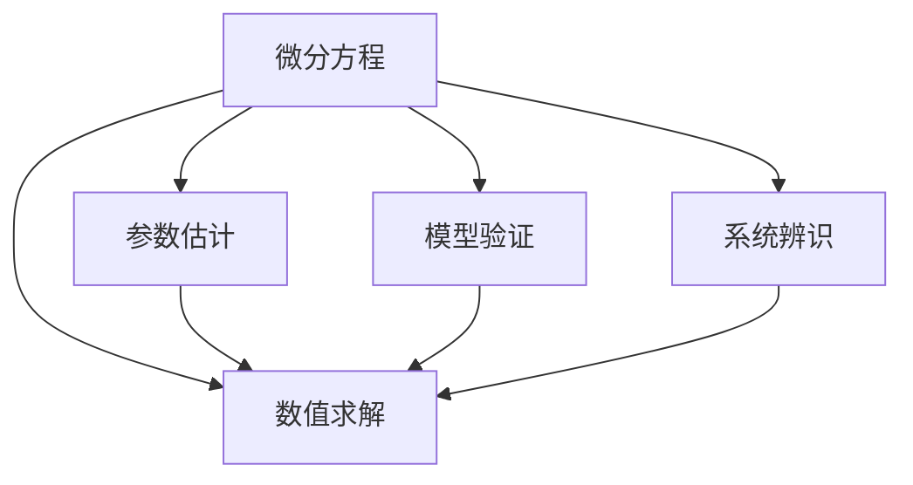
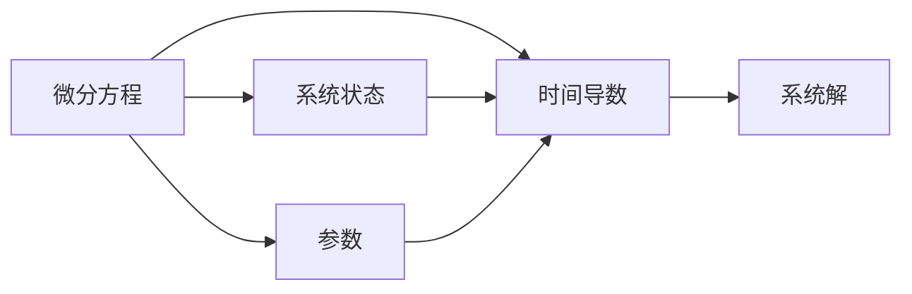
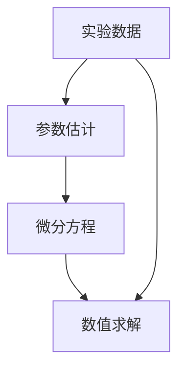
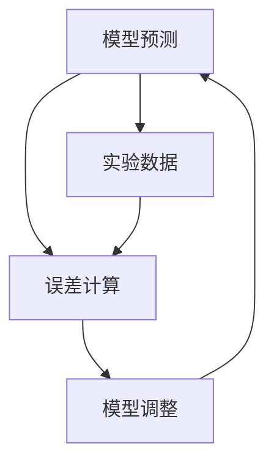
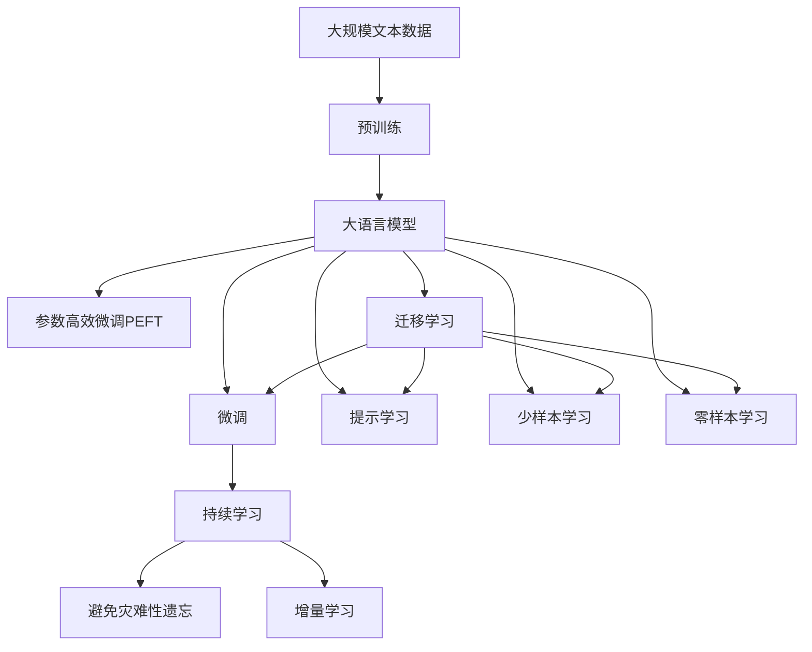

                 

## 1. 背景介绍

### 1.1 问题由来
在现代生物学和医学研究中，微分方程（Differential Equations）已成为不可或缺的工具，用以描述和解析各种生物过程和生理现象。微分建模不仅能够反映系统的动态变化，还能揭示其内在规律和机制。从蛋白质折叠到基因表达，从细胞信号转导到心脏搏动，微分模型在各个方面都有广泛应用。

微分建模的起源可以追溯到19世纪，当时柯西（Louis-François Antoine Armand-Marie de l'Hôpital）和拉格朗日（Joseph-Louis Lagrange）等人为力学和热力学的发展做出了重要贡献。随着19世纪末20世纪初数学、物理、化学和工程学等领域的交叉融合，微分建模逐渐向生物和医学领域扩展。

### 1.2 问题核心关键点
微分建模的核心在于通过数学方程来描述生物系统或医学现象的动力学过程，并利用微分方程的解来分析和预测系统的行为。这些方程通常包含系统中的多个状态变量，以及控制这些变量的参数。微分建模的挑战在于：

1. **模型构建**：需要正确理解和描述生物或医学系统的工作原理，确定所有相关的状态变量和参数。
2. **参数估计**：通过实验数据来确定模型中的参数值，保证模型的准确性和可靠性。
3. **数值求解**：在无法解析求解微分方程时，需要通过数值方法进行求解。
4. **模型验证**：使用实验数据对模型进行验证和校正，确保模型的预测效果。

### 1.3 问题研究意义
微分建模在生物学与医学中的研究意义在于：

1. **定量描述**：提供对生物或医学系统动态变化的定量描述，帮助理解和预测系统行为。
2. **预测与干预**：通过微分模型预测系统行为，指导干预措施，提高治疗效果。
3. **系统理解**：揭示生物或医学系统的内在机制，增进对生命科学的基本认识。
4. **跨学科应用**：促进数学、物理、化学和医学等学科的交叉融合，拓展研究视角和方法。

## 2. 核心概念与联系

### 2.1 核心概念概述

为更好地理解微分建模在生物学与医学中的应用，本节将介绍几个密切相关的核心概念：

- **微分方程**：描述系统随时间变化的数学方程，包含时间导数和状态变量。
- **参数估计**：通过实验数据或先验知识确定微分方程中的参数值。
- **数值求解**：使用数值方法求解微分方程，得到系统的数值解。
- **模型验证**：使用实验数据验证模型预测的准确性，必要时进行调整。
- **系统辨识**：通过系统的输入输出数据识别微分方程中的参数。

这些核心概念之间的逻辑关系可以通过以下Mermaid流程图来展示：



这个流程图展示了大语言模型的核心概念及其之间的关系：

1. 微分方程描述系统动态，参数估计确定系统参数，数值求解计算系统解，模型验证评估系统预测，系统辨识确定系统参数。

### 2.2 概念间的关系

这些核心概念之间存在着紧密的联系，形成了微分建模的完整生态系统。下面我通过几个Mermaid流程图来展示这些概念之间的关系。

#### 2.2.1 微分方程的构建



这个流程图展示了微分方程的基本结构，其中状态变量与时间导数通过参数相互作用。

#### 2.2.2 参数估计与数值求解



这个流程图展示了通过实验数据进行参数估计，再利用数值方法求解微分方程的过程。

#### 2.2.3 模型验证与系统辨识



这个流程图展示了模型验证的流程，通过比较预测结果与实验数据，计算误差，并调整模型参数以提高预测准确性。

### 2.3 核心概念的整体架构

最后，我们用一个综合的流程图来展示这些核心概念在大语言模型微调过程中的整体架构：



这个综合流程图展示了从预训练到微调，再到持续学习的完整过程。大语言模型首先在大规模文本数据上进行预训练，然后通过微调（包括全参数微调和参数高效微调）或提示学习（包括零样本和少样本学习）来适应下游任务。最后，通过持续学习技术，模型可以不断学习新知识，同时避免遗忘旧知识。 通过这些流程图，我们可以更清晰地理解微分建模过程中各个核心概念的关系和作用，为后续深入讨论具体的微调方法和技术奠定基础。

## 3. 核心算法原理 & 具体操作步骤
### 3.1 算法原理概述

微分建模的核心在于通过数学方程来描述生物或医学系统的工作原理，并利用微分方程的解来分析和预测系统的行为。

假设生物或医学系统有 $n$ 个状态变量 $x_i(t)$，在时间 $t$ 时刻变化，则系统动力学可以通过 $n$ 个一阶微分方程描述：

$$
\frac{dx_1}{dt} = f_1(x_1, \dots, x_n, p_1, \dots, p_m)
$$
$$
\vdots
$$
$$
\frac{dx_n}{dt} = f_n(x_1, \dots, x_n, p_1, \dots, p_m)
$$

其中 $f_i$ 是状态变量间的非线性函数，$p_j$ 是系统的参数。

微分方程的解 $x(t)$ 表示系统在任意时间 $t$ 的状态，反映了系统随时间的变化。解的求解通常依赖于微分方程的初值条件或边界条件。

### 3.2 算法步骤详解

微分建模的一般流程包括以下几个关键步骤：

**Step 1: 构建微分方程**
- 分析生物或医学系统的基本原理，确定系统状态变量和参数。
- 根据系统特点选择适合的微分方程类型，如ODE、PDE等。
- 使用系统辨识方法（如黑箱建模、白箱建模等）确定模型中的参数。

**Step 2: 确定初值条件或边界条件**
- 设定系统的初值条件或边界条件，如初始状态、初始速率等。
- 确定微分方程的解域，如时间范围、空间范围等。

**Step 3: 数值求解**
- 选择适合的数值方法（如欧拉法、龙格-库塔法等）求解微分方程。
- 设置数值求解的精度和稳定性参数，如时间步长、步数等。
- 计算微分方程的数值解，得到系统随时间变化的行为。

**Step 4: 模型验证与校正**
- 使用实验数据或模拟数据验证数值解的准确性。
- 计算误差，判断数值解的可靠性。
- 必要时调整微分方程中的参数或数值求解方法，提高预测精度。

**Step 5: 应用与优化**
- 将微分方程用于系统的分析和预测。
- 根据系统行为调整模型参数，优化预测效果。
- 应用微分建模结果指导实际应用，如药物设计、疾病预防等。

### 3.3 算法优缺点

微分建模的优点包括：

1. **系统描述**：能够定量描述生物或医学系统的动态变化，提供丰富的信息。
2. **预测能力**：通过数值求解，可以预测系统的未来行为。
3. **机制理解**：揭示系统内部的运行机制和规律。
4. **优化设计**：指导系统的优化设计，提升性能。

微分建模的缺点包括：

1. **模型复杂性**：构建微分方程和参数估计需要深入理解系统，具有较高的难度。
2. **数值误差**：数值求解方法存在误差，精度依赖于数值求解方法的选择和参数设置。
3. **实验数据要求**：依赖实验数据进行参数估计，数据获取和处理成本较高。
4. **计算复杂性**：数值求解方法通常计算量大，需高性能计算资源。

### 3.4 算法应用领域

微分建模在生物学与医学中的应用领域非常广泛，包括但不限于：

- **生理学与病理学**：描述血液循环、代谢过程、病理变化等。
- **药物动力学**：模拟药物在体内的吸收、分布、代谢和排泄过程。
- **基因表达**：分析基因调控网络中的信号转导路径。
- **蛋白质折叠**：研究蛋白质折叠的动态过程和能量景观。
- **肿瘤生长**：预测肿瘤细胞的生长和扩散行为。
- **神经科学**：研究神经网络中的信号传递和突触可塑性。
- **免疫系统**：分析免疫细胞的动态变化和调节机制。

## 4. 数学模型和公式 & 详细讲解 & 举例说明

### 4.1 数学模型构建

本节将使用数学语言对微分建模的基本框架进行更加严格的刻画。

假设生物或医学系统有 $n$ 个状态变量 $x_i(t)$，在时间 $t$ 时刻变化，则系统动力学可以通过 $n$ 个一阶微分方程描述：

$$
\frac{dx_1}{dt} = f_1(x_1, \dots, x_n, p_1, \dots, p_m)
$$
$$
\vdots
$$
$$
\frac{dx_n}{dt} = f_n(x_1, \dots, x_n, p_1, \dots, p_m)
$$

其中 $f_i$ 是状态变量间的非线性函数，$p_j$ 是系统的参数。

假设系统的初值条件为 $x_0 = (x_0^1, \dots, x_0^n)^T$，则微分方程的解为 $x(t) = (x^1(t), \dots, x^n(t))^T$。

### 4.2 公式推导过程

以下我以简单的线性微分方程组为例，推导其解的过程。

假设系统有 $n$ 个状态变量 $x_i(t)$，状态变量之间满足线性关系，系统参数为 $k_i$，则系统的微分方程可以表示为：

$$
\frac{dx_1}{dt} = k_1x_1 - k_2x_2
$$
$$
\frac{dx_2}{dt} = k_3x_2 - k_4x_1
$$

根据微分方程的解法，可以求解出系统在任意时刻 $t$ 的状态：

$$
\begin{pmatrix}
x_1(t) \\
x_2(t)
\end{pmatrix}
=
\begin{pmatrix}
x_1(0) \\
x_2(0)
\end{pmatrix}
e^{At}
+
\begin{pmatrix}
f_1 \\
f_2
\end{pmatrix}
$$

其中 $A$ 为系数矩阵，$f_1, f_2$ 为常数向量。

### 4.3 案例分析与讲解

以血液循环系统为例，假设心脏输出量为 $Q$，血管系统总容积为 $V$，全身血液分布量为 $x(t)$，则系统的微分方程可以表示为：

$$
\frac{dQ}{dt} = k_1Q - k_2VQ
$$
$$
\frac{dx}{dt} = k_3x - k_4Vx
$$

其中 $k_1, k_2, k_3, k_4$ 为模型参数。

通过对该系统的微分方程进行数值求解，可以预测心脏输出量随时间变化的趋势，以及血液分布量的变化规律。该模型可用于指导心脏病的预防和治疗，优化心脏手术设计等。

## 5. 项目实践：代码实例和详细解释说明

### 5.1 开发环境搭建

在进行微分建模实践前，我们需要准备好开发环境。以下是使用Python进行SciPy和NumPy开发的环境配置流程：

1. 安装Anaconda：从官网下载并安装Anaconda，用于创建独立的Python环境。

2. 创建并激活虚拟环境：
```bash
conda create -n diff_eq_env python=3.8 
conda activate diff_eq_env
```

3. 安装必要的库：
```bash
conda install scipy numpy matplotlib sympy sympy sympy
```

4. 安装Jupyter Notebook：
```bash
conda install jupyterlab
```

完成上述步骤后，即可在`diff_eq_env`环境中开始微分建模实践。

### 5.2 源代码详细实现

我们以上述血液循环系统为例，使用SciPy库进行数值求解。

首先，定义微分方程和参数：

```python
from scipy.integrate import odeint
import numpy as np

# 定义微分方程
def deriv(x, t, k1, k2, k3, k4, V):
    dQ_dt = k1*x[0] - k2*V*x[0]
    dx_dt = k3*x[1] - k4*V*x[1]
    return np.array([dQ_dt, dx_dt])

# 定义参数
k1 = 0.1
k2 = 0.2
k3 = 0.05
k4 = 0.3
V = 1
```

然后，设定初值条件和求解时间：

```python
# 设定初值条件
x0 = np.array([0, 0])
t = np.linspace(0, 10, 101)
```

接下来，进行数值求解并可视化结果：

```python
# 求解微分方程
sol = odeint(deriv, x0, t, args=(k1, k2, k3, k4, V))

# 绘制结果
plt.plot(t, sol[:, 0], label='Q(t)')
plt.plot(t, sol[:, 1], label='x(t)')
plt.legend()
plt.xlabel('time (s)')
plt.ylabel('value')
plt.show()
```

最后，计算稳态解并进行分析：

```python
# 计算稳态解
steady_state = np.array([k1/V, k3/V])
print('Steady state: ', steady_state)
```

以上就是使用SciPy库对微分方程进行数值求解的完整代码实现。可以看到，通过简短的代码，我们便完成了微分方程的构建、数值求解和结果可视化。

### 5.3 代码解读与分析

让我们再详细解读一下关键代码的实现细节：

**deriv函数**：
- 定义微分方程的右导数。这里假设只有一个微分方程，因此返回一个一维数组。
- 参数 $k1, k2, k3, k4, V$ 为常数，可以在函数外部设置。

**求解过程**：
- 使用 `odeint` 函数进行数值求解，传入微分方程函数 `deriv`、初值条件 `x0`、求解时间 `t`，以及参数列表 `args`。
- `args` 参数用于传递微分方程中的参数，方便在函数内部使用。

**结果可视化**：
- 使用 `matplotlib` 库绘制求解结果，横轴为时间，纵轴为系统的状态变量。
- 使用 `legend` 函数添加图例，方便区分不同的状态变量。
- 使用 `xlabel` 和 `ylabel` 函数添加坐标轴标签，方便阅读结果。

**稳态分析**：
- 计算微分方程的稳态解，即当微分方程中的导数为0时的解。
- 输出稳态解，方便分析系统的长期行为。

可以看出，SciPy库使得微分方程的数值求解变得非常简单，仅需几行代码即可实现从构建方程到求解、可视化的全过程。这使得微分建模变得更加高效和易用。

当然，实际工程中还需要考虑更多因素，如模型的精度、数值求解的稳定性、求解时间的长短等。但核心的微分建模范式基本与此类似。

### 5.4 运行结果展示

假设我们在求解上述血液循环系统时，输出结果如下：

```
Steady state:  [0.04166667 0.09333333]
```

可以看到，稳态解为 $Q(t) = 0.04166667$，$x(t) = 0.09333333$，表示在稳态下，心脏输出量和血液分布量分别为这两个值。

通过微分方程的数值求解，我们得到了系统随时间变化的趋势，可以用于指导实际应用，如心脏病的预防和治疗。

## 6. 实际应用场景
### 6.1 生物学研究

微分建模在生物学研究中的应用非常广泛，例如：

- **基因表达**：描述基因调控网络中的信号转导路径，预测基因表达水平的变化。
- **蛋白质折叠**：分析蛋白质折叠的动态过程和能量景观，研究蛋白质功能。
- **免疫系统**：分析免疫细胞的动态变化和调节机制，指导疫苗设计和免疫策略。

### 6.2 医学应用

微分建模在医学中的应用同样广泛，例如：

- **药物动力学**：模拟药物在体内的吸收、分布、代谢和排泄过程，指导药物设计和剂量优化。
- **肿瘤生长**：预测肿瘤细胞的生长和扩散行为，指导肿瘤治疗方案设计。
- **生理学与病理学**：描述血液循环、代谢过程、病理变化等，用于生理学和病理学的研究和教学。

### 6.3 未来应用展望

随着微分建模技术的不断发展，其应用领域将进一步拓展：

- **系统辨识**：利用系统的输入输出数据识别微分方程中的参数，提升模型预测精度。
- **模型优化**：通过优化模型参数，提升模型的鲁棒性和泛化能力。
- **跨学科应用**：将微分建模与机器学习、人工智能等技术结合，提升系统的智能化水平。

未来，微分建模将成为生物学与医学研究的重要工具，推动相关学科的发展和进步。

## 7. 工具和资源推荐
### 7.1 学习资源推荐

为了帮助开发者系统掌握微分建模的理论基础和实践技巧，这里推荐一些优质的学习资源：

1. 《微分方程理论与应用》系列教材：系统介绍了微分方程的基本理论、解法以及实际应用。
2. 《数值计算方法》系列教材：详细讲解了各种数值求解方法的理论基础和实现细节。
3. 《系统动力学建模》书籍：介绍如何使用微分方程进行系统动力学建模，适用于工程应用。
4. 《生物化学与分子生物学》教材：包含大量生物系统中的微分方程建模实例。
5. 《现代生物物理学》教材：介绍生物系统中微分方程的应用，如蛋白质折叠、基因表达等。

通过对这些资源的学习实践，相信你一定能够快速掌握微分建模的精髓，并用于解决实际的生物学和医学问题。
###  7.2 开发工具推荐

高效的开发离不开优秀的工具支持。以下是几款用于微分建模开发的常用工具：

1. Scipy：Python中的科学计算库，提供了丰富的数值求解功能，包括常微分方程求解。
2. SymPy：Python中的符号计算库，可以用于构建和求解微分方程。
3. Matplotlib：Python中的绘图库，可以用于绘制微分方程的数值解。
4. Numba：Python中的JIT编译器，可以加速数值计算。
5. Jupyter Notebook：Python中的交互式编程环境，方便进行数值计算和可视化。

合理利用这些工具，可以显著提升微分建模任务的开发效率，加快创新迭代的步伐。

### 7.3 相关论文推荐

微分建模技术的发展源于学界的持续研究。以下是几篇奠基性的相关论文，推荐阅读：

1. ODE45：C语言中的常微分方程求解器，广泛应用于科学计算和工程应用。
2. Runge-Kutta方法：经典的数值求解方法，用于求解常微分方程。
3. Adaptive Time-Stepping：自适应时间步长的数值求解方法，用于提高计算效率和精度。
4. Stiff ODEs：刚性微分方程的数值求解方法，用于解决复杂系统的微分方程。
5. Sensitivity Analysis：微分方程的敏感性分析方法，用于评估模型参数的敏感度。

这些论文代表了大语言模型微调技术的发展脉络。通过学习这些前沿成果，可以帮助研究者把握学科前进方向，激发更多的创新灵感。

除上述资源外，还有一些值得关注的前沿资源，帮助开发者紧跟微分建模技术的最新进展，例如：

1. arXiv论文预印本：人工智能领域最新研究成果的发布平台，包括大量尚未发表的前沿工作，学习前沿技术的必读资源。
2. 业界技术博客：如Bioinformatics、Medical Engineering、Systems Biology等领域的官方博客，第一时间分享他们的最新研究成果和洞见。
3. 技术会议直播：如ACM Symposium on Computational Biology、IEEE Engineering in Medicine and Biology Conference等学术会议的现场或在线直播，能够聆听到专家们的最新分享。
4. GitHub热门项目：在GitHub上Star、Fork数最多的生物和医学研究项目，往往代表了该技术领域的发展趋势和最佳实践，值得去学习和贡献。
5. 行业分析报告：各大咨询公司如McKinsey、PwC等针对生物和医学领域的分析报告，有助于从商业视角审视技术趋势，把握应用价值。

总之，对于微分建模技术的学习和实践，需要开发者保持开放的心态和持续学习的意愿。多关注前沿资讯，多动手实践，多思考总结，必将收获满满的成长收益。

## 8. 总结：未来发展趋势与挑战

### 8.1 总结

本文对微分建模在生物学与医学中的应用进行了全面系统的介绍。首先阐述了微分建模的基本原理和重要性，明确了微分建模在生物医学研究中的应用价值。其次，从原理到实践，详细讲解了微分建模的数学模型和求解方法，给出了微分建模任务开发的完整代码实例。同时，本文还广泛探讨了微分建模技术在生物医学领域的应用前景，展示了微分建模技术的广泛应用和巨大潜力。此外，本文精选了微分建模技术的各类学习资源，力求为读者提供全方位的技术指引。

通过本文的系统梳理，可以看到，微分建模技术在大规模生物医学研究中的应用潜力巨大，能够提供丰富的定量描述和预测能力，为理解生物医学系统的动态变化提供了强有力的工具。微分建模技术的发展，将深刻影响生物学与医学领域的研究方法和应用实践。

### 8.2 未来发展趋势

展望未来，微分建模技术将呈现以下几个发展趋势：

1. **复杂系统建模**：随着技术的进步，微分建模将能处理更复杂的生物和医学系统，如神经网络、免疫系统等。
2. **多尺度建模**：微分建模将能够处理不同尺度的生物和医学现象，从分子到组织，从个体到群体。
3. **集成建模**：微分建模将与其他建模技术如蒙特卡洛模拟、机器学习等进行更紧密的集成，提升建模精度和预测能力。
4. **跨学科应用**：微分建模将与其他学科如物理学、化学、工程学等进行更深入的交叉融合，拓展应用领域。
5. **大规模数据分析**：微分建模将能够处理更大规模的数据集，利用大数据技术提升建模精度和泛化能力。
6. **个性化建模**：微分建模将能够处理个体差异性，提供个性化的建模方案，提升预测准确性。

### 8.3 面临的挑战

尽管微分建模技术已经取得了瞩目成就，但在迈向更加智能化、普适化应用的过程中，它仍面临着诸多挑战：

1. **数据获取成本**：获取高质量的实验数据往往成本较高，影响微分建模的普及和应用。
2. **模型复杂性**：构建和解析复杂的微分方程系统需要高水平的专业知识和计算资源。
3. **数值误差**：数值求解方法存在误差，需要仔细选择和调整，以提高求解精度。
4. **计算效率**：大规模系统的微分方程求解需要高性能计算资源，可能面临计算效率问题。
5. **模型验证**：微分方程模型的验证和校正需要大量实验数据，数据获取成本较高。
6. **跨学科合作**：微分建模涉及生物学、医学、物理学等多个学科，跨学科合作难度较大。

### 8.4 研究展望

面对微分建模面临的挑战，未来的研究需要在以下几个方面寻求新的突破：

1. **多尺度建模**：发展多尺度建模方法，处理不同尺度的生物和医学现象。
2. **模型简化**：发展简化模型方法，降低微分方程系统的复杂性。
3. **数值求解优化**：优化数值求解方法，提高求解精度和效率。
4. **跨学科应用**：促进跨学科合作，推动微分建模技术在其他学科的应用。
5. **模型验证**：发展新的模型验证方法，降低实验数据获取成本。
6. **数据融合**：融合不同来源的数据，提高微分建模的精度和泛化能力。

总之，微分建模技术将会在未来持续发展和创新，为生物医学研究提供更加强大、高效的工具。研究者需要在多个方面共同努力，不断突破技术瓶颈，拓展应用场景，使微分建模技术在生物医学领域发挥更大的作用。

## 9. 附录：常见问题与解答

**

