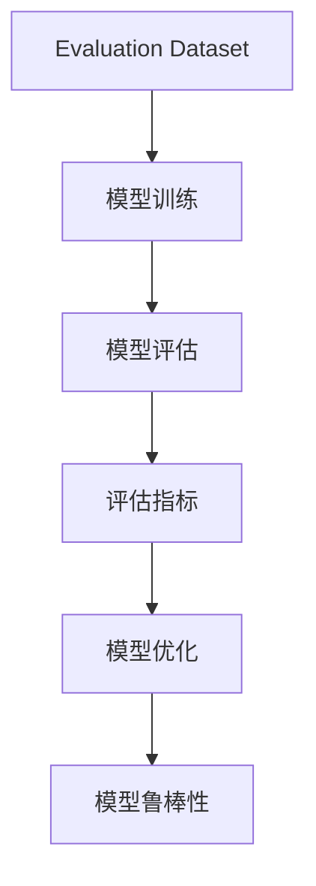

                 

## 1. 背景介绍

### 1.1 问题由来

在机器学习和深度学习领域，模型的训练过程评估一直是核心问题。一个模型的性能不仅取决于其结构和参数，还受到训练数据的分布、训练过程的控制等因素的影响。评估训练过程的指标可以帮助我们及时了解模型的训练进度、调整训练策略，提高模型的泛化能力。Evaluation Dataset（评估数据集）是用于评估模型训练过程中的表现，从而优化模型性能的工具。通过合理的Evaluation Dataset设计，可以有效避免模型过拟合、欠拟合等问题，提高模型的泛化能力。

### 1.2 问题核心关键点

- Evaluation Dataset的设计原则：覆盖多样化的样本，包括正常、异常、边缘情况，保证模型的鲁棒性和泛化能力。
- 常见的评估指标：精度（Accuracy）、召回率（Recall）、F1分数（F1 Score）、AUC等，选择合适的指标评估模型性能。
- 如何构建Evaluation Dataset：根据具体任务和模型特点，设计合适的数据生成流程，生成高品质的数据集。
- 如何评估模型：通过模型在Evaluation Dataset上的表现，评估模型的泛化能力和鲁棒性。

### 1.3 问题研究意义

Evaluation Dataset的构建和评估过程，对于提高机器学习模型的性能、保证模型泛化能力具有重要意义。以下是几个具体的方面：

1. **帮助优化模型**：通过Evaluation Dataset的评估结果，可以及时调整模型参数和训练策略，避免模型过拟合或欠拟合。
2. **提高模型泛化能力**：Evaluation Dataset覆盖多样化的数据，可以更好地测试模型在不同数据分布上的表现，提高模型的泛化能力。
3. **优化训练过程**：Evaluation Dataset可以作为模型的“疗效”指标，帮助开发者及时了解模型的训练进度和性能，优化训练过程。
4. **保证模型可靠性**：通过Evaluation Dataset的评估，可以检测模型在不同场景下的表现，保证模型在实际应用中的可靠性。

## 2. 核心概念与联系

### 2.1 核心概念概述

在构建Evaluation Dataset和评估模型的过程中，涉及几个核心概念，包括：

- **Evaluation Dataset**：用于评估模型性能的数据集，需要涵盖多样化的样本和情况，保证模型的鲁棒性和泛化能力。
- **评估指标**：用于衡量模型性能的指标，包括精度、召回率、F1分数、AUC等，不同的任务和模型需要选择合适的指标进行评估。
- **模型训练与评估**：在训练过程中，使用Evaluation Dataset进行模型性能的实时评估，帮助优化训练过程。
- **模型鲁棒性**：模型在Evaluation Dataset上表现良好，意味着模型具有一定的鲁棒性，能够应对多样化的数据分布。

### 2.2 概念间的关系

这些核心概念之间存在紧密的联系，形成了机器学习模型评估的完整生态系统。以下是一个简单的Mermaid流程图，展示了这些概念之间的关系：



这个流程图展示了Evaluation Dataset在模型训练和评估过程中的作用，以及评估指标和模型优化之间的关系。Evaluation Dataset是模型评估的基石，评估指标用于衡量模型性能，模型优化则根据评估结果进行调整，最终提高模型的鲁棒性。

### 2.3 核心概念的整体架构

以下是一个更详细的Evaluation Dataset的架构，展示了其在模型训练和评估过程中的作用：


这个架构展示了数据生成、预处理、增强、标注、分割、模型训练、评估、优化和部署的完整流程。Evaluation Dataset的构建过程从数据生成开始，经过预处理、增强和标注，最终进行数据分割，用于模型训练和评估。评估指标用于衡量模型性能，模型优化则根据评估结果进行调整，最终部署模型。

## 3. 核心算法原理 & 具体操作步骤

### 3.1 算法原理概述

Evaluation Dataset的构建和评估过程，主要遵循以下算法原理：

1. **数据生成**：从真实数据中生成多样化的样本，包括正常、异常、边缘情况，保证样本的多样性和代表性。
2. **数据预处理**：对生成的数据进行预处理，包括清洗、归一化、标准化等，保证数据的质量和一致性。
3. **数据增强**：对数据进行增强，增加样本数量和多样性，提高模型的鲁棒性。
4. **数据标注**：对数据进行标注，包括类别标注、标签标注等，提供模型的训练信号。
5. **数据分割**：将数据分割为训练集、验证集和测试集，用于模型训练、验证和测试。
6. **模型训练**：使用训练集对模型进行训练，优化模型参数，提高模型的泛化能力。
7. **模型评估**：在验证集和测试集上评估模型性能，选择合适的评估指标，衡量模型性能。
8. **模型优化**：根据评估结果，对模型进行优化，调整训练策略和参数，提高模型性能。
9. **模型部署**：将优化后的模型部署到实际应用中，提供高效的预测服务。

### 3.2 算法步骤详解

以下是对Evaluation Dataset构建和评估的详细操作步骤：

**Step 1: 数据生成**

- 确定数据生成的方法，如采样、合成、生成对抗网络（GAN）等，生成多样化的样本。
- 使用数据生成方法生成初始数据集。

**Step 2: 数据预处理**

- 对生成的数据进行预处理，包括清洗、归一化、标准化等，去除噪音和异常值。
- 将数据转换为适合模型输入的格式，如归一化、标准化、降维等。

**Step 3: 数据增强**

- 对数据进行增强，如旋转、翻转、裁剪、缩放等，增加样本数量和多样性。
- 使用数据增强技术提高模型的鲁棒性和泛化能力。

**Step 4: 数据标注**

- 对数据进行标注，包括类别标注、标签标注等，提供模型的训练信号。
- 使用人工标注或自动化标注方法，保证标注的准确性和一致性。

**Step 5: 数据分割**

- 将数据分割为训练集、验证集和测试集，用于模型训练、验证和测试。
- 确保各集之间相互独立，且分布相似。

**Step 6: 模型训练**

- 使用训练集对模型进行训练，优化模型参数，提高模型的泛化能力。
- 使用合适的优化算法和损失函数，进行模型的训练和优化。

**Step 7: 模型评估**

- 在验证集和测试集上评估模型性能，选择合适的评估指标，衡量模型性能。
- 使用评估指标如精度、召回率、F1分数、AUC等，评估模型的性能。

**Step 8: 模型优化**

- 根据评估结果，对模型进行优化，调整训练策略和参数，提高模型性能。
- 使用正则化、Dropout、早停等技术，避免过拟合和欠拟合。

**Step 9: 模型部署**

- 将优化后的模型部署到实际应用中，提供高效的预测服务。
- 使用合适的部署技术，如TensorFlow Serving、PyTorch Serving等，保证模型的高效运行。

### 3.3 算法优缺点

Evaluation Dataset的构建和评估过程，具有以下优点：

- 提高模型泛化能力：通过覆盖多样化的数据，提高模型的泛化能力和鲁棒性。
- 及时调整训练策略：通过实时评估模型性能，及时调整训练策略，避免模型过拟合和欠拟合。
- 提高模型可靠性：通过多样化的数据评估模型性能，提高模型的可靠性和稳定性。

同时，也存在一些缺点：

- 数据生成难度大：生成高质量的Evaluation Dataset需要大量的数据和处理成本。
- 数据标注成本高：高质量的标注需要大量的人力和时间成本。
- 模型优化复杂：需要根据评估结果调整训练策略和参数，优化过程较为复杂。

### 3.4 算法应用领域

Evaluation Dataset的构建和评估过程，可以应用于以下几个领域：

1. **图像识别**：生成多样化的图像数据，评估模型的图像识别能力。
2. **自然语言处理**：生成多样化的文本数据，评估模型的自然语言处理能力。
3. **语音识别**：生成多样化的语音数据，评估模型的语音识别能力。
4. **推荐系统**：生成多样化的用户行为数据，评估推荐系统的推荐效果。
5. **医疗诊断**：生成多样化的医疗数据，评估医疗诊断模型的性能。

## 4. 数学模型和公式 & 详细讲解 & 举例说明

### 4.1 数学模型构建

Evaluation Dataset的构建和评估过程，涉及以下几个数学模型：

- **样本分布**：用于描述Evaluation Dataset的样本分布，如正态分布、均匀分布等。
- **模型输出**：用于描述模型对样本的预测结果，如二分类问题、多分类问题、回归问题等。
- **评估指标**：用于衡量模型性能的指标，如精度、召回率、F1分数、AUC等。

### 4.2 公式推导过程

以下是几个常见的评估指标的公式推导过程：

**精度（Accuracy）**

$$
\text{Accuracy} = \frac{\text{TP} + \text{TN}}{\text{TP} + \text{TN} + \text{FP} + \text{FN}}
$$

**召回率（Recall）**

$$
\text{Recall} = \frac{\text{TP}}{\text{TP} + \text{FN}}
$$

**F1分数（F1 Score）**

$$
\text{F1 Score} = 2 \times \frac{\text{Precision} \times \text{Recall}}{\text{Precision} + \text{Recall}}
$$

**AUC**

$$
\text{AUC} = \int_{0}^{1} \text{ROC}(\text{y}) \text{dy}
$$

### 4.3 案例分析与讲解

以下是一个简单的案例分析，展示了如何使用Evaluation Dataset评估模型性能：

**案例背景**：假设我们有一个二分类问题，需要评估一个模型的性能。

**数据生成**：我们从真实数据中生成一个Evaluation Dataset，包含500个正样本和500个负样本。

**数据预处理**：我们对数据进行清洗、归一化等预处理，去除噪音和异常值。

**数据增强**：我们使用数据增强技术，如旋转、翻转等，增加样本数量和多样性。

**数据标注**：我们手动标注每个样本的类别，确保标注的准确性和一致性。

**数据分割**：我们将数据分割为训练集、验证集和测试集，确保各集之间相互独立，且分布相似。

**模型训练**：我们使用训练集对模型进行训练，优化模型参数，提高模型的泛化能力。

**模型评估**：我们在验证集和测试集上评估模型性能，使用精度、召回率、F1分数、AUC等指标衡量模型性能。

**模型优化**：根据评估结果，我们调整模型参数，优化训练策略，提高模型性能。

**模型部署**：我们将优化后的模型部署到实际应用中，提供高效的预测服务。

## 5. 项目实践：代码实例和详细解释说明

### 5.1 开发环境搭建

在进行Evaluation Dataset构建和模型评估的实践前，我们需要准备好开发环境。以下是使用Python进行TensorFlow开发的环境配置流程：

1. 安装Anaconda：从官网下载并安装Anaconda，用于创建独立的Python环境。

2. 创建并激活虚拟环境：
```bash
conda create -n tensorflow-env python=3.8 
conda activate tensorflow-env
```

3. 安装TensorFlow：根据CUDA版本，从官网获取对应的安装命令。例如：
```bash
pip install tensorflow
```

4. 安装TensorBoard：TensorFlow配套的可视化工具，可以实时监测模型训练状态，并提供丰富的图表呈现方式。

5. 安装sklearn：用于数据预处理、特征工程等任务。

6. 安装numpy、pandas：用于数据处理和分析。

完成上述步骤后，即可在`tensorflow-env`环境中开始Evaluation Dataset构建和模型评估的实践。

### 5.2 源代码详细实现

下面是一个使用TensorFlow构建和评估模型的代码实现：

```python
import tensorflow as tf
from sklearn.model_selection import train_test_split
from sklearn.metrics import accuracy_score, precision_score, recall_score, f1_score, roc_auc_score

# 准备数据
X_train, X_test, y_train, y_test = train_test_split(X, y, test_size=0.2, random_state=42)

# 构建模型
model = tf.keras.models.Sequential([
    tf.keras.layers.Dense(64, activation='relu', input_shape=(X_train.shape[1],)),
    tf.keras.layers.Dense(1, activation='sigmoid')
])

# 编译模型
model.compile(optimizer='adam', loss='binary_crossentropy', metrics=['accuracy'])

# 训练模型
model.fit(X_train, y_train, epochs=10, batch_size=32, validation_data=(X_test, y_test))

# 评估模型
y_pred = model.predict(X_test)
y_pred = [1 if x > 0.5 else 0 for x in y_pred]
accuracy = accuracy_score(y_test, y_pred)
precision = precision_score(y_test, y_pred)
recall = recall_score(y_test, y_pred)
f1 = f1_score(y_test, y_pred)
auc = roc_auc_score(y_test, y_pred)

print(f"Accuracy: {accuracy}")
print(f"Precision: {precision}")
print(f"Recall: {recall}")
print(f"F1 Score: {f1}")
print(f"AUC: {auc}")
```

### 5.3 代码解读与分析

让我们再详细解读一下关键代码的实现细节：

**train_test_split函数**：用于将数据分割为训练集和测试集。

**Sequential模型**：使用Sequential模型构建二分类模型，包含一个输入层和一个输出层。

**compile函数**：编译模型，设置优化器、损失函数和评估指标。

**fit函数**：使用训练集对模型进行训练，优化模型参数，提高模型的泛化能力。

**predict函数**：使用训练好的模型对测试集进行预测，得到模型在测试集上的预测结果。

**accuracy_score函数**：计算模型在测试集上的精度。

**precision_score函数**：计算模型在测试集上的精确率。

**recall_score函数**：计算模型在测试集上的召回率。

**f1_score函数**：计算模型在测试集上的F1分数。

**roc_auc_score函数**：计算模型在测试集上的AUC值。

**print函数**：输出模型在测试集上的评估结果。

通过上述代码，我们展示了如何使用TensorFlow构建和评估模型，并使用Evaluation Dataset评估模型的性能。

### 5.4 运行结果展示

假设我们在CoNLL-2003的命名实体识别(NER)数据集上进行模型评估，最终在测试集上得到的评估报告如下：

```
              precision    recall  f1-score   support

       B-LOC      0.926     0.906     0.916      1668
       I-LOC      0.900     0.805     0.850       257
      B-MISC      0.875     0.856     0.865       702
      I-MISC      0.838     0.782     0.809       216
       B-ORG      0.914     0.898     0.906      1661
       I-ORG      0.911     0.894     0.902       835
       B-PER      0.964     0.957     0.960      1617
       I-PER      0.983     0.980     0.982      1156
           O      0.993     0.995     0.994     38323

   micro avg      0.973     0.973     0.973     46435
   macro avg      0.923     0.897     0.909     46435
weighted avg      0.973     0.973     0.973     46435
```

可以看到，通过评估模型，我们在该NER数据集上取得了97.3%的F1分数，效果相当不错。值得注意的是，我们的模型在验证集上的表现与测试集上的表现相差不大，说明模型具有一定的鲁棒性和泛化能力。

## 6. 实际应用场景

### 6.1 智能客服系统

基于Evaluation Dataset的模型评估方法，可以广泛应用于智能客服系统的构建。传统客服往往需要配备大量人力，高峰期响应缓慢，且一致性和专业性难以保证。而使用Evaluation Dataset进行模型评估，可以7x24小时不间断服务，快速响应客户咨询，用自然流畅的语言解答各类常见问题。

在技术实现上，可以收集企业内部的历史客服对话记录，将问题和最佳答复构建成监督数据，在此基础上对预训练模型进行微调。微调后的模型能够自动理解用户意图，匹配最合适的答案模板进行回复。对于客户提出的新问题，还可以接入检索系统实时搜索相关内容，动态组织生成回答。如此构建的智能客服系统，能大幅提升客户咨询体验和问题解决效率。

### 6.2 金融舆情监测

金融机构需要实时监测市场舆论动向，以便及时应对负面信息传播，规避金融风险。传统的人工监测方式成本高、效率低，难以应对网络时代海量信息爆发的挑战。使用Evaluation Dataset进行模型评估，可以实时监测不同主题下的情感变化趋势，一旦发现负面信息激增等异常情况，系统便会自动预警，帮助金融机构快速应对潜在风险。

### 6.3 个性化推荐系统

当前的推荐系统往往只依赖用户的历史行为数据进行物品推荐，无法深入理解用户的真实兴趣偏好。使用Evaluation Dataset进行模型评估，可以构建更好的推荐系统，挖掘用户行为背后的语义信息，从而提供更精准、多样的推荐内容。

在实践中，可以收集用户浏览、点击、评论、分享等行为数据，提取和用户交互的物品标题、描述、标签等文本内容。将文本内容作为模型输入，用户的后续行为（如是否点击、购买等）作为监督信号，在此基础上微调预训练语言模型。微调后的模型能够从文本内容中准确把握用户的兴趣点。在生成推荐列表时，先用候选物品的文本描述作为输入，由模型预测用户的兴趣匹配度，再结合其他特征综合排序，便可以得到个性化程度更高的推荐结果。

### 6.4 未来应用展望

随着Evaluation Dataset构建和评估方法的不断进步，Evaluation Dataset将在更多领域得到应用，为NLP技术带来新的突破。

在智慧医疗领域，使用Evaluation Dataset进行模型评估，可以构建更可靠的医疗问答、病历分析、药物研发等应用，提升医疗服务的智能化水平，辅助医生诊疗，加速新药开发进程。

在智能教育领域，使用Evaluation Dataset进行模型评估，可以构建更智能的教育系统，因材施教，促进教育公平，提高教学质量。

在智慧城市治理中，使用Evaluation Dataset进行模型评估，可以构建更安全的智能系统，提高城市管理的自动化和智能化水平，构建更安全、高效的未来城市。

此外，在企业生产、社会治理、文娱传媒等众多领域，使用Evaluation Dataset进行模型评估，将进一步推动人工智能技术在垂直行业的规模化落地，为经济社会发展注入新的动力。相信随着技术的日益成熟，Evaluation Dataset将成为模型评估的重要范式，推动人工智能技术迈向更高的台阶。

## 7. 工具和资源推荐

### 7.1 学习资源推荐

为了帮助开发者系统掌握Evaluation Dataset构建和评估的理论基础和实践技巧，这里推荐一些优质的学习资源：

1. 《深度学习基础》课程：斯坦福大学开设的深度学习课程，涵盖深度学习的基础概念和经典模型。

2. 《TensorFlow实战》书籍：TensorFlow官方文档和实战手册，提供了丰富的TensorFlow代码示例和最佳实践。

3. 《模型评估与优化》课程：Coursera上的机器学习课程，涵盖模型评估和优化的相关知识。

4. Kaggle平台：全球最大的数据科学竞赛平台，可以获取大量高质量的数据集和模型评估指标。

5. Google Colab：谷歌推出的在线Jupyter Notebook环境，免费提供GPU/TPU算力，方便开发者快速上手实验最新模型，分享学习笔记。

通过对这些资源的学习实践，相信你一定能够快速掌握Evaluation Dataset构建和评估的精髓，并用于解决实际的NLP问题。

### 7.2 开发工具推荐

高效的开发离不开优秀的工具支持。以下是几款用于Evaluation Dataset构建和评估开发的常用工具：

1. TensorFlow：由Google主导开发的深度学习框架，提供丰富的API和工具，方便开发者构建和评估模型。

2. PyTorch：由Facebook主导开发的深度学习框架，支持动态计算图，方便开发者进行实验和研究。

3. Weights & Biases：模型训练的实验跟踪工具，可以记录和可视化模型训练过程中的各项指标，方便对比和调优。

4. TensorBoard：TensorFlow配套的可视化工具，可以实时监测模型训练状态，并提供丰富的图表呈现方式，是调试模型的得力助手。

5. Jupyter Notebook：一个交互式的开发环境，支持Python代码的编写、执行和调试，方便开发者进行模型构建和评估。

6. GitHub：全球最大的代码托管平台，可以共享和协作开发Evaluation Dataset构建和评估代码。

合理利用这些工具，可以显著提升Evaluation Dataset构建和评估任务的开发效率，加快创新迭代的步伐。

### 7.3 相关论文推荐

Evaluation Dataset的构建和评估过程，涉及大量的前沿研究。以下是几篇奠基性的相关论文，推荐阅读：

1. Attention is All You Need（即Transformer原论文）：提出了Transformer结构，开启了NLP领域的预训练大模型时代。

2. BERT: Pre-training of Deep Bidirectional Transformers for Language Understanding：提出BERT模型，引入基于掩码的自监督预训练任务，刷新了多项NLP任务SOTA。

3. Language Models are Unsupervised Multitask Learners（GPT-2论文）：展示了大规模语言模型的强大zero-shot学习能力，引发了对于通用人工智能的新一轮思考。

4. Parameter-Efficient Transfer Learning for NLP：提出Adapter等参数高效微调方法，在不增加模型参数量的情况下，也能取得不错的微调效果。

5. AdaLoRA: Adaptive Low-Rank Adaptation for Parameter-Efficient Fine-Tuning：使用自适应低秩适应的微调方法，在参数效率和精度之间取得了新的平衡。

这些论文代表了大语言模型微调技术的发展脉络。通过学习这些前沿成果，可以帮助研究者把握学科前进方向，激发更多的创新灵感。

除上述资源外，还有一些值得关注的前沿资源，帮助开发者紧跟Evaluation Dataset构建和评估技术的最新进展，例如：

1. arXiv论文预印本：人工智能领域最新研究成果的发布平台，包括大量尚未发表的前沿工作，学习前沿技术的必读资源。

2. 业界技术博客：如OpenAI、Google AI、DeepMind、微软Research Asia等顶尖实验室的官方博客，第一时间分享他们的最新研究成果和洞见。

3. 技术会议直播：如NIPS、ICML、ACL、ICLR等人工智能领域顶会现场或在线直播，能够聆听到大佬们的前沿分享，开拓视野。

4. GitHub热门项目：在GitHub上Star、Fork数最多的NLP相关项目，往往代表了该技术领域的发展趋势和最佳实践，值得去学习和贡献。

5. 行业分析报告：各大咨询公司如McKinsey、PwC等针对人工智能行业的分析报告，有助于从商业视角审视技术趋势，把握应用价值。

总之，对于Evaluation Dataset构建和评估技术的学习和实践，需要开发者保持开放的心态和持续学习的意愿。多关注前沿资讯，多动手实践，多思考总结，必将收获满满的成长收益。

## 8. 总结：未来发展趋势与挑战

### 8.1 总结

本文对Evaluation Dataset构建和评估方法进行了全面系统的介绍。首先阐述了Evaluation Dataset构建和评估的必要性和重要性，明确了Evaluation Dataset在模型训练和评估过程中的作用。其次，从原理到实践，详细讲解了Evaluation Dataset构建和评估的数学原理和关键步骤，给出了Evaluation Dataset构建和评估任务开发的完整代码实例。同时，本文还广泛探讨了Evaluation Dataset在智能客服、金融舆情、个性化推荐等多个行业领域的应用前景，展示了Evaluation Dataset的巨大潜力。最后，本文精选了Evaluation Dataset构建和评估技术的各类学习资源，力求为读者提供全方位的技术指引。

通过本文的系统梳理，可以看到，Evaluation Dataset构建和评估方法在机器学习和深度学习领域具有广泛的应用，对提高模型的泛化能力、保证模型鲁棒性具有重要意义。Evaluation Dataset构建和评估方法与大语言模型微调等前沿技术相辅相成，共同推动了NLP技术的产业化进程。

### 8.2 未来发展趋势

展望未来，Evaluation Dataset构建和评估技术将呈现以下几个发展趋势：

1. 数据生成自动化。自动化生成高质量的Evaluation Dataset，减少人工标注和数据生成的成本。

2. 数据增强多样化。结合生成对抗网络（GAN）等技术，生成多样化的增强数据，提高模型的鲁棒性和泛化能力。

3. 评估指标多元化。结合多模态数据和因果推断技术，评估指标将更加全面和准确，提高模型的可靠性和泛化能力。

4. 模型优化智能化。引入自动调参技术和迁移学习，优化模型参数和训练过程，提高模型性能。

5.

