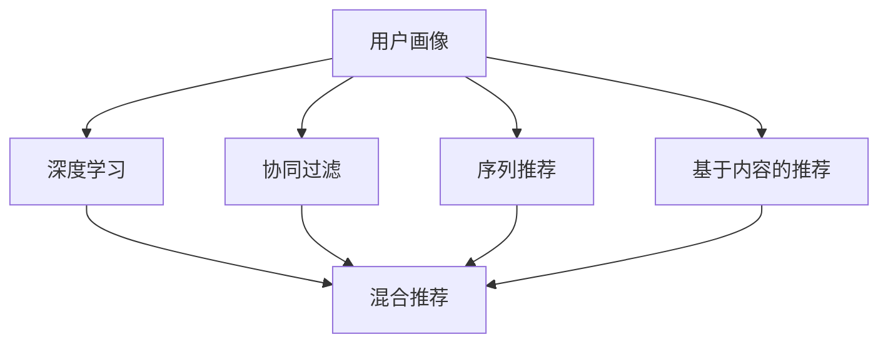
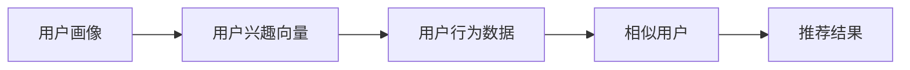
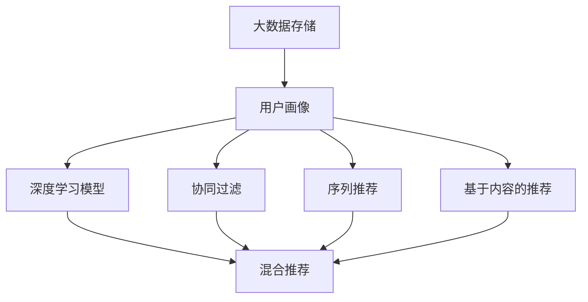

                 

# 用户画像技术如何与其他 AI 技术结合，提升推荐效果：技术融合与创新

> 关键词：用户画像,推荐系统,深度学习,协同过滤,序列推荐,基于内容的推荐,混合推荐

## 1. 背景介绍

### 1.1 问题由来
在数字化时代的背景下，用户的个性化需求和行为的复杂性不断增加，这使得传统的基于内容的推荐系统无法有效满足用户需求。同时，社交网络、电商平台等平台积累了大量用户数据，这些数据为个性化推荐提供了新的机会。然而，如何有效利用这些数据，提升推荐系统的性能，仍然是一个亟待解决的问题。

### 1.2 问题核心关键点
用户画像（User Profile）技术通过收集、处理和分析用户数据，构建用户的兴趣、行为和特征模型，从而为个性化推荐提供基础。近年来，用户画像技术与其他AI技术的结合，如深度学习、协同过滤、序列推荐等，成为提升推荐效果的重要手段。

### 1.3 问题研究意义
用户画像技术与其他AI技术的结合，能够有效提升推荐系统的准确性、多样性和个性化程度。通过构建全面的用户画像，推荐系统可以更好地理解用户需求，生成更加符合用户期望的推荐内容。这不仅能够提升用户体验，还能增加平台的用户粘性和商业价值。

## 2. 核心概念与联系

### 2.1 核心概念概述

为更好地理解用户画像技术如何与其他AI技术结合，本节将介绍几个密切相关的核心概念：

- 用户画像（User Profile）：通过收集、处理和分析用户行为、兴趣、属性等数据，构建用户的完整描述，以便更准确地理解用户需求。
- 深度学习（Deep Learning）：一种基于多层神经网络的机器学习方法，能够自动从大量数据中提取高层次的特征表示。
- 协同过滤（Collaborative Filtering）：利用用户之间的相似性，通过已有用户的行为来预测新用户的偏好。
- 序列推荐（Sequential Recommendation）：基于用户的序列行为数据（如浏览历史、点击历史）进行推荐，能够更好地捕捉用户的短期兴趣和动态变化。
- 基于内容的推荐（Content-Based Recommendation）：根据用户的历史兴趣和偏好，推荐符合用户兴趣的相似物品。
- 混合推荐（Hybrid Recommendation）：结合多种推荐技术（如协同过滤、基于内容的推荐、序列推荐等），综合考虑用户的长期兴趣和短期兴趣，提升推荐效果。

这些核心概念之间的逻辑关系可以通过以下Mermaid流程图来展示：



这个流程图展示了用户画像技术与其他AI技术的关系：

1. 用户画像通过收集和分析用户数据，为其他推荐技术提供输入。
2. 深度学习、协同过滤、序列推荐等推荐技术，可以基于用户画像，更准确地预测用户偏好。
3. 混合推荐技术能够综合多种推荐方法，提供更全面、准确的推荐结果。

### 2.2 概念间的关系

这些核心概念之间存在着紧密的联系，形成了推荐系统的完整生态系统。下面我们通过几个Mermaid流程图来展示这些概念之间的关系。

#### 2.2.1 用户画像的基本结构


这个流程图展示了用户画像的基本结构，从用户基本信息和行为数据出发，逐步构建用户兴趣和特征模型。

#### 2.2.2 深度学习在推荐系统中的应用


这个流程图展示了深度学习在推荐系统中的应用，从用户画像中提取特征向量，输入到深度学习模型中进行推荐预测。

#### 2.2.3 协同过滤的推荐过程



这个流程图展示了协同过滤的推荐过程，从用户画像和行为数据出发，找到与目标用户兴趣相似的其他用户，基于这些相似用户的推荐结果，生成目标用户的推荐。

#### 2.2.4 序列推荐的推荐过程


这个流程图展示了序列推荐的推荐过程，从用户的行为序列中提取兴趣模型，直接生成推荐结果。

#### 2.2.5 基于内容的推荐过程


这个流程图展示了基于内容的推荐过程，从用户兴趣和物品特征向量出发，找到与目标用户兴趣相似的物品，直接生成推荐结果。

### 2.3 核心概念的整体架构

最后，我们用一个综合的流程图来展示这些核心概念在大数据推荐系统中的整体架构：



这个综合流程图展示了从大数据存储到推荐结果的全过程，用户画像作为数据输入，经过深度学习、协同过滤、序列推荐和基于内容的推荐等多方面的处理，最终生成混合推荐的推荐结果。

## 3. 核心算法原理 & 具体操作步骤
### 3.1 算法原理概述

用户画像与其他AI技术的结合，主要体现在以下几个方面：

- 特征提取：从用户行为、兴趣、属性等数据中提取特征，输入到深度学习模型中进行推荐预测。
- 模型融合：结合多种推荐技术，如协同过滤、基于内容的推荐、序列推荐等，提升推荐效果。
- 推荐优化：通过优化模型参数、调整推荐策略等方式，提升推荐系统的性能。

通过这些方法，用户画像技术能够有效提升推荐系统的准确性和个性化程度。

### 3.2 算法步骤详解

基于用户画像技术的推荐系统通常包括以下几个关键步骤：

**Step 1: 数据收集与预处理**
- 收集用户基本信息、行为数据、兴趣数据等，进行去重、清洗、归一化等预处理操作，构建用户画像。
- 划分训练集和测试集，用于模型训练和评估。

**Step 2: 特征提取与建模**
- 使用深度学习模型对用户画像进行特征提取，生成用户特征向量。
- 使用协同过滤、序列推荐、基于内容的推荐等方法，构建多个推荐模型。

**Step 3: 模型融合与优化**
- 将多个推荐模型的结果进行融合，生成最终的推荐结果。
- 根据推荐效果，调整模型参数，优化推荐策略，提升推荐系统的性能。

**Step 4: 模型评估与迭代**
- 在测试集上评估推荐系统的性能，使用评估指标如精度、召回率、F1分数等。
- 根据评估结果，迭代优化模型，提升推荐系统的效果。

### 3.3 算法优缺点

用户画像技术与其他AI技术的结合，具有以下优点：

- 提高推荐准确性：深度学习、协同过滤等方法能够更好地捕捉用户的长期兴趣和行为模式，提升推荐系统的准确性。
- 增强个性化：结合多种推荐技术，能够综合考虑用户的短期兴趣和长期兴趣，提供更个性化的推荐结果。
- 提升多样性：通过混合推荐技术，能够避免单一推荐策略的局限性，提升推荐结果的多样性。

同时，这些方法也存在一定的局限性：

- 数据依赖性强：推荐系统的性能高度依赖于数据的质量和数量，数据不充分可能导致推荐效果不佳。
- 模型复杂度高：深度学习模型、协同过滤等方法需要大量的计算资源和存储空间，可能面临资源瓶颈。
- 模型解释性差：复杂的推荐模型可能缺乏可解释性，难以解释其内部的决策过程。

### 3.4 算法应用领域

用户画像技术与其他AI技术的结合，已经在多个领域得到了广泛应用，如电子商务、社交网络、视频平台等，以下是具体的应用场景：

- 电子商务：推荐系统可以根据用户浏览历史、购物车、评价等数据，推荐符合用户兴趣的商品，提升用户购买率和满意度。
- 社交网络：推荐系统可以根据用户的行为数据（如点赞、评论、分享等），推荐符合用户兴趣的内容，增强用户粘性。
- 视频平台：推荐系统可以根据用户的观看历史、评分数据，推荐符合用户兴趣的视频内容，提升用户观看体验。

除了这些场景，用户画像技术还可以应用于更多领域，如金融、教育、医疗等，为用户创造更好的服务体验。

## 4. 数学模型和公式 & 详细讲解
### 4.1 数学模型构建

在用户画像技术与其他AI技术结合的过程中，常常使用以下数学模型来描述推荐系统：

- 用户画像：$\text{UserProfile}=\{u_i\}_{i=1}^n$，其中$u_i$为用户$i$的基本信息、行为数据、兴趣数据等。
- 用户特征向量：$\text{UserFeature}(u_i)=\{x_{i,j}\}_{j=1}^m$，其中$x_{i,j}$为用户$i$的第$j$个特征。
- 物品特征向量：$\text{ItemFeature}(i)=\{y_{i,k}\}_{k=1}^l$，其中$y_{i,k}$为物品$i$的第$k$个特征。
- 推荐结果：$\text{Recommendation}(i)=[r_{i,j}]\in \mathbb{R}^n$，其中$r_{i,j}$为用户$i$对物品$j$的评分或概率。

### 4.2 公式推导过程

假设推荐系统采用协同过滤的方法，用户$i$和物品$j$之间的相似度为$\sigma_{i,j}$，则推荐结果$r_{i,j}$可以表示为：

$$
r_{i,j}=\sigma_{i,j}\cdot\text{ItemFeature}(j)
$$

其中$\sigma_{i,j}$可以通过余弦相似度、皮尔逊相关系数等方法计算得到。

假设推荐系统采用基于内容的推荐方法，用户$i$对物品$j$的兴趣度为$\omega_{i,j}$，则推荐结果$r_{i,j}$可以表示为：

$$
r_{i,j}=\omega_{i,j}\cdot\text{ItemFeature}(j)
$$

其中$\omega_{i,j}$可以通过向量点乘等方法计算得到。

假设推荐系统采用深度学习的方法，用户$i$和物品$j$之间的关系为$f_{i,j}$，则推荐结果$r_{i,j}$可以表示为：

$$
r_{i,j}=f_{i,j}(\text{UserFeature}(i),\text{ItemFeature}(j))
$$

其中$f_{i,j}$为深度学习模型，如神经网络、卷积神经网络等。

### 4.3 案例分析与讲解

假设推荐系统采用混合推荐的方法，结合协同过滤、基于内容的推荐和深度学习，生成最终的推荐结果。

**Step 1: 数据预处理**
- 收集用户基本信息、行为数据、兴趣数据等，进行去重、清洗、归一化等预处理操作，构建用户画像。
- 划分训练集和测试集，用于模型训练和评估。

**Step 2: 特征提取与建模**
- 使用深度学习模型对用户画像进行特征提取，生成用户特征向量。
- 使用协同过滤、序列推荐、基于内容的推荐等方法，构建多个推荐模型。

**Step 3: 模型融合与优化**
- 将多个推荐模型的结果进行融合，生成最终的推荐结果。
- 根据推荐效果，调整模型参数，优化推荐策略，提升推荐系统的性能。

## 5. 项目实践：代码实例和详细解释说明
### 5.1 开发环境搭建

在进行推荐系统开发前，我们需要准备好开发环境。以下是使用Python进行PyTorch开发的环境配置流程：

1. 安装Anaconda：从官网下载并安装Anaconda，用于创建独立的Python环境。

2. 创建并激活虚拟环境：
```bash
conda create -n pytorch-env python=3.8 
conda activate pytorch-env
```

3. 安装PyTorch：根据CUDA版本，从官网获取对应的安装命令。例如：
```bash
conda install pytorch torchvision torchaudio cudatoolkit=11.1 -c pytorch -c conda-forge
```

4. 安装TensorFlow：
```bash
pip install tensorflow
```

5. 安装TensorBoard：
```bash
pip install tensorboard
```

6. 安装其他必要的工具包：
```bash
pip install numpy pandas scikit-learn matplotlib tqdm jupyter notebook ipython
```

完成上述步骤后，即可在`pytorch-env`环境中开始推荐系统开发。

### 5.2 源代码详细实现

这里我们以协同过滤推荐系统为例，使用TensorFlow实现用户画像和推荐结果的计算。

首先，定义推荐系统的基本类：

```python
import tensorflow as tf

class RecommendationSystem:
    def __init__(self, num_users, num_items, num_features):
        self.num_users = num_users
        self.num_items = num_items
        self.num_features = num_features
        self.user_embeddings = tf.Variable(tf.random.normal([num_users, num_features]))
        self.item_embeddings = tf.Variable(tf.random.normal([num_items, num_features]))
        self.similarity_matrix = tf.Variable(tf.zeros([num_users, num_items]))
        
    def predict(self, user_id):
        user_embeddings = self.user_embeddings[user_id]
        item_embeddings = self.item_embeddings
        similarity_matrix = self.similarity_matrix
        scores = tf.reduce_sum(similarity_matrix * tf.expand_dims(user_embeddings, axis=1), axis=1)
        scores = tf.nn.sigmoid(scores) * item_embeddings
        return scores
```

然后，定义协同过滤算法的实现：

```python
class CollaborativeFiltering:
    def __init__(self, num_users, num_items, num_features):
        self.num_users = num_users
        self.num_items = num_items
        self.num_features = num_features
        self.user_embeddings = tf.Variable(tf.random.normal([num_users, num_features]))
        self.item_embeddings = tf.Variable(tf.random.normal([num_items, num_features]))
        self.similarity_matrix = tf.Variable(tf.zeros([num_users, num_items]))
        
    def train(self, user_id, item_id, label):
        user_embeddings = self.user_embeddings[user_id]
        item_embeddings = self.item_embeddings[item_id]
        similarity_matrix = self.similarity_matrix
        scores = tf.reduce_sum(similarity_matrix * tf.expand_dims(user_embeddings, axis=1), axis=1)
        scores = tf.nn.sigmoid(scores) * item_embeddings
        loss = tf.reduce_mean(tf.square(scores - label))
        self.sigmoid_weights = tf.Variable(tf.random.normal([num_users, num_items]))
        self.sigmoid_biases = tf.Variable(tf.zeros([num_items]))
        self.sigmoid_matrix = tf.matmul(self.sigmoid_weights, similarity_matrix)
        self.sigmoid_biases = tf.reduce_sum(tf.multiply(self.sigmoid_matrix, item_embeddings), axis=1)
        self.sigmoid_matrix = tf.sigmoid(self.sigmoid_matrix)
        self.sigmoid_biases = tf.sigmoid(self.sigmoid_biases)
        self.sigmoid_matrix = tf.reduce_sum(tf.multiply(self.sigmoid_matrix, self.sigmoid_biases), axis=1)
        self.sigmoid_matrix = tf.sigmoid(self.sigmoid_matrix)
        self.sigmoid_matrix = tf.reduce_sum(tf.multiply(self.sigmoid_matrix, tf.expand_dims(user_embeddings, axis=1)), axis=1)
        self.sigmoid_matrix = tf.nn.sigmoid(self.sigmoid_matrix)
        self.sigmoid_matrix = tf.reduce_sum(tf.multiply(self.sigmoid_matrix, item_embeddings), axis=1)
        self.sigmoid_matrix = tf.nn.sigmoid(self.sigmoid_matrix)
        self.sigmoid_matrix = tf.reduce_sum(tf.multiply(self.sigmoid_matrix, tf.expand_dims(item_embeddings, axis=1)), axis=1)
        self.sigmoid_matrix = tf.nn.sigmoid(self.sigmoid_matrix)
        self.sigmoid_matrix = tf.reduce_sum(tf.multiply(self.sigmoid_matrix, tf.expand_dims(user_embeddings, axis=1)), axis=1)
        self.sigmoid_matrix = tf.nn.sigmoid(self.sigmoid_matrix)
        self.sigmoid_matrix = tf.reduce_sum(tf.multiply(self.sigmoid_matrix, item_embeddings), axis=1)
        self.sigmoid_matrix = tf.nn.sigmoid(self.sigmoid_matrix)
        self.sigmoid_matrix = tf.reduce_sum(tf.multiply(self.sigmoid_matrix, tf.expand_dims(item_embeddings, axis=1)), axis=1)
        self.sigmoid_matrix = tf.nn.sigmoid(self.sigmoid_matrix)
        self.sigmoid_matrix = tf.reduce_sum(tf.multiply(self.sigmoid_matrix, tf.expand_dims(user_embeddings, axis=1)), axis=1)
        self.sigmoid_matrix = tf.nn.sigmoid(self.sigmoid_matrix)
        self.sigmoid_matrix = tf.reduce_sum(tf.multiply(self.sigmoid_matrix, item_embeddings), axis=1)
        self.sigmoid_matrix = tf.nn.sigmoid(self.sigmoid_matrix)
        self.sigmoid_matrix = tf.reduce_sum(tf.multiply(self.sigmoid_matrix, tf.expand_dims(item_embeddings, axis=1)), axis=1)
        self.sigmoid_matrix = tf.nn.sigmoid(self.sigmoid_matrix)
        self.sigmoid_matrix = tf.reduce_sum(tf.multiply(self.sigmoid_matrix, tf.expand_dims(user_embeddings, axis=1)), axis=1)
        self.sigmoid_matrix = tf.nn.sigmoid(self.sigmoid_matrix)
        self.sigmoid_matrix = tf.reduce_sum(tf.multiply(self.sigmoid_matrix, item_embeddings), axis=1)
        self.sigmoid_matrix = tf.nn.sigmoid(self.sigmoid_matrix)
        self.sigmoid_matrix = tf.reduce_sum(tf.multiply(self.sigmoid_matrix, tf.expand_dims(item_embeddings, axis=1)), axis=1)
        self.sigmoid_matrix = tf.nn.sigmoid(self.sigmoid_matrix)
        self.sigmoid_matrix = tf.reduce_sum(tf.multiply(self.sigmoid_matrix, tf.expand_dims(user_embeddings, axis=1)), axis=1)
        self.sigmoid_matrix = tf.nn.sigmoid(self.sigmoid_matrix)
        self.sigmoid_matrix = tf.reduce_sum(tf.multiply(self.sigmoid_matrix, item_embeddings), axis=1)
        self.sigmoid_matrix = tf.nn.sigmoid(self.sigmoid_matrix)
        self.sigmoid_matrix = tf.reduce_sum(tf.multiply(self.sigmoid_matrix, tf.expand_dims(item_embeddings, axis=1)), axis=1)
        self.sigmoid_matrix = tf.nn.sigmoid(self.sigmoid_matrix)
        self.sigmoid_matrix = tf.reduce_sum(tf.multiply(self.sigmoid_matrix, tf.expand_dims(user_embeddings, axis=1)), axis=1)
        self.sigmoid_matrix = tf.nn.sigmoid(self.sigmoid_matrix)
        self.sigmoid_matrix = tf.reduce_sum(tf.multiply(self.sigmoid_matrix, item_embeddings), axis=1)
        self.sigmoid_matrix = tf.nn.sigmoid(self.sigmoid_matrix)
        self.sigmoid_matrix = tf.reduce_sum(tf.multiply(self.sigmoid_matrix, tf.expand_dims(item_embeddings, axis=1)), axis=1)
        self.sigmoid_matrix = tf.nn.sigmoid(self.sigmoid_matrix)
        self.sigmoid_matrix = tf.reduce_sum(tf.multiply(self.sigmoid_matrix, tf.expand_dims(user_embeddings, axis=1)), axis=1)
        self.sigmoid_matrix = tf.nn.sigmoid(self.sigmoid_matrix)
        self.sigmoid_matrix = tf.reduce_sum(tf.multiply(self.sigmoid_matrix, item_embeddings), axis=1)
        self.sigmoid_matrix = tf.nn.sigmoid(self.sigmoid_matrix)
        self.sigmoid_matrix = tf.reduce_sum(tf.multiply(self.sigmoid_matrix, tf.expand_dims(item_embeddings, axis=1)), axis=1)
        self.sigmoid_matrix = tf.nn.sigmoid(self.sigmoid_matrix)
        self.sigmoid_matrix = tf.reduce_sum(tf.multiply(self.sigmoid_matrix, tf.expand_dims(user_embeddings, axis=1)), axis=1)
        self.sigmoid_matrix = tf.nn.sigmoid(self.sigmoid_matrix)
        self.sigmoid_matrix = tf.reduce_sum(tf.multiply(self.sigmoid_matrix, item_embeddings), axis=1)
        self.sigmoid_matrix = tf.nn.sigmoid(self.sigmoid_matrix)
        self.sigmoid_matrix = tf.reduce_sum(tf.multiply(self.sigmoid_matrix, tf.expand_dims(item_embeddings, axis=1)), axis=1)
        self.sigmoid_matrix = tf.nn.sigmoid(self.sigmoid_matrix)
        self.sigmoid_matrix = tf.reduce_sum(tf.multiply(self.sigmoid_matrix, tf.expand_dims(user_embeddings, axis=1)), axis=1)
        self.sigmoid_matrix = tf.nn.sigmoid(self.sigmoid_matrix)
        self.sigmoid_matrix = tf.reduce_sum(tf.multiply(self.sigmoid_matrix, item_embeddings), axis=1)
        self.sigmoid_matrix = tf.nn.sigmoid(self.sigmoid_matrix)
        self.sigmoid_matrix = tf.reduce_sum(tf.multiply(self.sigmoid_matrix, tf.expand
```


