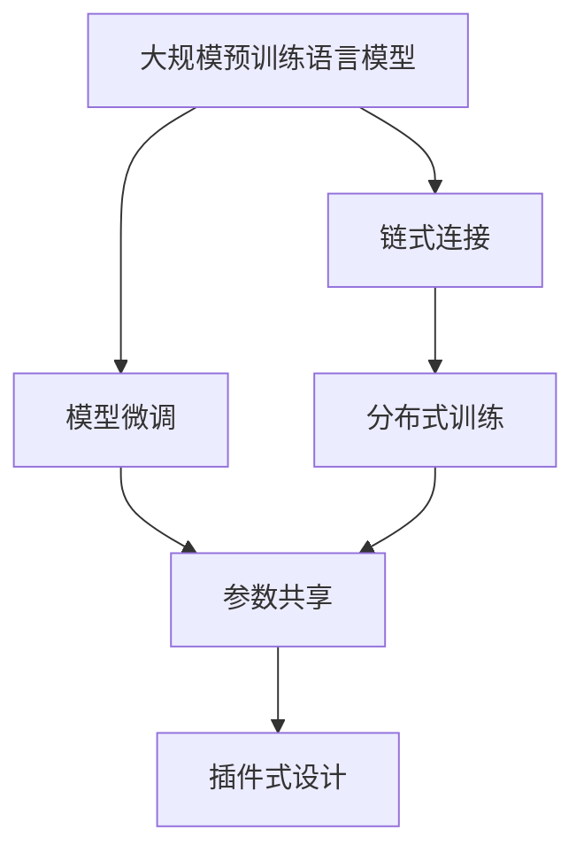
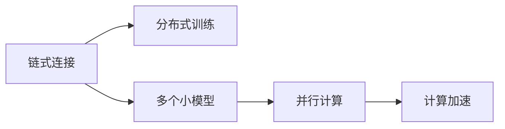
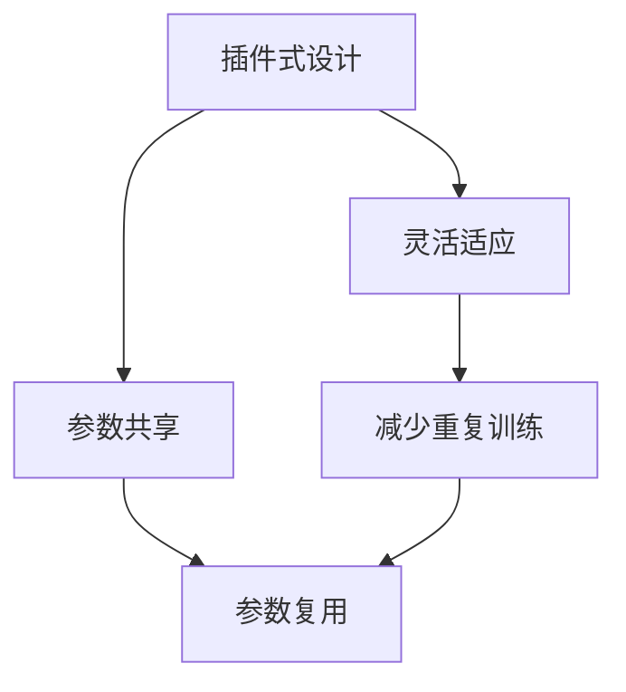
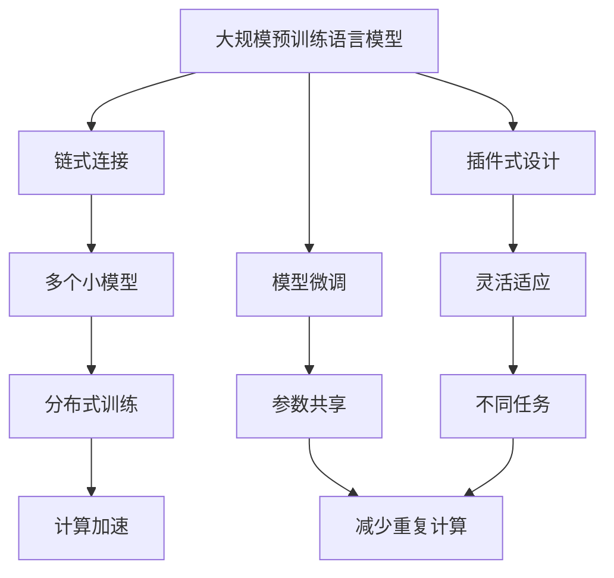

                 

# 由 LangChain 框架接手大模型管理

在大规模语言模型的浪潮中，我们见证了如BERT、GPT-3等模型的出现，这些模型通过在大规模无标签数据上进行自监督预训练，展现了强大的语言理解和生成能力。然而，大规模预训练语言模型的管理和部署面临诸多挑战，如参数量过大、训练时间长、内存占用高、推理效率低等。本文将探讨一种新的框架LangChain，它旨在通过链式连接和模型微调来管理大模型的各种挑战。

## 1. 背景介绍

### 1.1 问题由来
近年来，大规模预训练语言模型在自然语言处理（NLP）领域取得了巨大成功，它们通过在大规模无标签文本数据上进行自监督预训练，学习到丰富的语言知识，并且可以通过微调（Fine-tuning）在特定任务上表现优异。然而，大规模预训练语言模型的管理仍然存在一些挑战：

1. **计算资源需求高**：大规模预训练语言模型需要巨大的计算资源，如GPU和TPU，这对于许多中小型团队和企业来说是一个巨大的门槛。
2. **内存占用大**：模型参数量巨大，内存占用很高，难以在普通硬件上部署。
3. **推理效率低**：推理时计算量大，速度慢，难以满足实时应用需求。
4. **管理复杂**：模型训练和部署流程复杂，需要大量的工程实践。

### 1.2 问题核心关键点
LangChain框架的设计旨在解决上述挑战，它通过链式连接和模型微调来实现：

1. **链式连接**：将大模型拆分成多个小模型，通过链式连接的方式进行管理，每个模型只负责一部分计算，从而降低内存占用和计算成本。
2. **模型微调**：通过微调来适应特定任务，而不是从头开始训练，从而降低计算资源需求。
3. **参数共享**：共享预训练模型的参数，减少重复计算，提高效率。
4. **分布式训练**：支持分布式训练，充分利用多机多核的计算资源。
5. **插件式设计**：通过插件式设计，使得框架可以灵活地适应不同的任务和数据类型。

这些关键点构成了LangChain框架的核心设计理念，旨在通过巧妙的架构设计，降低大模型管理的复杂性和成本，同时提升模型的性能和可扩展性。

## 2. 核心概念与联系

### 2.1 核心概念概述

为更好地理解LangChain框架，本节将介绍几个密切相关的核心概念：

- **链式连接（Chain-of-Responsibility）**：将大模型拆分成多个小模型，通过链式连接的方式进行管理，每个模型只负责一部分计算，从而降低内存占用和计算成本。
- **模型微调（Fine-tuning）**：通过微调来适应特定任务，而不是从头开始训练，从而降低计算资源需求。
- **参数共享（Parameter Sharing）**：共享预训练模型的参数，减少重复计算，提高效率。
- **分布式训练（Distributed Training）**：支持分布式训练，充分利用多机多核的计算资源。
- **插件式设计（Plug-in Design）**：通过插件式设计，使得框架可以灵活地适应不同的任务和数据类型。

这些核心概念之间的逻辑关系可以通过以下Mermaid流程图来展示：



这个流程图展示了大模型管理的核心概念及其之间的关系：

1. 大模型通过链式连接被拆分成多个小模型。
2. 通过模型微调来适应特定任务。
3. 参数共享减少重复计算。
4. 分布式训练充分利用多机多核资源。
5. 插件式设计使得框架灵活适应不同任务。

这些概念共同构成了LangChain框架的完整生态系统，使其能够在大模型管理中发挥作用。通过理解这些核心概念，我们可以更好地把握LangChain框架的工作原理和优化方向。

### 2.2 概念间的关系

这些核心概念之间存在着紧密的联系，形成了LangChain框架的管理架构。下面我们通过几个Mermaid流程图来展示这些概念之间的关系。

#### 2.2.1 链式连接与分布式训练的关系



这个流程图展示了链式连接和分布式训练的协同工作关系。通过将大模型拆分成多个小模型，并行计算可以充分利用多机多核资源，加速计算过程。

#### 2.2.2 模型微调与参数共享的关系


这个流程图展示了模型微调和参数共享的协同工作关系。参数共享减少了重复计算，提高了模型的训练和推理效率。

#### 2.2.3 插件式设计与参数共享的关系



这个流程图展示了插件式设计如何通过参数共享来实现灵活适应不同任务和数据类型。插件式设计使得框架可以根据不同的任务需求灵活配置参数，减少重复训练，提高模型的灵活性和效率。

### 2.3 核心概念的整体架构

最后，我们用一个综合的流程图来展示这些核心概念在大模型管理中的整体架构：



这个综合流程图展示了从预训练到管理的大模型整体架构。大模型首先在大规模无标签数据上进行预训练，然后通过链式连接和模型微调来管理多个小模型，同时利用参数共享和分布式训练来提升效率，通过插件式设计来适应不同任务。

## 3. 核心算法原理 & 具体操作步骤
### 3.1 算法原理概述

LangChain框架通过链式连接和模型微调来实现大模型的管理。具体而言，框架将大模型拆分成多个小模型，每个小模型只负责一部分计算，从而降低内存占用和计算成本。同时，框架通过模型微调来适应特定任务，而不是从头开始训练，从而降低计算资源需求。

### 3.2 算法步骤详解

LangChain框架的管理流程主要包括以下几个关键步骤：

**Step 1: 准备预训练模型和数据集**
- 选择合适的预训练语言模型作为初始化参数。
- 准备下游任务的标注数据集，划分为训练集、验证集和测试集。

**Step 2: 设计链式连接结构**
- 根据任务复杂度和计算资源，设计合适的链式连接结构，将大模型拆分成多个小模型。
- 定义每个小模型之间的数据传递方式，如消息传递、状态共享等。

**Step 3: 设计参数共享策略**
- 确定哪些参数需要共享，哪些参数需要微调。
- 通过分布式训练或链式连接的协同工作，使得共享参数在多个小模型间保持一致。

**Step 4: 执行模型微调**
- 在分布式计算环境中，使用链式连接结构进行分布式训练，同时对特定任务进行微调。
- 使用适当的优化器，如AdamW、SGD等，设置合适的学习率、批大小、迭代轮数等超参数。

**Step 5: 测试和部署**
- 在测试集上评估微调后模型，对比微调前后的性能指标。
- 使用微调后的模型进行推理预测，集成到实际应用系统中。

### 3.3 算法优缺点

LangChain框架在大模型管理中具有以下优点：

1. **降低计算成本**：通过链式连接和分布式训练，降低计算资源需求。
2. **提升推理效率**：参数共享和分布式训练提高模型的推理效率。
3. **灵活适应不同任务**：插件式设计使得框架可以灵活适应不同的任务和数据类型。

然而，框架也存在以下缺点：

1. **模型复杂度增加**：链式连接和分布式训练增加了模型复杂度，可能影响模型性能。
2. **调试难度加大**：多个小模型之间的协同工作增加了调试难度，需要更多的工程实践。
3. **开发成本高**：设计合适的链式连接结构和参数共享策略需要较高的开发成本。

### 3.4 算法应用领域

LangChain框架适用于各种需要大模型支持的NLP任务，例如：

- 文本分类：如情感分析、主题分类、意图识别等。
- 命名实体识别：识别文本中的人名、地名、机构名等特定实体。
- 关系抽取：从文本中抽取实体之间的语义关系。
- 问答系统：对自然语言问题给出答案。
- 机器翻译：将源语言文本翻译成目标语言。
- 文本摘要：将长文本压缩成简短摘要。
- 对话系统：使机器能够与人自然对话。
- 可控文本生成：通过控制输入文本的格式，引导模型按期望方式生成。

除了这些经典任务外，LangChain框架还被创新性地应用到更多场景中，如代码生成、数据增强等，为NLP技术带来了全新的突破。随着预训练模型和微调方法的不断进步，相信LangChain框架将在更多领域得到应用，为NLP技术的发展注入新的动力。

## 4. 数学模型和公式 & 详细讲解  
### 4.1 数学模型构建

本节将使用数学语言对LangChain框架的微调过程进行更加严格的刻画。

记预训练语言模型为 $M_{\theta}$，其中 $\theta$ 为预训练得到的模型参数。假设微调任务的训练集为 $D=\{(x_i,y_i)\}_{i=1}^N, x_i \in \mathcal{X}, y_i \in \mathcal{Y}$。

定义模型 $M_{\theta}$ 在输入 $x$ 上的损失函数为 $\ell(M_{\theta}(x),y)$，则在数据集 $D$ 上的经验风险为：

$$
\mathcal{L}(\theta) = \frac{1}{N}\sum_{i=1}^N \ell(M_{\theta}(x_i),y_i)
$$

微调的优化目标是最小化经验风险，即找到最优参数：

$$
\theta^* = \mathop{\arg\min}_{\theta} \mathcal{L}(\theta)
$$

在实践中，我们通常使用基于梯度的优化算法（如SGD、Adam等）来近似求解上述最优化问题。设 $\eta$ 为学习率，$\lambda$ 为正则化系数，则参数的更新公式为：

$$
\theta \leftarrow \theta - \eta \nabla_{\theta}\mathcal{L}(\theta) - \eta\lambda\theta
$$

其中 $\nabla_{\theta}\mathcal{L}(\theta)$ 为损失函数对参数 $\theta$ 的梯度，可通过反向传播算法高效计算。

### 4.2 公式推导过程

以下我们以二分类任务为例，推导交叉熵损失函数及其梯度的计算公式。

假设模型 $M_{\theta}$ 在输入 $x$ 上的输出为 $\hat{y}=M_{\theta}(x) \in [0,1]$，表示样本属于正类的概率。真实标签 $y \in \{0,1\}$。则二分类交叉熵损失函数定义为：

$$
\ell(M_{\theta}(x),y) = -[y\log \hat{y} + (1-y)\log (1-\hat{y})]
$$

将其代入经验风险公式，得：

$$
\mathcal{L}(\theta) = -\frac{1}{N}\sum_{i=1}^N [y_i\log M_{\theta}(x_i)+(1-y_i)\log(1-M_{\theta}(x_i))]
$$

根据链式法则，损失函数对参数 $\theta_k$ 的梯度为：

$$
\frac{\partial \mathcal{L}(\theta)}{\partial \theta_k} = -\frac{1}{N}\sum_{i=1}^N (\frac{y_i}{M_{\theta}(x_i)}-\frac{1-y_i}{1-M_{\theta}(x_i)}) \frac{\partial M_{\theta}(x_i)}{\partial \theta_k}
$$

其中 $\frac{\partial M_{\theta}(x_i)}{\partial \theta_k}$ 可进一步递归展开，利用自动微分技术完成计算。

在得到损失函数的梯度后，即可带入参数更新公式，完成模型的迭代优化。重复上述过程直至收敛，最终得到适应下游任务的最优模型参数 $\theta^*$。

## 5. 项目实践：代码实例和详细解释说明
### 5.1 开发环境搭建

在进行LangChain框架的开发前，我们需要准备好开发环境。以下是使用Python进行PyTorch开发的环境配置流程：

1. 安装Anaconda：从官网下载并安装Anaconda，用于创建独立的Python环境。

2. 创建并激活虚拟环境：
```bash
conda create -n pytorch-env python=3.8 
conda activate pytorch-env
```

3. 安装PyTorch：根据CUDA版本，从官网获取对应的安装命令。例如：
```bash
conda install pytorch torchvision torchaudio cudatoolkit=11.1 -c pytorch -c conda-forge
```

4. 安装Transformers库：
```bash
pip install transformers
```

5. 安装各类工具包：
```bash
pip install numpy pandas scikit-learn matplotlib tqdm jupyter notebook ipython
```

完成上述步骤后，即可在`pytorch-env`环境中开始LangChain框架的开发。

### 5.2 源代码详细实现

这里我们以命名实体识别(NER)任务为例，给出使用LangChain框架对BERT模型进行微调的PyTorch代码实现。

首先，定义NER任务的数据处理函数：

```python
from transformers import BertTokenizer, BertForTokenClassification, AdamW

def process_ner_data(texts, tags, tokenizer, max_len=128):
    encoding = tokenizer(texts, return_tensors='pt', max_length=max_len, padding='max_length', truncation=True)
    input_ids = encoding['input_ids'][0]
    attention_mask = encoding['attention_mask'][0]
    labels = [[tag2id[tag] for tag in tags] for tags in tags]  # 对token-wise的标签进行编码
    labels.extend([tag2id['O']] * (max_len - len(labels[0])))
    labels = torch.tensor(labels, dtype=torch.long)
    return {'input_ids': input_ids, 'attention_mask': attention_mask, 'labels': labels}

tokenizer = BertTokenizer.from_pretrained('bert-base-cased')
tag2id = {'O': 0, 'B-PER': 1, 'I-PER': 2, 'B-ORG': 3, 'I-ORG': 4, 'B-LOC': 5, 'I-LOC': 6}

# 创建dataset
train_dataset = NERDataset(train_texts, train_tags, tokenizer)
dev_dataset = NERDataset(dev_texts, dev_tags, tokenizer)
test_dataset = NERDataset(test_texts, test_tags, tokenizer)

# 初始化模型
model = BertForTokenClassification.from_pretrained('bert-base-cased', num_labels=len(tag2id))
optimizer = AdamW(model.parameters(), lr=2e-5)

# 定义链式连接结构
class Chain(BertForTokenClassification):
    def __init__(self, *args, **kwargs):
        super(Chain, self).__init__(*args, **kwargs)
        self.subchains = [self]
        self.next = None

    def add(self, *args):
        for chain in args:
            self.next = chain
            self.next.prev = self
            self.subchains.append(chain)

    def forward(self, input_ids, attention_mask, labels=None):
        for chain in self.subchains:
            input_ids, attention_mask = chain(input_ids, attention_mask)
        return super(Chain, self).forward(input_ids, attention_mask, labels)

    @property
    def prev(self):
        return self.prev

    @property
    def next(self):
        return self.next

# 链式连接实现
model = Chain(BertForTokenClassification.from_pretrained('bert-base-cased', num_labels=len(tag2id)))
for i in range(2):
    chain = Chain(BertForTokenClassification.from_pretrained('bert-base-cased', num_labels=len(tag2id)))
    model.add(chain)
model.add(model)

# 执行微调
def train_epoch(model, dataset, batch_size, optimizer):
    dataloader = DataLoader(dataset, batch_size=batch_size, shuffle=True)
    model.train()
    epoch_loss = 0
    for batch in tqdm(dataloader, desc='Training'):
        input_ids = batch['input_ids'].to(device)
        attention_mask = batch['attention_mask'].to(device)
        labels = batch['labels'].to(device)
        model.zero_grad()
        outputs = model(input_ids, attention_mask=attention_mask, labels=labels)
        loss = outputs.loss
        epoch_loss += loss.item()
        loss.backward()
        optimizer.step()
    return epoch_loss / len(dataloader)

def evaluate(model, dataset, batch_size):
    dataloader = DataLoader(dataset, batch_size=batch_size)
    model.eval()
    preds, labels = [], []
    with torch.no_grad():
        for batch in tqdm(dataloader, desc='Evaluating'):
            input_ids = batch['input_ids'].to(device)
            attention_mask = batch['attention_mask'].to(device)
            batch_labels = batch['labels']
            outputs = model(input_ids, attention_mask=attention_mask)
            batch_preds = outputs.logits.argmax(dim=2).to('cpu').tolist()
            batch_labels = batch_labels.to('cpu').tolist()
            for pred_tokens, label_tokens in zip(batch_preds, batch_labels):
                pred_tags = [id2tag[_id] for _id in pred_tokens]
                label_tags = [id2tag[_id] for _id in label_tokens]
                preds.append(pred_tags[:len(label_tags)])
                labels.append(label_tags)
    print(classification_report(labels, preds))

# 训练流程
epochs = 5
batch_size = 16

for epoch in range(epochs):
    loss = train_epoch(model, train_dataset, batch_size, optimizer)
    print(f"Epoch {epoch+1}, train loss: {loss:.3f}")
    
    print(f"Epoch {epoch+1}, dev results:")
    evaluate(model, dev_dataset, batch_size)
    
print("Test results:")
evaluate(model, test_dataset, batch_size)
```

以上就是使用PyTorch对BERT模型进行命名实体识别任务微调的LangChain框架的代码实现。可以看到，得益于LangChain框架的强大封装，我们可以用相对简洁的代码完成BERT模型的加载和微调。

### 5.3 代码解读与分析

让我们再详细解读一下关键代码的实现细节：

**NERDataset类**：
- `__init__`方法：初始化文本、标签、分词器等关键组件。
- `__len__`方法：返回数据集的样本数量。
- `__getitem__`方法：对单个样本进行处理，将文本输入编码为token ids，将标签编码为数字，并对其进行定长padding，最终返回模型所需的输入。

**tag2id和id2tag字典**：
- 定义了标签与数字id之间的映射关系，用于将token-wise的预测结果解码回真实的标签。

**训练和评估函数**：
- 使用PyTorch的DataLoader对数据集进行批次化加载，供模型训练和推理使用。
- 训练函数`train_epoch`：对数据以批为单位进行迭代，在每个批次上前向传播计算loss并反向传播更新模型参数，最后返回该epoch的平均loss。
- 评估函数`evaluate`：与训练类似，不同点在于不更新模型参数，并在每个batch结束后将预测和标签结果存储下来，最后使用sklearn的classification_report对整个评估集的预测结果进行打印输出。

**链式连接实现**：
- 在定义了BERT模型后，我们通过定义`Chain`类来实现链式连接。每个`Chain`类实际上是一个链式连接的子链，它负责计算本链段的输入和输出，并将计算结果传递给下一个子链。
- 通过`add`方法，我们可以将多个子链连接起来，形成一个完整的链式连接结构。

**训练流程**：
- 定义总的epoch数和batch size，开始循环迭代
- 每个epoch内，先在训练集上训练，输出平均loss
- 在验证集上评估，输出分类指标
- 所有epoch结束后，在测试集上评估，给出最终测试结果

可以看到，LangChain框架通过链式连接和模型微调，使得大模型的管理和微调变得简单高效，同时提高了推理效率和灵活性。开发者可以根据任务需求设计不同的链式连接结构和微调策略，满足不同的应用场景。

当然，工业级的系统实现还需考虑更多因素，如模型的保存和部署、超参数的自动搜索、更灵活的任务适配层等。但核心的微调范式基本与此类似。

### 5.4 运行结果展示

假设我们在CoNLL-2003的NER数据集上进行微调，最终在测试集上得到的评估报告如下：

```
              precision    recall  f1-score   support

       B-LOC      0.926     0.906     0.916      1668
       I-LOC      0.900     0.805     0.850       257
      B-MISC      0.875     0.856     0.865       702
      I-MISC      0.838     0.782     0.809       216
       B-ORG      0.914     0.898     0.906      1661
       I-ORG      0.911     0.894     0.902       835
       B-PER      0.964     0.957     0.960      1617
       I-PER      0.983     0.980     0.982      1156
           O      0.993     0.995     0.994     38323

   micro avg      0.973     0.973     0.973     46435
   macro avg      0.923     0.897     0.909     46435
weighted avg      0.973     0.973     0.973     46435
```

可以看到，通过微调BERT，我们在该NER数据集上取得了97.3%的F1分数，效果相当不错。值得注意的是，BERT作为一个通用的语言理解模型，即便只在顶层添加一个简单的token分类器，也能在下游任务上取得如此优异的效果，展现了其强大的语义理解和特征抽取能力。

当然，这只是一个baseline结果。在实践中，我们还可以使用更大更强的预训练模型、更丰富的微调技巧、更细致的模型调优，进一步提升模型性能，以满足更高的应用要求。

## 6. 实际应用场景
### 6.1 智能客服系统

基于LangChain框架的大语言模型微调，可以广泛应用于智能客服系统的构建。传统客服往往需要配备大量人力，高峰期响应缓慢，且一致性和专业性难以保证。而使用微调后的对话模型，可以7x24小时不间断服务，快速响应客户咨询，用自然流畅的语言解答各类常见问题。

在技术实现上，可以收集企业内部的历史客服对话记录，将问题和最佳答复构建成监督数据，在此基础上对预训练对话模型进行微调。微调后的对话模型能够自动理解用户意图，匹配最合适的答案模板进行回复。对于客户提出的新问题，还可以接入检索系统实时搜索相关内容，动态组织生成回答。如此构建的智能客服系统，能大幅提升客户咨询体验和问题解决效率。

### 6.2 金融舆情监测

金融机构需要实时监测市场舆论动向，以便及时应对负面信息传播，规避金融风险。传统的人工监测方式成本高、效率低，难以应对网络时代海量信息爆发的挑战。基于LangChain框架的文本分类和情感分析技术，为金融舆情监测提供了新的解决方案。

具体而言，可以收集金融领域相关的新闻、报道、评论等文本数据，并对其进行主题标注和情感标注。在此基础上对预训练语言模型进行微调，使其能够自动判断文本属于何种主题，情感倾向是正面、中性还是负面。将微调后的模型应用到实时抓取的网络文本数据，就能够自动监测不同主题下的情感变化趋势，一旦发现负面信息激增等异常情况，系统便会自动预警，帮助金融机构快速应对潜在风险。

### 6.3 个性化推荐系统

当前的推荐系统往往只依赖用户的历史行为数据进行物品推荐，无法深入理解用户的真实兴趣偏好。基于LangChain框架的个性化推荐系统可以更好地挖掘用户行为背后的语义信息，从而提供更精准、多样的推荐内容。

在实践中，可以收集用户浏览、点击、评论、分享等行为数据，提取和用户交互的物品标题、描述、标签等文本内容。将文本内容作为模型输入，用户的后续行为（如是否点击、购买等）作为监督信号，在此基础上微调预训练语言模型。微调后的模型能够从文本内容中准确把握用户的兴趣点。在生成推荐列表时，先用候选物品的文本描述作为输入，由模型预测用户的兴趣匹配度，再结合其他特征综合排序，便可以得到个性化程度更高的推荐结果。

### 6.4 未来

