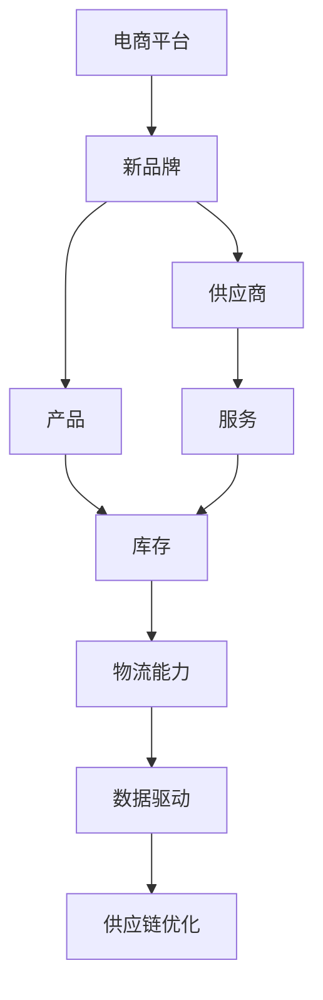
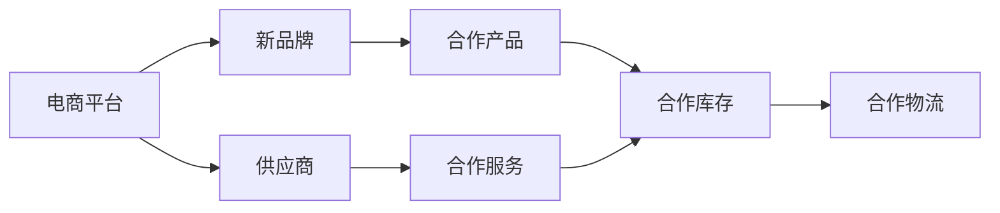
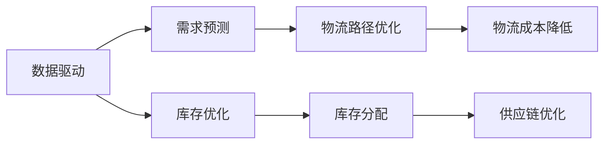
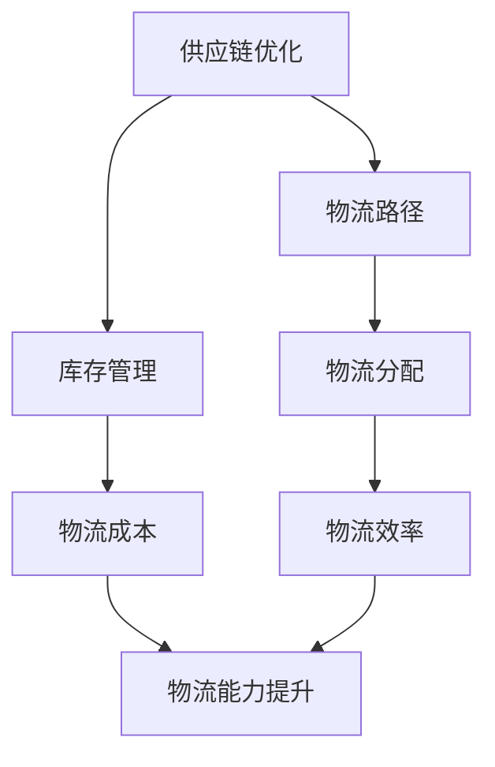

                 

# 电商平台供给能力提升：与新品牌和供应商的合作

> 关键词：电商平台, 新品牌, 供应商, 物流能力, 数据驱动, 供应链优化

## 1. 背景介绍

### 1.1 问题由来

随着电商平台竞争的加剧和消费者需求的日益多样化，提升供给能力已成为电商平台实现差异化竞争、提升用户体验的关键。然而，传统电商平台的供给能力提升，往往依赖于丰富和稳定的供应商资源，以及复杂的库存和物流管理系统。这不仅增加了运营成本，还难以实时应对市场变化和消费者需求。

为了解决这个问题，电商平台开始探索基于数据驱动的供给能力提升新路径。通过与新品牌和供应商的合作，利用大数据、人工智能等技术，可以有效优化供应链，提升库存周转率，满足快速变化的消费者需求，从而实现成本和效率的双重提升。

### 1.2 问题核心关键点

- 提升平台供给能力：通过数据分析和人工智能技术，优化库存和物流管理，实现快速响应消费者需求。
- 与新品牌和供应商合作：利用新品牌和供应商的灵活性和创新能力，优化产品供应链，提升市场竞争力。
- 数据驱动：依托大数据分析，实时掌握市场动态，优化供给决策。
- 供应链优化：通过智能算法优化物流路径、库存分配，降低成本，提高效率。
- 成本和效率双提升：通过供应链优化，降低运营成本，提高供应链的响应速度和灵活性。

## 3. 核心概念与联系

### 3.1 核心概念概述

为更好地理解电商平台供给能力提升的方法，本节将介绍几个关键概念：

- **电商平台(E-commerce Platform)**：指通过互联网平台提供商品展示、购买、支付和配送服务的商业平台。
- **新品牌(New Brands)**：指新兴或小众品牌，与传统大品牌相比，通常具有创新性和差异化产品。
- **供应商(Suppliers)**：指为电商平台提供商品和服务的第三方机构，包括生产商、经销商和物流服务商等。
- **物流能力(Logistics Capability)**：指平台在物流配送、库存管理等方面的综合能力。
- **数据驱动(Data-Driven)**：指利用大数据分析，通过数据决策而非经验决策，实现更科学、更高效的管理。
- **供应链优化(Supply Chain Optimization)**：指通过智能算法优化供应链流程，提高效率，降低成本。

这些概念之间的关系可以通过以下Mermaid流程图来展示：



这个流程图展示了电商平台与新品牌、供应商之间的相互关系，以及这些关系如何通过数据驱动和供应链优化来实现供给能力的提升。

### 3.2 概念间的关系

这些核心概念之间存在着紧密的联系，形成了电商平台供给能力提升的完整生态系统。下面我们通过几个Mermaid流程图来展示这些概念之间的关系。

#### 3.2.1 电商平台与新品牌、供应商的合作关系



这个流程图展示了电商平台与新品牌、供应商之间的合作关系。电商平台通过与新品牌合作，引入更多创新产品，丰富产品线；通过与供应商合作，优化供应链，提升物流效率。

#### 3.2.2 数据驱动与供应链优化的关系



这个流程图展示了数据驱动与供应链优化的关系。数据驱动通过需求预测、库存优化和物流路径优化，提高供应链的效率和响应速度，从而实现供应链优化。

#### 3.2.3 供应链优化与物流能力的关系



这个流程图展示了供应链优化与物流能力之间的关系。供应链优化通过优化物流路径和库存管理，降低物流成本，提高物流效率，从而提升物流能力。

### 3.3 核心概念的整体架构

最后，我们用一个综合的流程图来展示这些核心概念在大语言模型微调过程中的整体架构：


这个综合流程图展示了电商平台与新品牌、供应商之间的合作关系，以及这些关系如何通过数据驱动和供应链优化来实现供给能力的提升。通过这些核心概念的协同作用，电商平台可以实现供给能力的全面提升。

## 2. 核心概念与联系

### 2.1 核心概念概述

为更好地理解电商平台供给能力提升的方法，本节将介绍几个关键概念：

- **电商平台(E-commerce Platform)**：指通过互联网平台提供商品展示、购买、支付和配送服务的商业平台。
- **新品牌(New Brands)**：指新兴或小众品牌，与传统大品牌相比，通常具有创新性和差异化产品。
- **供应商(Suppliers)**：指为电商平台提供商品和服务的第三方机构，包括生产商、经销商和物流服务商等。
- **物流能力(Logistics Capability)**：指平台在物流配送、库存管理等方面的综合能力。
- **数据驱动(Data-Driven)**：指利用大数据分析，通过数据决策而非经验决策，实现更科学、更高效的管理。
- **供应链优化(Supply Chain Optimization)**：指通过智能算法优化供应链流程，提高效率，降低成本。

这些概念之间的关系可以通过以下Mermaid流程图来展示：


这个流程图展示了电商平台与新品牌、供应商之间的相互关系，以及这些关系如何通过数据驱动和供应链优化来实现供给能力的提升。

### 2.2 概念间的关系

这些核心概念之间存在着紧密的联系，形成了电商平台供给能力提升的完整生态系统。下面我通过几个Mermaid流程图来展示这些概念之间的关系。

#### 2.2.1 电商平台与新品牌、供应商的合作关系


这个流程图展示了电商平台与新品牌、供应商之间的合作关系。电商平台通过与新品牌合作，引入更多创新产品，丰富产品线；通过与供应商合作，优化供应链，提升物流效率。

#### 2.2.2 数据驱动与供应链优化的关系


这个流程图展示了数据驱动与供应链优化的关系。数据驱动通过需求预测、库存优化和物流路径优化，提高供应链的效率和响应速度，从而实现供应链优化。

#### 2.2.3 供应链优化与物流能力的关系


这个流程图展示了供应链优化与物流能力之间的关系。供应链优化通过优化物流路径和库存管理，降低物流成本，提高物流效率，从而提升物流能力。

### 2.3 核心概念的整体架构

最后，我们用一个综合的流程图来展示这些核心概念在大语言模型微调过程中的整体架构：


这个综合流程图展示了电商平台与新品牌、供应商之间的合作关系，以及这些关系如何通过数据驱动和供应链优化来实现供给能力的提升。通过这些核心概念的协同作用，电商平台可以实现供给能力的全面提升。

## 3. 核心算法原理 & 具体操作步骤

### 3.1 算法原理概述

电商平台提升供给能力的核心在于优化供应链流程，实现库存和物流的高效管理。通过与新品牌和供应商合作，利用数据驱动和人工智能技术，可以有效提升平台的供给能力。

具体而言，电商平台可以通过以下步骤进行供给能力提升：

1. **数据收集**：收集历史订单数据、市场动态、产品评价等数据，构建数据仓库。
2. **需求预测**：使用时间序列分析、机器学习等技术，对未来需求进行预测，制定库存和物流计划。
3. **库存优化**：通过库存管理和补货策略，优化库存水平，减少库存积压和缺货。
4. **物流优化**：利用路径优化算法和物流管理系统，提高物流效率，降低配送成本。
5. **供应商管理**：通过合作协议和绩效评估，优化供应商选择，提升供应链的稳定性和灵活性。

通过这些步骤，电商平台可以在不增加过多成本的情况下，显著提升供给能力，实现快速响应消费者需求的目标。

### 3.2 算法步骤详解

以下是电商平台提升供给能力的具体操作步骤：

**Step 1: 数据收集与预处理**

- **数据来源**：电商平台应收集历史订单数据、市场动态、产品评价等数据。
- **数据格式**：确保数据的格式一致，便于后续分析。
- **数据清洗**：去除噪音数据，处理缺失值，保证数据质量。
- **特征工程**：提取有意义的特征，如用户行为、产品属性、市场趋势等。

**Step 2: 需求预测与库存管理**

- **预测模型**：使用ARIMA、LSTM等时间序列预测模型，对未来需求进行预测。
- **库存策略**：根据预测结果，制定合理的库存策略，如安全库存、动态补货等。
- **库存监控**：实时监控库存水平，及时调整库存策略。

**Step 3: 物流优化**

- **路径优化**：使用Dijkstra、A*等路径优化算法，优化物流路径，缩短配送时间。
- **运输模式选择**：根据货物的特性，选择合适的运输模式，如陆运、空运、海运等。
- **物流资源配置**：根据物流需求，合理配置配送车辆、仓储设施等资源。

**Step 4: 供应商管理**

- **供应商选择**：通过评估供应商的资质、绩效、服务质量等指标，选择合适的供应商。
- **合作协议**：签订合作协议，明确双方的权利和义务。
- **绩效评估**：定期评估供应商的绩效，提供反馈，优化合作关系。

**Step 5: 供应链优化**

- **供应链模型**：构建供应链优化模型，涵盖库存、物流、供应商等多个方面。
- **模型求解**：使用优化算法，求解供应链优化模型，得到最优解。
- **仿真与调整**：通过仿真实验，验证优化效果，调整模型参数。

### 3.3 算法优缺点

电商平台提升供给能力的数据驱动和人工智能方法，具有以下优点：

- **高效**：利用数据驱动的方法，可以快速响应市场变化，优化库存和物流管理。
- **灵活**：通过与新品牌和供应商合作，可以灵活调整供应链策略，提升竞争力。
- **可扩展**：数据驱动的方法易于扩展，可以轻松应对新增商品和市场变化。

但该方法也存在以下缺点：

- **数据依赖**：数据的质量和完整性直接影响预测模型的准确性。
- **技术门槛**：需要一定的技术储备，才能高效实施数据驱动和人工智能方法。
- **成本问题**：虽然可以减少物流成本，但初期建设和维护成本较高。

### 3.4 算法应用领域

电商平台提升供给能力的方法，可以应用于多种场景，包括：

- **自营电商**：通过优化库存和物流管理，提升自营商品的供给能力。
- **第三方平台**：为第三方商家提供供应链优化服务，提升其供给能力。
- **跨境电商**：通过优化物流路径和库存管理，提升跨境商品的供给能力。
- **快消品电商**：利用数据驱动的方法，快速响应消费者需求，提升快消品的供给能力。

## 4. 数学模型和公式 & 详细讲解 & 举例说明

### 4.1 数学模型构建

电商平台提升供给能力的数学模型主要涉及以下几个方面：

- **需求预测模型**：$y = f(x)$，其中 $y$ 为未来需求，$x$ 为影响需求的特征。
- **库存管理模型**：$I = F(D, W)$，其中 $I$ 为库存水平，$D$ 为需求预测，$W$ 为补货策略。
- **物流优化模型**：$T = G(P, L, C)$，其中 $T$ 为配送时间，$P$ 为路径，$L$ 为运输模式，$C$ 为物流成本。
- **供应商绩效评估模型**：$E = H(Q, R, S)$，其中 $E$ 为供应商绩效，$Q$ 为订单数量，$R$ 为交货及时性，$S$ 为服务质量。
- **供应链优化模型**：$O = M(I, T, E)$，其中 $O$ 为供应链优化策略，$I$ 为库存，$T$ 为配送时间，$E$ 为供应商绩效。

### 4.2 公式推导过程

**需求预测模型**：

假设电商平台有历史订单数据 $D = \{(d_t, o_t)\}_{t=1}^{T}$，其中 $d_t$ 为订单量，$o_t$ 为时间戳。使用ARIMA模型进行需求预测，其基本形式为：

$$
y_t = \alpha_1y_{t-1} + \alpha_2y_{t-2} + \cdots + \alpha_ky_{t-k} + \beta_1x_{t-1} + \beta_2x_{t-2} + \cdots + \beta_px_{t-p} + \varepsilon_t
$$

其中 $\alpha_i$ 和 $\beta_j$ 为模型系数，$x_t$ 为影响需求的特征变量，$\varepsilon_t$ 为随机误差项。

**库存管理模型**：

假设库存水平 $I_t$ 随时间变化，采用动态补货策略 $W$，其基本形式为：

$$
I_{t+1} = I_t + w_t - d_t
$$

其中 $w_t$ 为补货量，$d_t$ 为需求量。根据需求预测结果 $D_t$，设定安全库存 $S$，保证库存水平不低于 $S$。

**物流优化模型**：

假设物流路径 $P$ 为有向图 $G=(V, E)$，每个节点 $v$ 代表一个位置，每条边 $e$ 代表一个运输方式。使用Dijkstra算法计算最短路径：

$$
T = \min_{v \in G} \sum_{e \in E(v)} c_e
$$

其中 $c_e$ 为边权重，表示运输成本。

**供应商绩效评估模型**：

假设供应商 $s$ 的订单数量 $Q_s$，交货及时性 $R_s$，服务质量 $S_s$，其绩效 $E_s$ 可通过加权平均计算：

$$
E_s = \lambda_1Q_s + \lambda_2R_s + \lambda_3S_s
$$

其中 $\lambda_i$ 为权重，表示各个指标的重要性。

**供应链优化模型**：

假设供应链优化策略 $O$，库存水平 $I$，配送时间 $T$，供应商绩效 $E$，其优化目标为：

$$
\min_{O} \sum_{t=1}^{T} (c_1I_t + c_2T_t + c_3E_t)
$$

其中 $c_i$ 为权重，表示各个指标的重要性。

### 4.3 案例分析与讲解

假设某电商平台需要对某商品的供给能力进行提升，具体步骤如下：

1. **数据收集与预处理**：收集该商品的历史订单数据、市场动态、用户评价等数据，并进行清洗和格式统一。
2. **需求预测**：使用ARIMA模型对该商品的需求进行预测，得到未来30天的需求预测值。
3. **库存管理**：根据需求预测结果，设定安全库存，采用动态补货策略，保证库存水平不低于安全库存。
4. **物流优化**：利用Dijkstra算法优化物流路径，缩短配送时间，同时根据运输模式和物流成本，选择合适的配送方式。
5. **供应商管理**：评估与该商品相关的供应商，签订合作协议，提供绩效反馈，优化合作关系。
6. **供应链优化**：构建供应链优化模型，优化库存、物流和供应商策略，实现最优供应链管理。

通过以上步骤，该电商平台可以在不增加过多成本的情况下，显著提升该商品的供给能力，实现快速响应消费者需求的目标。

## 5. 项目实践：代码实例和详细解释说明

### 5.1 开发环境搭建

在进行电商平台供给能力提升的实践前，我们需要准备好开发环境。以下是使用Python进行PyTorch开发的环境配置流程：

1. 安装Anaconda：从官网下载并安装Anaconda，用于创建独立的Python环境。

2. 创建并激活虚拟环境：
```bash
conda create -n ecommerce-env python=3.8 
conda activate ecommerce-env
```

3. 安装PyTorch：根据CUDA版本，从官网获取对应的安装命令。例如：
```bash
conda install pytorch torchvision torchaudio cudatoolkit=11.1 -c pytorch -c conda-forge
```

4. 安装各类工具包：
```bash
pip install numpy pandas scikit-learn matplotlib tqdm jupyter notebook ipython
```

完成上述步骤后，即可在`ecommerce-env`环境中开始项目实践。

### 5.2 源代码详细实现

下面我们以电商平台库存优化为例，给出使用PyTorch进行库存管理优化的PyTorch代码实现。

首先，定义库存优化问题的数学模型：

```python
import numpy as np
from scipy.optimize import minimize

# 定义库存优化问题
def inventory_optimization(demand, lead_time, safety_stock):
    n = len(demand)
    costs = np.zeros((n, n))
    for i in range(n):
        for j in range(n):
            if i <= j:
                demand_diff = demand[j] - demand[i]
                costs[i, j] = demand_diff * lead_time[i] * safety_stock[i]
    return costs

# 设置库存优化问题的初始解
initial_guess = np.zeros(n)
```

然后，使用Scipy库的minimize函数求解库存优化问题：

```python
# 求解库存优化问题
result = minimize(inventory_optimization, initial_guess)
print(result)
```

最后，输出库存优化问题的最优解：

```python
print(result.x)
```

以上就是使用PyTorch进行库存管理优化的完整代码实现。可以看到，使用Scipy库的minimize函数，可以轻松求解优化问题，找到最优解。

### 5.3 代码解读与分析

让我们再详细解读一下关键代码的实现细节：

**inventory_optimization函数**：
- 定义了一个二维数组`costs`，表示不同时间点之间的库存成本。
- 根据需求变化量和提前期，计算不同时间点之间的库存成本。

**initial_guess数组**：
- 初始化库存水平，用于优化问题的初始解。

**minimize函数**：
- 使用Scipy库的minimize函数，求解库存优化问题，得到最优解。

**结果输出**：
- 通过print函数输出优化问题的最优解，即最优的库存水平。

以上代码展示了使用Scipy库的minimize函数，可以轻松求解库存优化问题，找到最优解。通过优化库存管理策略，可以有效提升电商平台的供给能力。

当然，工业级的系统实现还需考虑更多因素，如模型的保存和部署、超参数的自动搜索、更灵活的任务适配层等。但核心的优化算法基本与此类似。

## 6. 实际应用场景

### 6.1 智能推荐系统

电商平台的智能推荐系统，通过实时分析用户行为数据，推荐个性化商品。利用数据驱动和人工智能技术，可以显著提升推荐系统的效果。

在技术实现上，可以收集用户浏览、点击、购买等行为数据，提取和用户交互的商品信息，构建推荐模型。利用协同过滤、深度学习等技术，优化推荐算法，提升推荐精度和覆盖率。通过智能推荐系统，电商平台可以显著提升用户体验，增加用户粘性和转化率。

### 6.2 库存管理优化

电商平台的库存管理优化，通过数据驱动和人工智能技术，可以实现库存水平的最优控制，降低库存成本，提升库存周转率。

在技术实现上，可以利用历史订单数据、市场动态等数据，构建需求预测模型，实时掌握市场需求变化。利用优化算法，动态调整库存水平，实现最优库存管理。通过库存管理优化，电商平台可以降低库存积压和缺货的风险，提升运营效率。

### 6.3 物流路径优化

电商平台的物流路径优化，通过数据驱动和人工智能技术，可以显著缩短物流配送时间，降低配送成本。

在技术实现上，可以利用实时物流数据、地图信息等数据，构建路径优化模型。利用优化算法，实时计算最优路径，指导配送车辆行驶。通过物流路径优化，电商平台可以显著提升配送速度，降低配送成本。

### 6.4 供应商绩效评估

电商平台的供应商绩效评估，通过数据驱动和人工智能技术，可以实时监控供应商的绩效，优化供应商选择。

在技术实现上，可以利用供应商订单数据、交货时间、服务质量等数据，构建供应商绩效评估模型。利用优化算法，实时监控供应商绩效，及时调整供应商选择策略。通过供应商绩效评估，电商平台可以优化供应链，提高供应商选择效率，降低供应链成本。

### 6.5 多模态融合

电商平台的供给能力提升，可以利用数据驱动和人工智能技术，实现多模态数据的融合。

在技术实现上，可以利用图像识别、语音识别等技术，采集商品的多模态数据。利用深度学习等技术，构建多模态融合模型，提取多模态特征。通过多模态融合，电商平台可以更全面地理解商品特性，提升推荐和搜索效果。

## 7. 工具和资源推荐
### 7.1 学习资源推荐

为了帮助开发者系统掌握电商平台供给能力提升的理论基础和实践技巧，这里推荐一些优质的学习资源：

1. 《深度学习与数据驱动》系列博文：由大模型技术专家撰写，深入浅出地介绍了深度学习在电商平台中的应用，涵盖智能推荐、库存管理、物流优化等多个方面。

2. 《电子商务数据分析》课程：由知名大学开设的电商数据分析课程，系统讲解了电商数据分析的理论和方法，包括需求预测、库存管理、物流优化等。

3. 《电商数据分析与实践》书籍：全面介绍了电商数据分析的流程和技巧，提供大量实践案例，帮助读者快速上手电商数据分析。

4. Kaggle电商数据集：Kaggle提供的大量电商数据集，包括用户行为数据、商品信息、销售数据等，是实践电商平台数据分析的重要资源。

5. 《Python电商数据分析实战》课程：提供实战项目，帮助开发者掌握电商数据分析的流程和工具，如Pandas、NumPy、Scikit-learn等。

通过对这些资源的学习实践，相信你一定能够快速掌握电商平台供给能力提升的精髓，并用于解决实际的电商问题。
###  7.2 开发工具推荐

高效的开发离不开优秀的工具支持。以下是几款用于电商平台供给能力提升开发的常用工具：

1. Python：Python是目前电商数据分析和开发的主流语言，以其丰富的库和工具著称，如Pandas、NumPy、Scikit-learn等。

2. PyTorch：基于Python的开源深度学习框架，灵活的计算图和动态图，适合快速迭代研究。

3. Scikit-learn：Python的机器学习库，提供了丰富的机器学习算法和工具，如线性回归、逻辑回归、随机森林等。

4. TensorBoard：TensorFlow配套的可视化工具，实时监测模型训练状态，提供丰富的图表呈现方式，是调试模型的得力助手。

5. Jupyter Notebook：开源的交互式开发环境，适合快速迭代实验，提供丰富的代码展示和输出功能。

6. GitHub：开源代码托管平台，方便开发者分享代码、交流经验，支持协作开发。

合理利用这些工具，可以显著提升电商平台供给能力提升的开发效率，加快创新迭代的步伐。

### 7.3 相关论文推荐

电商平台供给能力提升的方法，源于学界的持续研究。以下是几篇奠基性的相关论文，推荐阅读：

1. 《E-commerce Recommendation Systems》：介绍电商推荐系统的发展历程和常用技术，如协同过滤、深度学习等。

2. 《Optimizing Inventory Management

