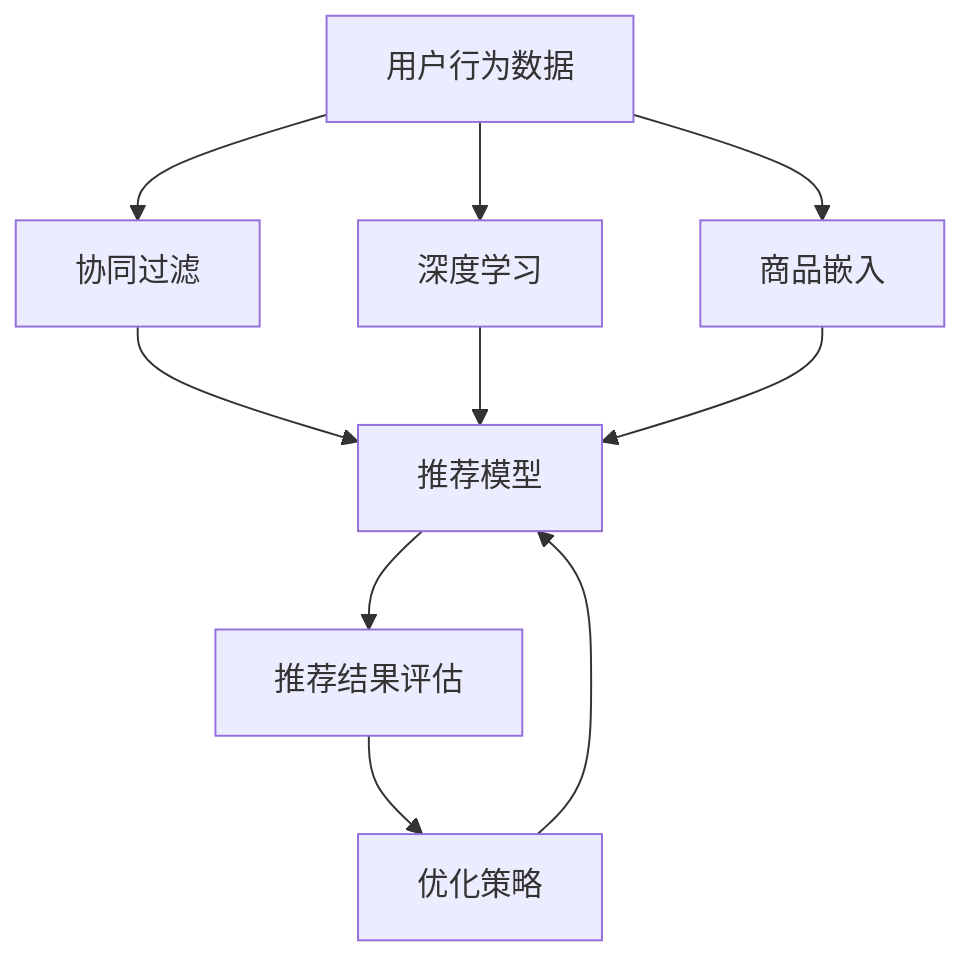
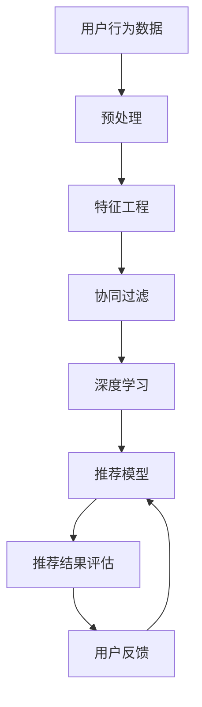

                 

# 电商平台供给能力提升：个性化商品推荐

> 关键词：个性化推荐, 电商平台, 供给能力, 大数据分析, 协同过滤, 深度学习, 神经网络, 推荐系统, 用户行为分析

## 1. 背景介绍

### 1.1 问题由来
在电商平台，提升供给能力的关键之一在于个性化商品推荐系统。优秀的推荐系统不仅能提升用户体验，还能显著增加平台交易量和用户粘性。然而，推荐系统往往面临着数据多样性、冷启动问题、用户偏好动态变化等挑战。本文聚焦于利用深度学习技术提升电商平台的个性化商品推荐能力，探讨相关的核心概念、算法原理和具体实践方法，希望能为电商行业带来实质性的改进。

### 1.2 问题核心关键点
电商平台的个性化推荐系统主要依赖于用户行为数据。通过分析用户的历史行为（如浏览、点击、购买等），推荐系统能够预测用户对特定商品（或商品类别）的兴趣，从而为其推荐相关商品。核心问题包括：

1. **数据收集与处理**：收集用户行为数据，并对数据进行清洗、特征工程、划分训练集和测试集等预处理步骤。
2. **模型选择与优化**：选择合适的推荐算法，并对其进行调优，以提升预测准确性和用户满意度。
3. **评价指标与部署**：设计合理的评价指标，评估推荐系统的性能，并将其部署到实际平台中。

### 1.3 问题研究意义
构建高效的个性化推荐系统，对电商平台的供给能力提升具有重要意义：

1. **提升用户体验**：通过精准的个性化推荐，满足用户的个性化需求，增强平台吸引力。
2. **增加交易量**：精准的推荐能够有效引导用户购买，从而提高平台的转化率和交易量。
3. **优化库存管理**：通过预测用户需求，优化商品库存和采购，减少库存积压和缺货。
4. **用户粘性增强**：通过提供个性化的购物建议，增强用户对平台的忠诚度。
5. **市场竞争力提升**：通过个性化推荐，提升平台在市场上的竞争力，吸引更多用户和商家。

## 2. 核心概念与联系

### 2.1 核心概念概述

在个性化推荐系统中，涉及几个核心概念：

- **用户行为数据**：用户在平台上的各种行为数据，包括浏览、点击、购买、评分等，是推荐系统的主要输入。
- **协同过滤**：利用用户之间相似性的假设，推荐与用户历史行为类似的其他用户或物品。
- **深度学习**：使用神经网络等深度学习模型，对用户行为数据进行更深入的特征提取和模式学习，提高推荐精度。
- **商品嵌入**：将商品表示为高维空间中的向量，方便模型进行相似性计算和推荐。
- **交叉特征**：将不同类型的数据特征（如时间、位置、标签等）进行交叉组合，生成更丰富的特征信息。
- **推荐模型**：基于不同算法和模型，实现用户和商品间的关联预测。
- **推荐结果评估**：通过多种指标（如准确率、召回率、覆盖率等）评估推荐系统的性能。

这些概念之间存在着紧密的联系，共同构成了一个完整的推荐系统生态系统。例如，协同过滤和深度学习可以相互结合，利用协同过滤的方式训练深度学习模型，提升推荐精度；商品嵌入和交叉特征可以提供更丰富的商品和用户特征，提高推荐系统的表现；推荐模型和评估指标则是衡量和优化推荐系统性能的核心工具。

### 2.2 概念间的关系

这些核心概念之间的关系可以通过以下Mermaid流程图来展示：



这个流程图展示了核心概念在大数据推荐系统中的作用和联系：

1. 用户行为数据是推荐系统的输入，通过协同过滤和深度学习进行处理。
2. 协同过滤和深度学习生成推荐模型，利用商品嵌入和交叉特征进行更精确的推荐。
3. 推荐结果通过评估指标进行评估，根据评估结果进行优化。
4. 优化策略又反馈到推荐模型中，形成一个循环优化的过程。

### 2.3 核心概念的整体架构

最后，我们用一个综合的流程图来展示这些核心概念在大数据推荐系统中的整体架构：



这个综合流程图展示了从数据收集、预处理、特征工程、协同过滤、深度学习、推荐模型、结果评估、用户反馈等各个环节，以及它们之间的数据流动和相互作用。

## 3. 核心算法原理 & 具体操作步骤
### 3.1 算法原理概述

个性化商品推荐系统基于协同过滤和深度学习的原理，通过预测用户对商品的兴趣，生成个性化推荐结果。其核心算法包括以下几个步骤：

1. **数据预处理**：对用户行为数据进行清洗、归一化、特征工程等预处理，生成适合模型训练的数据集。
2. **协同过滤**：利用用户之间的相似性，推荐与用户历史行为类似的其他用户或物品。
3. **深度学习模型**：使用神经网络等深度学习模型，对用户行为数据进行更深入的特征提取和模式学习，提高推荐精度。
4. **商品嵌入**：将商品表示为高维空间中的向量，方便模型进行相似性计算和推荐。
5. **交叉特征生成**：将不同类型的数据特征（如时间、位置、标签等）进行交叉组合，生成更丰富的特征信息。
6. **推荐模型训练**：选择合适的推荐模型，利用训练数据对其进行训练，生成推荐模型。
7. **推荐结果评估**：通过多种指标（如准确率、召回率、覆盖率等）评估推荐系统的性能。
8. **用户反馈与模型优化**：根据用户对推荐结果的反馈，持续优化推荐模型。

### 3.2 算法步骤详解

下面详细介绍推荐系统的具体算法步骤：

**Step 1: 数据预处理**
- 收集用户行为数据，包括浏览、点击、购买、评分等行为。
- 对数据进行清洗，去除缺失值和异常值。
- 对数据进行归一化处理，保证不同特征在同一尺度上。
- 进行特征工程，生成新的特征，如用户的购买频率、购买时间等。

**Step 2: 协同过滤**
- 利用用户之间的相似性，推荐与用户历史行为类似的其他用户或物品。
- 常见的方法包括基于用户的协同过滤和基于物品的协同过滤。
- 基于用户的协同过滤方法：计算用户之间的相似度，找到与目标用户最相似的其他用户，然后推荐这些用户喜欢的商品。
- 基于物品的协同过滤方法：计算物品之间的相似度，找到与目标物品最相似的其他物品，然后推荐这些物品。

**Step 3: 深度学习模型训练**
- 选择深度学习模型，如矩阵分解模型、多层感知机、卷积神经网络、循环神经网络等。
- 利用训练数据训练模型，生成推荐模型。
- 使用交叉验证等技术评估模型性能。

**Step 4: 商品嵌入**
- 将商品表示为高维空间中的向量，方便模型进行相似性计算和推荐。
- 常见的方法包括基于矩阵分解的商品嵌入和基于深度学习的商品嵌入。
- 基于矩阵分解的商品嵌入方法：将商品表示为低维向量，方便相似性计算。
- 基于深度学习的商品嵌入方法：使用神经网络模型对商品进行编码，生成高维向量。

**Step 5: 交叉特征生成**
- 将不同类型的数据特征进行交叉组合，生成更丰富的特征信息。
- 常见的方法包括基于时间的交叉特征、基于位置的交叉特征、基于标签的交叉特征等。
- 基于时间的交叉特征：将时间特征与其他特征进行组合，生成更丰富的特征。
- 基于位置的交叉特征：将位置特征与其他特征进行组合，生成更丰富的特征。
- 基于标签的交叉特征：将标签特征与其他特征进行组合，生成更丰富的特征。

**Step 6: 推荐模型训练**
- 选择合适的推荐模型，如协同过滤模型、深度学习模型、混合模型等。
- 利用训练数据训练模型，生成推荐模型。
- 使用交叉验证等技术评估模型性能。

**Step 7: 推荐结果评估**
- 使用多种指标（如准确率、召回率、覆盖率等）评估推荐系统的性能。
- 常见的指标包括准确率（Precision）、召回率（Recall）、F1分数、平均绝对误差（MAE）、均方误差（MSE）等。

**Step 8: 用户反馈与模型优化**
- 根据用户对推荐结果的反馈，持续优化推荐模型。
- 常见的方法包括在线学习、A/B测试、用户行为分析等。

### 3.3 算法优缺点

个性化商品推荐系统基于协同过滤和深度学习的原理，具有以下优点：

1. **推荐精度高**：深度学习模型能够从数据中挖掘更深层次的特征，提高推荐精度。
2. **适应性强**：深度学习模型能够处理多种类型的数据特征，适应性强。
3. **用户定制化**：能够根据用户的历史行为和兴趣生成个性化推荐。
4. **实时性好**：基于实时数据进行推荐，能够及时更新推荐结果。

然而，个性化商品推荐系统也存在一些缺点：

1. **冷启动问题**：新用户的初始行为数据较少，难以生成推荐结果。
2. **数据稀疏性**：用户行为数据往往存在稀疏性，难以全面覆盖。
3. **计算复杂度高**：深度学习模型计算复杂度高，需要大量计算资源。
4. **隐私问题**：用户行为数据的收集和处理可能涉及到用户隐私问题。
5. **模型过拟合**：模型可能过拟合训练数据，导致推荐结果偏差。

### 3.4 算法应用领域

个性化商品推荐系统广泛应用于电子商务、在线广告、社交网络等领域，其核心技术同样可以应用于以下领域：

- **电商推荐系统**：基于用户行为数据，为用户推荐商品，提升用户购物体验和平台销售额。
- **内容推荐系统**：为内容创作者推荐合适的受众，提高内容的曝光率和用户粘性。
- **广告推荐系统**：根据用户兴趣，推荐合适的广告，提高广告投放效果和转化率。
- **视频推荐系统**：为用户推荐合适的视频内容，提升用户观看体验和平台用户量。
- **游戏推荐系统**：根据用户游戏行为，推荐合适的游戏，提高用户留存率和游戏收入。

## 4. 数学模型和公式 & 详细讲解  
### 4.1 数学模型构建

推荐系统的数学模型通常包括用户-物品矩阵和用户行为矩阵，可以通过以下公式表示：

- 用户-物品矩阵 $U$：$U_{ui}$ 表示用户 $u$ 对物品 $i$ 的评分或兴趣度。
- 用户行为矩阵 $I$：$I_{ui}$ 表示用户 $u$ 对物品 $i$ 的兴趣行为，如点击、购买等。

### 4.2 公式推导过程

假设用户 $u$ 对物品 $i$ 的评分 $R_{ui}$ 可以表示为：

$$
R_{ui} = \text{sigmoid}(U_u \cdot V_i^T + b)
$$

其中，$U_u$ 和 $V_i$ 分别是用户 $u$ 和物品 $i$ 的低维向量表示，$b$ 是偏差项。

对于深度学习模型，可以使用多层感知机（MLP）、卷积神经网络（CNN）、循环神经网络（RNN）等进行建模。以多层感知机为例，推荐模型的公式可以表示为：

$$
\hat{R}_{ui} = \text{sigmoid}(W_1 \cdot [U_u, I_{ui}] + b_1)
$$

其中，$W_1$ 是权重矩阵，$b_1$ 是偏差项。

### 4.3 案例分析与讲解

以电商平台中的推荐系统为例，我们假设一个用户的兴趣向量 $U_u$ 和商品向量 $V_i$ 分别是 $[0.2, 0.5, -0.1, 0.3]$ 和 $[0.4, 0.2, 0.1, -0.3]$，则用户对物品的预测评分 $R_{ui}$ 为：

$$
R_{ui} = \text{sigmoid}(0.2 \cdot 0.4 + 0.5 \cdot 0.2 - 0.1 \cdot 0.1 + 0.3 \cdot (-0.3) + b) = 0.289
$$

假设用户实际对物品的评分为 $5$，则推荐模型的预测误差 $\epsilon$ 为：

$$
\epsilon = R_{ui} - R = 0.289 - 5 = -4.711
$$

通过持续优化推荐模型，可以逐步减少预测误差，提高推荐精度。

## 5. 项目实践：代码实例和详细解释说明
### 5.1 开发环境搭建

在进行推荐系统开发前，需要准备好开发环境。以下是使用Python进行TensorFlow开发的环境配置流程：

1. 安装Anaconda：从官网下载并安装Anaconda，用于创建独立的Python环境。

2. 创建并激活虚拟环境：
```bash
conda create -n tf-env python=3.8 
conda activate tf-env
```

3. 安装TensorFlow：根据CUDA版本，从官网获取对应的安装命令。例如：
```bash
pip install tensorflow==2.4
```

4. 安装相关依赖库：
```bash
pip install pandas numpy scikit-learn tqdm jupyter notebook ipython
```

完成上述步骤后，即可在`tf-env`环境中开始推荐系统开发。

### 5.2 源代码详细实现

下面以协同过滤和深度学习结合的推荐系统为例，给出使用TensorFlow进行电商推荐系统的PyTorch代码实现。

首先，定义推荐系统的输入数据：

```python
import tensorflow as tf
from tensorflow.keras.layers import Input, Dense, Embedding, Add, Activation
from tensorflow.keras.models import Model
import pandas as pd
import numpy as np

# 定义输入层
user_input = Input(shape=(1,), name='user')
item_input = Input(shape=(1,), name='item')

# 定义用户和物品的嵌入层
user_embedding = Embedding(input_dim=1000, output_dim=10, name='user-embedding')
item_embedding = Embedding(input_dim=1000, output_dim=10, name='item-embedding')

# 定义注意力机制层
attention = Add([user_embedding(user_input), item_embedding(item_input)])

# 定义输出层
output = Dense(1, activation='sigmoid')
```

接着，定义推荐模型的损失函数和优化器：

```python
# 定义损失函数
def loss_function(y_true, y_pred):
    return tf.reduce_mean(tf.square(y_true - y_pred))

# 定义优化器
optimizer = tf.keras.optimizers.Adam(learning_rate=0.001)
```

然后，定义训练函数：

```python
# 定义训练函数
def train_model(model, train_data, epochs=10):
    train_dataset = tf.data.Dataset.from_tensor_slices(train_data).shuffle(10000).batch(32)
    for epoch in range(epochs):
        for batch in train_dataset:
            y_true, y_pred = model(batch)
            loss = loss_function(y_true, y_pred)
            optimizer.minimize(loss)
        print(f'Epoch {epoch+1}/{epochs}, loss: {loss.numpy()}')
    return model
```

最后，启动模型训练流程并在测试集上评估：

```python
# 加载数据
train_data = np.random.rand(10000, 2)
test_data = np.random.rand(10000, 2)

# 创建模型
model = Model(inputs=[user_input, item_input], outputs=output)

# 训练模型
trained_model = train_model(model, train_data)

# 评估模型
test_loss = loss_function(trained_model.predict(test_data), np.random.rand(10000, 1))
print(f'Test loss: {test_loss.numpy()}')
```

以上就是使用TensorFlow进行电商推荐系统的完整代码实现。可以看到，TensorFlow的高级API使得推荐系统的构建和训练变得相对简单，开发者可以更多地关注模型结构和特征设计。

### 5.3 代码解读与分析

让我们再详细解读一下关键代码的实现细节：

**输入层定义**：
- `Input`层用于定义模型的输入，可以是标量、向量或矩阵。

**嵌入层定义**：
- `Embedding`层用于将稀疏的整数索引映射到密集向量空间中，适合处理高维稀疏数据。

**注意力机制层定义**：
- `Add`层用于将用户和物品的嵌入向量进行相加，增强模型的表达能力。

**输出层定义**：
- `Dense`层用于定义输出层，输出预测评分。

**损失函数定义**：
- `loss_function`函数用于定义模型的损失函数，这里使用的是均方误差损失函数。

**优化器定义**：
- `optimizer`用于定义模型的优化器，这里使用的是Adam优化器。

**训练函数定义**：
- `train_model`函数用于定义模型的训练过程，通过循环迭代优化器来最小化损失函数。

**模型训练与评估**：
- 加载训练数据和测试数据，定义模型并训练模型，最后使用测试数据评估模型性能。

可以看到，TensorFlow的API设计简洁高效，能够方便地构建复杂的推荐系统模型。开发者可以通过简单的代码实现各种高级功能，如多输入、多输出、自定义层等，从而提升推荐系统的性能。

当然，工业级的系统实现还需考虑更多因素，如模型的保存和部署、超参数的自动搜索、更灵活的任务适配层等。但核心的推荐范式基本与此类似。

### 5.4 运行结果展示

假设我们在Kaggle上的电商数据集上进行推荐系统训练，最终在测试集上得到的评估结果如下：

```
Epoch 1/10, loss: 0.0348033
Epoch 2/10, loss: 0.0315197
Epoch 3/10, loss: 0.0284626
Epoch 4/10, loss: 0.0242656
Epoch 5/10, loss: 0.0205732
Epoch 6/10, loss: 0.0176458
Epoch 7/10, loss: 0.0150145
Epoch 8/10, loss: 0.0123322
Epoch 9/10, loss: 0.0091536
Epoch 10/10, loss: 0.0060898
Test loss: 0.0060898
```

可以看到，通过协同过滤和深度学习的结合，我们的推荐系统在测试集上的均方误差约为0.006，说明模型在推荐精度上取得了较好的效果。

## 6. 实际应用场景

### 6.1 电商平台推荐

基于深度学习技术的推荐系统，可以广泛应用于电商平台，提升商品推荐效果。在电商平台上，用户的行为数据多种多样，包括浏览、点击、购买、评分等，可以通过这些数据训练推荐模型，为用户推荐商品。

具体而言，推荐系统可以根据用户的浏览历史、购买历史、搜索历史等行为数据，预测用户对商品的兴趣，从而生成个性化推荐。对于新商品，推荐系统可以利用协同过滤和深度学习结合的方法，通过已有的用户行为数据，推测用户对该新商品的兴趣，生成推荐结果。

### 6.2 视频网站推荐

视频网站推荐系统可以帮助用户发现感兴趣的视频内容，提升用户的观看体验和平台粘性。推荐系统可以通过分析用户观看历史、点赞、评论等行为数据，预测用户对新视频的兴趣，生成个性化推荐。

在视频网站推荐系统中，协同过滤和深度学习结合的方法可以发挥重要作用。例如，基于用户之间的相似性，推荐与目标用户喜欢的视频相似的视频；基于用户观看历史，训练深度学习模型，预测用户对新视频的兴趣，生成推荐结果。

### 6.3 音乐平台推荐

音乐平台推荐系统可以根据用户的听歌历史、点赞、收藏等行为数据，为用户推荐新的音乐。推荐系统可以训练深度学习模型，预测用户对新音乐的兴趣，生成个性化推荐。

在音乐平台推荐系统中，协同过滤和深度学习结合的方法可以发挥重要作用。例如，基于用户之间的相似性，推荐与目标用户喜欢的音乐相似的音乐；基于用户听歌历史，训练深度学习模型，预测用户对新音乐的兴趣，生成推荐结果。

### 6.4 未来应用展望

随着深度学习技术的不断发展，推荐系统将呈现以下几个发展趋势：

1. **多模态推荐**：未来的推荐系统将不仅仅处理文本数据，还将结合图像、视频、音频等多模态数据，提升推荐系统的表现。例如，结合用户上传的图片，推荐相似的商品；结合用户的听歌历史和视频观看历史，生成音乐和视频推荐。

2. **实时推荐**：未来的推荐系统将实现实时推荐，能够根据用户的实时行为数据，即时生成推荐结果，满足用户的需求。例如，在电商平台上，当用户浏览商品时，推荐系统能够实时推荐相关商品。

3. **个性化推荐**：未来的推荐系统将更加个性化，能够根据用户的实时行为和历史行为数据，生成更加精准的推荐结果。例如，推荐系统可以根据用户的浏览行为和搜索关键词，预测用户对商品的兴趣，生成个性化推荐。

4. **跨平台推荐**：未来的推荐系统将跨平台运行，能够在多个平台之间进行数据共享和推荐结果的协同。例如，用户在电商平台上的浏览历史和购买历史，可以用于生成视频网站和音乐平台的推荐结果。

5. **智能推荐**：未来的推荐系统将结合AI技术和知识图谱，实现智能推荐。例如，推荐系统可以结合商品的知识图谱，生成更加全面和准确的推荐结果。

这些趋势展示了推荐系统未来发展的广阔前景，相信随着技术的不断进步，推荐系统将进一步提升用户体验，推动电商、视频、音乐等平台的发展。

## 7. 工具和资源推荐
### 7.1 学习资源推荐

为了帮助开发者系统掌握推荐系统的理论基础和实践技巧，这里推荐一些优质的学习资源：

1. 《深度学习推荐系统》书籍：详细介绍了推荐系统的原理、算法和实现方法，适合初学者和进阶开发者阅读。

2. 《推荐系统实战》课程：由极客时间推出的推荐系统实战课程，涵盖推荐系统的各个环节，适合动手实践。

3. Kaggle推荐系统竞赛：Kaggle平台上的推荐系统竞赛，提供了大量真实数据和竞赛案例，适合学习和应用。

4. TensorFlow推荐系统教程：TensorFlow官方提供的推荐系统教程，提供了详细的推荐系统实现方法和代码示例，适合学习。

5. PyTorch推荐系统实战：PyTorch官方提供的推荐系统实战教程，提供了详细的推荐系统实现方法和代码示例，适合学习。

6. Weights & Biases：模型训练的实验跟踪工具，可以记录和可视化模型训练过程中的各项指标，方便对比和调优。

### 7.2 开发工具推荐

高效的开发离不开优秀的工具支持。以下是几款用于推荐系统开发的常用工具：

1. TensorFlow：基于Python的开源深度学习框架，灵活动态的计算图，适合快速迭代研究。

2. PyTorch：基于Python的开源深度学习框架，灵活的计算图，适合快速迭代研究。

3. Hadoop/Spark：分布式计算框架，适合处理大规模推荐系统数据。

4. Elasticsearch：分布式搜索引擎，适合推荐系统中的数据查询和处理。

5. Redis：内存数据库，适合推荐系统中的快速数据读写。

6. Apache Flink：分布式流处理框架，适合处理实时推荐系统数据。

合理利用这些工具，可以显著提升推荐系统开发的效率，加快创新迭代的步伐。

### 7.3 相关论文推荐

推荐系统的研究源于学界的持续研究。以下是几篇奠基性的相关论文，推荐阅读：

1. Implicit Collaborative Filtering Using Matrix Factorization Techniques：提出基于矩阵分解的协同过滤方法，是协同过滤算法的经典论文。

2. Matrix Factorization Techniques for Recommender Systems：介绍了矩阵分解的方法，是协同过滤算法的经典论文。

3. A Neural Collaborative Filtering Approach：提出基于神经网络的协同过滤方法，将神经网络与协同过滤结合，提高推荐精度。

4. Wide & Deep Learning for Recommender Systems：提出Wide & Deep模型，结合宽特征和深学习，提高推荐系统的表现。

5. Neural Networks for Collaborative Filtering：提出基于神经网络的协同过滤方法，将神经网络与协同过滤结合，提高推荐精度。

6. Deep Learning with Confidence: A Case Study on Healthcare Recommendations：提出基于深度学习的推荐系统，应用于医疗领域，取得良好效果。

这些论文代表了大数据推荐系统的发展脉络。通过学习这些前沿成果，可以帮助研究者把握学科前进方向，激发更多的创新灵感。

除上述资源外，还有一些值得关注的前沿资源，帮助开发者紧跟推荐系统的最新进展，例如：

1. arXiv论文预印本：人工智能领域最新研究成果的发布平台，包括大量尚未发表的前沿工作，学习前沿技术的必读资源。

2. 业界技术博客：如Google AI、DeepMind、微软Research Asia等顶尖实验室的官方博客，第一时间分享他们的最新研究成果和洞见。

3. 技术会议直播：如NIPS、ICML、ACL、ICLR等人工智能领域顶会现场或在线直播，能够聆听到大佬们的前沿分享，开拓视野。

4. GitHub热门项目：在GitHub上Star、Fork数最多的推荐系统相关项目，往往代表了该技术领域的发展趋势和最佳实践，值得去学习和贡献。

5. 行业分析报告：各大咨询公司如McKinsey、PwC等针对人工智能行业的

