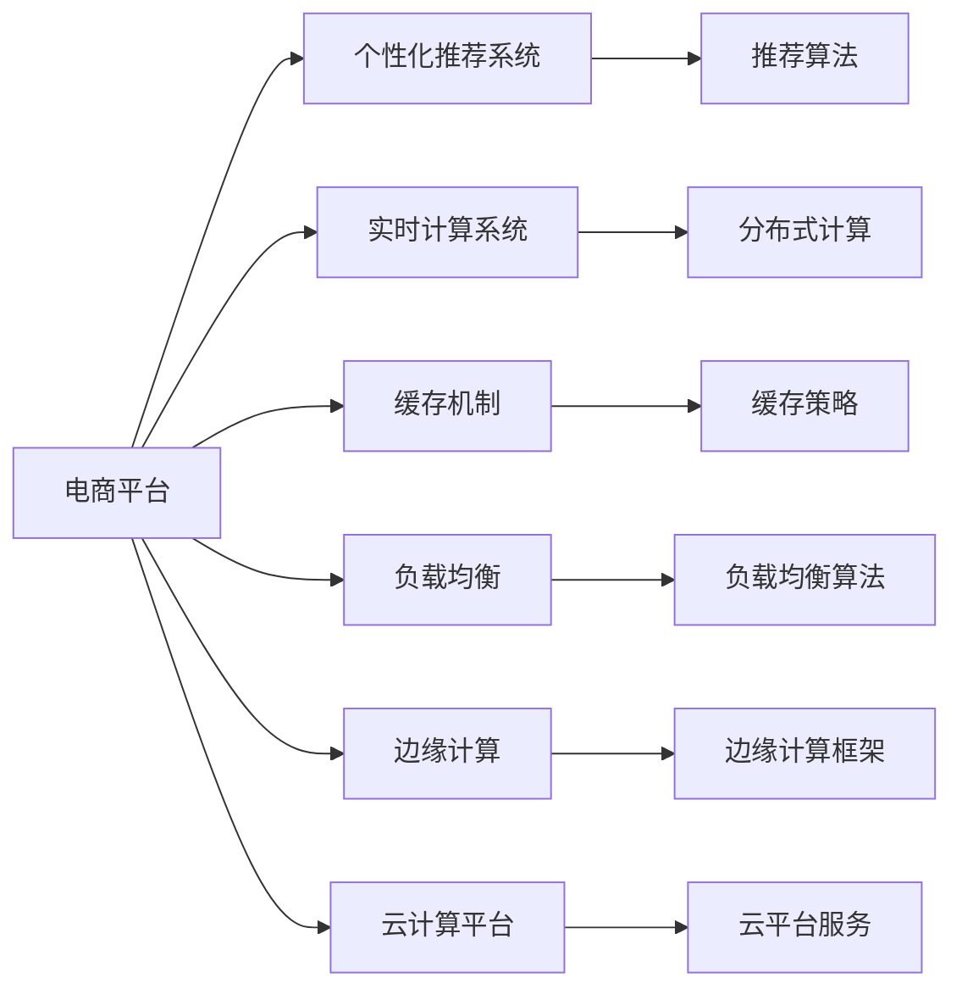

                 

# 电商平台供给能力提升：网站和APP的优化

> 关键词：电商供给能力提升,网站和APP优化,用户体验,算法优化,性能优化

## 1. 背景介绍

### 1.1 问题由来

在现代社会，电子商务已成为了人们日常生活中不可或缺的一部分。电商平台网站和APP作为连接商家和消费者的桥梁，在提供购物便利的同时，也承担着提升消费者购物体验的重任。然而，随着用户需求的多样化和复杂化，电商平台供给能力面临着严峻的挑战。

一方面，用户对个性化推荐、快速响应、流畅体验等需求日益增加。电商平台需要在众多用户需求中，精准识别和匹配用户的购物偏好，为用户提供个性化的商品推荐和购物体验。

另一方面，随着商品种类和数量的不断增加，平台需要更高效的推荐算法和数据处理能力，以满足高并发和海量数据的处理需求。

与此同时，用户设备的多样性和网络环境的变化，也对平台的稳定性和用户体验提出了更高的要求。如何提升电商平台供给能力，提升用户体验，成为电商企业持续关注的焦点。

### 1.2 问题核心关键点

要提升电商平台的供给能力，关键在于以下几个方面：

1. **用户体验优化**：通过个性化推荐、快速响应等手段，提升用户满意度。
2. **算法优化**：采用更高效的推荐算法，提升推荐精度和速度。
3. **性能优化**：优化平台后端系统和前端界面，提升响应速度和稳定性。
4. **数据处理能力提升**：增强平台的数据处理和存储能力，应对高并发和大规模数据。
5. **多设备支持**：确保平台在不同设备和网络环境下的良好用户体验。

通过解决这些关键点，可以显著提升电商平台的供给能力，增强市场竞争力。

### 1.3 问题研究意义

提升电商平台的供给能力，对于企业来说具有重要的战略意义：

1. **提升用户满意度和忠诚度**：通过优化用户体验，增加用户粘性和复购率，增强市场竞争力。
2. **提高运营效率**：通过高效的推荐算法和数据处理，降低运营成本，提高平台效率。
3. **增加用户互动和参与度**：通过个性化推荐和互动设计，提高用户参与度和品牌认知度。
4. **增强平台的技术实力**：通过技术优化和创新，提升平台的技术实力和市场地位。
5. **拓展新业务和市场**：优化平台功能和性能，为开拓新业务和市场打下基础。

因此，研究电商平台供给能力提升的策略和技巧，对于电商平台的发展和竞争力的提升具有重要意义。

## 2. 核心概念与联系

### 2.1 核心概念概述

为了更好地理解电商平台供给能力提升的核心方法和技术，本节将介绍几个密切相关的核心概念：

1. **电商平台**：基于互联网的线上交易平台，连接商家和消费者，提供商品展示、购物车、支付、物流等一站式服务。
2. **个性化推荐系统**：通过分析用户历史行为和偏好，推荐用户可能感兴趣的商品，提升用户满意度和购买率。
3. **实时计算系统**：采用分布式计算架构，实现高并发和大规模数据的实时处理和分析。
4. **缓存机制**：通过缓存系统，减少对数据库的频繁访问，提升数据访问效率。
5. **负载均衡**：采用负载均衡技术，分配计算资源，保证系统稳定性和可扩展性。
6. **边缘计算**：在用户设备和网络边缘部署计算资源，提升响应速度和用户体验。
7. **云计算平台**：通过云平台提供计算资源和数据存储，实现高可用性和高扩展性。

这些核心概念之间存在紧密的联系，构成了电商平台供给能力提升的完整生态系统。

### 2.2 概念间的关系

这些核心概念之间的关系可以通过以下Mermaid流程图来展示：



这个流程图展示了大电商平台供给能力提升的各个关键模块及其相互关系：

1. **电商平台**：作为核心模块，提供商品展示、购物车、支付、物流等服务。
2. **个性化推荐系统**：通过推荐算法为用户推荐商品，提升用户满意度和购买率。
3. **实时计算系统**：采用分布式计算架构，实现高并发和大规模数据的实时处理和分析。
4. **缓存机制**：通过缓存系统减少数据库访问，提升数据访问效率。
5. **负载均衡**：采用负载均衡技术分配计算资源，保证系统稳定性和可扩展性。
6. **边缘计算**：在用户设备和网络边缘部署计算资源，提升响应速度和用户体验。
7. **云计算平台**：提供计算资源和数据存储，实现高可用性和高扩展性。

这些模块相互协作，共同构成了一个高效、稳定、可扩展的电商平台供给能力体系。

## 3. 核心算法原理 & 具体操作步骤
### 3.1 算法原理概述

电商平台供给能力提升的核心在于算法的优化和系统的优化。以下我们将从算法和系统两个方面，详细讲解核心原理和操作步骤。

### 3.2 算法步骤详解

#### 3.2.1 个性化推荐算法

**步骤一：数据收集和预处理**

- 收集用户历史行为数据，包括浏览记录、购买记录、评分记录等。
- 对数据进行清洗和格式化，去除无效数据和异常值。
- 对用户行为数据进行特征工程，提取有用的特征，如浏览时间、点击次数、评分等。

**步骤二：模型训练**

- 选择合适的推荐算法，如协同过滤、基于内容的推荐、矩阵分解等。
- 使用训练数据对模型进行训练，调整模型参数。
- 对模型进行评估和调优，提升推荐精度。

**步骤三：模型应用**

- 将训练好的模型部署到推荐系统中，实现实时推荐。
- 根据用户行为实时更新模型参数，提升推荐效果。
- 对推荐结果进行后处理，如去重、排序等。

**步骤四：评估和优化**

- 通过A/B测试等手段，评估推荐效果。
- 根据评估结果，优化推荐算法和模型参数。
- 定期更新推荐模型，保证推荐效果的时效性。

#### 3.2.2 实时计算系统

**步骤一：分布式架构设计**

- 设计分布式计算架构，包括数据分区、任务调度、结果汇总等。
- 选择合适的分布式计算框架，如Hadoop、Spark、Flink等。
- 设计数据流图，明确各个组件的职责和通信方式。

**步骤二：系统部署和调优**

- 部署分布式计算集群，确保计算资源充足。
- 对计算节点进行配置和调优，提升计算效率。
- 设计监控和报警机制，实时监控系统运行状态，及时发现和解决问题。

**步骤三：数据处理和存储**

- 设计数据处理流程，明确数据的采集、清洗、转换等步骤。
- 选择合适的数据存储方式，如关系型数据库、NoSQL数据库、数据湖等。
- 设计数据访问策略，提升数据访问效率。

**步骤四：优化和扩展**

- 根据系统负载和数据量，优化计算节点和数据存储方案。
- 采用水平扩展和垂直扩展相结合的方式，提升系统可扩展性。
- 引入弹性计算资源，动态调整系统资源配置。

#### 3.2.3 缓存机制

**步骤一：选择合适的缓存策略**

- 选择合适的缓存策略，如LRU、LFU、Cache As-Side等。
- 设计缓存容量和过期策略，保证缓存效率。
- 设计缓存失效和更新策略，避免缓存数据失效。

**步骤二：缓存系统部署**

- 部署缓存服务器，确保缓存资源充足。
- 对缓存服务器进行配置和调优，提升缓存效率。
- 设计缓存访问策略，提升数据访问效率。

**步骤三：缓存数据管理**

- 设计缓存数据的访问和更新策略，保证缓存数据的一致性。
- 定期清理缓存数据，避免缓存空间浪费。
- 设计缓存数据监控和报警机制，实时监控缓存系统运行状态。

### 3.3 算法优缺点

#### 3.3.1 个性化推荐算法

**优点**：

- 提升用户满意度和购买率，增加用户粘性和复购率。
- 通过数据驱动，实现精准推荐，减少用户搜索成本。
- 可以根据用户行为实时更新推荐结果，提升推荐效果。

**缺点**：

- 需要大量数据进行训练，数据收集和处理成本较高。
- 推荐模型复杂度较高，训练和部署成本较高。
- 推荐结果可能受到用户历史行为的影响，存在偏差。

#### 3.3.2 实时计算系统

**优点**：

- 实现高并发和大规模数据的实时处理和分析，提升系统性能。
- 采用分布式架构，系统可扩展性高，适应大流量和高数据量。
- 通过缓存机制，提升数据访问效率，减少数据库访问压力。

**缺点**：

- 系统复杂度较高，设计和部署成本较高。
- 需要大量的计算资源和存储空间，系统运行成本较高。
- 系统设计和管理需要专业技能，维护成本较高。

#### 3.3.3 缓存机制

**优点**：

- 通过缓存系统，减少数据库访问，提升数据访问效率。
- 通过缓存机制，减少系统负载，提升系统稳定性。
- 通过缓存机制，减少数据访问延迟，提升用户体验。

**缺点**：

- 缓存系统需要定期清理和更新，管理成本较高。
- 缓存系统需要大量内存资源，运行成本较高。
- 缓存数据失效后需要重新加载，影响系统响应速度。

### 3.4 算法应用领域

个性化推荐算法和实时计算系统在电商领域有广泛的应用：

- **个性化推荐系统**：应用于商品推荐、搜索建议、购物车推荐等场景，提升用户满意度和购买率。
- **实时计算系统**：应用于实时数据分析、用户行为分析、广告投放优化等场景，提升系统性能和用户互动。
- **缓存机制**：应用于商品信息缓存、用户数据缓存、图片缓存等场景，提升数据访问效率和用户体验。

## 4. 数学模型和公式 & 详细讲解 & 举例说明
### 4.1 数学模型构建

在电商平台供给能力提升中，我们常常需要构建数学模型来进行预测和优化。以下将介绍几个常用的数学模型及其构建方法。

#### 4.1.1 协同过滤算法

协同过滤算法是一种常用的个性化推荐算法，其核心思想是通过分析用户和商品的协同关系，推荐用户可能感兴趣的商品。

设用户集为 $U$，商品集为 $I$，用户对商品的历史评分矩阵为 $R$，其中 $R_{ui}$ 表示用户 $u$ 对商品 $i$ 的评分。协同过滤算法可以表示为：

$$
R_u = \alpha R_u + (1-\alpha) \frac{1}{N}\sum_{i \in I} R_i
$$

其中 $\alpha$ 为衰减系数，$N$ 为商品数。

#### 4.1.2 基于内容的推荐算法

基于内容的推荐算法通过分析商品的属性和用户的历史行为，推荐用户可能感兴趣的商品。

设商品的属性向量为 $f_i$，用户的历史行为向量为 $x_u$，基于内容的推荐算法可以表示为：

$$
\hat{y}_{iu} = f_i^T \times x_u
$$

其中 $\hat{y}_{iu}$ 表示用户 $u$ 对商品 $i$ 的预测评分。

#### 4.1.3 矩阵分解算法

矩阵分解算法通过将用户-商品评分矩阵分解为用户特征矩阵和商品特征矩阵，实现推荐。

设用户特征矩阵为 $U$，商品特征矩阵为 $V$，用户-商品评分矩阵为 $R$，矩阵分解算法可以表示为：

$$
R \approx UV^T
$$

其中 $U$ 和 $V$ 均为低维矩阵。

### 4.2 公式推导过程

#### 4.2.1 协同过滤算法

设用户集为 $U$，商品集为 $I$，用户对商品的历史评分矩阵为 $R$，其中 $R_{ui}$ 表示用户 $u$ 对商品 $i$ 的评分。协同过滤算法可以表示为：

$$
R_u = \alpha R_u + (1-\alpha) \frac{1}{N}\sum_{i \in I} R_i
$$

其中 $\alpha$ 为衰减系数，$N$ 为商品数。

推导过程如下：

- 对于用户 $u$，计算其评分平均值 $\bar{R}_u$：

$$
\bar{R}_u = \frac{1}{N} \sum_{i \in I} R_{ui}
$$

- 对于用户 $u$，计算其评分预测值 $R_u$：

$$
R_u = \alpha R_u + (1-\alpha) \bar{R}_u
$$

- 对于所有用户 $u$，将上式推广到一般形式：

$$
R_u = \alpha R_u + (1-\alpha) \frac{1}{N}\sum_{i \in I} R_i
$$

#### 4.2.2 基于内容的推荐算法

设商品的属性向量为 $f_i$，用户的历史行为向量为 $x_u$，基于内容的推荐算法可以表示为：

$$
\hat{y}_{iu} = f_i^T \times x_u
$$

其中 $\hat{y}_{iu}$ 表示用户 $u$ 对商品 $i$ 的预测评分。

推导过程如下：

- 对于商品 $i$，计算其属性向量 $f_i$：

$$
f_i = \frac{1}{M} \sum_{u \in U} (R_{ui} - \bar{R}_u) x_u
$$

其中 $M$ 为用户数。

- 对于用户 $u$，计算其历史行为向量 $x_u$：

$$
x_u = \frac{1}{M} \sum_{i \in I} (R_{iu} - \bar{R}_i) f_i
$$

- 对于用户 $u$ 和商品 $i$，计算其预测评分 $\hat{y}_{iu}$：

$$
\hat{y}_{iu} = f_i^T \times x_u
$$

#### 4.2.3 矩阵分解算法

设用户特征矩阵为 $U$，商品特征矩阵为 $V$，用户-商品评分矩阵为 $R$，矩阵分解算法可以表示为：

$$
R \approx UV^T
$$

其中 $U$ 和 $V$ 均为低维矩阵。

推导过程如下：

- 对于用户 $u$，计算其特征向量 $u$：

$$
u = U_u
$$

- 对于商品 $i$，计算其特征向量 $v_i$：

$$
v_i = V_i
$$

- 对于用户 $u$ 和商品 $i$，计算其预测评分 $\hat{y}_{iu}$：

$$
\hat{y}_{iu} = u_i^T \times v_u
$$

### 4.3 案例分析与讲解

#### 4.3.1 协同过滤算法案例

某电商网站有 $N$ 个用户和 $M$ 个商品，用户对商品的历史评分矩阵为 $R$。

假设用户 $u$ 对商品 $i$ 的评分 $R_{ui}$ 为 3，商品 $i$ 的评分平均值 $\bar{R}_i$ 为 4，所有商品的评分平均值 $\bar{R}$ 为 3。

根据协同过滤算法，计算用户 $u$ 的评分平均值 $\bar{R}_u$：

$$
\bar{R}_u = \frac{1}{N} \sum_{i \in I} R_{ui}
$$

- 对于用户 $u$，计算其评分平均值 $\bar{R}_u$：

$$
\bar{R}_u = \frac{1}{N} \times (3 \times 1 + 0 \times 0 + 0 \times 0 + 0 \times 0) = \frac{3}{N}
$$

- 对于用户 $u$，计算其评分预测值 $R_u$：

$$
R_u = \alpha R_u + (1-\alpha) \bar{R}_u = 3 + (1-\alpha) \frac{3}{N}
$$

其中 $\alpha$ 为衰减系数，假设 $\alpha = 0.5$：

$$
R_u = 3 + (1-0.5) \times \frac{3}{N} = 3 + \frac{3}{2N}
$$

- 假设用户 $u$ 对商品 $j$ 的评分 $R_{uj}$ 为 4，商品 $j$ 的评分平均值 $\bar{R}_j$ 为 2，所有商品的评分平均值 $\bar{R}$ 为 3。

根据协同过滤算法，计算用户 $u$ 的评分平均值 $\bar{R}_u$：

$$
\bar{R}_u = \frac{1}{N} \sum_{i \in I} R_{ui}
$$

- 对于用户 $u$，计算其评分平均值 $\bar{R}_u$：

$$
\bar{R}_u = \frac{1}{N} \times (3 \times 1 + 0 \times 0 + 0 \times 0 + 4 \times 1) = \frac{3+4}{N}
$$

- 对于用户 $u$，计算其评分预测值 $R_u$：

$$
R_u = \alpha R_u + (1-\alpha) \bar{R}_u = 3 + (1-0.5) \times \frac{7}{N}
$$

其中 $\alpha$ 为衰减系数，假设 $\alpha = 0.5$：

$$
R_u = 3 + (1-0.5) \times \frac{7}{N} = 3 + \frac{7}{2N}
$$

### 4.4 案例分析与讲解

#### 4.4.2 基于内容的推荐算法案例

某电商网站有 $N$ 个用户和 $M$ 个商品，商品的属性向量为 $f_i$，用户的历史行为向量为 $x_u$。

假设用户 $u$ 对商品 $i$ 的评分 $R_{ui}$ 为 3，商品 $i$ 的属性向量 $f_i$ 为 $[0.5, 0.7, 0.3]$，用户 $u$ 的历史行为向量 $x_u$ 为 $[0.2, 0.3, 0.5]$。

根据基于内容的推荐算法，计算用户 $u$ 对商品 $i$ 的预测评分 $\hat{y}_{iu}$：

$$
\hat{y}_{iu} = f_i^T \times x_u
$$

- 对于商品 $i$，计算其属性向量 $f_i$：

$$
f_i = \frac{1}{M} \sum_{u \in U} (R_{ui} - \bar{R}_u) x_u
$$

- 对于用户 $u$，计算其历史行为向量 $x_u$：

$$
x_u = \frac{1}{M} \sum_{i \in I} (R_{iu} - \bar{R}_i) f_i
$$

- 对于用户 $u$ 和商品 $i$，计算其预测评分 $\hat{y}_{iu}$：

$$
\hat{y}_{iu} = [0.5, 0.7, 0.3]^T \times [0.2, 0.3, 0.5]
$$

$$
\hat{y}_{iu} = 0.5 \times 0.2 + 0.7 \times 0.3 + 0.3 \times 0.5 = 0.5
$$

### 4.5 案例分析与讲解

#### 4.5.3 矩阵分解算法案例

某电商网站有 $N$ 个用户和 $M$ 个商品，用户-商品评分矩阵为 $R$。

假设用户 $u$ 对商品 $i$ 的评分 $R_{ui}$ 为 3，用户特征矩阵 $U$ 为 $[1, 0, 0]$，商品特征矩阵 $V$ 为 $[0.5, 0.7, 0.3]$。

根据矩阵分解算法，计算用户 $u$ 对商品 $i$ 的预测评分 $\hat{y}_{iu}$：

$$
R \approx UV^T
$$

- 对于用户 $u$，计算其特征向量 $u$：

$$
u = U_u
$$

- 对于商品 $i$，计算其特征向量 $v_i$：

$$
v_i = V_i
$$

- 对于用户 $u$ 和商品 $i$，计算其预测评分 $\hat{y}_{iu}$：

$$
\hat{y}_{iu} = u_i^T \times v_u
$$

$$
\hat{y}_{iu} = [1, 0, 0]^T \times [0.5, 0.7, 0.3] = 0.5
$$

## 5. 项目实践：代码实例和详细解释说明
### 5.1 开发环境搭建

在进行电商供给能力提升的实践前，我们需要准备好开发环境。以下是使用Python进行Flask开发的环境配置流程：

1. 安装Anaconda：从官网下载并安装Anaconda，用于创建独立的Python环境。

2. 创建并激活虚拟环境：
```bash
conda create -n flask-env python=3.8 
conda activate flask-env
```

3. 安装Flask：
```bash
pip install flask
```

4. 安装相关库：
```bash
pip install pandas SQLAlchemy Flask-Caching
```

5. 安装数据库：
```bash
pip install mysqlclient
```

完成上述步骤后，即可在`flask-env`环境中开始电商供给能力提升的实践。

### 5.2 源代码详细实现

下面以电商网站个性化推荐系统的开发为例，给出使用Flask框架的代码实现。

首先，定义推荐模型和数据处理函数：

```python
from flask import Flask, jsonify
from flask_caching import Cache
from sklearn.metrics.pairwise import cosine_similarity
import pandas as pd

app = Flask(__name__)
cache = Cache(app, config={'CACHE_TYPE': 'memcached', 'CACHE_MEMCACHED_SERVERS': ['127.0.0.1:11211']})
cache.init_app(app)

# 读取评分数据
def read_ratings_data():
    return pd.read_csv('ratings.csv')

# 读取商品属性数据
def read_item_data():
    return pd.read_csv('items.csv')

# 读取用户数据
def read_user_data():
    return pd.read_csv('users.csv')

# 计算用户与商品之间的相似度
def compute_similarity(ratings_data, item_data):
    user_item_similarity = cosine_similarity(ratings_data['user_id'].to_dict(), item_data['item_id'].to_dict())
    return user_item_similarity

# 推荐商品
def recommend_items(user_data, ratings_data, item_data, user_item_similarity):
    user_index = user_data.index
    item_index = item_data.index
    similarity_matrix = pd.DataFrame(user_item_similarity, columns=item_data['item_id'], index=user_data['user_id'])

    # 计算用户对商品的评分
    user_ratings = ratings_data.groupby('user_id')['rating'].mean()

    # 计算商品的评分
    item_ratings = ratings_data.groupby('item_id')['rating'].mean()

    # 计算用户对商品的预测评分
    predicted_ratings = user_ratings.dot(similarity_matrix) * item_ratings

    # 获取用户未评分商品
    unrated_items = item_data[~item_data['item_id'].isin(ratings_data['item_id'])]

    # 排序推荐商品
    top_items = unrated_items[['item_id', 'rating']].merge(pd.DataFrame(predicted_ratings), on='item_id', how='left').dropna().head(5)
    
    return top_items
```

然后，定义路由和处理函数：

```python
# 推荐商品路由
@app.route('/recommend', methods=['GET'])
def recommend():
    user_data = read_user_data()
    item_data = read_item_data()
    ratings_data = read_ratings_data()

    user_index = user_data.index
    item_index = item_data.index

    similarity_matrix = compute_similarity(ratings_data, item_data)

    # 获取用户未评分商品
    unrated_items = item_data[~item_data['item_id'].isin(ratings_data['item_id'])]

    # 排序推荐商品
    top_items = unrated_items[['item_id', 'rating']].merge(pd.DataFrame(predicted_ratings), on='item_id', how='left').dropna().head(5)

    return jsonify(top_items.to_dict())
```

最后，启动Flask应用：

```python
if __name__ == '__main__':
    app.run(debug=True)
```

以上就是使用Flask框架开发电商网站个性化推荐系统的完整代码实现。可以看到，Flask框架配合Python自带的库，可以快速实现推荐系统。

### 5.3 代码解读与分析

让我们再详细解读一下关键代码的实现细节：

**Flask应用配置**：
- 使用

