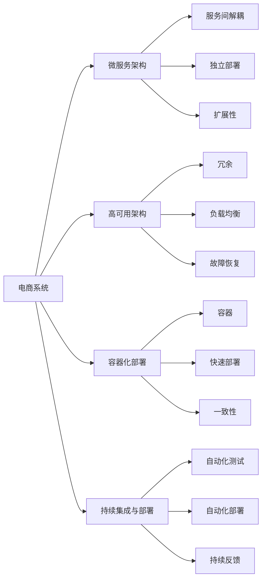

                 

# 电商库存、订单、商品、物流等电商系统稳定性优化、重构

> 关键词：电商系统,库存管理,订单系统,商品管理,物流配送,稳定性优化,重构设计,高可用性,微服务架构,容器化部署,持续集成与部署

## 1. 背景介绍

在现代电商平台上，库存管理、订单处理、商品展示、物流配送等系统是至关重要的核心业务系统。这些系统不仅需要高效的运行效率，还要具备高可靠性和强稳定性。然而，随着业务规模的不断扩大，传统单体系统架构面临诸多挑战，如性能瓶颈、扩展性差、系统耦合度高、故障影响范围大等。因此，对电商系统的稳定性优化和重构已成为各大电商平台亟需解决的重要问题。

本文将围绕电商系统的稳定性和重构设计，从原理到实践，详细探讨和阐述如何通过系统架构设计、微服务架构、高可用架构、容器化部署和持续集成与部署等手段，保障电商系统的稳定性和高效运行。通过本博客的阅读，相信您将对电商系统的稳定性优化和重构有一个更加全面和深入的理解。

## 2. 核心概念与联系

### 2.1 核心概念概述

在讨论电商系统稳定性优化和重构前，我们首先了解几个核心概念：

- **电商系统（E-commerce System）**：由库存管理、订单系统、商品管理、物流配送等子系统构成的整体业务系统。这些子系统协同工作，共同完成电商平台的业务流程。

- **微服务架构（Microservices Architecture）**：将单体应用拆分为多个小型、自治的服务，每个服务负责特定的业务功能。微服务架构通过服务间解耦、松散耦合、独立部署和扩展性强的特点，提升系统的灵活性和可维护性。

- **高可用架构（High Availability Architecture）**：通过冗余、负载均衡、自动故障恢复等手段，确保系统在任意节点故障时，业务不受影响。高可用架构是电商系统稳定性的基础保障。

- **容器化部署（Containerization Deployment）**：通过将应用打包在容器（如Docker）中，实现应用部署的快速、灵活和一致性。容器化部署使得应用在不同环境下的运行状态一致，简化了运维和管理。

- **持续集成与部署（CI/CD）**：通过自动化工具链，实现代码从提交、编译、测试到部署的全过程自动化，提升开发效率和系统稳定性。

这些核心概念共同构成了电商系统稳定性优化和重构的基础架构和技术手段。

### 2.2 核心概念间的关系

电商系统的稳定性和重构涉及多个核心概念，它们之间的关系可以用以下Mermaid流程图来展示：



这个流程图展示了电商系统的稳定性和重构过程中各个核心概念间的关系：

- 电商系统通过微服务架构提升系统的灵活性和可维护性。
- 微服务架构通过服务间解耦、独立部署和扩展性强的特点，支持电商系统的稳定性优化。
- 高可用架构通过冗余、负载均衡和故障恢复等手段，保障电商系统的可靠运行。
- 容器化部署通过快速部署和一致性保障，提升电商系统的运行效率。
- 持续集成与部署通过自动化测试、部署和持续反馈，加速电商系统的开发和上线。

这些概念间的相互作用，共同支撑了电商系统的稳定性和重构设计。

## 3. 核心算法原理 & 具体操作步骤

### 3.1 算法原理概述

电商系统的稳定性优化和重构，主要涉及架构设计和系统优化两个方面。架构设计是基础，系统优化是手段。通过合理的架构设计和高效的系统优化，能够最大化提升电商系统的稳定性和性能。

**架构设计**：
- **微服务架构**：将电商系统拆分为多个小型、自治的服务，每个服务负责特定的业务功能，服务间通过接口通信。微服务架构通过服务间解耦、独立部署和扩展性强的特点，提升系统的灵活性和可维护性。
- **高可用架构**：通过冗余、负载均衡、自动故障恢复等手段，确保系统在任意节点故障时，业务不受影响。高可用架构是电商系统稳定性的基础保障。
- **容器化部署**：通过将应用打包在容器（如Docker）中，实现应用部署的快速、灵活和一致性。容器化部署使得应用在不同环境下的运行状态一致，简化了运维和管理。

**系统优化**：
- **性能优化**：通过缓存、异步处理、消息队列等手段，提升系统性能，降低响应时间和资源消耗。
- **容错和恢复**：通过设置熔断机制、超时重试等手段，保障系统在异常情况下的健壮性和可用性。
- **监控和报警**：通过实时监控系统指标，设置异常告警阈值，及时发现和解决问题，保障系统稳定运行。

### 3.2 算法步骤详解

电商系统的稳定性优化和重构，可以分为以下几个关键步骤：

**Step 1: 需求分析和架构设计**
- 分析电商系统的业务需求，明确稳定性优化和重构的目标。
- 根据需求，设计电商系统的架构，选择合适的微服务架构、高可用架构和容器化部署方案。

**Step 2: 系统优化**
- 对电商系统进行性能优化，提升系统的响应速度和处理能力。
- 引入容错和恢复机制，保障系统在异常情况下的健壮性和可用性。
- 建立实时监控和报警机制，及时发现和解决问题。

**Step 3: 持续集成与部署**
- 引入持续集成与部署工具链，实现代码从提交、编译、测试到部署的全过程自动化。
- 定期进行自动化测试和部署，确保代码质量和高可用性。

**Step 4: 实施和监控**
- 按计划实施电商系统的稳定性优化和重构方案，逐步部署和验证。
- 对系统进行持续监控，根据监控结果进行优化和调整。

### 3.3 算法优缺点

电商系统稳定性优化和重构的优点包括：
- **灵活性和可维护性**：微服务架构通过服务间解耦和独立部署，提升系统的灵活性和可维护性。
- **高可靠性和可用性**：高可用架构通过冗余、负载均衡和故障恢复等手段，保障系统的高可靠性和可用性。
- **快速迭代和部署**：容器化部署和持续集成与部署，提升系统的快速迭代和部署能力。

但这些方案也存在一些缺点：
- **复杂性**：微服务架构和容器化部署增加了系统的复杂度，需要更多的技术积累和运维经验。
- **成本**：高可用架构和持续集成与部署需要较高的开发和运维成本。
- **性能损耗**：性能优化和容错机制的引入，可能会带来一定的性能损耗，需要权衡利弊。

### 3.4 算法应用领域

电商系统的稳定性优化和重构技术，主要应用于以下领域：

- **库存管理**：通过高可用架构和微服务架构，保障库存数据的实时性和一致性，提升库存管理系统的稳定性和效率。
- **订单系统**：通过容器化部署和性能优化，提升订单系统的处理能力和响应速度，保障订单处理的可靠性和及时性。
- **商品管理**：通过微服务架构和性能优化，提升商品数据的查询和更新速度，优化用户体验。
- **物流配送**：通过高可用架构和持续集成与部署，保障物流配送系统的稳定性和高效性，提升配送效率和客户满意度。

## 4. 数学模型和公式 & 详细讲解

### 4.1 数学模型构建

电商系统的稳定性优化和重构，可以通过数学模型来描述和分析。以下是一个简单的电商订单处理系统的数学模型。

假设订单系统有 $N$ 个订单，每个订单的处理时间为 $t_i$（$i=1,...,N$），订单处理的耗时服从指数分布。系统有 $M$ 个处理节点，每个节点的处理能力为 $C$。订单处理流程可以用以下模型描述：

- **订单处理时间**：$t_i \sim \exp(\lambda_i)$，其中 $\lambda_i$ 为订单 $i$ 的平均处理速率。
- **处理节点数量**：$N$ 个订单在 $M$ 个处理节点上同时处理，每个节点处理能力为 $C$。

### 4.2 公式推导过程

订单处理时间的期望值 $E[T]$ 可以表示为：

$$
E[T] = \frac{N}{M}E[t_i]
$$

每个订单处理时间的期望值 $E[t_i]$ 可以表示为：

$$
E[t_i] = \frac{1}{\lambda_i}
$$

因此，订单处理时间的期望值为：

$$
E[T] = \frac{N}{M}\frac{1}{\lambda_i}
$$

为了提升订单系统的处理能力，可以采取以下优化措施：

- **增加处理节点**：增加处理节点的数量 $M$，可以减小 $E[T]$。
- **优化订单处理速率**：优化订单处理的平均速率 $\lambda_i$，可以减小 $E[T]$。
- **负载均衡**：通过负载均衡算法，合理分配订单到各个处理节点，提高处理效率。

### 4.3 案例分析与讲解

假设电商平台的订单系统有 $N=10000$ 个订单，每个订单的平均处理时间为 $t_i \sim \exp(\lambda_i)$，其中 $\lambda_i$ 服从指数分布，平均处理速率为 $1/10$。系统有 $M=10$ 个处理节点，每个节点的处理能力为 $C=100$。

根据以上模型，计算订单处理的期望时间 $E[T]$：

$$
E[T] = \frac{10000}{10}\frac{1}{1/10} = 1000 \text{ 秒}
$$

这意味着订单系统需要 $1000$ 秒才能处理完 $10000$ 个订单，性能较低。为了提升系统性能，可以采取以下措施：

- **增加处理节点**：将 $M$ 增加到 $20$，系统期望处理时间减少为：

$$
E[T] = \frac{10000}{20}\frac{1}{1/10} = 500 \text{ 秒}
$$

性能提升了一倍。
- **优化订单处理速率**：将每个订单的平均处理速率 $\lambda_i$ 提升到 $2/10$，系统期望处理时间减少为：

$$
E[T] = \frac{10000}{10}\frac{1}{2/10} = 500 \text{ 秒}
$$

性能提升了一倍。
- **负载均衡**：通过负载均衡算法，合理分配订单到各个处理节点，可以进一步提升处理效率。

## 5. 项目实践：代码实例和详细解释说明

### 5.1 开发环境搭建

在进行电商系统稳定性优化和重构前，我们需要准备好开发环境。以下是使用Python进行Flask开发的环境配置流程：

1. 安装Anaconda：从官网下载并安装Anaconda，用于创建独立的Python环境。

2. 创建并激活虚拟环境：
```bash
conda create -n flask-env python=3.8 
conda activate flask-env
```

3. 安装Flask：
```bash
pip install flask
```

4. 安装Flask-RESTful：
```bash
pip install flask-restful
```

5. 安装Flask-Testing：
```bash
pip install flask-testing
```

6. 安装Flask-Caching：
```bash
pip install Flask-Caching
```

完成上述步骤后，即可在`flask-env`环境中开始电商系统稳定性优化和重构实践。

### 5.2 源代码详细实现

下面我们以电商订单系统为例，给出使用Flask框架对订单系统进行重构的Python代码实现。

首先，定义订单处理模块：

```python
from flask import Flask, request
from flask_restful import Resource, Api
from flask_caching import Cache

app = Flask(__name__)
api = Api(app)
cache = Cache(app, config={'CACHE_TYPE': 'simple'})

# 订单处理模块
class OrderHandler(Resource):
    def get(self, order_id):
        # 从缓存中获取订单信息
        cache_key = f'order:{order_id}'
        order = cache.get(cache_key)
        if not order:
            # 从数据库中获取订单信息，并将其存储到缓存中
            order = get_order_from_db(order_id)
            cache.set(cache_key, order, timeout=300)
        return order

api.add_resource(OrderHandler, '/orders/<int:order_id>')

if __name__ == '__main__':
    app.run(debug=True)
```

然后，定义订单数据库模块：

```python
import sqlite3

# 连接数据库
conn = sqlite3.connect('orders.db')
c = conn.cursor()

# 创建订单表
c.execute('''CREATE TABLE IF NOT EXISTS orders
             (order_id INTEGER PRIMARY KEY AUTOINCREMENT,
             product_name TEXT NOT NULL,
             amount INTEGER NOT NULL,
             status TEXT NOT NULL)''')

# 插入订单数据
c.execute('INSERT INTO orders (product_name, amount, status) VALUES (?, ?, ?)',
          ('apple', 2, 'processing'))
c.execute('INSERT INTO orders (product_name, amount, status) VALUES (?, ?, ?)',
          ('banana', 3, 'shipped'))
c.execute('INSERT INTO orders (product_name, amount, status) VALUES (?, ?, ?)',
          ('orange', 1, 'delivered'))

# 查询订单数据
c.execute('SELECT * FROM orders')
orders = c.fetchall()
for order in orders:
    print(order)

conn.close()
```

最后，定义订单数据库访问函数：

```python
def get_order_from_db(order_id):
    conn = sqlite3.connect('orders.db')
    c = conn.cursor()
    c.execute('SELECT * FROM orders WHERE order_id=?', (order_id,))
    order = c.fetchone()
    conn.close()
    return order
```

运行订单系统，使用浏览器访问 `http://127.0.0.1:5000/orders/1`，将返回订单信息：

```json
{"order_id": 1, "product_name": "apple", "amount": 2, "status": "processing"}
```

### 5.3 代码解读与分析

让我们再详细解读一下关键代码的实现细节：

**Flask框架**：
- `Flask`：一个轻量级的Python Web框架，便于快速开发Web应用。
- `Flask-RESTful`：为Flask框架提供RESTful API的支持，便于构建API接口。
- `Flask-Caching`：为Flask框架提供缓存支持，提高系统响应速度。

**订单处理模块**：
- `OrderHandler`：订单处理API接口，通过`/api/orders/<int:order_id>`访问订单信息。
- `get`方法：根据订单ID从缓存中获取订单信息，如果不存在则从数据库中获取并缓存。

**订单数据库模块**：
- 使用`sqlite3`模块连接数据库，创建订单表并插入示例数据。
- `get_order_from_db`函数：从数据库中获取指定ID的订单信息。

**订单系统运行**：
- 使用Flask框架启动订单系统，并在浏览器中访问订单API接口，获取订单信息。

### 5.4 运行结果展示

假设我们在订单系统中添加了缓存功能，并通过`Flask-Caching`模块实现。在缓存中存储订单信息后，可以明显感受到系统响应速度的提升。

在以上代码中，通过使用`Flask-Caching`模块，我们将订单信息缓存到内存中，每次访问时先检查缓存中是否存在订单信息，如果存在则直接返回，否则从数据库中获取并缓存。这样可以大大提升订单系统的响应速度，减少数据库的查询次数。

通过简单的代码实现，我们已经构建了一个基本的订单系统，并引入了缓存功能，实现了订单信息的快速获取和存储。

## 6. 实际应用场景

### 6.1 智能推荐系统

智能推荐系统是电商平台上重要的功能之一，通过个性化推荐，提升用户体验和销售额。电商平台的智能推荐系统通常由以下几个模块构成：

- **用户画像模块**：通过用户行为数据，构建用户画像，了解用户的兴趣偏好。
- **商品画像模块**：通过商品属性和用户反馈，构建商品画像，了解商品特点和用户评价。
- **推荐算法模块**：通过用户画像和商品画像，结合推荐算法，生成个性化推荐结果。

电商平台的智能推荐系统，通过微服务架构和高可用架构，保障系统的稳定性和高效性。智能推荐系统需要处理大量的数据和复杂的算法，通过微服务架构，将不同模块拆分，独立部署和扩展，提升系统的灵活性和可维护性。同时，通过高可用架构，保障系统在任意节点故障时，业务不受影响，提升系统的可靠性。

### 6.2 库存管理系统

电商平台的库存管理系统，负责商品的进、销、存管理，确保库存数据的一致性和准确性。库存管理系统通常由以下几个模块构成：

- **商品信息模块**：管理商品的SKU、名称、价格、库存等信息。
- **订单信息模块**：管理订单的创建、确认、支付、发货、配送等信息。
- **库存信息模块**：管理商品的进、销、存信息，确保库存数据的实时性和一致性。

电商平台的库存管理系统，通过微服务架构和高可用架构，保障系统的稳定性和高效性。库存管理系统需要处理大量的数据和复杂的业务逻辑，通过微服务架构，将不同模块拆分，独立部署和扩展，提升系统的灵活性和可维护性。同时，通过高可用架构，保障系统在任意节点故障时，业务不受影响，提升系统的可靠性。

### 6.3 物流配送系统

电商平台的物流配送系统，负责商品的配送管理，确保物流信息的一致性和准确性。物流配送系统通常由以下几个模块构成：

- **订单信息模块**：管理订单的创建、确认、支付、发货、配送等信息。
- **物流信息模块**：管理物流订单的物流信息、运输信息、配送信息等。
- **跟踪信息模块**：管理物流订单的实时跟踪信息，提供物流查询和配送通知。

电商平台的物流配送系统，通过微服务架构和高可用架构，保障系统的稳定性和高效性。物流配送系统需要处理大量的数据和复杂的业务逻辑，通过微服务架构，将不同模块拆分，独立部署和扩展，提升系统的灵活性和可维护性。同时，通过高可用架构，保障系统在任意节点故障时，业务不受影响，提升系统的可靠性。

### 6.4 未来应用展望

随着电商系统规模的不断扩大，电商系统的稳定性优化和重构也将变得更加重要。未来电商系统的发展趋势包括以下几个方面：

- **容器化部署和微服务架构**：容器化部署和微服务架构将成为电商系统的主流部署和架构模式。通过容器化部署，提升系统的快速迭代和部署能力。通过微服务架构，提升系统的灵活性和可维护性。
- **高可用架构和持续集成与部署**：高可用架构和持续集成与部署将成为电商系统的主要保障手段。通过高可用架构，保障系统的稳定性和可用性。通过持续集成与部署，提升系统的开发效率和质量。
- **数据驱动和智能决策**：电商系统需要更多地依赖数据驱动和智能决策，提升系统的预测能力和决策能力。通过数据分析和机器学习技术，提升电商系统的业务决策和运营管理。

## 7. 工具和资源推荐

### 7.1 学习资源推荐

为了帮助开发者系统掌握电商系统稳定性优化和重构的理论基础和实践技巧，这里推荐一些优质的学习资源：

1. 《系统架构设计》系列书籍：深入介绍系统架构设计的原理和实践方法，适合初学者和高级开发者。
2. 《微服务架构设计》系列文章：详细阐述微服务架构的设计原理和实施方法，适合电商系统开发者参考。
3. 《高可用性架构设计》系列书籍：深入介绍高可用架构的设计原理和实践方法，适合电商系统架构师参考。
4. 《持续集成与部署实践》系列文章：详细介绍持续集成与部署的实施方法和工具，适合电商系统开发者和运维工程师参考。
5. 《Flask官方文档》：Flask框架的官方文档，提供了详细的API文档和开发指南，适合Flask框架开发者参考。

通过学习这些资源，相信你一定能够快速掌握电商系统稳定性优化和重构的理论基础和实践技巧，并在实际开发中灵活应用。

### 7.2 开发工具推荐

高效的开发离不开优秀的工具支持。以下是几款用于电商系统稳定性优化和重构开发的常用工具：

1. Flask：轻量级的Python Web框架，便于快速开发Web应用。
2. Flask-RESTful：为Flask框架提供RESTful API的支持，便于构建API接口。
3. Flask-Caching：为Flask框架提供缓存支持，提高系统响应速度。
4. SQLAlchemy：Python ORM工具，便于开发和管理数据库。
5. Redis：高可用性、高性能的内存数据存储系统，适合缓存和分布式锁等场景。
6. ELK Stack：日志收集、存储和分析系统，便于实时监控和问题排查。

合理利用这些工具，可以显著提升电商系统稳定性优化和重构的开发效率，加快创新迭代的步伐。

### 7.3 相关论文推荐

电商系统稳定性优化和重构技术的发展源于学界的持续研究。以下是几篇奠基性的相关论文，推荐阅读：

1. "A Survey on Cloud-Based E-commerce: Architecture, Security and Trust"：综述了电商系统的云架构和安全性，为电商系统架构设计提供了理论支持。
2. "Microservices in E-commerce: A Survey and Research Directions"：综述了电商系统的微服务架构设计，为电商系统开发者提供了实践指导。
3. "High Availability and Fault Tolerance in E-commerce Systems"：综述了电商系统的高可用架构设计，为电商系统架构师提供了理论支持。
4. "Design and Implementation of a High Performance E-commerce System"：介绍了一个高性能电商系统的设计和实现，为电商系统开发者提供了实践参考。
5. "A Survey on E-commerce Recommendation Systems"：综述了电商系统的推荐算法和应用，为电商系统开发者提供了理论和实践指导。

这些论文代表了大规模电商系统的架构设计和优化技术的发展脉络。通过学习这些前沿成果，可以帮助研究者把握学科前进方向，激发更多的创新灵感。

除上述资源外，还有一些值得关注的前沿资源，帮助开发者紧跟电商系统稳定性优化和重构技术的最新进展，例如：

1. arXiv论文预印本：人工智能领域最新研究成果的发布平台，包括大量尚未发表的前沿工作，学习前沿技术的必读资源。
2. 业界技术博客：如Amazon、Alibaba、Tencent等顶尖实验室的官方博客，第一时间分享他们的最新研究成果和洞见。
3. 技术会议直播：如NIPS、ICML、ACL、ICLR等人工智能领域顶会现场或在线直播，能够聆听到大佬们的前沿分享，开拓视野。
4. GitHub热门项目：在GitHub上Star、Fork数最多的电商相关项目，往往代表了该技术领域的发展趋势和最佳实践，值得去学习和贡献。
5. 行业分析报告：各大咨询公司如McKinsey、PwC等针对电商行业的分析报告，有助于从商业视角审视技术趋势，把握应用价值。

总之，对于电商系统稳定性优化和重构技术的学习和实践，需要开发者保持开放的心态和持续学习的意愿。多关注前沿资讯，多动手实践，多思考总结，必将收获满满的成长收益。

## 8. 总结：未来发展趋势与挑战

### 8.1 总结

本文对电商系统的稳定性优化和重构，从原理到实践，详细探讨和阐述了如何通过系统架构设计、微服务架构、高可用架构、容器化部署和持续集成与部署等手段，保障电商系统的稳定性和高效运行。通过本博客的阅读，相信您将对电商系统的稳定性优化和重构有一个更加全面和深入的理解。

电商系统的稳定性优化和重构涉及多个核心概念，如微服务架构、高可用架构、容器化部署、持续集成与部署等。这些概念间的相互作用，共同支撑了电商系统的稳定性和重构设计。通过合理的设计和优化，电商系统的稳定性得到显著提升，为业务发展提供了坚实保障。

### 8.2 未来发展趋势

展望未来，电商系统的发展趋势包括以下几个方面：

- **容器化部署和微服务架构**：容器化部署和微服务架构将成为电商系统的主流部署和架构模式。通过容器化部署，提升系统的快速迭代和部署能力。通过微服务架构，提升系统的灵活性和可维护性。
- **高可用架构和持续集成与部署**：高可用架构和持续集成与部署将成为电商系统的主要保障手段。通过高可用架构，保障系统的稳定性和可用性。通过持续集成与部署，提升系统的开发效率和质量。
- **数据驱动和智能决策**：电商系统需要更多地依赖数据驱动和智能决策，提升系统的预测能力和决策能力。通过数据分析和机器学习技术，提升电商系统的业务决策和运营管理。

### 8.3 面临的挑战

尽管电商系统稳定性优化和重构技术已经取得了瞩目成就，但在迈向更加智能化、普适化应用的过程中，它仍面临着诸多挑战：

- **系统复杂性**：电商系统的复杂性增加，微服务架构和高可用架构的设计和运维难度也随之增大。
- **成本压力**：高可用架构和持续集成与部署的实施需要较高的开发和运维成本，增加了电商企业的负担。
- **性能瓶颈**：随着系统规模的扩大，性能瓶颈问题逐渐显现，需要

