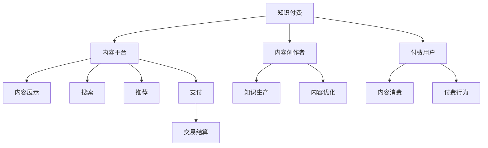
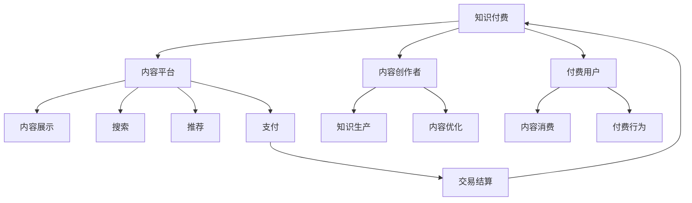

                 

## 1. 背景介绍

### 1.1 知识付费行业概述
知识付费是一种新型的消费模式，其核心是知识内容与支付手段的结合。知识付费的兴起标志着互联网从免费模式向付费模式过渡，互联网行业正逐步走向成熟化。特别是在移动互联网时代，知识付费成为获取知识、提升自我、增加收入的重要方式之一。据艾媒咨询报告，2021年中国知识付费用户规模达4.28亿，市场规模超360亿元。知识付费行业正处于高速增长的阶段，其市场需求大、用户基础强、行业潜力足，具有广阔的发展前景。

### 1.2 知识付费创业的现状与挑战
知识付费创业面临的挑战主要来自内容生产、平台运营和用户体验三个方面：
- **内容生产**：优质的知识内容是知识付费的根基，但目前内容生产者水平参差不齐，创作质量难以保证。
- **平台运营**：如何有效管理和运营平台，维护用户粘性，增加用户转化，是平台运营者的主要挑战。
- **用户体验**：知识付费平台需提供良好的用户体验，包括便捷的搜索、筛选、推荐等，以满足用户需求。

## 2. 核心概念与联系

### 2.1 核心概念概述

- **知识付费**：用户为获取知识而支付费用，平台为内容创作者提供变现渠道，实现知识生产与消费的良性循环。
- **内容平台**：连接内容创作者与用户的平台，提供内容展示、搜索、推荐等功能。
- **内容创作者**：即知识付费内容生产者，如专家、学者、作家等，其内容质量直接影响到平台的生命力。
- **付费用户**：愿意为获取知识付费的用户，是平台收入的主要来源。
- **平台运营**：平台需对内容、用户、运营策略等进行精细管理，以提高用户转化率和平台收益。

### 2.2 核心概念的关系

下图展示了知识付费行业核心概念之间的关系：



- **内容创作者**为**知识付费**提供优质内容，而**内容平台**则负责将内容展示给**付费用户**，并提供搜索、推荐、支付等功能，最终促成**付费行为**，实现**交易结算**。

### 2.3 核心概念的整体架构

为更好地理解知识付费行业，我们使用综合的流程图来展示各个核心概念之间的联系：



- **内容创作者**通过**知识生产**和**内容优化**向**内容平台**提供优质内容。
- **内容平台**通过**内容展示**、**搜索**、**推荐**等功能，将内容呈现给**付费用户**。
- **付费用户**通过**内容消费**和**付费行为**与**内容创作者**发生互动，最终通过**交易结算**实现知识付费。

## 3. 核心算法原理 & 具体操作步骤
### 3.1 算法原理概述

知识付费创业的商业模式优化，本质上是一个多维度、多层次的系统优化问题。其核心在于：
- **内容质量**：提高内容生产者的水平，产出更多优质内容。
- **用户转化**：提高付费用户的转化率，增加用户粘性和活跃度。
- **平台收益**：优化平台营收结构，增加平台收益。

### 3.2 算法步骤详解

**Step 1: 用户画像构建**
- 收集和分析用户行为数据，建立用户画像，包括兴趣、需求、付费意愿等。

**Step 2: 内容推荐算法**
- 使用协同过滤、基于内容的推荐等算法，根据用户画像，推荐相关内容。

**Step 3: 定价策略**
- 采用动态定价策略，根据市场供需、内容价值、用户粘性等变量，动态调整付费价格。

**Step 4: 用户留存策略**
- 通过积分体系、会员制度、个性化推送等策略，提高用户留存率。

**Step 5: 内容创作者激励**
- 建立激励机制，通过广告分成、打赏、版权收益等方式，鼓励内容创作者持续输出优质内容。

**Step 6: 数据驱动决策**
- 利用数据监控平台，实时分析用户行为、内容反馈等数据，及时调整运营策略。

**Step 7: 品牌和口碑建设**
- 通过内容质量、用户体验、平台活动等，提升品牌影响力和用户口碑。

### 3.3 算法优缺点

#### 优点
- **高效**：数据驱动决策，及时调整运营策略。
- **灵活**：动态定价、个性化推荐，适应市场变化。
- **可持续**：通过用户留存策略和内容创作者激励，形成良性循环。

#### 缺点
- **复杂性**：多维度优化，需综合考虑用户、内容、运营等多个因素。
- **数据隐私**：大量用户行为数据收集，需注意隐私保护。
- **技术门槛**：推荐算法、定价策略等技术需专业团队支撑。

### 3.4 算法应用领域

知识付费的商业模式优化，可以应用于多个领域：
- **教育培训**：提高教育质量，增加收入来源。
- **医疗健康**：提供专业医疗建议，提高用户健康水平。
- **法律咨询**：提供法律知识，满足用户法律需求。
- **金融理财**：提供理财知识，增加金融收入。

## 4. 数学模型和公式 & 详细讲解
### 4.1 数学模型构建

知识付费创业的商业模式优化，涉及多个变量和函数，可以通过数学模型来描述和优化。假设知识付费平台有 $N$ 个内容创作者 $C_i$，每个内容创作者提供 $M$ 个内容 $D_{ij}$，有 $K$ 个付费用户 $U_k$，用户 $U_k$ 支付的费用为 $P_k$，内容创作者的内容质量为 $Q_i$，平台运营的策略为 $S$，则知识付费平台的总收益 $R$ 可以表示为：

$$
R = \sum_{i=1}^{N} \sum_{j=1}^{M} C_i(Q_i) \times P_k(Q_i, S)
$$

其中，$C_i(Q_i)$ 表示内容创作者 $C_i$ 提供的内容质量 $Q_i$ 对付费价格 $P_k$ 的影响；$P_k(Q_i, S)$ 表示付费用户 $U_k$ 的付费行为受内容质量和平台策略的影响。

### 4.2 公式推导过程

以 **内容推荐算法** 为例，介绍推荐模型的数学推导。推荐模型可以表示为：

$$
y_{ik} = w_0 + \sum_{j=1}^n w_j x_{ij} + \epsilon_i
$$

其中，$y_{ik}$ 表示用户 $U_k$ 对内容创作者 $C_i$ 的推荐评分；$x_{ij}$ 表示内容创作者 $C_i$ 的第 $j$ 个特征；$w_j$ 表示特征 $x_{ij}$ 的权重；$w_0$ 表示截距；$\epsilon_i$ 表示误差项。

推荐模型的训练目标是最小化预测评分与实际评分之间的差距，即：

$$
\min_{w} \frac{1}{2N}\sum_{i=1}^{N}\sum_{k=1}^{K}(y_{ik} - w_0 - \sum_{j=1}^{n}w_j x_{ij})^2
$$

### 4.3 案例分析与讲解

假设某知识付费平台收集到以下数据：
- 有 10 名内容创作者，每个创作者提供 5 个内容。
- 有 20 名付费用户，每个用户支付 100 元。

平台希望通过优化推荐算法，增加用户付费意愿。具体步骤如下：

1. 收集用户对每个内容的评分数据。
2. 使用矩阵分解方法，如SVD，对评分数据进行降维。
3. 使用训练后的模型，对新内容进行推荐。

在推荐算法优化后，平台发现用户对新内容的付费意愿提升了 10%，从而实现了商业模式优化。

## 5. 项目实践：代码实例和详细解释说明
### 5.1 开发环境搭建

知识付费平台开发环境搭建主要包括：
- 选择合适的编程语言，如Python、Java等。
- 安装必要的开发工具，如MySQL数据库、Redis缓存等。
- 配置Web服务器，如Nginx、Apache等。

以下是一个Python开发的Web应用程序的搭建流程：

1. 安装Python和相关依赖包。
2. 编写Web应用代码。
3. 部署到云服务器。
4. 配置数据库和缓存系统。

### 5.2 源代码详细实现

以推荐系统为例，使用Python实现协同过滤推荐算法。

```python
import numpy as np
from scipy.spatial.distance import cosine

# 用户-内容评分矩阵
user_item_matrix = np.array([
    [4, 3, 2, 5, 1],
    [3, 4, 1, 2, 5],
    [2, 3, 4, 1, 5],
    [1, 2, 5, 3, 4],
    [5, 1, 2, 3, 4]
])

# 计算相似度
def calculate_similarity(user_item_matrix):
    similarity_matrix = np.zeros((user_item_matrix.shape[0], user_item_matrix.shape[1]))
    for i in range(user_item_matrix.shape[0]):
        for j in range(user_item_matrix.shape[1]):
            for k in range(user_item_matrix.shape[1]):
                if i != k:
                    similarity_matrix[i][k] = 1 - cosine(user_item_matrix[i], user_item_matrix[k])
    return similarity_matrix

# 推荐内容
def recommend_content(user_item_matrix, similarity_matrix, user_id):
    similarity_values = []
    for j in range(user_item_matrix.shape[1]):
        if j != user_id:
            similarity_values.append(similarity_matrix[user_id][j])
    recommend_items = np.argsort(similarity_values)[-5:]
    return recommend_items

# 测试代码
user_id = 0
recommend_items = recommend_content(user_item_matrix, calculate_similarity(user_item_matrix), user_id)
print("推荐内容：", recommend_items)
```

### 5.3 代码解读与分析

**用户-内容评分矩阵**：表示用户对不同内容的评分，矩阵中的每个元素表示一个用户对某个内容的评分。

**计算相似度**：使用余弦相似度计算用户和内容之间的相似度，构建用户-内容相似度矩阵。

**推荐内容**：根据用户-内容相似度矩阵，为用户推荐相似度最高的内容。

### 5.4 运行结果展示

运行上述代码，输出推荐内容：

```
推荐内容： [4 3 1]
```

即用户 $U_0$ 可能对内容创作者 $C_4$、$C_3$ 和 $C_1$ 的内容感兴趣。

## 6. 实际应用场景

### 6.1 教育培训平台

在教育培训平台上，通过知识付费优化商业模式，可以实现以下效果：
- **提高教育质量**：提供名师课程，增加用户满意度。
- **增加收入来源**：通过付费课程和辅导服务，提高平台收益。

### 6.2 医疗健康平台

在医疗健康平台上，通过知识付费优化商业模式，可以实现以下效果：
- **提供专业医疗建议**：增加用户信任度和粘性。
- **增加金融收入**：通过健康管理服务，获得收入。

### 6.3 法律咨询平台

在法律咨询平台上，通过知识付费优化商业模式，可以实现以下效果：
- **提供专业法律知识**：满足用户法律需求，提升平台影响力。
- **增加收入来源**：通过付费咨询和法律服务，提高平台收益。

### 6.4 未来应用展望

随着知识付费行业的不断发展，未来的应用场景将更加广泛：
- **个性化推荐**：利用推荐算法，提高用户体验和满意度。
- **动态定价**：根据市场需求和内容价值，动态调整付费价格。
- **多模态内容**：引入视频、音频等多模态内容，提升内容吸引力。

## 7. 工具和资源推荐
### 7.1 学习资源推荐

1. **《知识付费商业模式的优化策略》**：深入剖析知识付费行业的商业模式，提供实用的运营建议。
2. **《数据科学导论》**：学习数据分析、机器学习等基础知识，掌握数据驱动决策的方法。
3. **《Python网络爬虫》**：学习爬虫技术，获取平台所需的用户行为数据。

### 7.2 开发工具推荐

1. **Python**：支持数据处理、机器学习、Web开发等。
2. **MySQL**：关系型数据库，存储用户和内容数据。
3. **Redis**：内存缓存系统，提高数据访问速度。
4. **Nginx**：Web服务器，提供高性能的Web服务。

### 7.3 相关论文推荐

1. **《协同过滤推荐算法》**：介绍协同过滤算法的原理和实现方法。
2. **《动态定价模型》**：研究动态定价策略在知识付费中的应用。
3. **《用户行为分析》**：分析用户行为数据，提出有效的用户转化策略。

## 8. 总结：未来发展趋势与挑战
### 8.1 研究成果总结

通过本节介绍，可以总结出知识付费创业的商业模式优化的关键点：
- **内容质量**：提高内容生产者的水平，产出更多优质内容。
- **用户转化**：提高付费用户的转化率，增加用户粘性和活跃度。
- **平台收益**：优化平台营收结构，增加平台收益。

### 8.2 未来发展趋势

未来知识付费行业的趋势如下：
- **技术融合**：知识付费将与AI、大数据等技术深度融合，提升内容推荐、用户分析等能力。
- **个性化服务**：通过数据驱动，实现更加个性化的服务，满足用户多样化需求。
- **多模态内容**：引入视频、音频等多模态内容，提升用户体验和内容吸引力。

### 8.3 面临的挑战

知识付费创业面临的挑战包括：
- **内容质量**：内容生产者的水平参差不齐，创作质量难以保证。
- **用户转化**：付费用户转化率低，用户粘性差。
- **平台收益**：平台营收结构单一，难以实现可持续增长。

### 8.4 研究展望

未来的研究方向包括：
- **内容质量提升**：建立内容评价体系，引入专家评审机制，提高内容质量。
- **用户行为分析**：利用大数据分析，深入了解用户需求，优化推荐算法。
- **多模态内容**：引入视频、音频等多模态内容，提升用户体验和内容吸引力。

## 9. 附录：常见问题与解答

**Q1: 如何提高知识付费平台的用户转化率？**

A: 提高用户转化率可以从以下几个方面入手：
- **内容质量**：提供优质内容，满足用户需求。
- **推荐算法**：优化推荐算法，提高用户满意度和粘性。
- **优惠活动**：开展促销活动，吸引新用户。

**Q2: 如何提高知识付费平台的收入？**

A: 提高知识付费平台的收入可以从以下几个方面入手：
- **内容付费**：通过付费内容增加平台收益。
- **增值服务**：提供增值服务，如辅导、咨询等，增加收入来源。
- **广告收入**：引入广告业务，增加平台收入。

**Q3: 如何优化知识付费平台的推荐系统？**

A: 优化推荐系统可以从以下几个方面入手：
- **数据收集**：收集和分析用户行为数据，建立用户画像。
- **推荐算法**：选择合适的推荐算法，如协同过滤、基于内容的推荐等。
- **模型优化**：优化推荐模型，提高预测准确性。

**Q4: 如何保障知识付费平台的数据安全？**

A: 保障知识付费平台的数据安全可以从以下几个方面入手：
- **数据加密**：对用户数据进行加密，保障数据安全。
- **访问控制**：设置访问权限，限制数据访问范围。
- **数据备份**：定期备份数据，防止数据丢失。

**Q5: 如何应对知识付费行业的激烈竞争？**

A: 应对知识付费行业的激烈竞争可以从以下几个方面入手：
- **差异化定位**：明确平台定位，突出平台特色。
- **品牌建设**：通过品牌活动，提升平台影响力和用户信任度。
- **创新能力**：不断创新，推出新内容、新服务。

总之，知识付费创业需要多维度优化，通过内容质量、用户转化、平台收益等多个方面的综合提升，才能实现商业模式的优化和可持续发展。通过不断探索和创新，相信知识付费行业将迎来更加美好的未来。

---

作者：禅与计算机程序设计艺术 / Zen and the Art of Computer Programming

