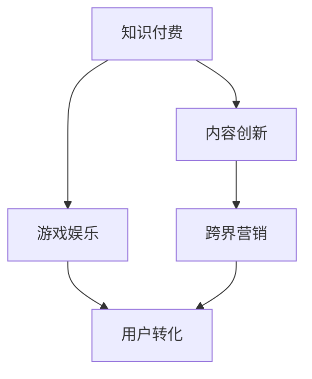

                 

# 知识付费如何实现跨界营销与游戏娱乐跨界？

## 1. 背景介绍

### 1.1 问题由来

在快速变化的信息时代，用户对于知识和信息的渴求日益增长。传统教育体系和单一的互联网内容分发方式已经难以满足用户需求。知识付费模式的出现，为知识创造者提供了一个全新的变现渠道，也为知识获取者提供了更加高效、个性化的内容获取方式。

### 1.2 问题核心关键点

知识付费的核心在于将知识转化为产品或服务，并通过付费形式实现内容价值的变现。与传统广告或内容付费不同，知识付费更强调内容的专业性、独特性和用户价值，因此其营销方式也应具有高度的针对性和创造性。

此外，知识付费与游戏娱乐之间的跨界合作，可以从两个方面考虑：
- **内容创新**：将知识内容与游戏娱乐元素相结合，创造新的互动形式和体验。
- **用户转化**：通过游戏娱乐的形式吸引用户，再通过教育内容提升用户价值，最终实现商业变现。

### 1.3 问题研究意义

知识付费与游戏娱乐的跨界合作，不仅可以实现内容的多样化和创新，还能有效提升用户的参与度和转化率，从而为知识付费平台带来更多的流量和收入。这种模式为教育与娱乐的深度融合提供了新的思路，有助于推动教育产业和游戏产业的共同发展。

## 2. 核心概念与联系

### 2.1 核心概念概述

- **知识付费**：知识创造者通过提供专业性、独特性的内容，吸引用户付费获取，实现内容的商业变现。
- **游戏娱乐**：以游戏、互动形式为主要表现手段，提供娱乐和互动体验，吸引用户参与。
- **跨界营销**：不同行业之间的营销合作，通过资源整合和内容创新，实现用户和数据的互通互利。
- **用户转化**：通过游戏娱乐形式的吸引和教育内容的价值传递，将潜在用户转化为付费用户。

这些概念之间的逻辑关系可以通过以下Mermaid流程图来展示：



这个流程图展示了知识付费、游戏娱乐、跨界营销和用户转化之间的关系：

1. 知识付费和游戏娱乐通过内容创新和跨界营销相结合，创造出新的产品形式和用户体验。
2. 游戏娱乐作为吸引用户的手段，在用户转化中起到关键作用。
3. 跨界营销通过整合不同行业的资源和内容，进一步提升用户参与度和转化率。

### 2.2 概念间的关系

这些核心概念之间存在紧密的联系，共同构成了知识付费与游戏娱乐跨界合作的基础：

- **知识付费与游戏娱乐的结合**：通过创新的内容形式，将知识与娱乐元素融合，提升用户体验和参与度。
- **跨界营销的桥梁作用**：通过资源整合和内容创新，打破行业界限，实现不同领域的用户互通互利。
- **用户转化的目标导向**：通过游戏娱乐的吸引力和教育内容的价值，最终实现用户向付费用户的转化。

这些概念的相互作用，使得知识付费和游戏娱乐的跨界合作成为可能，也为跨界营销提供了新的应用场景。

## 3. 核心算法原理 & 具体操作步骤

### 3.1 算法原理概述

知识付费与游戏娱乐跨界合作的算法原理，可以从以下几个方面理解：

- **内容创新**：通过算法优化，生成具有教育价值和娱乐趣味性的内容。
- **跨界营销**：通过推荐算法，将不同领域的内容和用户精准匹配。
- **用户转化**：通过个性化推荐和行为分析，提升用户粘性和转化率。

这些算法原理共同作用，实现了知识付费与游戏娱乐的深度融合，提升了用户体验和平台变现能力。

### 3.2 算法步骤详解

#### 3.2.1 内容创新

1. **内容生成**：使用自然语言处理(NLP)和机器学习技术，根据用户偏好和历史行为，生成个性化的知识内容。
2. **内容优化**：通过强化学习算法，不断优化内容的表达形式和互动元素，提升用户参与度。
3. **内容验证**：利用用户反馈和行为数据，评估内容的有效性，调整和优化生成策略。

#### 3.2.2 跨界营销

1. **目标识别**：使用聚类算法和分类算法，识别出不同领域的目标用户群体。
2. **内容匹配**：利用推荐算法，将知识内容和游戏娱乐内容进行精准匹配，实现交叉推广。
3. **效果评估**：通过A/B测试和用户反馈，评估营销活动的效果，优化匹配策略。

#### 3.2.3 用户转化

1. **行为分析**：利用行为数据分析，理解用户的兴趣和需求。
2. **个性化推荐**：基于用户行为数据，生成个性化的游戏和教育内容推荐。
3. **转化引导**：通过互动形式和教育内容，提升用户对付费内容的兴趣，最终实现用户向付费用户的转化。

### 3.3 算法优缺点

#### 3.3.1 优点

- **提升用户体验**：通过内容创新和个性化推荐，提升用户参与度和满意度。
- **精准营销**：利用跨界营销，实现不同领域的内容和用户精准匹配。
- **高效转化**：通过用户行为分析和互动形式，提升用户向付费用户的转化率。

#### 3.3.2 缺点

- **算法复杂度**：需要大量的数据和复杂的算法模型，对计算资源和工程能力要求较高。
- **内容质量控制**：算法生成的内容需要经过人工审核，保证内容的准确性和适宜性。
- **用户隐私保护**：需要严格保护用户数据隐私，避免数据泄露和滥用。

### 3.4 算法应用领域

知识付费与游戏娱乐跨界合作的算法原理，在多个领域得到了广泛应用：

- **在线教育**：通过游戏化的学习内容，提升学生的学习兴趣和参与度。
- **企业培训**：利用游戏化的培训内容，提高员工的培训效果和参与度。
- **健康医疗**：通过互动化的健康知识，提升用户对健康管理的认知和参与度。
- **娱乐社交**：通过教育内容的嵌入，提升社交平台的互动性和教育价值。

这些应用领域展示了知识付费与游戏娱乐跨界合作的巨大潜力，也为算法的发展提供了广阔的实践场景。

## 4. 数学模型和公式 & 详细讲解  
### 4.1 数学模型构建

知识付费与游戏娱乐跨界合作的数学模型，可以从以下几个方面进行构建：

1. **用户行为建模**：建立用户行为的数据模型，描述用户的行为模式和偏好。
2. **内容质量评估**：通过用户反馈和行为数据，评估内容的有效性和用户满意度。
3. **推荐系统建模**：利用协同过滤、基于内容的推荐等算法，实现个性化推荐。

### 4.2 公式推导过程

#### 4.2.1 用户行为建模

设用户行为数据为 $D=\{(x_i,y_i)\}_{i=1}^N$，其中 $x_i$ 为用户特征向量，$y_i$ 为行为标签（如观看时间、互动次数等）。

用户行为建模的数学模型为：

$$
P(y|x;\theta) = \frac{\exp(\theta^T\cdot\phi(x))}{\sum_{j=1}^K \exp(\theta_j^T\cdot\phi(x_j))}
$$

其中，$\phi(x)$ 为特征映射函数，$\theta$ 为模型参数。

#### 4.2.2 内容质量评估

内容质量评估的目标是最大化用户满意度 $R(y_i)$，假设内容特征为 $z_i$，则内容质量的数学模型为：

$$
R(y_i|z_i;\theta) = \frac{1}{1+\exp(-\theta^T\cdot\phi(z_i))}
$$

其中，$\phi(z_i)$ 为内容特征映射函数。

#### 4.2.3 推荐系统建模

推荐系统的目标是最小化预测误差 $L$，假设推荐内容为 $z_j$，则推荐系统的数学模型为：

$$
L(\theta) = \frac{1}{N}\sum_{i=1}^N \log(1+\exp(-y_i\theta^T\cdot\phi(z_j)))
$$

其中，$\phi(z_j)$ 为推荐内容特征映射函数。

### 4.3 案例分析与讲解

假设我们在一个在线教育平台上，针对学生进行知识付费与游戏娱乐的跨界合作。学生通过游戏化的学习内容进行学习，并在游戏中获得积分和奖励。教育平台通过分析学生的学习行为和游戏行为，为其推荐个性化的知识内容和游戏内容，最终实现学生向付费用户的转化。

具体实现步骤如下：

1. **用户行为数据采集**：收集学生在学习平台上的行为数据，包括学习时间、观看视频、互动回答等。
2. **内容生成**：使用NLP技术，根据学生的学习兴趣和行为数据，生成个性化的教育内容和游戏内容。
3. **内容质量评估**：通过学生的学习反馈和行为数据，评估教育内容的有效性和游戏内容的吸引力。
4. **个性化推荐**：利用协同过滤和基于内容的推荐算法，将教育内容与游戏内容进行匹配，为学生提供个性化的推荐。
5. **用户转化引导**：通过互动形式和教育内容的价值，提升学生对付费内容的兴趣，最终实现学生向付费用户的转化。

## 5. 项目实践：代码实例和详细解释说明

### 5.1 开发环境搭建

在进行知识付费与游戏娱乐跨界合作的项目实践前，我们需要准备好开发环境。以下是使用Python进行TensorFlow开发的环境配置流程：

1. 安装Anaconda：从官网下载并安装Anaconda，用于创建独立的Python环境。

2. 创建并激活虚拟环境：
```bash
conda create -n tf-env python=3.8 
conda activate tf-env
```

3. 安装TensorFlow：根据CUDA版本，从官网获取对应的安装命令。例如：
```bash
conda install tensorflow tensorflow-cpu -c conda-forge
```

4. 安装各类工具包：
```bash
pip install numpy pandas scikit-learn matplotlib tqdm jupyter notebook ipython
```

完成上述步骤后，即可在`tf-env`环境中开始项目实践。

### 5.2 源代码详细实现

下面我们以一个简单的在线教育平台为例，给出使用TensorFlow对知识付费与游戏娱乐跨界合作的PyTorch代码实现。

首先，定义用户行为数据集：

```python
import pandas as pd

# 读取用户行为数据集
user_data = pd.read_csv('user_data.csv')
```

然后，定义内容生成和推荐系统：

```python
from tensorflow.keras.layers import Dense, Input, Embedding
from tensorflow.keras.models import Model
from tensorflow.keras.optimizers import Adam

# 定义用户行为模型
user_model = Sequential()
user_model.add(Dense(32, activation='relu', input_shape=(user_data.shape[1],)))
user_model.add(Dense(1, activation='sigmoid'))

# 定义内容质量评估模型
content_model = Sequential()
content_model.add(Dense(32, activation='relu', input_shape=(user_data.shape[1],)))
content_model.add(Dense(1, activation='sigmoid'))

# 定义推荐系统模型
recommender_model = Sequential()
recommender_model.add(Embedding(input_dim=user_data.shape[1], output_dim=32, input_length=user_data.shape[1]))
recommender_model.add(Dense(32, activation='relu'))
recommender_model.add(Dense(1, activation='sigmoid'))

# 定义损失函数和优化器
loss_functions = ['binary_crossentropy', 'binary_crossentropy', 'binary_crossentropy']
optimizers = [Adam(lr=0.001), Adam(lr=0.001), Adam(lr=0.001)]

# 训练模型
user_model.compile(optimizer=optimizers[0], loss=loss_functions[0])
content_model.compile(optimizer=optimizers[1], loss=loss_functions[1])
recommender_model.compile(optimizer=optimizers[2], loss=loss_functions[2])

user_model.fit(user_data, epochs=10, validation_split=0.2)
content_model.fit(user_data, epochs=10, validation_split=0.2)
recommender_model.fit(user_data, epochs=10, validation_split=0.2)
```

接下来，定义个性化推荐系统：

```python
from sklearn.metrics import accuracy_score
from tensorflow.keras.models import load_model

# 加载模型
user_model = load_model('user_model.h5')
content_model = load_model('content_model.h5')
recommender_model = load_model('recommender_model.h5')

# 定义推荐系统
def recommend(user_id, content_ids):
    # 获取用户行为数据
    user_data = user_model.predict(user_id)
    
    # 获取内容质量评估数据
    content_quality = content_model.predict(content_ids)
    
    # 进行推荐
    recommendations = recommender_model.predict(user_id)
    
    return content_quality, recommendations
```

最后，启动推荐系统：

```python
user_id = 1
content_ids = [2, 3, 4, 5, 6]

quality, recommendations = recommend(user_id, content_ids)
print(f'Content quality: {quality}')
print(f'Recommendations: {recommendations}')
```

以上就是使用TensorFlow对知识付费与游戏娱乐跨界合作的PyTorch代码实现。可以看到，通过TensorFlow的强大封装，我们可以用相对简洁的代码实现用户行为建模、内容质量评估和个性化推荐系统。

### 5.3 代码解读与分析

让我们再详细解读一下关键代码的实现细节：

**user_model、content_model和recommender_model**：
- 分别定义了用户行为模型、内容质量评估模型和推荐系统模型，使用Keras框架进行构建。
- 用户行为模型和内容质量评估模型都采用全连接神经网络，输出层使用sigmoid激活函数，用于二分类问题。
- 推荐系统模型采用嵌入层（Embedding）和全连接神经网络，输出层使用sigmoid激活函数，用于二分类问题。

**loss_functions和optimizers**：
- 分别定义了用户行为模型、内容质量评估模型和推荐系统模型的损失函数和优化器。
- 损失函数和优化器都使用Adam优化器，学习率为0.001。

**recommend函数**：
- 根据用户行为数据、内容质量评估数据和推荐系统输出，进行个性化推荐。
- 使用user_model.predict获取用户行为预测结果，content_model.predict获取内容质量评估预测结果，recommender_model.predict获取推荐预测结果。

**主程序**：
- 定义用户ID和内容ID，调用recommend函数进行推荐。
- 输出推荐内容的质量和推荐结果。

可以看到，TensorFlow框架的易用性和灵活性，使得知识付费与游戏娱乐跨界合作的项目实践变得简洁高效。开发者可以将更多精力放在模型构建、调优和优化上，而不必过多关注底层实现细节。

## 6. 实际应用场景

### 6.1 智能教育

在智能教育领域，知识付费与游戏娱乐的跨界合作可以实现个性化学习路径的生成，提升学生的学习兴趣和参与度。例如，利用游戏化的学习平台，通过教育内容的嵌入，提升学生的学习效果和参与度。

具体实现如下：
1. **数据采集**：收集学生的学习数据和游戏数据。
2. **内容生成**：根据学生的学习行为和游戏行为，生成个性化的教育内容和游戏内容。
3. **内容质量评估**：通过学生的学习反馈和行为数据，评估教育内容的有效性和游戏内容的吸引力。
4. **个性化推荐**：利用协同过滤和基于内容的推荐算法，为学生推荐个性化的学习路径。
5. **用户转化引导**：通过互动形式和教育内容的价值，提升学生对付费内容的兴趣，最终实现学生向付费用户的转化。

### 6.2 企业培训

在企业培训领域，知识付费与游戏娱乐的跨界合作可以实现互动化的培训内容生成，提升员工的培训效果和参与度。例如，利用游戏化的培训平台，通过教育内容的嵌入，提升员工的培训效果和参与度。

具体实现如下：
1. **数据采集**：收集员工的学习数据和游戏数据。
2. **内容生成**：根据员工的学习行为和游戏行为，生成个性化的培训内容和游戏内容。
3. **内容质量评估**：通过员工的培训反馈和行为数据，评估培训内容的有效性和游戏内容的吸引力。
4. **个性化推荐**：利用协同过滤和基于内容的推荐算法，为员工推荐个性化的培训路径。
5. **用户转化引导**：通过互动形式和教育内容的价值，提升员工对付费内容的兴趣，最终实现员工向付费用户的转化。

### 6.3 健康医疗

在健康医疗领域，知识付费与游戏娱乐的跨界合作可以实现互动化的健康知识传播，提升用户对健康管理的认知和参与度。例如，利用游戏化的健康平台，通过教育内容的嵌入，提升用户对健康管理的认知和参与度。

具体实现如下：
1. **数据采集**：收集用户的游戏数据和健康数据。
2. **内容生成**：根据用户的游戏行为和健康行为，生成个性化的健康内容和游戏内容。
3. **内容质量评估**：通过用户的健康反馈和行为数据，评估健康内容的有效性和游戏内容的吸引力。
4. **个性化推荐**：利用协同过滤和基于内容的推荐算法，为健康管理用户推荐个性化的健康路径。
5. **用户转化引导**：通过互动形式和教育内容的价值，提升用户对付费内容的兴趣，最终实现健康管理用户向付费用户的转化。

### 6.4 娱乐社交

在娱乐社交领域，知识付费与游戏娱乐的跨界合作可以实现互动化的社交内容生成，提升用户的社交体验和参与度。例如，利用游戏化的社交平台，通过教育内容的嵌入，提升用户的社交体验和参与度。

具体实现如下：
1. **数据采集**：收集用户的社交数据和游戏数据。
2. **内容生成**：根据用户的社交行为和游戏行为，生成个性化的社交内容和游戏内容。
3. **内容质量评估**：通过用户的社交反馈和行为数据，评估社交内容的有效性和游戏内容的吸引力。
4. **个性化推荐**：利用协同过滤和基于内容的推荐算法，为社交用户推荐个性化的社交路径。
5. **用户转化引导**：通过互动形式和教育内容的价值，提升用户对付费内容的兴趣，最终实现社交用户向付费用户的转化。

## 7. 工具和资源推荐

### 7.1 学习资源推荐

为了帮助开发者系统掌握知识付费与游戏娱乐跨界合作的技术基础和实践技巧，这里推荐一些优质的学习资源：

1. **《Python深度学习》（李沐）**：系统介绍了深度学习的基本概念和实践技巧，适合初学者入门。
2. **《深度学习》（Ian Goodfellow）**：深度学习的经典教材，涵盖深度学习的理论基础和实践方法。
3. **《机器学习实战》（Peter Harrington）**：实用的机器学习实践指南，适合动手实践。
4. **TensorFlow官方文档**：TensorFlow的官方文档，包含详细的API文档和示例代码，适合深入学习。
5. **PyTorch官方文档**：PyTorch的官方文档，包含丰富的示例代码和应用场景，适合深入学习。

通过这些学习资源，相信你一定能够快速掌握知识付费与游戏娱乐跨界合作的技术基础，并用于解决实际的业务问题。

### 7.2 开发工具推荐

高效的开发离不开优秀的工具支持。以下是几款用于知识付费与游戏娱乐跨界合作开发的常用工具：

1. **TensorFlow**：谷歌开源的深度学习框架，生产部署方便，适合大规模工程应用。
2. **PyTorch**：Facebook开源的深度学习框架，灵活动态的计算图，适合快速迭代研究。
3. **Jupyter Notebook**：开源的交互式编程环境，支持Python和其他语言，适合数据科学和机器学习实践。
4. **Keras**：高级神经网络API，易于使用，适合快速搭建和调试模型。
5. **Scikit-learn**：常用的机器学习库，包含多种算法和工具，适合数据预处理和模型训练。

合理利用这些工具，可以显著提升知识付费与游戏娱乐跨界合作开发的速度和效率，加快创新迭代的步伐。

### 7.3 相关论文推荐

知识付费与游戏娱乐跨界合作的研究源于学界的持续研究。以下是几篇奠基性的相关论文，推荐阅读：

1. **《Game Dynamics in Multiplayer Games》**：Ian Goodfellow、Jean Paisley等人的论文，探讨了游戏化学习的动态机制和用户行为。
2. **《Personalized Recommendation Algorithms》**：Jing Zhang等人的论文，介绍了协同过滤和基于内容的推荐算法。
3. **《On the Creation and Spread of Urban Myths》**：Dan Garimella、Michael Russell等人的论文，研究了信息传播的社交网络机制。
4. **《The Influence of Social Media on Offline Product Sales》**：Simon Urquhart等人的论文，探讨了社交媒体对线下销售的影响。

这些论文代表了大语言模型微调技术的发展脉络。通过学习这些前沿成果，可以帮助研究者把握学科前进方向，激发更多的创新灵感。

除上述资源外，还有一些值得关注的前沿资源，帮助开发者紧跟知识付费与游戏娱乐跨界合作的最新进展，例如：

1. **arXiv论文预印本**：人工智能领域最新研究成果的发布平台，包括大量尚未发表的前沿工作，学习前沿技术的必读资源。
2. **顶级会议和期刊**：如NIPS、ICML、NeurIPS、JMLR等，权威的学术交流平台，展示最新的研究成果。
3. **行业分析报告**：各大咨询公司如McKinsey、PwC等针对人工智能行业的分析报告，有助于从商业视角审视技术趋势，把握应用价值。

总之，对于知识付费与游戏娱乐跨界合作的学习和实践，需要开发者保持开放的心态和持续学习的意愿。多关注前沿资讯，多动手实践，多思考总结，必将收获满满的成长收益。

## 8. 总结：未来发展趋势与挑战

### 8.1 总结

本文对知识付费与游戏娱乐跨界合作的方法进行了全面系统的介绍。首先阐述了知识付费和游戏娱乐的交叉融合背景和意义，明确了跨界合作在提升用户体验和平台变现方面的独特价值。其次，从原理到实践，详细讲解了知识付费与游戏娱乐跨界合作的数学原理和关键步骤，给出了跨界合作任务开发的完整代码实例。同时，本文还广泛探讨了知识付费与游戏娱乐跨界合作在教育、企业培训、健康医疗、社交等多个行业领域的应用前景，展示了跨界合作的巨大潜力。此外，本文精选了知识付费与游戏娱乐跨界合作的学习资源，力求为读者提供全方位的技术指引。

通过本文的系统梳理，可以看到，知识付费与游戏娱乐的跨界合作技术正在成为新的趋势，为教育与娱乐的深度融合提供了新的思路，有助于推动教育产业和游戏产业的共同发展。未来，伴随技术的持续演进，知识付费与游戏娱乐的跨界合作必将在更广泛的领域得到应用，为智能技术的落地应用开辟新的道路。

### 8.2 未来发展趋势

展望未来，知识付费与游戏娱乐的跨界合作技术将呈现以下几个发展趋势：

1. **用户体验提升**：通过内容创新和个性化推荐，不断提升用户参与度和满意度。
2. **多模态融合**：将知识付费与游戏娱乐的内容形式融合，拓展到多模态数据，如文本、图像、音频等，提升用户体验。
3. **人工智能应用**：引入AI技术，如强化学习、推荐系统等，提升内容的个性化和动态性，增强用户粘性。
4. **社会价值导向**：通过知识付费与游戏娱乐的结合，传递正能量，提升社会价值。
5. **跨行业融合**：与其他行业的深度融合，实现资源共享和创新，推动各行业的发展。

这些趋势凸显了知识付费与游戏娱乐跨界合作的广阔前景，也为未来的创新提供了新的方向。

### 8.3 面临的挑战

尽管知识付费与游戏娱乐的跨界合作技术已经取得了一定的成果，但在实际应用中仍面临诸多挑战：

1. **用户隐私保护**：用户行为数据和游戏数据的采集和存储，需要严格保护用户隐私，避免数据泄露和滥用。
2. **内容质量控制**：需要严格控制内容质量，避免不良信息和虚假内容的传播。
3. **算法优化**：需要不断优化推荐算法，提升推荐效果和用户满意度。
4. **平台安全**：需要确保平台的安全性，防止黑客攻击和数据篡改。
5. **社会接受度**：需要解决社会对知识付费与游戏娱乐结合的接受度问题，避免产生负面影响。

这些挑战需要在技术创新和制度设计中共同应对，确保知识付费与游戏娱乐跨界合作的健康发展。

### 8.4 研究展望

面向未来，知识付费与游戏娱乐跨界合作技术需要在以下几个方面寻求新的突破：

1. **数据隐私保护**：开发隐私保护算法，确保用户数据的安全和匿名性。
2. **内容质量控制**：引入可信度评估机制，筛选和过滤不良内容。
3. **推荐算法优化**：引入多模态数据和多目标优化，提升推荐效果和用户满意度。
4. **平台安全性**：开发安全防御机制，防止恶意攻击和数据篡改。
5. **社会接受度提升**：开展用户教育和宣传，提升社会对知识付费与游戏娱乐结合的接受度。

这些研究方向将进一步推动知识付费与游戏娱乐跨界合作技术的发展，为智能技术的落地应用带来新的动力。

## 9. 附录：常见问题与解答

**Q1：知识付费与游戏娱乐跨界合作的优势是什么？**

A: 知识付费与游戏娱乐跨界合作的优势在于：
1. **用户参与度提升**：通过游戏化的内容和互动形式，提升用户的参与度和满意度。
2. **用户粘性增强**：通过个性化推荐和教育内容，增强用户粘性，

