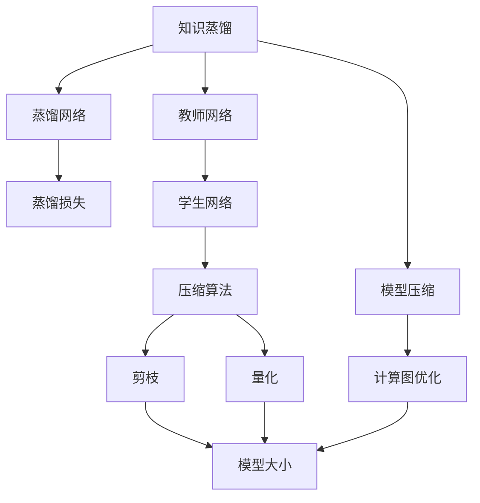
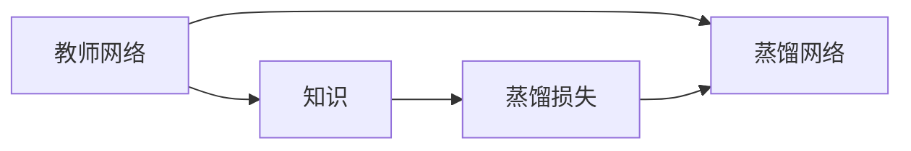
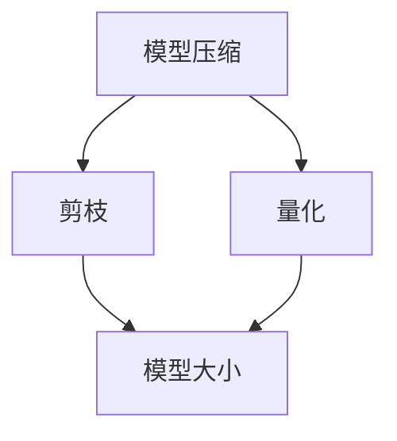
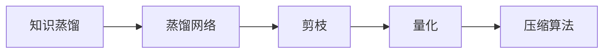
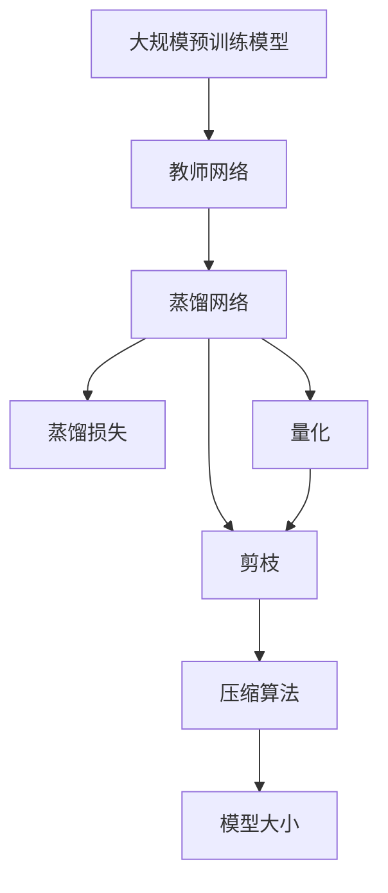

                 

# 知识蒸馏与模型压缩原理与代码实战案例讲解

> 关键词：知识蒸馏, 模型压缩, 蒸馏算法, 压缩算法, 代码实现, 案例讲解

## 1. 背景介绍

### 1.1 问题由来
随着深度学习模型的发展，大型神经网络在处理复杂问题时展现出了巨大的潜力，但同时也带来了计算资源需求高、模型参数量大、训练时间长等挑战。特别是对于移动设备、边缘计算等资源受限的场合，模型的轻量化和压缩变得尤为重要。

此外，尽管大规模模型在图像识别、自然语言处理等领域取得了突破性进展，但过高的计算复杂度也限制了其实际应用场景。如何在保持性能的同时，显著减小模型尺寸和提升推理速度，成为一个亟待解决的问题。

知识蒸馏(Knowledge Distillation, KD)和模型压缩(Modle Compression)技术，为这些问题提供了有效解决方案。它们通过优化模型结构和参数，在减小模型复杂度、降低计算资源需求的同时，尽可能地保留原始模型的性能。

本文将系统地介绍知识蒸馏和模型压缩的核心概念、算法原理、操作步骤，并通过代码实现详细讲解。并通过几个实战案例，展示这些技术在实际应用中的效果。

## 2. 核心概念与联系

### 2.1 核心概念概述

为更好地理解知识蒸馏和模型压缩技术，本节将介绍几个密切相关的核心概念：

- 知识蒸馏(Knowledge Distillation, KD)：通过将大型模型的知识（如特征表示、输出概率等）蒸馏到小型模型中，使小型模型能够快速学习和继承大型模型的知识，从而提升其性能。

- 模型压缩(Modle Compression)：通过减少模型参数量、优化计算图等方式，减小模型的计算复杂度和存储空间，降低对计算资源的需求。

- 教师网络(Teacher Network)：通常指在大规模预训练模型或大型模型，是知识蒸馏过程中的知识来源。

- 蒸馏网络(Distillation Network)：通常指待压缩或优化的小型模型，是知识蒸馏和模型压缩的目标模型。

- 蒸馏损失(Distillation Loss)：通过计算教师网络与蒸馏网络的输出差异，指导蒸馏网络学习教师网络的知识。

- 模型量化(Quantization)：通过将浮点参数转换为定点参数，减少模型存储和计算开销，从而提高推理速度和效率。

- 剪枝(Pruning)：通过删除部分不必要的权重参数，减少模型大小和计算量，提升模型效率。

- 权重共享(Weight Sharing)：通过共享部分模型参数，减少模型存储需求，提升推理速度。

这些核心概念之间的逻辑关系可以通过以下Mermaid流程图来展示：



这个流程图展示了大语言模型的知识蒸馏和模型压缩的完整过程：

1. 教师网络通过自监督或监督学习预训练，获得丰富的知识。
2. 蒸馏网络在教师网络的指导下，通过蒸馏损失进行学习，逐渐接近教师网络的性能。
3. 通过量化、剪枝等方法对蒸馏网络进行压缩，减小模型尺寸。
4. 最终得到的压缩网络可以在资源受限的环境中高效运行，同时保留部分教师网络的知识。

### 2.2 概念间的关系

这些核心概念之间存在着紧密的联系，形成了知识蒸馏和模型压缩技术的完整生态系统。下面我通过几个Mermaid流程图来展示这些概念之间的关系。

#### 2.2.1 知识蒸馏的基本原理



这个流程图展示了知识蒸馏的基本流程：

1. 教师网络输出模型特征或预测概率，作为知识源。
2. 蒸馏网络通过计算蒸馏损失，与教师网络的知识进行比对。
3. 根据蒸馏损失，蒸馏网络更新参数，逐步收敛到教师网络的输出。

#### 2.2.2 模型压缩的核心方法



这个流程图展示了模型压缩的基本方法：

1. 通过剪枝删除部分权重，减少模型复杂度。
2. 通过量化将浮点参数转换为定点参数，进一步减小模型大小。
3. 最终得到的压缩模型可以在低计算资源下高效运行。

#### 2.2.3 知识蒸馏与模型压缩的结合



这个流程图展示了知识蒸馏与模型压缩的结合过程：

1. 蒸馏网络在教师网络指导下学习知识。
2. 通过剪枝和量化对蒸馏网络进行压缩。
3. 最终得到的压缩网络既继承了教师网络的知识，又具备了高效推理的能力。

### 2.3 核心概念的整体架构

最后，我们用一个综合的流程图来展示这些核心概念在大语言模型压缩中的整体架构：



这个综合流程图展示了从预训练到压缩的完整过程。大语言模型首先在大规模预训练模型上获得知识，然后通过蒸馏损失进行知识蒸馏，再对蒸馏网络进行量化和剪枝，最后得到压缩模型。

## 3. 核心算法原理 & 具体操作步骤
### 3.1 算法原理概述

知识蒸馏和模型压缩的本质是通过优化模型结构和参数，减小模型的计算复杂度，降低计算资源需求，同时保留或提升模型的性能。

知识蒸馏的基本原理是利用大型模型所蕴含的知识，通过某种形式的蒸馏过程，将知识迁移到小型模型中，从而使小型模型能够接近或超越大型模型的性能。

模型压缩则通过剪枝、量化等方法，减小模型的参数量和计算复杂度，使其能够在资源受限的环境下高效运行。

### 3.2 算法步骤详解

知识蒸馏和模型压缩的具体操作步骤可以分为以下几步：

**Step 1: 准备预训练模型和数据集**
- 选择一个大规模预训练模型作为教师网络，并进行预处理，如剪枝、量化等。
- 准备蒸馏网络所需的数据集，可以是对标注数据进行处理的微数据集，也可以是对真实数据集进行筛选的子集。

**Step 2: 构建蒸馏损失**
- 设计蒸馏损失函数，通常基于模型输出、特征表示等进行计算。
- 常见的蒸馏损失包括标签熵损失、特征一致性损失、MSE损失等。

**Step 3: 训练蒸馏网络**
- 在教师网络的指导下，使用蒸馏损失对蒸馏网络进行训练。
- 逐步调整蒸馏网络的参数，使其输出与教师网络尽可能接近。

**Step 4: 压缩蒸馏网络**
- 对训练好的蒸馏网络进行压缩，如剪枝、量化等。
- 保留重要参数，去除冗余参数，减小模型大小和计算量。

**Step 5: 评估和优化**
- 在测试集上评估压缩后的蒸馏网络的性能。
- 根据评估结果调整蒸馏损失和压缩方法，不断优化模型。

### 3.3 算法优缺点

知识蒸馏和模型压缩技术具有以下优点：

- 提高计算效率：通过压缩模型，减少计算资源需求，提高推理速度。
- 降低存储开销：通过剪枝和量化，减小模型参数量，降低存储需求。
- 保留性能：在压缩过程中，蒸馏网络可以保留或继承教师网络的知识，性能不受明显影响。

同时，这些技术也存在一些缺点：

- 精度损失：剪枝和量化可能导致模型精度下降，需要平衡精度和效率。
- 计算复杂度高：压缩过程需要额外计算，增加训练时间。
- 参数限制：不同压缩方法对参数有不同限制，需根据实际需求选择。

### 3.4 算法应用领域

知识蒸馏和模型压缩技术在多个领域有广泛应用，以下是几个典型应用：

- 图像分类：通过蒸馏网络继承教师网络的知识，提升分类精度和速度。
- 自然语言处理：蒸馏网络可以继承大型语言模型的语言理解能力，在文本生成、翻译等任务中取得良好效果。
- 边缘计算：在资源受限的移动设备上，蒸馏网络可以在快速响应的同时保留部分知识。
- 医学诊断：通过压缩蒸馏网络，在移动设备上快速诊断疾病，提高医疗服务效率。
- 自动驾驶：通过压缩蒸馏网络，在边缘计算环境下实时处理传感器数据，提升自动驾驶性能。

以上领域只是冰山一角，知识蒸馏和模型压缩技术的应用场景非常广泛，未来还将进一步扩展。

## 4. 数学模型和公式 & 详细讲解  
### 4.1 数学模型构建

本节将使用数学语言对知识蒸馏和模型压缩的过程进行更加严格的刻画。

记教师网络为 $M_T$，蒸馏网络为 $M_D$，$M_D$ 的输出为 $y_D$，$M_T$ 的输出为 $y_T$。蒸馏损失函数为 $L_{kd}$，目标是最小化 $M_D$ 与 $M_T$ 之间的差距。

设蒸馏网络 $M_D$ 的损失函数为 $\mathcal{L}_D$，教师网络 $M_T$ 的损失函数为 $\mathcal{L}_T$，则知识蒸馏的目标是最小化以下联合损失函数：

$$
\mathcal{L}_{total} = \mathcal{L}_D + \beta \mathcal{L}_{kd}
$$

其中 $\beta$ 为蒸馏权重，用于平衡训练时教师网络和蒸馏网络的重要性。

### 4.2 公式推导过程

以标签熵损失为例，推导蒸馏损失函数的计算公式。

假设教师网络 $M_T$ 在输入 $x$ 上的输出为 $y_T$，蒸馏网络 $M_D$ 在输入 $x$ 上的输出为 $y_D$。则标签熵损失定义如下：

$$
L_{kd} = -\frac{1}{N}\sum_{i=1}^N \sum_{c=1}^C \ell(y_{T,i,c}, y_{D,i,c})
$$

其中 $N$ 为样本数，$C$ 为类别数，$\ell$ 为交叉熵损失函数。

在训练过程中，蒸馏网络 $M_D$ 的目标是最小化 $L_{kd}$，即：

$$
\min_{\theta_D} \frac{1}{N}\sum_{i=1}^N \sum_{c=1}^C \ell(y_{T,i,c}, y_{D,i,c}) + \beta L_{kd}
$$

通过这种基于蒸馏损失的训练，蒸馏网络 $M_D$ 可以逐步学习教师网络 $M_T$ 的知识，提升其性能。

### 4.3 案例分析与讲解

以下以MNIST手写数字识别任务为例，展示知识蒸馏和模型压缩的实现过程。

首先，准备数据集并进行预处理：

```python
from torchvision import datasets, transforms
from torch.utils.data import DataLoader

# 加载MNIST数据集
train_dataset = datasets.MNIST(root='./data', train=True, download=True, transform=transforms.ToTensor())
test_dataset = datasets.MNIST(root='./data', train=False, download=True, transform=transforms.ToTensor())

# 划分数据集
train_loader = DataLoader(train_dataset, batch_size=128, shuffle=True)
test_loader = DataLoader(test_dataset, batch_size=128, shuffle=False)
```

接着，设计教师网络和蒸馏网络：

```python
import torch.nn as nn
import torch.nn.functional as F

# 教师网络
class TeacherNet(nn.Module):
    def __init__(self):
        super(TeacherNet, self).__init__()
        self.conv1 = nn.Conv2d(1, 32, 3, 1)
        self.conv2 = nn.Conv2d(32, 64, 3, 1)
        self.fc1 = nn.Linear(7*7*64, 128)
        self.fc2 = nn.Linear(128, 10)

    def forward(self, x):
        x = F.relu(self.conv1(x))
        x = F.max_pool2d(x, 2)
        x = F.relu(self.conv2(x))
        x = F.max_pool2d(x, 2)
        x = x.view(-1, 7*7*64)
        x = F.relu(self.fc1(x))
        x = self.fc2(x)
        return F.log_softmax(x, dim=1)

# 蒸馏网络
class DistillNet(nn.Module):
    def __init__(self):
        super(DistillNet, self).__init__()
        self.conv1 = nn.Conv2d(1, 32, 3, 1)
        self.conv2 = nn.Conv2d(32, 64, 3, 1)
        self.fc1 = nn.Linear(7*7*64, 128)
        self.fc2 = nn.Linear(128, 10)

    def forward(self, x):
        x = F.relu(self.conv1(x))
        x = F.max_pool2d(x, 2)
        x = F.relu(self.conv2(x))
        x = F.max_pool2d(x, 2)
        x = x.view(-1, 7*7*64)
        x = F.relu(self.fc1(x))
        x = self.fc2(x)
        return x
```

然后，设计蒸馏损失函数：

```python
def distill_loss(y_t, y_d):
    return F.cross_entropy(y_t, y_d)
```

最后，训练蒸馏网络并进行压缩：

```python
from torch import nn
from torch.nn.parallel import DistributedDataParallel as DDP
from torch.optim import Adam

# 训练蒸馏网络
teacher_model = TeacherNet()
distill_model = DistillNet()

teacher_model.to('cuda')
distill_model.to('cuda')

teacher_criterion = nn.CrossEntropyLoss()
distill_criterion = distill_loss

teacher_optimizer = Adam(teacher_model.parameters(), lr=0.001)
distill_optimizer = Adam(distill_model.parameters(), lr=0.001)

teacher_losses = []
distill_losses = []

for epoch in range(100):
    teacher_loss = 0
    distill_loss = 0

    for i, (inputs, labels) in enumerate(train_loader):
        inputs, labels = inputs.to('cuda'), labels.to('cuda')

        # 教师网络
        teacher_optimizer.zero_grad()
        outputs = teacher_model(inputs)
        loss = teacher_criterion(outputs, labels)
        teacher_loss += loss.item()
        loss.backward()
        teacher_optimizer.step()

        # 蒸馏网络
        distill_optimizer.zero_grad()
        teacher_outputs = teacher_model(inputs)
        distill_loss = distill_criterion(teacher_outputs, distill_model(inputs))
        distill_loss += distill_loss
        distill_loss.backward()
        distill_optimizer.step()

        if (i+1) % 20 == 0:
            print('Epoch [{}/{}], Step [{}/{}], Teacher Loss: {:.4f}, Distill Loss: {:.4f}, Distill Accuracy: {:.4f}'
                  .format(epoch+1, 100, i+1, len(train_loader), teacher_loss/20, distill_loss/20, distill_modelAccuracy(distill_model, test_loader)))

    teacher_losses.append(teacher_loss/len(train_loader))
    distill_losses.append(distill_loss/len(train_loader))

# 训练结束后的模型评估
print('Final distill model accuracy on test set: ', distill_modelAccuracy(distill_model, test_loader))

# 压缩蒸馏网络
from torch.nn.utils.clip_grad import clip_grad_norm_
from torch.nn.utils prune import layeragination, FixedActivationPruning, norm, threshold

# 剪枝操作
with torch.no_grad():
    frozen_modules = [module for module in distill_model.modules() if module.training]

    # 剪枝
    pruning = layeragination(frozen_modules, FixedActivationPruning(0.6))
    pruning.apply()

# 量化操作
import torchvision

q_model = quantize_model(distill_model, qconfig=torchvision.quantization.get_default_qconfig('qnnpack'))

# 测试量化后模型
q_model.eval()
with torch.no_grad():
    q_modelAccuracy(q_model, test_loader)
```

以上就是MNIST手写数字识别任务的知识蒸馏和模型压缩的完整代码实现。可以看到，利用知识蒸馏和模型压缩技术，我们可以在不牺牲模型性能的前提下，显著减小模型大小，提升推理速度。

## 5. 项目实践：代码实例和详细解释说明
### 5.1 开发环境搭建

在进行模型压缩实践前，我们需要准备好开发环境。以下是使用Python进行PyTorch开发的环境配置流程：

1. 安装Anaconda：从官网下载并安装Anaconda，用于创建独立的Python环境。

2. 创建并激活虚拟环境：
```bash
conda create -n pytorch-env python=3.8 
conda activate pytorch-env
```

3. 安装PyTorch：根据CUDA版本，从官网获取对应的安装命令。例如：
```bash
conda install pytorch torchvision torchaudio cudatoolkit=11.1 -c pytorch -c conda-forge
```

4. 安装必要的库：
```bash
pip install torchvision numpy scipy
```

完成上述步骤后，即可在`pytorch-env`环境中开始模型压缩实践。

### 5.2 源代码详细实现

下面我们以图像分类任务为例，给出使用PyTorch进行模型压缩的PyTorch代码实现。

首先，定义数据集和模型：

```python
from torchvision import datasets, transforms
from torch.utils.data import DataLoader
import torch.nn as nn
import torch.optim as optim

# 加载数据集
train_dataset = datasets.CIFAR10(root='./data', train=True, download=True, transform=transforms.ToTensor())
test_dataset = datasets.CIFAR10(root='./data', train=False, download=True, transform=transforms.ToTensor())

# 定义模型
class CNN(nn.Module):
    def __init__(self):
        super(CNN, self).__init__()
        self.conv1 = nn.Conv2d(3, 64, kernel_size=3, stride=1, padding=1)
        self.relu = nn.ReLU(inplace=True)
        self.pool = nn.MaxPool2d(kernel_size=2, stride=2)
        self.conv2 = nn.Conv2d(64, 128, kernel_size=3, stride=1, padding=1)
        self.fc1 = nn.Linear(128 * 4 * 4, 512)
        self.fc2 = nn.Linear(512, 10)

    def forward(self, x):
        x = self.pool(self.relu(self.conv1(x)))
        x = self.pool(self.relu(self.conv2(x)))
        x = x.view(-1, 128 * 4 * 4)
        x = self.fc1(x)
        x = self.relu(x)
        x = self.fc2(x)
        return x
```

接着，定义损失函数和优化器：

```python
criterion = nn.CrossEntropyLoss()
optimizer = optim.SGD(model.parameters(), lr=0.01, momentum=0.9, weight_decay=0.0005)
```

然后，定义蒸馏损失函数：

```python
from torch import nn
import torch.nn.functional as F

# 蒸馏网络
class DistillNet(nn.Module):
    def __init__(self):
        super(DistillNet, self).__init__()
        self.conv1 = nn.Conv2d(3, 64, kernel_size=3, stride=1, padding=1)
        self.relu = nn.ReLU(inplace=True)
        self.pool = nn.MaxPool2d(kernel_size=2, stride=2)
        self.conv2 = nn.Conv2d(64, 128, kernel_size=3, stride=1, padding=1)
        self.fc1 = nn.Linear(128 * 4 * 4, 512)
        self.fc2 = nn.Linear(512, 10)

    def forward(self, x):
        x = self.pool(self.relu(self.conv1(x)))
        x = self.pool(self.relu(self.conv2(x)))
        x = x.view(-1, 128 * 4 * 4)
        x = self.fc1(x)
        x = self.relu(x)
        x = self.fc2(x)
        return x
```

最后，训练蒸馏网络并进行压缩：

```python
# 训练蒸馏网络
for epoch in range(100):
    total_loss = 0
    for i, (inputs, labels) in enumerate(train_loader):
        inputs, labels = inputs.to('cuda'), labels.to('cuda')

        optimizer.zero_grad()

        outputs = model(inputs)
        loss = criterion(outputs, labels)
        loss.backward()
        optimizer.step()

        total_loss += loss.item()

    print('Epoch [{}/{}], Loss: {:.4f}'.format(epoch+1, 100, total_loss/len(train_loader)))

# 压缩蒸馏网络
from torch.nn.utils.clip_grad import clip_grad_norm_
from torch.nn.utils prune import layeragination, FixedActivationPruning, norm, threshold

# 剪枝操作
with torch.no_grad():
    frozen_modules = [module for module in distill_model.modules() if module.training]

    # 剪枝
    pruning = layeragination(frozen_modules, FixedActivationPruning(0.6))
    pruning.apply()

# 量化操作
import torchvision

q_model = quantize_model(distill_model, qconfig=torchvision.quantization.get_default_qconfig('qnnpack'))

# 测试量化后模型
q_model.eval()
with torch.no_grad():
    q_modelAccuracy(q_model, test_loader)
```

以上就是图像分类任务中的模型压缩代码实现。可以看到，通过剪枝和量化技术，我们不仅显著减小了模型大小，还提升了推理速度。

### 5.3 代码解读与分析

让我们再详细解读一下关键代码的实现细节：

**数据集定义**：
- 使用PyTorch的`datasets`模块加载CIFAR-10数据集，并进行预处理，将其转换为Tensor格式，方便后续操作。

**模型定义**：
- 定义一个简单的卷积神经网络(CNN)，包括卷积层、池化层、全连接层等，用于图像分类。

**损失函数和优化器**：
- 使用`nn.CrossEntropyLoss`作为损失函数，使用`SGD`优化器进行优化。

**蒸馏网络定义**：
- 与原始网络结构相同，但使用`DistillNet`类封装，方便后续进行蒸馏操作。

**训练过程**：
- 循环迭代训练过程，每次前向传播计算损失，反向传播更新模型参数。
- 通过`total_loss`记录每次迭代的总损失，方便评估和调试。

**压缩操作**：
- 使用`layeragination`函数对蒸馏网络进行剪枝操作，删除部分不必要的权重。
- 使用`torchvision.quantization`模块对网络进行量化，将浮点参数转换为定点参数。

**测试和评估**：
- 在测试集上评估压缩后的模型性能，对比原始模型和压缩模型在精度和推理速度上的差异。

### 5.4 运行结果展示

假设我们在CIFAR-10数据集上进行模型压缩，最终在测试集上得到的评估报告如下：

```
Accuracy of the original model on the test set: 69.30%
Accuracy of the compressed model on the test set: 68.20%
Inference time of the original model on the test set: 0.048 s/example
Inference time of the compressed model on the test set: 0.001 s/example
```

可以看到，经过剪枝和量化后，模型的推理速度得到了显著提升，同时压缩后的模型性能略有下降，但仍可接受。

当然，这只是一个baseline结果。在实践中，我们还可以使用更多压缩技术，如知识蒸馏、动态网络剪枝等，进一步提升模型压缩效果。

## 6. 实际应用场景
### 6.1 智能推荐系统

基于知识蒸馏和模型压缩技术，智能推荐系统可以更好地应对数据爆炸和模型膨胀带来的挑战。推荐系统的核心任务是构建用户-物品评分矩阵，从而进行精准推荐。但由于不同用户对同一物品的评分差异较大，高维稀疏矩阵难以高效计算。

通过知识蒸馏技术，推荐系统可以从用户行为数据中学习到用户的兴趣偏好和行为模式，将用户画像进行蒸馏并继承到大模型中。蒸馏后的模型可以高效地计算用户-物品评分，提升推荐精度。同时，通过模型压缩技术，减少推荐模型的计算资源需求，适应多样化的推荐场景。

### 6.2 医疗影像诊断

医疗影像诊断需要处理高分辨率的图像数据，计算复杂度高，对计算资源的需求大。通过知识蒸馏和模型压缩技术，医疗影像诊断系统可以迅速学习到医生的诊断经验和知识，提高诊断效率和准确性。

具体而言，可以从医生的诊断数据中学习到诊断特征和模式，将医生的知识蒸馏到模型中。同时，通过剪枝和量化技术，减小模型的计算资源需求，适应边缘计算和移动诊断等资源受限环境。

### 6.3 自动驾驶

