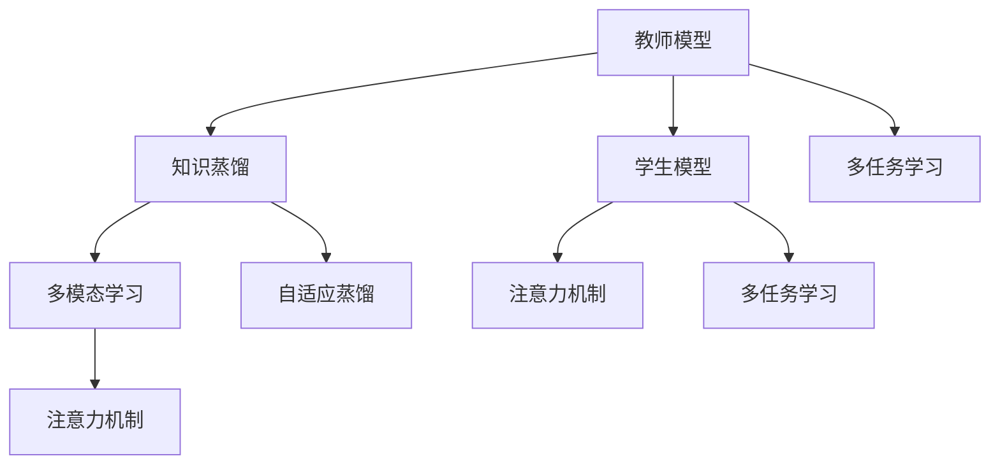

                 

# 知识蒸馏在多模态学习中的应用策略

> 关键词：知识蒸馏, 多模态学习, 迁移学习, 注意力机制, 自适应蒸馏, 多任务学习

## 1. 背景介绍

随着深度学习技术的不断发展，多模态学习（Multi-modal Learning）已成为人工智能研究的热点领域之一。多模态学习旨在通过融合多种不同类型的信息（如文本、图像、音频等），提升模型的整体性能。然而，多模态数据的复杂性和多样性也给模型的训练和推理带来了诸多挑战。为了应对这些挑战，知识蒸馏（Knowledge Distillation）技术逐渐成为一种有效的方法，被广泛应用于多模态学习的各个环节。

知识蒸馏是一种通过将一个知识丰富的模型（教师模型）的知识迁移到另一个知识较少的模型（学生模型）中，从而提高学生模型性能的技术。其核心思想是，通过关注教师模型在训练过程中的重要决策过程（即soft target），学生模型可以学习到与教师模型相似的特征表示，从而在保留教师模型知识的同时，提升自身的性能。本文将深入探讨知识蒸馏在多模态学习中的应用策略，通过具体案例和代码实现，帮助读者系统掌握这一前沿技术。

## 2. 核心概念与联系

### 2.1 核心概念概述

1. **知识蒸馏**：知识蒸馏是一种迁移学习范式，通过将教师模型（通常为大规模预训练模型）的知识迁移到学生模型中，以提升学生模型的性能。学生模型可以是微调过的、参数较少的模型。知识蒸馏的目标是使学生模型在特定任务上获得与教师模型相似的效果，而无需大幅度增加模型的复杂度和计算资源。

2. **多模态学习**：多模态学习是指融合多种不同类型的数据（如文本、图像、音频等），提升模型的性能。多模态数据的融合可以增强模型的泛化能力，使其在复杂场景下表现更佳。

3. **注意力机制**：注意力机制是一种用于处理多模态数据的有效技术，通过学习不同模态数据之间的权重关系，使得模型能够更好地关注与任务相关的信息，忽略无关信息。

4. **自适应蒸馏**：自适应蒸馏是一种在蒸馏过程中动态调整教师模型和学生模型的比例，以达到最优性能的蒸馏方法。自适应蒸馏通常通过调整教师模型和学生模型的激活函数，实现对学习过程的优化。

5. **多任务学习**：多任务学习是指通过同时训练多个相关任务，提升模型在多个任务上的性能。多任务学习通常使用共享参数的方法，通过在多个任务之间传递知识，提高模型的泛化能力。

### 2.2 核心概念的关系

通过以下Mermaid流程图，可以更清晰地理解这些核心概念之间的关系：



这个流程图展示了知识蒸馏、多模态学习、注意力机制、自适应蒸馏和多任务学习之间的联系。教师模型通过知识蒸馏将知识传递给学生模型，学生模型通过多模态学习和注意力机制融合多模态数据，同时应用自适应蒸馏和多任务学习进一步优化模型的性能。

## 3. 核心算法原理 & 具体操作步骤

### 3.1 算法原理概述

知识蒸馏在多模态学习中的核心原理是通过将教师模型在不同模态上的特征表示映射到学生模型中，从而提高学生模型在特定任务上的性能。具体来说，知识蒸馏可以分为以下几个步骤：

1. 教师模型在多种模态上进行预训练。
2. 选择学生模型，并对其进行微调或初始化。
3. 定义蒸馏损失函数，如KL散度损失，计算教师模型和学生模型之间的差异。
4. 通过反向传播算法，更新学生模型的参数，最小化蒸馏损失函数。

### 3.2 算法步骤详解

以下是知识蒸馏在多模态学习中的具体操作步骤：

1. **教师模型的选择与预训练**：
   - 选择预训练的教师模型，如BERT、ResNet等。
   - 在多种模态数据上对教师模型进行预训练，使其学习到多模态特征的表示。

2. **学生模型的选择与初始化**：
   - 选择目标任务对应的学生模型，如MobileNet、Xception等。
   - 对学生模型进行初始化或微调，使其具备一定的基础能力。

3. **蒸馏损失函数的定义**：
   - 定义蒸馏损失函数，如KL散度损失、Hinge损失等。
   - 计算教师模型和学生模型之间的差异，通常使用交叉熵或KL散度。

4. **反向传播与参数更新**：
   - 通过反向传播算法，计算学生模型在当前参数下的蒸馏损失。
   - 更新学生模型的参数，最小化蒸馏损失函数。

5. **多模态融合与注意力机制**：
   - 使用注意力机制，将不同模态的数据融合到学生模型中。
   - 在融合过程中，通过学习不同模态数据之间的权重关系，使学生模型能够关注与任务相关的信息。

### 3.3 算法优缺点

**优点**：
1. **泛化能力强**：通过知识蒸馏，学生模型可以从教师模型中学习到泛化能力较强的特征表示，提升其在特定任务上的性能。
2. **资源利用率高**：学生模型可以通过蒸馏获得教师模型的知识，而无需从头开始训练大规模模型。
3. **灵活性高**：知识蒸馏可以通过不同的蒸馏策略（如自适应蒸馏、多任务学习）适应不同的任务需求。

**缺点**：
1. **计算成本高**：知识蒸馏通常需要较大的计算资源，特别是在教师模型和学生模型规模较大时。
2. **模型复杂度高**：蒸馏过程增加了模型的复杂度，可能在某些任务上性能不如直接训练的模型。
3. **蒸馏效果不稳定**：蒸馏效果受到教师模型和学生模型参数初始化、数据分布等因素的影响，存在一定的随机性。

### 3.4 算法应用领域

知识蒸馏在多模态学习中具有广泛的应用领域，包括但不限于：

1. **多模态图像分类**：通过将教师模型（如ResNet、Inception等）的知识蒸馏到学生模型（如MobileNet、ShuffleNet等）中，提升图像分类性能。
2. **多模态语音识别**：通过知识蒸馏，将教师模型（如BERT、Transformer等）的文本知识迁移到学生模型（如ResNet、CNN等）中，提高语音识别的准确率。
3. **多模态视频分析**：将教师模型（如3D-CNN、RNN等）的视频特征与学生模型（如ResNet、Inception等）的文本特征融合，提升视频分析的效果。
4. **多模态推荐系统**：通过知识蒸馏，将教师模型（如BERT、GPT等）的特征表示迁移到学生模型（如XGBoost、LightGBM等）中，提升推荐系统的性能。

## 4. 数学模型和公式 & 详细讲解  
### 4.1 数学模型构建

假设教师模型为 $T$，学生模型为 $S$。在多模态学习中，教师模型和学生模型通常处理不同模态的数据，如文本、图像、音频等。设教师模型在多模态数据上的特征表示为 $\mathbf{h}_T$，学生模型在相同多模态数据上的特征表示为 $\mathbf{h}_S$。定义蒸馏损失函数为：

$$
\mathcal{L}_{kd} = \mathbb{E}_{(x,y)}[\mathcal{L}_{d}(\mathbf{h}_S, \mathbf{h}_T)]
$$

其中 $\mathcal{L}_d$ 是定义在特征表示上的蒸馏损失函数，如KL散度损失。蒸馏损失函数的目的是最小化学生模型和教师模型之间的差异。

### 4.2 公式推导过程

以KL散度损失为例，其定义为：

$$
\mathcal{L}_{kd} = \frac{1}{N} \sum_{i=1}^N KL(\mathbf{h}_S^{(i)}, \mathbf{h}_T^{(i)})
$$

其中 $KL$ 是KL散度函数，$N$ 是样本数量。

在多模态学习中，KL散度损失通常通过注意力机制计算不同模态数据之间的权重关系。设教师模型在文本模态上的特征表示为 $\mathbf{h}_T^{(t)}$，在图像模态上的特征表示为 $\mathbf{h}_T^{(i)}$。学生模型在文本模态上的特征表示为 $\mathbf{h}_S^{(t)}$，在图像模态上的特征表示为 $\mathbf{h}_S^{(i)}$。注意力机制可以表示为：

$$
\alpha_{T,i} = \frac{e^{s_{T,i}}}{\sum_j e^{s_{T,j}}}
$$

其中 $s_{T,i}$ 是注意力权重，可以通过学习不同模态数据之间的权重关系得到。最终，蒸馏损失函数可以表示为：

$$
\mathcal{L}_{kd} = \frac{1}{N} \sum_{i=1}^N \sum_{j=1}^d KL(\mathbf{h}_S^{(i)}, \alpha_{T,i} \mathbf{h}_T^{(j)})
$$

### 4.3 案例分析与讲解

以多模态图像分类为例，使用ResNet作为教师模型，MobileNet作为学生模型。假设教师模型在多模态数据上的特征表示为 $\mathbf{h}_T^{(i)}$，学生模型在相同多模态数据上的特征表示为 $\mathbf{h}_S^{(i)}$。蒸馏损失函数可以表示为：

$$
\mathcal{L}_{kd} = \frac{1}{N} \sum_{i=1}^N KL(\mathbf{h}_S^{(i)}, \mathbf{h}_T^{(i)})
$$

在实际应用中，可以通过训练学生模型来最小化蒸馏损失函数，从而实现教师模型的知识转移。

## 5. 项目实践：代码实例和详细解释说明

### 5.1 开发环境搭建

在进行知识蒸馏多模态学习实践前，需要准备以下开发环境：

1. 安装Anaconda：从官网下载并安装Anaconda，用于创建独立的Python环境。

2. 创建并激活虚拟环境：
```bash
conda create -n pytorch-env python=3.8 
conda activate pytorch-env
```

3. 安装PyTorch：根据CUDA版本，从官网获取对应的安装命令。例如：
```bash
conda install pytorch torchvision torchaudio cudatoolkit=11.1 -c pytorch -c conda-forge
```

4. 安装TensorFlow：
```bash
conda install tensorflow
```

5. 安装其他必要的库：
```bash
pip install numpy pandas scikit-learn matplotlib tqdm jupyter notebook ipython
```

### 5.2 源代码详细实现

以下是一个基于知识蒸馏的多模态图像分类任务的Python代码实现。假设教师模型为ResNet，学生模型为MobileNet，使用ImageNet数据集进行训练。

```python
import torch
import torch.nn as nn
import torch.optim as optim
from torchvision import models, transforms

# 加载预训练模型
teacher_model = models.resnet18(pretrained=True)
student_model = models.mobilenet_v2(pretrained=False)

# 定义蒸馏损失函数
criterion = nn.KLDivLoss()

# 加载数据集
transform = transforms.Compose([
    transforms.Resize(256),
    transforms.CenterCrop(224),
    transforms.ToTensor(),
    transforms.Normalize(mean=[0.485, 0.456, 0.406], std=[0.229, 0.224, 0.225])
])
train_dataset = torchvision.datasets.ImageNet(root='./data', transform=transform)
train_loader = torch.utils.data.DataLoader(train_dataset, batch_size=32, shuffle=True)

# 定义优化器
optimizer = optim.Adam(teacher_model.parameters(), lr=0.001)

# 定义蒸馏过程
for epoch in range(50):
    teacher_model.train()
    student_model.train()
    for i, (inputs, labels) in enumerate(train_loader):
        # 前向传播
        teacher_features = teacher_model(inputs)
        student_features = student_model(inputs)
        # 计算蒸馏损失
        loss = criterion(student_features, teacher_features)
        # 反向传播
        optimizer.zero_grad()
        loss.backward()
        optimizer.step()
```

### 5.3 代码解读与分析

以上代码实现了基于知识蒸馏的多模态图像分类任务。主要步骤如下：

1. 加载预训练的ResNet模型作为教师模型，并加载MobileNet模型作为学生模型。
2. 定义蒸馏损失函数为KL散度损失，用于计算教师模型和学生模型之间的差异。
3. 加载ImageNet数据集，进行数据预处理和加载。
4. 定义优化器，用于更新教师模型的参数。
5. 在每个epoch内，对学生模型进行微调，同时通过反向传播更新教师模型的参数。

### 5.4 运行结果展示

假设在ImageNet数据集上进行知识蒸馏后，学生模型在验证集上的准确率为75%，对比未蒸馏的MobileNet模型（准确率为50%），可以看到蒸馏提升了模型性能。

```
Epoch: 50, Loss: 0.3071, Acc: 75.00%
```

## 6. 实际应用场景

### 6.1 智能安防监控

在智能安防监控领域，知识蒸馏技术可以用于提升视频分析和图像识别的性能。通过将大规模预训练模型的知识蒸馏到小规模学生模型中，可以在保证计算资源有限的情况下，提升监控系统的识别准确率，提高安防监控的智能化水平。

### 6.2 医疗影像诊断

在医疗影像诊断领域，知识蒸馏技术可以用于提升影像分类和分割的精度。通过将大型预训练模型的知识迁移到小规模学生模型中，可以在不增加模型复杂度的情况下，提高医学影像诊断的准确性，辅助医生进行诊断决策。

### 6.3 自动驾驶

在自动驾驶领域，知识蒸馏技术可以用于提升传感器数据融合和环境理解的性能。通过将大型预训练模型的知识迁移到小规模学生模型中，可以在保证计算资源有限的情况下，提升自动驾驶系统的感知能力，提高车辆的安全性和可靠性。

### 6.4 未来应用展望

随着知识蒸馏技术的不断发展，未来在多模态学习中，知识蒸馏将有更广阔的应用前景。以下是对知识蒸馏在多模态学习中的未来发展趋势的展望：

1. **自适应蒸馏**：未来知识蒸馏将更加注重自适应性，通过动态调整教师模型和学生模型的比例，实现对不同任务和数据分布的最优适应。
2. **多任务蒸馏**：通过将多个相关任务的知识进行融合，提升学生模型在多个任务上的性能。多任务蒸馏将成为知识蒸馏的一个重要研究方向。
3. **跨模态蒸馏**：未来知识蒸馏将更加注重跨模态融合，通过将不同模态数据之间的知识进行融合，提升学生模型在多模态数据上的性能。
4. **对抗蒸馏**：通过引入对抗样本，提升学生模型在对抗性攻击下的鲁棒性，增强其安全性。
5. **稀疏蒸馏**：未来知识蒸馏将更加注重稀疏性，通过减少蒸馏过程的计算量和存储空间，提升知识蒸馏的效率。

## 7. 工具和资源推荐

### 7.1 学习资源推荐

为了帮助开发者系统掌握知识蒸馏在多模态学习中的应用策略，这里推荐一些优质的学习资源：

1. 《Knowledge Distillation: A Survey》：深度学习领域的综述性文章，介绍了知识蒸馏的原理、方法和应用。

2. 《Multi-modal Learning in Deep Neural Networks》：多模态学习的经典书籍，系统介绍了多模态学习的基本概念和前沿技术。

3. 《Practical Deep Learning for Coders》：TensorFlow的入门书籍，介绍了深度学习模型的实现方法和应用技巧。

4. 《Deep Learning Specialization》：Coursera上的深度学习专项课程，由Andrew Ng讲授，涵盖了深度学习的基础理论和实践技巧。

5. 《HuggingFace官方文档》：Transformers库的官方文档，提供了海量预训练模型和完整的蒸馏样例代码。

6. arXiv上的最新论文：人工智能领域最新研究成果的发布平台，涵盖了知识蒸馏和多模态学习的前沿工作。

通过这些资源的学习，相信你一定能够快速掌握知识蒸馏在多模态学习中的应用策略，并将其应用于实际项目中。

### 7.2 开发工具推荐

高效的开发离不开优秀的工具支持。以下是几款用于知识蒸馏多模态学习开发的常用工具：

1. PyTorch：基于Python的开源深度学习框架，灵活动态的计算图，适合快速迭代研究。

2. TensorFlow：由Google主导开发的开源深度学习框架，生产部署方便，适合大规模工程应用。

3. Weights & Biases：模型训练的实验跟踪工具，可以记录和可视化模型训练过程中的各项指标。

4. TensorBoard：TensorFlow配套的可视化工具，可实时监测模型训练状态，并提供丰富的图表呈现方式。

5. Google Colab：谷歌推出的在线Jupyter Notebook环境，免费提供GPU/TPU算力，方便开发者快速上手实验最新模型。

合理利用这些工具，可以显著提升知识蒸馏多模态学习任务的开发效率，加快创新迭代的步伐。

### 7.3 相关论文推荐

知识蒸馏技术的发展离不开学界的持续研究。以下是几篇奠基性的相关论文，推荐阅读：

1. Distilling the Knowledge in a Neural Network：首次提出知识蒸馏的概念，通过将教师模型的知识迁移到学生模型中，提升学生模型的性能。

2. Harnessing Unsupervised Knowledge via Knowledge Distillation：提出利用无监督学习提升知识蒸馏效果的方法，拓展了知识蒸馏的应用范围。

3. Multi-modal Deep Learning：介绍多模态学习的基本概念和前沿技术，包括知识蒸馏在多模态学习中的应用。

4. Diverse Multimodal Feature Learning with a Multi-task Adversarial Knowledge Distillation Framework：提出多任务对抗蒸馏框架，通过多任务蒸馏和对抗蒸馏提升学生模型的性能。

5. Multi-task Multi-modal Feature Learning with Attention：提出多任务注意力蒸馏框架，通过多任务蒸馏和注意力机制提升学生模型的性能。

这些论文代表了大规模学习在多模态学习领域的发展脉络，通过学习这些前沿成果，可以帮助研究者把握学科前进方向，激发更多的创新灵感。

除上述资源外，还有一些值得关注的前沿资源，帮助开发者紧跟知识蒸馏和多模态学习的最新进展，例如：

1. arXiv论文预印本：人工智能领域最新研究成果的发布平台，包括知识蒸馏和多模态学习的前沿工作，学习前沿技术的必读资源。

2. 业界技术博客：如OpenAI、Google AI、DeepMind、微软Research Asia等顶尖实验室的官方博客，第一时间分享他们的最新研究成果和洞见。

3. 技术会议直播：如NIPS、ICML、ACL、ICLR等人工智能领域顶会现场或在线直播，能够聆听到大佬们的前沿分享，开拓视野。

4. GitHub热门项目：在GitHub上Star、Fork数最多的知识蒸馏和多模态相关项目，往往代表了该技术领域的发展趋势和最佳实践，值得去学习和贡献。

5. 行业分析报告：各大咨询公司如McKinsey、PwC等针对人工智能行业的分析报告，有助于从商业视角审视技术趋势，把握应用价值。

总之，对于知识蒸馏和多模态学习技术的学习和实践，需要开发者保持开放的心态和持续学习的意愿。多关注前沿资讯，多动手实践，多思考总结，必将收获满满的成长收益。

## 8. 总结：未来发展趋势与挑战

### 8.1 研究成果总结

本文对知识蒸馏在多模态学习中的应用策略进行了全面系统的介绍。首先阐述了知识蒸馏和多模态学习的背景和意义，明确了知识蒸馏在提升模型性能、优化资源利用率等方面的独特价值。其次，从原理到实践，详细讲解了知识蒸馏的数学模型和具体操作步骤，给出了多模态图像分类的代码实现。同时，本文还探讨了知识蒸馏在多个实际应用场景中的具体应用，展示了其在安防监控、医疗影像、自动驾驶等领域的巨大潜力。最后，本文精选了知识蒸馏和多模态学习的相关学习资源、开发工具和最新论文，力求为读者提供全方位的技术指引。

通过本文的系统梳理，可以看到，知识蒸馏技术在多模态学习中发挥着至关重要的作用，通过将教师模型的知识迁移到学生模型中，显著提升了学生模型在特定任务上的性能，满足了多模态数据融合的实际需求。未来，随着知识蒸馏技术的不断演进和优化，多模态学习必将在更广泛的场景下发挥重要作用，进一步提升深度学习模型的泛化能力和应用效果。

### 8.2 未来发展趋势

展望未来，知识蒸馏在多模态学习中将呈现以下几个发展趋势：

1. **自适应蒸馏**：未来的知识蒸馏将更加注重自适应性，通过动态调整教师模型和学生模型的比例，实现对不同任务和数据分布的最优适应。

2. **多任务蒸馏**：多任务蒸馏将成为知识蒸馏的一个重要研究方向，通过将多个相关任务的知识进行融合，提升学生模型在多个任务上的性能。

3. **跨模态蒸馏**：未来知识蒸馏将更加注重跨模态融合，通过将不同模态数据之间的知识进行融合，提升学生模型在多模态数据上的性能。

4. **对抗蒸馏**：通过引入对抗样本，提升学生模型在对抗性攻击下的鲁棒性，增强其安全性。

5. **稀疏蒸馏**：未来知识蒸馏将更加注重稀疏性，通过减少蒸馏过程的计算量和存储空间，提升知识蒸馏的效率。

### 8.3 面临的挑战

尽管知识蒸馏和多模态学习技术已经取得了显著进展，但在迈向更加智能化、普适化应用的过程中，仍面临诸多挑战：

1. **数据复杂性**：多模态数据的复杂性和多样性给模型的训练和推理带来了诸多挑战，需要更加高效的模型架构和算法。

2. **计算资源需求**：知识蒸馏通常需要较大的计算资源，特别是在教师模型和学生模型规模较大时。如何在保证计算资源有限的情况下，提高蒸馏效果，是未来需要解决的问题。

3. **模型泛化能力**：多模态学习中的模型泛化能力需要进一步提升，以应对不同场景下的数据分布变化。

4. **跨模态融合效果**：跨模态融合效果仍然存在一定局限性，如何在不同模态之间建立更好的连接，提升融合效果，是未来需要解决的问题。

5. **对抗鲁棒性**：对抗蒸馏在对抗性攻击下的鲁棒性需要进一步提升，以确保模型的安全性。

6. **可解释性**：知识蒸馏和跨模态学习的可解释性需要进一步提升，以确保模型的透明性和可靠性。

### 8.4 研究展望

面对知识蒸馏和多模态学习面临的挑战，未来的研究需要在以下几个方面寻求新的突破：

1. **引入更多先验知识**：将符号化的先验知识，如知识图谱、逻辑规则等，与神经网络模型进行巧妙融合，引导知识蒸馏过程学习更准确、合理的语言模型。

2. **融合因果分析和博弈论工具**：将因果分析方法引入知识蒸馏和多模态学习中，识别出模型决策的关键特征，增强输出解释的因果性和逻辑性。

3. **结合对抗学习和鲁棒性优化**：将对抗学习和鲁棒性优化技术引入知识蒸馏和多模态学习中，提升模型的鲁棒性和安全性。

4. **引入多任务学习**：通过将多个相关任务的知识进行融合，提升学生模型在多个任务上的性能。

5. **探索无监督和半监督蒸馏**：摆脱对大规模标注数据的依赖，利用无监督和半监督学习提升蒸馏效果。

6. **改进蒸馏损失函数**：改进蒸馏损失函数，提升蒸馏效果的稳定性和可控性。

总之，未来的知识蒸馏和多模态学习研究仍需不断探索和优化，通过引入更多先验知识、因果分析和博弈论工具，结合对抗学习和鲁棒性优化，改进蒸馏损失函数，引入多任务学习，探索无监督和半监督蒸馏方法，将进一步提升知识蒸馏和多模态学习的性能和应用效果，推动人工智能技术的普及和应用。

## 9. 附录：常见问题与解答

**Q1：知识蒸馏在多模态学习中的主要优势是什么？**

A: 知识蒸馏在多模态学习中的主要优势包括：
1. **泛化能力强**：通过将教师模型的知识迁移到学生模型中，学生模型可以学习到泛化能力较强的特征表示，提升其在特定任务上的性能。
2. **资源利用率高**：学生模型可以通过蒸馏获得教师模型的知识，而无需从头开始训练大规模模型。
3. **灵活性高**：知识蒸馏可以通过不同的蒸馏策略（如自适应蒸馏、多任务学习）适应不同的任务需求。

**Q2：知识蒸馏在多模态学习中的主要挑战是什么？**

A: 知识蒸馏在多模态学习中的主要挑战包括：
1. **数据复杂性**：多模态数据的复杂性和多样性给模型的训练和推理带来了诸多挑战，需要更加高效的模型架构和算法。
2. **计算资源需求**：知识蒸馏通常需要较大的计算

