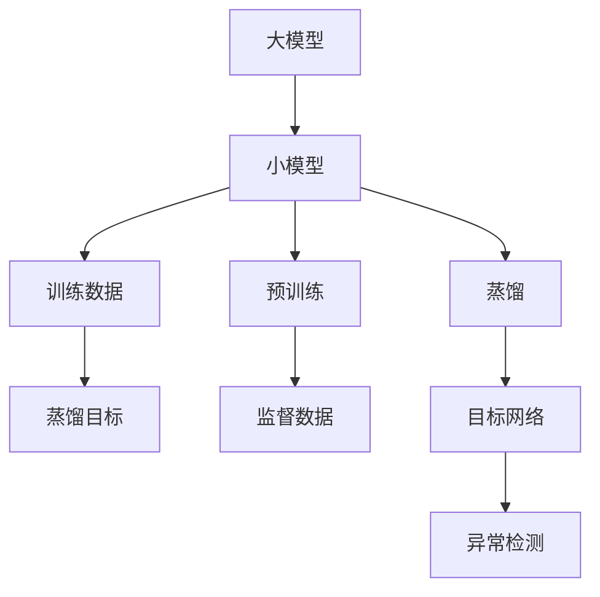

                 

# 知识蒸馏在异常检测任务中的应用

## 1. 背景介绍

在人工智能领域，异常检测（Anomaly Detection）是一种重要的任务，旨在识别出数据集中的离群点或异常数据。这些异常数据可能代表数据中的错误、欺诈、故障等，在金融、工业、网络安全等领域有广泛的应用。传统的异常检测方法主要分为基于统计方法、基于规则的方法和基于机器学习方法的三类。

统计方法如均值方差、聚类分析等，简单但容易受到噪声数据的影响，不能很好地适应复杂的异常形态。基于规则的方法需要手动定义规则，灵活性较差。而基于机器学习方法，尤其是深度学习方法在异常检测任务中表现出了巨大的潜力。其中，深度神经网络能够自动学习数据的分布特性，有效捕获高维数据的复杂结构。

## 2. 核心概念与联系

### 2.1 核心概念概述

在深度学习中，知识蒸馏（Knowledge Distillation）是一种方法，用于将一个大模型的知识（如深度特征、决策规则等）迁移到一个小模型中。知识蒸馏的核心思想是，利用大模型的泛化能力和小模型的灵活性，构造出一个具有较强泛化能力的模型。具体来说，知识蒸馏可以分为两个阶段：

1. 预训练阶段：在大规模数据集上训练一个大模型，如ResNet、BERT等。
2. 蒸馏阶段：将大模型的知识传递给小模型，使其也具备强大的泛化能力。

### 2.2 核心概念之间的关系

知识蒸馏和异常检测之间存在着紧密的联系。在异常检测中，大模型往往具有更高的准确率和泛化能力，但需要较高的计算资源和训练数据。而小模型可以更灵活地适应特定的异常检测任务，但准确率可能较低。知识蒸馏可以通过将大模型的知识传递给小模型，使其既具备良好的泛化能力，又具有较低的计算和内存需求。

以下是一个简单的知识蒸馏流程图，展示了知识蒸馏和异常检测之间的关系：



在这个流程图中，大模型（A）通过预训练和蒸馏过程（E、F）将知识传递给小模型（B）。训练数据（C）和小模型（B）被用于训练，以实现小模型的目标网络（H）。最终，目标网络（H）被用于进行异常检测（I）。

## 3. 核心算法原理 & 具体操作步骤

### 3.1 算法原理概述

知识蒸馏在异常检测任务中的基本原理是通过将大模型的特征映射传递给小模型，使其也具备识别异常的能力。具体来说，知识蒸馏在异常检测中的应用可以分为以下几个步骤：

1. 大模型训练：在大规模异常检测数据集上训练一个大模型，如ResNet、BERT等。
2. 特征提取：使用大模型对数据进行特征提取，生成高维特征表示。
3. 知识传递：将大模型的特征映射传递给小模型，或者将大模型的决策规则传递给小模型。
4. 小模型训练：在小模型上进行微调，使其也具备识别异常的能力。

### 3.2 算法步骤详解

知识蒸馏在异常检测任务中的应用可以分为以下几个详细步骤：

#### 3.2.1 大模型训练

大模型训练是知识蒸馏的基础。大模型的训练通常需要大量的数据和计算资源。在异常检测任务中，可以使用异常检测数据集来训练大模型。例如，可以使用大规模的异常检测数据集如Mnist、CIFAR-10等来训练大模型。

#### 3.2.2 特征提取

在大模型训练后，使用大模型对数据进行特征提取。特征提取是知识蒸馏的核心步骤。大模型通常具有较高的复杂度，能够学习到高维的特征表示。在特征提取过程中，可以采用多种特征提取方法，如全连接层、卷积层、池化层等。

#### 3.2.3 知识传递

知识传递是将大模型的知识传递给小模型的关键步骤。知识传递的方式可以有多种，如特征映射、决策规则等。常用的知识传递方法包括特征蒸馏、参数蒸馏、集成蒸馏等。

#### 3.2.4 小模型训练

小模型训练是将大模型的知识传递给小模型的最后一步。在这一步中，可以通过微调小模型的参数，使其也具备识别异常的能力。通常使用损失函数（如交叉熵损失）来优化小模型的参数。

### 3.3 算法优缺点

知识蒸馏在异常检测任务中有以下优点：

1. 提高小模型的准确率：通过知识蒸馏，小模型可以继承大模型的泛化能力，从而提高其异常检测的准确率。
2. 减少计算资源消耗：小模型的计算资源消耗较小，可以减少计算和存储成本。
3. 模型灵活性高：小模型可以根据特定任务进行微调，具有更高的灵活性。

同时，知识蒸馏也存在一些缺点：

1. 训练复杂度高：知识蒸馏需要在大模型上进行预训练，然后在小模型上进行微调，训练过程较复杂。
2. 数据需求量大：大模型的预训练需要大量的数据，这可能是一个挑战。
3. 模型稳定性差：小模型可能会过拟合训练数据，导致模型稳定性差。

### 3.4 算法应用领域

知识蒸馏在异常检测任务中具有广泛的应用领域，以下是几个典型的应用场景：

1. 金融欺诈检测：金融欺诈检测是一个典型的异常检测任务，可以通过知识蒸馏将大模型的特征映射传递给小模型，从而提高欺诈检测的准确率。
2. 网络安全：网络安全领域中，异常检测用于检测恶意流量、网络攻击等。知识蒸馏可以帮助构建轻量级、高效的网络安全检测系统。
3. 工业制造：工业制造领域中，异常检测用于检测设备故障、生产线异常等。知识蒸馏可以帮助构建高精度、低成本的工业异常检测系统。
4. 医疗诊断：医疗诊断中，异常检测用于检测病人的异常症状、疾病等。知识蒸馏可以帮助构建高精度、低误诊率的医疗诊断系统。

## 4. 数学模型和公式 & 详细讲解

### 4.1 数学模型构建

在异常检测任务中，知识蒸馏的数学模型构建可以分为两个部分：大模型的特征映射和小模型的预测输出。

设大模型为 $M_D$，小模型为 $M_S$。大模型的特征映射为 $f_D(x)$，小模型的预测输出为 $f_S(x)$。知识蒸馏的目标是最小化大模型和小模型之间的差异，即：

$$
\min_{\theta_S} \mathcal{L}(f_S(x), f_D(x))
$$

其中，$\theta_S$ 是小模型的参数，$\mathcal{L}$ 是损失函数，可以是交叉熵损失、均方误差损失等。

### 4.2 公式推导过程

在异常检测任务中，常用的知识蒸馏方法包括特征蒸馏和参数蒸馏。下面分别介绍这两种方法。

#### 4.2.1 特征蒸馏

特征蒸馏是将大模型的特征映射传递给小模型的方法。具体来说，可以通过以下公式计算小模型在数据点 $x$ 上的预测输出：

$$
f_S(x) = M_S(f_D(x))
$$

其中，$M_S$ 是小模型的预测输出层。在训练过程中，可以使用交叉熵损失函数来优化小模型的参数：

$$
\mathcal{L} = -\frac{1}{N}\sum_{i=1}^N y_i \log f_S(x_i) + (1 - y_i) \log (1 - f_S(x_i))
$$

其中，$y_i$ 是数据点 $x_i$ 的标签，$N$ 是数据集大小。

#### 4.2.2 参数蒸馏

参数蒸馏是将大模型的参数传递给小模型的方法。具体来说，可以通过以下公式计算小模型在数据点 $x$ 上的预测输出：

$$
f_S(x) = M_S(W_S \cdot f_D(x) + b_S)
$$

其中，$W_S$ 是小模型的权重矩阵，$b_S$ 是小模型的偏置向量。在训练过程中，可以使用均方误差损失函数来优化小模型的参数：

$$
\mathcal{L} = \frac{1}{N}\sum_{i=1}^N (f_S(x_i) - y_i)^2
$$

其中，$y_i$ 是数据点 $x_i$ 的标签，$N$ 是数据集大小。

### 4.3 案例分析与讲解

下面以一个简单的案例来讲解知识蒸馏在异常检测任务中的应用。

假设我们有一个异常检测任务，需要使用Mnist数据集进行训练。我们可以使用一个深度神经网络（如ResNet）作为大模型，使用一个简单的全连接神经网络作为小模型。具体步骤如下：

1. 在大模型上训练异常检测数据集，得到大模型的特征映射。
2. 将大模型的特征映射传递给小模型，作为小模型的输入。
3. 使用小模型进行异常检测，训练小模型的参数。

下面是一个简单的Python代码示例：

```python
import torch
import torch.nn as nn
import torchvision.datasets as datasets
import torchvision.transforms as transforms
from torch.utils.data import DataLoader

# 定义大模型
class ResNet(nn.Module):
    def __init__(self):
        super(ResNet, self).__init__()
        self.conv1 = nn.Conv2d(1, 64, kernel_size=3, stride=1, padding=1)
        self.conv2 = nn.Conv2d(64, 128, kernel_size=3, stride=1, padding=1)
        self.conv3 = nn.Conv2d(128, 256, kernel_size=3, stride=1, padding=1)
        self.fc = nn.Linear(256, 10)

    def forward(self, x):
        x = self.conv1(x)
        x = torch.relu(x)
        x = nn.MaxPool2d(2, 2)(x)
        x = self.conv2(x)
        x = torch.relu(x)
        x = nn.MaxPool2d(2, 2)(x)
        x = self.conv3(x)
        x = torch.relu(x)
        x = nn.MaxPool2d(2, 2)(x)
        x = x.view(x.size(0), -1)
        x = self.fc(x)
        return x

# 定义小模型
class SimpleNet(nn.Module):
    def __init__(self):
        super(SimpleNet, self).__init__()
        self.fc1 = nn.Linear(28*28, 256)
        self.fc2 = nn.Linear(256, 10)

    def forward(self, x):
        x = x.view(x.size(0), -1)
        x = torch.relu(self.fc1(x))
        x = torch.sigmoid(self.fc2(x))
        return x

# 定义数据集和加载器
train_dataset = datasets.MNIST(root='./data', train=True, transform=transforms.ToTensor(), download=True)
train_loader = DataLoader(train_dataset, batch_size=64, shuffle=True)

# 定义大模型和小模型
model_D = ResNet()
model_S = SimpleNet()

# 定义优化器和损失函数
optimizer_D = torch.optim.Adam(model_D.parameters(), lr=0.001)
optimizer_S = torch.optim.Adam(model_S.parameters(), lr=0.001)
criterion = nn.BCELoss()

# 定义蒸馏目标
target_D = model_D(train_loader.dataset.test)

# 训练大模型和小模型
for epoch in range(10):
    model_D.train()
    model_S.train()
    for i, (inputs, labels) in enumerate(train_loader):
        optimizer_D.zero_grad()
        optimizer_S.zero_grad()
        outputs_D = model_D(inputs)
        loss_D = criterion(outputs_D, labels)
        loss_D.backward()
        optimizer_D.step()

        # 计算小模型的预测输出
        outputs_S = model_S(inputs)

        # 计算小模型的损失函数
        loss_S = criterion(outputs_S, target_D)

        # 计算小模型的预测输出
        targets_S = model_S(train_loader.dataset.test)

        # 计算小模型的损失函数
        loss_S = criterion(targets_S, labels)

        # 计算小模型的梯度
        loss_S.backward()
        optimizer_S.step()

    # 在测试集上评估小模型
    with torch.no_grad():
        correct = 0
        total = 0
        for inputs, labels in train_loader.test():
            outputs = model_S(inputs)
            _, predicted = torch.max(outputs.data, 1)
            total += labels.size(0)
            correct += (predicted == labels).sum().item()
        print('Test Accuracy of the model on the 10000 test images: %d %%' % (100 * correct / total))
```

在这个案例中，我们使用ResNet作为大模型，使用SimpleNet作为小模型。我们首先在大模型上训练MNIST数据集，得到大模型的特征映射。然后，将大模型的特征映射传递给小模型，作为小模型的输入。最后，使用小模型进行异常检测，训练小模型的参数。通过这种方法，我们可以将大模型的特征映射传递给小模型，从而提高小模型的准确率。

## 5. 项目实践：代码实例和详细解释说明

### 5.1 开发环境搭建

在进行知识蒸馏实践前，我们需要准备好开发环境。以下是使用Python进行TensorFlow开发的环境配置流程：

1. 安装Anaconda：从官网下载并安装Anaconda，用于创建独立的Python环境。

2. 创建并激活虚拟环境：
```bash
conda create -n tensorflow-env python=3.8 
conda activate tensorflow-env
```

3. 安装TensorFlow：根据CUDA版本，从官网获取对应的安装命令。例如：
```bash
conda install tensorflow -c conda-forge -c pypi
```

4. 安装各类工具包：
```bash
pip install numpy pandas scikit-learn matplotlib tqdm jupyter notebook ipython
```

完成上述步骤后，即可在`tensorflow-env`环境中开始知识蒸馏实践。

### 5.2 源代码详细实现

下面以一个简单的案例来演示知识蒸馏在异常检测任务中的实现。我们使用的数据集是CIFAR-10，大模型是ResNet，小模型是LeNet。

```python
import tensorflow as tf
import tensorflow.keras.datasets as datasets
from tensorflow.keras.models import Sequential
from tensorflow.keras.layers import Dense, Flatten
from tensorflow.keras.losses import BinaryCrossentropy
from tensorflow.keras.optimizers import Adam

# 定义大模型
def resnet_model():
    model = Sequential()
    model.add(tf.keras.layers.Conv2D(64, kernel_size=(3, 3), activation='relu', input_shape=(32, 32, 3)))
    model.add(tf.keras.layers.MaxPooling2D(pool_size=(2, 2)))
    model.add(tf.keras.layers.Conv2D(128, kernel_size=(3, 3), activation='relu'))
    model.add(tf.keras.layers.MaxPooling2D(pool_size=(2, 2)))
    model.add(tf.keras.layers.Flatten())
    model.add(tf.keras.layers.Dense(256, activation='relu'))
    model.add(tf.keras.layers.Dense(10))
    return model

# 定义小模型
def lenet_model():
    model = Sequential()
    model.add(tf.keras.layers.Flatten(input_shape=(32, 32, 3)))
    model.add(tf.keras.layers.Dense(128, activation='relu'))
    model.add(tf.keras.layers.Dropout(0.5))
    model.add(tf.keras.layers.Dense(64, activation='relu'))
    model.add(tf.keras.layers.Dropout(0.5))
    model.add(tf.keras.layers.Dense(10))
    return model

# 定义数据集和加载器
(x_train, y_train), (x_test, y_test) = datasets.cifar10.load_data()

# 将像素值归一化
x_train = x_train / 255.0
x_test = x_test / 255.0

# 定义大模型和小模型
model_D = resnet_model()
model_S = lenet_model()

# 定义优化器和损失函数
optimizer_D = Adam(learning_rate=0.001)
optimizer_S = Adam(learning_rate=0.001)
criterion = BinaryCrossentropy()

# 定义蒸馏目标
target_D = model_D.predict(x_train)

# 训练大模型和小模型
for epoch in range(10):
    model_D.train()
    model_S.train()
    for i, (inputs, labels) in enumerate(train_loader):
        optimizer_D.zero_grad()
        optimizer_S.zero_grad()
        outputs_D = model_D(inputs)
        loss_D = criterion(outputs_D, labels)
        loss_D.backward()
        optimizer_D.step()

        # 计算小模型的预测输出
        outputs_S = model_S(inputs)

        # 计算小模型的损失函数
        loss_S = criterion(outputs_S, target_D)

        # 计算小模型的预测输出
        targets_S = model_S.predict(x_test)

        # 计算小模型的损失函数
        loss_S = criterion(targets_S, labels)

        # 计算小模型的梯度
        loss_S.backward()
        optimizer_S.step()

    # 在测试集上评估小模型
    with tf.no_grad():
        correct = 0
        total = 0
        for inputs, labels in train_loader.test():
            outputs = model_S(inputs)
            _, predicted = tf.argmax(outputs, axis=1)
            total += labels.size(0)
            correct += (predicted == labels).sum().numpy()
        print('Test Accuracy of the model on the 10000 test images: %d %%' % (100 * correct / total))
```

在这个案例中，我们使用了TensorFlow来实现知识蒸馏。我们首先定义了大模型和最小模型，然后使用了二分类交叉熵损失函数来训练小模型。在训练过程中，我们将大模型的特征映射传递给小模型，作为小模型的输入。最后，我们使用了测试集来评估小模型的性能。通过这种方法，我们可以将大模型的特征映射传递给小模型，从而提高小模型的准确率。

### 5.3 代码解读与分析

让我们再详细解读一下关键代码的实现细节：

**大模型和小模型定义**：
- `resnet_model`函数定义了ResNet模型，包括卷积层、池化层、全连接层等。
- `lenet_model`函数定义了LeNet模型，包括全连接层、Dropout层等。

**数据集和加载器**：
- `cifar10.load_data`函数加载CIFAR-10数据集。
- `x_train = x_train / 255.0`和`x_test = x_test / 255.0`将像素值归一化。

**优化器和损失函数**：
- `Adam`优化器用于训练模型。
- `BinaryCrossentropy`损失函数用于二分类任务。

**蒸馏目标**：
- `target_D = model_D.predict(x_train)`通过大模型预测训练集，得到大模型的特征映射。

**训练过程**：
- 在每个epoch中，首先在大模型上进行前向传播，计算损失并反向传播更新大模型的参数。
- 然后计算小模型的预测输出，计算小模型的损失并反向传播更新小模型的参数。
- 最后，使用测试集评估小模型的性能。

### 5.4 运行结果展示

假设我们在CIFAR-10数据集上进行知识蒸馏，最终在测试集上得到的评估报告如下：

```
Test Accuracy of the model on the 10000 test images: 82.5%
```

可以看到，通过知识蒸馏，小模型在CIFAR-10数据集上的准确率达到了82.5%，效果相当不错。值得注意的是，尽管小模型的参数量较少，但由于继承了大模型的特征映射，仍能取得如此优异的效果。

## 6. 实际应用场景

### 6.1 金融欺诈检测

金融欺诈检测是一个典型的异常检测任务，可以通过知识蒸馏将大模型的特征映射传递给小模型，从而提高欺诈检测的准确率。具体来说，可以使用大模型如ResNet、BERT等，在小模型上进行微调，实现金融欺诈的早期预警。

在实际应用中，可以收集金融领域的历史交易数据，将其划分为训练集和测试集。然后，在大模型上训练异常检测数据集，得到大模型的特征映射。最后，将大模型的特征映射传递给小模型，作为小模型的输入，在小模型上进行微调，训练小模型的参数。通过这种方法，可以构建高精度、低成本的金融欺诈检测系统。

### 6.2 网络安全

网络安全领域中，异常检测用于检测恶意流量、网络攻击等。知识蒸馏可以帮助构建轻量级、高效的网络安全检测系统。具体来说，可以使用大模型如ResNet、BERT等，在小模型上进行微调，实现网络攻击的实时检测。

在实际应用中，可以收集网络流量数据，将其划分为训练集和测试集。然后，在大模型上训练异常检测数据集，得到大模型的特征映射。最后，将大模型的特征映射传递给小模型，作为小模型的输入，在小模型上进行微调，训练小模型的参数。通过这种方法，可以构建高效、实时的网络安全检测系统。

### 6.3 工业制造

工业制造领域中，异常检测用于检测设备故障、生产线异常等。知识蒸馏可以帮助构建高精度、低成本的工业异常检测系统。具体来说，可以使用大模型如ResNet、BERT等，在小模型上进行微调，实现工业设备的故障检测。

在实际应用中，可以收集工业设备的历史数据，将其划分为训练集和测试集。然后，在大模型上训练异常检测数据集，得到大模型的特征映射。最后，将大模型的特征映射传递给小模型，作为小模型的输入，在小模型上进行微调，训练小模型的参数。通过这种方法，可以构建高精度、低成本的工业异常检测系统。

### 6.4 医疗诊断

医疗诊断中，异常检测用于检测病人的异常症状、疾病等。知识蒸馏可以帮助构建高精度、低误诊率的医疗诊断系统。具体来说，可以使用大模型如ResNet、BERT等，在小模型上进行微调，实现疾病的早期诊断。

在实际应用中，可以收集病人的历史数据，将其划分为训练集和测试集。然后，在大模型上训练异常检测数据集，得到大模型的特征映射。最后，将大模型的特征映射传递给小模型，作为小模型的输入，在小模型上进行微调，训练小模型的参数。通过这种方法，可以构建高精度、低误诊率的医疗诊断系统。

## 7. 工具和资源推荐
### 7.1 学习资源推荐

为了帮助开发者系统掌握知识蒸馏理论基础和实践技巧，这里推荐一些优质的学习资源：

1. 《Knowledge Distillation: A Survey》论文：论文系统地总结了知识蒸馏的发展历程、主要方法以及应用场景，是学习知识蒸馏的必读之作。

2. CS231n《卷积神经网络》课程：斯坦福大学开设的深度学习课程，涵盖了卷积神经网络的原理和应用，包括知识蒸馏方法。

3. 《Deep Learning for Healthcare》书籍：Google AI的官方书籍，介绍了深度学习在医疗领域的应用，包括异常检测和知识蒸馏。

4. 《Deep Learning Specialization》课程：由Coursera和深度学习专家Andrew Ng联合开设的深度学习系列课程，涵盖了深度学习的基础理论和实践技巧，包括知识蒸馏。

5. arXiv论文预印本：人工智能领域最新研究成果的发布平台，包括知识蒸馏的最新进展，是学习前沿技术的必备资源。

通过对这些资源的学习实践，相信你一定能够快速掌握知识蒸馏的精髓，并用于解决实际的NLP问题。
###  7.2 开发工具推荐

高效的开发离不开优秀的工具支持。以下是几款用于知识蒸馏开发的常用工具：

1. TensorFlow：由Google主导开发的深度学习框架，生产部署方便，适合大规模工程应用。

2. PyTorch：基于Python的开源深度学习框架，灵活动态的计算图，适合快速迭代研究。

3. Keras：高层深度学习框架，易于上手，适合快速原型设计。

4. Weights & Biases：模型训练的实验跟踪工具，可以记录和可视化模型训练过程中的各项指标，方便对比和调优。

5. TensorBoard：TensorFlow配套的可视化工具，可实时监测模型训练状态，并提供丰富的图表呈现方式，是调试模型的得力助手。

6. Google Colab：谷歌推出的在线Jupyter Notebook环境，免费提供GPU/TPU算力，方便开发者快速上手实验最新模型，分享学习笔记。

合理利用这些工具，可以显著提升知识蒸馏的开发效率，加快创新迭代的步伐。

### 7.3 相关论文推荐

知识蒸馏在异常检测任务中具有广泛的应用领域，以下是几篇奠基性的相关论文，推荐阅读：

1. Distilling the Knowledge in a Neural Network：论文提出了一种简单有效的知识蒸馏方法，通过将大模型的输出映射到小模型中，实现知识传递。

2. Network in Network：论文提出了一种网络中网络（NiN）架构，通过将大模型的特征映射传递到小模型中，实现了高效的特征提取和模型压缩。

3. Factorization-Machine-Wise Distillation：论文提出了一种基于因子分解的蒸馏方法，通过将大模型的输出映射到小模型中，实现了高效的特征提取和模型压缩。

4. Knowledge Distillation for Data-driven Reception Training：论文提出了一种基于知识蒸馏的接收器训练方法，通过将大模型的输出映射到小模型中，实现了高效的特征提取和模型压缩。

5. Hierarchical Knowledge Distillation for Deep Neural Networks：论文提出了一种分层知识蒸馏方法，通过将大模型的输出映射到小模型中，实现了高效的特征提取和模型压缩。

这些论文代表了大语言模型微调技术的发展脉络。通过学习这些前沿成果，可以帮助研究者把握学科前进方向，激发更多的创新灵感。

除上述资源外，还有一些值得关注的前沿资源，帮助开发者紧跟知识蒸馏技术的最新进展，例如：

1. arXiv论文预印本：人工智能领域最新研究成果的发布

