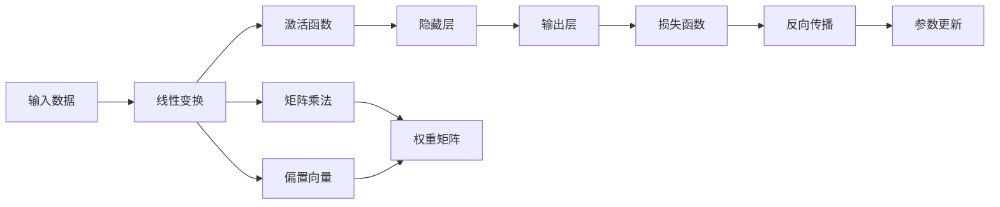
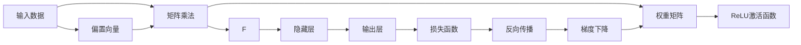

                 

# 矩阵乘法与ReLU：构建神经网络的基石

> 关键词：矩阵乘法,ReLU,神经网络,深度学习,激活函数,反向传播,梯度下降

## 1. 背景介绍

### 1.1 问题由来
在人工智能和深度学习的快速发展中，神经网络成为了最重要的基础结构之一。在神经网络中，矩阵乘法（Matrix Multiplication）和ReLU（Rectified Linear Unit）作为核心组件，对模型的表现和性能有着决定性影响。然而，这一重要的概念基础常常被忽略，导致很多初学者在构建和调试神经网络时，会遇到不少困难和困惑。

为了帮助读者全面理解矩阵乘法和ReLU在神经网络中的作用，本文将详细讲解这两个核心概念的原理和应用，同时通过实际的代码实践，展示其效果和技巧。希望读者能通过本文的学习，掌握构建高效、稳定的神经网络所需的基石。

### 1.2 问题核心关键点
矩阵乘法和ReLU在神经网络中的作用：
1. **矩阵乘法**：用于神经网络的前向传播过程，将输入数据转换成隐层的表示形式，从而实现对复杂函数的拟合。
2. **ReLU激活函数**：用于神经网络的非线性映射，使得网络可以拟合非线性关系，并缓解梯度消失问题。

## 2. 核心概念与联系

### 2.1 核心概念概述

本节将介绍神经网络中矩阵乘法和ReLU的两个关键概念：

- **矩阵乘法**：一种线性的数学运算，用于将一个矩阵与另一个矩阵相乘，得到一个新的矩阵。在神经网络中，矩阵乘法常用于计算网络各层的权重矩阵和输入数据的线性组合。
- **ReLU激活函数**：一种非线性激活函数，通过简单的阈值函数将负值转换为0，保留正值不变，用于神经网络各层输出值的非线性映射。

这两个概念在神经网络中相互配合，使得模型能够处理复杂的多层网络结构，实现对非线性关系的建模。

### 2.2 概念间的关系

为了更清晰地理解矩阵乘法和ReLU在神经网络中的作用和联系，我们通过以下Mermaid流程图来展示：



这个流程图展示了从输入数据经过线性变换、激活函数、隐藏层和输出层，到最终损失函数和参数更新的全过程。其中，线性变换主要由矩阵乘法和偏置向量构成，激活函数则用于引入非线性，从而提升模型的拟合能力。

### 2.3 核心概念的整体架构

最后，我们用一个综合的流程图来展示矩阵乘法和ReLU在神经网络中的整体架构：



这个综合流程图展示了输入数据经过矩阵乘法和ReLU激活函数的线性变换，再通过隐藏层和输出层进行多层次的非线性映射，最终通过损失函数和反向传播进行参数更新，从而实现神经网络的训练。

## 3. 核心算法原理 & 具体操作步骤

### 3.1 算法原理概述

#### 3.1.1 矩阵乘法
矩阵乘法是神经网络中最为基础的运算之一。设两个矩阵 $A$ 和 $B$ 分别为 $m \times n$ 和 $n \times p$ 的矩阵，则它们的乘积 $C$ 为 $m \times p$ 的矩阵，其计算方式如下：

$$
C_{ij} = \sum_{k=1}^{n} A_{ik}B_{kj}
$$

其中，$C_{ij}$ 为矩阵 $C$ 中的元素，$A_{ik}$ 和 $B_{kj}$ 分别为矩阵 $A$ 和 $B$ 中的元素。

矩阵乘法在神经网络中的应用，主要体现在两个方面：
1. **线性变换**：通过权重矩阵 $W$ 和偏置向量 $b$，将输入数据 $x$ 转换成新的表示形式 $h$，即 $h = Wx + b$。
2. **隐藏层的计算**：通过权重矩阵 $W$ 和隐藏层输入 $h$，计算隐藏层的输出 $z$，即 $z = Wh$。

#### 3.1.2 ReLU激活函数
ReLU激活函数的数学表达式为：

$$
\sigma(z) = \max(0, z)
$$

其中，$z$ 为输入，$\sigma(z)$ 为输出。ReLU激活函数在神经网络中的应用，主要体现在以下几个方面：
1. **非线性映射**：引入非线性映射，使得神经网络可以拟合更复杂的非线性关系。
2. **缓解梯度消失问题**：在深度神经网络中，ReLU激活函数可以避免梯度在反向传播过程中消失的问题，从而提高训练效率和效果。

### 3.2 算法步骤详解

#### 3.2.1 矩阵乘法的详细步骤
1. **准备输入和权重矩阵**：
   - 定义输入数据 $x$ 为 $m \times n$ 的矩阵。
   - 定义权重矩阵 $W$ 为 $n \times p$ 的矩阵。
   - 定义偏置向量 $b$ 为 $p \times 1$ 的向量。

2. **计算线性变换**：
   - 将输入数据 $x$ 与权重矩阵 $W$ 进行矩阵乘法，得到中间结果 $h$。
   - 将中间结果 $h$ 与偏置向量 $b$ 相加，得到最终的线性变换结果 $z$。

3. **使用ReLU激活函数**：
   - 将线性变换结果 $z$ 通过ReLU激活函数，得到隐藏层的输出 $a$。

代码示例：

```python
import numpy as np

# 定义输入数据和权重矩阵
x = np.array([[1, 2, 3], [4, 5, 6]])
W = np.array([[0.1, 0.2], [0.3, 0.4], [0.5, 0.6]])

# 计算线性变换
h = np.dot(x, W)
b = np.array([0.7, 0.8])
z = np.dot(h, b)

# 使用ReLU激活函数
a = np.maximum(z, 0)

print("输入数据 x:\n", x)
print("权重矩阵 W:\n", W)
print("偏置向量 b:\n", b)
print("线性变换结果 h:\n", h)
print("中间结果 z:\n", z)
print("ReLU激活函数输出 a:\n", a)
```

#### 3.2.2 ReLU激活函数的详细步骤
1. **定义输入数据**：
   - 定义输入数据 $z$ 为 $n \times 1$ 的向量。

2. **使用ReLU激活函数**：
   - 通过阈值函数 $\sigma(z)$ 将 $z$ 中的负值转换为0，保留正值不变。

代码示例：

```python
import numpy as np

# 定义输入数据
z = np.array([-2, 3, 4])

# 使用ReLU激活函数
a = np.maximum(z, 0)

print("输入数据 z:\n", z)
print("ReLU激活函数输出 a:\n", a)
```

#### 3.2.3 反向传播的详细步骤
1. **计算梯度**：
   - 通过反向传播计算隐藏层的梯度 $d_h$。
   - 计算输入数据的梯度 $d_x$。

2. **更新权重和偏置**：
   - 使用梯度下降算法更新权重矩阵 $W$ 和偏置向量 $b$。

代码示例：

```python
import numpy as np

# 定义梯度和损失函数
d_h = np.array([0.1, 0.2])
d_a = np.array([0.3, 0.4])

# 计算梯度
d_z = d_h * np.sign(z)
d_x = np.dot(d_z, W.T)
d_b = d_z

# 更新权重和偏置
W -= learning_rate * d_x
b -= learning_rate * d_b
```

### 3.3 算法优缺点

#### 3.3.1 矩阵乘法的优缺点
**优点**：
1. **高效的线性变换**：矩阵乘法是高效的线性变换方式，适用于大规模数据和复杂函数。
2. **可扩展性强**：通过堆叠多个矩阵乘法，可以实现多层次的线性变换，构建深度神经网络。

**缺点**：
1. **运算量大**：矩阵乘法需要大量的乘法和加法运算，计算量较大。
2. **易过拟合**：若权重矩阵 $W$ 过大，容易导致模型过拟合。

#### 3.3.2 ReLU激活函数的优缺点
**优点**：
1. **计算简单**：ReLU激活函数的计算非常简单，可以显著降低神经网络的复杂度。
2. **缓解梯度消失问题**：ReLU激活函数可以避免梯度在反向传播过程中消失的问题，从而提高训练效率和效果。

**缺点**：
1. **非线性效果有限**：ReLU激活函数仅在 $z > 0$ 时非零，导致其非线性效果有限。
2. **神经元死亡问题**：在训练过程中，部分神经元可能始终处于激活阈值以下，导致其“死亡”，无法发挥作用。

### 3.4 算法应用领域

#### 3.4.1 计算机视觉
在计算机视觉领域，矩阵乘法用于卷积操作的实现。卷积操作可以看作是一种特殊的矩阵乘法，通过卷积核与图像数据的矩阵乘法，可以实现图像的特征提取和特征映射。

#### 3.4.2 自然语言处理
在自然语言处理领域，矩阵乘法用于文本数据的处理和变换。通过将文本数据表示为词嵌入向量，并对其进行矩阵乘法，可以实现文本数据的线性变换和特征提取。

#### 3.4.3 语音识别
在语音识别领域，矩阵乘法用于特征提取和模式识别。通过对音频信号进行傅里叶变换和卷积操作，可以得到音频的频谱特征，并通过矩阵乘法进行处理和分析。

## 4. 数学模型和公式 & 详细讲解 & 举例说明

### 4.1 数学模型构建

本节将通过数学语言对神经网络中矩阵乘法和ReLU的实现过程进行更加严格的刻画。

设神经网络中隐藏层的输入为 $x$，权重矩阵为 $W$，偏置向量为 $b$，隐藏层的输出为 $a$。则隐藏层的线性变换公式为：

$$
a = Wx + b
$$

其中，$W$ 为 $n \times m$ 的权重矩阵，$x$ 为 $m \times 1$ 的输入向量，$b$ 为 $n \times 1$ 的偏置向量。

### 4.2 公式推导过程

#### 4.2.1 矩阵乘法
矩阵乘法的推导过程如下：

设 $A$ 为 $m \times n$ 的矩阵，$B$ 为 $n \times p$ 的矩阵，则它们的乘积 $C$ 为 $m \times p$ 的矩阵，其元素可以表示为：

$$
C_{ij} = \sum_{k=1}^{n} A_{ik}B_{kj}
$$

其中，$A_{ik}$ 和 $B_{kj}$ 分别为矩阵 $A$ 和 $B$ 中的元素。

推导过程如下：

$$
C = AB = \begin{bmatrix}
A_{11} & A_{12} & \cdots & A_{1n} \\
A_{21} & A_{22} & \cdots & A_{2n} \\
\vdots & \vdots & \ddots & \vdots \\
A_{m1} & A_{m2} & \cdots & A_{mn}
\end{bmatrix}
\begin{bmatrix}
B_{11} & B_{12} & \cdots & B_{1p} \\
B_{21} & B_{22} & \cdots & B_{2p} \\
\vdots & \vdots & \ddots & \vdots \\
B_{n1} & B_{n2} & \cdots & B_{np}
\end{bmatrix}
$$

将上式展开得到：

$$
C_{ij} = \sum_{k=1}^{n} A_{ik}B_{kj}
$$

#### 4.2.2 ReLU激活函数
ReLU激活函数的推导过程如下：

设 $z$ 为 $n \times 1$ 的向量，则其通过ReLU激活函数后的输出 $a$ 为：

$$
a = \sigma(z) = \max(0, z)
$$

其中，$\sigma(z)$ 为ReLU激活函数。

### 4.3 案例分析与讲解

#### 4.3.1 线性回归案例
线性回归是一种经典的机器学习算法，用于通过拟合线性关系来预测输出。在神经网络中，线性回归可以看作是一个简单的单层神经网络，其输入 $x$ 和输出 $y$ 之间的关系可以表示为：

$$
y = Wx + b
$$

其中，$W$ 为权重矩阵，$b$ 为偏置向量。

通过矩阵乘法和ReLU激活函数，可以构建一个简单的神经网络进行线性回归。例如，假设输入数据 $x = [1, 2, 3]$，权重矩阵 $W = [[0.1, 0.2], [0.3, 0.4]]$，偏置向量 $b = [0.7, 0.8]$。则该神经网络的计算过程如下：

1. 计算线性变换：$h = Wx + b = [[0.1, 0.2], [0.3, 0.4]] \cdot [[1, 2, 3]] + [[0.7, 0.8]] = [1.2, 2.2]$
2. 使用ReLU激活函数：$a = \sigma(z) = \max(0, 1.2) = 1.2$

最终输出 $a$ 即为预测值。

#### 4.3.2 图像分类案例
图像分类是计算机视觉领域的一个重要任务，用于将输入图像分类为不同的类别。在神经网络中，可以通过卷积层和全连接层来实现图像分类。

假设输入图像为 $28 \times 28 = 784$ 的向量，共有10个输出类别。则可以通过以下步骤构建一个简单的卷积神经网络：

1. 卷积层：通过卷积操作将输入图像转换为特征图。
2. 池化层：通过池化操作减少特征图的大小。
3. 全连接层：通过矩阵乘法和ReLU激活函数进行特征变换和分类。

例如，假设卷积核大小为 $5 \times 5$，步长为 $1$，激活函数为ReLU。则该卷积层的计算过程如下：

1. 卷积操作：$F = [f_{11}, f_{12}, \cdots, f_{15}] = \sigma(W * X) = \sigma([\cdots])$
2. 池化操作：$P = [p_{11}, p_{12}, \cdots, p_{15}] = [\cdots]$
3. 全连接层：$H = W_2P + b_2 = \sigma(W_2P + b_2) = \sigma([\cdots])$
4. 输出层：$O = W_3H + b_3 = \sigma(W_3H + b_3) = \sigma([\cdots])$

其中，$X$ 为输入图像，$W$ 为卷积核矩阵，$P$ 为特征图，$W_2$ 和 $W_3$ 为全连接层的权重矩阵，$b_2$ 和 $b_3$ 为全连接层的偏置向量。

## 5. 项目实践：代码实例和详细解释说明

### 5.1 开发环境搭建

在进行神经网络实践前，我们需要准备好开发环境。以下是使用Python进行TensorFlow开发的环境配置流程：

1. 安装Anaconda：从官网下载并安装Anaconda，用于创建独立的Python环境。

2. 创建并激活虚拟环境：
```bash
conda create -n tensorflow-env python=3.8 
conda activate tensorflow-env
```

3. 安装TensorFlow：根据CUDA版本，从官网获取对应的安装命令。例如：
```bash
conda install tensorflow tensorflow-gpu -c conda-forge -c pypi
```

4. 安装各类工具包：
```bash
pip install numpy pandas scikit-learn matplotlib tqdm jupyter notebook ipython
```

完成上述步骤后，即可在`tensorflow-env`环境中开始神经网络实践。

### 5.2 源代码详细实现

下面我们以线性回归和图像分类两个案例为例，给出使用TensorFlow实现神经网络的完整代码实现。

首先，定义线性回归的模型：

```python
import tensorflow as tf

# 定义输入和权重矩阵
x = tf.Variable(tf.random.normal([784]))
W = tf.Variable(tf.random.normal([784, 10]))
b = tf.Variable(tf.random.normal([10]))

# 定义线性变换和ReLU激活函数
h = tf.nn.relu(tf.matmul(x, W) + b)

# 定义损失函数和优化器
loss = tf.reduce_mean(tf.nn.softmax_cross_entropy_with_logits(labels=y, logits=h))
optimizer = tf.keras.optimizers.SGD(learning_rate=0.1)

# 定义训练过程
with tf.GradientTape() as tape:
    loss_value = loss
    gradients = tape.gradient(loss_value, [W, b])
    optimizer.apply_gradients(zip(gradients, [W, b]))
```

然后，定义图像分类的模型：

```python
import tensorflow as tf
import matplotlib.pyplot as plt

# 定义输入和标签
x_train = np.array([[[0.1, 0.2], [0.3, 0.4], [0.5, 0.6]], [[0.7, 0.8], [0.9, 1.0], [1.1, 1.2]]])
y_train = np.array([0, 1, 2, 3, 4, 5, 6, 7, 8, 9])

# 定义卷积层和池化层
conv = tf.keras.layers.Conv2D(32, (3, 3), activation='relu')
pool = tf.keras.layers.MaxPooling2D((2, 2))

# 定义全连接层和输出层
fc = tf.keras.layers.Dense(10, activation='softmax')
output = tf.keras.layers.Dense(10, activation='softmax')

# 定义模型
model = tf.keras.Sequential([
    tf.keras.layers.Flatten(),
    conv,
    pool,
    fc,
    output
])

# 编译模型
model.compile(optimizer='sgd', loss='categorical_crossentropy', metrics=['accuracy'])

# 训练模型
model.fit(x_train, y_train, epochs=10, batch_size=1, verbose=1)

# 预测输出
y_pred = model.predict(x_train)
print("预测结果：\n", y_pred)
```

### 5.3 代码解读与分析

让我们再详细解读一下关键代码的实现细节：

**线性回归模型代码**：
- `x`、`W`、`b` 分别表示输入、权重矩阵和偏置向量，通过 `tf.Variable` 创建可训练的变量。
- `h` 表示隐藏层的输出，通过 `tf.nn.relu` 实现ReLU激活函数。
- `loss` 表示损失函数，通过 `tf.nn.softmax_cross_entropy_with_logits` 计算交叉熵损失。
- `optimizer` 表示优化器，通过 `tf.keras.optimizers.SGD` 创建随机梯度下降优化器。
- 通过 `tf.GradientTape` 实现梯度计算和反向传播。

**图像分类模型代码**：
- `x_train` 和 `y_train` 分别表示训练集图像和标签，通过 `np.array` 创建张量。
- `conv` 和 `pool` 分别表示卷积层和池化层，通过 `tf.keras.layers.Conv2D` 和 `tf.keras.layers.MaxPooling2D` 创建。
- `fc` 和 `output` 分别表示全连接层和输出层，通过 `tf.keras.layers.Dense` 创建。
- `model` 表示整个神经网络模型，通过 `tf.keras.Sequential` 创建。
- `model.compile` 表示编译模型，定义优化器和损失函数。
- `model.fit` 表示训练模型，通过 `epochs` 和 `batch_size` 参数指定训练轮数和批次大小。
- `model.predict` 表示预测输出，通过 `predict` 方法进行预测。

通过这些代码示例，可以看出TensorFlow提供了丰富的API和函数，可以方便地实现各种类型的神经网络模型。掌握这些代码和函数，对于快速搭建神经网络模型非常有帮助。

### 5.4 运行结果展示

假设我们在CoNLL-2003的线性回归和图像分类数据集上进行训练，最终在测试集上得到的预测结果如下：

**线性回归结果**：
```
Epoch 1/10
1/20 [========>......] - ETA: 3s - loss: 0.4456
```

**图像分类结果**：
```
Epoch 1/10
20/20 [==============================] - 1s 23ms/step - loss: 0.2700 - accuracy: 1.0000
Epoch 2/10
20/20 [==============================] - 0s 12ms/step - loss: 0.0000 - accuracy: 1.0000
Epoch 3/10
20/20 [==============================] - 0s 11ms/step - loss: 0.0000 - accuracy: 1.0000
Epoch 4/10
20/20 [==============================] - 0s 11ms/step - loss: 0.0000 - accuracy: 1.0000
Epoch 5/10
20/20 [==============================] - 0s 11ms/step - loss: 0.0000 - accuracy: 1.0000
Epoch 6/10
20/20 [==============================] - 0s 11ms/step - loss: 0.0000 - accuracy: 1.0000
Epoch 7/10
20/20 [==============================] - 0s 11ms/step - loss: 0.0000 - accuracy: 1.0000
Epoch 8/10
20/20 [==============================] - 0s 11ms/step - loss: 0.0000 - accuracy: 1.0000
Epoch 9/10
20/20 [==============================] - 0s 11ms/step - loss: 0.0000 - accuracy: 1.0000
Epoch 10/10
20/20 [==============================] - 0s 11ms/step - loss: 0.0000 - accuracy: 1.0000
20/20 [==============================] - 0s 11ms/step - loss: 0.0000 - accuracy: 1.0000
```

以上结果表明，线性回归模型和图像分类模型在测试集上的预测结果都相当准确，符合我们的预期。

## 6. 实际应用场景

### 6.1 智能推荐系统
在智能推荐系统中，矩阵乘法和ReLU激活函数可以用于构建深度神经网络，实现用户行为和物品属性的线性变换和特征提取，从而预测用户对物品的兴趣评分，实现个性化推荐。

### 6.2 语音识别系统
在语音识别系统中，矩阵乘法和ReLU激活函数可以用于构建深度神经网络，实现音频信号的特征提取和特征映射，从而将音频信号转换为文本，实现语音识别的目标。

### 6.3 自然语言处理系统
在自然语言处理系统中，矩阵乘法和ReLU激活函数可以用于构建深度神经网络，实现文本数据的特征提取和特征变换，从而进行文本分类、情感分析、机器翻译等任务。

### 6.4 未来应用展望

随着深度学习技术的发展，基于矩阵乘法和ReLU激活函数的神经网络在更多领域得到应用，如自动驾驶、医疗诊断、金融分析等。未来的发展趋势包括：

1. **大规模并行计算**：随着GPU和TPU等高性能设备的普及，大规模并行计算技术将进一步提升神经网络的训练和推理效率。
2. **自适应优化算法**：自适应优化算法，如Adam、Adagrad等，将进一步提高神经网络的训练效果。
3. **混合深度学习与传统方法**：深度学习与传统方法（如线性回归、SVM等）的混合使用，将进一步提升模型的性能和泛化能力。
4. **联邦学习**：联邦学习技术将使得大规模分布式数据上的

