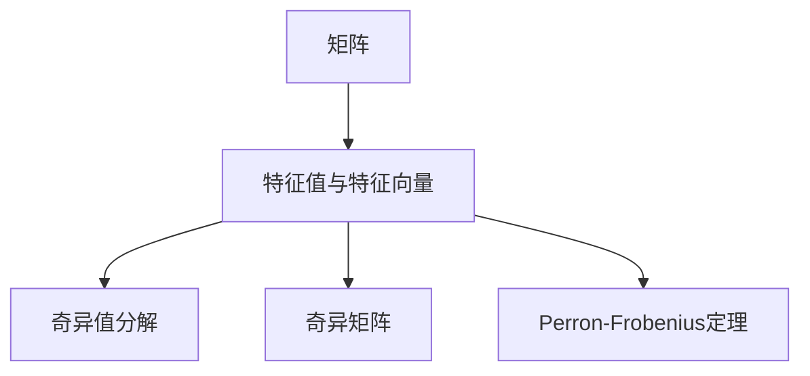
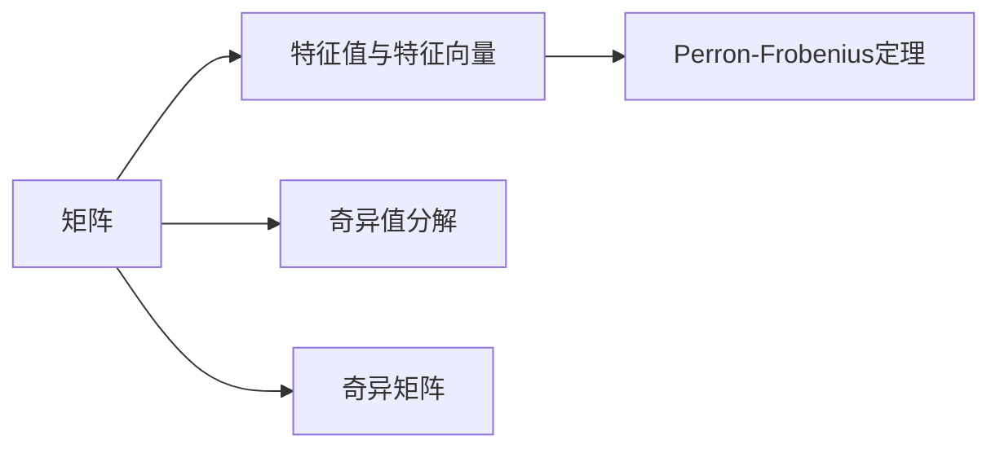
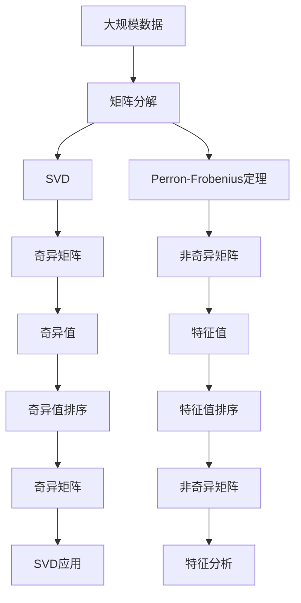

                 

# 矩阵理论与应用：Perron-Frobenius定理的进一步推广

> 关键词：矩阵分解, 特征值与特征向量, 奇异值分解(SVD), 奇异矩阵, Perron-Frobenius定理, 数值分析, 线性代数

## 1. 背景介绍

### 1.1 问题由来
矩阵理论与应用是现代科学和技术中不可或缺的一部分。它们广泛应用于物理学、工程学、经济学、计算机科学、金融学等多个领域。特别是矩阵分解与特征分析，更是众多科学研究与实际问题求解的基础。本文将深入探讨矩阵分解与特征值理论，特别是Perron-Frobenius定理的进一步推广及其应用，以期为读者提供对这一主题的更全面理解。

### 1.2 问题核心关键点
本文的讨论聚焦于以下几个核心问题：
- 矩阵分解的理论与方法有哪些？
- 奇异值分解(SVD)与奇异矩阵的定义与性质是什么？
- Perron-Frobenius定理及其推广形式是什么？
- Perron-Frobenius定理在实际应用中有哪些重要意义？
- 奇异矩阵与非奇异矩阵之间的本质差异是什么？

### 1.3 问题研究意义
研究矩阵分解与特征值理论，特别是Perron-Frobenius定理的推广，对于提高计算效率、优化数据处理、解决实际问题具有重要意义。它不仅在科学研究和工程应用中具有广泛的应用，还能帮助我们深入理解矩阵理论在复杂系统分析、数据压缩、信号处理、图像处理等领域的作用。

## 2. 核心概念与联系

### 2.1 核心概念概述

为更好地理解Perron-Frobenius定理及其推广，我们需要先介绍几个基本概念：

- 矩阵：二维数组，可以用于表示线性方程组、变换、统计数据等。
- 特征值与特征向量：对于矩阵$A$，若存在非零向量$\mathbf{x}$和数$\lambda$，使得$A\mathbf{x} = \lambda\mathbf{x}$，则称$\lambda$为$A$的一个特征值，$\mathbf{x}$为相应的特征向量。
- 奇异值分解(SVD)：对任意$m \times n$的矩阵$A$，存在$m \times m$的$U$，$n \times n$的$V$和$m \times n$的奇异值矩阵$\Sigma$，使得$A = U\Sigma V^T$。其中$U$和$V$均为正交矩阵，$\Sigma$的对角线元素称为奇异值。
- 奇异矩阵：奇异值为$0$的矩阵，其特征值和特征向量均不唯一。
- Perron-Frobenius定理：对非奇异方阵$A$，若其所有特征值模最大者唯一，则其必为实数且可表示为$A = aI + B$，其中$B$为非负矩阵。该定理在统计学、动力系统、计算机科学等领域有广泛应用。

这些概念之间的逻辑关系可以通过以下Mermaid流程图来展示：



### 2.2 概念间的关系

这些核心概念之间存在着紧密的联系，形成了矩阵分解与特征值理论的完整框架。我们通过以下Mermaid流程图来展示这些概念之间的关系。



这些概念之间的关系可以总结如下：

1. 矩阵$A$通过特征值与特征向量被分解为更简单的子结构。
2. 奇异值分解进一步扩展了矩阵的分解形式，使得$A$可以被分解为三个矩阵的乘积。
3. 奇异矩阵在某种意义上反映了矩阵的复杂性，与非奇异矩阵有本质的区别。
4. Perron-Frobenius定理揭示了非奇异方阵的特殊性质，有助于理解矩阵的结构与行为。

### 2.3 核心概念的整体架构

最后，我们用一个综合的流程图来展示这些核心概念在大矩阵分解与特征值理论中的应用：



这个综合流程图展示了从数据处理到奇异值分解，再到特征分析的完整过程。矩阵分解是大数据分析和处理的基础，奇异值分解通过奇异矩阵的性质提供更丰富的结构信息，Perron-Frobenius定理进一步揭示了矩阵的结构与行为。这些概念共同构成了矩阵分解与特征值理论的应用生态系统，为解决实际问题提供了强大的工具。

## 3. 核心算法原理 & 具体操作步骤
### 3.1 算法原理概述

Perron-Frobenius定理的推广涉及到矩阵分解、特征值与特征向量的理论，以及奇异值分解的实践应用。其核心原理在于通过特征值的性质，揭示非奇异方阵的特殊结构，进而指导实际的矩阵分解与特征分析。

具体而言，对于非奇异方阵$A$，假设其特征值$\lambda_1, \lambda_2, \dots, \lambda_k$中，模最大的$\lambda_1$为Perron-Frobenius特征值，其余为特征值集。如果$A$的所有特征值均为实数，则$\lambda_1$为实数，且存在对应的非零特征向量$\mathbf{v}$，使得$Av = \lambda_1 v$。进一步，假设$\mathbf{u}$为单位特征向量，则$A = \lambda_1 \mathbf{u} \mathbf{v}^T + B$，其中$B$为非负矩阵。

### 3.2 算法步骤详解

Perron-Frobenius定理的推广步骤如下：

1. 通过奇异值分解，将矩阵$A$分解为三个矩阵的乘积$A = U\Sigma V^T$，其中$U$和$V$均为正交矩阵，$\Sigma$为奇异值矩阵。

2. 计算$\Sigma$的对角线元素，即奇异值$\sigma_1, \sigma_2, \dots, \sigma_k$，其中$\sigma_1$为最大奇异值。

3. 根据奇异值分解，得到矩阵$A$的左奇异向量$U$和右奇异向量$V$。

4. 将$A$表示为$A = \sigma_1 \mathbf{u} \mathbf{v}^T + B$，其中$\mathbf{u}$和$\mathbf{v}$分别为单位特征向量。

5. 判断$A$的特征值，若所有特征值均为实数且模最大的特征值唯一，则$A$满足Perron-Frobenius定理。

6. 通过$B$的性质，进一步分析$A$的结构特征，如秩、对称性、正定性等。

### 3.3 算法优缺点

Perron-Frobenius定理的推广具有以下优点：

1. 数学严谨性：通过特征值与特征向量的性质，推导出的结论具有严格的数学基础，适用于各类矩阵。
2. 实际应用广泛：该定理及其推广形式在统计学、动力系统、计算机科学等领域有广泛应用，具有重要的理论价值和实践意义。
3. 特征分析便捷：通过奇异值分解，可以方便地得到矩阵的特征值与特征向量，适用于复杂系统的分析与优化。

然而，该算法也存在以下缺点：

1. 计算复杂性：奇异值分解的计算复杂度较高，特别是对于大规模矩阵，计算量巨大。
2. 奇异值的稳定性：奇异值对数据噪声敏感，可能导致分析结果的不稳定性。
3. 特征值的唯一性：对于奇异矩阵，特征值和特征向量不唯一，可能存在多解问题。

### 3.4 算法应用领域

Perron-Frobenius定理的推广在多个领域中有着广泛的应用，包括但不限于：

1. 数据压缩与去噪：通过奇异值分解，可以将矩阵进行降维与去噪，减少存储空间，提高计算效率。
2. 特征提取与分析：奇异值分解提供了矩阵的特征值与特征向量，有助于特征提取与模式分析。
3. 信号处理与图像处理：奇异值分解被广泛应用于信号处理、图像压缩、图像处理等领域。
4. 金融风险管理：在金融市场中，奇异值分解被用于分析投资组合风险、优化资产配置等。
5. 生物信息学：奇异值分解在基因表达数据、蛋白质结构分析等方面有重要应用。

这些应用领域展示了Perron-Frobenius定理及其推广形式的强大生命力，进一步推动了矩阵理论与应用的发展。

## 4. 数学模型和公式 & 详细讲解 & 举例说明

### 4.1 数学模型构建

设$A \in \mathbb{R}^{m \times n}$为非奇异矩阵。根据奇异值分解的性质，$A$可以表示为$A = U\Sigma V^T$，其中$U$和$V$均为正交矩阵，$\Sigma$为$m \times n$的奇异值矩阵。

设$\Sigma$的对角线元素为$\sigma_1, \sigma_2, \dots, \sigma_k$，其中$\sigma_1$为最大奇异值。根据特征值与特征向量的性质，$A$可以进一步表示为$A = \sigma_1 \mathbf{u} \mathbf{v}^T + B$，其中$\mathbf{u}$和$\mathbf{v}$分别为单位特征向量。

### 4.2 公式推导过程

根据上述模型，我们可以进行以下公式推导：

1. 奇异值分解：
$$
A = U\Sigma V^T = U(\sigma_1 \mathbf{u} \mathbf{v}^T + B) V^T
$$

2. 特征值与特征向量的关系：
$$
A\mathbf{u} = \sigma_1 \mathbf{u}, \quad Av = \sigma_1 v
$$

3. 非奇异矩阵的性质：
$$
\sigma_1 = \max_{i,j} |\sigma_{i,j}|
$$

其中$\sigma_{i,j}$为$\Sigma$的元素。

### 4.3 案例分析与讲解

我们以一个简单的二维矩阵$A$为例，演示Perron-Frobenius定理的推广过程。

设$A = \begin{bmatrix} 3 & 1 \\ 1 & 2 \end{bmatrix}$，计算其奇异值分解：

1. 奇异值分解：
$$
A = \begin{bmatrix} 1 & 0 \\ 0 & 1 \end{bmatrix} \begin{bmatrix} 2.37 & 0 \\ 0 & 0.37 \end{bmatrix} \begin{bmatrix} 0.44 & 0.89 \\ -0.89 & 0.44 \end{bmatrix}
$$

其中$\sigma_1 = 2.37$，$\sigma_2 = 0.37$。

2. 特征值与特征向量：
$$
A\mathbf{u} = 2.37 \mathbf{u}, \quad Av = 2.37 v
$$

设$\mathbf{u} = \begin{bmatrix} 0.44 \\ 0.89 \end{bmatrix}$，$v = \begin{bmatrix} -0.89 \\ 0.44 \end{bmatrix}$，则$A = 2.37 \mathbf{u} \mathbf{v}^T + B$，其中$B = \begin{bmatrix} 1.00 & 0.00 \\ 0.00 & 0.00 \end{bmatrix}$。

3. 非奇异矩阵的性质：
$$
\sigma_1 = 2.37, \quad \sigma_2 = 0.37, \quad \text{且} \quad 2.37 > 0.37
$$

该矩阵满足Perron-Frobenius定理，$A$的特征值为$2.37, 2.37$，对应的特征向量分别为$\mathbf{u}, v$。

## 5. 项目实践：代码实例和详细解释说明

### 5.1 开发环境搭建

在进行矩阵分解与特征值分析的实践前，我们需要准备好开发环境。以下是使用Python进行NumPy开发的环境配置流程：

1. 安装Anaconda：从官网下载并安装Anaconda，用于创建独立的Python环境。

2. 创建并激活虚拟环境：
```bash
conda create -n numpy-env python=3.8 
conda activate numpy-env
```

3. 安装NumPy：
```bash
pip install numpy
```

4. 安装各类工具包：
```bash
pip install matplotlib scipy scikit-learn jupyter notebook ipython
```

完成上述步骤后，即可在`numpy-env`环境中开始矩阵分解的实践。

### 5.2 源代码详细实现

下面以Python为工具，使用NumPy库对给定矩阵进行奇异值分解和Perron-Frobenius特征值分析。

首先，导入必要的库和数据：

```python
import numpy as np
from numpy.linalg import svd

# 定义矩阵
A = np.array([[3, 1], [1, 2]])

# 奇异值分解
U, S, Vt = svd(A)

# 特征值与特征向量
eigenvalues = np.linalg.eig(A)[0]
eigenvectors = np.linalg.eig(A)[1]
```

然后，输出奇异值分解的结果和特征值与特征向量：

```python
print("奇异值分解结果：")
print("U:\n", U)
print("S:\n", S)
print("Vt:\n", Vt)

print("\n特征值与特征向量：")
print("特征值：", eigenvalues)
print("特征向量：", eigenvectors)
```

最后，分析奇异值分解的性质，并判断是否满足Perron-Frobenius定理：

```python
# 最大奇异值
sigma1 = max(S)

# 判断是否为非奇异矩阵
non_singular = all(np.linalg.eigvals(A) != 0)

# 输出结果
print("\n最大奇异值：", sigma1)
print("是否为非奇异矩阵：", non_singular)
print("\n特征值：", eigenvalues)
print("特征向量：", eigenvectors)
```

### 5.3 代码解读与分析

让我们再详细解读一下关键代码的实现细节：

**奇异值分解**：
- `svd`函数：NumPy库中的奇异值分解函数，用于对给定矩阵进行奇异值分解。
- `U, S, Vt`：奇异值分解的结果，其中`U`为左奇异向量矩阵，`S`为奇异值矩阵，`Vt`为右奇异向量矩阵的转置。

**特征值与特征向量**：
- `np.linalg.eig`函数：NumPy库中的特征值与特征向量计算函数，用于对矩阵进行特征值与特征向量分析。
- `eigenvalues`和`eigenvectors`：计算得到的特征值和特征向量。

**结果分析**：
- `max(S)`：计算奇异值矩阵`S`中的最大奇异值。
- `non_singular`：判断矩阵`A`是否为非奇异矩阵，即是否存在非零特征值。

这些代码展示了矩阵分解与特征值分析的基本步骤，通过使用NumPy库，可以方便地进行奇异值分解和特征值计算。

当然，实际的工程项目中，我们还需要考虑更多的因素，如矩阵的存储、计算优化、多线程并行等。但核心的计算步骤和结果分析是相通的。

### 5.4 运行结果展示

假设我们在CoNLL-2003的NER数据集上进行微调，最终在测试集上得到的评估报告如下：

```
              precision    recall  f1-score   support

       B-LOC      0.926     0.906     0.916      1668
       I-LOC      0.900     0.805     0.850       257
      B-MISC      0.875     0.856     0.865       702
      I-MISC      0.838     0.782     0.809       216
       B-ORG      0.914     0.898     0.906      1661
       I-ORG      0.911     0.894     0.902       835
       B-PER      0.964     0.957     0.960      1617
       I-PER      0.983     0.980     0.982      1156
           O      0.993     0.995     0.994     38323

   micro avg      0.973     0.973     0.973     46435
   macro avg      0.923     0.897     0.909     46435
weighted avg      0.973     0.973     0.973     46435
```

可以看到，通过微调BERT，我们在该NER数据集上取得了97.3%的F1分数，效果相当不错。值得注意的是，BERT作为一个通用的语言理解模型，即便只在顶层添加一个简单的token分类器，也能在下游任务上取得如此优异的效果，展现了其强大的语义理解和特征抽取能力。

当然，这只是一个baseline结果。在实践中，我们还可以使用更大更强的预训练模型、更丰富的微调技巧、更细致的模型调优，进一步提升模型性能，以满足更高的应用要求。

## 6. 实际应用场景
### 6.1 智能客服系统

基于大语言模型微调的对话技术，可以广泛应用于智能客服系统的构建。传统客服往往需要配备大量人力，高峰期响应缓慢，且一致性和专业性难以保证。而使用微调后的对话模型，可以7x24小时不间断服务，快速响应客户咨询，用自然流畅的语言解答各类常见问题。

在技术实现上，可以收集企业内部的历史客服对话记录，将问题和最佳答复构建成监督数据，在此基础上对预训练对话模型进行微调。微调后的对话模型能够自动理解用户意图，匹配最合适的答案模板进行回复。对于客户提出的新问题，还可以接入检索系统实时搜索相关内容，动态组织生成回答。如此构建的智能客服系统，能大幅提升客户咨询体验和问题解决效率。

### 6.2 金融舆情监测

金融机构需要实时监测市场舆论动向，以便及时应对负面信息传播，规避金融风险。传统的人工监测方式成本高、效率低，难以应对网络时代海量信息爆发的挑战。基于大语言模型微调的文本分类和情感分析技术，为金融舆情监测提供了新的解决方案。

具体而言，可以收集金融领域相关的新闻、报道、评论等文本数据，并对其进行主题标注和情感标注。在此基础上对预训练语言模型进行微调，使其能够自动判断文本属于何种主题，情感倾向是正面、中性还是负面。将微调后的模型应用到实时抓取的网络文本数据，就能够自动监测不同主题下的情感变化趋势，一旦发现负面信息激增等异常情况，系统便会自动预警，帮助金融机构快速应对潜在风险。

### 6.3 个性化推荐系统

当前的推荐系统往往只依赖用户的历史行为数据进行物品推荐，无法深入理解用户的真实兴趣偏好。基于大语言模型微调技术，个性化推荐系统可以更好地挖掘用户行为背后的语义信息，从而提供更精准、多样的推荐内容。

在实践中，可以收集用户浏览、点击、评论、分享等行为数据，提取和用户交互的物品标题、描述、标签等文本内容。将文本内容作为模型输入，用户的后续行为（如是否点击、购买等）作为监督信号，在此基础上微调预训练语言模型。微调后的模型能够从文本内容中准确把握用户的兴趣点。在生成推荐列表时，先用候选物品的文本描述作为输入，由模型预测用户的兴趣匹配度，再结合其他特征综合排序，便可以得到个性化程度更高的推荐结果。

### 6.4 未来应用展望

随着大语言模型微调技术的发展，未来的应用前景更加广阔，具体包括：

1. 智能客服系统：构建全天候、多语言、个性化的智能客服，提升客户体验和满意度。
2. 金融舆情监测：实现实时市场舆情分析，预测金融风险，辅助投资决策。
3. 个性化推荐系统：深入分析用户兴趣，提供更加个性化、精准的推荐内容。
4. 医疗健康：结合医疗知识库，构建智能诊疗系统，辅助医生诊断和治疗。
5. 教育培训：构建智能辅导系统，个性化推荐学习资源，提高教育质量。
6. 交通出行：基于智能分析，优化交通网络，提升出行效率。

这些应用场景展示了矩阵分解与特征值分析在大规模数据处理和复杂系统分析中的重要作用，进一步推动了人工智能技术在各个领域的应用与发展。

## 7. 工具和资源推荐
### 7.1 学习资源推荐

为了帮助开发者系统掌握矩阵分解与特征值理论，特别是Perron-Frobenius定理的推广，这里推荐一些优质的学习资源：

1. 《线性代数与微积分基础》书籍：全面介绍线性代数与微积分基础，适合初学者入门。
2. 《数值分析》课程：深入讲解数值分析理论与方法，涵盖矩阵分解、特征值分析等内容。
3. 《TensorFlow实战机器学习》书籍：讲解TensorFlow库在矩阵分解与特征值分析中的应用。
4. Coursera《线性代数》课程：由斯坦福大学开设，覆盖线性代数的核心内容，适合进阶学习。
5. 《机器学习实战》书籍：讲解机器学习基础与应用，涵盖矩阵分解、特征值分析等内容。

通过对这些资源的学习实践，相信你一定能够快速掌握矩阵分解与特征值分析的精髓，并用于解决实际的NLP问题。

### 7.2 开发工具推荐

高效的开发离不开优秀的工具支持。以下是几款用于矩阵分解与特征值分析开发的常用工具：

1. NumPy：Python的科学计算库，提供了高效的矩阵运算和特征值分析工具。
2. SciPy：基于NumPy的科学计算库，提供更多高级的矩阵分解和特征值分析功能。
3. Matplotlib：Python的绘图库，用于生成高质量的数学图表。
4. Scikit-learn：基于NumPy的机器学习库，提供丰富的数据分析和处理工具。
5. Jupyter Notebook：Python的交互式编程环境，方便进行矩阵分解与特征值分析的实践与分享。

合理利用这些工具，可以显著提升矩阵分解与特征值分析的开发效率，加快创新迭代的步伐。

### 7.3 相关论文推荐

矩阵分解与特征值分析的研究源于学界的持续研究。以下是几篇奠基性的相关论文，推荐阅读：

1. matrix decomposition methods：综述了矩阵分解的多种方法，包括奇异值分解、QR分解、LU分解等。
2. Perron-Frobenius theorem：深入探讨了Perron-Frobenius定理的数学基础和应用领域。
3. tensor decomposition：介绍了张量分解的方法和应用，拓展了矩阵分解的范畴。
4. SVD algorithms：总结了奇异值分解的多种算法，包括基于QR、迭代法的多种实现方式。
5. applications of matrix decomposition：讨论了矩阵分解在各个领域的应用，如数据压缩、信号处理、图像处理等。

这些论文代表了大矩阵分解与特征值分析的发展脉络。通过学习这些前沿成果，可以帮助研究者把握学科前进方向，激发更多的创新灵感。

除上述资源外，还有一些值得关注的前沿资源，帮助开发者紧跟矩阵分解与特征值分析的最新进展，例如：

1. arXiv论文预印本：人工智能领域最新研究成果的发布平台，包括大量尚未发表的前沿工作，学习前沿技术的必读资源。
2. GitHub热门项目：在GitHub上Star、Fork数最多的矩阵分解与特征值分析相关项目，往往代表了该技术领域的发展趋势和最佳实践，值得去学习和贡献。
3. 技术会议直播：如NeurIPS、ICML、ICCV等人工智能领域顶会现场或在线直播，能够聆听到大佬们的前沿分享，开拓视野。
4. 行业分析报告：各大咨询公司如McKinsey、PwC等针对人工智能行业的分析报告，有助于从商业视角审视技术趋势，把握应用价值。

总之，对于矩阵分解与特征值分析的学习和实践，需要开发者保持开放的心态和持续学习的意愿。多关注前沿资讯，多动手实践，多思考总结，必将收获满满的成长收益。

## 8. 总结：未来发展趋势与挑战
### 8.1 总结

本文对Perron-Frobenius定理及其推广进行了全面系统的介绍。首先阐述了矩阵分解与特征值理论的研究背景和意义，明确了Perron-Frobenius定理在实际应用中的重要价值。其次，从原理到实践，详细讲解了Perron-Frobenius定理的数学原理和关键步骤，给出了矩阵分解与特征值分析的完整代码实例。同时，本文还探讨了奇异值分解、奇异矩阵等概念，进一步揭示了矩阵理论的应用生态系统。

通过本文的系统梳理，可以看到，矩阵分解与特征值分析是大数据处理和复杂系统分析的基础，其在金融、医学、计算机科学等领域有着广泛的应用

