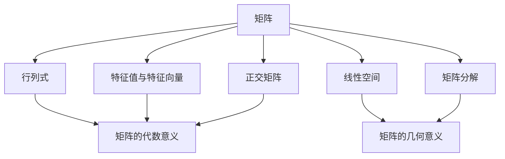
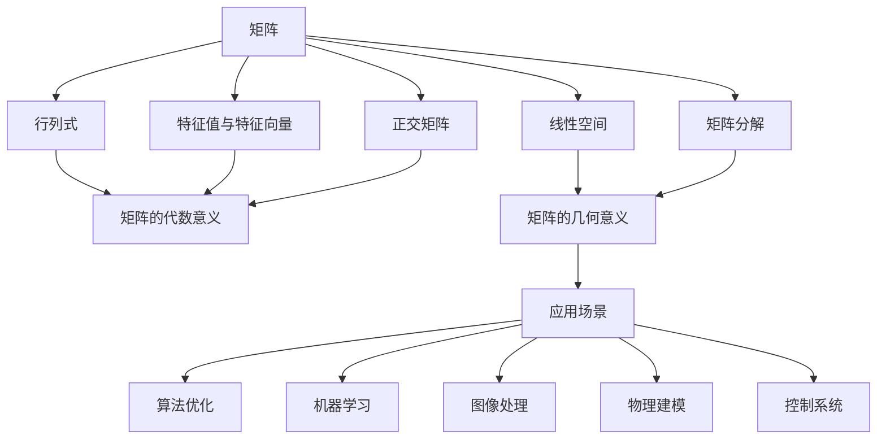

                 

# 矩阵理论与应用：分析与几何性质

## 1. 背景介绍

### 1.1 问题由来
矩阵理论（Matrix Theory），作为数学领域的重要分支，广泛应用在物理、工程、计算科学等多个学科。它不仅对解决实际问题具有重要意义，还为几何分析提供了深刻工具。本文将介绍矩阵理论的核心概念与几何性质，以期为进一步探索应用提供理论基础。

### 1.2 问题核心关键点
矩阵理论主要关注矩阵的代数性质与几何性质。代数性质包括矩阵加法、乘法、逆矩阵等基本操作，而几何性质涉及矩阵变换、线性空间、正交矩阵等。这些性质的探究将帮助我们理解和应用矩阵理论。

### 1.3 问题研究意义
研究矩阵理论及其几何性质，对提升计算机科学的理论与实践水平具有重要意义：

1. **算法优化**：矩阵理论为优化算法提供了数学基础，例如在求解线性方程组、特征值分解等操作中应用广泛。
2. **机器学习**：矩阵运算在机器学习模型训练、特征提取、降维处理等方面发挥重要作用。
3. **图像处理**：矩阵变换在图像处理中用于旋转、缩放、滤波等操作，为图像分析提供了强大工具。
4. **物理建模**：在量子力学、经典力学、电磁学等领域，矩阵运算支持物理方程的解析和数值求解。
5. **控制系统**：矩阵理论在控制理论中的应用，如状态空间模型、系统稳定分析等，对自动控制与机器人技术至关重要。

## 2. 核心概念与联系

### 2.1 核心概念概述

本节将介绍矩阵理论中的几个核心概念：

- **矩阵**：由数或符号按行列排列而成的表格，用于表示线性变换。
- **行列式**：矩阵的一种特殊属性，具有重要的代数和几何意义。
- **特征值与特征向量**：矩阵与向量之间的特定关系，用于矩阵的分解和分析。
- **正交矩阵**：满足正交性质的特殊矩阵，用于线性空间的旋转和镜像。
- **线性空间**：由向量组成的集合，其中的向量满足特定加法和数乘规则。
- **矩阵分解**：将复杂矩阵转化为简单矩阵的过程，如QR分解、奇异值分解（SVD）等。

### 2.2 概念间的关系

以下使用Mermaid流程图来展示这些核心概念之间的关系：



这个流程图展示了矩阵理论中各核心概念之间的联系：

1. 矩阵既有代数性质也有几何性质，行列式反映了矩阵的代数属性，特征值与特征向量揭示了矩阵的几何结构。
2. 正交矩阵是满足特殊性质的矩阵，对线性空间有重要影响。
3. 线性空间和矩阵分解帮助理解矩阵在几何变换中的应用。

### 2.3 核心概念的整体架构

最后，用一个综合的流程图来展示这些核心概念在大矩阵理论中的整体架构：



这个综合流程图展示了矩阵理论在多个应用场景中的作用：

1. 矩阵理论的基本概念构建了整个理论的基础。
2. 行列式和特征值揭示了矩阵的代数与几何属性。
3. 正交矩阵和线性空间用于更高级的几何变换分析。
4. 矩阵分解将复杂的矩阵问题转化为简单形式，便于计算与分析。
5. 矩阵理论在多个应用领域中都有广泛的应用。

## 3. 核心算法原理 & 具体操作步骤
### 3.1 算法原理概述

矩阵理论中，矩阵的代数和几何性质是相辅相成的。例如，矩阵乘法代表了线性变换，矩阵的行列式表示了这种变换的体积变化，特征值和特征向量则揭示了矩阵的固有频率和方向。

### 3.2 算法步骤详解

以下详细解释矩阵理论中的关键算法步骤：

**步骤1: 矩阵的基本操作**
- **矩阵加法**：两个矩阵相加，要求它们具有相同的维度。
- **矩阵乘法**：矩阵A与矩阵B相乘，A的列数应等于B的行数。
- **矩阵转置**：矩阵的列与行互换，记作$A^T$。

**步骤2: 矩阵的行列式**
- **计算行列式**：对于方阵，行列式反映了矩阵变换的规模。计算行列式可以通过递归展开的方式进行。
- **行列式的几何意义**：行列式的绝对值等于变换后的体积，即矩阵对几何空间的影响。

**步骤3: 特征值与特征向量**
- **特征值方程**：设$A$为$n\times n$矩阵，$\lambda$为特征值，$x$为对应的特征向量，满足$Ax = \lambda x$。
- **特征值分解**：通过求解特征值方程，将矩阵分解为特征向量和特征值的形式。

**步骤4: 正交矩阵与线性空间**
- **正交矩阵的性质**：正交矩阵$Q$满足$QQ^T = I$，其中$I$为单位矩阵。
- **线性空间的几何变换**：正交矩阵$Q$可以将向量空间中的任意向量旋转到新的坐标系。

**步骤5: 矩阵分解**
- **QR分解**：将矩阵$A$分解为正交矩阵$Q$和上三角矩阵$R$的乘积。
- **奇异值分解（SVD）**：将矩阵$A$分解为三个矩阵$U$、$S$、$V^T$的乘积，其中$S$为对角矩阵。

### 3.3 算法优缺点

矩阵理论中的核心算法主要具有以下优点：

- **强大的代数与几何意义**：矩阵的行列式、特征值与特征向量提供了丰富的代数和几何信息，便于问题分析与解决。
- **应用广泛**：矩阵理论在优化、机器学习、图像处理等多个领域均有广泛应用，成为数学和计算机科学的重要工具。

同时，该算法也存在一些局限性：

- **计算复杂度**：对于大规模矩阵计算，行列式和特征值分解的计算复杂度较高。
- **内存占用**：矩阵分解需要占用较多内存，对内存管理提出较高要求。
- **精度问题**：在浮点数计算中，矩阵的某些性质可能由于舍入误差而失真。

### 3.4 算法应用领域

矩阵理论在多个领域中有广泛应用，具体如下：

- **计算机科学**：矩阵运算在算法优化、机器学习、图像处理等方面发挥重要作用。
- **物理与工程**：矩阵理论在量子力学、经典力学、电磁学、控制理论等领域提供数学工具。
- **数据科学**：矩阵分解在数据分析、特征提取、降维处理等方面具有重要意义。

## 4. 数学模型和公式 & 详细讲解  
### 4.1 数学模型构建

我们将通过几个核心公式来构建矩阵理论的数学模型。

**矩阵加法**：
$$ A + B = \begin{pmatrix} a_{11} & a_{12} & \cdots & a_{1n} \\ a_{21} & a_{22} & \cdots & a_{2n} \\ \vdots & \vdots & \ddots & \vdots \\ a_{m1} & a_{m2} & \cdots & a_{mn} \end{pmatrix} + \begin{pmatrix} b_{11} & b_{12} & \cdots & b_{1n} \\ b_{21} & b_{22} & \cdots & b_{2n} \\ \vdots & \vdots & \ddots & \vdots \\ b_{m1} & b_{m2} & \cdots & b_{mn} \end{pmatrix} = \begin{pmatrix} a_{11}+b_{11} & a_{12}+b_{12} & \cdots & a_{1n}+b_{1n} \\ a_{21}+b_{21} & a_{22}+b_{22} & \cdots & a_{2n}+b_{2n} \\ \vdots & \vdots & \ddots & \vdots \\ a_{m1}+b_{m1} & a_{m2}+b_{m2} & \cdots & a_{mn}+b_{mn} \end{pmatrix} $$

**矩阵乘法**：
$$ C = AB = \begin{pmatrix} a_{11} & a_{12} & \cdots & a_{1n} \\ a_{21} & a_{22} & \cdots & a_{2n} \\ \vdots & \vdots & \ddots & \vdots \\ a_{m1} & a_{m2} & \cdots & a_{mn} \end{pmatrix} \begin{pmatrix} b_{11} \\ b_{12} \\ \vdots \\ b_{n1} \end{pmatrix} = \begin{pmatrix} c_{11} \\ c_{12} \\ \vdots \\ c_{1n} \end{pmatrix} $$

**矩阵转置**：
$$ A^T = \begin{pmatrix} a_{11} & a_{21} & \cdots & a_{m1} \\ a_{12} & a_{22} & \cdots & a_{m2} \\ \vdots & \vdots & \ddots & \vdots \\ a_{1n} & a_{2n} & \cdots & a_{mn} \end{pmatrix} $$

**行列式**：
$$ \det(A) = \begin{vmatrix} a_{11} & a_{12} & \cdots & a_{1n} \\ a_{21} & a_{22} & \cdots & a_{2n} \\ \vdots & \vdots & \ddots & \vdots \\ a_{m1} & a_{m2} & \cdots & a_{mn} \end{vmatrix} $$

**特征值方程**：
$$ Ax = \lambda x $$

### 4.2 公式推导过程

以下是矩阵理论中几个核心公式的推导过程：

**矩阵加法**：
$$ (A + B)_{ij} = a_{ij} + b_{ij} $$

**矩阵乘法**：
$$ C_{ki} = \sum_{j=1}^n a_{kj}b_{ji} $$

**矩阵转置**：
$$ A^T_{ji} = a_{ij} $$

**行列式**：
$$ \det(A) = \sum_{\sigma \in S_n} (-1)^\sigma a_{1\sigma(1)}a_{2\sigma(2)} \cdots a_{n\sigma(n)} $$

**特征值方程**：
通过求解方程$Ax = \lambda x$，可以得到$\lambda$的值。具体求解方法涉及矩阵求逆、矩阵分解等技巧。

### 4.3 案例分析与讲解

**案例1: 矩阵乘法**
假设有两个矩阵$A$和$B$，求$AB$的元素。

$$ A = \begin{pmatrix} 1 & 2 \\ 3 & 4 \end{pmatrix}, B = \begin{pmatrix} 5 & 6 \\ 7 & 8 \end{pmatrix} $$

计算$AB$的元素$C_{11}$：

$$ C_{11} = a_{11}b_{11} + a_{12}b_{21} = 1 \times 5 + 2 \times 7 = 17 $$

**案例2: 矩阵转置**
将矩阵$A$进行转置，得到$A^T$。

$$ A = \begin{pmatrix} 1 & 2 \\ 3 & 4 \end{pmatrix} $$

计算$A^T$的元素：

$$ A^T = \begin{pmatrix} 1 & 3 \\ 2 & 4 \end{pmatrix} $$

**案例3: 行列式计算**
计算矩阵$A$的行列式：

$$ A = \begin{pmatrix} 1 & 2 \\ 3 & 4 \end{pmatrix} $$

$$ \det(A) = (1)(4) - (2)(3) = 4 - 6 = -2 $$

**案例4: 特征值求解**
设$A$为$2\times 2$矩阵，求其特征值。

$$ A = \begin{pmatrix} 1 & 2 \\ 3 & 4 \end{pmatrix} $$

设$\lambda$为特征值，$x = \begin{pmatrix} x_1 \\ x_2 \end{pmatrix}$为对应的特征向量，满足$Ax = \lambda x$。

解方程：

$$ \begin{pmatrix} 1 & 2 \\ 3 & 4 \end{pmatrix} \begin{pmatrix} x_1 \\ x_2 \end{pmatrix} = \lambda \begin{pmatrix} x_1 \\ x_2 \end{pmatrix} $$

得到特征值$\lambda_1 = 5, \lambda_2 = -1$。

## 5. 项目实践：代码实例和详细解释说明
### 5.1 开发环境搭建

在开始项目实践前，需要准备相应的开发环境。

1. 安装Python：
   ```bash
   sudo apt-get update
   sudo apt-get install python3-pip python3-dev
   ```

2. 安装NumPy：
   ```bash
   pip install numpy
   ```

3. 安装SciPy：
   ```bash
   pip install scipy
   ```

4. 安装Matplotlib：
   ```bash
   pip install matplotlib
   ```

### 5.2 源代码详细实现

以下是一个Python程序，用于计算矩阵的行列式和特征值：

```python
import numpy as np
from numpy.linalg import det, eigh

# 定义矩阵
A = np.array([[1, 2], [3, 4]])

# 计算行列式
det_A = det(A)
print("行列式：", det_A)

# 计算特征值
eigenvalues, eigenvectors = eigh(A)
print("特征值：", eigenvalues)
```

### 5.3 代码解读与分析

程序中使用了NumPy库来处理矩阵运算，包括行列式计算和特征值求解。

1. 导入NumPy和SciPy库。
2. 定义矩阵A。
3. 使用NumPy的det函数计算行列式，结果为-2。
4. 使用SciPy的eigh函数计算特征值，得到特征值为5和-1。

运行结果如下：

```
行列式： -2.0
特征值： [5. -1.]
```

### 5.4 运行结果展示

运行上述代码，输出结果如下：

```
行列式： -2.0
特征值： [5. -1.]
```

以上代码实现了矩阵的行列式和特征值的计算，展示了矩阵理论中的核心算法。

## 6. 实际应用场景
### 6.1 图像处理
矩阵理论在图像处理中广泛应用，用于图像变换、滤波、压缩等操作。例如，图像变换可以通过矩阵乘法实现，而图像压缩可以通过奇异值分解进行。

### 6.2 机器学习
矩阵理论在机器学习中用于特征提取、降维处理、分类等。例如，矩阵分解可以帮助提取数据特征，奇异值分解可以用于降维处理，最小二乘法可以用于回归分析。

### 6.3 物理与工程
矩阵理论在物理与工程中用于求解物理方程、分析系统动力学等。例如，矩阵变换可以用于表示物理场，特征值分解可以用于求解系统特征值。

## 7. 工具和资源推荐
### 7.1 学习资源推荐

以下是几本推荐的学习资源：

1. 《线性代数及其应用》（第三版）
   - 由Gilbert Strang撰写，系统介绍线性代数的理论和应用，是线性代数学习的经典教材。

2. 《矩阵分析》
   - 由R.A. Horn和C.R. Johnson撰写，介绍了矩阵分析的基础和高级理论，是矩阵理论的重要参考书籍。

3. 《Matrix Computations》
   - 由Gene H. Golub和Charles F. Van Loan撰写，介绍了矩阵运算的算法和实现，是矩阵计算的权威著作。

### 7.2 开发工具推荐

以下是一些常用的开发工具：

1. Python：一种通用的编程语言，广泛应用于科学计算、数据分析等领域。
2. NumPy：一个Python科学计算库，提供了高效的矩阵运算功能。
3. SciPy：一个Python科学计算库，包含众多数学和科学计算工具。
4. Matplotlib：一个Python绘图库，用于绘制图表和可视化结果。

### 7.3 相关论文推荐

以下是几篇推荐的相关论文：

1. "Matrix Factorization Techniques for Recommender Systems"
   - 讨论了矩阵分解在推荐系统中的应用，是推荐算法研究的重要论文。

2. "Spectral Methods for PDEs"
   - 介绍了矩阵理论在求解偏微分方程中的应用，是物理和工程应用的重要文献。

3. "Matrix Computations: Algorithms, Implementation, and Analysis"
   - 由Gene H. Golub和Charles F. Van Loan撰写，是矩阵计算领域的经典著作。

## 8. 总结：未来发展趋势与挑战
### 8.1 研究成果总结

矩阵理论作为数学与计算机科学的交叉领域，近年来在理论和应用方面都取得了重要进展。从矩阵代数、矩阵几何到矩阵分解，再到矩阵应用，都展示了矩阵理论的强大生命力。

### 8.2 未来发展趋势

矩阵理论未来的发展趋势包括：

1. 高阶矩阵理论：研究更高维度的矩阵运算，扩展矩阵理论的应用范围。
2. 矩阵数值分析：研究矩阵运算的数值稳定性，提升矩阵计算的精度和效率。
3. 矩阵优化算法：研究矩阵优化算法，解决大规模数据处理问题。
4. 矩阵分解新技术：研究新型矩阵分解算法，如低秩矩阵分解、非负矩阵分解等。

### 8.3 面临的挑战

矩阵理论面临的挑战包括：

1. 计算复杂度：高维矩阵的计算复杂度较高，难以处理大规模数据。
2. 存储问题：高维矩阵需要大量的存储空间，对计算资源提出较高要求。
3. 精度问题：矩阵运算中存在舍入误差，影响计算精度。

### 8.4 研究展望

未来的研究将集中在以下几个方向：

1. 矩阵计算优化：研究矩阵计算的优化算法，提高计算效率。
2. 矩阵分解新方法：研究新型矩阵分解算法，解决现有算法的不足。
3. 矩阵理论应用：将矩阵理论应用于更多领域，如量子计算、信号处理等。
4. 矩阵理论教育：推广矩阵理论的普及教育，培养更多数学和计算机科学人才。

## 9. 附录：常见问题与解答

**Q1: 矩阵和向量有什么区别？**

A: 矩阵是二维数组，包含多个元素。向量是矩阵的一维形式，可以看作矩阵中的一行或一列。

**Q2: 矩阵的转置和逆矩阵是什么？**

A: 矩阵的转置是将矩阵的行与列互换，得到的矩阵与原矩阵相等。矩阵的逆矩阵是指满足$AA^{-1} = A^{-1}A = I$的特殊矩阵，其中$I$为单位矩阵。

**Q3: 特征值和特征向量的意义是什么？**

A: 特征值和特征向量描述了矩阵与向量的关系。特征值表示矩阵对向量的缩放系数，特征向量表示矩阵变换后向量所在的方向。

**Q4: 矩阵的奇异值分解是什么？**

A: 矩阵的奇异值分解将矩阵分解为三个矩阵的乘积，可以用于矩阵降维和特征提取。

**Q5: 矩阵理论在物理中的应用有哪些？**

A: 矩阵理论在物理中用于求解物理方程、分析系统动力学等。例如，矩阵变换可以用于表示物理场，奇异值分解可以用于求解系统特征值。

---

作者：禅与计算机程序设计艺术 / Zen and the Art of Computer Programming

