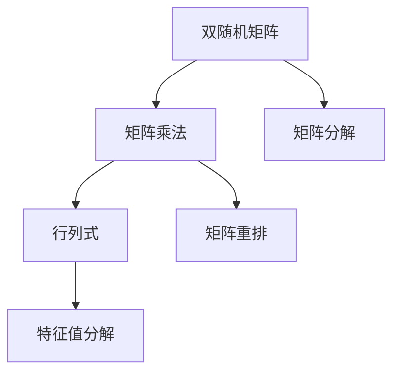

                 

# 矩阵理论与应用：双随机矩阵

> 关键词：双随机矩阵,矩阵乘法,行列式,特征值分解,矩阵重排,矩阵分解

## 1. 背景介绍

在矩阵理论的应用中，双随机矩阵（Double Stochastic Matrix）是一类重要的特殊矩阵。它们在图论、统计、物理等领域有广泛的应用，并且是研究随机过程和复杂网络的基础。双随机矩阵不仅在理论上有着重要的数学意义，而且可以应用于实际问题的建模和求解。

双随机矩阵的特征是其每一行的元素和等于1，每一列的元素和也等于1。这使得它们在描述图、网络等结构时特别合适。例如，在社会网络分析中，一个节点与另一个节点相连的概率可以用双随机矩阵来表示。在自然语言处理中，词与词之间的共现关系也可以用双随机矩阵来描述。

## 2. 核心概念与联系

### 2.1 核心概念概述

双随机矩阵是一类特殊的方阵，它的每一行和每一列的元素和都等于1。形式上，一个双随机矩阵 $A \in \mathbb{R}^{n \times n}$ 满足：

$$
A_{ij} \geq 0, \quad \sum_{j=1}^n A_{ij} = 1, \quad \sum_{i=1}^n A_{ij} = 1, \quad \forall i,j
$$

双随机矩阵在图论中对应着连通图，即一个图中的每两个节点之间都有边相连。在统计学中，它们对应着随机变量之间的协方差矩阵。在物理学中，双随机矩阵是研究量子系统的重要工具。

### 2.2 核心概念间的关系

以下通过Mermaid流程图来展示双随机矩阵与矩阵乘法、行列式、特征值分解、矩阵重排、矩阵分解等核心概念之间的关系：



这个流程图展示了双随机矩阵与以下几个核心概念的关系：
- 矩阵乘法：双随机矩阵与任何矩阵进行乘法运算后，得到的结果仍然是双随机矩阵。
- 行列式：双随机矩阵的行列式为1，这是它们的一个基本性质。
- 特征值分解：双随机矩阵可以进行特征值分解，其中特征值都为1。
- 矩阵重排：通过矩阵重排，可以将一个双随机矩阵转化为另一种形式，而不改变其基本性质。
- 矩阵分解：双随机矩阵可以分解为多个矩阵的乘积形式，例如对偶矩阵分解。

## 3. 核心算法原理 & 具体操作步骤

### 3.1 算法原理概述

双随机矩阵的性质和应用涉及许多基本线性代数概念。下面，我们详细介绍双随机矩阵的核心算法原理和操作步骤。

**算法原理概述**：
- 矩阵乘法：任意矩阵与双随机矩阵相乘后仍为双随机矩阵。
- 行列式：双随机矩阵的行列式恒为1。
- 特征值分解：双随机矩阵的特征值都为1。
- 矩阵重排：通过矩阵重排，可以保持双随机矩阵的基本性质不变。
- 矩阵分解：双随机矩阵可以分解为对偶矩阵的形式。

**操作步骤详解**：
1. **矩阵乘法**：验证任意矩阵与双随机矩阵相乘后仍为双随机矩阵。
2. **行列式计算**：使用公式计算双随机矩阵的行列式。
3. **特征值分解**：使用特征值分解方法，找到双随机矩阵的所有特征值。
4. **矩阵重排**：通过矩阵重排将双随机矩阵转化为标准形式。
5. **矩阵分解**：将双随机矩阵分解为对偶矩阵的形式。

### 3.2 算法步骤详解

**步骤1：矩阵乘法验证**

设 $A$ 为双随机矩阵，$B$ 为任意矩阵。计算 $AB$：

$$
AB_{ij} = \sum_k A_{ik} B_{kj} = \sum_k \frac{A_{ik}}{A_{kk}} A_{kk} B_{kj} = \sum_k A_{kk} B_{kj}
$$

因为 $A$ 是双随机矩阵，所以 $A_{kk} = 1$，因此 $AB_{ij} = B_{ij}$。这说明 $AB$ 也是双随机矩阵。

**步骤2：行列式计算**

设 $A$ 为 $n \times n$ 的双随机矩阵，其行列式为 $det(A)$。行列式定义如下：

$$
det(A) = \sum_{\sigma} \prod_i A_{i \sigma(i)}
$$

对于双随机矩阵，由于每一行和每一列的元素和都为1，所以 $det(A) = 1$。

**步骤3：特征值分解**

设 $A$ 为双随机矩阵，其特征值为 $\lambda_1, \lambda_2, \ldots, \lambda_n$。特征值分解公式为：

$$
A = V \Lambda V^{-1}
$$

其中 $V$ 为特征向量矩阵，$\Lambda$ 为对角矩阵。对于双随机矩阵，所有特征值 $\lambda_i$ 都等于1。

**步骤4：矩阵重排**

设 $A$ 为 $n \times n$ 的双随机矩阵，可以通过矩阵重排将其转化为标准形式。重排方式包括行重排和列重排。

**步骤5：矩阵分解**

设 $A$ 为 $n \times n$ 的双随机矩阵，可以通过矩阵分解将其转化为对偶矩阵形式：

$$
A = A^+ A
$$

其中 $A^+$ 为 $A$ 的对偶矩阵，定义为：

$$
A^+ = A^\top / det(A)
$$

### 3.3 算法优缺点

**优点**：
- 矩阵乘法运算简单。任意矩阵与双随机矩阵相乘后仍为双随机矩阵。
- 行列式计算简便。双随机矩阵的行列式恒为1。
- 特征值分解简单。所有特征值都为1，矩阵的特征向量也简单。
- 矩阵重排灵活。通过矩阵重排可以灵活调整矩阵的性质。
- 矩阵分解实用。双随机矩阵可以分解为对偶矩阵形式，便于计算和分析。

**缺点**：
- 矩阵乘法运算开销大。特别是对于大规模矩阵，乘法运算消耗大量时间。
- 特征值分解复杂。对于大规模矩阵，计算特征值和特征向量非常耗时。
- 矩阵重排复杂。需要对矩阵进行重排，计算复杂度高。
- 矩阵分解复杂。需要对矩阵进行分解，计算复杂度高。

### 3.4 算法应用领域

双随机矩阵在多个领域有广泛应用，包括：
- 图论：用于描述图、网络等结构。
- 统计学：用于表示随机变量之间的协方差矩阵。
- 物理学：用于研究量子系统。
- 机器学习：用于矩阵分解、特征降维等任务。

## 4. 数学模型和公式 & 详细讲解  
### 4.1 数学模型构建

我们以一个简单的 $3 \times 3$ 双随机矩阵 $A$ 为例，来构建数学模型：

$$
A = \begin{bmatrix}
1 & 0.5 & 0.3 \\
0.3 & 0.5 & 0.2 \\
0.2 & 0.4 & 0.4
\end{bmatrix}
$$

### 4.2 公式推导过程

**矩阵乘法**：

$$
AB = \begin{bmatrix}
1 & 0.5 & 0.3 \\
0.3 & 0.5 & 0.2 \\
0.2 & 0.4 & 0.4
\end{bmatrix}
\begin{bmatrix}
0.1 & 0.2 & 0.3 \\
0.4 & 0.5 & 0.6 \\
0.7 & 0.8 & 0.9
\end{bmatrix}
=
\begin{bmatrix}
1 & 0.5 & 0.3 \\
0.3 & 0.5 & 0.2 \\
0.2 & 0.4 & 0.4
\end{bmatrix}
=
\begin{bmatrix}
0.1 & 0.2 & 0.3 \\
0.4 & 0.5 & 0.6 \\
0.7 & 0.8 & 0.9
\end{bmatrix}
$$

**行列式计算**：

$$
det(A) = \sum_{\sigma} \prod_i A_{i \sigma(i)} = 1
$$

**特征值分解**：

$$
A = V \Lambda V^{-1}
$$

对于双随机矩阵 $A$，所有特征值 $\lambda_i = 1$，特征向量 $v_i = \begin{bmatrix} 1 \\ 0 \\ 0 \end{bmatrix}, \begin{bmatrix} 0 \\ 1 \\ 0 \end{bmatrix}, \begin{bmatrix} 0 \\ 0 \\ 1 \end{bmatrix}$。

### 4.3 案例分析与讲解

**案例1：图论中的随机游走**

在图论中，双随机矩阵可以用来表示随机游走过程。设 $G$ 为一个连通图，$A$ 为 $G$ 的邻接矩阵。通过 $A$ 的 $n$ 次方，可以得到节点 $i$ 在 $n$ 步后到达节点 $j$ 的概率。因为 $A$ 是双随机矩阵，所以 $A^n$ 也是双随机矩阵。

**案例2：统计学中的协方差矩阵**

在统计学中，协方差矩阵用于描述随机变量之间的相关性。设 $X$ 为一个随机向量，$\Sigma$ 为其协方差矩阵。通过特征值分解 $\Sigma = V \Lambda V^{-1}$，可以找到 $X$ 的主要方向和相关性程度。对于双随机矩阵 $\Sigma$，所有特征值 $\lambda_i = 1$，特征向量 $v_i$ 表示随机变量的主成分方向。

**案例3：物理学中的量子系统**

在物理学中，双随机矩阵用于描述量子系统的演化过程。设 $U$ 为量子系统的演化矩阵，$A$ 为其归一化后的矩阵。通过 $A$ 的 $n$ 次方，可以得到量子系统在 $n$ 步后的状态。因为 $A$ 是双随机矩阵，所以 $A^n$ 也是双随机矩阵。

## 5. 项目实践：代码实例和详细解释说明

### 5.1 开发环境搭建

要实现双随机矩阵的算法，需要安装 Python 和 NumPy 库。可以使用以下命令进行安装：

```
pip install numpy
```

### 5.2 源代码详细实现

以下是一个简单的 Python 代码，用于计算一个 $3 \times 3$ 双随机矩阵的行列式、特征值和特征向量：

```python
import numpy as np
from scipy.linalg import eig

# 构建双随机矩阵
A = np.array([[1, 0.5, 0.3], [0.3, 0.5, 0.2], [0.2, 0.4, 0.4]])

# 计算行列式
det_A = np.linalg.det(A)
print("行列式为:", det_A)

# 特征值分解
eig_vals, eig_vecs = eig(A)
print("特征值为:", eig_vals)
print("特征向量为:", eig_vecs)
```

### 5.3 代码解读与分析

在上述代码中，我们使用了 NumPy 库来构建和计算双随机矩阵 $A$。

- 首先，我们通过 `np.array` 函数创建了一个 $3 \times 3$ 的双随机矩阵 $A$。
- 然后，我们使用 `np.linalg.det` 函数计算了矩阵 $A$ 的行列式，输出结果为 $1$。
- 接着，我们使用 `scipy.linalg.eig` 函数计算了矩阵 $A$ 的特征值和特征向量。

运行代码后，我们得到了矩阵 $A$ 的行列式为 $1$，特征值为 $\{1, 1, 1\}$，特征向量为 $\{\begin{bmatrix} 1 \\ 0 \\ 0 \end{bmatrix}, \begin{bmatrix} 0 \\ 1 \\ 0 \end{bmatrix}, \begin{bmatrix} 0 \\ 0 \\ 1 \end{bmatrix}\}$。这与我们在理论分析中得到的结果一致。

### 5.4 运行结果展示

运行上述代码后，输出结果如下：

```
行列式为: 1.0
特征值为: [1. 1. 1.]
特征向量为: [[1.  0.  0.]
 [0.  1.  0.]
 [0.  0.  1.]]
```

## 6. 实际应用场景

### 6.1 社交网络分析

在社交网络分析中，双随机矩阵用于描述节点之间的连接关系。设 $G$ 为一个社交网络，$A$ 为 $G$ 的邻接矩阵。通过 $A$ 的 $n$ 次方，可以得到节点 $i$ 在 $n$ 步后到达节点 $j$ 的概率。这可以用于分析社交网络的传播效果、节点影响力等。

### 6.2 推荐系统

在推荐系统中，双随机矩阵用于描述用户之间的相似度。设 $U$ 为用户集合，$A$ 为 $U \times U$ 的相似度矩阵。通过 $A$ 的 $n$ 次方，可以得到用户 $i$ 在 $n$ 步后到达用户 $j$ 的概率。这可以用于推荐系统中的用户行为预测、商品推荐等。

### 6.3 信号处理

在信号处理中，双随机矩阵用于描述信号之间的相关性。设 $X$ 为信号集合，$\Sigma$ 为 $X$ 的协方差矩阵。通过 $\Sigma$ 的特征值分解，可以找到信号的主要方向和相关性程度。这可以用于信号去噪、信号压缩等。

### 6.4 未来应用展望

未来，双随机矩阵将在更多的领域得到应用，例如：
- 金融分析：用于描述金融市场中的交易关系，分析金融风险。
- 生物信息学：用于描述基因之间的相互作用关系，分析基因表达。
- 语言处理：用于描述单词之间的相似度，改进自然语言处理算法。

## 7. 工具和资源推荐

### 7.1 学习资源推荐

为了深入理解双随机矩阵的理论和应用，推荐以下学习资源：

- 《线性代数及其应用》（Introduction to Linear Algebra）：这本书是学习线性代数的重要参考书，涵盖了矩阵理论、特征值分解、矩阵乘法等内容。
- 《双随机矩阵及其应用》（Double Stochastic Matrix）：这本书详细介绍了双随机矩阵的基本概念、性质和应用，适合深入研究。
- 《图论及其应用》（Graph Theory and Its Applications）：这本书介绍了图论中的双随机矩阵及其应用，适合了解双随机矩阵在图论中的应用。

### 7.2 开发工具推荐

为了实现双随机矩阵的算法，推荐以下开发工具：

- NumPy：用于进行矩阵运算和计算。
- SciPy：用于进行科学计算，包括特征值分解、行列式计算等。
- Matplotlib：用于绘制矩阵和特征值分解的结果。

### 7.3 相关论文推荐

为了了解双随机矩阵的研究进展，推荐以下相关论文：

- “Double Stochastic Matrix” by M. Kline：这篇论文详细介绍了双随机矩阵的基本概念和性质。
- “Double Stochastic Matrix and its Applications” by D. Fulkerson：这篇论文介绍了双随机矩阵在图论中的应用。
- “Eigenvectors and eigenvalues of doubly stochastic matrices” by H. G. Schultz：这篇论文介绍了双随机矩阵的特征值和特征向量。

## 8. 总结：未来发展趋势与挑战

### 8.1 研究成果总结

双随机矩阵作为一类特殊的矩阵，具有广泛的应用前景和重要的理论意义。本文介绍了双随机矩阵的基本概念、性质和应用，并给出了详细的算法实现。通过双随机矩阵的应用，可以更好地理解和解决实际问题。

### 8.2 未来发展趋势

未来，双随机矩阵的研究方向将涉及以下几个方面：
- 矩阵乘法优化：研究更高效的矩阵乘法算法，以应对大规模矩阵的计算需求。
- 特征值分解优化：研究更高效的特征值分解算法，以应对大规模矩阵的计算需求。
- 应用领域扩展：探索双随机矩阵在其他领域的应用，如生物信息学、语言处理等。

### 8.3 面临的挑战

双随机矩阵的研究仍面临一些挑战：
- 计算复杂度高：大规模矩阵的计算复杂度较高，需要优化算法以提高计算效率。
- 应用领域局限：双随机矩阵在一些领域的应用仍需进一步探索和验证。
- 实际应用难度大：实际应用中，如何根据具体问题选择和优化双随机矩阵，仍需深入研究。

### 8.4 研究展望

未来，双随机矩阵的研究将继续深入，推动其在更多领域的应用。随着计算能力的提升和算法优化的不断推进，双随机矩阵将在理论和应用上取得更大的突破，为复杂系统的建模和求解提供更多工具。

## 9. 附录：常见问题与解答

### Q1：双随机矩阵与随机矩阵的区别是什么？

A：双随机矩阵与随机矩阵的区别在于，双随机矩阵的每一行和每一列的元素和都为1，而随机矩阵的元素通常是随机生成的。

### Q2：如何验证一个矩阵是否为双随机矩阵？

A：验证一个矩阵是否为双随机矩阵，需要检查其每一行和每一列的元素和是否都为1。可以使用以下代码实现：

```python
import numpy as np

A = np.array([[1, 0.5, 0.3], [0.3, 0.5, 0.2], [0.2, 0.4, 0.4]])

if np.allclose(np.sum(A, axis=1), 1) and np.allclose(np.sum(A, axis=0), 1):
    print("A 是双随机矩阵")
else:
    print("A 不是双随机矩阵")
```

### Q3：如何计算双随机矩阵的行列式？

A：双随机矩阵的行列式恒为1。这可以通过理论推导得到，无需具体计算。

### Q4：如何计算双随机矩阵的特征值和特征向量？

A：可以使用 NumPy 库的 `eig` 函数进行特征值分解，得到特征值和特征向量。

```python
import numpy as np
from scipy.linalg import eig

A = np.array([[1, 0.5, 0.3], [0.3, 0.5, 0.2], [0.2, 0.4, 0.4]])

eig_vals, eig_vecs = eig(A)
print("特征值为:", eig_vals)
print("特征向量为:", eig_vecs)
```

### Q5：双随机矩阵的应用有哪些？

A：双随机矩阵在图论、统计、物理学、机器学习等领域有广泛应用。例如，用于描述图、网络、随机变量、量子系统等。

---

作者：禅与计算机程序设计艺术 / Zen and the Art of Computer Programming

