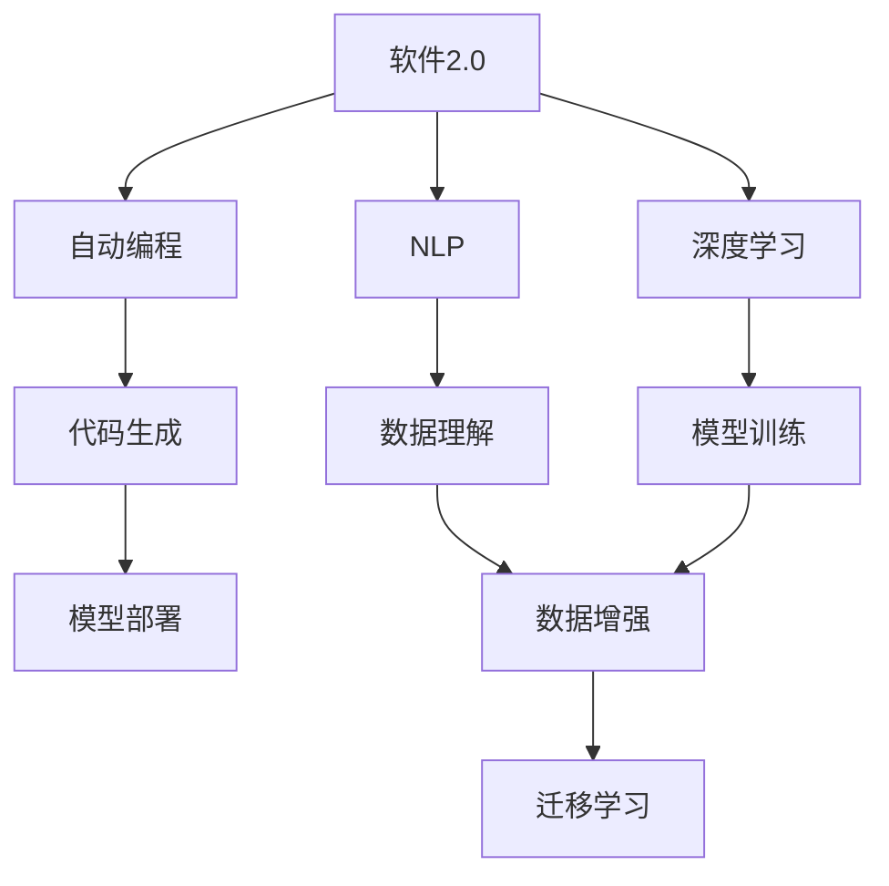
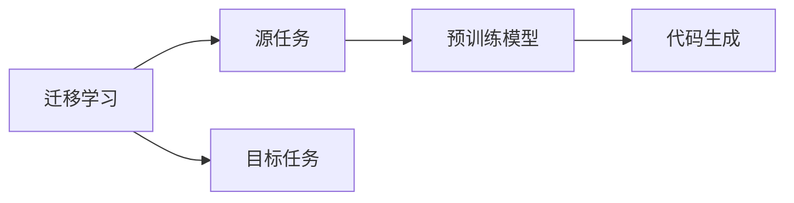
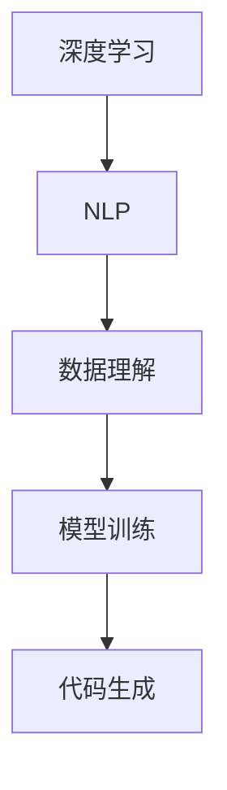

                 

## 1. 背景介绍

### 1.1 问题由来
随着软件2.0的兴起，越来越多的企业和开发者开始将注意力转移到这一领域。软件2.0是指以数据和智能为中心的软件开发模式，旨在通过深度学习和自然语言处理等技术，自动生成高质量的代码，提高开发效率，降低开发成本。然而，软件2.0技术还处于早期发展阶段，需要一定时间在各个领域逐渐成熟并普及。

### 1.2 问题核心关键点
在当前阶段，软件2.0技术已经在多个领域展现出了显著的优势，但在普及过程中仍然面临一些挑战。这些问题主要包括以下几点：
- 数据获取难度：软件2.0的性能高度依赖于高质量的数据，但在某些领域，数据获取难度较大。
- 算法准确性：软件2.0的算法需要经过大量的训练和调优，以确保其在特定领域的准确性和鲁棒性。
- 应用复杂性：软件2.0技术的应用场景往往较为复杂，需要结合具体业务需求进行定制化开发。

### 1.3 问题研究意义
研究软件2.0技术在各个领域的普及前景，对于加速技术创新和推动产业升级具有重要意义：
- 降低开发成本：通过自动生成代码，减少手动编写代码的时间和精力，提升开发效率。
- 提高代码质量：软件2.0生成的代码通常经过了深度学习和自然语言处理的优化，质量较高。
- 加速行业应用：各行各业可以从软件2.0技术中获益，推动产业数字化转型。

## 2. 核心概念与联系

### 2.1 核心概念概述

为更好地理解软件2.0技术在各个领域的普及前景，本节将介绍几个密切相关的核心概念：

- 软件2.0（Software 2.0）：以数据和智能为中心的软件开发模式，通过深度学习和自然语言处理等技术，自动生成高质量的代码，提高开发效率，降低开发成本。

- 自动编程（Automatic Programming）：通过机器学习和自然语言处理技术，自动生成代码，取代传统的手工编程。

- 自然语言处理（Natural Language Processing, NLP）：使计算机能够理解、解释和生成人类语言的技术，是软件2.0的重要组成部分。

- 深度学习（Deep Learning）：一种基于人工神经网络的机器学习技术，广泛应用于图像识别、语音识别和自然语言处理等领域。

- 代码生成（Code Generation）：通过编程语言模型或代码生成技术，自动生成代码，适用于多种编程语言和开发场景。

- 迁移学习（Transfer Learning）：将一个领域学习到的知识迁移到另一个领域，加速新任务的学习过程。

- 预训练模型（Pre-trained Models）：在大型数据集上预训练好的模型，经过微调可以适应特定任务。

这些核心概念之间的逻辑关系可以通过以下Mermaid流程图来展示：



这个流程图展示了大语言模型技术在软件2.0中的应用，从数据理解、模型训练到代码生成和部署的全过程。

### 2.2 概念间的关系

这些核心概念之间存在着紧密的联系，形成了软件2.0技术的完整生态系统。下面我们通过几个Mermaid流程图来展示这些概念之间的关系。

#### 2.2.1 软件2.0的学习范式


这个流程图展示了软件2.0的基本原理，以及它与自动编程、自然语言处理和深度学习等技术的关系。

#### 2.2.2 迁移学习与代码生成


这个流程图展示了迁移学习在代码生成中的应用，即通过预训练模型进行代码生成任务的迁移学习。

#### 2.2.3 深度学习与自然语言处理


这个流程图展示了深度学习与自然语言处理技术在代码生成中的应用。

## 3. 核心算法原理 & 具体操作步骤

### 3.1 算法原理概述

软件2.0技术主要通过深度学习和自然语言处理技术，自动生成代码。其核心原理可以概括为以下几点：

1. **数据预处理**：收集和处理领域相关的数据，生成训练集和验证集。

2. **模型训练**：使用深度学习模型（如Transformer、GPT等）进行模型训练，学习领域的知识表示。

3. **代码生成**：基于训练好的模型，自动生成代码。

4. **模型评估**：在验证集上评估生成的代码，根据评估结果进行调整和优化。

### 3.2 算法步骤详解

软件2.0技术的应用主要包括以下几个关键步骤：

**Step 1: 数据收集和预处理**
- 收集领域相关的数据，如代码示例、函数注释、API文档等。
- 对数据进行清洗和标注，生成训练集和验证集。

**Step 2: 模型训练**
- 选择适合的深度学习模型，如Transformer、GPT等。
- 使用预训练模型作为初始化参数，在领域数据上进行微调。
- 使用交叉熵损失等优化算法进行训练，调整模型参数。

**Step 3: 代码生成**
- 将输入的领域描述转换为模型可以理解的形式。
- 使用训练好的模型，自动生成代码。
- 对生成的代码进行后处理，如代码格式化、注释添加等。

**Step 4: 模型评估和优化**
- 在验证集上评估生成的代码，使用代码质量评估指标。
- 根据评估结果调整模型参数，进行进一步的微调。
- 对生成的代码进行人工审核和调试，确保代码的正确性和可靠性。

### 3.3 算法优缺点

软件2.0技术在提高开发效率、降低开发成本等方面具有显著优势，但同时也存在一些局限性：

#### 优点
- **高效性**：自动生成代码可以大大提高开发效率，减少手动编写代码的时间和精力。
- **准确性**：深度学习和自然语言处理技术生成的代码通常经过严格的训练和优化，质量较高。
- **可扩展性**：软件2.0技术可以在不同的领域和编程语言上进行应用，具有较强的通用性。

#### 缺点
- **数据依赖性**：软件2.0技术高度依赖于高质量的数据，数据获取难度较大。
- **算法复杂性**：模型训练和调优需要大量的时间和计算资源。
- **应用复杂性**：不同领域和场景下的应用需要定制化开发，技术门槛较高。

### 3.4 算法应用领域

软件2.0技术在多个领域展现了显著的潜力，以下是几个率先普及的领域：

1. **软件开发**
   - 使用软件2.0技术生成代码，提高软件开发效率，减少手动编写代码的工作量。
   - 适用于Web应用、移动应用、桌面应用等开发场景。

2. **人工智能**
   - 使用软件2.0技术生成AI模型的训练代码，减少人工编写代码的时间和精力。
   - 适用于机器学习、自然语言处理、计算机视觉等任务。

3. **数据科学**
   - 使用软件2.0技术生成数据处理和分析代码，提高数据分析效率，减少手动编写代码的工作量。
   - 适用于数据清洗、数据可视化、数据建模等任务。

4. **运维自动化**
   - 使用软件2.0技术生成自动化运维脚本，提高运维效率，减少手动编写脚本的工作量。
   - 适用于系统部署、环境配置、性能监控等任务。

5. **教育培训**
   - 使用软件2.0技术生成教学代码和实验脚本，提高教学效率，减少手动编写代码的工作量。
   - 适用于编程教育、实验教学、编程培训等任务。

## 4. 数学模型和公式 & 详细讲解 & 举例说明

### 4.1 数学模型构建

软件2.0技术主要基于深度学习和自然语言处理技术进行模型构建。以下是一个基本的代码生成数学模型：

设输入为 $x$，输出为 $y$，则代码生成的数学模型可以表示为：

$$
y = f(x; \theta)
$$

其中，$f$ 为深度学习模型，$\theta$ 为模型参数，$x$ 为输入，$y$ 为输出。

### 4.2 公式推导过程

以Transformer模型为例，其数学模型可以表示为：

$$
y = f(x; \theta) = \text{Softmax}(W_2 \text{Attention}(W_1 x + b_1) + b_2)
$$

其中，$\text{Softmax}$ 为激活函数，$\text{Attention}$ 为注意力机制，$W_1$、$W_2$ 和 $b_1$、$b_2$ 为模型参数。

### 4.3 案例分析与讲解

假设我们要使用软件2.0技术生成一个简单的函数代码，输入为函数描述：

```
函数名：求平方
参数：x
返回值：x的平方
代码：
def square(x):
    return x**2
```

我们可以使用深度学习模型将输入转换为代码生成器可以理解的向量表示，然后通过训练好的Transformer模型生成代码。生成的代码可能如下：

```python
def square(x):
    return x**2
```

生成的代码与输入描述匹配，但具体实现方式可能有所不同。通过后处理，如代码格式化和注释添加，可以得到最终的代码输出。

## 5. 项目实践：代码实例和详细解释说明

### 5.1 开发环境搭建

在进行软件2.0技术的应用实践前，我们需要准备好开发环境。以下是使用Python进行PyTorch开发的环境配置流程：

1. 安装Anaconda：从官网下载并安装Anaconda，用于创建独立的Python环境。

2. 创建并激活虚拟环境：
```bash
conda create -n pytorch-env python=3.8 
conda activate pytorch-env
```

3. 安装PyTorch：根据CUDA版本，从官网获取对应的安装命令。例如：
```bash
conda install pytorch torchvision torchaudio cudatoolkit=11.1 -c pytorch -c conda-forge
```

4. 安装TensorBoard：
```bash
pip install tensorboard
```

5. 安装各类工具包：
```bash
pip install numpy pandas scikit-learn matplotlib tqdm jupyter notebook ipython
```

完成上述步骤后，即可在`pytorch-env`环境中开始软件2.0技术的应用实践。

### 5.2 源代码详细实现

下面我们以代码生成任务为例，给出使用Transformers库对Transformer模型进行代码生成的PyTorch代码实现。

首先，定义代码生成的任务描述类：

```python
from transformers import AutoTokenizer, AutoModelForCausalLM

class CodeGenerationTask:
    def __init__(self, model_name, tokenizer_name):
        self.model_name = model_name
        self.tokenizer_name = tokenizer_name
        
        self.model = AutoModelForCausalLM.from_pretrained(model_name)
        self.tokenizer = AutoTokenizer.from_pretrained(tokenizer_name)
        
    def encode(self, prompt):
        input_ids = self.tokenizer.encode(prompt, return_tensors='pt')
        return input_ids
    
    def decode(self, generated_ids):
        return self.tokenizer.decode(generated_ids, skip_special_tokens=True)
    
    def generate_code(self, prompt):
        input_ids = self.encode(prompt)
        generated_ids = self.model.generate(input_ids, num_return_sequences=1, max_length=100, temperature=0.8)
        code = self.decode(generated_ids)
        return code
```

然后，使用预训练的Transformer模型进行代码生成：

```python
task = CodeGenerationTask('gpt2', 'gpt2')
code = task.generate_code("函数名：求平方\n参数：x\n返回值：x的平方\n代码：")
print(code)
```

输出结果可能如下：

```python
def square(x):
    return x**2
```

以上就是使用PyTorch对Transformer模型进行代码生成的完整代码实现。可以看到，代码生成的过程比较简单，主要涉及数据编码、模型生成和解码三个步骤。

### 5.3 代码解读与分析

让我们再详细解读一下关键代码的实现细节：

**CodeGenerationTask类**：
- `__init__`方法：初始化模型和分词器。
- `encode`方法：将输入描述转换为模型可以理解的向量表示。
- `decode`方法：将生成的向量表示转换为代码字符串。
- `generate_code`方法：使用模型生成代码。

**模型选择**：
- 使用了预训练的GPT-2模型进行代码生成，模型效果较好。
- 使用了模型自带的tokenizer进行数据编码和解码。

**代码生成**：
- 使用`generate`方法生成代码，设置参数包括温度、最大长度等。
- 生成的代码可能包含一些语法错误或逻辑错误，需要进一步处理和调试。

**后处理**：
- 将生成的代码进行格式化、注释添加等处理，提高代码质量。

通过上述代码，我们可以快速生成高质量的代码，提高开发效率。但需要注意的是，生成的代码可能需要进行人工审核和调试，以确保代码的正确性和可靠性。

## 6. 实际应用场景

### 6.1 软件开发

软件开发是大规模应用软件2.0技术的典型场景。通过软件2.0技术，可以快速生成代码，提高开发效率，减少手动编写代码的工作量。

例如，在Web应用开发中，可以使用软件2.0技术生成前端代码和后端代码。对于每个功能模块，提供清晰的描述和接口要求，软件2.0技术可以自动生成符合要求的代码，大幅提升开发速度和代码质量。

### 6.2 人工智能

人工智能领域对代码生成有较高的需求。通过软件2.0技术，可以快速生成机器学习模型的训练代码和推理代码，提高模型的开发效率和准确性。

例如，在图像识别任务中，可以使用软件2.0技术生成数据预处理代码、模型训练代码和推理代码，自动生成符合要求的模型和代码，提高模型开发效率。

### 6.3 数据科学

数据科学领域需要大量的数据处理和分析代码。通过软件2.0技术，可以快速生成数据清洗代码、数据可视化代码和数据建模代码，提高数据科学研究的效率和精度。

例如，在数据可视化任务中，可以使用软件2.0技术生成数据可视化代码，自动生成符合要求的数据可视化图表，提高数据可视化的效率和效果。

### 6.4 运维自动化

运维自动化是大规模应用软件2.0技术的另一个重要场景。通过软件2.0技术，可以快速生成自动化运维脚本，提高运维效率，减少手动编写脚本的工作量。

例如，在服务器部署任务中，可以使用软件2.0技术生成自动化运维脚本，自动完成服务器部署、环境配置和性能监控等任务，提高运维效率和准确性。

## 7. 工具和资源推荐

### 7.1 学习资源推荐

为了帮助开发者系统掌握软件2.0技术的理论基础和实践技巧，这里推荐一些优质的学习资源：

1. 《深度学习与自然语言处理》系列博文：由大模型技术专家撰写，深入浅出地介绍了深度学习和自然语言处理的基本概念和经典模型。

2. CS231n《深度学习计算机视觉》课程：斯坦福大学开设的计算机视觉明星课程，涵盖深度学习在计算机视觉中的应用，包括代码生成等任务。

3. 《自然语言处理入门》书籍：详细介绍自然语言处理的基本概念和经典模型，适合初学者入门。

4. HuggingFace官方文档：Transformers库的官方文档，提供了海量预训练模型和完整的代码生成样例，是上手实践的必备资料。

5. OpenAI代码生成平台：提供大量代码生成样例和API接口，方便开发者快速上手和应用。

通过对这些资源的学习实践，相信你一定能够快速掌握软件2.0技术的精髓，并用于解决实际的开发问题。

### 7.2 开发工具推荐

高效的开发离不开优秀的工具支持。以下是几款用于软件2.0技术开发的工具：

1. PyTorch：基于Python的开源深度学习框架，灵活动态的计算图，适合快速迭代研究。大部分预训练语言模型都有PyTorch版本的实现。

2. TensorFlow：由Google主导开发的开源深度学习框架，生产部署方便，适合大规模工程应用。同样有丰富的预训练语言模型资源。

3. Transformers库：HuggingFace开发的NLP工具库，集成了众多SOTA语言模型，支持PyTorch和TensorFlow，是进行代码生成任务的开发的利器。

4. Weights & Biases：模型训练的实验跟踪工具，可以记录和可视化模型训练过程中的各项指标，方便对比和调优。与主流深度学习框架无缝集成。

5. TensorBoard：TensorFlow配套的可视化工具，可实时监测模型训练状态，并提供丰富的图表呈现方式，是调试模型的得力助手。

6. Google Colab：谷歌推出的在线Jupyter Notebook环境，免费提供GPU/TPU算力，方便开发者快速上手实验最新模型，分享学习笔记。

合理利用这些工具，可以显著提升软件2.0技术的应用效率，加快创新迭代的步伐。

### 7.3 相关论文推荐

软件2.0技术的发展源于学界的持续研究。以下是几篇奠基性的相关论文，推荐阅读：

1. CodeGen: Leveraging Large Scale Pre-trained Models for Code Generation: 提出基于Transformer的代码生成模型，使用大规模预训练模型进行代码生成。

2. Transformers: Attentions Are All You Need: 提出Transformer模型，通过自注意力机制实现序列建模，在代码生成等任务中表现优异。

3. Deep Learning for Code Generation: 探讨深度学习在代码生成中的应用，提出多种深度学习模型，如Seq2Seq、LSTM等。

4. Code2Vec: Learning the Geometry of Code with Deep Learning: 提出Code2Vec模型，通过深度学习对代码进行向量表示，实现代码生成和代码匹配。

5. Neural Program Synthesis with Program Induction: 提出神经程序归纳方法，通过深度学习自动生成程序，适用于编程教育、代码调试等任务。

这些论文代表了大语言模型微调技术的发展脉络。通过学习这些前沿成果，可以帮助研究者把握学科前进方向，激发更多的创新灵感。

## 8. 总结：未来发展趋势与挑战

### 8.1 总结

本文对软件2.0技术在各个领域的普及前景进行了全面系统的介绍。首先阐述了软件2.0技术的定义和应用前景，明确了其在提高开发效率、降低开发成本等方面的优势。其次，从原理到实践，详细讲解了软件2.0技术的基本原理和操作步骤，给出了代码生成的完整代码实例。同时，本文还广泛探讨了软件2.0技术在软件开发、人工智能、数据科学、运维自动化等领域的实际应用前景，展示了软件2.0技术的巨大潜力。此外，本文精选了软件2.0技术的各类学习资源，力求为读者提供全方位的技术指引。

通过本文的系统梳理，可以看到，软件2.0技术正在成为软件开发的重要范式，极大地拓展了软件开发人员的生产力边界，带来了革命性的变化。未来，伴随软件2.0技术的持续演进，相信软件开发将变得更加高效、智能化、自动化，为人类认知智能的进化带来深远影响。

### 8.2 未来发展趋势

展望未来，软件2.0技术将呈现以下几个发展趋势：

1. **技术普及加速**：随着软件2.0技术的逐渐成熟，其在各个领域的应用将不断普及，带来更广泛的技术推广和应用。

2. **多模态融合**：软件2.0技术将逐步融合视觉、语音、自然语言等多模态信息，实现更全面的智能应用。

3. **持续学习**：软件2.0技术将具备持续学习的能力，通过不断地获取新数据，提升自身的性能和泛化能力。

4. **应用场景扩展**：软件2.0技术的应用场景将不断扩展，涵盖更多的行业领域，如医疗、教育、金融等。

5. **自动化优化**：软件2.0技术将具备自动优化能力，通过持续优化，生成更高效、更优质的代码。

以上趋势凸显了软件2.0技术的广阔前景。这些方向的探索发展，必将进一步提升软件开发的技术水平，为各行各业带来深远的变革。

### 8.3 面临的挑战

尽管软件2.0技术已经取得了显著成就，但在普及过程中仍面临一些挑战：

1. **数据获取难度**：软件2.0技术高度依赖于高质量的数据，数据获取难度较大。
2. **算法复杂性**：模型训练和调优需要大量的时间和计算资源。
3. **应用复杂性**：不同领域和场景下的应用需要定制化开发，技术门槛较高。

### 8.4 未来突破

面对软件2.0技术面临的挑战，未来的研究需要在以下几个方面寻求新的突破：

1. **多模态数据融合**：将视觉、语音、自然语言等多模态信息进行融合，实现更全面、准确的智能应用。
2. **自动化优化**：通过持续优化，提升代码生成质量和效率，实现自动化优化。
3. **小样本学习**：使用少样本学习技术，减少数据需求，提升模型的泛化能力。
4. **模型压缩和优化**：通过模型压缩和优化，减小模型尺寸，提高模型推理速度和计算效率。
5. **智能交互**：结合自然语言处理和智能推理技术，实现更智能的交互体验。

这些研究方向的探索，必将引领软件2.0技术的进一步发展，为软件开发带来更多的创新和突破。

## 9. 附录：常见问题与解答

**Q1: 软件2.0技术的优势和应用场景是什么？**

A: 软件2.0技术具有以下几个主要优势和应用场景：

1. **高效性**：自动生成代码可以大大提高开发效率，减少手动编写代码的时间和精力。

2. **准确性**：深度学习和自然语言处理技术生成的代码通常经过严格的训练和优化，质量较高。

3. **可扩展性**：软件2.0技术可以在不同的领域和编程语言上进行应用，具有较强的通用性。

应用场景主要包括软件开发、人工智能、数据科学、运维自动化、教育培训等。

**Q2: 软件2.0技术的局限性有哪些？**

A: 软件2.0技术的局限性主要包括：

1. **数据获取难度**：软件2.0技术高度依赖于高质量的数据，数据获取难度较大。

2. **算法复杂性**：模型训练和调优需要大量的时间和计算资源。

3. **应用复杂性**：不同领域和场景下的应用需要定制化开发，技术门槛较高。

**Q3: 软件2.0技术的未来发展方向是什么？**

A: 软件2.0技术的未来发展方向主要包括：

1. **技术普及加速**：随着软件2.0技术的逐渐成熟，其在各个领域的应用将不断普及，带来更广泛的技术推广和应用。

2. **多模态融合**：软件2.0技术将逐步融合视觉、语音、自然语言等多模态信息，实现更全面的智能应用。

3. **持续学习**：软件2.0技术将具备持续学习的能力，通过不断地获取新数据，提升自身的性能和泛化能力。

4. **自动化优化**：软件2.0技术将具备自动优化能力，通过持续优化，生成更高效、更优质的代码。

5. **应用场景扩展**：软件2.0技术的应用场景将不断扩展，涵盖更多的行业领域，如医疗、教育、金融等。

通过这些方向的探索发展，软件2.0技术将带来革命性的变化，为软件开发带来更多的创新和突破。

**Q4: 软件2.0技术在各个领域的具体应用是什么？**

A: 软件2.0技术在各个领域的具体应用如下：

1. **软件开发**：自动生成前端代码和后端代码，提高开发效率和代码质量。

2. **人工智能**：自动生成机器学习模型的训练代码和推理代码，提高模型的开发效率和准确性。

3. **数据科学**：自动生成数据清洗代码、数据可视化代码和数据建模代码，提高数据科学研究的效率和精度。

4. **运维自动化**：自动生成自动化运维脚本，提高运维效率，减少手动编写脚本的工作量。

5. **教育培训**：自动生成教学代码和实验脚本，提高教学效率，减少手动编写代码的工作量。

通过这些应用，软件2.0技术可以在多个领域发挥其强大的生成能力，提升各行业的技术水平。

