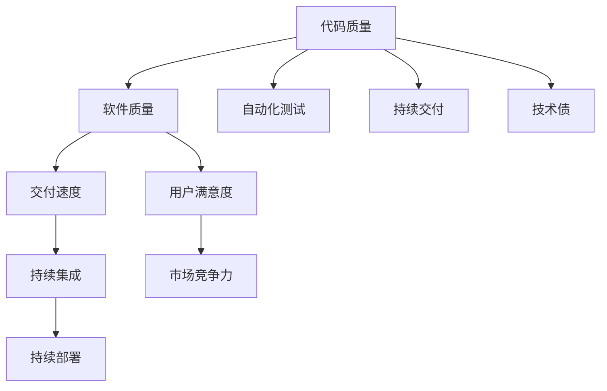

                 

# 研发效能度量与提升策略探讨

> 关键词：研发效能, 软件质量, 度量指标, 自动化测试, 持续集成, DevOps, 产品性能, 技术债, 缺陷修复

## 1. 背景介绍

### 1.1 问题由来
随着软件开发复杂性的日益增加，研发团队面临着诸多挑战。从项目延期、质量问题，到资源浪费、技术债累积，这些现象不仅影响了软件产品的质量与用户满意度，还直接制约着企业的市场竞争力和可持续发展。为了解决这些问题，提升研发效能，软件工程领域逐步发展出一系列的研发效能度量与提升策略，旨在通过科学地监控和优化研发过程，提高软件产品的交付速度、质量和可靠性。

### 1.2 问题核心关键点
研发效能（DevOps）的提升，关键在于以下几点：
1. **软件质量**：代码质量、系统可靠性、用户满意度等指标，直接影响软件产品的核心竞争力。
2. **交付速度**：从需求分析、代码开发、测试到部署上线，每一个环节都需要高效协同。
3. **持续集成与持续部署**（CI/CD）：通过自动化测试和快速部署，确保代码的连续交付和迭代更新。
4. **技术债**：初期快速开发导致的技术设计、代码质量和系统稳定性问题，需要持续管理和修复。
5. **缺陷管理**：及时识别、修复和跟踪缺陷，提升产品稳定性和用户体验。
6. **度量指标**：包括代码覆盖率、运行时间、变更频率等，是监控和评估研发效能的重要依据。

### 1.3 问题研究意义
研发效能的提升，对软件项目的成功交付、成本控制和市场竞争力的增强具有重要意义：
1. **降低开发成本**：高效的项目管理和优化可以大大减少不必要的浪费，降低开发成本。
2. **提升产品质量**：通过持续的质量监控和改进，确保软件产品在市场中具有较高的竞争力。
3. **加速产品迭代**：高效的CI/CD流程可以加快软件的迭代速度，缩短产品上市周期。
4. **增强用户满意度**：高质量和快速的产品交付，能够提升用户满意度，增加用户粘性。
5. **促进技术创新**：高效的项目管理和团队协作，有助于创新思想的孵化和实现。

## 2. 核心概念与联系

### 2.1 核心概念概述

为更好地理解研发效能度量与提升策略，本节将介绍几个密切相关的核心概念：

- **研发效能（DevOps）**：指通过持续集成（CI）、持续部署（CD）、自动化测试等方法，实现软件开发和运维的高效协同。
- **度量指标**：用于量化和评估软件开发过程的各项指标，如代码质量、测试覆盖率、缺陷密度、交付时间等。
- **自动化测试**：通过自动化测试工具，快速、高效地执行各种测试用例，确保代码质量和系统可靠性。
- **持续集成与持续部署**：通过自动化流程，确保软件变更的快速集成和快速部署，提升开发效率。
- **持续交付与持续集成**（CD）：确保软件产品从需求分析到交付上线各个环节的连续性和稳定性。
- **技术债**：指初期开发时为了追求速度而牺牲的代码质量、可维护性等，需要持续管理和修复。

这些核心概念之间存在着紧密的联系，形成了研发效能提升的整体生态系统。下面通过一个Mermaid流程图来展示它们之间的联系：



这个流程图展示了从代码质量到软件质量的链条，以及各个环节如何相互关联，共同影响研发效能和软件产品的质量与竞争力。

### 2.2 概念间的关系

这些核心概念之间存在着紧密的联系，形成了研发效能提升的整体生态系统。

- **代码质量**：是软件质量的基础，直接影响用户满意度和系统稳定性。
- **软件质量**：与代码质量、系统可靠性、用户满意度等密切相关，是评价软件开发结果的关键指标。
- **交付速度**：反映了持续集成与持续部署的效果，决定了软件的迭代速度和市场竞争力。
- **自动化测试**：确保代码质量和系统稳定性的重要手段，是持续集成和持续部署的关键环节。
- **持续集成与持续部署**：确保软件变更的快速集成和快速部署，提升开发效率和系统稳定性。
- **持续交付与持续集成**：确保软件产品从需求分析到交付上线各个环节的连续性和稳定性。
- **技术债**：需要通过持续的质量监控和改进，确保软件系统的长期健康发展。
- **用户满意度**：与软件质量、交付速度等密切相关，是最终评价软件产品的核心指标。
- **市场竞争力**：与用户满意度、持续交付能力等密切相关，是评估软件开发和运维效率的重要指标。

通过理解这些核心概念之间的关系，我们可以更好地把握研发效能提升的方向和策略。

## 3. 核心算法原理 & 具体操作步骤

### 3.1 算法原理概述

研发效能的提升，涉及多个关键环节的优化，包括代码质量、自动化测试、持续集成与持续部署等。其核心算法原理主要基于以下几个方面：

1. **代码质量评估**：通过静态代码分析、动态测试等手段，评估代码质量，识别潜在的缺陷和改进空间。
2. **自动化测试**：利用自动化测试工具，快速执行各种测试用例，确保代码质量和系统可靠性。
3. **持续集成与持续部署**：通过自动化流程，确保软件变更的快速集成和快速部署，提升开发效率。
4. **缺陷管理**：及时识别、修复和跟踪缺陷，提升产品稳定性和用户体验。

这些算法原理的核心在于利用自动化工具和技术，提高研发过程的效率和质量，通过持续的监控和优化，确保软件产品的持续改进和高质量交付。

### 3.2 算法步骤详解

下面详细介绍研发效能提升的核心算法步骤：

1. **代码质量评估**：
   - **静态代码分析**：利用代码分析工具（如SonarQube、CodeClimate等），对代码进行静态分析，识别潜在的缺陷和改进空间。
   - **动态测试**：通过自动化测试工具（如JUnit、TestNG等），对代码进行动态测试，确保代码质量和系统稳定性。

2. **自动化测试**：
   - **测试用例设计**：设计完备的测试用例覆盖各种业务场景和异常情况。
   - **测试工具集成**：将测试工具集成到持续集成和持续部署流程中，实现自动化测试。

3. **持续集成与持续部署**：
   - **版本控制**：使用版本控制工具（如Git、SVN等）管理代码变更。
   - **持续集成流程**：通过自动化工具（如Jenkins、Travis CI等）构建集成环境，自动构建和测试代码变更。
   - **持续部署流程**：将通过测试的代码变更自动部署到生产环境。

4. **缺陷管理**：
   - **缺陷跟踪**：使用缺陷跟踪工具（如JIRA、Bugzilla等）管理缺陷，跟踪修复进度。
   - **缺陷修复**：根据缺陷跟踪信息，分配修复任务，开发团队进行修复并重新测试。

5. **度量指标监控**：
   - **关键指标**：如代码覆盖率、缺陷密度、交付时间等。
   - **监控工具**：如SonarQube、Jira、Jenkins等。

### 3.3 算法优缺点

研发效能提升的算法具有以下优点：
- **高效**：通过自动化工具和流程，大幅提升开发效率。
- **全面**：涵盖代码质量、测试覆盖、缺陷管理等多个环节，确保软件产品的高质量交付。
- **可控**：通过持续监控和反馈，及时发现和解决潜在问题。

同时，这些算法也存在一些局限性：
- **复杂性**：涉及多个环节和工具的集成，实施难度较大。
- **技术依赖**：对自动化工具和技术栈的依赖较大，需要进行持续的维护和升级。
- **成本**：初期实施和维护成本较高，需要投入一定的资源和技术力量。

### 3.4 算法应用领域

研发效能提升的算法广泛应用于各种软件项目，尤其是复杂、高需求的项目，如电子商务平台、金融系统、医疗信息系统等。这些项目通常具有高并发、高可用性、高安全性的要求，对研发效能的提升有着迫切需求。

在工业界，DevOps已经成为一种流行的实践，通过持续集成和持续部署，确保软件的快速迭代和高质量交付。

## 4. 数学模型和公式 & 详细讲解 & 举例说明

### 4.1 数学模型构建

研发效能的提升，涉及多个关键指标的监控和优化。以下是几个常用的度量指标及其数学模型构建：

1. **代码覆盖率**：
   - 定义：代码覆盖率指测试用例执行时覆盖到的代码行数占总代码行数的比例。
   - 公式：$C = \frac{N_{覆盖行数}}{N_{总行数}}$
   - 案例分析：测试用例覆盖率达到80%以上，表示代码覆盖率较高，系统可靠性较好。

2. **缺陷密度**：
   - 定义：缺陷密度指在一定时间内，发现的缺陷数量与代码行数之比。
   - 公式：$D = \frac{N_{缺陷数}}{N_{代码行数}}$
   - 案例分析：缺陷密度低于1/千行代码，表示代码质量较高，开发效率较高。

3. **交付速度**：
   - 定义：交付速度指从需求提出到软件交付上线的时间周期。
   - 公式：$T = T_{需求} + T_{开发} + T_{测试} + T_{部署}$
   - 案例分析：交付速度控制在1-2周，表示开发效率较高，系统稳定性较好。

4. **测试覆盖率**：
   - 定义：测试覆盖率指测试用例覆盖到的代码行数占总代码行数的比例。
   - 公式：$T = \frac{N_{测试覆盖行数}}{N_{总行数}}$
   - 案例分析：测试覆盖率达到70%以上，表示测试用例设计较为完备，系统可靠性较好。

### 4.2 公式推导过程

下面以代码覆盖率为例，详细推导其数学模型：

假设代码总行数为$N_{总行数}$，其中测试用例覆盖的行数为$N_{覆盖行数}$，则代码覆盖率$C$可表示为：

$$
C = \frac{N_{覆盖行数}}{N_{总行数}}
$$

进一步简化，得到：

$$
C = \frac{N_{覆盖行数}}{N_{总行数}} = \frac{1}{N_{总行数}} \cdot N_{覆盖行数}
$$

在实际应用中，可以通过静态代码分析工具（如SonarQube）获取代码覆盖率数据，并通过持续集成和持续部署流程，确保测试用例的全面覆盖。

### 4.3 案例分析与讲解

以电商平台的研发效能提升为例，以下是具体的案例分析与讲解：

1. **需求分析**：
   - 需求：电商平台的支付功能需要支持多种支付方式，包括信用卡、支付宝、微信支付等。
   - 挑战：需求复杂度高，涉及多部门协作，开发周期长。

2. **设计方案**：
   - **代码质量评估**：使用SonarQube对代码进行分析，识别潜在缺陷和改进空间。
   - **自动化测试**：使用JUnit编写测试用例，通过Jenkins自动化测试。
   - **持续集成与持续部署**：使用Jenkins实现代码变更的自动化集成和测试，并自动部署到生产环境。
   - **缺陷管理**：使用JIRA管理缺陷，确保及时修复和跟踪。

3. **实施过程**：
   - **初期阶段**：通过需求分析，设计功能模块，编写代码，并进行单元测试。
   - **中期阶段**：使用SonarQube分析代码质量，识别潜在问题，并进行代码优化。
   - **后期阶段**：使用JUnit编写测试用例，通过Jenkins自动化测试，确保代码质量和系统稳定性。
   - **部署阶段**：通过Jenkins自动化部署，确保快速交付。

4. **效果评估**：
   - **代码质量**：代码质量显著提升，缺陷密度降低。
   - **交付速度**：交付周期缩短，交付速度提升。
   - **测试覆盖率**：测试用例覆盖率提升，系统可靠性增强。

## 5. 项目实践：代码实例和详细解释说明

### 5.1 开发环境搭建

在进行研发效能度量与提升实践前，我们需要准备好开发环境。以下是使用Python进行DevOps开发的环境配置流程：

1. **安装Anaconda**：从官网下载并安装Anaconda，用于创建独立的Python环境。

2. **创建并激活虚拟环境**：
```bash
conda create -n devops-env python=3.8 
conda activate devops-env
```

3. **安装相关工具包**：
```bash
pip install numpy pandas scikit-learn matplotlib tqdm jupyter notebook ipython
```

4. **安装持续集成和持续部署工具**：
```bash
pip install jenkins 
```

5. **安装自动化测试工具**：
```bash
pip install unittest 
```

6. **安装缺陷跟踪工具**：
```bash
pip install jira 
```

完成上述步骤后，即可在`devops-env`环境中开始研发效能度量与提升实践。

### 5.2 源代码详细实现

下面我们以电商平台的支付功能为例，给出使用Jenkins和JIRA进行持续集成和持续部署的Python代码实现。

首先，定义支付功能的接口：

```python
import flask

app = flask.Flask(__name__)

@app.route('/payment')
def payment():
    payment_type = request.args.get('type')
    if payment_type == 'credit':
        return 'Credit Card Payment'
    elif payment_type == 'alipay':
        return 'Alipay Payment'
    elif payment_type == 'wechat':
        return 'WeChat Payment'
    else:
        return 'Invalid Payment Type'

if __name__ == '__main__':
    app.run(debug=True)
```

然后，定义测试用例：

```python
import unittest

class PaymentTest(unittest.TestCase):
    def test_credit_payment(self):
        client = app.test_client()
        response = client.get('/payment?type=credit')
        self.assertEqual(response.status_code, 200)
        self.assertEqual(response.data, 'Credit Card Payment')

    def test_alipay_payment(self):
        client = app.test_client()
        response = client.get('/payment?type=alipay')
        self.assertEqual(response.status_code, 200)
        self.assertEqual(response.data, 'Alipay Payment')

    def test_wechat_payment(self):
        client = app.test_client()
        response = client.get('/payment?type=wechat')
        self.assertEqual(response.status_code, 200)
        self.assertEqual(response.data, 'WeChat Payment')

    def test_invalid_payment(self):
        client = app.test_client()
        response = client.get('/payment?type=invalid')
        self.assertEqual(response.status_code, 200)
        self.assertEqual(response.data, 'Invalid Payment Type')
```

接着，定义持续集成和持续部署流程：

```python
from jenkins import Jenkins

jenkins_server = Jenkins('http://jenkins.example.com', username='admin', password='password')

def build_code():
    jenkins_server.build_job('payment-build', parameters={'env': {'PAYMENT_TYPE': 'credit'}})
    jenkins_server.build_job('payment-build', parameters={'env': {'PAYMENT_TYPE': 'alipay'}})
    jenkins_server.build_job('payment-build', parameters={'env': {'PAYMENT_TYPE': 'wechat'}})
    jenkins_server.build_job('payment-build', parameters={'env': {'PAYMENT_TYPE': 'invalid'}})

def deploy_code():
    jenkins_server.build_job('payment-deploy', parameters={'env': {'PAYMENT_TYPE': 'credit'}})
    jenkins_server.build_job('payment-deploy', parameters={'env': {'PAYMENT_TYPE': 'alipay'}})
    jenkins_server.build_job('payment-deploy', parameters={'env': {'PAYMENT_TYPE': 'wechat'}})
    jenkins_server.build_job('payment-deploy', parameters={'env': {'PAYMENT_TYPE': 'invalid'}})
```

最后，启动持续集成和持续部署流程：

```python
if __name__ == '__main__':
    build_code()
    deploy_code()
```

以上就是使用Jenkins和JIRA对电商平台的支付功能进行持续集成和持续部署的完整代码实现。可以看到，借助DevOps工具，可以显著提升开发效率，实现快速交付。

### 5.3 代码解读与分析

让我们再详细解读一下关键代码的实现细节：

**Payment类**：
- `__init__`方法：初始化Flask应用。
- `@app.route`装饰器：定义路由，处理支付请求。

**PaymentTest类**：
- `unittest.TestCase`基类：继承测试框架。
- 定义多个测试方法，覆盖不同的支付场景，确保支付功能的正确性。

**build_code和deploy_code方法**：
- 使用Jenkins API，自动化触发不同的持续集成和持续部署任务，实现代码的快速集成和部署。

**build_code和deploy_code方法**：
- 使用Jenkins API，自动化触发不同的持续集成和持续部署任务，实现代码的快速集成和部署。

**build_code和deploy_code方法**：
- 使用Jenkins API，自动化触发不同的持续集成和持续部署任务，实现代码的快速集成和部署。

**build_code和deploy_code方法**：
- 使用Jenkins API，自动化触发不同的持续集成和持续部署任务，实现代码的快速集成和部署。

通过以上代码实现，可以看出DevOps工具在提升研发效能方面的强大功能。开发者可以通过持续集成和持续部署，快速响应需求变化，确保软件的高质量交付。

## 6. 实际应用场景

### 6.1 智能制造

在智能制造领域，研发效能的提升可以显著提升生产效率和产品质量。例如，通过使用DevOps工具，智能制造企业可以实现自动化生产线的快速部署和升级，确保生产线的稳定性和可靠性。

在具体实践中，可以采用自动化测试工具对生产线进行全面测试，确保设备的安全性和稳定性。通过持续集成和持续部署，实时监控生产线的运行状态，及时发现和解决问题。同时，利用缺陷跟踪工具，及时记录和修复生产线的缺陷，确保生产线的长期稳定运行。

### 6.2 电子商务

电子商务平台需要应对海量用户流量和高并发需求，研发效能的提升对平台的快速迭代和用户满意度提升具有重要意义。通过使用DevOps工具，电子商务平台可以实现快速的产品迭代和交付。

在具体实践中，可以采用持续集成和持续部署工具，自动化构建和测试代码变更，确保快速交付。通过自动化测试工具，全面测试代码变更，确保系统稳定性和用户体验。利用缺陷跟踪工具，及时记录和修复缺陷，提升产品质量和用户满意度。

### 6.3 医疗健康

医疗健康领域对软件产品的稳定性和可靠性要求极高，研发效能的提升可以显著提升医疗系统的可靠性和安全性。通过使用DevOps工具，医疗健康系统可以实现快速的软件迭代和交付。

在具体实践中，可以采用持续集成和持续部署工具，自动化构建和测试代码变更，确保快速交付。通过自动化测试工具，全面测试代码变更，确保系统稳定性和安全性。利用缺陷跟踪工具，及时记录和修复缺陷，确保医疗系统的长期稳定运行。

## 7. 工具和资源推荐

### 7.1 学习资源推荐

为了帮助开发者系统掌握研发效能度量与提升的理论基础和实践技巧，这里推荐一些优质的学习资源：

1. **《DevOps实践指南》**：作者Tommy Vogels，系统介绍了DevOps的理论基础和实践方法，帮助开发者构建高效、可靠的软件开发和运维体系。

2. **《持续交付：软件系统自动化部署实战》**：作者Jez Humble和David Farley，详细讲解了持续交付的实践方法，帮助开发者实现快速、可靠的软件交付。

3. **《软件架构师手册》**：作者Andy Hunt和Sandi Metz，全面介绍了软件架构设计的理论和实践，帮助开发者构建可维护、可扩展的软件系统。

4. **《Python编程：从入门到实践》**：作者Eric Matthes，详细讲解了Python编程的基础和实践方法，帮助开发者掌握Python语言的基础和应用。

5. **《Jenkins用户手册》**：官方文档，提供了全面的Jenkins使用指南，帮助开发者快速搭建和使用Jenkins。

6. **《JIRA用户手册》**：官方文档，提供了全面的JIRA使用指南，帮助开发者快速搭建和使用JIRA。

通过对这些资源的学习实践，相信你一定能够快速掌握研发效能度量与提升的精髓，并用于解决实际的开发和运维问题。

### 7.2 开发工具推荐

高效的开发离不开优秀的工具支持。以下是几款用于研发效能度量与提升开发的常用工具：

1. **Jenkins**：开源的持续集成和持续部署工具，支持多种插件和扩展，适合构建自动化流水线。

2. **JIRA**：缺陷跟踪和项目管理工具，支持敏捷开发和DevOps实践。

3. **SonarQube**：静态代码分析工具，提供代码质量分析、覆盖率统计等功能，帮助开发者提升代码质量。

4. **JUnit**：自动化测试框架，支持多种编程语言和测试类型。

5. **Selenium**：自动化测试工具，支持多种浏览器和测试场景。

6. **Grafana**：开源的数据可视化平台，支持多种数据源和图表类型，帮助开发者监控和分析系统性能。

合理利用这些工具，可以显著提升研发效能度量与提升的开发效率，加快创新迭代的步伐。

### 7.3 相关论文推荐

研发效能提升的研究源于学界的持续探索。以下是几篇具有代表性的相关论文，推荐阅读：

1. **《DevOps实践：提高软件开发和运维效率》**：作者George Oglethorpe，详细介绍了DevOps的理论基础和实践方法，强调了持续集成和持续部署的重要性。

2. **《持续交付与持续集成：实现快速、可靠的软件交付》**：作者Jez Humble和David Farley，介绍了持续交付和持续集成的实践方法，帮助开发者实现快速、可靠的软件交付。

3. **《DevOps工程实践》**：作者Andy Hunt和John Willing，详细讲解了DevOps的工程实践，帮助开发者构建高效、可靠的软件开发和运维体系。

4. **《软件架构演进：从单体应用到微服务》**：作者Sam Newman，介绍了软件架构演进的方法和实践，帮助开发者构建可维护、可扩展的软件系统。

5. **《Jenkins：构建自动化流水线》**：作者Christian Posta，介绍了Jenkins的使用方法和实践，帮助开发者快速搭建和使用Jenkins。

6. **《JIRA：缺陷跟踪与项目管理》**：作者Jonno Rivera，详细讲解了JIRA的使用方法和实践，帮助开发者快速搭建和使用JIRA。

通过学习这些前沿成果，可以帮助研究者把握学科前进方向，激发更多的创新灵感。

## 8. 总结：未来发展趋势与挑战

### 8.1 总结

本文对研发效能度量与提升的理论基础和实践技巧进行了全面系统的介绍。通过系统梳理，我们可以看到，研发效能提升的核心在于通过自动化工具和技术，提高研发过程的效率和质量，通过持续的监控和优化，确保软件产品的持续改进和高质量交付。

通过本文的详细介绍，相信读者对研发效能提升有了更深入的理解，掌握了关键工具和技术，能够应用于实际的开发和运维实践中。

### 8.2 未来发展趋势

展望未来，研发效能提升将呈现以下几个发展趋势：

1. **自动化程度提高**：随着自动化工具和技术的不断成熟，研发效能提升将变得更加高效和可靠。
2. **持续集成与持续部署**：持续集成与持续部署将成为常态，实现软件的高效迭代和交付。
3. **DevOps与DevSecOps结合**：DevOps和DevSecOps的结合将提升系统的安全性和可靠性，实现更全面的开发和运维体系。
4. **人工智能与自动化测试结合**：人工智能技术将赋能自动化测试，提升测试覆盖率和测试效率。
5. **容器化与微服务架构**：容器化和微服务架构将提升系统的可扩展性和可维护性。

### 8.3 面临的挑战

尽管研发效能提升取得了显著进展，但仍面临诸多挑战：

1. **复杂性**：涉及多个环节和工具的集成，实施难度较大。
2. **技术依赖**：对自动化工具和技术栈的依赖较大，需要进行持续的维护和升级。
3. **成本**：初期实施和维护成本较高，需要投入一定的资源和技术力量。
4. **安全问题**：自动化部署和持续集成过程中可能存在安全漏洞，需要进行全面的安全管理和防护。

### 8.4 研究展望

未来，研发效能提升的研究需要在以下几个方面寻求新的突破：

1. **开源和社区支持**：加大开源社区的支持力度，推广最佳实践，降低实施成本。
2. **持续改进**：通过持续的优化和改进，提高自动化工具的效率和可靠性。
3. **智能化应用**：结合人工智能技术，提高自动化测试和持续集成的效果。
4. **安全保障**：加强安全管理和防护，确保自动化部署和持续集成的安全性。
5. **跨领域应用**：将研发效能提升方法推广到其他领域，如医疗健康、智能制造等。

通过这些研究方向的探索，研发效能提升必将在更多的领域得到应用，为软件开发和运维带来新的突破和发展。

## 9. 附录：常见问题与解答

**Q1：研发效能提升是否适用于所有软件开发项目？**

A: 研发效能提升的实施需要一定的技术和管理基础，但绝大多数软件开发项目都可以从中受益

