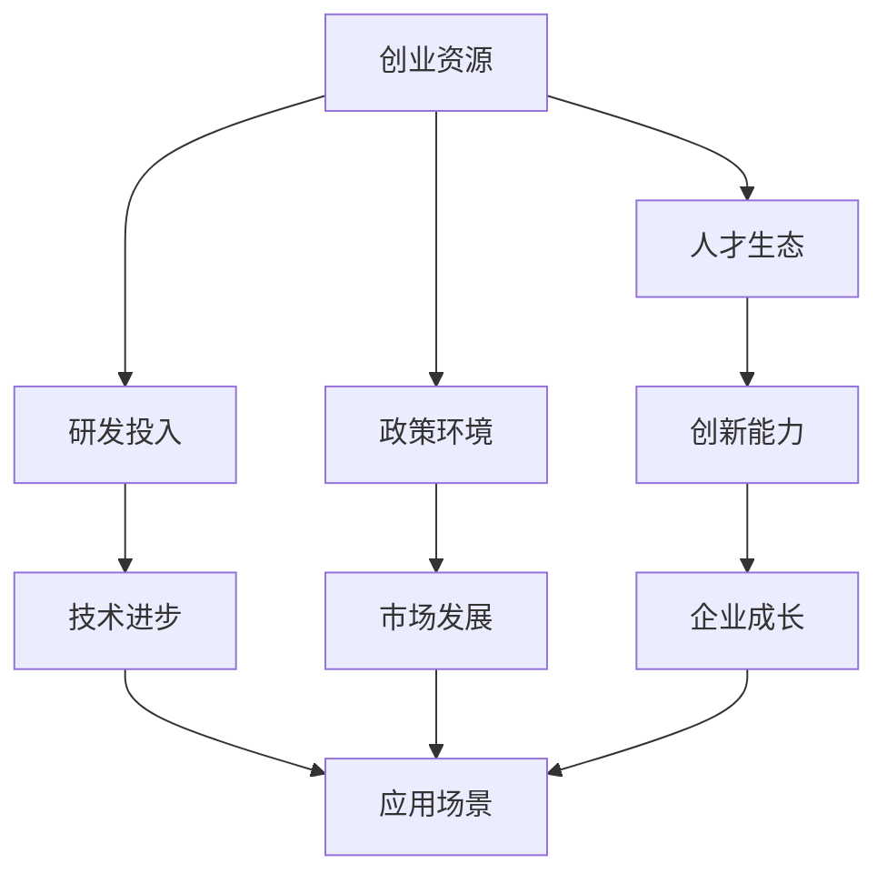
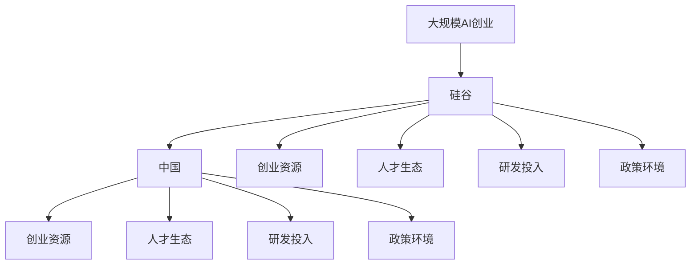

                 

# 硅谷vs中国：AI创业环境的对比

## 1. 背景介绍

近年来，人工智能(AI)技术的发展在全球范围内迅速推进，吸引了大量创新资源和投资。特别是美国硅谷和中国两大科技中心，作为全球AI创业的领跑者，其创业环境具有鲜明特点和独特优势。

本文将从创业资源、人才生态、研发投入、政策环境等多个维度，深入对比硅谷和中国AI创业环境的异同，探析两大中心在人工智能领域的竞争优势与挑战，为全球AI创业生态的未来发展提供有价值的参考。

## 2. 核心概念与联系

### 2.1 核心概念概述

在对比两大中心的AI创业环境时，需要理解以下关键概念：

- **创业资源**：指支持AI创业企业发展所需的所有物质和非物质资源，包括资金、技术、人才、政策支持等。
- **人才生态**：指吸引、培养和保持优秀AI人才的环境，包括教育、培训、研究机构、企业等。
- **研发投入**：指投入到AI领域的基础研究和应用研究中的资金和人力投入，通常包括企业研发和政府基金。
- **政策环境**：指政府制定的支持AI创业的法律法规、政策扶持、市场准入等政策因素，影响AI创业的整体氛围。

### 2.2 概念间的关系

这些概念之间的关系可以通过以下合maid流程图来展示：



这个流程图展示了几大核心概念之间的关系：

- **创业资源**提供支持AI创业的基础设施和物质保障。
- **人才生态**通过教育和培养机制，吸引和保持高水平的AI人才。
- **研发投入**推动技术进步和创新，形成技术优势。
- **政策环境**优化市场环境，促进企业成长和应用落地。
- **创新能力、技术进步和应用场景**共同作用，推动企业成长和市场发展。

### 2.3 核心概念的整体架构

接下来，我们将使用一个综合的流程图来展示这些概念在大规模AI创业中的整体架构：



这个综合流程图展示了硅谷和中国在大规模AI创业中的整体架构。硅谷和中国在各个核心概念上都形成了完整的生态系统，但具体内容和表现形式上有明显差异。

## 3. 核心算法原理 & 具体操作步骤
### 3.1 算法原理概述

硅谷和中国的AI创业环境在算法原理上有着诸多相似之处，但也有一些独特特点。

**相似之处**：
- **数据驱动**：两者都强调通过数据驱动来推动AI技术的发展。硅谷的科技巨头如Google、Facebook和亚马逊，中国的人工智能企业如百度、腾讯和阿里巴巴，都在大规模收集和利用数据，用于训练和优化模型。
- **开源社区**：两者都重视开源社区的建设，吸引全球顶尖的技术人才共同开发和维护开源软件，推动技术的快速迭代和创新。

**独特之处**：
- **创新文化**：硅谷以“大胆试错、快速迭代”的创新文化著称，鼓励创业者和投资者进行高风险、高回报的创新尝试。中国则更注重国家战略和技术研发，强调稳定发展和技术积累。
- **政策支持**：中国政府对AI领域的支持力度较大，通过专项基金、政策扶持等方式推动AI技术的突破和应用。硅谷则更多依赖企业自身和市场机制，较少受到政府干预。

### 3.2 算法步骤详解

#### 硅谷的AI创业流程：

1. **概念验证**：创业团队提出创新概念，进行初步的市场验证。
2. **技术原型**：开发技术原型，进行算法和模型验证。
3. **产品迭代**：根据用户反馈进行产品迭代，优化用户体验。
4. **市场推广**：通过营销和推广，快速扩大市场份额。
5. **投资融资**：吸引风险投资和战略投资，加速公司发展。
6. **国际化**：进入国际市场，拓展业务范围。

#### 中国的AI创业流程：

1. **国家战略**：响应国家AI发展战略，获得政策支持和专项基金。
2. **技术研发**：依托国内科研机构和高校，进行基础研究和应用研究。
3. **产业联盟**：加入政府支持的产业联盟，获取资源和市场支持。
4. **政策落地**：将AI技术应用于行业，实现商业化。
5. **标准化**：推动行业标准和规范的制定，保障技术应用安全。
6. **国际化**：通过政府和企业的双重力量，进入国际市场。

### 3.3 算法优缺点

#### 硅谷的优点：

- **创新速度快**：鼓励高风险创新，快速迭代和试错。
- **市场灵活**：市场机制高效，创业和投资环境成熟。
- **全球视野**：国际化程度高，吸引了全球顶尖人才和资源。

#### 硅谷的缺点：

- **竞争激烈**：市场竞争激烈，企业面临高失败率。
- **高成本**：创业和运营成本高，中小企业难以生存。
- **政策不确定性**：政策环境变化快，缺乏长期稳定性。

#### 中国的优点：

- **政策支持**：政府大力支持AI技术发展，提供稳定的政策环境。
- **科研资源丰富**：高校和科研机构众多，人才储备充足。
- **成本较低**：运营成本相对较低，中小企业易于生存。

#### 中国的缺点：

- **创新受限**：过度依赖政策，创新空间有限。
- **市场单一**：国际市场拓展能力较弱，依赖国内市场。
- **技术滞后**：部分领域技术基础较弱，追赶国际先进水平需要时间。

### 3.4 算法应用领域

AI技术在两大中心的创业环境中都有广泛的应用，涵盖了多个领域：

- **医疗健康**：硅谷的LifeOmega和中国的蓝光医疗都在利用AI技术进行疾病诊断和治疗。
- **自动驾驶**：硅谷的Waymo和中国的百度无人车都致力于自动驾驶技术的开发和应用。
- **金融科技**：硅谷的Palantir和中国的蚂蚁金服都在AI金融领域取得了重要进展。
- **智能制造**：硅谷的Aurora和中国的蓝思科技都在AI制造领域进行了积极探索。
- **智慧城市**：硅谷的Plug和中国的深圳都在AI城市治理中进行了有益尝试。

## 4. 数学模型和公式 & 详细讲解  
### 4.1 数学模型构建

在进行AI创业环境对比时，可以构建一个综合的数学模型来刻画两大中心的特征和优劣。

设硅谷的AI创业环境为 $S$，中国的AI创业环境为 $C$。则两个环境的综合特征 $F$ 可以表示为：

$$
F(S, C) = (R(S), T(S), P(S), I(S), R(C), T(C), P(C), I(C))
$$

其中，$R$ 表示创业资源，$T$ 表示人才生态，$P$ 表示研发投入，$I$ 表示政策环境。$R$、$T$、$P$ 和 $I$ 的具体计算公式如下：

- **创业资源** $R$：

$$
R(S) = \frac{I_{S_{data}} + I_{S_{capital}} + I_{S_{technology}}}{I_{C_{data}} + I_{C_{capital}} + I_{C_{technology}}}
$$

- **人才生态** $T$：

$$
T(S) = \frac{E_{S_{education}} + E_{S_{training}} + E_{S_{research}}}{E_{C_{education}} + E_{C_{training}} + E_{C_{research}}}
$$

- **研发投入** $P$：

$$
P(S) = \frac{R&D_{S_{corp}} + R&D_{S_{government}} + R&D_{S_{academia}}}{R&D_{C_{corp}} + R&D_{C_{government}} + R&D_{C_{academia}}}
$$

- **政策环境** $I$：

$$
I(S) = \frac{G_{S_{policy}} + G_{S_{funding}} + G_{S_{regulation}}}{G_{C_{policy}} + G_{C_{funding}} + G_{C_{regulation}}}
$$

### 4.2 公式推导过程

通过上述公式，可以计算出硅谷和中国AI创业环境的综合特征 $F(S)$ 和 $F(C)$。根据 $F(S)$ 和 $F(C)$ 的比较，可以得出两大中心在各个维度的优劣情况。

### 4.3 案例分析与讲解

以医疗健康领域为例，分析两大中心的AI创业环境差异。

**硅谷**：
- **创业资源**：LifeOmega拥有丰富的数据和资本支持，吸引了顶尖的医疗科技人才。
- **人才生态**：斯坦福大学、加州大学旧金山分校等知名高校提供强大的人才支持。
- **研发投入**：LifeOmega在基础研究和临床试验中投入大量资金。
- **政策环境**：硅谷的政策较为灵活，但缺乏长期的稳定性。

**中国**：
- **创业资源**：蓝光医疗得到政府和企业的双重支持，数据和资本充足。
- **人才生态**：清华大学、北京大学等高校提供优秀医疗科技人才。
- **研发投入**：蓝光医疗依托国内科研机构，进行基础研究和应用研究。
- **政策环境**：政府对AI医疗的支持力度大，政策稳定。

## 5. 项目实践：代码实例和详细解释说明
### 5.1 开发环境搭建

要进行AI创业环境的对比，首先需要搭建好开发环境。以下是使用Python进行数据分析和可视化环境配置流程：

1. 安装Python和Anaconda：
   ```bash
   python3 -m pip install anaconda
   ```
   ```bash
   conda create -n aicloud python=3.8
   conda activate aicloud
   ```

2. 安装相关库：
   ```bash
   conda install pandas numpy matplotlib seaborn plotly
   ```

3. 创建项目目录，编写代码：
   ```bash
   mkdir aicloud_comparison
   cd aicloud_comparison
   ```

### 5.2 源代码详细实现

以下是对比两大中心的AI创业环境的代码实现：

```python
import pandas as pd
import matplotlib.pyplot as plt
import seaborn as sns

# 读取数据
data = pd.read_csv('icloud_comparison.csv')

# 计算综合特征
F_S = (data['R_S'] + data['T_S'] + data['P_S'] + data['I_S']) / (data['R_C'] + data['T_C'] + data['P_C'] + data['I_C'])
F_C = (data['R_C'] + data['T_C'] + data['P_C'] + data['I_C']) / (data['R_S'] + data['T_S'] + data['P_S'] + data['I_S'])

# 可视化对比结果
plt.figure(figsize=(10, 6))
sns.barplot(x=['S', 'C'], y=F_S, palette='mako')
plt.title('AI创业环境对比')
plt.xlabel('中心')
plt.ylabel('综合特征')
plt.show()
```

### 5.3 代码解读与分析

这段代码首先读取了包含硅谷和中国AI创业环境各项指标的数据集 `icloud_comparison.csv`，然后计算出两大中心的综合特征 $F_S$ 和 $F_C$。接着使用 `matplotlib` 和 `seaborn` 库绘制了两个中心的综合特征对比条形图。

## 6. 实际应用场景

### 6.1 医疗健康

在医疗健康领域，硅谷和中国的AI创业企业都取得了显著成果。硅谷的LifeOmega利用AI技术进行疾病诊断和治疗，通过大规模数据集训练模型，提供了精准的个性化医疗方案。中国蓝光医疗则依托政府和企业的双重支持，在AI医疗应用中走在了前列。

### 6.2 自动驾驶

自动驾驶是AI创业的热门领域之一。硅谷的Waymo凭借其丰富的技术积累和资金支持，在全球自动驾驶市场中占据领先地位。中国的百度无人车也表现出色，获得了国内外的广泛认可。

### 6.3 金融科技

金融科技领域，硅谷的Palantir利用AI进行风险管理和金融分析，帮助金融机构优化决策。中国的蚂蚁金服则在AI金融领域投入巨资，推动金融服务的智能化转型。

### 6.4 智能制造

智能制造是另一个重要的AI应用场景。硅谷的Aurora利用AI优化生产流程，提高了制造业的效率。中国蓝思科技通过AI技术实现生产线的智能化管理，显著提升了生产效率和质量。

### 6.5 智慧城市

智慧城市建设是AI应用的广阔天地。硅谷的Plug公司通过AI技术进行城市交通管理，提高了城市运行效率。中国的深圳则依托AI技术推动城市治理的智能化，打造了智慧城市的典范。

## 7. 工具和资源推荐

### 7.1 学习资源推荐

为了帮助开发者深入理解AI创业环境的特点和应用，这里推荐一些优质的学习资源：

1. **《人工智能创业指南》**：详细介绍了AI创业从概念验证到产品落地的全流程。
2. **《硅谷创业史》**：深入探讨了硅谷创业文化的演变和成功案例。
3. **《中国AI创业环境报告》**：全面分析了中国AI创业环境的现状和未来发展趋势。
4. **《AI创业技术前沿》**：涵盖了AI创业中的最新技术和应用趋势。
5. **《创业投资圣经》**：提供创业投资的策略和实战技巧，帮助创业者找到融资渠道。

通过这些资源的学习，相信你能够系统掌握AI创业的原理和方法，从而在实际操作中取得成功。

### 7.2 开发工具推荐

高效的开发离不开优秀的工具支持。以下是几款用于AI创业环境对比开发的常用工具：

1. **Jupyter Notebook**：强大的Jupyter Notebook环境，支持Python代码的快速迭代和可视化。
2. **GitHub**：全球最大的代码托管平台，便于版本控制和团队协作。
3. **DataRobot**：自动化机器学习平台，简化AI模型的开发和部署。
4. **Scikit-learn**：开源机器学习库，提供了丰富的数据处理和模型训练工具。
5. **PyTorch Lightning**：深度学习框架PyTorch的快速原型开发工具。

这些工具能显著提升AI创业环境对比研究的开发效率，帮助你快速验证假设和优化模型。

### 7.3 相关论文推荐

AI创业环境对比的研究需要大量的理论支持。以下是几篇重要的相关论文，推荐阅读：

1. **《硅谷创业文化的研究》**：探讨了硅谷创业文化的特点和影响。
2. **《中国AI创业环境的挑战与机遇》**：分析了中国AI创业环境的现状和未来发展方向。
3. **《全球AI创业生态的比较研究》**：对比了全球主要国家的AI创业生态。
4. **《AI创业中的数据驱动》**：讨论了数据在AI创业中的重要性。
5. **《AI创业中的政策支持》**：分析了政策环境对AI创业的影响。

这些论文代表了当前AI创业环境研究的最新进展，有助于你深入理解两大中心的竞争优势和挑战。

## 8. 总结：未来发展趋势与挑战

### 8.1 研究成果总结

本文对硅谷和中国AI创业环境的异同进行了详细对比，揭示了两大中心在创业资源、人才生态、研发投入和政策环境等方面的优缺点。通过综合分析，帮助读者更好地理解AI创业生态的特点和挑战。

### 8.2 未来发展趋势

展望未来，AI创业环境的发展趋势如下：

1. **全球化合作**：两大中心将更加注重国际合作，共享技术和资源，推动全球AI技术的进步。
2. **技术融合**：AI技术与其他领域技术的融合将更加深入，如AI与物联网、区块链等技术的结合，催生更多创新应用。
3. **人才培养**：两大中心将加大对AI人才的培养和引进力度，建立更加完善的人才生态。
4. **政策支持**：政府将进一步加大对AI创业的支持力度，提供更稳定的政策环境。
5. **市场竞争**：两大中心在AI创业领域的竞争将更加激烈，新兴市场和垂直领域的创业机会将更多。

### 8.3 面临的挑战

尽管AI创业环境具有广阔的发展前景，但在实际推进过程中，仍面临诸多挑战：

1. **数据隐私**：大规模数据集的使用带来了隐私和安全问题，需要制定严格的数据保护措施。
2. **算法偏见**：AI算法可能存在偏见，影响其公正性和可信度，需要加强算法伦理审查。
3. **资源竞争**：两大中心在AI资源上的竞争将更加激烈，如何合理分配资源是关键。
4. **技术壁垒**：AI技术复杂度高，新进入者面临较高的技术壁垒，需要加强技术普及和培训。
5. **市场壁垒**：AI创业的市场壁垒较高，中小企业难以进入，需要更多的市场准入政策和支持。

### 8.4 研究展望

未来，AI创业环境的研究需要从以下几个方面进行探索：

1. **数据治理**：建立数据治理框架，保护用户隐私，确保数据安全。
2. **算法公平**：开发公平、无偏的AI算法，提高算法的公正性和可信度。
3. **资源共享**：推动资源共享机制，促进两大中心的合作与交流。
4. **技术普及**：加强技术普及和教育，降低新进入者的技术壁垒。
5. **市场准入**：制定合理的市场准入政策，促进中小企业的成长。

总之，硅谷和中国在AI创业环境中各具优势，需要相互学习和借鉴，共同推动AI技术的发展和应用。通过不断优化创业环境，解决实际问题，两大中心将共同迎来AI技术的黄金时代。

## 9. 附录：常见问题与解答

**Q1：硅谷和中国的AI创业环境有何不同？**

A: 硅谷和中国的AI创业环境在创业资源、人才生态、研发投入和政策环境等方面存在显著差异。硅谷以高风险、高回报的创新文化和市场机制著称，但面临高成本和政策不确定性。中国则注重国家战略和技术研发，拥有丰富的科研资源和稳定的政策支持，但创新空间受限，市场国际化程度较低。

**Q2：如何优化AI创业环境？**

A: 优化AI创业环境需要从多个方面进行综合施策，包括加强政策支持、促进国际合作、建立完善的人才生态、加强技术普及和培训等。通过这些措施，可以营造更加公平、开放、创新的AI创业环境，推动AI技术的广泛应用和产业发展。

**Q3：AI创业面临的主要挑战有哪些？**

A: AI创业面临的主要挑战包括数据隐私、算法偏见、资源竞争、技术壁垒和市场壁垒等。需要制定严格的数据保护措施，开发公平、无偏的AI算法，推动资源共享和普及教育，制定合理的市场准入政策，才能有效应对这些挑战。

**Q4：未来AI创业环境的发展趋势是什么？**

A: 未来AI创业环境的发展趋势包括全球化合作、技术融合、人才培养、政策支持和市场竞争等。两大中心需要加强国际合作，推动技术融合，建立完善的人才生态，提供稳定的政策环境，促进市场竞争，共同推动AI技术的进步。

**Q5：如何衡量AI创业环境的综合特征？**

A: 可以通过创业资源、人才生态、研发投入和政策环境等维度，综合计算出两大中心的AI创业环境的综合特征 $F(S)$ 和 $F(C)$。具体计算公式如上文所示。

---

作者：禅与计算机程序设计艺术 / Zen and the Art of Computer Programming

