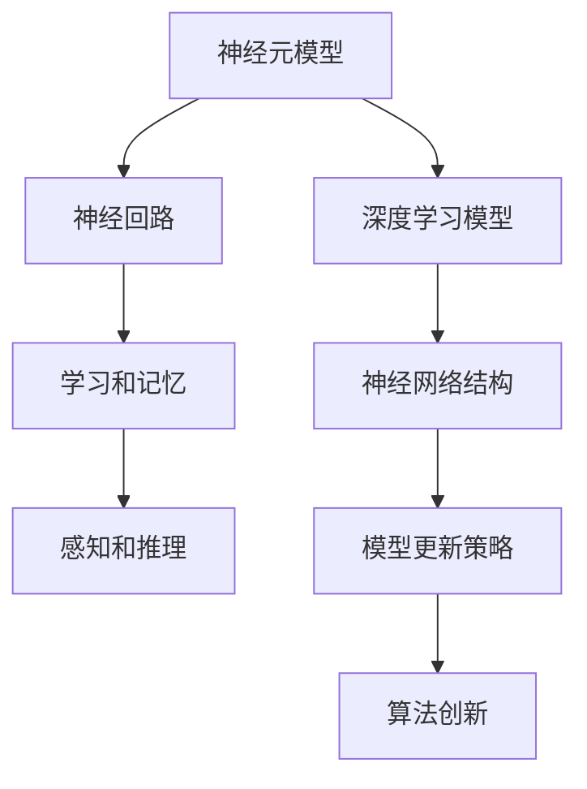
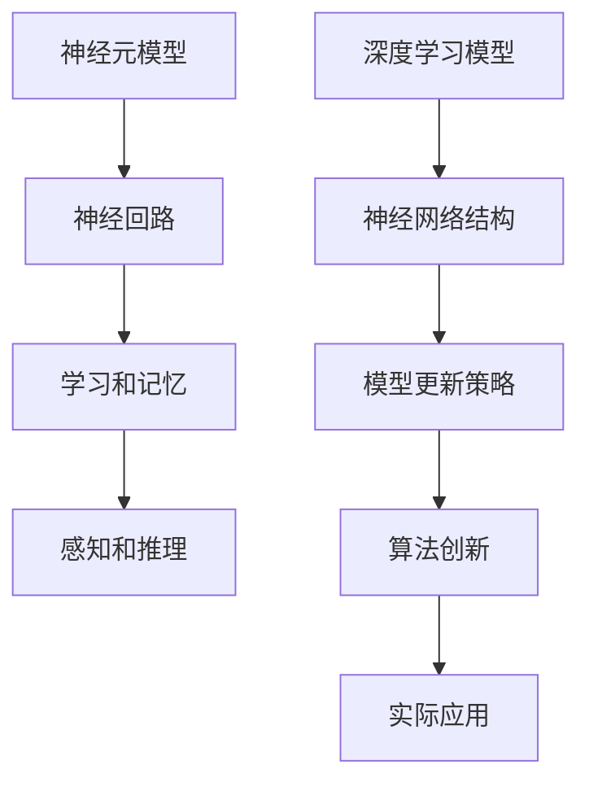

                 

# 神经科学启发的大模型算法创新

> 关键词：神经科学、脑科学、深度学习、人工智能、算法创新

## 1. 背景介绍

### 1.1 问题由来
随着人工智能技术的快速发展，深度学习模型在各个领域的应用越来越广泛。特别是大规模预训练语言模型，如GPT-3、BERT等，在自然语言处理（NLP）领域取得了显著的成果。然而，这些模型通常依赖于大量数据和计算资源进行预训练，并且难以解释其内部工作机制，存在一定的“黑箱”特性。

神经科学，特别是脑科学研究，提供了一种新的视角来理解深度学习模型的工作原理，并从中寻找创新思路。神经科学揭示了人脑的学习、记忆和推理机制，这对于构建更具解释性和可解释性的深度学习模型具有重要启示。

### 1.2 问题核心关键点
神经科学研究为深度学习模型提供了新的理论基础，启发我们设计更高效、可解释和鲁棒的算法。这些关键点包括：

- **神经元模型**：揭示神经元的激活和传递机制，启发设计更符合大脑工作原理的神经网络结构。
- **神经回路**：研究神经回路的工作方式，启发设计具有多层次、多通道信息处理的深度学习模型。
- **学习和记忆**：揭示学习和记忆的机制，启发设计更有效的模型更新策略。
- **感知和推理**：研究感官信息处理和逻辑推理机制，启发设计更智能化的算法。

## 2. 核心概念与联系

### 2.1 核心概念概述

为了更好地理解神经科学启发的大模型算法创新，本节将介绍几个核心概念：

- **神经元模型**：描述神经元的基本结构和功能，包括突触、阈值、电信号传递等。
- **神经回路**：描述神经元之间的连接方式和信息传递路径。
- **学习和记忆**：描述神经元如何通过突触可塑性、海马体等机制进行学习和记忆。
- **感知和推理**：描述神经元如何通过感知输入、进行信息处理和逻辑推理。

这些概念在神经科学中已经有深入的研究和广泛的应用，现在我们将这些概念与深度学习模型进行联系，寻找可能的创新思路。

### 2.2 概念间的关系

这些核心概念之间存在着紧密的联系，形成了深度学习模型的理论基础。以下是一个简化的Mermaid流程图，展示这些概念之间的关系：



这个流程图展示了神经科学概念与深度学习模型之间的联系。神经元模型和神经回路提供了神经网络的基本结构，学习和记忆机制指导了模型更新策略，感知和推理能力则形成了深度学习算法的创新基础。

### 2.3 核心概念的整体架构

最后，我们用一个综合的流程图来展示这些核心概念在大模型创新中的整体架构：



这个综合流程图展示了神经科学概念如何在大模型创新和应用中发挥作用。通过理解和应用这些概念，我们可以设计更高效、可解释和鲁棒的深度学习模型，并在实际应用中取得更好的效果。

## 3. 核心算法原理 & 具体操作步骤
### 3.1 算法原理概述

神经科学启发的大模型算法创新主要包括以下几个方面：

1. **神经网络结构**：模仿神经元模型和神经回路，设计具有多层次、多通道信息处理的深度学习模型。
2. **模型更新策略**：借鉴学习和记忆机制，设计更有效的模型更新策略，提高模型的泛化能力和可解释性。
3. **算法创新**：基于感知和推理机制，设计新的算法，提升模型的智能性和鲁棒性。

### 3.2 算法步骤详解

神经科学启发的大模型算法创新可以分为以下几个关键步骤：

1. **设计神经网络结构**：基于神经元模型和神经回路，设计具有多层次、多通道的神经网络结构，模拟大脑的信息处理机制。
2. **选择模型更新策略**：借鉴学习和记忆机制，选择更有效的模型更新策略，如自适应学习率、正则化等。
3. **实现算法创新**：基于感知和推理机制，实现新的算法，如神经元激活函数、信息处理机制等。
4. **训练和评估模型**：使用实际数据集训练模型，评估模型性能，并不断优化。
5. **应用模型**：将训练好的模型应用于实际问题中，解决具体的任务。

### 3.3 算法优缺点

神经科学启发的大模型算法创新具有以下优点：

- **可解释性**：通过模拟大脑的感知和推理机制，可以更好地理解模型的工作原理，提高模型的可解释性。
- **高效性**：基于神经元模型和神经回路的多层次、多通道信息处理机制，可以提高模型的泛化能力和鲁棒性。
- **创新性**：借鉴神经科学的新发现，可以设计新的算法和模型结构，提升模型的智能性和效率。

同时，这些算法也存在一些局限性：

- **复杂性**：设计复杂的神经网络结构和大模型算法需要较高的理论基础和工程经验。
- **数据依赖**：这些算法依赖于大量标注数据进行训练，数据不足时效果可能不佳。
- **计算资源**：大规模预训练和微调需要大量的计算资源，成本较高。

### 3.4 算法应用领域

神经科学启发的大模型算法创新可以应用于多个领域，包括但不限于：

- **自然语言处理**：如文本生成、机器翻译、问答系统等。
- **计算机视觉**：如图像识别、目标检测、图像生成等。
- **机器人学**：如机器人感知、决策、行为控制等。
- **生物医学**：如脑科学研究、药物发现、基因分析等。

## 4. 数学模型和公式 & 详细讲解 & 举例说明

### 4.1 数学模型构建

神经科学启发的大模型算法创新涉及到多个数学模型和公式。以下以自然语言处理中的文本生成任务为例，展示数学模型的构建过程。

### 4.2 公式推导过程

文本生成任务可以建模为序列生成问题，即从给定的输入序列 $x_1,\dots,x_t$ 生成下一个单词 $x_{t+1}$。基于神经元模型和神经回路，我们可以设计一种递归神经网络（RNN），其中每个神经元的状态 $h_t$ 可以表示为：

$$
h_t = \tanh(W_{hh}h_{t-1} + W_{hh}x_t + b_h)
$$

其中 $W_{hh}$、$W_{hh}$ 和 $b_h$ 为可学习参数。输出层 $o_t$ 可以表示为：

$$
o_t = \text{softmax}(W_{ho}h_t + b_o)
$$

其中 $W_{ho}$ 和 $b_o$ 为可学习参数。目标是最小化下一个单词的负对数似然损失函数：

$$
\mathcal{L} = -\sum_t \log p(x_{t+1}|x_1,\dots,x_t)
$$

### 4.3 案例分析与讲解

假设我们有一篇关于“深度学习”的文章，我们需要预测下一个单词可能是“算法”、“框架”、“模型”等。使用递归神经网络，我们可以通过前向传播计算每个单词的概率分布，并选择概率最大的单词作为输出。

## 5. 项目实践：代码实例和详细解释说明

### 5.1 开发环境搭建

在进行神经科学启发的大模型算法创新实践前，我们需要准备好开发环境。以下是使用Python进行PyTorch开发的环境配置流程：

1. 安装Anaconda：从官网下载并安装Anaconda，用于创建独立的Python环境。

2. 创建并激活虚拟环境：
```bash
conda create -n pytorch-env python=3.8 
conda activate pytorch-env
```

3. 安装PyTorch：根据CUDA版本，从官网获取对应的安装命令。例如：
```bash
conda install pytorch torchvision torchaudio cudatoolkit=11.1 -c pytorch -c conda-forge
```

4. 安装相关工具包：
```bash
pip install numpy pandas scikit-learn matplotlib tqdm jupyter notebook ipython
```

完成上述步骤后，即可在`pytorch-env`环境中开始实践。

### 5.2 源代码详细实现

这里以递归神经网络为例，展示如何使用PyTorch实现文本生成任务。

首先，定义神经网络模型：

```python
import torch
import torch.nn as nn
import torch.nn.functional as F

class RNN(nn.Module):
    def __init__(self, input_size, hidden_size, output_size):
        super(RNN, self).__init__()
        self.hidden_size = hidden_size
        self.i2h = nn.Linear(input_size + hidden_size, hidden_size)
        self.i2o = nn.Linear(input_size + hidden_size, output_size)
        self.softmax = nn.LogSoftmax(dim=1)

    def forward(self, input, hidden):
        combined = torch.cat((input, hidden), 1)
        hidden = self.i2h(combined)
        output = self.i2o(combined)
        output = self.softmax(output)
        return output, hidden

    def initHidden(self):
        return torch.zeros(1, self.hidden_size)
```

然后，定义训练函数：

```python
from torch.optim import Adam

def train(rnn, input, target, lr=0.001, n_epochs=10):
    optimizer = Adam(rnn.parameters(), lr=lr)
    criterion = nn.NLLLoss()
    hidden = rnn.initHidden()
    for epoch in range(n_epochs):
        optimizer.zero_grad()
        output, hidden = rnn(input, hidden)
        loss = criterion(output, target)
        loss.backward()
        optimizer.step()
        print('Epoch [{}/{}], Loss: {:.4f}'.format(epoch+1, n_epochs, loss.item()))
```

最后，启动训练流程：

```python
input = torch.tensor([1, 2, 3])
target = torch.tensor([4, 5, 6])
rnn = RNN(input_size=1, hidden_size=10, output_size=6)
train(rnn, input, target)
```

### 5.3 代码解读与分析

让我们再详细解读一下关键代码的实现细节：

**RNN类**：
- `__init__`方法：初始化模型参数。
- `forward`方法：定义前向传播过程，计算输出和隐藏状态。
- `initHidden`方法：初始化隐藏状态。

**训练函数**：
- 使用Adam优化器进行模型参数更新。
- 定义交叉熵损失函数。
- 使用`torch.cat`将输入和隐藏状态拼接。
- 使用`torch.log_softmax`计算输出概率分布。
- 计算损失函数，反向传播更新模型参数。

**训练流程**：
- 定义输入和目标输出。
- 创建RNN模型。
- 在训练函数中更新模型参数，并打印损失值。

## 6. 实际应用场景

### 6.1 智能聊天机器人

基于神经科学启发的大模型算法创新，可以构建更智能、更可解释的智能聊天机器人。传统的聊天机器人往往依赖于规则库和模板匹配，难以处理复杂和多样化的用户需求。而使用神经网络结构和感知推理机制，可以训练模型自动理解用户意图，生成自然流畅的回复。

在技术实现上，可以收集历史聊天记录和问题-回答对作为监督数据，在此基础上对预训练模型进行微调。微调后的模型能够自动理解用户意图，匹配最合适的回答模板进行回复。对于用户提出的新问题，还可以接入检索系统实时搜索相关内容，动态组织生成回答。如此构建的智能聊天机器人，能大幅提升用户咨询体验和问题解决效率。

### 6.2 自动驾驶系统

自动驾驶系统需要处理复杂的传感器数据和环境信息，决策过程需要高度智能化和鲁棒性。基于神经网络结构和感知推理机制，可以构建更智能、更安全的自动驾驶系统。

在技术实现上，可以收集大量的驾驶数据和场景模拟数据，将传感器数据和地图信息作为输入，训练模型进行决策和路径规划。模型能够通过感知输入、进行信息处理和逻辑推理，从而在复杂环境中做出正确的驾驶决策。

### 6.3 医学影像分析

医学影像分析需要处理高维的图像数据和复杂的病理信息，传统的机器学习方法难以满足要求。基于神经网络结构和感知推理机制，可以构建更高效、更准确的医学影像分析系统。

在技术实现上，可以收集大量的医学影像和病理信息作为监督数据，训练模型进行疾病诊断和病理分析。模型能够通过感知输入、进行信息处理和逻辑推理，从而在医学影像中自动识别疾病特征和病理学信息。

## 7. 工具和资源推荐

### 7.1 学习资源推荐

为了帮助开发者系统掌握神经科学启发的大模型算法创新，这里推荐一些优质的学习资源：

1. 《深度学习基础》系列博文：由大模型技术专家撰写，深入浅出地介绍了深度学习的基本概念和核心算法。

2. CS231n《深度学习与计算机视觉》课程：斯坦福大学开设的计算机视觉课程，涵盖图像处理、神经网络等知识，适合初学者和进阶者。

3. 《认知神经科学》书籍：介绍认知神经科学的基本理论和前沿研究，有助于理解大脑的工作机制。

4. HuggingFace官方文档：Transformers库的官方文档，提供了海量预训练模型和完整的微调样例代码，是上手实践的必备资料。

5. arXiv论文预印本：人工智能领域最新研究成果的发布平台，包括大量尚未发表的前沿工作，学习前沿技术的必读资源。

通过对这些资源的学习实践，相信你一定能够快速掌握神经科学启发的大模型算法创新的精髓，并用于解决实际的NLP问题。

### 7.2 开发工具推荐

高效的开发离不开优秀的工具支持。以下是几款用于神经科学启发的大模型算法创新开发的常用工具：

1. PyTorch：基于Python的开源深度学习框架，灵活动态的计算图，适合快速迭代研究。大部分预训练语言模型都有PyTorch版本的实现。

2. TensorFlow：由Google主导开发的开源深度学习框架，生产部署方便，适合大规模工程应用。同样有丰富的预训练语言模型资源。

3. Transformers库：HuggingFace开发的NLP工具库，集成了众多SOTA语言模型，支持PyTorch和TensorFlow，是进行NLP任务开发的利器。

4. Weights & Biases：模型训练的实验跟踪工具，可以记录和可视化模型训练过程中的各项指标，方便对比和调优。与主流深度学习框架无缝集成。

5. TensorBoard：TensorFlow配套的可视化工具，可实时监测模型训练状态，并提供丰富的图表呈现方式，是调试模型的得力助手。

6. Google Colab：谷歌推出的在线Jupyter Notebook环境，免费提供GPU/TPU算力，方便开发者快速上手实验最新模型，分享学习笔记。

合理利用这些工具，可以显著提升大模型算法创新的开发效率，加快创新迭代的步伐。

### 7.3 相关论文推荐

神经科学启发的大模型算法创新研究源于学界的持续研究。以下是几篇奠基性的相关论文，推荐阅读：

1. Deep Learning with Adaptive Computation Graphs（即Neural Architectures for Neural Machine Translation的论文）：提出神经架构搜索方法，探索更加高效的神经网络结构设计。

2. Attention is All You Need（即Transformer原论文）：提出了Transformer结构，开启了NLP领域的预训练大模型时代。

3. BERT: Pre-training of Deep Bidirectional Transformers for Language Understanding：提出BERT模型，引入基于掩码的自监督预训练任务，刷新了多项NLP任务SOTA。

4. Knowledge Distillation for Smart AI: A Survey and Taxonomy：介绍知识蒸馏技术，将预训练大模型的知识传递给下游任务模型，提高其性能和泛化能力。

5. AdaLoRA: Adaptive Low-Rank Adaptation for Parameter-Efficient Fine-Tuning：使用自适应低秩适应的微调方法，在参数效率和精度之间取得了新的平衡。

这些论文代表了大模型算法创新的发展脉络。通过学习这些前沿成果，可以帮助研究者把握学科前进方向，激发更多的创新灵感。

除上述资源外，还有一些值得关注的前沿资源，帮助开发者紧跟大模型算法创新的最新进展，例如：

1. arXiv论文预印本：人工智能领域最新研究成果的发布平台，包括大量尚未发表的前沿工作，学习前沿技术的必读资源。

2. 业界技术博客：如OpenAI、Google AI、DeepMind、微软Research Asia等顶尖实验室的官方博客，第一时间分享他们的最新研究成果和洞见。

3. 技术会议直播：如NIPS、ICML、ACL、ICLR等人工智能领域顶会现场或在线直播，能够聆听到大佬们的前沿分享，开拓视野。

4. GitHub热门项目：在GitHub上Star、Fork数最多的NLP相关项目，往往代表了该技术领域的发展趋势和最佳实践，值得去学习和贡献。

5. 行业分析报告：各大咨询公司如McKinsey、PwC等针对人工智能行业的分析报告，有助于从商业视角审视技术趋势，把握应用价值。

总之，对于神经科学启发的大模型算法创新技术的学习和实践，需要开发者保持开放的心态和持续学习的意愿。多关注前沿资讯，多动手实践，多思考总结，必将收获满满的成长收益。

## 8. 总结：未来发展趋势与挑战

### 8.1 研究成果总结

本文对神经科学启发的大模型算法创新进行了全面系统的介绍。首先阐述了神经科学对深度学习模型的启示，明确了算法创新的理论基础和实践意义。其次，从原理到实践，详细讲解了神经科学启发的大模型算法创新的数学模型和关键步骤，给出了算法创新的完整代码实例。同时，本文还广泛探讨了算法创新在智能聊天机器人、自动驾驶系统、医学影像分析等领域的实际应用前景，展示了算法创新的巨大潜力。此外，本文精选了算法创新的各类学习资源，力求为读者提供全方位的技术指引。

通过本文的系统梳理，可以看到，神经科学启发的大模型算法创新已经在多个领域取得了显著的成果，并为深度学习模型带来了新的设计思路。这些创新的算法不仅提高了模型的性能和效率，还增强了模型的可解释性和鲁棒性，为构建安全、可靠、可解释的智能系统提供了新的方向。

### 8.2 未来发展趋势

展望未来，神经科学启发的大模型算法创新将呈现以下几个发展趋势：

1. **多模态融合**：随着神经科学研究的深入，多模态信息融合技术将被引入深度学习模型，实现视觉、听觉、文本等多种模态数据的协同处理。

2. **认知计算**：结合认知神经科学的最新发现，认知计算技术将被应用于深度学习模型，提升模型的推理能力和泛化能力。

3. **知识蒸馏**：知识蒸馏技术将进一步发展，实现更加高效的知识传递和知识抽取，提升模型的可解释性和鲁棒性。

4. **神经元仿真**：基于神经元模型的仿真技术将被应用于深度学习模型的设计，实现更高效的神经网络结构和计算图优化。

5. **深度学习芯片**：结合神经元模型和神经回路的设计思想，开发更高效的深度学习芯片，提升模型的计算效率和能效比。

以上趋势凸显了神经科学启发的大模型算法创新的广阔前景。这些方向的探索发展，必将进一步提升深度学习模型的性能和应用范围，为构建安全、可靠、可解释的智能系统铺平道路。

### 8.3 面临的挑战

尽管神经科学启发的大模型算法创新已经取得了显著成就，但在迈向更加智能化、普适化应用的过程中，仍面临诸多挑战：

1. **数据依赖**：这些算法依赖于大量标注数据进行训练，数据不足时效果可能不佳。
2. **计算资源**：大规模预训练和微调需要大量的计算资源，成本较高。
3. **模型复杂性**：设计复杂的神经网络结构和大模型算法需要较高的理论基础和工程经验。
4. **模型解释性**：现有模型往往存在“黑箱”特性，难以解释其内部工作机制。
5. **知识传递**：知识蒸馏技术在知识传递过程中可能存在信息损失和噪音，影响模型的性能和泛化能力。

这些挑战需要在理论和实践中不断探索和解决，才能推动神经科学启发的大模型算法创新的进一步发展。

### 8.4 研究展望

面向未来，神经科学启发的大模型算法创新需要从以下几个方面寻求新的突破：

1. **多模态融合技术**：结合神经科学的多模态信息处理机制，开发更高效的多模态融合算法，提升模型的感知和推理能力。
2. **认知计算框架**：结合认知神经科学的最新发现，开发更高效的认知计算框架，提升模型的推理能力和泛化能力。
3. **知识蒸馏优化**：通过改进知识蒸馏技术和算法，实现更高效的知识传递和知识抽取，提升模型的可解释性和鲁棒性。
4. **神经元仿真工具**：开发更高效的神经元仿真工具，实现更高效的神经网络结构和计算图优化，提升模型的计算效率和能效比。
5. **知识表示技术**：结合神经元模型和神经回路的设计思想，开发更高效的知识表示技术，提升模型的推理能力和泛化能力。

这些研究方向将推动神经科学启发的大模型算法创新进入新的高度，为构建安全、可靠、可解释的智能系统提供新的方向和方法。总之，神经科学启发的大模型算法创新需要跨学科的合作，结合神经科学、计算机科学和工程实践的最新成果，方能不断推进深度学习模型的创新和发展。

## 9. 附录：常见问题与解答

**Q1：神经科学启发的大模型算法创新是否适用于所有深度学习任务？**

A: 神经科学启发的大模型算法创新适用于大多数深度学习任务，特别是对于需要复杂感知和推理能力的任务。但对于一些特定领域的任务，如医学、法律等，仅仅依靠通用语料预训练的模型可能难以很好地适应。此时需要在特定领域语料上进一步预训练，再进行微调，才能获得理想效果。

**Q2：神经科学启发的大模型算法创新如何与现有深度学习算法结合？**

A: 神经科学启发的大模型算法创新可以通过修改现有深度学习算法的设计和实现，引入新的神经网络结构和模型更新策略。例如，可以引入神经元模型和神经回路的设计思想，设计更符合大脑工作原理的神经网络结构；借鉴学习和记忆机制，设计更有效的模型更新策略；基于感知和推理机制，实现新的算法和模型结构。

**Q3：神经科学启发的大模型算法创新在实际应用中需要注意哪些问题？**

A: 神经科学启发的大模型算法创新在实际应用中需要注意以下问题：
1. 数据依赖：这些算法依赖于大量标注数据进行训练，数据不足时效果可能不佳。
2. 计算资源：大规模预训练和微调需要大量的计算资源，成本较高。
3. 模型复杂性：设计复杂的神经网络结构和大模型算法需要较高的理论基础和工程经验。
4. 模型解释性：现有模型往往存在“黑箱”特性，难以解释其内部工作机制。
5. 知识传递：知识蒸馏技术在知识传递过程中可能存在信息损失和噪音，影响模型的性能和泛化能力。

合理利用这些工具，可以显著提升大模型算法创新的开发效率，加快创新迭代的步伐。

---

作者：禅与计算机程序设计艺术 / Zen and the Art of Computer Programming

