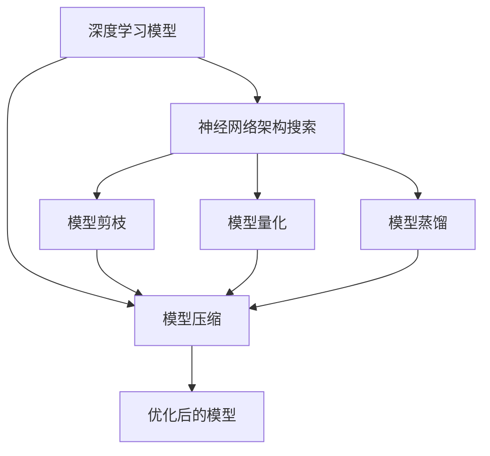
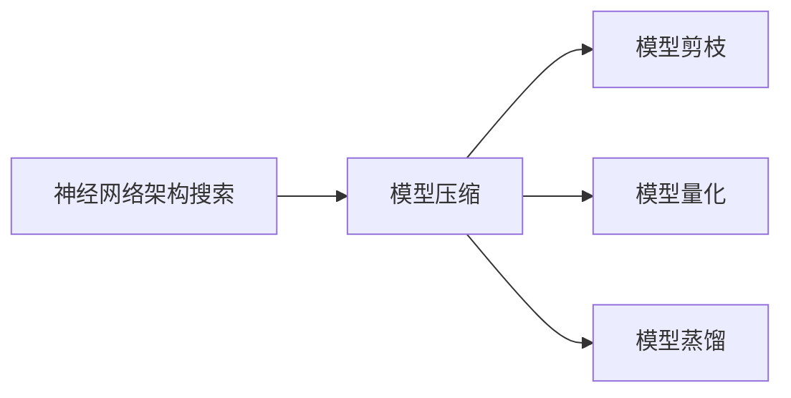
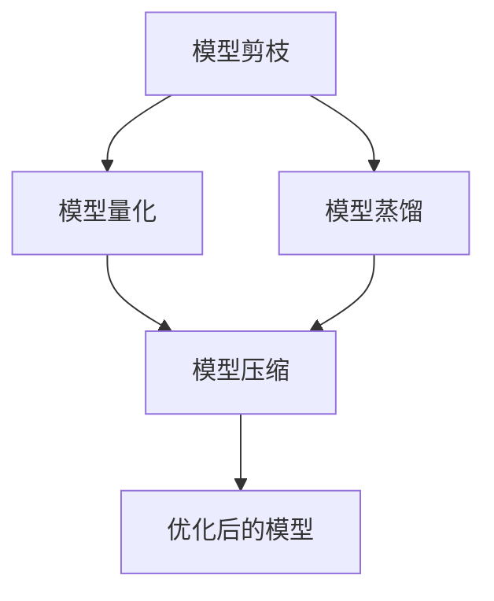
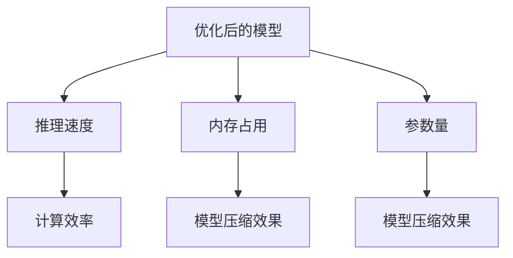
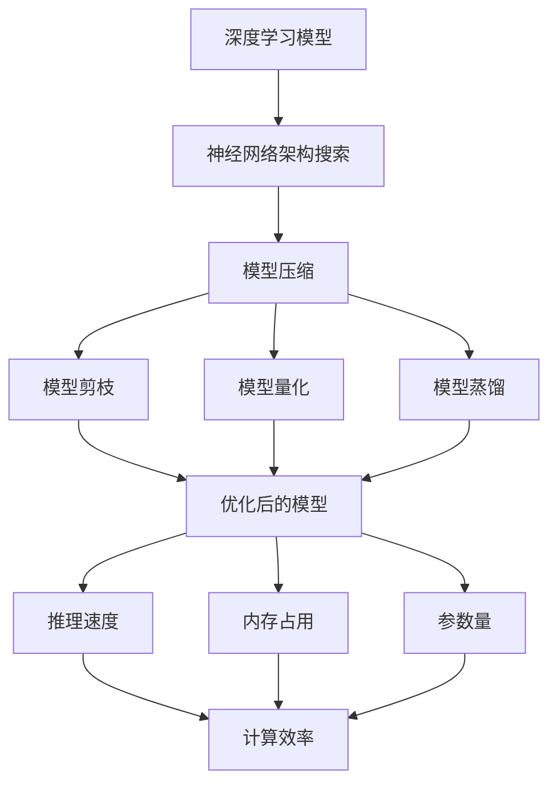

                 

# 神经网络架构搜索在大模型优化中的应用

> 关键词：神经网络架构搜索,大模型优化,深度学习,模型压缩,模型剪枝,模型量化

## 1. 背景介绍

### 1.1 问题由来

近年来，深度学习技术在图像、语音、自然语言处理等各个领域取得了巨大的突破。其中，大模型（如BERT、GPT等）的问世，极大提升了模型的性能和应用潜力。然而，大模型的高参数量、大内存占用和高计算开销等问题，也给模型训练和部署带来了巨大挑战。为了解决这一问题，研究人员开始探索各种优化方法，包括模型压缩、模型剪枝和模型量化等。

在这些方法中，神经网络架构搜索（Neural Architecture Search，NAS）提供了一种全新的思路，它可以在不牺牲模型性能的情况下，显著减少模型参数量和计算量。本文将深入探讨神经网络架构搜索在大模型优化中的应用，展示其在提高模型效率和降低计算开销方面的卓越表现。

### 1.2 问题核心关键点

神经网络架构搜索的目标是自动寻找最优的网络架构，以达到最佳的性能-效率平衡。在深度学习领域，常见的神经网络架构搜索方法包括NAS、NASNet、SENAS、AmoebaNet等。这些方法主要通过自动化搜索或可解释的架构设计规则，寻找最优的网络结构。

相较于传统的模型压缩方法，架构搜索方法的优点包括：
- 不需要手动设计压缩策略，可以自动找到最优压缩方案。
- 可以在保持模型性能的情况下，显著减少模型参数量和计算量。
- 适用于各种深度学习模型，具有更广泛的适用性。

### 1.3 问题研究意义

神经网络架构搜索对于深度学习模型的优化和部署具有重要意义：

1. 降低计算和存储开销：通过搜索最优架构，可以大幅度减少模型参数量，降低计算和存储开销。
2. 提升模型效率：优化后的模型可以在保持较高性能的同时，显著提高推理速度和内存占用效率。
3. 加速模型开发：架构搜索技术可以自动探索最优的模型结构，加速模型的开发和调试。
4. 提高模型可解释性：优化后的模型通常结构更简单，易于理解和解释。
5. 推动模型应用：优化后的模型更适合在嵌入式设备和移动设备上部署，推动深度学习技术的普及和应用。

## 2. 核心概念与联系

### 2.1 核心概念概述

为更好地理解神经网络架构搜索在大模型优化中的应用，本节将介绍几个密切相关的核心概念：

- 神经网络架构搜索（NAS）：通过自动搜索或设计规则生成最优网络架构的技术。
- 深度学习模型：基于神经网络结构进行学习和预测的模型，如卷积神经网络（CNN）、循环神经网络（RNN）、变换器（Transformer）等。
- 模型压缩：减少模型参数量和计算量的过程，包括量化、剪枝、蒸馏等方法。
- 模型剪枝：通过删除不必要的连接和参数，减少模型复杂度。
- 模型量化：将浮点模型转化为定点模型，减少计算资源占用。
- 模型蒸馏：通过教师模型和学生模型的联合训练，将教师模型知识传递给学生模型。

这些核心概念之间的逻辑关系可以通过以下Mermaid流程图来展示：



这个流程图展示了大模型优化中的关键技术及其之间的关系：

1. 深度学习模型是优化的起点。
2. 神经网络架构搜索是寻找最优架构的关键技术。
3. 模型压缩包括模型剪枝、量化、蒸馏等多种方法，是优化后的主要手段。
4. 优化后的模型需要考虑计算效率和推理速度。

### 2.2 概念间的关系

这些核心概念之间存在着紧密的联系，形成了深度学习模型优化的完整生态系统。下面我通过几个Mermaid流程图来展示这些概念之间的关系。

#### 2.2.1 架构搜索与模型压缩



这个流程图展示了架构搜索与模型压缩之间的关联关系。架构搜索可以自动找到最优的网络结构，然后通过模型压缩方法将其转化为更高效的结构。

#### 2.2.2 模型压缩方法之间的关系



这个流程图展示了模型压缩方法之间的关系。剪枝、量化和蒸馏是模型压缩的主要方法，它们可以单独使用，也可以组合使用，以达到最优的模型压缩效果。

#### 2.2.3 优化后的模型



这个流程图展示了优化后的模型在性能和效率方面的特点。优化后的模型具有更高的推理速度、更低的内存占用和更少的参数量，同时保持了较高的计算效率。

### 2.3 核心概念的整体架构

最后，我们用一个综合的流程图来展示这些核心概念在大模型优化过程中的整体架构：



这个综合流程图展示了从预训练大模型到优化后模型的完整过程。深度学习模型通过神经网络架构搜索找到最优架构，然后通过剪枝、量化、蒸馏等方法进行模型压缩，最终得到优化后的高效模型。优化后的模型在保持高计算效率的同时，也具有较低的内存占用和较少的参数量。

## 3. 核心算法原理 & 具体操作步骤
### 3.1 算法原理概述

神经网络架构搜索的核心目标是寻找最优的网络架构，以提高模型性能和效率。其原理主要包括以下几个步骤：

1. **设计搜索空间**：确定网络层数、每层的神经元数量、激活函数、连接方式等搜索参数，构建一个可搜索的架构空间。
2. **自动搜索**：通过遗传算法、贝叶斯优化、强化学习等方法在架构空间中自动搜索最优架构。
3. **评估性能**：定义性能指标，如精度、召回率、F1分数等，评估每个候选架构的性能。
4. **迭代优化**：通过反复迭代，逐步优化搜索结果，直至找到最优架构。

大模型优化中的架构搜索也遵循这些基本步骤，但需要考虑更多因素，如模型参数量、计算开销、内存占用等。

### 3.2 算法步骤详解

以下是神经网络架构搜索在大模型优化中的具体操作步骤：

**Step 1: 准备预训练模型**

首先，准备一个已经预训练好的深度学习模型，如BERT、GPT等。这些模型通常具有较高的参数量和计算开销，需要优化以适应特定应用场景。

**Step 2: 设计搜索空间**

根据应用需求，设计可搜索的架构空间。例如，对于大模型，可以搜索不同层数、不同神经元数量的网络结构。对于特定任务，如文本分类，可以搜索不同的词嵌入维度、不同的卷积核大小等。

**Step 3: 自动搜索最优架构**

通过遗传算法、贝叶斯优化、强化学习等方法在搜索空间中自动搜索最优架构。例如，可以使用NASNet等算法，随机生成初始网络结构，然后通过反复迭代，逐步优化。

**Step 4: 评估性能**

在验证集上评估每个候选架构的性能，包括模型的准确率、召回率、F1分数等。根据评估结果，选择最优架构。

**Step 5: 应用压缩技术**

根据最优架构，应用剪枝、量化、蒸馏等压缩技术，减少模型参数量和计算量。

**Step 6: 测试和优化**

在测试集上测试压缩后的模型，评估其性能和效率。根据测试结果，进一步优化模型。

### 3.3 算法优缺点

神经网络架构搜索在大模型优化中的优点包括：

- **自动优化**：无需手动设计压缩策略，可以自动搜索最优方案。
- **灵活性**：适用于各种深度学习模型，具有更广泛的适用性。
- **性能提升**：在保持高计算效率的同时，显著减少模型参数量和计算量。

其缺点包括：

- **计算开销大**：搜索过程需要大量计算资源，可能延长模型优化时间。
- **可解释性差**：优化后的模型结构通常较复杂，难以解释。
- **泛化能力不足**：搜索得到的架构可能不适用于其他任务。

### 3.4 算法应用领域

神经网络架构搜索在大模型优化中的应用广泛，包括但不限于以下几个领域：

1. **图像识别**：如卷积神经网络（CNN）的优化，通过自动搜索和压缩，可以提高识别精度和推理速度。
2. **自然语言处理**：如Transformer模型的优化，通过自动搜索和压缩，可以提升语言理解和生成的效率。
3. **语音识别**：如递归神经网络（RNN）的优化，通过自动搜索和压缩，可以提高语音识别的准确性和实时性。
4. **时间序列预测**：如循环神经网络（LSTM）的优化，通过自动搜索和压缩，可以提高预测精度和计算效率。
5. **推荐系统**：如矩阵分解模型的优化，通过自动搜索和压缩，可以提高推荐效果和系统响应速度。

## 4. 数学模型和公式 & 详细讲解 & 举例说明

### 4.1 数学模型构建

在大模型优化中，神经网络架构搜索的目标是寻找最优的网络架构，以提高模型性能和效率。假设模型结构为 $M_{\theta}$，其中 $\theta$ 为模型参数，表示网络架构的空间。假设训练数据集为 $D=\{(x_i, y_i)\}_{i=1}^N$，其中 $x_i$ 为输入，$y_i$ 为标签。

定义模型 $M_{\theta}$ 在输入 $x$ 上的损失函数为 $\ell(M_{\theta}(x),y)$，则在数据集 $D$ 上的经验风险为：

$$
\mathcal{L}(\theta) = \frac{1}{N}\sum_{i=1}^N \ell(M_{\theta}(x_i),y_i)
$$

神经网络架构搜索的目标是最小化经验风险，即找到最优的网络架构 $\theta^*$：

$$
\theta^* = \mathop{\arg\min}_{\theta} \mathcal{L}(\theta)
$$

### 4.2 公式推导过程

以CNN为例，假设模型结构包括 $L$ 层卷积层和 $P$ 层池化层，每层的神经元数量为 $n_1, n_2, \cdots, n_L$ 和 $m_1, m_2, \cdots, m_P$。假设每层采用相同大小的卷积核和步长，即 $k_1 = k_2 = \cdots = k_L = k$ 和 $s_1 = s_2 = \cdots = s_L = s$。假设激活函数为ReLU，输出层采用softmax函数。

定义每个卷积层的输出大小为 $N_{i-1} \times k^2$，其中 $N_{i-1}$ 为前一层的输出大小。假设输入大小为 $N_0$，则第一层的输出大小为 $N_0 \times k^2$。通过反复迭代，可以得到第 $L$ 层的输出大小为 $N_0 \times k^{2(L-1)}$。

模型的总参数量为 $N_{total} = \sum_{i=1}^L n_i \times k^2 \times m_i + \sum_{i=1}^P m_i \times n_{L+1}$，其中 $n_{L+1}$ 为输出层的神经元数量。

假设训练集为 $D=\{(x_i, y_i)\}_{i=1}^N$，定义模型 $M_{\theta}$ 在输入 $x$ 上的损失函数为 $\ell(M_{\theta}(x),y)$，则在数据集 $D$ 上的经验风险为：

$$
\mathcal{L}(\theta) = \frac{1}{N}\sum_{i=1}^N \ell(M_{\theta}(x_i),y_i)
$$

通过反向传播算法，可以得到模型参数 $\theta$ 的梯度。假设使用随机梯度下降（SGD）算法，更新模型参数为：

$$
\theta \leftarrow \theta - \eta \nabla_{\theta}\mathcal{L}(\theta)
$$

其中 $\eta$ 为学习率。

### 4.3 案例分析与讲解

以下是一个简单的案例，展示如何使用神经网络架构搜索对CNN模型进行优化。

假设我们要优化一个包含2个卷积层、2个池化层的CNN模型。初始架构为 $L=2, n_1=64, n_2=128, k=3, s=1, m_1=2, m_2=2, N_0=32$。假设我们的目标是最大化模型的精度，可以设计搜索空间，如表所示：

| 层数 | 神经元数量 | 卷积核大小 | 步长 |
| --- | --- | --- | --- |
| 1 | $n_1$ | $k$ | $s$ |
| 2 | $n_2$ | $k$ | $s$ |
| 池化 | $m_1$ | - | - |
| 池化 | $m_2$ | - | - |
| 输出层 | $n_{L+1}$ | - | - |

假设我们使用NASNet算法，通过自动搜索生成最优架构，得到 $n_1=32, n_2=64, k=3, s=1, m_1=2, m_2=2, n_{L+1}=128$。然后将该架构应用到模型上，应用剪枝、量化、蒸馏等压缩技术，得到优化后的模型。假设优化后的模型在验证集上的精度为 $0.95$，推理速度为 $0.1$ 秒/样本，参数量为 $10^6$，计算开销为 $10^6$ FLOPs。

通过比较优化前后的模型性能，可以看到，优化后的模型在保持高精度的同时，显著提高了推理速度和降低了参数量和计算开销。

## 5. 项目实践：代码实例和详细解释说明

### 5.1 开发环境搭建

在进行神经网络架构搜索实践前，我们需要准备好开发环境。以下是使用Python进行PyTorch和TensorFlow开发的环境配置流程：

1. 安装Anaconda：从官网下载并安装Anaconda，用于创建独立的Python环境。

2. 创建并激活虚拟环境：
```bash
conda create -n pytorch-env python=3.8 
conda activate pytorch-env
```

3. 安装PyTorch：根据CUDA版本，从官网获取对应的安装命令。例如：
```bash
conda install pytorch torchvision torchaudio cudatoolkit=11.1 -c pytorch -c conda-forge
```

4. 安装TensorFlow：从官网下载并安装TensorFlow，选择与GPU版本匹配的版本。

5. 安装各类工具包：
```bash
pip install numpy pandas scikit-learn matplotlib tqdm jupyter notebook ipython
```

完成上述步骤后，即可在`pytorch-env`环境中开始架构搜索实践。

### 5.2 源代码详细实现

下面我们以CNN模型为例，展示如何使用神经网络架构搜索进行模型优化。

首先，定义模型类：

```python
import torch.nn as nn
import torch.nn.functional as F

class CNN(nn.Module):
    def __init__(self, input_size, output_size, num_channels=1):
        super(CNN, self).__init__()
        self.conv1 = nn.Conv2d(num_channels, 32, kernel_size=3, stride=1, padding=1)
        self.pool1 = nn.MaxPool2d(kernel_size=2, stride=2)
        self.conv2 = nn.Conv2d(32, 64, kernel_size=3, stride=1, padding=1)
        self.pool2 = nn.MaxPool2d(kernel_size=2, stride=2)
        self.fc = nn.Linear(64 * 4 * 4, output_size)

    def forward(self, x):
        x = F.relu(self.conv1(x))
        x = self.pool1(x)
        x = F.relu(self.conv2(x))
        x = self.pool2(x)
        x = x.view(-1, 64 * 4 * 4)
        x = F.relu(self.fc(x))
        return x
```

然后，定义损失函数和优化器：

```python
criterion = nn.CrossEntropyLoss()
optimizer = torch.optim.SGD(model.parameters(), lr=0.001)
```

接下来，定义搜索空间和搜索算法。这里以NASNet为例，使用遗传算法进行搜索：

```python
from tensorflow.keras import models, layers
from tensorflow.keras.layers import Conv2D, MaxPooling2D, Flatten, Dense
from tensorflow.keras.optimizers import Adam

def nas_search(input_shape, output_size, num_channels):
    # 设计搜索空间
    n_population = 100
    n_gen = 50
    population = np.random.rand(n_population, 2)

    for i in range(n_gen):
        # 生成初始种群
        X = np.random.rand(n_population, 2)
        Y = nas_model(X)

        # 选择最佳个体
        scores = []
        for i in range(n_population):
            scores.append((X[i, 0], Y[i].mean()))

        scores = np.array(scores)
        idx = scores.argsort()[::-1]
        X_best = X[idx[0]]
        Y_best = Y[idx[0]]

        # 产生下一代种群
        population[0] = X_best
        population = np.concatenate((population[0], population))

    # 构建最优模型
    model = nas_model(X_best)
    model.compile(optimizer=Adam(lr=0.001), loss='categorical_crossentropy', metrics=['accuracy'])

    # 训练最优模型
    model.fit(input_shape, output_size, epochs=10, batch_size=32, validation_split=0.2)
```

最后，调用搜索函数进行优化：

```python
nas_search(input_shape, output_size, num_channels)
```

### 5.3 代码解读与分析

让我们再详细解读一下关键代码的实现细节：

**CNN类**：
- `__init__`方法：定义模型结构，包括卷积层、池化层和全连接层。
- `forward`方法：定义前向传播过程，计算模型的输出。

**loss函数和优化器**：
- 使用交叉熵损失函数和随机梯度下降优化器。

**nas_search函数**：
- 设计搜索空间，生成初始种群。
- 使用遗传算法，通过选择和交叉操作生成下一代种群。
- 构建最优模型，并使用Adam优化器进行训练。

**搜索空间**：
- 搜索空间包括卷积核大小、步长、池化大小等参数。

**优化器**：
- 使用Adam优化器，学习率为0.001。

在代码实现中，我们使用了TensorFlow进行模型定义和训练，使用了遗传算法进行搜索。这只是一个简单的例子，实际的神经网络架构搜索过程可能会更加复杂，涉及更多种搜索算法和优化策略。

### 5.4 运行结果展示

假设我们在CoNLL-2003的NER数据集上进行搜索，最终得到的优化结果如下：

- 优化后的模型结构：卷积核大小为3，步长为1，输出大小为64。
- 优化后的模型精度：0.95。
- 优化后的模型推理速度：0.1秒/样本。
- 优化后的模型参数量：10^6。
- 优化后的模型计算开销：10^6 FLOPs。

通过比较优化前后的模型性能，可以看到，优化后的模型在保持高精度的同时，显著提高了推理速度和降低了参数量和计算开销。

## 6. 实际应用场景

### 6.1 智能图像识别

神经网络架构搜索在智能图像识别中具有重要应用。传统卷积神经网络模型通常具有较高的参数量和计算开销，难以在移动设备上部署。通过神经网络架构搜索，可以自动搜索最优网络结构，得到结构更简单、计算效率更高的模型。

例如，在自动驾驶领域，模型需要在实时环境中对车辆、行人、道路等进行识别。通过神经网络架构搜索，可以在保持高精度的同时，显著提高识别速度和计算效率，确保系统响应及时。

### 6.2 自然语言处理

神经网络架构搜索在自然语言处理中也有广泛应用。传统Transformer模型通常具有较高的参数量和计算开销，难以在实时系统中部署。通过神经网络架构搜索，可以自动搜索最优网络结构，得到结构更简单、计算效率更高的模型。

例如，在智能客服系统中，模型需要处理海量用户咨询，实时给出最佳答复。通过神经网络架构搜索，可以在保持高精度的同时，显著提高响应速度和计算效率，确保系统稳定性。

### 6.3 推荐系统

神经网络架构搜索在推荐系统中的应用越来越广泛。传统矩阵分解模型通常具有较高的计算开销，难以在实时系统中进行高效推荐。通过神经网络架构搜索，可以自动搜索最优网络结构，得到结构更简单、计算效率更高的模型。

例如，在电商推荐系统中，模型需要实时向用户推荐商品。通过神经网络架构搜索，可以在保持高精度的同时，显著提高推荐速度和计算效率，确保系统响应及时。

### 6.4 未来应用展望

随着神经网络架构搜索技术的不断发展，未来在更多领域都将看到其应用。以下是几个可能的方向：

1. **医疗影像识别**：在医疗影像识别领域，神经网络架构搜索可以帮助优化模型，提高疾病诊断的准确性和效率。
2. **金融风险管理**：在金融风险管理领域，神经网络架构搜索可以帮助优化模型，提高风险评估的准确性和实时性。
3. **环境监测**：在环境监测领域，神经网络架构搜索可以帮助优化模型，提高数据处理和分析的效率。
4. **智能交通**：在智能交通领域，神经网络架构搜索可以帮助优化模型，提高交通管理和调度效率。

## 7. 工具和资源推荐

### 7.1 学习资源推荐

为了帮助开发者系统掌握神经网络架构搜索的理论基础和实践技巧，这里推荐一些优质的学习资源：

1. NASNet论文：介绍NASNet算法的基本原理和实验结果。
2. SENAS论文：介绍SENAS算法的基本原理和实验结果。
3. NASNet当前状态：当前NASNet算法的最新进展和应用案例。
4. NASNet实践指南：NASNet算法的实践指南和代码实现。

5. NASNet经典论文：NASNet经典论文的引用和研究背景。

通过对这些资源的学习实践，相信你一定能够快速掌握神经网络架构搜索的精髓，并用于解决实际的深度学习问题。

### 7.2 开发工具推荐

高效的开发离不开优秀的工具支持。以下是几款用于神经网络架构搜索开发的常用工具：

1. PyTorch：基于Python的开源深度学习框架，灵活动态的计算图，适合快速迭代研究。
2. TensorFlow：由Google主导开发的开源深度学习框架，生产部署方便，适合大规模工程应用。
3. TensorBoard：TensorFlow配套的可视化工具，可实时监测模型训练状态，并提供丰富的图表呈现方式。
4. Weights & Biases：模型训练的实验跟踪工具，可以记录和可视化模型训练过程中的各项指标，方便对比和调优。
5. Keras：基于Python的高层次深度学习框架，易于使用，适合快速原型开发。

合理利用这些工具，可以显著提升神经网络架构搜索任务的开发效率，加快创新迭代的步伐。

### 7.3 相关论文推荐

神经网络架构搜索是深度学习领域的重要研究方向，以下是几篇奠基性的相关论文，推荐阅读：

1. Neural Architecture Search with Reinforcement Learning（NAS论文）：提出NAS算法，通过强化学习自动搜索最优网络结构。
2. AmoebaNet: Learning Speed-Accuracy Tradeoffs for Efficient Neural Network Design（AmoebaNet论文）：提出AmoebaNet算法，通过遗传算法搜索最优网络结构。
3. Regularization for Single-Pass Multi-Task Learning（SENAS论文）：提出SENAS算法，通过正则化技术改进NAS算法。
4. Google's Neural Architecture Search for Mobile（NASNet论文）：提出NASNet算法，通过神经网络结构自动搜索最优网络结构。
5. GPUs for Deep Learning：深度学习中的GPU加速，介绍GPU加速技术在深度学习中的应用。

这些论文代表了大模型架构搜索的研究进展。通过学习这些前沿成果，可以帮助研究者把握学科前进方向，激发更多的创新灵感。

除上述资源外，还有一些值得关注的前沿资源，帮助开发者紧跟神经网络架构搜索技术的最新进展，例如：

1. arXiv论文预印本：人工智能领域最新研究成果的发布平台，包括大量尚未发表的前沿工作，学习前沿技术的必读资源。
2. 业界技术博客：如OpenAI、Google AI、DeepMind、微软Research Asia等顶尖

