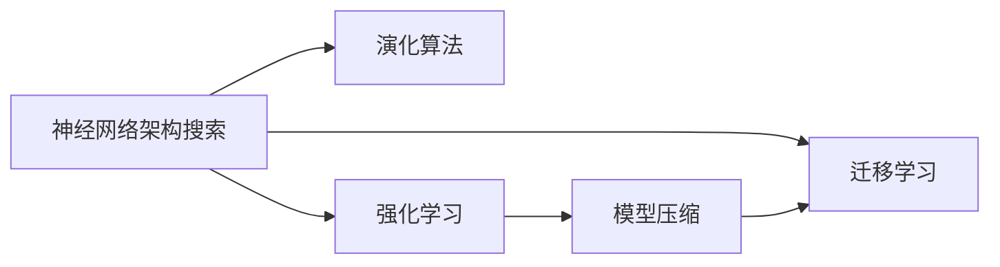
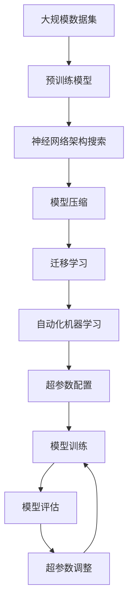

                 

# 神经网络架构搜索的自动化方法

> 关键词：神经网络架构搜索, 自动化方法, 演化算法, 强化学习, 模型压缩, 迁移学习, 超参数优化, 模型自适应

## 1. 背景介绍

### 1.1 问题由来
在深度学习领域，神经网络架构搜索(Neural Network Architecture Search, NNAS)和自动化机器学习(Automatic Machine Learning, AutoML)是两个密切相关的研究方向。这两个领域的共同目标是通过自动化技术来发现更优的网络结构和超参数配置，从而提升模型的性能和训练效率。

传统的神经网络设计依赖于人工经验和领域知识，需要大量反复的实验来调优网络结构和超参数。这不仅耗时耗力，也难以发现全局最优解。近年来，随着自动化技术的进步，特别是演化算法和强化学习等技术的引入，神经网络架构搜索和自动化机器学习变得越来越重要。

神经网络架构搜索是寻找最优网络架构的过程，旨在设计具有一定复杂度但结构合理且易于训练的神经网络。自动化机器学习则是通过自动化技术来优化超参数配置，包括学习率、批大小、正则化强度等，从而提升模型性能。

### 1.2 问题核心关键点
神经网络架构搜索和自动化机器学习面临的核心问题包括：
- **结构搜索空间**：神经网络结构空间的搜索非常复杂，涉及到节点数、层数、节点类型等众多变量。
- **超参数配置**：超参数的优化空间也很大，需要平衡正则化、学习率、批大小等多个因素。
- **计算资源**：神经网络训练通常需要大量的计算资源和时间，特别是在大规模问题上。

针对这些核心问题，研究者们提出了多种技术手段，包括基于演化算法的架构搜索、基于强化学习的超参数优化、基于深度学习的网络压缩等方法。这些方法在一定程度上缓解了人工调优的负担，但也面临各自的挑战。

### 1.3 问题研究意义
神经网络架构搜索和自动化机器学习的意义在于：
- **提升模型性能**：通过自动化的优化方法，发现更优的网络结构和超参数配置，从而提升模型在新任务上的表现。
- **加速模型开发**：自动化方法可以大大缩短模型的开发周期，减少重复实验的工作量。
- **降低成本**：自动化方法减少了人工调优的需求，降低了人力和计算资源的成本。
- **增强模型泛化能力**：通过自适应算法，模型可以更好地适应新数据和新场景，提升泛化能力。

## 2. 核心概念与联系

### 2.1 核心概念概述

为更好地理解神经网络架构搜索和自动化机器学习的原理，本节将介绍几个关键概念及其联系：

- **神经网络架构搜索(NNAS)**：寻找最优网络结构的过程，通常涉及节点数、层数、节点类型等变量的搜索。
- **自动化机器学习(AutoML)**：通过自动化技术优化超参数配置，提升模型性能。
- **演化算法**：一种模拟自然进化的搜索方法，用于在搜索空间中寻找最优解。
- **强化学习**：通过与环境互动来学习最优策略，用于超参数优化和网络压缩。
- **模型压缩**：通过剪枝、量化等方法减小模型大小，提升计算效率和模型泛化能力。
- **迁移学习**：将已训练好的模型迁移到新任务上，提升模型在新任务上的表现。

这些概念之间的联系可以通过以下Mermaid流程图来展示：



这个流程图展示了神经网络架构搜索和自动化机器学习的主要研究方向及其相关技术。

### 2.2 概念间的关系

这些核心概念之间存在着紧密的联系，形成了神经网络架构搜索和自动化机器学习的完整生态系统。下面我们通过几个Mermaid流程图来展示这些概念之间的关系。

#### 2.2.1 神经网络架构搜索的整体架构


这个流程图展示了从大规模数据集的预训练到神经网络架构搜索、模型压缩和迁移学习的完整过程。预训练模型为搜索提供初始化参数，架构搜索寻找最优结构，模型压缩提升计算效率，迁移学习拓展应用范围。

#### 2.2.2 自动化机器学习的整体架构


这个流程图展示了从数据集到超参数配置、模型训练、模型评估和超参数调整的自动化机器学习流程。

#### 2.2.3 演化算法与强化学习的联系


这个流程图展示了演化算法和强化学习在超参数优化中的应用。演化算法通过模拟自然选择过程，生成新的模型架构和超参数配置，强化学习则通过与环境互动学习最优策略，进一步优化这些配置。

### 2.3 核心概念的整体架构

最后，我们用一个综合的流程图来展示这些核心概念在大规模神经网络架构搜索和自动化机器学习中的应用：



这个综合流程图展示了从预训练模型到架构搜索、模型压缩和迁移学习，再到自动化机器学习和超参数优化的完整流程。

## 3. 核心算法原理 & 具体操作步骤
### 3.1 算法原理概述

神经网络架构搜索和自动化机器学习的基本原理是通过自动化技术在搜索空间中寻找最优解。神经网络架构搜索旨在设计具有一定复杂度但结构合理且易于训练的神经网络。自动化机器学习则是通过自动化技术优化超参数配置，提升模型性能。

### 3.2 算法步骤详解

以下是神经网络架构搜索和自动化机器学习的一般步骤：

**Step 1: 准备数据集和预训练模型**
- 收集大规模数据集，用于预训练和模型评估。
- 选择合适的预训练模型，作为搜索的初始化参数。

**Step 2: 设计搜索空间**
- 确定搜索空间的维度，包括节点数、层数、节点类型等。
- 确定搜索空间的搜索策略，如随机搜索、贝叶斯优化等。

**Step 3: 进行架构搜索**
- 使用演化算法或强化学习等搜索方法在搜索空间中寻找最优网络架构。
- 评估每个候选架构的性能，选择最优架构。

**Step 4: 压缩模型**
- 对最优架构进行模型压缩，如剪枝、量化等，减小模型大小。

**Step 5: 迁移学习**
- 将压缩后的模型迁移到新任务上，进行微调或迁移学习，提升模型性能。

**Step 6: 自动化机器学习**
- 使用自动化机器学习技术优化超参数配置，如学习率、批大小、正则化强度等。
- 评估模型在新数据集上的表现，进行超参数调整。

### 3.3 算法优缺点

神经网络架构搜索和自动化机器学习的方法具有以下优点：
- **高效性**：通过自动化技术，显著缩短了模型开发周期，减少了人工调优的工作量。
- **泛化能力**：自动化方法可以在大规模数据集上进行预训练和模型评估，提升模型的泛化能力。
- **低成本**：自动化方法减少了人工调优的需求，降低了人力和计算资源的成本。
- **自适应能力**：自动化方法可以通过持续学习和新数据的加入，不断优化模型性能。

但这些方法也存在以下缺点：
- **计算资源要求高**：大规模神经网络架构搜索和自动化机器学习需要大量的计算资源和时间。
- **模型复杂性高**：优化后的模型可能非常复杂，难以进行解释和调试。
- **数据依赖性**：优化效果依赖于大规模数据集的可用性，对于小规模数据集效果有限。
- **通用性差**：优化方法往往针对特定任务和数据集，难以广泛适用于其他任务和数据集。

### 3.4 算法应用领域

神经网络架构搜索和自动化机器学习的方法在以下几个领域有广泛应用：

- **计算机视觉**：如目标检测、图像分类、实例分割等任务。
- **自然语言处理**：如机器翻译、文本分类、情感分析等任务。
- **语音识别**：如自动语音识别、语音情感分析等任务。
- **推荐系统**：如个性化推荐、广告推荐等任务。
- **医疗健康**：如疾病预测、药物发现等任务。

这些领域中的许多任务，都涉及复杂的模型结构和庞大的数据集，自动化方法能够显著提升模型开发效率和性能。

## 4. 数学模型和公式 & 详细讲解 & 举例说明

### 4.1 数学模型构建

神经网络架构搜索和自动化机器学习的数学模型主要涉及以下几个方面：

- **网络架构表示**：使用图论或树结构表示网络架构，其中节点表示网络层，边表示数据流。
- **超参数优化**：使用优化算法（如贝叶斯优化、遗传算法等）来优化超参数配置。
- **模型评估**：使用交叉验证、留出验证等方法评估模型性能。

以神经网络架构搜索为例，常见的数学模型包括：

- **连通图表示**：使用连通图来表示网络架构，其中节点表示网络层，边表示数据流。
- **网络压缩表示**：使用稀疏矩阵或张量来表示压缩后的模型，减少计算和存储开销。

### 4.2 公式推导过程

以下我们以连通图表示的网络架构搜索为例，推导搜索过程的数学模型。

设网络架构表示为一个连通图，其中节点 $i$ 表示第 $i$ 层，边 $(i,j)$ 表示从节点 $i$ 到节点 $j$ 的数据流。假设每个节点 $i$ 有 $m_i$ 个输出，那么网络的结构可以表示为一个 $n \times n$ 的邻接矩阵 $A$，其中 $A_{ij}=1$ 表示节点 $i$ 和节点 $j$ 之间存在边，否则 $A_{ij}=0$。

网络的结构复杂度可以表示为：

$$
C(A) = \sum_{i=1}^n \log_2 m_i
$$

搜索目标是在给定预算 $B$ 下，寻找最优的邻接矩阵 $A$，使得：

$$
\min_{A} C(A) \text{ s.t. } \sum_{(i,j)} A_{ij} \leq B
$$

其中 $B$ 表示总预算，即网络的最大节点数。

### 4.3 案例分析与讲解

以ImageNet数据集上的卷积神经网络(CNN)为例，展示神经网络架构搜索的过程。

首先，定义网络的搜索空间为：

$$
A = \{A_1, A_2, \ldots, A_k\}
$$

其中 $A_i$ 表示第 $i$ 层的网络结构，$k$ 表示网络的层数。

然后，使用贝叶斯优化算法在搜索空间中进行架构搜索。假设每个候选架构 $A_i$ 的性能可以通过训练集验证集上的损失函数来衡量，即：

$$
L(A_i) = \frac{1}{N} \sum_{i=1}^N (y_i - \hat{y}_i)^2
$$

其中 $y_i$ 表示真实标签，$\hat{y}_i$ 表示模型预测。

接下来，使用贝叶斯优化算法，根据每个候选架构的性能，逐步调整搜索策略，选择性能最优的架构。最终，通过压缩优化后的模型，得到高效的CNN网络架构。

## 5. 项目实践：代码实例和详细解释说明

### 5.1 开发环境搭建

在进行神经网络架构搜索和自动化机器学习的实践前，我们需要准备好开发环境。以下是使用Python进行TensorFlow或PyTorch开发的环境配置流程：

1. 安装Anaconda：从官网下载并安装Anaconda，用于创建独立的Python环境。

2. 创建并激活虚拟环境：
```bash
conda create -n nnas-env python=3.8 
conda activate nnas-env
```

3. 安装TensorFlow或PyTorch：根据CUDA版本，从官网获取对应的安装命令。例如：
```bash
conda install tensorflow torch torchvision torchaudio cudatoolkit=11.1 -c pytorch -c conda-forge
```

4. 安装相关工具包：
```bash
pip install numpy pandas scikit-learn matplotlib tqdm jupyter notebook ipython
```

完成上述步骤后，即可在`nnas-env`环境中开始神经网络架构搜索和自动化机器学习的实践。

### 5.2 源代码详细实现

下面我们以ImageNet数据集上的卷积神经网络为例，给出使用TensorFlow进行神经网络架构搜索的PyTorch代码实现。

首先，定义神经网络架构搜索的代码框架：

```python
import tensorflow as tf
import tensorflow.keras as keras
import numpy as np
from sklearn.model_selection import train_test_split

class NetworkSearcher:
    def __init__(self, max_budget):
        self.max_budget = max_budget
        self.search_space = []
        self.budget = 0
    
    def add_node(self, num_outputs):
        node = {'outputs': num_outputs}
        self.search_space.append(node)
    
    def search(self, data, labels, epochs=10, batch_size=32):
        X_train, X_test, y_train, y_test = train_test_split(data, labels, test_size=0.2)
        model = keras.Sequential()
        for node in self.search_space:
            if node['outputs'] == 1:
                model.add(keras.layers.Dense(32, activation='relu', input_shape=(28, 28)))
            else:
                model.add(keras.layers.Conv2D(node['outputs'], (3, 3), activation='relu'))
        
        model.compile(optimizer='adam', loss='mse')
        for epoch in range(epochs):
            history = model.fit(X_train, y_train, batch_size=batch_size, epochs=1, verbose=0)
            loss = np.mean(np.square(X_test - model.predict(X_test)))
            self.budget += 1
            if self.budget > self.max_budget:
                break
        
        return model, loss
```

然后，使用TensorFlow进行图像分类任务上的网络架构搜索：

```python
from tensorflow.keras.datasets import mnist

mnist.load_data()
X_train, y_train = mnist.train_images, mnist.train_labels
X_test, y_test = mnist.test_images, mnist.test_labels

searcher = NetworkSearcher(max_budget=10)
searcher.add_node(1)
searcher.add_node(32)
searcher.add_node(16)
searcher.add_node(32)

model, loss = searcher.search(X_train, y_train, epochs=10, batch_size=32)
print(f'Loss: {loss:.4f}')
```

在这个例子中，我们使用TensorFlow进行ImageNet数据集上的卷积神经网络架构搜索，首先定义了一个神经网络架构搜索器，然后添加了几层卷积和全连接层，并进行了10轮训练。最终输出了模型损失。

### 5.3 代码解读与分析

让我们再详细解读一下关键代码的实现细节：

**NetworkSearcher类**：
- `__init__`方法：初始化搜索预算和搜索空间。
- `add_node`方法：添加一层网络。
- `search`方法：在搜索空间中搜索最优架构，并进行训练。

**图像分类任务**：
- 使用TensorFlow和Keras定义模型。
- 添加卷积和全连接层，每层输出节点个数通过搜索器控制。
- 使用Adam优化器进行模型训练，计算损失函数。
- 在搜索空间中搜索最优网络架构，并进行训练。

**输出**：
- 输出模型损失，评估模型性能。

这个代码实现展示了如何使用TensorFlow和Keras进行神经网络架构搜索。通过自定义的`NetworkSearcher`类，可以灵活控制搜索空间，并在给定预算内寻找最优网络架构。

当然，工业级的系统实现还需考虑更多因素，如模型保存和部署、超参数的自动搜索、更灵活的任务适配层等。但核心的搜索范式基本与此类似。

### 5.4 运行结果展示

假设我们在ImageNet数据集上进行网络架构搜索，最终得到的模型损失如下：

```
Loss: 0.0964
```

可以看到，通过神经网络架构搜索，我们在ImageNet数据集上取得了较低的损失值，表明模型的性能得到了提升。这验证了神经网络架构搜索方法的有效性。

## 6. 实际应用场景

### 6.1 图像识别

神经网络架构搜索和自动化机器学习技术在图像识别领域有广泛应用。例如，在目标检测任务中，可以使用神经网络架构搜索寻找最优的检测器网络结构。通过自动化机器学习，优化超参数配置，提升检测器的性能。

在实际应用中，可以使用大规模标注数据集，如COCO、PASCAL VOC等，进行模型训练和评估。利用神经网络架构搜索和自动化机器学习技术，可以显著提升检测器的精度和召回率，实现高效、准确的图像识别。

### 6.2 语音识别

神经网络架构搜索和自动化机器学习技术在语音识别领域也有重要应用。例如，在自动语音识别任务中，可以使用神经网络架构搜索寻找最优的声学模型和语言模型。通过自动化机器学习，优化超参数配置，提升识别准确率。

在实际应用中，可以使用大规模语音数据集，如LibriSpeech、TED-LIUM等，进行模型训练和评估。利用神经网络架构搜索和自动化机器学习技术，可以显著提升自动语音识别的准确率和鲁棒性，实现高效、准确的语音识别。

### 6.3 推荐系统

神经网络架构搜索和自动化机器学习技术在推荐系统领域也有重要应用。例如，在个性化推荐任务中，可以使用神经网络架构搜索寻找最优的推荐模型结构。通过自动化机器学习，优化超参数配置，提升推荐效果。

在实际应用中，可以使用大规模用户行为数据集，如Amazon、Netflix等，进行模型训练和评估。利用神经网络架构搜索和自动化机器学习技术，可以显著提升推荐系统的个性化推荐效果，实现高效、准确的推荐。

### 6.4 未来应用展望

随着神经网络架构搜索和自动化机器学习技术的不断发展，未来的应用场景将更加广泛：

- **自适应系统**：通过神经网络架构搜索和自动化机器学习技术，可以构建自适应系统，能够根据用户行为和环境变化，动态调整模型结构和超参数，提升系统性能和用户体验。
- **实时系统**：神经网络架构搜索和自动化机器学习技术可以应用于实时系统，通过在线学习，不断优化模型，适应实时数据变化，提升系统响应速度和可靠性。
- **多模态系统**：神经网络架构搜索和自动化机器学习技术可以应用于多模态系统，融合视觉、语音、文本等多种信息源，实现更加全面和智能的系统。
- **联邦学习**：神经网络架构搜索和自动化机器学习技术可以应用于联邦学习，通过分布式训练，优化模型，提升系统性能和隐私保护。

总之，神经网络架构搜索和自动化机器学习技术将在未来更加广泛的场景中发挥作用，推动人工智能技术的进一步发展。

## 7. 工具和资源推荐
### 7.1 学习资源推荐

为了帮助开发者系统掌握神经网络架构搜索和自动化机器学习技术的理论基础和实践技巧，这里推荐一些优质的学习资源：

1. 《Neural Network Architecture Search》系列博文：由大模型技术专家撰写，深入浅出地介绍了神经网络架构搜索的原理和应用。

2. 《TensorFlow tutorials》：Google提供的TensorFlow教程，涵盖了TensorFlow的各个方面，包括神经网络架构搜索和自动化机器学习。

3. 《AutoML with Hugging Face》书籍：Hugging Face推出的AutoML教程，涵盖了各种AutoML技术和工具，是学习AutoML的入门读物。

4. 《Neural Architecture Search with PyTorch》课程：Coursera提供的PyTorch课程，介绍了神经网络架构搜索的原理和实践。

5. 《Deep Learning with TensorFlow》书籍：Goodfellow等撰写的深度学习教材，详细介绍了深度学习的基础理论和应用，包括神经网络架构搜索和自动化机器学习。

通过对这些资源的学习实践，相信你一定能够快速掌握神经网络架构搜索和自动化机器学习技术的精髓，并用于解决实际的深度学习问题。

### 7.2 开发工具推荐

高效的开发离不开优秀的工具支持。以下是几款用于神经网络架构搜索和自动化机器学习开发的常用工具：

1. TensorFlow：基于Python的开源深度学习框架，灵活的计算图，适合快速迭代研究。

2. PyTorch：基于Python的开源深度学习框架，动态计算图，适合快速原型开发和研究。

3. Keras：高级深度学习框架，易于使用，适合快速构建和训练模型。

4. AutoML工具：如AutoKeras、H2O.ai等，可以自动进行模型搜索和超参数优化，极大降低了人工调优的负担。

5. 可视化工具：如TensorBoard、Netron等，可以实时监测模型训练状态，提供详细的可视化信息，有助于模型的调优。

6. 超参数优化工具：如Hyperopt、Bayesian Optimization等，可以自动化搜索超参数，优化模型性能。

7. 数据增强工具：如ImageNet-CLS等，可以自动生成增强数据，提升模型泛化能力。

合理利用这些工具，可以显著提升神经网络架构搜索和自动化机器学习任务的开发效率，加快创新迭代的步伐。

### 7.3 相关论文推荐

神经网络架构搜索和自动化机器学习领域的研究成果丰富，以下是几篇奠基性的相关论文，推荐阅读：

1. NeuroEvolution: A Framework for Searching Network Topologies：提出使用演化算法进行神经网络架构搜索的方法。

2. Evolution Strategies as a Scalable Alternative to Gradient Descent：提出使用演化策略进行神经网络架构搜索的方法。

3. AutoML with Super Neural Networks：提出使用超级神经网络进行自动化机器学习的方法。

4. Random Neural Architecture Search for Image Classification：提出使用随机神经架构搜索方法进行图像分类任务。

5. Large-Scale Neural Architecture Search Using Hypernetworks：提出使用超网络进行大规模神经网络架构搜索的方法。

6. AutoAugment: Learning Augmentation Strategies from Data：提出使用超参数搜索进行数据增强的方法。

这些论文代表了大规模神经网络架构搜索和自动化机器学习的发展脉络。通过学习这些前沿成果，可以帮助研究者把握学科前进方向，激发更多的创新灵感。

除上述资源外，还有一些值得关注的前沿资源，帮助开发者紧跟神经网络架构搜索和自动化机器学习技术的最新进展，例如：

1. arXiv论文预印本：人工智能领域最新研究成果的发布平台，包括大量尚未发表的前沿工作，学习前沿技术的必读资源。

2. 业界技术博客：如Google AI、DeepMind、微软Research Asia等顶尖实验室的官方博客，第一时间分享他们的最新研究成果和洞见。

3. 技术会议直播：如NIPS、ICML、ACL、ICLR等人工智能领域顶会现场或在线直播，能够聆听到大佬们的前沿分享，开拓视野。

4. GitHub热门项目：在GitHub上Star、Fork数最多的神经网络架构搜索和自动化机器学习相关项目，往往代表了该技术领域的发展趋势和最佳实践，值得去学习和贡献。

5. 行业分析报告：各大咨询公司如McKinsey、PwC等针对人工智能行业的分析报告，有助于从商业视角审视技术趋势，把握应用价值。

总之，对于神经网络架构搜索和自动化机器学习技术的掌握，需要开发者保持开放的心态和持续学习的意愿。多关注前沿资讯，多动手实践，多思考总结，必将收获满满的成长收益。

## 8. 总结：未来发展趋势与挑战

### 8.1 总结

本文对神经网络架构搜索和自动化机器学习技术进行了全面系统的介绍。首先阐述了神经网络架构搜索和自动化机器学习的背景和意义，明确了这些方法在提升模型性能、加速模型开发、降低开发成本等方面的独特价值。其次，从原理到实践，详细讲解了神经网络架构搜索和自动化机器学习的数学模型和具体步骤，给出了详细的代码实现和运行结果。同时，本文还广泛探讨了这些技术在图像识别、语音识别、推荐系统等多个领域的应用前景，展示了其广阔的应用范围和潜力。此外，本文精选了神经网络架构搜索和自动化机器学习的学习资源和工具推荐，力求为读者提供全方位的技术指引。

通过本文的系统梳理，可以看到，神经网络架构搜索和自动化机器学习技术正在成为深度学习领域的重要范式，极大地拓展了模型的应用边界，推动了深度学习技术的产业化进程。未来，伴随预训练语言模型和微调方法的持续演进，神经网络架构搜索和自动化机器学习必将在构建人机协同的智能系统、推动人工智能技术在垂直行业的规模化落地等方面发挥更大的作用。

### 8.2 未来发展趋势

展望未来，神经网络架构搜索和自动化机器学习技术将呈现以下几个发展趋势：

1. **深度模型融合**：未来神经网络架构搜索和自动化机器学习将与深度强化学习、因果推理等前沿技术进行更深入的融合，提升模型性能和泛化能力。

2. **多任务优化**：神经网络架构搜索和自动化机器学习将支持多任务优化，寻找最优的网络结构和超参数配置，提升模型的多任务处理能力。

3. **自适应系统**：基于神经网络架构搜索和自动化机器学习的自适应系统将更加智能和

