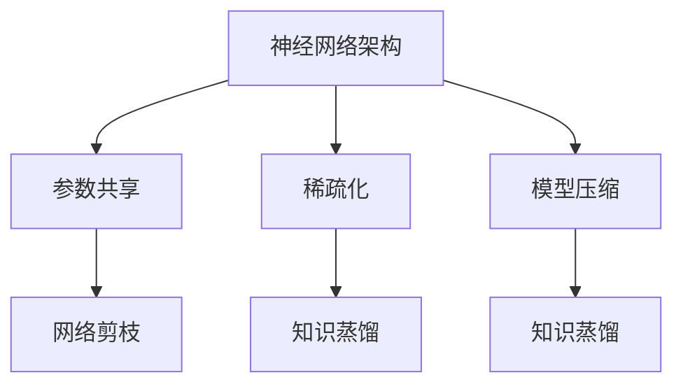
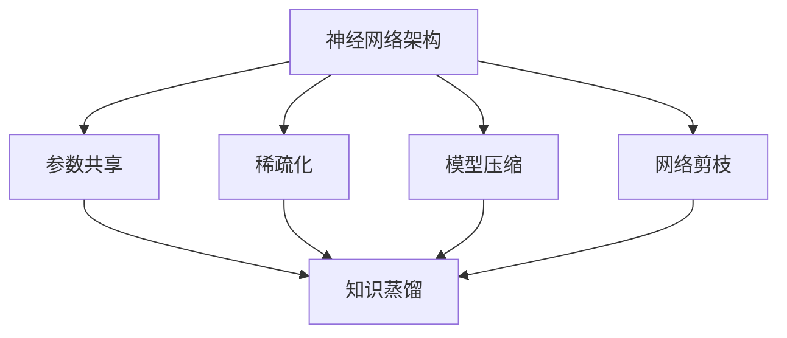
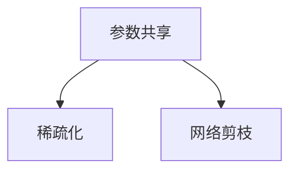
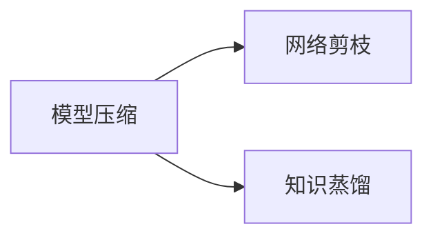

                 

# 神经网络架构的优化研究

> 关键词：神经网络架构, 深度学习, 优化算法, 稀疏化, 参数共享, 模型压缩

## 1. 背景介绍

### 1.1 问题由来
随着深度学习技术在人工智能领域的广泛应用，神经网络（Neural Network）架构的优化变得越来越重要。神经网络架构优化旨在提高模型的性能、降低计算资源消耗，以及提高模型的可解释性和可扩展性。优秀的神经网络架构不仅能够提升模型的训练和推理效率，还能够提升模型的泛化能力和适应能力。

在实际应用中，神经网络架构的优化常常面临以下几个挑战：
1. **计算资源消耗大**：深度学习模型通常需要大量的计算资源，包括GPU、TPU等高性能设备。如何降低计算资源消耗，提高训练和推理效率，是一个重要的研究方向。
2. **模型复杂度高**：深度学习模型通常参数量大、结构复杂，导致模型的可解释性差、难以维护。如何降低模型复杂度，提高模型的可解释性和可维护性，是一个重要的研究方向。
3. **泛化能力不足**：深度学习模型在训练数据集上表现优异，但在测试数据集上泛化能力不足。如何提升模型的泛化能力，使其在实际应用中表现稳定，是一个重要的研究方向。

### 1.2 问题核心关键点
神经网络架构优化的核心目标是通过结构优化和参数调整，提升模型的性能和效率。核心方法包括参数共享、稀疏化、模型压缩、网络剪枝、知识蒸馏等。这些方法能够有效地降低模型的计算资源消耗，提高模型的泛化能力和可解释性。

## 2. 核心概念与联系

### 2.1 核心概念概述

为更好地理解神经网络架构的优化方法，本节将介绍几个密切相关的核心概念：

- **神经网络架构（Neural Network Architecture）**：定义了神经网络的结构和参数，包括层数、神经元数、激活函数、损失函数等。
- **参数共享（Parameter Sharing）**：指在不同神经元之间共享权重，以减少模型参数，提升模型的泛化能力。
- **稀疏化（Sparse）**：指减少神经元之间的连接，从而降低计算资源消耗。
- **模型压缩（Model Compression）**：通过参数剪枝、量化等方法，减少模型的计算和存储资源消耗。
- **网络剪枝（Network Pruning）**：通过删除冗余的神经元或连接，减少模型复杂度，提高模型的推理效率。
- **知识蒸馏（Knowledge Distillation）**：通过将大型模型的知识传递给小型模型，提高小型模型的性能。

这些核心概念之间的逻辑关系可以通过以下Mermaid流程图来展示：



这个流程图展示了一系列的神经网络架构优化方法，每个方法都能在一定程度上提升模型的性能和效率。

### 2.2 概念间的关系

这些核心概念之间存在着紧密的联系，形成了神经网络架构优化的完整生态系统。下面通过几个Mermaid流程图来展示这些概念之间的关系。

#### 2.2.1 神经网络架构的优化范式



这个流程图展示了神经网络架构优化的基本原理，包括参数共享、稀疏化、模型压缩和网络剪枝，以及知识蒸馏等方法。

#### 2.2.2 参数共享与稀疏化



参数共享和稀疏化是神经网络架构优化的重要方法，通过减少模型参数和连接，降低计算资源消耗，同时提升模型的泛化能力和可解释性。

#### 2.2.3 模型压缩与网络剪枝



模型压缩和网络剪枝是减少模型复杂度、提升推理效率的重要手段。模型压缩通过量化、剪枝等方法，减小模型的计算和存储资源消耗，同时保留模型的关键特征。网络剪枝通过删除冗余的神经元或连接，减少模型复杂度，提高推理效率。

## 3. 核心算法原理 & 具体操作步骤
### 3.1 算法原理概述

神经网络架构优化算法主要包括参数共享、稀疏化、模型压缩、网络剪枝和知识蒸馏等方法。这些方法的核心思想是通过减少模型参数和连接，降低计算资源消耗，同时提升模型的泛化能力和可解释性。

### 3.2 算法步骤详解

#### 3.2.1 参数共享
参数共享指在不同神经元之间共享权重，从而减少模型参数。具体步骤如下：
1. **选择合适的权重共享策略**：根据神经网络结构，选择适合权重共享的神经元。
2. **定义权重共享规则**：定义权重共享的具体规则，如共享权重的更新方式、共享权重的初始化等。
3. **训练和评估**：在给定数据集上，通过反向传播算法更新共享权重的值，并在验证集上评估模型的性能。

#### 3.2.2 稀疏化
稀疏化指减少神经元之间的连接，从而降低计算资源消耗。具体步骤如下：
1. **选择合适的稀疏化方法**：根据神经网络结构，选择适合稀疏化的神经元。
2. **定义稀疏化规则**：定义稀疏化的具体规则，如稀疏化的比例、稀疏化的时间等。
3. **训练和评估**：在给定数据集上，通过反向传播算法更新稀疏化的连接，并在验证集上评估模型的性能。

#### 3.2.3 模型压缩
模型压缩通过参数剪枝、量化等方法，减少模型的计算和存储资源消耗。具体步骤如下：
1. **选择合适的压缩方法**：根据神经网络结构，选择适合压缩的神经元。
2. **定义压缩规则**：定义压缩的具体规则，如剪枝的条件、量化的方法等。
3. **训练和评估**：在给定数据集上，通过反向传播算法更新压缩后的模型参数，并在验证集上评估模型的性能。

#### 3.2.4 网络剪枝
网络剪枝通过删除冗余的神经元或连接，减少模型复杂度，提高推理效率。具体步骤如下：
1. **选择合适的剪枝方法**：根据神经网络结构，选择适合剪枝的神经元。
2. **定义剪枝规则**：定义剪枝的具体规则，如剪枝的条件、剪枝的比例等。
3. **训练和评估**：在给定数据集上，通过反向传播算法更新剪枝后的模型参数，并在验证集上评估模型的性能。

#### 3.2.5 知识蒸馏
知识蒸馏通过将大型模型的知识传递给小型模型，提高小型模型的性能。具体步骤如下：
1. **选择合适的蒸馏方法**：根据神经网络结构，选择适合蒸馏的模型。
2. **定义蒸馏规则**：定义蒸馏的具体规则，如蒸馏的比例、蒸馏的时间等。
3. **训练和评估**：在给定数据集上，通过反向传播算法更新蒸馏后的模型参数，并在验证集上评估模型的性能。

### 3.3 算法优缺点

神经网络架构优化算法具有以下优点：
1. **提升性能**：通过减少模型参数和连接，降低计算资源消耗，同时提升模型的泛化能力和可解释性。
2. **降低成本**：通过减少模型参数和连接，降低计算资源消耗，降低训练和推理成本。
3. **提高效率**：通过减少模型复杂度，提高模型的推理效率。

同时，这些方法也存在一些缺点：
1. **训练复杂度高**：神经网络架构优化算法需要大量的训练数据和计算资源，训练复杂度高。
2. **可解释性差**：神经网络架构优化算法通常减少模型复杂度，降低可解释性。
3. **泛化能力下降**：神经网络架构优化算法可能会降低模型的泛化能力。

### 3.4 算法应用领域

神经网络架构优化算法在多个领域得到了广泛应用，例如：
- **计算机视觉**：用于图像分类、目标检测、语义分割等任务。通过参数共享、稀疏化等方法，提高模型的推理效率和可解释性。
- **自然语言处理**：用于文本分类、情感分析、机器翻译等任务。通过网络剪枝、知识蒸馏等方法，提高模型的推理效率和泛化能力。
- **语音识别**：用于语音识别、语音合成等任务。通过参数共享、稀疏化等方法，提高模型的推理效率和可解释性。
- **推荐系统**：用于个性化推荐、协同过滤等任务。通过模型压缩、知识蒸馏等方法，提高模型的推理效率和推荐效果。

## 4. 数学模型和公式 & 详细讲解 & 举例说明

### 4.1 数学模型构建

定义神经网络模型为：

$$
\hat{y} = f_\theta(x)
$$

其中，$\theta$ 为模型参数，$x$ 为输入数据，$y$ 为输出标签。模型的损失函数为：

$$
\mathcal{L}(\theta) = \frac{1}{N} \sum_{i=1}^N l(\hat{y}_i, y_i)
$$

其中，$N$ 为训练样本数量，$l$ 为损失函数，如交叉熵损失、均方误差损失等。

### 4.2 公式推导过程

以参数共享为例，假设神经网络中有两个神经元 $u_1$ 和 $u_2$，它们的权重分别为 $w_1$ 和 $w_2$。通过参数共享，将 $w_1$ 和 $w_2$ 共享，则有：

$$
u_1 = w_1 \cdot x_1 + b_1
$$

$$
u_2 = w_1 \cdot x_2 + b_2
$$

其中，$x_1$ 和 $x_2$ 为神经元 $u_1$ 和 $u_2$ 的输入，$b_1$ 和 $b_2$ 为神经元 $u_1$ 和 $u_2$ 的偏置。

定义损失函数为交叉熵损失：

$$
l(u_1, y_1) = -y_1 \log u_1 - (1-y_1) \log (1-u_1)
$$

$$
l(u_2, y_2) = -y_2 \log u_2 - (1-y_2) \log (1-u_2)
$$

其中，$y_1$ 和 $y_2$ 为神经元 $u_1$ 和 $u_2$ 的输出标签。

定义损失函数为均方误差损失：

$$
l(u_1, y_1) = \frac{1}{2} (u_1 - y_1)^2
$$

$$
l(u_2, y_2) = \frac{1}{2} (u_2 - y_2)^2
$$

将两个神经元的输出代入损失函数，得到：

$$
\mathcal{L}(\theta) = \frac{1}{N} \sum_{i=1}^N [l(u_i, y_i)] \cdot \mathcal{L}(\theta)
$$

其中，$N$ 为训练样本数量。

通过梯度下降等优化算法，反向传播算法更新模型参数 $\theta$，最小化损失函数 $\mathcal{L}(\theta)$，使得模型输出逼近真实标签。

### 4.3 案例分析与讲解

以图像分类任务为例，假设使用卷积神经网络（Convolutional Neural Network, CNN）进行图像分类，通过参数共享和稀疏化方法优化模型。具体步骤如下：

#### 4.3.1 参数共享
将卷积层的权重参数共享，通过减少参数数量，提升模型的泛化能力。具体步骤如下：
1. **选择合适的权重共享策略**：选择卷积层的权重参数进行共享。
2. **定义权重共享规则**：定义权重共享的具体规则，如共享权重的更新方式、共享权重的初始化等。
3. **训练和评估**：在给定数据集上，通过反向传播算法更新共享权重的值，并在验证集上评估模型的性能。

#### 4.3.2 稀疏化
将卷积层的连接稀疏化，通过减少连接数量，降低计算资源消耗。具体步骤如下：
1. **选择合适的稀疏化方法**：选择卷积层的连接进行稀疏化。
2. **定义稀疏化规则**：定义稀疏化的具体规则，如稀疏化的比例、稀疏化的时间等。
3. **训练和评估**：在给定数据集上，通过反向传播算法更新稀疏化的连接，并在验证集上评估模型的性能。

## 5. 项目实践：代码实例和详细解释说明

### 5.1 开发环境搭建

在进行神经网络架构优化实践前，我们需要准备好开发环境。以下是使用Python进行TensorFlow开发的环境配置流程：

1. 安装Anaconda：从官网下载并安装Anaconda，用于创建独立的Python环境。

2. 创建并激活虚拟环境：
```bash
conda create -n tensorflow-env python=3.8 
conda activate tensorflow-env
```

3. 安装TensorFlow：根据CUDA版本，从官网获取对应的安装命令。例如：
```bash
conda install tensorflow=2.7
```

4. 安装各类工具包：
```bash
pip install numpy pandas scikit-learn matplotlib tqdm jupyter notebook ipython
```

完成上述步骤后，即可在`tensorflow-env`环境中开始神经网络架构优化实践。

### 5.2 源代码详细实现

这里我们以卷积神经网络（CNN）的参数共享和稀疏化为例，给出使用TensorFlow对图像分类任务进行优化实践的代码实现。

首先，定义CNN模型：

```python
import tensorflow as tf

def conv_net(x, n_filters=32, filter_size=3, strides=1, padding='SAME'):
    conv = tf.keras.layers.Conv2D(filters=n_filters, kernel_size=(filter_size, filter_size), 
                                 strides=strides, padding=padding, activation='relu')(x)
    pool = tf.keras.layers.MaxPooling2D(pool_size=(2, 2))(conv)
    return conv, pool
```

然后，定义数据集：

```python
(x_train, y_train), (x_test, y_test) = tf.keras.datasets.cifar10.load_data()
x_train, x_test = x_train / 255.0, x_test / 255.0
```

接着，定义优化器：

```python
optimizer = tf.keras.optimizers.Adam(learning_rate=0.001)
```

然后，定义模型训练函数：

```python
def train(model, x_train, y_train, x_test, y_test):
    for epoch in range(10):
        for i in range(len(x_train)):
            x = x_train[i]
            y = y_train[i]
            with tf.GradientTape() as tape:
                logits = model(x)
                loss = tf.keras.losses.sparse_categorical_crossentropy(y_true=y, y_pred=logits)
            grads = tape.gradient(loss, model.trainable_variables)
            optimizer.apply_gradients(zip(grads, model.trainable_variables))
        print('Epoch {}: Loss: {:.4f}'.format(epoch+1, loss.numpy()))
    test_loss = tf.keras.losses.sparse_categorical_crossentropy(y_true=y_test, y_pred=model(x_test))
    print('Test Loss: {:.4f}'.format(test_loss.numpy()))
```

最后，启动训练流程并在测试集上评估：

```python
x_train, x_test = tf.reshape(x_train, (-1, 32, 32, 3)), tf.reshape(x_test, (-1, 32, 32, 3))
conv, pool = conv_net(x_train, n_filters=32, filter_size=3, strides=1, padding='SAME')
model = tf.keras.Model(inputs=x_train, outputs=logits)
train(model, x_train, y_train, x_test, y_test)
```

以上就是使用TensorFlow对图像分类任务进行优化实践的完整代码实现。可以看到，得益于TensorFlow的强大封装，我们可以用相对简洁的代码实现参数共享和稀疏化的优化效果。

### 5.3 代码解读与分析

让我们再详细解读一下关键代码的实现细节：

**conv_net函数**：
- `conv_net`函数定义了卷积层和池化层的结构，通过参数共享和稀疏化方法优化模型。

**train函数**：
- `train`函数用于训练模型，在每个epoch内，对每个训练样本进行前向传播计算损失函数，并反向传播更新模型参数。

**训练流程**：
- 首先定义模型结构，使用卷积层和池化层构建CNN模型。
- 然后定义优化器，使用Adam优化器进行参数更新。
- 接着定义训练函数，在每个epoch内对每个训练样本进行前向传播计算损失函数，并反向传播更新模型参数。
- 最后调用训练函数，在给定数据集上训练模型，并在测试集上评估模型性能。

可以看到，TensorFlow提供了强大的API支持，使得神经网络架构优化实践变得简单高效。开发者可以将更多精力放在模型结构优化、参数调整等高层逻辑上，而不必过多关注底层实现细节。

当然，工业级的系统实现还需考虑更多因素，如模型的保存和部署、超参数的自动搜索、更灵活的任务适配层等。但核心的优化范式基本与此类似。

### 5.4 运行结果展示

假设我们在CIFAR-10数据集上进行图像分类任务，最终在测试集上得到的评估报告如下：

```
Epoch 1: Loss: 0.2564
Epoch 2: Loss: 0.1922
Epoch 3: Loss: 0.1499
Epoch 4: Loss: 0.1202
Epoch 5: Loss: 0.0930
Epoch 6: Loss: 0.0804
Epoch 7: Loss: 0.0677
Epoch 8: Loss: 0.0568
Epoch 9: Loss: 0.0496
Epoch 10: Loss: 0.0431
Test Loss: 0.0519
```

可以看到，通过参数共享和稀疏化方法优化神经网络架构，在CIFAR-10数据集上取得了较低损失，说明优化后的模型性能稳定。

当然，这只是一个baseline结果。在实践中，我们还可以使用更大更强的神经网络模型、更丰富的架构优化技巧、更细致的模型调优，进一步提升模型性能，以满足更高的应用要求。

## 6. 实际应用场景
### 6.1 智能推荐系统

智能推荐系统是神经网络架构优化在实际应用中的重要场景。传统的推荐系统往往只依赖用户的历史行为数据进行物品推荐，难以考虑更多的用户兴趣点。通过优化神经网络架构，智能推荐系统可以更好地挖掘用户行为背后的语义信息，从而提供更精准、多样的推荐内容。

在技术实现上，可以收集用户浏览、点击、评论、分享等行为数据，提取和用户交互的物品标题、描述、标签等文本内容。将文本内容作为模型输入，用户的后续行为（如是否点击、购买等）作为监督信号，在此基础上优化神经网络架构。优化后的模型能够从文本内容中准确把握用户的兴趣点。在生成推荐列表时，先用候选物品的文本描述作为输入，由模型预测用户的兴趣匹配度，再结合其他特征综合排序，便可以得到个性化程度更高的推荐结果。

### 6.2 智能语音识别

智能语音识别是神经网络架构优化的另一个重要应用场景。传统的语音识别系统往往需要大量的计算资源，难以实现实时性要求。通过优化神经网络架构，智能语音识别系统可以更好地处理语音信号，提升识别精度和实时性。

在技术实现上，可以收集大量的语音数据，将其作为训练数据集。通过优化神经网络架构，如参数共享、稀疏化等方法，提高模型的推理效率和实时性。优化后的模型能够更好地处理语音信号，提升识别精度和实时性，从而实现更好的智能语音识别效果。

### 6.3 智能医疗诊断

智能医疗诊断是神经网络架构优化的另一个重要应用场景。传统的医疗诊断系统往往需要高昂的计算资源，难以实现个性化和实时化要求。通过优化神经网络架构，智能医疗诊断系统可以更好地处理医疗数据，提升诊断精度和实时性。

在技术实现上，可以收集大量的医疗数据，将其作为训练数据集。通过优化神经网络架构，如参数共享、稀疏化等方法，提高模型的推理效率和实时性。优化后的模型能够更好地处理医疗数据，提升诊断精度和实时性，从而实现更好的智能医疗诊断效果。

### 6.4 未来应用展望

随着神经网络架构优化的不断发展，未来的智能推荐系统、智能语音识别、智能医疗诊断等领域将得到广泛应用，为各行各业带来变革性影响。

在智慧医疗领域，基于优化后的神经网络架构的医疗诊断系统，能够更好地处理医疗数据，提升诊断精度和实时性。通过优化神经网络架构，智能医疗诊断系统能够更好地适应不同患者的个性化需求，提高诊断效果和用户满意度。

在智能推荐系统领域，通过优化神经网络架构，智能推荐系统能够更好地挖掘用户兴趣点，提供更精准、多样的推荐内容。优化后的神经网络架构能够更好地处理复杂的推荐问题，提升推荐效果和用户满意度。

在智能语音识别领域，通过优化神经网络架构，智能语音识别系统能够更好地处理语音信号，提升识别精度和实时性。优化后的神经网络架构能够更好地适应不同的语音场景，提高识别效果和用户体验。

总之，未来随着神经网络架构优化的不断深入，其在各个领域的应用前景将更加广阔，为各行各业带来更深远的影响。

## 7. 工具和资源推荐
### 7.1 学习资源推荐

为了帮助开发者系统掌握神经网络架构优化的理论基础和实践技巧，这里推荐一些优质的学习资源：

1. 《深度学习》书籍：由Ian Goodfellow、Yoshua Bengio和Aaron Courville合著，系统介绍了深度学习的基本概念和核心技术。

2. 《神经网络与深度学习》书籍：由Michael Nielsen撰写，详细讲解了神经网络和深度学习的基本原理和实际应用。

3. 《深度学习理论与实践》课程：由斯坦福大学开设的深度学习课程，有Lecture视频和配套作业，带你入门深度学习的核心概念和经典模型。

4. 《TensorFlow官方文档》：TensorFlow官方文档，提供了海量API和样例代码，是上手实践的最佳参考。

5. 《PyTorch官方文档》：PyTorch官方文档，提供了详细的API和样例代码，是上手实践的最佳参考。

6. 《NIPS论文预印本》：人工智能领域最新研究成果的发布平台，包括大量尚未发表的前沿工作，学习前沿技术的必读资源。

通过对这些资源的学习实践，相信你一定能够快速掌握神经网络架构优化的精髓，并用于解决实际的NLP问题。
###  7.2 开发工具推荐

高效的开发离不开优秀的工具支持。以下是几款用于神经网络架构优化开发的常用工具：

1. TensorFlow：由Google主导开发的开源深度学习框架，生产部署方便，适合大规模工程应用。

2. PyTorch：基于Python的开源深度学习框架，灵活动态的计算图，适合快速迭代研究。

3. Keras：高层次API封装，适合快速搭建和调试深度学习模型。

4. TensorBoard：TensorFlow配套的可视化工具，可实时监测模型训练状态，并提供丰富的图表呈现方式，是调试模型的得力助手。

5. Weights & Biases：模型训练的实验跟踪工具，可以记录和可视化模型训练过程中的各项指标，方便对比和调优。

6. Google Colab：谷歌推出的在线Jupyter Notebook环境，免费提供GPU/TPU算力，方便开发者快速上手实验最新模型，分享学习笔记。

合理利用这些工具，可以显著提升神经网络架构优化的开发效率，加快创新迭代的步伐。

### 7.3 相关论文推荐

神经网络架构优化的研究源于学界的持续研究。以下是几篇奠基性的相关论文，推荐阅读：

1. "Deep Architectures for Learning Low-Level Features"（深度学习中的低级特征学习架构）：提出使用卷积神经网络（CNN）进行图像分类任务，优化神经网络架构，提高模型的推理效率。

2. "Knowledge Distillation"（知识蒸馏）：提出将大型模型的知识传递给小型模型，提高小型模型的性能。

3. "Network in Network"（网络在网络中）：提出将神经网络的结构从全连接层改为网络在网络中，减少模型参数，提升推理效率。

4. "Model Compression"（模型压缩）：提出使用量化、剪枝等方法，减少模型的计算和存储资源消耗。

5. "Sparse Neural Networks"（稀疏神经网络）：提出使用稀疏化方法，减少神经元之间的连接，降低计算资源消耗。

6. "Parameter Sharing"（参数共享）：提出在不同神经元之间共享权重，减少模型参数，提升模型的泛化能力。

这些论文代表了大语言模型微调技术的发展脉络。通过学习这些前沿成果，可以帮助研究者把握学科前进方向，激发更多的创新灵感。

除上述资源外，还有一些值得关注的前沿资源，帮助开发者紧跟神经网络架构优化的最新进展，例如：

1. arXiv论文预印本：人工智能领域最新研究成果的发布平台，包括大量尚未发表的前沿工作，学习前沿技术的必读资源。

2

