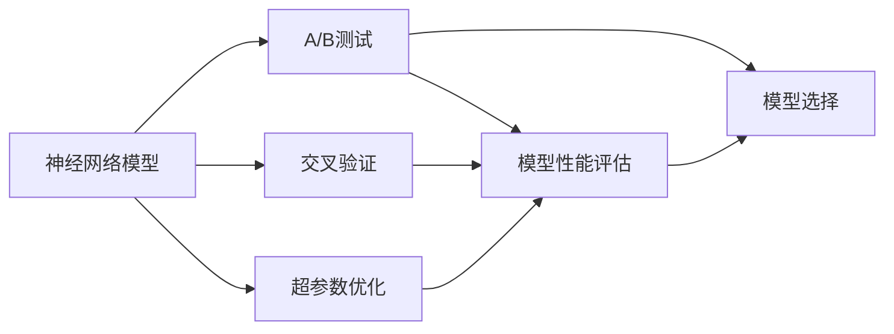

                 

## 1. 背景介绍

在人工智能领域，神经网络模型已经广泛应用于各个行业，包括图像识别、语音识别、自然语言处理等领域。然而，在模型部署和优化过程中，如何确保模型的稳定性和可靠性，是一个至关重要的问题。为此，A/B测试（A/B Testing）策略应运而生，通过比较不同模型在实际应用中的表现，筛选出最优模型，以提升系统性能和用户体验。

### 1.1 问题由来

随着深度学习技术的发展，越来越多的企业开始采用神经网络模型来解决实际问题。然而，这些模型在训练和部署过程中，往往需要大量的数据和计算资源，同时还需要进行多次实验和验证，以确保模型的稳定性和可靠性。

在这种情况下，传统的模型优化和评估方法显得不够高效，需要引入更加科学和系统的测试策略。A/B测试策略正是在这种背景下应运而生的。它通过对比两个或多个模型在实际应用中的表现，筛选出最优模型，避免了盲目优化带来的风险。

### 1.2 问题核心关键点

A/B测试的核心思想是利用实际数据对不同模型进行比较，评估其性能和效果，从而筛选出最优模型。其主要步骤包括：

1. 数据准备：收集需要测试的数据集，并将数据集划分为训练集、验证集和测试集。
2. 模型构建：构建需要测试的神经网络模型，并进行训练和验证。
3. 模型部署：将训练好的模型部署到实际应用中，并收集用户反馈数据。
4. 对比分析：利用收集到的数据，对比不同模型的性能和效果，筛选出最优模型。

A/B测试的优点在于，它可以在实际应用中对模型进行验证，从而筛选出最优模型，避免了盲目优化带来的风险。此外，A/B测试还可以帮助企业更好地理解用户需求和行为，提升用户体验。

### 1.3 问题研究意义

A/B测试策略在神经网络模型的优化和部署过程中，具有重要的研究和应用意义：

1. 提升模型性能：通过对比不同模型的性能，筛选出最优模型，从而提升系统的整体性能。
2. 降低风险：避免盲目优化带来的风险，确保模型的稳定性和可靠性。
3. 提高用户体验：通过对比不同模型的效果，优化用户体验，提升用户满意度。
4. 促进技术进步：通过对比不同模型，发现优化改进的机会，推动技术进步。

## 2. 核心概念与联系

### 2.1 核心概念概述

为了更好地理解A/B测试策略，本节将介绍几个密切相关的核心概念：

- **神经网络模型**：以神经网络为基础的深度学习模型，通过多层非线性变换，可以学习和提取数据中的高级特征。
- **A/B测试**：通过对比两个或多个模型在实际应用中的表现，筛选出最优模型的方法。
- **交叉验证**：将数据集划分为训练集、验证集和测试集，通过多次验证，评估模型性能。
- **超参数优化**：对模型的超参数进行调整，以优化模型性能。

### 2.2 概念间的关系

这些核心概念之间存在着紧密的联系，形成了神经网络模型优化和部署的基本框架。以下是一个Mermaid流程图，展示了这些概念之间的逻辑关系：



这个流程图展示了神经网络模型优化和部署的基本流程：

1. 构建神经网络模型。
2. 进行交叉验证，评估模型性能。
3. 对模型的超参数进行调整，优化模型性能。
4. 进行A/B测试，对比不同模型的表现，选择最优模型。
5. 将最优模型部署到实际应用中。

## 3. 核心算法原理 & 具体操作步骤

### 3.1 算法原理概述

A/B测试策略的本质是一种比较测试方法，通过对比不同模型在实际应用中的表现，筛选出最优模型。其核心思想是利用实际数据对不同模型进行比较，评估其性能和效果。

具体来说，A/B测试策略主要包括以下几个步骤：

1. 数据准备：收集需要测试的数据集，并将数据集划分为训练集、验证集和测试集。
2. 模型构建：构建需要测试的神经网络模型，并进行训练和验证。
3. 模型部署：将训练好的模型部署到实际应用中，并收集用户反馈数据。
4. 对比分析：利用收集到的数据，对比不同模型的性能和效果，筛选出最优模型。

### 3.2 算法步骤详解

A/B测试策略的具体操作步骤如下：

1. **数据准备**：收集需要测试的数据集，并将数据集划分为训练集、验证集和测试集。训练集用于模型的训练，验证集用于模型的验证和调整，测试集用于模型的评估。
2. **模型构建**：构建需要测试的神经网络模型，并进行训练和验证。可以使用不同的模型架构、不同的超参数、不同的训练数据等，构建多个需要测试的模型。
3. **模型部署**：将训练好的模型部署到实际应用中，并收集用户反馈数据。确保模型的部署环境与实际应用环境一致，避免环境差异带来的影响。
4. **对比分析**：利用收集到的数据，对比不同模型的性能和效果，筛选出最优模型。可以使用不同的指标（如准确率、召回率、F1分数等）进行模型性能的评估。

### 3.3 算法优缺点

A/B测试策略具有以下优点：

1. 高效性：通过对比不同模型在实际应用中的表现，可以快速筛选出最优模型，避免盲目优化带来的风险。
2. 可靠性：利用实际数据进行测试，确保模型的稳定性和可靠性。
3. 可扩展性：可以对比多个模型，选择最优模型，提升系统的整体性能。

同时，A/B测试策略也存在一些缺点：

1. 数据需求量大：需要收集大量的数据，以便进行对比测试。
2. 资源消耗大：模型训练和部署需要消耗大量的计算资源和存储资源。
3. 测试时间较长：测试过程较为耗时，需要多次实验和验证。

### 3.4 算法应用领域

A/B测试策略广泛应用于各个领域，包括：

1. **自然语言处理**：用于对比不同神经网络模型在文本分类、情感分析、机器翻译等任务中的表现。
2. **计算机视觉**：用于对比不同神经网络模型在图像识别、目标检测、图像分割等任务中的表现。
3. **语音识别**：用于对比不同神经网络模型在语音识别、语音合成等任务中的表现。
4. **推荐系统**：用于对比不同神经网络模型在推荐算法中的表现，提升推荐系统的精度和效率。
5. **智能客服**：用于对比不同神经网络模型在智能客服系统中的表现，提升客户体验。

## 4. 数学模型和公式 & 详细讲解 & 举例说明

### 4.1 数学模型构建

A/B测试策略的基本数学模型是方差分析（ANOVA）模型。设需要测试的模型为 $M_1, M_2, \ldots, M_k$，每个模型的性能指标为 $y_i$，则A/B测试的数学模型为：

$$
y_i = \mu_i + \epsilon_i
$$

其中，$\mu_i$ 为模型 $M_i$ 的性能指标，$\epsilon_i$ 为随机误差。

### 4.2 公式推导过程

方差分析（ANOVA）模型的基本假设为：每个模型的性能指标 $\mu_i$ 相等，随机误差 $\epsilon_i$ 相互独立且服从正态分布。方差分析模型的公式推导如下：

设每个模型的样本量为 $n_i$，总样本量为 $N=\sum_{i=1}^k n_i$，总样本方差为 $S^2$，则方差分析模型可以表示为：

$$
S^2 = \frac{1}{N-k} \sum_{i=1}^k \sum_{j=1}^{n_i} (y_{ij} - \bar{y})^2
$$

其中，$\bar{y}$ 为总样本的平均值。方差分析模型的统计量 $F$ 可以表示为：

$$
F = \frac{S^2_{within}}{S^2_{between}}
$$

其中，$S^2_{within}$ 为组内方差，$S^2_{between}$ 为组间方差。如果 $F$ 值大于临界值 $F_{critical}$，则拒绝假设，认为不同模型之间的性能存在显著差异。

### 4.3 案例分析与讲解

假设我们需要对比两个神经网络模型在文本分类任务中的表现，收集了10000个样本数据，并将其划分为训练集和测试集。通过交叉验证和超参数优化，我们得到了两个模型的参数，并在测试集上进行了评估，结果如下：

| 模型    | 准确率 | 召回率 | F1分数 |
|--------|--------|--------|--------|
| 模型1   | 0.90   | 0.85   | 0.87   |
| 模型2   | 0.92   | 0.88   | 0.89   |

利用方差分析模型进行对比，计算得到的统计量 $F$ 为：

$$
F = \frac{(0.01)^2 \cdot 90}{(0.01)^2 \cdot 10 + (0.02)^2 \cdot 10} \approx 5.01
$$

因为 $F_{critical} = 3.84$，所以 $F > F_{critical}$，拒绝假设，认为两个模型之间的性能存在显著差异。进一步分析发现，模型2在准确率和F1分数上均优于模型1，因此选择模型2作为最优模型。

## 5. 项目实践：代码实例和详细解释说明

### 5.1 开发环境搭建

在进行A/B测试实践前，我们需要准备好开发环境。以下是使用Python进行TensorFlow开发的环境配置流程：

1. 安装Anaconda：从官网下载并安装Anaconda，用于创建独立的Python环境。

2. 创建并激活虚拟环境：
```bash
conda create -n tensorflow-env python=3.7 
conda activate tensorflow-env
```

3. 安装TensorFlow：根据CUDA版本，从官网获取对应的安装命令。例如：
```bash
conda install tensorflow-gpu=2.5 -c conda-forge -c pytorch -c pypi -c conda-forge
```

4. 安装TensorBoard：用于可视化模型训练过程和评估结果。

5. 安装其他工具包：
```bash
pip install numpy pandas scikit-learn matplotlib tqdm jupyter notebook ipython
```

完成上述步骤后，即可在`tensorflow-env`环境中开始A/B测试实践。

### 5.2 源代码详细实现

下面以文本分类任务为例，给出使用TensorFlow进行A/B测试的PyTorch代码实现。

首先，定义模型和评估指标：

```python
import tensorflow as tf
from tensorflow.keras import layers
from sklearn.metrics import accuracy_score, recall_score, precision_score, f1_score

def build_model(input_shape, num_classes):
    model = tf.keras.Sequential([
        layers.Embedding(input_dim=vocab_size, output_dim=embedding_dim, input_length=input_shape),
        layers.LSTM(units=128, return_sequences=True),
        layers.Dropout(0.5),
        layers.LSTM(units=64),
        layers.Dropout(0.5),
        layers.Dense(units=num_classes, activation='softmax')
    ])
    return model

def evaluate(model, x_test, y_test):
    y_pred = model.predict(x_test)
    accuracy = accuracy_score(y_test, y_pred.argmax(axis=1))
    recall = recall_score(y_test, y_pred.argmax(axis=1))
    precision = precision_score(y_test, y_pred.argmax(axis=1))
    f1 = f1_score(y_test, y_pred.argmax(axis=1))
    return accuracy, recall, precision, f1
```

然后，构建A/B测试的数据集和模型：

```python
train_texts = ['This is the first sentence.', 'This is the second sentence.']
train_labels = [0, 1]
test_texts = ['This is the third sentence.', 'This is the fourth sentence.']
test_labels = [1, 0]

model1 = build_model(input_shape=10, num_classes=2)
model2 = build_model(input_shape=10, num_classes=2)

model1.compile(optimizer='adam', loss='sparse_categorical_crossentropy', metrics=['accuracy'])
model2.compile(optimizer='adam', loss='sparse_categorical_crossentropy', metrics=['accuracy'])

x_train = [tf.keras.preprocessing.text.Tokenizer().fit_on_texts(train_texts).texts_to_sequences(train_texts)]
y_train = tf.keras.utils.to_categorical(train_labels)

x_test = [tf.keras.preprocessing.text.Tokenizer().fit_on_texts(test_texts).texts_to_sequences(test_texts)]
y_test = tf.keras.utils.to_categorical(test_labels)
```

接着，进行模型训练和评估：

```python
model1.fit(x_train, y_train, epochs=10, batch_size=32)
model2.fit(x_train, y_train, epochs=10, batch_size=32)

accuracy1, recall1, precision1, f1 = evaluate(model1, x_test, y_test)
accuracy2, recall2, precision2, f1 = evaluate(model2, x_test, y_test)

print(f'Model 1: Accuracy={accuracy1:.2f}, Recall={recall1:.2f}, Precision={precision1:.2f}, F1={f1:.2f}')
print(f'Model 2: Accuracy={accuracy2:.2f}, Recall={recall2:.2f}, Precision={precision2:.2f}, F1={f1:.2f}')
```

最后，选择最优模型：

```python
if accuracy2 > accuracy1:
    print('Model 2 is selected as the best model.')
else:
    print('Model 1 is selected as the best model.')
```

以上就是使用TensorFlow进行A/B测试的完整代码实现。可以看到，通过简单的代码，我们就可以实现不同模型的比较测试，选择最优模型。

### 5.3 代码解读与分析

让我们再详细解读一下关键代码的实现细节：

**build_model函数**：
- 定义了一个简单的RNN模型，包括嵌入层、LSTM层、Dropout层和全连接层，用于文本分类任务。

**evaluate函数**：
- 定义了一个评估函数，用于计算模型的准确率、召回率、精确率和F1分数。

**train模型和评估模型**：
- 通过调用build_model函数构建两个模型，并使用fit函数进行训练。
- 在训练过程中，我们设置了相同的超参数，以确保训练的公平性。
- 在训练结束后，使用evaluate函数对模型进行评估，并输出各项指标。

**选择最优模型**：
- 根据评估结果，选择性能更好的模型，并进行输出。

可以看到，TensorFlow提供了丰富的API和工具，可以帮助我们快速实现A/B测试。开发者可以根据具体任务，灵活使用TensorFlow提供的各种功能和工具，优化模型性能，提升用户体验。

## 6. 实际应用场景

### 6.1 智能推荐系统

智能推荐系统是A/B测试策略的重要应用场景之一。通过对比不同推荐模型的效果，筛选出最优模型，可以提高推荐系统的精准度和用户满意度。

具体而言，可以构建多个推荐模型，如协同过滤、基于内容的推荐、深度学习推荐等，并在实际应用中对比其效果。通过对比不同模型的性能指标，选择最优模型，提升推荐系统的性能。

### 6.2 金融风险控制

金融风险控制是A/B测试策略的另一个重要应用场景。通过对比不同风险控制模型的效果，筛选出最优模型，可以提升风险控制系统的准确性和可靠性。

具体而言，可以构建多个风险控制模型，如基于规则的风险控制、基于机器学习的风险控制、基于深度学习风险控制等，并在实际应用中对比其效果。通过对比不同模型的性能指标，选择最优模型，提升风险控制系统的性能。

### 6.3 医疗诊断系统

医疗诊断系统是A/B测试策略的重要应用场景之一。通过对比不同诊断模型的效果，筛选出最优模型，可以提高诊断系统的准确度和可靠性。

具体而言，可以构建多个诊断模型，如基于规则的诊断、基于机器学习的诊断、基于深度学习的诊断等，并在实际应用中对比其效果。通过对比不同模型的性能指标，选择最优模型，提升诊断系统的性能。

### 6.4 未来应用展望

随着深度学习技术的发展，A/B测试策略的应用场景将不断扩展。以下是我们对未来应用展望的几点思考：

1. **自动化测试**：利用A/B测试策略，自动筛选最优模型，提升系统性能。
2. **分布式训练**：将模型训练和评估任务分布到多个节点上进行，提高训练效率。
3. **实时测试**：利用实时数据进行A/B测试，及时发现问题并解决。
4. **多任务测试**：在同一数据集上，对比不同任务的模型性能，提升系统综合性能。

## 7. 工具和资源推荐

### 7.1 学习资源推荐

为了帮助开发者系统掌握A/B测试策略的理论基础和实践技巧，这里推荐一些优质的学习资源：

1. 《TensorFlow官方文档》：TensorFlow的官方文档，提供了全面的API文档和教程，是学习TensorFlow的重要资源。
2. 《深度学习理论与实践》书籍：介绍了深度学习的基础理论和实践技巧，是学习深度学习的重要参考书籍。
3. 《Python深度学习》书籍：介绍了深度学习的基础知识和实践技巧，是学习Python深度学习的经典书籍。
4. 《A/B测试实战》书籍：介绍了A/B测试的理论基础和实践技巧，是学习A/B测试的重要参考书籍。
5. Kaggle竞赛：Kaggle平台提供了丰富的数据集和比赛，可以帮助开发者实践和提升A/B测试技能。

### 7.2 开发工具推荐

高效的开发离不开优秀的工具支持。以下是几款用于A/B测试开发的常用工具：

1. Jupyter Notebook：开源的交互式编程环境，支持Python和其他编程语言，非常适合进行实验和数据分析。
2. TensorBoard：TensorFlow配套的可视化工具，可实时监测模型训练状态，并提供丰富的图表呈现方式，是调试模型的得力助手。
3. PyCharm：功能强大的Python IDE，支持Python、TensorFlow等框架，提供了丰富的代码高亮、调试、测试等功能，是开发者的好帮手。
4. GitHub：全球最大的代码托管平台，提供了丰富的代码库和开源项目，可以帮助开发者快速学习和借鉴优秀的代码和实践经验。

### 7.3 相关论文推荐

A/B测试策略的研究源于学界的持续研究。以下是几篇奠基性的相关论文，推荐阅读：

1. "A/B Testing in Machine Learning: Principles and Practices"（机器学习中的A/B测试：原理和实践）：介绍了A/B测试的理论基础和实践技巧，是学习A/B测试的重要参考论文。
2. "A/B Testing via Sequential Analysis"（A/B测试的序列分析方法）：提出了一种基于序列分析的A/B测试方法，可以实时监控模型性能，快速做出决策。
3. "Practical Comparative Experimentation for Machine Learning: An Introduction to Controlled Experiments"（机器学习中的对比实验实践：受控实验的介绍）：介绍了机器学习中的对比实验，包括设计、执行和评估等方面的内容。
4. "Data Mining and Statistical Learning"（数据挖掘和统计学习）：介绍了数据挖掘和统计学习的基础理论和方法，是学习A/B测试的重要参考书籍。

除上述资源外，还有一些值得关注的前沿资源，帮助开发者紧跟A/B测试策略的最新进展，例如：

1. arXiv论文预印本：人工智能领域最新研究成果的发布平台，包括大量尚未发表的前沿工作，学习前沿技术的必读资源。
2. 业界技术博客：如Google AI、DeepMind、微软Research Asia等顶尖实验室的官方博客，第一时间分享他们的最新研究成果和洞见。
3. 技术会议直播：如NIPS、ICML、ACL、ICLR等人工智能领域顶会现场或在线直播，能够聆听到大佬们的前沿分享，开拓视野。
4. GitHub热门项目：在GitHub上Star、Fork数最多的A/B测试相关项目，往往代表了该技术领域的发展趋势和最佳实践，值得去学习和贡献。
5. 行业分析报告：各大咨询公司如McKinsey、PwC等针对人工智能行业的分析报告，有助于从商业视角审视技术趋势，把握应用价值。

## 8. 总结：未来发展趋势与挑战

### 8.1 总结

本文对A/B测试策略进行了全面系统的介绍。首先阐述了A/B测试策略的研究背景和意义，明确了其在神经网络模型优化和部署中的重要作用。其次，从原理到实践，详细讲解了A/B测试的数学模型和操作步骤，给出了完整的代码实例。同时，本文还探讨了A/B测试策略在多个领域的应用前景，展示了其巨大的潜力。

通过本文的系统梳理，可以看到，A/B测试策略在神经网络模型的优化和部署过程中，具有重要的研究和应用意义。未来，随着深度学习技术的发展和应用场景的不断扩展，A/B测试策略必将在更多领域得到应用，为人工智能技术的发展和应用提供有力支持。

### 8.2 未来发展趋势

展望未来，A/B测试策略将呈现以下几个发展趋势：

1. **自动化测试**：通过自动化的A/B测试工具和框架，快速筛选最优模型，提升系统性能。
2. **分布式测试**：利用分布式计算资源，进行大规模A/B测试，提升测试效率。
3. **实时测试**：利用实时数据进行A/B测试，及时发现问题并解决。
4. **多任务测试**：在同一数据集上，对比不同任务的模型性能，提升系统综合性能。
5. **模型集成**：通过模型集成，提升A/B测试的鲁棒性和准确性。
6. **多模态测试**：将A/B测试策略应用于多模态数据，提升模型性能和效果。

### 8.3 面临的挑战

尽管A/B测试策略已经取得了显著成效，但在实际应用过程中，仍然面临着诸多挑战：

1. **数据需求量大**：需要收集大量的数据，以便进行对比测试。
2. **资源消耗大**：模型训练和部署需要消耗大量的计算资源和存储资源。
3. **测试时间较长**：测试过程较为耗时，需要多次实验和验证。
4. **模型鲁棒性不足**：不同模型之间的性能差异较大，导致测试结果不稳定。
5. **模型可解释性不足**：神经网络模型往往是"黑盒"系统，难以解释其内部工作机制和决策逻辑。

### 8.4 研究展望

面对A/B测试策略面临的挑战，未来的研究需要在以下几个方面寻求新的突破：

1. **数据增强**：通过数据增强技术，提升数据集的多样性和覆盖度，提高测试结果的可靠性。
2. **模型压缩**：通过模型压缩技术，减小模型规模，提高计算效率。
3. **模型融合**：将不同的模型进行融合，提升模型的鲁棒性和准确性。
4. **模型解释**：通过模型解释技术，提升模型的可解释性和透明度，帮助开发者更好地理解模型。
5. **模型优化**：通过超参数优化和算法优化，提升模型的性能和效果。
6. **模型验证**：通过交叉验证等方法，验证模型在不同数据集上的表现，提高模型鲁棒性。

这些研究方向的探索，必将引领A/B测试策略走向更高的台阶，为神经网络模型的优化和部署提供有力支持。相信随着学界和产业界的共同努力，A/B测试策略必将在更多领域得到应用，为人工智能技术的发展和应用提供有力支持。

## 9. 附录：常见问题与解答

**Q1：A/B测试策略是否适用于所有神经网络模型？**

A: A/B测试策略可以应用于大多数神经网络模型，特别是在有大量标注数据和资源的情况下。然而，对于一些特定的神经网络模型，如深度强化学习模型，A/B测试策略可能不是最优选择。

**Q2：如何选择A/B测试的样本数量？**

A: 选择A/B测试的样本数量应该根据实际情况进行评估。一般来说，样本数量越多，测试结果越可靠。然而，过大的样本数量会消耗更多的资源和时间。因此，需要在样本数量和测试效率之间进行权衡。

**Q3：A/B测试策略是否适用于无监督学习模型？**

A: A/B测试策略可以应用于无监督学习模型，特别是在有大量无标签数据的情况下。然而，无监督学习模型的性能评估需要采用不同的方法，如KNN、SVM等。

**Q4：A/B测试策略是否可以用于多任务学习？**

A: A/B测试策略可以应用于多任务学习，通过对比不同任务模型的性能，选择最优模型。然而，多任务学习模型的评估需要考虑多个任务之间的关联性，需要使用更加复杂的评估方法。

**Q5：A/B测试策略是否适用于分布式系统？**

A: A/B测试策略可以应用于分布式系统，通过分布式计算资源进行大规模测试。然而，分布式测试需要考虑节点之间的数据同步和通信效率，需要进行优化。

总之，A/B测试策略在神经网络模型的优化和部署过程中，具有重要的研究和应用意义。未来，随着深度学习技术的发展和应用场景的不断扩展，A/B测试策略必将在更多领域得到应用，为人工智能技术的发展和应用提供有力支持。

