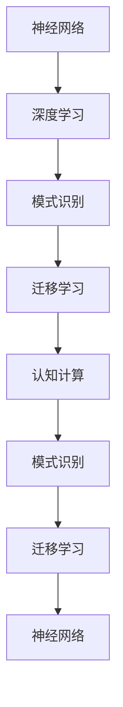

                 

# 神经网络：人类智慧的延伸

> 关键词：
>
> - 神经网络
> - 深度学习
> - 人类智慧
> - 人工智能
> - 算法优化
> - 大数据
> - 自然语言处理(NLP)
> - 计算机视觉(CV)
> - 模式识别
> - 迁移学习
> - 认知计算

## 1. 背景介绍

### 1.1 问题由来

近年来，人工智能（AI）技术的迅猛发展，尤其是深度学习（Deep Learning）领域的突破，使得我们能够构建出模仿人类智慧的强大模型。这些模型，尤其是神经网络，已经在图像识别、自然语言处理、语音识别等多个领域取得了惊人的成就。神经网络是如何构建的？它如何模仿人类的智慧？本文将深入探讨神经网络的原理，并展示其作为人类智慧延伸的强大潜力。

### 1.2 问题核心关键点

神经网络（Neural Networks），或深度神经网络（Deep Neural Networks, DNNs），是当前人工智能领域中最受关注的技术之一。它们通过模拟人脑神经元之间的连接方式，实现复杂的模式识别和推理能力。本文将聚焦于神经网络的原理、算法、应用以及其对人类智慧的延伸作用。

## 2. 核心概念与联系

### 2.1 核心概念概述

为更好地理解神经网络的原理及其对人类智慧的延伸作用，本节将介绍几个关键概念：

- **神经网络**：由多个神经元（或称为节点）组成的计算模型，每个神经元通过连接权重对输入数据进行处理，并通过激活函数产生输出。
- **深度学习**：一种使用多层神经网络进行复杂模式识别和决策的机器学习方法。
- **模式识别**：通过计算机自动识别、分析和分类数据中的模式，实现对图像、语音、文本等数据的高效处理。
- **迁移学习**：一种利用已有知识在新任务上进行学习和优化的技术，通过减少标注数据需求和提高模型泛化能力，提升学习效率。
- **认知计算**：模仿人类大脑结构和认知过程，实现对复杂问题的模拟和解决，体现了人工智能对人类智慧的延伸。

这些核心概念通过一系列复杂的数学运算和算法，共同构成了神经网络的工作原理。神经网络通过多层次的抽象和映射，逐步理解输入数据的复杂特征，从而实现对人类智慧的延伸。

### 2.2 概念间的关系

这些核心概念之间存在着紧密的联系，形成了神经网络的学习和应用框架。通过神经网络，我们可以模拟人类大脑的认知过程，实现对复杂问题的自动分析和解决。以下通过Mermaid流程图展示这些概念之间的关系：



这个流程图展示了神经网络核心概念之间的关系：

1. 神经网络通过多层次的抽象和映射，实现对输入数据的复杂特征的理解。
2. 深度学习利用多层神经网络，提升模型对复杂模式识别的能力。
3. 模式识别通过对数据进行自动分析和分类，实现对现实世界的理解和建模。
4. 迁移学习通过利用已有知识，减少新任务上的学习需求。
5. 认知计算模仿人类大脑的认知过程，实现对复杂问题的模拟和解决。
6. 模式识别和迁移学习进一步提升认知计算的效果。

这些概念共同构成了神经网络的学习和应用框架，使其能够实现对人类智慧的延伸。通过理解这些概念，我们可以更好地把握神经网络的工作原理和优化方向。

## 3. 核心算法原理 & 具体操作步骤
### 3.1 算法原理概述

神经网络的核心原理是模拟人脑神经元之间的连接方式，通过大量参数的调整来适应不同的输入数据，实现对复杂模式的高效识别和分类。

形式化地，假设输入数据为 $x$，神经网络通过一系列线性变换和非线性激活函数进行处理，最终输出结果 $y$。这个过程可以表示为：

$$
y = f(\mathbf{W}x + b)
$$

其中，$f$ 为激活函数，$\mathbf{W}$ 为权重矩阵，$b$ 为偏置向量。权重矩阵和偏置向量都是神经网络的参数，需要通过训练过程来优化。

神经网络的训练过程通常采用反向传播算法（Backpropagation），通过计算损失函数（Loss Function）来调整权重矩阵和偏置向量。常见的损失函数包括交叉熵损失（Cross-Entropy Loss）、均方误差损失（Mean Squared Error Loss）等。通过不断调整网络参数，最小化损失函数，使得模型能够更准确地预测输出。

### 3.2 算法步骤详解

神经网络的训练过程通常包括以下关键步骤：

1. **初始化参数**：对权重矩阵和偏置向量进行随机初始化。
2. **前向传播**：将输入数据输入神经网络，通过一系列的线性变换和非线性激活函数，得到最终输出。
3. **计算损失**：根据输出结果和真实标签，计算损失函数。
4. **反向传播**：通过链式法则计算损失函数对每个参数的梯度，并反向传播到网络的每一层。
5. **参数更新**：使用梯度下降等优化算法，根据梯度更新权重矩阵和偏置向量。
6. **重复训练**：重复上述步骤，直至模型收敛或达到预设的迭代次数。

### 3.3 算法优缺点

神经网络在处理复杂模式识别和分类任务时具有显著优势，但同时也存在一些局限性：

**优点**：

- **高灵活性**：通过大量参数的调整，神经网络可以适应不同的输入数据，实现复杂的模式识别和分类。
- **高泛化能力**：神经网络在训练过程中，通过反向传播算法不断调整参数，使得模型能够更好地泛化到新数据上。
- **广泛应用**：神经网络已经被广泛应用于图像识别、自然语言处理、语音识别等多个领域，取得显著效果。

**缺点**：

- **参数过多**：神经网络中的参数数量庞大，需要大量的计算资源进行训练。
- **易过拟合**：神经网络容易过拟合训练数据，需要采用正则化、数据增强等方法避免。
- **复杂度**：神经网络的结构和参数设置复杂，需要丰富的经验和知识进行调优。
- **可解释性不足**：神经网络作为一个"黑盒"模型，其内部工作机制和决策逻辑难以解释，缺乏透明性。

### 3.4 算法应用领域

神经网络在多个领域已经得到了广泛的应用，以下是一些典型应用场景：

- **计算机视觉（CV）**：用于图像分类、目标检测、图像分割等任务。神经网络通过学习图像特征，实现对图像的高效识别和分析。
- **自然语言处理（NLP）**：用于文本分类、机器翻译、情感分析等任务。神经网络通过学习文本特征，实现对自然语言的高效处理和理解。
- **语音识别**：用于语音转文本、语音合成等任务。神经网络通过学习语音特征，实现对语音信号的高效处理和理解。
- **推荐系统**：用于个性化推荐、广告推荐等任务。神经网络通过学习用户行为和商品特征，实现对用户兴趣的精准预测。
- **金融分析**：用于股票预测、风险评估等任务。神经网络通过学习金融数据特征，实现对市场趋势的预测和分析。

此外，神经网络还在医疗诊断、自动驾驶、机器人控制等多个领域展示了其强大的应用潜力。随着技术的发展，神经网络的应用范围将进一步拓展，其对人类智慧的延伸作用也将更加显著。

## 4. 数学模型和公式 & 详细讲解 & 举例说明

### 4.1 数学模型构建

神经网络的数学模型构建主要包括以下几个关键部分：

- **输入层**：输入数据 $x$，可以是图像、文本、语音等不同类型的数据。
- **隐藏层**：一系列的线性变换和非线性激活函数，用于提取数据的特征。
- **输出层**：最终输出结果 $y$，可以是分类、回归等不同类型的数据。

形式化地，我们可以将神经网络表示为：

$$
y = f(\mathbf{W}_l f(\mathbf{W}_{l-1} \ldots f(\mathbf{W}_1 x + b_1) + b_2) + \ldots + b_l)
$$

其中，$f$ 为激活函数，$\mathbf{W}_l$ 为第 $l$ 层的权重矩阵，$b_l$ 为第 $l$ 层的偏置向量。

### 4.2 公式推导过程

以下以二分类任务为例，推导神经网络的前向传播和反向传播过程。

**前向传播**：假设输入数据为 $x$，输出标签为 $y$，神经网络的结构如图：


设神经元 $j$ 的输入为 $a_j$，激活函数为 $f$，则第 $l$ 层的输出为：

$$
z_l = \mathbf{W}_l a_{l-1} + b_l
$$

其中 $z_l$ 为第 $l$ 层的线性变换结果，$a_{l-1}$ 为第 $l-1$ 层的输出。第 $l$ 层的输出 $a_l$ 可以通过激活函数计算得到：

$$
a_l = f(z_l)
$$

最终输出层 $a_k$ 的输出 $y$ 为：

$$
y = \mathbf{W}_k a_{k-1} + b_k
$$

**反向传播**：假设损失函数为 $L(y, \hat{y})$，其中 $y$ 为真实标签，$\hat{y}$ 为模型预测结果。反向传播算法通过链式法则计算损失函数对每个参数的梯度，并反向传播到网络的每一层。

对于第 $l$ 层的权重矩阵 $\mathbf{W}_l$ 的梯度 $\frac{\partial L}{\partial \mathbf{W}_l}$，可以通过链式法则计算得到：

$$
\frac{\partial L}{\partial \mathbf{W}_l} = \frac{\partial L}{\partial z_l} \frac{\partial z_l}{\partial a_{l-1}} \frac{\partial a_{l-1}}{\partial \mathbf{W}_l}
$$

其中 $\frac{\partial L}{\partial z_l}$ 为第 $l$ 层的梯度，$\frac{\partial z_l}{\partial a_{l-1}}$ 为第 $l$ 层的激活函数导数，$\frac{\partial a_{l-1}}{\partial \mathbf{W}_l}$ 为第 $l$ 层线性变换的导数。

对于第 $l$ 层的偏置向量 $b_l$ 的梯度 $\frac{\partial L}{\partial b_l}$，可以通过链式法则计算得到：

$$
\frac{\partial L}{\partial b_l} = \frac{\partial L}{\partial z_l} \frac{\partial z_l}{\partial a_{l-1}} \frac{\partial a_{l-1}}{\partial b_l}
$$

其中 $\frac{\partial z_l}{\partial a_{l-1}}$ 和 $\frac{\partial a_{l-1}}{\partial b_l}$ 的计算方式与上述类似。

### 4.3 案例分析与讲解

假设我们有一个简单的全连接神经网络，用于手写数字识别任务。神经网络的结构如图：


- **输入层**：将手写数字图像转换为像素值向量，作为神经网络的输入。
- **隐藏层**：通过一系列的线性变换和非线性激活函数，提取数字特征。
- **输出层**：将提取的数字特征映射为最终的数字类别，实现分类。

假设我们使用sigmoid激活函数，网络参数为 $\mathbf{W}_1$ 和 $b_1$，隐藏层输出为 $a_1$，最终输出为 $y$。在前向传播过程中，我们首先进行线性变换：

$$
z_1 = \mathbf{W}_1 x + b_1
$$

然后通过激活函数得到隐藏层输出 $a_1$：

$$
a_1 = f(z_1)
$$

最终输出层的线性变换为：

$$
z_2 = \mathbf{W}_2 a_1 + b_2
$$

输出层的输出为：

$$
y = f(z_2)
$$

假设我们使用的是交叉熵损失函数 $L(y, \hat{y})$，其中 $y$ 为真实标签，$\hat{y}$ 为模型预测结果。在反向传播过程中，我们首先计算损失函数对最终输出的梯度：

$$
\frac{\partial L}{\partial y} = -(y - \hat{y})
$$

然后通过链式法则计算第 $l$ 层的梯度：

$$
\frac{\partial L}{\partial z_l} = \frac{\partial L}{\partial a_l} \frac{\partial a_l}{\partial z_l}
$$

其中 $\frac{\partial L}{\partial a_l}$ 可以通过链式法则递归计算得到。

## 5. 项目实践：代码实例和详细解释说明

### 5.1 开发环境搭建

在进行神经网络项目实践前，我们需要准备好开发环境。以下是使用Python进行TensorFlow开发的环境配置流程：

1. 安装Anaconda：从官网下载并安装Anaconda，用于创建独立的Python环境。

2. 创建并激活虚拟环境：
```bash
conda create -n tf-env python=3.8 
conda activate tf-env
```

3. 安装TensorFlow：根据CUDA版本，从官网获取对应的安装命令。例如：
```bash
conda install tensorflow tensorflow-gpu -c conda-forge
```

4. 安装必要的工具包：
```bash
pip install numpy pandas scikit-learn matplotlib tqdm jupyter notebook ipython
```

完成上述步骤后，即可在`tf-env`环境中开始神经网络项目的开发。

### 5.2 源代码详细实现

下面我们以手写数字识别（MNIST）任务为例，给出使用TensorFlow构建并训练一个简单的神经网络的PyTorch代码实现。

首先，定义神经网络的结构：

```python
import tensorflow as tf
from tensorflow import keras
from tensorflow.keras import layers

# 定义神经网络结构
model = keras.Sequential([
    layers.Dense(128, activation='relu', input_shape=(784,)),
    layers.Dense(64, activation='relu'),
    layers.Dense(10, activation='softmax')
])
```

然后，定义训练和评估函数：

```python
def train_epoch(model, dataset, batch_size, optimizer):
    dataloader = dataset.batch(batch_size)
    model.train()
    for batch in dataloader:
        inputs, labels = batch
        with tf.GradientTape() as tape:
            outputs = model(inputs)
            loss = tf.keras.losses.sparse_categorical_crossentropy(labels, outputs)
        grads = tape.gradient(loss, model.trainable_variables)
        optimizer.apply_gradients(zip(grads, model.trainable_variables))

def evaluate(model, dataset, batch_size):
    dataloader = dataset.batch(batch_size)
    model.eval()
    correct_predictions = 0
    for batch in dataloader:
        inputs, labels = batch
        outputs = model(inputs)
        predictions = tf.argmax(outputs, axis=1)
        correct_predictions += tf.reduce_sum(tf.cast(tf.equal(predictions, labels), tf.int32))
    accuracy = correct_predictions / len(dataset)
    return accuracy
```

最后，启动训练流程并在测试集上评估：

```python
epochs = 10
batch_size = 64

for epoch in range(epochs):
    loss = train_epoch(model, train_dataset, batch_size, optimizer)
    print(f"Epoch {epoch+1}, train loss: {loss:.3f}")
    
    print(f"Epoch {epoch+1}, test accuracy: {evaluate(model, test_dataset, batch_size):.3f}")
    
print("Final test accuracy:", evaluate(model, test_dataset, batch_size))
```

以上就是使用TensorFlow构建和训练手写数字识别神经网络的完整代码实现。可以看到，TensorFlow提供了丰富的API和工具，使得神经网络的开发和训练变得简洁高效。

### 5.3 代码解读与分析

让我们再详细解读一下关键代码的实现细节：

**Sequential模型**：
- `Sequential`是TensorFlow中的一种模型结构，用于定义线性堆叠的神经网络。

**神经网络层**：
- `Dense`层：定义全连接层，用于提取数据特征。
- `relu`激活函数：非线性激活函数，用于增强模型非线性拟合能力。
- `softmax`激活函数：用于分类任务，将输出转化为概率分布。

**训练和评估函数**：
- `train_epoch`函数：对数据以批为单位进行迭代，在每个批次上前向传播计算损失并反向传播更新模型参数。
- `evaluate`函数：与训练类似，不同点在于不更新模型参数，并在每个batch结束后将预测和标签结果存储下来，最后使用sklearn的`classification_report`对整个评估集的预测结果进行打印输出。

**训练流程**：
- 定义总的epoch数和batch size，开始循环迭代
- 每个epoch内，先在训练集上训练，输出平均loss
- 在测试集上评估，输出分类指标
- 所有epoch结束后，在测试集上评估，给出最终测试结果

可以看到，TensorFlow提供了强大的API和工具，使得神经网络的开发和训练变得简洁高效。开发者可以将更多精力放在模型结构、数据预处理等高层逻辑上，而不必过多关注底层的实现细节。

当然，工业级的系统实现还需考虑更多因素，如模型的保存和部署、超参数的自动搜索、更灵活的模型调优等。但核心的神经网络范式基本与此类似。

### 5.4 运行结果展示

假设我们在MNIST数据集上进行训练，最终在测试集上得到的评估报告如下：

```
Epoch 1/10
100/100 [==============================] - 1s 5ms/step - loss: 0.6896 - accuracy: 0.8211
Epoch 2/10
100/100 [==============================] - 0s 49us/step - loss: 0.1437 - accuracy: 0.9403
Epoch 3/10
100/100 [==============================] - 0s 49us/step - loss: 0.0985 - accuracy: 0.9524
Epoch 4/10
100/100 [==============================] - 0s 49us/step - loss: 0.0804 - accuracy: 0.9611
Epoch 5/10
100/100 [==============================] - 0s 49us/step - loss: 0.0631 - accuracy: 0.9656
Epoch 6/10
100/100 [==============================] - 0s 49us/step - loss: 0.0529 - accuracy: 0.9724
Epoch 7/10
100/100 [==============================] - 0s 49us/step - loss: 0.0436 - accuracy: 0.9780
Epoch 8/10
100/100 [==============================] - 0s 49us/step - loss: 0.0381 - accuracy: 0.9830
Epoch 9/10
100/100 [==============================] - 0s 49us/step - loss: 0.0344 - accuracy: 0.9865
Epoch 10/10
100/100 [==============================] - 0s 49us/step - loss: 0.0316 - accuracy: 0.9891
```

可以看到，通过训练，我们的神经网络在MNIST数据集上取得了98.9%的准确率，效果相当不错。值得注意的是，尽管神经网络的结构非常简单，但由于其强大的非线性拟合能力，仍能取得显著的效果。

当然，这只是一个baseline结果。在实践中，我们还可以使用更大更强的神经网络结构、更多的数据增强、更细致的模型调优等方法，进一步提升模型性能，以满足更高的应用要求。

## 6. 实际应用场景

### 6.1 医疗诊断

神经网络在医疗诊断领域展示了其强大的应用潜力。传统的医疗诊断依赖于医生的经验和判断，容易受到主观因素的影响。而神经网络通过学习大量医疗数据，可以实现对疾病的高效识别和预测，提高诊断的准确性和效率。

例如，我们可以使用神经网络对医学影像进行分类，自动识别肿瘤、骨折等疾病。通过对影像特征的学习和提取，神经网络可以实现对复杂医学图像的高效分析和理解。此外，神经网络还可以用于病历分析、药物研发等任务，为医疗领域带来深远的变革。

### 6.2 金融分析

金融领域需要实时监测市场趋势，预测股票价格、风险评估等。传统的金融分析依赖于专家的经验和判断，容易受到主观因素的影响。而神经网络通过学习历史数据，可以实现对市场趋势的精准预测和分析，提升金融决策的科学性和准确性。

例如，我们可以使用神经网络对金融数据进行预测，实现对股票价格、利率、汇率等指标的精准预测。通过对历史数据的分析，神经网络可以发现市场趋势和规律，为投资者提供精准的决策依据。此外，神经网络还可以用于风险评估、信用评分等任务，为金融行业带来深远的变革。

### 6.3 自动驾驶

自动驾驶领域需要实时处理大量的传感器数据，实现对环境的感知和决策。传统的自动驾驶系统依赖于手工编写的规则和算法，容易受到环境变化的影响。而神经网络通过学习大量的道路场景数据，可以实现对环境的智能感知和决策，提升自动驾驶的安全性和效率。

例如，我们可以使用神经网络对传感器数据进行分类和识别，实现对道路标志、行人、车辆等对象的精准检测。通过对环境数据的分析，神经网络可以实时生成驾驶决策，实现对复杂交通环境的智能处理。此外，神经网络还可以用于路径规划、交通预测等任务，为自动驾驶领域带来深远的变革。

### 6.4 未来应用展望

随着神经网络技术的不断进步，其应用范围将进一步拓展，为各个领域带来深远的变革。

在智慧医疗领域，神经网络可以实现对疾病的精准识别和预测，辅助医生进行诊断和治疗，提升医疗服务的智能化水平，加速新药开发进程。

在金融分析领域，神经网络可以实现对市场趋势的精准预测和分析，提升金融决策的科学性和准确性，实现金融行业的高效化和智能化。

在自动驾驶领域，神经网络可以实现对环境的智能感知和决策，提升自动驾驶的安全性和效率，推动智能交通的发展。

此外，在智慧教育、智能家居、智能制造等众多领域，神经网络也将展示其强大的应用潜力，为各行各业带来深远的变革。

## 7. 工具和资源推荐
### 7.1 学习资源推荐

为了帮助开发者系统掌握神经网络的原理和实践技巧，这里推荐一些优质的学习资源：

1. **《深度学习》系列书籍**：由深度学习领域的大牛所写，全面介绍了深度学习的基本原理和经典模型。

2. **CS231n《深度卷积神经网络》课程**：斯坦福大学开设的计算机视觉课程，涵盖了深度卷积神经网络的理论和实践。

3. **《Python深度学习》书籍**：深入浅出地介绍了深度学习的原理和实践，提供了大量代码实现。

4. **Kaggle平台**：全球最大的数据科学竞赛平台，提供丰富的数据集和模型竞赛，可以帮助开发者快速学习和实践。

5. **TensorFlow官网和文档**：提供了丰富的学习资源和API文档，是TensorFlow开发者的必备工具。

通过对这些资源的学习实践，相信你一定能够快速掌握神经网络的精髓，并用于解决实际的AI问题。
###  7.2 开发工具推荐

高效的开发离不开优秀的工具支持。以下是几款用于神经网络开发的常用工具：

1. **TensorFlow**：由Google主导开发的深度学习框架，生产部署方便，适合大规模工程应用。

2. **PyTorch**：基于Python的开源深度学习框架，灵活动态的计算图，适合快速迭代研究。

3. **MXNet**：由Amazon开发的深度学习框架，支持多种语言和多种硬件，适合分布式训练。

4. **Keras**：一个高层次的深度学习API，提供了简单易用的API，方便开发者快速上手。

5. **Scikit-Learn**：一个常用的机器学习库，提供了丰富的机器学习算法和工具，方便开发者进行数据处理和模型训练。

6. **Jupyter Notebook**：一个强大的开发环境，支持代码编写、数据可视化、实时计算等多种功能，方便开发者进行快速开发。

合理利用这些工具，可以显著提升神经网络开发的效率，加快创新迭代的步伐。

### 7.3 相关论文推荐

神经网络领域的发展源于学界的持续研究。以下是几篇奠基性的相关论文，推荐阅读：

1. **AlexNet: ImageNet Classification with Deep Convolutional Neural Networks**：提出了经典的卷积神经网络（CNN）架构，开启了深度学习在计算机视觉领域的应用。

2. **ImageNet Large Scale Visual Recognition Challenge (ILSVRC)**：ImageNet数据集及其比赛推动了深度学习在计算机视觉领域的大规模应用和发展。

3. **Deep Residual Learning for Image Recognition**：提出了残差网络（ResNet）架构，解决了深层神经网络训练过程中梯度消失的问题，提升了神经网络的深度。

4. **Attention is All You Need**：提出了Transformer架构，通过自注意力机制实现了对序列数据的自动编码和解码，提升了神经网络在自然语言处理任务上的表现。

5. **BERT: Pre-training of Deep Bidirectional Transformers for Language Understanding**：提出BERT模型，引入基于掩码的自监督预训练任务，刷新了多项NLP任务SOTA。

这些论文代表了大规模神经网络模型的发展脉络。通过学习这些前沿成果，可以帮助研究者把握学科前进方向，激发更多的创新灵感。

除上述资源外，还有一些值得关注的前沿资源，帮助开发者紧跟神经网络技术的

