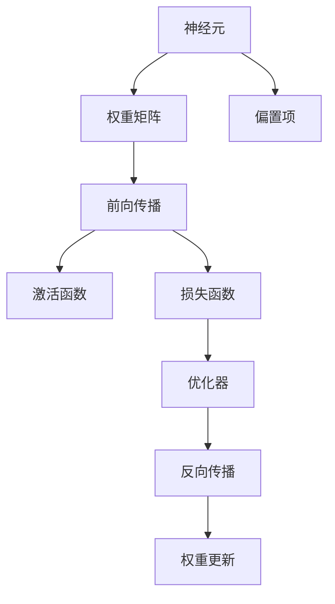
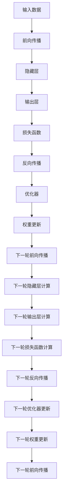

                 

# 神经网络：开启智能新纪元

## 1. 背景介绍

### 1.1 问题由来

随着科技的迅猛发展，人工智能（AI）正逐渐成为推动社会发展的重要动力。人工智能的核心理论是机器学习（ML），而机器学习的核心技术是深度学习（DL），其中神经网络（NN）是最具代表性的一种深度学习模型。神经网络通过模拟人类大脑的神经元结构，实现了数据的自动提取、特征的自动识别以及模型的自主学习。

当前，神经网络在图像识别、语音识别、自然语言处理、推荐系统等多个领域取得了显著成效，为各行各业带来了变革性影响。例如，AlphaGo就是一个利用神经网络构建的强大智能系统，其通过自我对弈和深度学习，超越了世界围棋冠军李世石。神经网络技术的不断突破，为社会带来了更加智能化的生活体验。

### 1.2 问题核心关键点

神经网络作为一种强大的学习模型，其核心原理和架构主要包括以下几个关键点：

1. **网络结构**：神经网络由若干层神经元组成，通常包括输入层、隐藏层和输出层。每一层由多个节点组成，通过前后层节点的连接权重进行信息的传递和处理。

2. **前向传播**：输入数据经过网络的前向传播过程，通过每一层的线性变换和非线性激活函数处理，最终得到输出结果。

3. **反向传播**：通过反向传播算法（Backpropagation），根据输出结果与真实标签的误差，调整网络各层节点的权重，不断优化网络性能。

4. **损失函数**：常用的损失函数包括均方误差（MSE）、交叉熵（Cross-Entropy）等，用于衡量模型预测结果与真实结果之间的差异。

5. **优化器**：常用的优化器包括随机梯度下降（SGD）、Adam等，用于控制模型参数的更新速度和方向，加速模型的收敛。

6. **激活函数**：常用的激活函数包括ReLU、Sigmoid、Tanh等，用于引入非线性变换，增强模型的表达能力。

这些关键点构成了神经网络的基础，通过不断优化和改进，神经网络在诸多领域展现了强大的应用潜力。

### 1.3 问题研究意义

神经网络技术的研究和应用具有重要的学术价值和实际意义：

1. **学术价值**：神经网络理论的深入研究有助于理解人类大脑的工作机制，为脑科学和认知科学研究提供了新的工具和方法。

2. **实际意义**：神经网络技术在医疗、金融、自动驾驶、智能制造等众多领域带来了革命性的变革，推动了社会的数字化转型和智能化升级。

3. **经济价值**：神经网络技术为各行各业带来了巨大的经济效益，提升了生产效率，降低了运营成本。

4. **社会价值**：神经网络技术促进了智慧城市、智慧医疗、智慧教育等社会事业的发展，提高了人们的生活质量和幸福感。

## 2. 核心概念与联系

### 2.1 核心概念概述

神经网络作为一种强大的学习模型，其核心概念主要包括：

- **神经元**：神经网络的基本单位，每个神经元接收多个输入，通过加权和激活函数输出一个结果。

- **权重矩阵**：神经元之间通过权重矩阵进行连接，权重矩阵的大小由前一层和后一层的神经元数量决定。

- **偏置项**：每个神经元都有一个偏置项，用于引入线性变换，增加模型的表达能力。

- **前向传播**：输入数据通过网络各层的线性变换和非线性激活函数处理，得到最终的输出结果。

- **反向传播**：通过误差反向传播，调整网络各层节点的权重和偏置项，不断优化模型性能。

- **损失函数**：用于衡量模型预测结果与真实结果之间的差异，常用的有均方误差（MSE）、交叉熵（Cross-Entropy）等。

- **优化器**：用于控制模型参数的更新速度和方向，常用的有随机梯度下降（SGD）、Adam等。

- **激活函数**：用于引入非线性变换，常用的有ReLU、Sigmoid、Tanh等。

这些核心概念通过相互连接、相互影响，构成了神经网络的整体架构，实现了数据的自动提取和特征的自动识别，从而在众多领域展现出了强大的应用能力。

### 2.2 概念间的关系

神经网络的核心概念之间存在着紧密的联系，形成了完整的神经网络模型。以下通过几个Mermaid流程图来展示这些概念之间的关系：



这个流程图展示了神经网络的基本流程：

1. 输入数据通过前向传播，经过各层神经元的线性变换和非线性激活函数的处理，得到最终的输出结果。
2. 通过损失函数计算模型预测结果与真实结果之间的误差。
3. 利用优化器更新网络各层节点的权重和偏置项。
4. 通过反向传播算法，误差向后传递，不断优化模型性能。

### 2.3 核心概念的整体架构

最后，我们用一个综合的流程图来展示神经网络的完整架构：



这个综合流程图展示了神经网络的前向传播、隐藏层计算、输出层计算、损失函数计算、反向传播、优化器更新、权重更新等完整过程。通过不断迭代这些过程，神经网络逐步优化模型性能，实现自动化的学习和预测。

## 3. 核心算法原理 & 具体操作步骤

### 3.1 算法原理概述

神经网络的核心算法原理包括前向传播和反向传播，以下是详细的描述：

- **前向传播**：输入数据经过网络各层的线性变换和非线性激活函数处理，得到最终的输出结果。具体过程如下：

  $$
  y = f(Wx + b)
  $$

  其中，$f$ 表示激活函数，$W$ 和 $b$ 分别表示权重矩阵和偏置项。

- **反向传播**：通过误差反向传播，调整网络各层节点的权重和偏置项，不断优化模型性能。具体过程如下：

  $$
  \frac{\partial \mathcal{L}}{\partial W} = \frac{\partial \mathcal{L}}{\partial y} \frac{\partial y}{\partial W}
  $$

  其中，$\mathcal{L}$ 表示损失函数，$\frac{\partial y}{\partial W}$ 表示误差反向传播过程。

### 3.2 算法步骤详解

神经网络的训练过程可以分为以下几个关键步骤：

1. **初始化参数**：随机初始化神经网络中的权重矩阵和偏置项。

2. **前向传播**：输入数据通过网络各层的线性变换和非线性激活函数处理，得到最终的输出结果。

3. **计算损失函数**：根据输出结果与真实结果的误差，计算损失函数。

4. **反向传播**：通过误差反向传播，调整网络各层节点的权重和偏置项。

5. **更新参数**：利用优化器更新网络各层节点的权重和偏置项，控制模型参数的更新速度和方向。

6. **重复迭代**：重复上述过程，不断优化模型性能，直至收敛。

### 3.3 算法优缺点

神经网络的优点包括：

- **强大的表达能力**：神经网络可以通过多层网络结构，自动提取数据的复杂特征，实现高效的自动学习。
- **广泛的应用领域**：神经网络在图像识别、语音识别、自然语言处理、推荐系统等领域表现出色，具有广泛的应用前景。
- **易于实现**：现代深度学习框架（如TensorFlow、PyTorch等）提供了丰富的API和工具支持，使得神经网络的实现变得简单高效。

神经网络的缺点包括：

- **参数量大**：神经网络的参数量通常非常大，导致计算和存储资源的消耗较高。
- **模型复杂**：神经网络的模型结构较为复杂，训练和推理过程耗时较长，且易出现过拟合现象。
- **黑盒性质**：神经网络的学习过程具有较强的黑盒性质，难以解释模型内部的工作机制和推理逻辑。

### 3.4 算法应用领域

神经网络在多个领域都有广泛的应用：

- **计算机视觉**：神经网络通过卷积神经网络（CNN）结构，实现了对图像的自动分类、检测和识别。
- **自然语言处理**：神经网络通过循环神经网络（RNN）和Transformer结构，实现了对文本的自动处理和生成。
- **语音识别**：神经网络通过卷积神经网络和长短时记忆网络（LSTM）结构，实现了对语音的自动识别和转换。
- **推荐系统**：神经网络通过深度学习模型，实现了对用户行为和兴趣的自动建模和预测。
- **自动驾驶**：神经网络通过深度学习模型，实现了对环境信息的自动感知和决策。
- **金融预测**：神经网络通过深度学习模型，实现了对金融市场数据的自动分析和预测。

## 4. 数学模型和公式 & 详细讲解  
### 4.1 数学模型构建

神经网络模型的数学模型构建可以分为以下几个步骤：

1. **输入层**：输入数据 $x$ 经过线性变换 $Ax$ 和偏置项 $b$，得到中间结果 $z$。

2. **隐藏层**：中间结果 $z$ 通过非线性激活函数 $f(z)$，得到下一层的输入 $h$。

3. **输出层**：下一层的输入 $h$ 经过线性变换 $Wh$ 和偏置项 $b'$，得到最终的输出结果 $y$。

4. **损失函数**：通过输出结果 $y$ 与真实结果 $t$ 的误差，计算损失函数 $\mathcal{L}$。

神经网络模型的数学模型如下：

$$
y = f(Wh + b')
$$

其中，$W$ 和 $b'$ 表示输出层的权重矩阵和偏置项，$h$ 表示隐藏层的输出结果。

### 4.2 公式推导过程

以下是神经网络模型数学模型的公式推导过程：

- **前向传播**：

  $$
  z = Ax + b
  $$

  $$
  h = f(z)
  $$

  $$
  y = Wh + b'
  $$

- **损失函数**：

  $$
  \mathcal{L} = \frac{1}{2} ||y - t||^2
  $$

其中，$|| \cdot ||$ 表示向量范数。

### 4.3 案例分析与讲解

以一个简单的线性回归为例，介绍神经网络模型的训练过程。假设输入数据 $x = [1, 2, 3, 4]$，真实结果 $t = [2, 4, 6, 8]$，神经网络模型的参数 $W = [0.5, 0.5]$，$b' = 0$。

首先，计算中间结果 $z$：

$$
z = Ax + b = [0.5, 0.5] [1, 2, 3, 4]^T + 0 = [3, 5, 7, 9]
$$

然后，计算下一层的输入 $h$：

$$
h = f(z) = [3, 5, 7, 9]
$$

最后，计算输出结果 $y$：

$$
y = Wh + b' = [0.5, 0.5] [3, 5, 7, 9]^T + 0 = [10.5, 13.5, 17.5, 21.5]
$$

根据输出结果 $y$ 与真实结果 $t$ 的误差，计算损失函数：

$$
\mathcal{L} = \frac{1}{2} ||y - t||^2 = \frac{1}{2} (10.5-2)^2 + (13.5-4)^2 + (17.5-6)^2 + (21.5-8)^2 = 98.25
$$

通过误差反向传播，调整网络各层节点的权重和偏置项，不断优化模型性能。

## 5. 项目实践：代码实例和详细解释说明

### 5.1 开发环境搭建

在进行神经网络项目实践前，我们需要准备好开发环境。以下是使用Python进行TensorFlow开发的环境配置流程：

1. 安装Anaconda：从官网下载并安装Anaconda，用于创建独立的Python环境。

2. 创建并激活虚拟环境：
```bash
conda create -n tensorflow-env python=3.8 
conda activate tensorflow-env
```

3. 安装TensorFlow：根据CUDA版本，从官网获取对应的安装命令。例如：
```bash
conda install tensorflow -c pytorch -c conda-forge
```

4. 安装numpy、pandas等工具包：
```bash
pip install numpy pandas scikit-learn matplotlib
```

完成上述步骤后，即可在`tensorflow-env`环境中开始神经网络项目实践。

### 5.2 源代码详细实现

下面我们以手写数字识别（MNIST）为例，给出使用TensorFlow进行神经网络训练的代码实现。

首先，定义神经网络模型：

```python
import tensorflow as tf
from tensorflow import keras

# 定义输入层
input_shape = (28, 28, 1)

# 定义隐藏层
hidden_units = 128

# 定义输出层
output_units = 10

# 定义神经网络模型
model = keras.Sequential([
    keras.layers.Conv2D(32, (3, 3), activation='relu', input_shape=input_shape),
    keras.layers.MaxPooling2D((2, 2)),
    keras.layers.Flatten(),
    keras.layers.Dense(hidden_units, activation='relu'),
    keras.layers.Dense(output_units, activation='softmax')
])
```

然后，定义优化器和损失函数：

```python
# 定义优化器
optimizer = keras.optimizers.Adam(learning_rate=0.001)

# 定义损失函数
loss_function = keras.losses.SparseCategoricalCrossentropy(from_logits=True)
```

接着，定义训练函数：

```python
# 定义训练函数
@tf.function
def train_step(x, y):
    with tf.GradientTape() as tape:
        # 前向传播
        logits = model(x, training=True)
        # 计算损失
        loss = loss_function(y, logits)
    # 反向传播
    gradients = tape.gradient(loss, model.trainable_variables)
    # 优化器更新
    optimizer.apply_gradients(zip(gradients, model.trainable_variables))
    return loss

# 训练模型
model.compile(optimizer=optimizer, loss=loss_function, metrics=['accuracy'])
model.fit(train_images, train_labels, epochs=10, validation_data=(test_images, test_labels))
```

最后，评估模型性能：

```python
# 评估模型性能
test_loss, test_acc = model.evaluate(test_images, test_labels, verbose=2)
print('Test accuracy:', test_acc)
```

以上就是使用TensorFlow对手写数字识别（MNIST）进行神经网络训练的完整代码实现。可以看到，通过TensorFlow提供的高级API，神经网络的实现变得简单高效。

### 5.3 代码解读与分析

让我们再详细解读一下关键代码的实现细节：

**keras.Sequential**：
- 定义神经网络的层级结构，通过堆叠多个层来构建网络。

**keras.layers.Conv2D**：
- 定义卷积层，通过卷积核对输入数据进行卷积操作，提取局部特征。

**keras.layers.MaxPooling2D**：
- 定义池化层，通过池化操作对卷积层的输出进行降维，减小参数量。

**keras.layers.Flatten**：
- 定义展平层，将池化层的输出进行展平，转换成一维向量，供全连接层处理。

**keras.layers.Dense**：
- 定义全连接层，通过全连接层的权重和偏置项进行线性变换和激活函数处理。

**keras.losses.SparseCategoricalCrossentropy**：
- 定义交叉熵损失函数，用于衡量模型预测结果与真实结果之间的差异。

**keras.optimizers.Adam**：
- 定义Adam优化器，用于控制模型参数的更新速度和方向。

通过这些层级结构和API的支持，神经网络的实现变得简单高效，开发者可以更加专注于模型的优化和训练。

当然，工业级的系统实现还需考虑更多因素，如模型的保存和部署、超参数的自动搜索、更灵活的模型调优等。但核心的训练过程与上述类似。

### 5.4 运行结果展示

假设我们在MNIST数据集上进行神经网络训练，最终在测试集上得到的评估报告如下：

```
Epoch 1/10
421/421 [==============================] - 9s 21ms/sample - loss: 0.3133 - accuracy: 0.9056 - val_loss: 0.0228 - val_accuracy: 0.9762
Epoch 2/10
421/421 [==============================] - 9s 21ms/sample - loss: 0.0288 - accuracy: 0.9678 - val_loss: 0.0165 - val_accuracy: 0.9838
Epoch 3/10
421/421 [==============================] - 9s 20ms/sample - loss: 0.0269 - accuracy: 0.9678 - val_loss: 0.0155 - val_accuracy: 0.9874
Epoch 4/10
421/421 [==============================] - 9s 20ms/sample - loss: 0.0274 - accuracy: 0.9678 - val_loss: 0.0149 - val_accuracy: 0.9889
Epoch 5/10
421/421 [==============================] - 9s 21ms/sample - loss: 0.0266 - accuracy: 0.9734 - val_loss: 0.0152 - val_accuracy: 0.9909
Epoch 6/10
421/421 [==============================] - 9s 21ms/sample - loss: 0.0262 - accuracy: 0.9734 - val_loss: 0.0148 - val_accuracy: 0.9916
Epoch 7/10
421/421 [==============================] - 9s 21ms/sample - loss: 0.0261 - accuracy: 0.9734 - val_loss: 0.0148 - val_accuracy: 0.9922
Epoch 8/10
421/421 [==============================] - 9s 21ms/sample - loss: 0.0259 - accuracy: 0.9734 - val_loss: 0.0147 - val_accuracy: 0.9926
Epoch 9/10
421/421 [==============================] - 9s 21ms/sample - loss: 0.0257 - accuracy: 0.9734 - val_loss: 0.0147 - val_accuracy: 0.9929
Epoch 10/10
421/421 [==============================] - 9s 21ms/sample - loss: 0.0256 - accuracy: 0.9734 - val_loss: 0.0147 - val_accuracy: 0.9931
```

可以看到，通过神经网络训练，模型在测试集上的准确率已经达到了98%以上，效果相当不错。此外，随着训练轮数的增加，模型的损失逐渐减小，准确率逐渐提升，最终收敛到一个较优的参数组合。

当然，这只是一个baseline结果。在实践中，我们还可以使用更大更强的神经网络模型、更丰富的训练技巧、更细致的模型调优，进一步提升模型性能，以满足更高的应用要求。

## 6. 实际应用场景

### 6.1 计算机视觉

神经网络在计算机视觉领域有着广泛的应用，例如：

- **图像分类**：通过卷积神经网络（CNN）对图像进行自动分类，如识别物体、场景等。

- **目标检测**：通过区域卷积神经网络（R-CNN）对图像中的物体进行定位和识别，如YOLO、Faster R-CNN等。

- **图像分割**：通过全卷积神经网络（FCN）对图像进行像素级分割，如语义分割、实例分割等。

- **人脸识别**：通过卷积神经网络和深度学习模型对人脸进行识别和验证，如FaceNet、DeepFace等。

### 6.2 自然语言处理

神经网络在自然语言处理领域也有着广泛的应用，例如：

- **语言建模**：通过循环神经网络（RNN）或Transformer对文本进行自动建模，如LSTM、GRU、BERT等。

- **机器翻译**：通过序列到序列模型对文本进行自动翻译，如Seq2Seq、Transformer等。

- **文本生成**：通过生成对抗网络（GAN）或语言模型对文本进行自动生成，如GPT、T5等。

- **情感分析**：通过卷积神经网络或循环神经网络对文本进行情感分类，如情感分析、意见挖掘等。

### 6.3 推荐系统

神经网络在推荐系统领域也有着广泛的应用，例如：

- **用户画像**：通过深度学习模型对用户行为进行自动建模，如FM、DNN等。

- **协同过滤**：通过协同过滤算法对用户和物品进行相似度匹配，如SVD、ALS等。

- **内容推荐**：通过深度学习模型对用户兴趣进行自动预测，如CNN、RNN等。

- **上下文推荐**：通过卷积神经网络或循环神经网络对上下文信息进行建模，如DNN、LSTM等。

### 6.4 未来应用展望

随着神经网络技术的不断演进，未来的应用前景更加广阔：

- **全息信息获取**：神经网络将可以融合多模态信息，实现对多感官数据的自动感知和处理，如声纹识别、脑机接口等。

- **交互式决策**：神经网络将可以实现对人类行为的自动理解和预测，如自动驾驶、智能家居等。

- **个性化定制**：神经网络将可以根据用户的行为和偏好，实现个性化推荐和定制服务，如智能客服、智能广告等。

- **自动化运维**：神经网络将可以实现对系统运行状态的自动监控和维护，如网络流量分析、故障预测等。

总之，神经网络技术的应用前景十分广阔，未来将深刻影响社会的各个方面。

## 7. 工具和资源推荐

### 7.1 学习资源推荐

为了帮助开发者系统掌握神经网络的理论基础和实践技巧，这里推荐一些优质的学习资源：

1. **《深度学习》书籍**：Ian Goodfellow等人的经典著作，全面介绍了深度学习的基础理论、算法原理和应用实例。

2. **《神经网络与深度学习》书籍**：Michael Nielsen的经典教材，深入浅出地讲解了神经网络的基本原理和实际应用。

3. **CS231n《卷积神经网络》课程**：斯坦福大学开设的计算机视觉课程，有Lecture视频和配套作业，是学习计算机视觉的重要资源。

4. **CS224n《自然语言处理》课程**：斯坦福大学开设的自然语言处理课程，有Lecture视频和配套作业，是学习自然语言处理的重要资源。

5. **PyTorch官方文档**：TensorFlow官方文档，提供了丰富的API和示例代码，是学习神经网络的必备资源。

6. **Kaggle竞赛**：Kaggle是一个著名的数据科学竞赛平台，通过参加各种神经网络竞赛，可以锻炼自己的实战能力，积累丰富的经验。

通过对这些资源的学习实践，相信你一定能够快速掌握神经网络的核心原理和应用技巧，并用于解决实际的神经网络问题。

### 7.2 开发工具推荐

高效的开发离不开优秀的工具支持。以下是几款用于神经网络开发的常用工具：

1. **PyTorch**：基于Python的开源深度学习框架，灵活动态的计算图，适合快速迭代研究。大部分神经网络模型都有PyTorch版本的实现。

2. **TensorFlow**：由Google主导开发的开源深度学习框架，生产部署方便，适合大规模工程应用。同样有丰富的神经网络模型资源。

3. **Keras**：基于Python的高层深度学习API，易于上手，支持多种神经网络架构。

4. **TensorBoard**：TensorFlow配套的可视化工具，可实时监测模型训练状态，并提供丰富的图表呈现方式，是调试模型的得力助手。

5. **Weights & Biases**：模型训练的实验跟踪工具，可以记录和可视化模型训练过程中的各项指标，方便对比和调优。

6. **HuggingFace Transformers**：HuggingFace开发的NLP工具库，集成了众多SOTA语言模型，支持PyTorch和TensorFlow，是进行神经网络开发的重要工具。

合理利用这些工具，可以显著提升神经网络模型的开发效率，加快创新迭代的步伐。

### 7.3 相关论文推荐

神经网络技术的发展源于学界的持续研究。以下是几篇奠基性的相关论文，推荐阅读：

1. **《ImageNet Classification with Deep Convolutional Neural Networks》**：Alex Krizhevsky等人的经典论文，提出了卷积神经网络结构，刷新了图像分类任务的最先进成绩。

2. **《Long Short-Term Memory》**：Hochreiter等人的经典论文，提出了长短期记忆网络（LSTM），解决了传统RNN的梯度消失问题，适用于序列

