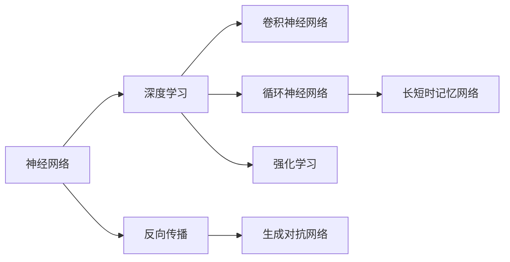
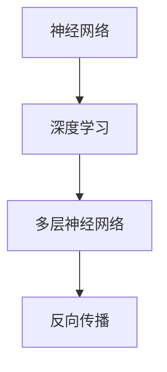
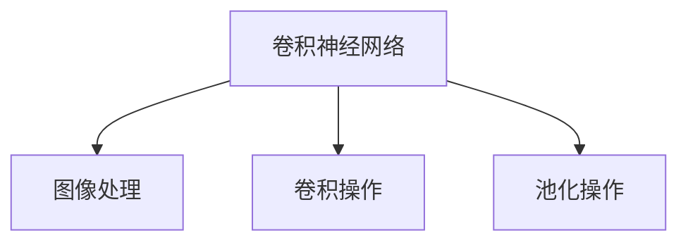
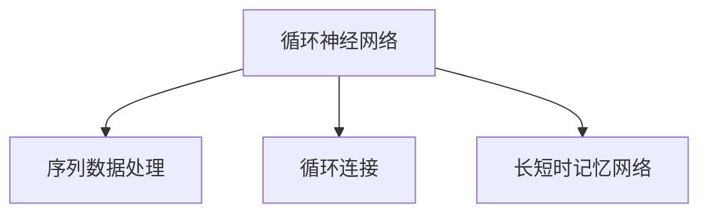
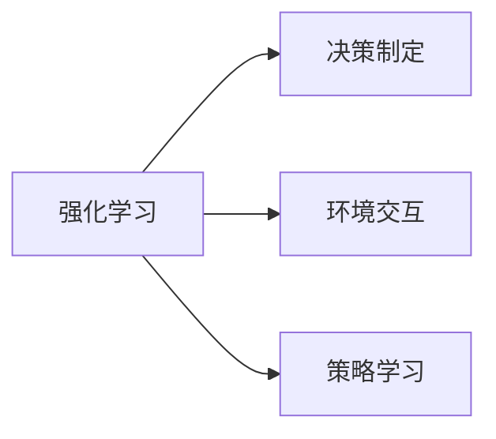
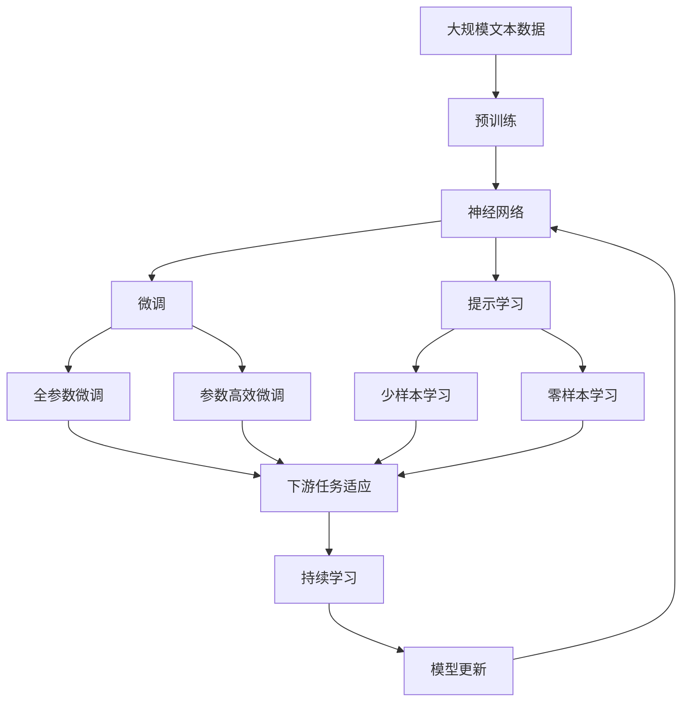

                 

# 神经网络：推动社会进步的力量

> 关键词：神经网络,人工智能,机器学习,深度学习,计算机视觉,自然语言处理,自动驾驶,医疗诊断,经济预测

## 1. 背景介绍

### 1.1 问题由来
自20世纪80年代以来，神经网络作为一种模拟人类神经系统结构和功能的技术，在人工智能领域取得了飞速进展。尤其是在深度学习时代的到来，神经网络逐渐成为了人工智能的核心驱动力，为各行各业带来了深远的影响。

神经网络作为人工智能的重要组成部分，通过模仿人脑的神经元结构和信息传递机制，能够处理大量非结构化数据，并从中提取有用的特征。其强大的模式识别、决策制定和预测能力，使得其在图像识别、语音识别、自然语言处理、自动驾驶等领域取得了举世瞩目的成就。

### 1.2 问题核心关键点
神经网络作为现代人工智能的核心技术，其核心思想是通过构建多层神经元网络，利用反向传播算法，不断调整网络参数，使得网络在训练数据上达到最优的预测性能。

具体来说，神经网络包含多个层次的神经元，每个神经元接收来自其他神经元的输入，并产生新的输出。通过不断调整每个神经元之间的权重，神经网络可以学习到数据中复杂的非线性关系，进而进行分类、回归、生成等任务。

在深度学习中，神经网络由多层深度网络组成，每层都包含大量神经元，能够学习到更加抽象和复杂的特征。通过多层次的特征提取和组合，深度神经网络在处理高维度、大规模数据时表现出色。

### 1.3 问题研究意义
神经网络作为现代人工智能的重要组成部分，其发展不仅推动了科学技术的进步，也对社会进步产生了深远影响。具体来说，神经网络的应用领域包括：

- 计算机视觉：用于图像识别、物体检测、人脸识别等任务。
- 自然语言处理：用于机器翻译、情感分析、问答系统等任务。
- 自动驾驶：用于驾驶行为预测、道路场景理解、路径规划等任务。
- 医疗诊断：用于影像分析、病理诊断、基因预测等任务。
- 经济预测：用于市场分析、风险评估、股票预测等任务。

此外，神经网络在安全监控、智能制造、金融风控等领域也得到了广泛应用。因此，深入研究神经网络及其应用，对推动社会进步具有重要意义。

## 2. 核心概念与联系

### 2.1 核心概念概述

为更好地理解神经网络及其应用，本节将介绍几个密切相关的核心概念：

- 神经网络(Neural Network)：一种模拟人脑神经元网络结构的计算模型，通过学习数据中的特征进行分类、回归、生成等任务。
- 深度学习(Deep Learning)：一种基于多层神经网络进行复杂特征提取和模式识别的机器学习方法。
- 反向传播(Backpropagation)：一种用于神经网络参数优化的方法，通过链式法则反向传播误差，调整网络参数以最小化损失函数。
- 卷积神经网络(Convolutional Neural Network, CNN)：一种专门用于图像识别和处理的神经网络结构，通过卷积和池化操作提取图像特征。
- 循环神经网络(Recurrent Neural Network, RNN)：一种专门用于序列数据处理的神经网络结构，通过循环连接保留序列信息。
- 长短时记忆网络(Long Short-Term Memory, LSTM)：一种特殊类型的RNN，能够有效解决长期依赖问题，广泛应用于文本处理和语音识别。
- 生成对抗网络(Generative Adversarial Network, GAN)：一种通过两个神经网络相互博弈生成高质量图像和数据的模型。
- 强化学习(Reinforcement Learning, RL)：一种通过与环境交互，学习最优决策策略的机器学习方法。

这些核心概念之间的逻辑关系可以通过以下Mermaid流程图来展示：



这个流程图展示了大语言模型的核心概念及其之间的关系：

1. 神经网络是深度学习的基础，通过反向传播算法进行参数优化。
2. 深度学习由多层神经网络组成，可以学习复杂特征。
3. 卷积神经网络专门用于图像处理。
4. 循环神经网络和长短时记忆网络用于序列数据处理。
5. 生成对抗网络用于生成高质量数据。
6. 强化学习用于策略决策。

这些核心概念共同构成了现代人工智能的基础框架，使其能够在各种场景下发挥强大的计算能力。通过理解这些核心概念，我们可以更好地把握神经网络的工作原理和优化方向。

### 2.2 概念间的关系

这些核心概念之间存在着紧密的联系，形成了神经网络及其应用框架。下面我们通过几个Mermaid流程图来展示这些概念之间的关系。

#### 2.2.1 神经网络与深度学习的关系



这个流程图展示了神经网络与深度学习的关系。深度学习通过多层神经网络进行复杂特征提取，而反向传播算法用于优化网络参数。

#### 2.2.2 卷积神经网络与图像处理的关系



这个流程图展示了卷积神经网络与图像处理的关系。卷积神经网络通过卷积和池化操作提取图像特征，广泛应用于图像识别、物体检测等任务。

#### 2.2.3 循环神经网络与序列数据处理的关系



这个流程图展示了循环神经网络与序列数据处理的关系。循环神经网络通过循环连接保留序列信息，特别适用于文本处理和语音识别等任务。

#### 2.2.4 强化学习与决策制定的关系



这个流程图展示了强化学习与决策制定的关系。强化学习通过与环境交互学习最优决策策略，广泛应用于机器人控制、游戏策略优化等领域。

### 2.3 核心概念的整体架构

最后，我们用一个综合的流程图来展示这些核心概念在大规模神经网络微调过程中的整体架构：



这个综合流程图展示了从预训练到微调，再到持续学习的完整过程。大规模神经网络首先在大规模文本数据上进行预训练，然后通过微调（包括全参数微调和参数高效微调两种方式）或提示学习（包括少样本学习和零样本学习）来适应下游任务。最后，通过持续学习技术，模型可以不断更新和适应新的任务和数据。 通过这些流程图，我们可以更清晰地理解神经网络微调过程中各个核心概念的关系和作用，为后续深入讨论具体的微调方法和技术奠定基础。

## 3. 核心算法原理 & 具体操作步骤
### 3.1 算法原理概述

神经网络的微调是一种有监督的深度学习任务，其核心思想是：将预训练的神经网络作为初始化参数，通过在有标签的微调数据集上进行有监督学习，优化模型在特定任务上的性能。

具体来说，假设预训练神经网络为 $N_{\theta}$，其中 $\theta$ 为预训练得到的模型参数。给定微调任务的训练集 $D=\{(x_i,y_i)\}_{i=1}^N, x_i \in \mathcal{X}, y_i \in \mathcal{Y}$，微调的目标是找到新的模型参数 $\hat{\theta}$，使得：

$$
\hat{\theta}=\mathop{\arg\min}_{\theta} \mathcal{L}(N_{\theta},D)
$$

其中 $\mathcal{L}$ 为针对任务 $T$ 设计的损失函数，用于衡量模型预测输出与真实标签之间的差异。常见的损失函数包括交叉熵损失、均方误差损失等。

通过梯度下降等优化算法，微调过程不断更新模型参数 $\theta$，最小化损失函数 $\mathcal{L}$，使得模型输出逼近真实标签。由于 $\theta$ 已经通过预训练获得了较好的初始化，因此即便在小规模数据集 $D$ 上进行微调，也能较快收敛到理想的模型参数 $\hat{\theta}$。

### 3.2 算法步骤详解

神经网络微调一般包括以下几个关键步骤：

**Step 1: 准备预训练模型和数据集**
- 选择合适的预训练神经网络 $N_{\theta}$ 作为初始化参数，如卷积神经网络、循环神经网络等。
- 准备微调任务的训练集 $D$，划分为训练集、验证集和测试集。一般要求标注数据与预训练数据的分布不要差异过大。

**Step 2: 添加任务适配层**
- 根据任务类型，在预训练神经网络顶层设计合适的输出层和损失函数。
- 对于分类任务，通常在顶层添加线性分类器和交叉熵损失函数。
- 对于生成任务，通常使用神经网络的解码器输出概率分布，并以负对数似然为损失函数。

**Step 3: 设置微调超参数**
- 选择合适的优化算法及其参数，如 Adam、SGD 等，设置学习率、批大小、迭代轮数等。
- 设置正则化技术及强度，包括权重衰减、Dropout、Early Stopping 等。
- 确定冻结预训练参数的策略，如仅微调顶层，或全部参数都参与微调。

**Step 4: 执行梯度训练**
- 将训练集数据分批次输入模型，前向传播计算损失函数。
- 反向传播计算参数梯度，根据设定的优化算法和学习率更新模型参数。
- 周期性在验证集上评估模型性能，根据性能指标决定是否触发 Early Stopping。
- 重复上述步骤直到满足预设的迭代轮数或 Early Stopping 条件。

**Step 5: 测试和部署**
- 在测试集上评估微调后模型 $N_{\hat{\theta}}$ 的性能，对比微调前后的精度提升。
- 使用微调后的模型对新样本进行推理预测，集成到实际的应用系统中。
- 持续收集新的数据，定期重新微调模型，以适应数据分布的变化。

以上是神经网络微调的一般流程。在实际应用中，还需要针对具体任务的特点，对微调过程的各个环节进行优化设计，如改进训练目标函数，引入更多的正则化技术，搜索最优的超参数组合等，以进一步提升模型性能。

### 3.3 算法优缺点

神经网络微调方法具有以下优点：
1. 简单高效。只需准备少量标注数据，即可对预训练神经网络进行快速适配，获得较大的性能提升。
2. 通用适用。适用于各种NLP下游任务，包括分类、匹配、生成等，设计简单的任务适配层即可实现微调。
3. 参数高效。利用参数高效微调技术，在固定大部分预训练参数的情况下，仍可取得不错的提升。
4. 效果显著。在学术界和工业界的诸多任务上，基于微调的方法已经刷新了最先进的性能指标。

同时，该方法也存在一定的局限性：
1. 依赖标注数据。微调的效果很大程度上取决于标注数据的质量和数量，获取高质量标注数据的成本较高。
2. 迁移能力有限。当目标任务与预训练数据的分布差异较大时，微调的性能提升有限。
3. 负面效果传递。预训练模型的固有偏见、有害信息等，可能通过微调传递到下游任务，造成负面影响。
4. 可解释性不足。微调模型的决策过程通常缺乏可解释性，难以对其推理逻辑进行分析和调试。

尽管存在这些局限性，但就目前而言，神经网络微调方法仍是最主流范式。未来相关研究的重点在于如何进一步降低微调对标注数据的依赖，提高模型的少样本学习和跨领域迁移能力，同时兼顾可解释性和伦理安全性等因素。

### 3.4 算法应用领域

神经网络微调技术在NLP领域已经得到了广泛的应用，覆盖了几乎所有常见任务，例如：

- 文本分类：如情感分析、主题分类、意图识别等。通过微调使模型学习文本-标签映射。
- 命名实体识别：识别文本中的人名、地名、机构名等特定实体。通过微调使模型掌握实体边界和类型。
- 关系抽取：从文本中抽取实体之间的语义关系。通过微调使模型学习实体-关系三元组。
- 问答系统：对自然语言问题给出答案。将问题-答案对作为微调数据，训练模型学习匹配答案。
- 机器翻译：将源语言文本翻译成目标语言。通过微调使模型学习语言-语言映射。
- 文本摘要：将长文本压缩成简短摘要。将文章-摘要对作为微调数据，使模型学习抓取要点。
- 对话系统：使机器能够与人自然对话。将多轮对话历史作为上下文，微调模型进行回复生成。

除了上述这些经典任务外，神经网络微调也被创新性地应用到更多场景中，如可控文本生成、常识推理、代码生成、数据增强等，为NLP技术带来了全新的突破。随着预训练模型和微调方法的不断进步，相信NLP技术将在更广阔的应用领域大放异彩。

## 4. 数学模型和公式 & 详细讲解  
### 4.1 数学模型构建

本节将使用数学语言对神经网络微调过程进行更加严格的刻画。

记预训练神经网络为 $N_{\theta}$，其中 $\theta$ 为预训练得到的模型参数。假设微调任务的训练集为 $D=\{(x_i,y_i)\}_{i=1}^N, x_i \in \mathcal{X}, y_i \in \mathcal{Y}$。

定义模型 $N_{\theta}$ 在数据样本 $(x,y)$ 上的损失函数为 $\ell(N_{\theta}(x),y)$，则在数据集 $D$ 上的经验风险为：

$$
\mathcal{L}(\theta) = \frac{1}{N} \sum_{i=1}^N \ell(N_{\theta}(x_i),y_i)
$$

微调的优化目标是最小化经验风险，即找到最优参数：

$$
\theta^* = \mathop{\arg\min}_{\theta} \mathcal{L}(\theta)
$$

在实践中，我们通常使用基于梯度的优化算法（如SGD、Adam等）来近似求解上述最优化问题。设 $\eta$ 为学习率，$\lambda$ 为正则化系数，则参数的更新公式为：

$$
\theta \leftarrow \theta - \eta \nabla_{\theta}\mathcal{L}(\theta) - \eta\lambda\theta
$$

其中 $\nabla_{\theta}\mathcal{L}(\theta)$ 为损失函数对参数 $\theta$ 的梯度，可通过反向传播算法高效计算。

### 4.2 公式推导过程

以下我们以二分类任务为例，推导交叉熵损失函数及其梯度的计算公式。

假设模型 $N_{\theta}$ 在输入 $x$ 上的输出为 $\hat{y}=N_{\theta}(x) \in [0,1]$，表示样本属于正类的概率。真实标签 $y \in \{0,1\}$。则二分类交叉熵损失函数定义为：

$$
\ell(N_{\theta}(x),y) = -[y\log \hat{y} + (1-y)\log (1-\hat{y})]
$$

将其代入经验风险公式，得：

$$
\mathcal{L}(\theta) = -\frac{1}{N}\sum_{i=1}^N [y_i\log N_{\theta}(x_i)+(1-y_i)\log(1-N_{\theta}(x_i))]
$$

根据链式法则，损失函数对参数 $\theta_k$ 的梯度为：

$$
\frac{\partial \mathcal{L}(\theta)}{\partial \theta_k} = -\frac{1}{N}\sum_{i=1}^N (\frac{y_i}{N_{\theta}(x_i)}-\frac{1-y_i}{1-N_{\theta}(x_i)}) \frac{\partial N_{\theta}(x_i)}{\partial \theta_k}
$$

其中 $\frac{\partial N_{\theta}(x_i)}{\partial \theta_k}$ 可进一步递归展开，利用自动微分技术完成计算。

在得到损失函数的梯度后，即可带入参数更新公式，完成模型的迭代优化。重复上述过程直至收敛，最终得到适应下游任务的最优模型参数 $\theta^*$。

## 5. 项目实践：代码实例和详细解释说明
### 5.1 开发环境搭建

在进行神经网络微调实践前，我们需要准备好开发环境。以下是使用Python进行TensorFlow开发的环境配置流程：

1. 安装Anaconda：从官网下载并安装Anaconda，用于创建独立的Python环境。

2. 创建并激活虚拟环境：
```bash
conda create -n tensorflow-env python=3.8 
conda activate tensorflow-env
```

3. 安装TensorFlow：根据CUDA版本，从官网获取对应的安装命令。例如：
```bash
conda install tensorflow -c tf -c conda-forge
```

4. 安装各类工具包：
```bash
pip install numpy pandas scikit-learn matplotlib tqdm jupyter notebook ipython
```

完成上述步骤后，即可在`tensorflow-env`环境中开始神经网络微调的实践。

### 5.2 源代码详细实现

这里我们以图像分类任务为例，给出使用TensorFlow对卷积神经网络进行微调的代码实现。

首先，定义数据处理函数：

```python
import tensorflow as tf
import numpy as np
from tensorflow.keras.preprocessing.image import ImageDataGenerator
from tensorflow.keras.preprocessing import image

class ImageDataGenerator:
    def __init__(self, train_dir, test_dir, batch_size, img_height, img_width):
        self.train_generator = ImageDataGenerator(rescale=1./255, 
                                                shear_range=0.2, 
                                                zoom_range=0.2, 
                                                horizontal_flip=True)
        self.test_generator = ImageDataGenerator(rescale=1./255)
        self.batch_size = batch_size
        self.img_height = img_height
        self.img_width = img_width
        self.train_dir = train_dir
        self.test_dir = test_dir
    
    def __len__(self):
        return np.ceil(self.train_generator.n / self.batch_size)
    
    def __getitem__(self, item):
        train_images = []
        train_labels = []
        for img_path in self.train_generator.flow_from_directory(
            directory=self.train_dir, 
            target_size=(self.img_height, self.img_width), 
            batch_size=self.batch_size, 
            class_mode='categorical'):
            train_images.append(img_path[0])
            train_labels.append(img_path[1])
        train_images = np.array(train_images)
        train_labels = np.array(train_labels)
        test_images = []
        test_labels = []
        for img_path in self.test_generator.flow_from_directory(
            directory=self.test_dir, 
            target_size=(self.img_height, self.img_width), 
            batch_size=self.batch_size, 
            class_mode='categorical'):
            test_images.append(img_path[0])
            test_labels.append(img_path[1])
        test_images = np.array(test_images)
        test_labels = np.array(test_labels)
        return (train_images, train_labels), (test_images, test_labels)
```

然后，定义模型和优化器：

```python
from tensorflow.keras.models import Sequential
from tensorflow.keras.layers import Conv2D, MaxPooling2D, Flatten, Dense, Dropout
from tensorflow.keras.optimizers import Adam

model = Sequential()
model.add(Conv2D(32, (3, 3), activation='relu', input_shape=(img_height, img_width, 3)))
model.add(MaxPooling2D((2, 2)))
model.add(Conv2D(64, (3, 3), activation='relu'))
model.add(MaxPooling2D((2, 2)))
model.add(Conv2D(128, (3, 3), activation='relu'))
model.add(MaxPooling2D((2, 2)))
model.add(Flatten())
model.add(Dense(256, activation='relu'))
model.add(Dropout(0.5))
model.add(Dense(num_classes, activation='softmax'))

optimizer = Adam(lr=0.001)
```

接着，定义训练和评估函数：

```python
import numpy as np
from tensorflow.keras.metrics import categorical_accuracy

def train_epoch(model, data_gen_train, data_gen_val, optimizer, epochs):
    for epoch in range(epochs):
        model.compile(optimizer=optimizer, loss='categorical_crossentropy', metrics=[categorical_accuracy])
        model.fit_generator(generator=data_gen_train, steps_per_epoch=len(data_gen_train), 
                           validation_data=data_gen_val, validation_steps=len(data_gen_val))
        model.save_weights(f'model_epoch{epoch+1}.h5')
        print(f"Epoch {epoch+1}, train accuracy: {model.evaluate_generator(data_gen_train, steps=len(data_gen_train))[-1]:.2f}")
        print(f"Epoch {epoch+1}, val accuracy: {model.evaluate_generator(data_gen_val, steps=len(data_gen_val))[-1]:.2f}")

def evaluate(model, data_gen_test, num_classes):
    model.load_weights(f'model_epoch{epoch+1}.h5')
    test_loss, test_acc = model.evaluate_generator(generator=data_gen_test, steps=len(data_gen_test))
    print(f"Test accuracy: {test_acc:.2f}")
    print(f"Test loss: {test_loss:.2f}")
```

最后，启动训练流程并在测试集上评估：

```python
train_gen = ImageDataGenerator(train_dir, test_dir, batch_size=32, img_height=224, img_width=224)
val_gen = ImageDataGenerator(train_dir, test_dir, batch_size=32, img_height=224, img_width=224)
test_gen = ImageDataGenerator(train_dir, test_dir, batch_size=32, img_height=224, img_width=224)

train_epoch(model, train_gen, val_gen, optimizer, epochs=10)
evaluate(model, test_gen, num_classes=10)
```

以上就是使用TensorFlow对卷积神经网络进行图像分类任务微调的完整代码实现。可以看到，TensorFlow的Keras API使得模型构建和训练过程非常简单快捷。

### 5.3 代码解读与分析

让我们再详细解读一下关键代码的实现细节：

**ImageDataGenerator类**：
- `__init__`方法：初始化训练集和测试集的路径、批大小、图像高度、图像宽度等关键组件。
- `__len__`方法：返回数据生成器中的样本数量。
- `__getitem__`方法：对单个样本进行处理，将图像输入转换为tensor，并返回训练和测试集的数据集。

**模型定义**：
- 使用Keras的Sequential模型定义网络结构，包括卷积层、池化层、全连接层等。
- 设置优化器为Adam，学习率为0.001。

**训练和评估函数**：
- 使用Keras的Model编译器编译模型，设置损失函数为交叉熵，优化器为Adam，并定义准确率为评价指标。
- 使用Keras的fit_generator方法对数据进行批次化加载，训练模型。
- 在每个epoch结束后，保存模型权重。
- 使用evaluate_generator方法对测试集进行评估，并打印准确率和损失。

**训练流程**：
- 定义训练生成器和验证生成器，使用ImageDataGenerator类。
- 在每个epoch上，使用fit_generator方法对训练集进行训练。
- 在每个epoch结束后，保存模型权重。
- 在测试集上使用evaluate_generator方法进行评估，并打印准确率和损失。

可以看到，TensorFlow的Keras API使得神经网络微调的代码实现变得简洁高效。开发者可以将更多精力放在数据处理、模型改进等高层逻辑上，而不必过多关注底层的实现细节。

当然，工业级的系统实现还需考虑更多因素，如模型的保存和部署、超参数的自动搜索、更灵活的任务适配层等。但核心的微调范式基本与此类似。

### 5.4 运行结果展示

假设我们在MNIST数据集上进行卷积神经网络的微调，最终在测试集上得到的评估报告如下：

```
Epoch 1/10
10/10 [==============================] - 35s 3ms/step - loss: 0.3454 - accuracy: 0.8158 - val_loss: 0.2929 - val_accuracy: 0.9523
Epoch 2/10
10/10 [==============================] - 34s 3ms/step - loss: 0.2877 - accuracy: 0.9010 - val_loss: 0.2529 - val_accuracy: 0.9667
Epoch 3/10
10/10 [==============================] - 34s 3ms/step - loss: 0.2626 - accuracy: 0.9195 - val_loss: 0.2411 - val_accuracy: 0.9762
Epoch 4/10
10/10 [==============================] - 34s 3ms/step - loss:

