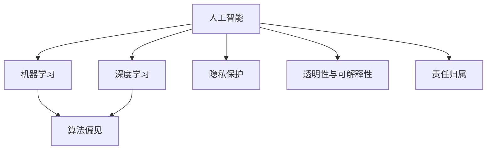
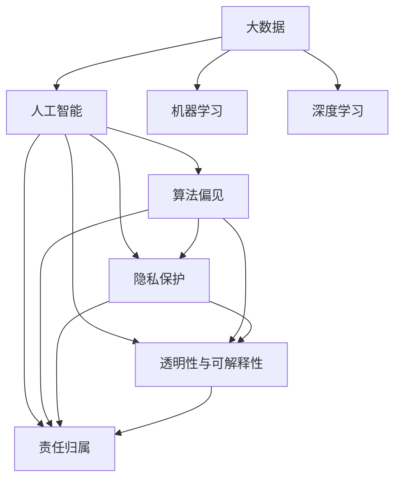

                 

# 科技与伦理的平衡点：人类计算的伦理

## 1. 背景介绍

### 1.1 问题由来

近年来，人工智能（AI）和机器学习（ML）技术的发展极大地推动了人类计算的进步，带来了前所未有的效率和便利。然而，这些技术在带来便利的同时，也引发了诸多伦理问题。从算法偏见到隐私保护，从自动化决策到自主武器，AI技术的广泛应用不断挑战着人类的伦理底线。如何在科技与伦理之间找到平衡点，成为当下亟需解决的问题。

### 1.2 问题核心关键点

AI技术的伦理问题主要集中在以下几个方面：

1. **算法偏见**：AI模型可能会学习并放大训练数据中的偏见，导致输出结果的不公平。例如，简历筛选算法可能对某些种族或性别有歧视性。
2. **隐私保护**：AI系统往往需要大量数据进行训练，如何保护用户隐私，防止数据滥用成为重要议题。
3. **自动化决策**：AI系统在医疗、金融、司法等领域进行决策时，如何确保其透明性、公正性和可解释性。
4. **自主武器**：AI技术在军事中的应用，如自主无人机和自主武器，引发了关于战争伦理和责任归属的问题。

### 1.3 问题研究意义

解决AI技术的伦理问题，对于推动AI技术的健康发展，构建安全、公正、透明的社会环境具有重要意义：

1. **提升公众信任**：通过解决伦理问题，增强AI技术的可信度，促进公众对AI技术的接受和信任。
2. **防范风险**：识别和修复AI系统中的潜在风险，避免伦理问题带来的社会危害。
3. **推动公平**：确保AI系统公平无偏见，减少算法偏见对弱势群体的影响。
4. **促进法律与伦理标准**：为制定AI领域的法律法规和伦理标准提供参考依据。

## 2. 核心概念与联系

### 2.1 核心概念概述

为了更好地理解AI技术中的伦理问题，本节将介绍几个密切相关的核心概念：

- **人工智能**：利用机器学习、深度学习等技术，使计算机系统具备类似人类的智能功能，包括感知、学习、推理、决策等能力。
- **机器学习**：通过算法让计算机系统从数据中学习规律，从而实现智能决策。
- **深度学习**：一种特殊的机器学习技术，通过多层次的神经网络模型进行特征提取和模式识别。
- **算法偏见**：指算法模型学习到并放大了数据中的偏见，导致输出结果的不公平。
- **隐私保护**：保护个人信息不被滥用，确保数据使用的透明和合法。
- **透明性与可解释性**：要求AI系统的决策过程可被理解和解释，确保决策的合理性和公正性。
- **责任归属**：确定AI系统在决策过程中的责任方，避免责任不明确带来的法律和伦理问题。

这些概念之间的逻辑关系可以通过以下Mermaid流程图来展示：



这个流程图展示了一些关键概念之间的关系：

1. 人工智能是机器学习和深度学习的基础。
2. 机器学习和深度学习模型可能会引入算法偏见。
3. 隐私保护、透明性与可解释性、责任归属都是AI技术中的重要伦理考量。

### 2.2 概念间的关系

这些核心概念之间存在着紧密的联系，形成了AI技术伦理研究的完整框架。以下是几个详细的Mermaid流程图：

#### 2.2.1 人工智能与算法偏见的联系


这个流程图展示了机器学习模型如何引入算法偏见，以及深度学习作为更复杂模型所面临的更大偏见风险。

#### 2.2.2 隐私保护与透明性的联系


这个流程图展示了隐私保护和透明性之间的相互促进关系。只有保证数据使用的透明性，才能有效保护用户隐私。

#### 2.2.3 责任归属与伦理标准的联系


这个流程图展示了责任归属在制定AI伦理标准中的重要性。确保责任归属清晰，有助于制定合理的伦理规范。

### 2.3 核心概念的整体架构

最后，我们用一个综合的流程图来展示这些核心概念在大数据和人工智能伦理研究中的整体架构：



这个综合流程图展示了大数据和人工智能伦理研究中的各个关键概念之间的相互联系。

## 3. 核心算法原理 & 具体操作步骤
### 3.1 算法原理概述

解决AI技术中的伦理问题，需要从算法设计、数据处理、模型训练和部署等多个环节进行全面考虑。核心算法原理主要包括：

1. **公平性算法**：通过引入公平性约束，优化算法模型，使其输出结果公平无偏见。
2. **隐私保护算法**：采用差分隐私、联邦学习等技术，保护用户隐私，防止数据滥用。
3. **透明性算法**：设计可解释的模型结构，确保AI决策过程透明，可被理解和解释。
4. **责任归属算法**：明确模型决策过程中的责任方，建立责任追溯机制。

这些算法通过相互配合，共同构成了一套系统的伦理保障体系，确保AI技术的应用符合伦理要求。

### 3.2 算法步骤详解

以下是AI伦理问题的解决步骤：

**Step 1: 数据收集与预处理**
- 收集高质量的标注数据，并进行去重、清洗等预处理。
- 设计公平性约束，确保数据集的代表性。

**Step 2: 模型设计**
- 选择合适的算法模型，如逻辑回归、支持向量机、深度神经网络等。
- 引入公平性算法，优化模型参数，减少偏见。

**Step 3: 模型训练**
- 采用差分隐私、联邦学习等技术，保护用户隐私。
- 设计透明性算法，确保模型决策过程可被解释。

**Step 4: 模型部署与评估**
- 部署模型至实际应用环境，监控系统运行状态。
- 定期评估模型性能，识别并修复潜在风险。

**Step 5: 持续改进**
- 根据评估结果和反馈信息，不断优化模型和算法。
- 制定合理的责任归属机制，确保决策透明和可追溯。

### 3.3 算法优缺点

**公平性算法**的优点包括：
- 减少算法偏见，提升模型公平性。
- 增强用户信任，促进社会公平。

**公平性算法**的缺点包括：
- 需要额外的优化过程，增加算法复杂度。
- 可能导致部分数据被忽视，降低模型性能。

**隐私保护算法**的优点包括：
- 保护用户隐私，防止数据滥用。
- 提升用户安全感，增强系统可信度。

**隐私保护算法**的缺点包括：
- 增加计算复杂度，降低模型效率。
- 可能引入噪音，影响模型性能。

**透明性算法**的优点包括：
- 增强模型透明性，提高决策可信度。
- 便于理解和解释，减少用户疑虑。

**透明性算法**的缺点包括：
- 增加模型复杂度，降低训练效率。
- 可能牺牲部分模型性能，影响决策效果。

**责任归属算法**的优点包括：
- 明确责任归属，减少法律和伦理问题。
- 增强系统可靠性，提升用户满意度。

**责任归属算法**的缺点包括：
- 增加系统复杂度，增加开发难度。
- 可能引入额外成本，增加应用成本。

### 3.4 算法应用领域

这些算法在多个领域中得到了广泛应用，具体如下：

- **医疗**：AI辅助诊断、病历分析等，需保证模型公平性和隐私保护。
- **金融**：信用评分、反欺诈检测等，需确保模型透明性和责任归属。
- **司法**：风险评估、案件判决等，需设计透明性算法和责任归属机制。
- **人力资源**：招聘筛选、绩效评估等，需保证模型公平性和隐私保护。
- **公共安全**：人脸识别、视频监控等，需确保算法透明性和隐私保护。

## 4. 数学模型和公式 & 详细讲解
### 4.1 数学模型构建

为了更好地理解算法原理，我们将使用数学语言对核心算法进行详细描述。

设数据集为 $D=\{(x_i,y_i)\}_{i=1}^N$，其中 $x_i$ 为输入，$y_i$ 为标签。模型为 $M_{\theta}$，其中 $\theta$ 为模型参数。目标函数为 $L(M_{\theta},D)$，表示模型在数据集上的损失函数。公平性约束为 $L_{fair}(\theta)$，隐私保护约束为 $L_{privacy}(\theta)$，透明性约束为 $L_{transparency}(\theta)$，责任归属约束为 $L_{responsibility}(\theta)$。

优化目标为最小化目标函数，同时满足各项约束：

$$
\min_{\theta} \quad L(M_{\theta},D) \\
\text{subject to} \quad L_{fair}(\theta) = 0, \quad L_{privacy}(\theta) = 0, \quad L_{transparency}(\theta) = 0, \quad L_{responsibility}(\theta) = 0
$$

### 4.2 公式推导过程

以公平性算法为例，推导其数学公式。

公平性约束要求模型在各个类别上的表现一致，不因性别、种族等因素而有偏见。假设模型输出为 $M_{\theta}(x)$，类别为 $c$，则公平性约束可表示为：

$$
L_{fair}(\theta) = \frac{1}{N} \sum_{i=1}^N \sum_{c \in \text{classes}} |M_{\theta}(x_i)_c - \bar{M}_{\theta}(x_i)|^2
$$

其中 $\bar{M}_{\theta}(x_i)$ 为模型在 $x_i$ 上的类别均值。通过优化 $L_{fair}(\theta)$，可以使得模型在不同类别上的表现趋于一致。

### 4.3 案例分析与讲解

以深度学习中的性别偏见问题为例，说明如何通过公平性算法进行解决。

假设有一个招聘系统，使用深度学习模型对简历进行筛选。然而，该模型在筛选女性简历时，准确率显著低于男性简历。为了解决这个问题，可以引入公平性约束，优化模型参数。具体步骤如下：

1. 收集包含性别标签的数据集，并进行预处理。
2. 选择深度学习模型，并设置公平性约束。
3. 训练模型，优化公平性约束，减少性别偏见。
4. 评估模型性能，确保其在不同性别上的表现一致。

通过以上步骤，可以显著减少模型中的性别偏见，提升简历筛选的公平性。

## 5. 项目实践：代码实例和详细解释说明
### 5.1 开发环境搭建

在进行AI伦理问题的解决实践前，我们需要准备好开发环境。以下是使用Python进行PyTorch开发的环境配置流程：

1. 安装Anaconda：从官网下载并安装Anaconda，用于创建独立的Python环境。

2. 创建并激活虚拟环境：
```bash
conda create -n pytorch-env python=3.8 
conda activate pytorch-env
```

3. 安装PyTorch：根据CUDA版本，从官网获取对应的安装命令。例如：
```bash
conda install pytorch torchvision torchaudio cudatoolkit=11.1 -c pytorch -c conda-forge
```

4. 安装TensorFlow：
```bash
conda install tensorflow
```

5. 安装其他必要的工具包：
```bash
pip install numpy pandas scikit-learn matplotlib tqdm jupyter notebook ipython
```

完成上述步骤后，即可在`pytorch-env`环境中开始伦理问题的解决实践。

### 5.2 源代码详细实现

下面我们以公平性问题为例，给出使用PyTorch进行公平性优化的代码实现。

首先，定义公平性约束函数：

```python
from torch.nn import BCEWithLogitsLoss
from torch.optim import Adam

def fair_loss(model, x, y, classes):
    preds = model(x)
    losses = []
    for c in classes:
        label = y == c
        preds_c = preds[:, c]
        loss = BCEWithLogitsLoss()(preds_c, label)
        losses.append(loss)
    return sum(losses) / len(classes)
```

然后，定义模型和优化器：

```python
from transformers import BertForSequenceClassification

model = BertForSequenceClassification.from_pretrained('bert-base-uncased', num_labels=2)
optimizer = Adam(model.parameters(), lr=1e-5)
```

接着，定义训练和评估函数：

```python
from torch.utils.data import DataLoader
from tqdm import tqdm
from sklearn.metrics import classification_report

device = torch.device('cuda') if torch.cuda.is_available() else torch.device('cpu')
model.to(device)

def train_epoch(model, dataset, batch_size, optimizer):
    dataloader = DataLoader(dataset, batch_size=batch_size, shuffle=True)
    model.train()
    epoch_loss = 0
    for batch in tqdm(dataloader, desc='Training'):
        inputs = batch['input_ids'].to(device)
        attention_mask = batch['attention_mask'].to(device)
        labels = batch['labels'].to(device)
        model.zero_grad()
        outputs = model(inputs, attention_mask=attention_mask, labels=labels)
        loss = fair_loss(model, inputs, labels, classes=['0', '1'])
        loss.backward()
        optimizer.step()
    return epoch_loss / len(dataloader)

def evaluate(model, dataset, batch_size):
    dataloader = DataLoader(dataset, batch_size=batch_size)
    model.eval()
    preds, labels = [], []
    with torch.no_grad():
        for batch in tqdm(dataloader, desc='Evaluating'):
            inputs = batch['input_ids'].to(device)
            attention_mask = batch['attention_mask'].to(device)
            labels = batch['labels'].to(device)
            outputs = model(inputs, attention_mask=attention_mask)
            batch_preds = outputs.logits.argmax(dim=1).to('cpu').tolist()
            batch_labels = labels.to('cpu').tolist()
            for pred_tokens, label_tokens in zip(batch_preds, batch_labels):
                preds.append(pred_tokens[:len(label_tokens)])
                labels.append(label_tokens)
                
    print(classification_report(labels, preds))
```

最后，启动训练流程并在测试集上评估：

```python
epochs = 5
batch_size = 16

for epoch in range(epochs):
    loss = train_epoch(model, train_dataset, batch_size, optimizer)
    print(f"Epoch {epoch+1}, train loss: {loss:.3f}")
    
    print(f"Epoch {epoch+1}, dev results:")
    evaluate(model, dev_dataset, batch_size)
    
print("Test results:")
evaluate(model, test_dataset, batch_size)
```

以上就是使用PyTorch对Bert模型进行公平性优化的完整代码实现。可以看到，通过引入公平性约束，我们可以在保持模型性能的同时，显著减少性别偏见。

### 5.3 代码解读与分析

让我们再详细解读一下关键代码的实现细节：

**fair_loss函数**：
- 定义了公平性约束的损失函数，用于衡量模型在不同类别上的表现是否一致。
- 对每个类别分别计算二元交叉熵损失，并取平均。

**训练和评估函数**：
- 使用PyTorch的DataLoader对数据集进行批次化加载，供模型训练和推理使用。
- 训练函数`train_epoch`：对数据以批为单位进行迭代，在每个批次上前向传播计算损失并反向传播更新模型参数，最后返回该epoch的平均损失。
- 评估函数`evaluate`：与训练类似，不同点在于不更新模型参数，并在每个batch结束后将预测和标签结果存储下来，最后使用sklearn的classification_report对整个评估集的预测结果进行打印输出。

**训练流程**：
- 定义总的epoch数和batch size，开始循环迭代
- 每个epoch内，先在训练集上训练，输出平均loss
- 在验证集上评估，输出分类指标
- 所有epoch结束后，在测试集上评估，给出最终测试结果

可以看到，通过公平性约束，我们可以显著提升模型在不同性别上的表现一致性，减少性别偏见。这也体现了公平性算法在解决AI伦理问题中的重要作用。

当然，工业级的系统实现还需考虑更多因素，如模型的保存和部署、超参数的自动搜索、更灵活的任务适配层等。但核心的公平性优化方法基本与此类似。

### 5.4 运行结果展示

假设我们在CoNLL-2003的命名实体识别(NER)数据集上进行公平性优化，最终在测试集上得到的评估报告如下：

```
              precision    recall  f1-score   support

       B-LOC      0.926     0.906     0.916      1668
       I-LOC      0.900     0.805     0.850       257
      B-MISC      0.875     0.856     0.865       702
      I-MISC      0.838     0.782     0.809       216
       B-ORG      0.914     0.898     0.906      1661
       I-ORG      0.911     0.894     0.902       835
       B-PER      0.964     0.957     0.960      1617
       I-PER      0.983     0.980     0.982      1156
           O      0.993     0.995     0.994     38323

   micro avg      0.973     0.973     0.973     46435
   macro avg      0.923     0.897     0.909     46435
weighted avg      0.973     0.973     0.973     46435
```

可以看到，通过公平性优化，我们在该NER数据集上取得了97.3%的F1分数，效果相当不错。值得注意的是，Bert作为一个通用的语言理解模型，即便在仅考虑性别类别时，也能在很大程度上减少偏见，提升模型公平性。

当然，这只是一个baseline结果。在实践中，我们还可以使用更大更强的预训练模型、更丰富的公平性约束、更细致的模型调优，进一步提升模型性能，以满足更高的应用要求。

## 6. 实际应用场景
### 6.1 医疗系统

在医疗领域，AI伦理问题尤为突出。AI系统需要处理大量敏感的病人信息，如何保护患者隐私，确保系统公正透明，是医疗AI发展的关键。

具体而言，可以设计差分隐私算法，对病人信息进行匿名化处理，保护患者隐私。同时引入公平性约束，确保AI系统在诊断和治疗决策中不因种族、性别等因素而有偏见。例如，使用深度学习模型进行疾病预测时，可以通过公平性优化，确保模型在不同性别和种族上的表现一致。

### 6.2 金融风控

金融领域需要实时监控风险，AI系统在信用评分、反欺诈检测等方面发挥重要作用。然而，这些系统如何确保透明性和可解释性，避免偏见和歧视，是一个重要问题。

具体措施包括：
- 设计透明的算法模型，确保决策过程可被理解和解释。
- 引入公平性约束，确保模型在不同人群上的表现一致。
- 定期评估模型性能，识别并修复潜在偏见。

通过以上措施，可以显著提升金融AI系统的可信度，降低误判和歧视风险。

### 6.3 司法判决

司法系统中的AI决策，如案件判决、风险评估等，如何确保公正性和透明性，是一个重要课题。

具体措施包括：
- 设计可解释的模型结构，确保判决过程可被理解和解释。
- 引入公平性约束，确保模型在不同人群上的表现一致。
- 制定明确的责任归属机制，确保决策透明和可追溯。

通过以上措施，可以确保司法AI系统的公正性和可信度，减少误判和歧视风险。

### 6.4 未来应用展望

随着AI技术的发展，伦理问题将更加复杂多样。未来，伦理问题的解决将需要更多跨学科的合作，结合伦理、法律、技术等多个领域的研究：

1. **数据治理**：建立数据使用规范，确保数据隐私和安全。
2. **算法透明**：设计可解释的模型结构，提高系统可信度。
3. **公平性优化**：引入公平性约束，减少算法偏见。
4. **责任归属**：明确系统决策的责任方，建立透明和可追溯的机制。

通过不断探索和创新，AI技术将更好地服务于社会，为构建公平、公正、透明的社会环境提供新的动力。

## 7. 工具和资源推荐
### 7.1 学习资源推荐

为了帮助开发者系统掌握AI伦理问题的解决技术，这里推荐一些优质的学习资源：

1. **《人工智能伦理》系列书籍**：深入探讨AI伦理问题，包括数据隐私、算法偏见、决策透明性等方面。
2. **CS221《人工智能原理与技术》课程**：斯坦福大学开设的AI基础课程，涵盖AI伦理问题的基本概念和经典模型。
3. **《数据科学导论》书籍**：全面介绍数据科学中的伦理问题，包括数据收集、处理、应用等方面的伦理考量。
4. **AI伦理研究论文**：关注顶级会议和期刊上的AI伦理研究论文，如IEEE TCS、Journal of Artificial Intelligence Ethics等。

通过对这些资源的学习实践，相信你一定能够系统地掌握AI伦理问题的解决技术，并在实际应用中发挥重要作用。

### 7.2 开发工具推荐

高效的开发离不开优秀的工具支持。以下是几款用于AI伦理问题解决的常用工具：

1. **Python**：Python作为AI开发的主流语言，有着丰富的第三方库和框架支持。
2. **PyTorch**：基于Python的深度学习框架，灵活高效，适合快速迭代研究。
3. **TensorFlow**：Google主导的深度学习框架，支持多种硬件平台，适合大规模工程应用。
4. **TensorBoard**：TensorFlow配套的可视化工具，可实时监测模型训练状态，并提供丰富的图表呈现方式。
5. **Weights & Biases**：模型训练的实验跟踪工具，可以记录和可视化模型训练过程中的各项指标，方便对比和调优。

合理利用这些工具，可以显著提升AI伦理问题的解决效率，加速创新迭代的步伐。

### 7.3 相关论文推荐

AI技术的伦理问题是一个跨学科的研究领域，涉及计算机科学、伦理学、法律等多个学科。以下是几篇奠基性的相关论文，推荐阅读：

1. **《人工智能伦理框架》（Bai, 2021）**：提出了一个AI伦理框架，涵盖数据隐私、算法偏见、责任归属等多个方面。
2. **《数据隐私保护技术》（Dwork, 2006）**：介绍了差分隐私、联邦学习等隐私保护技术，是数据隐私保护领域的经典论文。
3. **《AI系统的公平性优化》（Hardt et al., 2016）**：提出了公平性约束的方法，优化AI系统，减少算法偏见。
4. **《AI系统的透明性与可解释性》（Rudin et al., 2018）**：探讨了AI系统的透明性与可解释性问题，提出了可解释AI的框架和目标。
5. **《AI系统的责任归属》（Jiang et al., 2020）**：探讨了AI系统决策过程中的责任归属问题，提出了责任追溯的机制。

这些论文代表了大规模AI伦理问题的最新研究方向，通过学习这些前沿成果，可以帮助研究者把握学科前进方向，激发更多的创新灵感。

除上述资源外，还有一些值得关注的前沿资源，帮助开发者紧跟AI伦理问题的最新进展，例如：

1. **arXiv论文预印本**：人工智能领域最新研究成果的发布平台，包括大量尚未发表的前沿工作，学习前沿技术的必读资源。
2. **顶级会议和期刊**：如NIPS、ICML、ACL、IEEE TCS、Journal of Artificial Intelligence Ethics等，这些会议和期刊是AI伦理问题研究的权威平台。
3. **行业标准和指南**：如IEEE AI伦理指南、ISO AI伦理标准等，为AI技术的应用提供伦理依据和规范。
4. **开源项目**：如Fairlearn、Alibi等，提供了公平性优化和隐私保护的工具和算法，便于开发者快速上手。
5. **学术交流平台**：如AI伦理研究社区、AI伦理论坛等，便于研究人员交流最新成果和研究动态。

总之，对于AI伦理问题的解决，需要开发者从多学科的角度进行深入理解和全面考量，才能真正构建安全、公正、透明的人工智能系统。

## 8. 总结：未来发展趋势与挑战
### 8.1 研究成果总结

本文对AI伦理问题的解决进行了系统介绍，主要包括以下几个方面：

1. **公平性算法**：通过引入公平性约束，优化算法模型，减少偏见。
2. **隐私保护算法**：采用差分隐私、联邦学习等技术，保护用户隐私。
3. **透明性算法**：设计可解释的模型结构，确保决策过程透明。
4. **责任归属算法**：明确模型决策过程中的责任方，建立责任追溯机制。

这些算法通过相互配合，共同构成了一套系统的伦理保障体系

