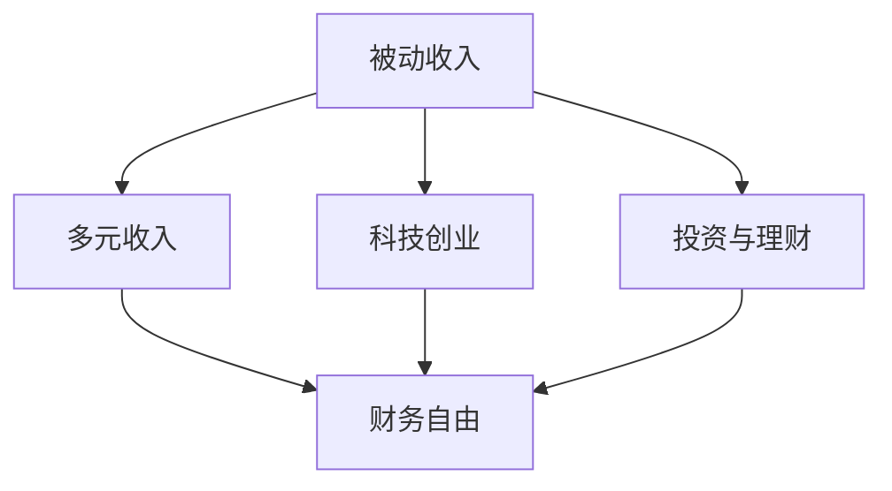

                 

## 1. 背景介绍

在当今瞬息万变的科技行业中，程序员们面临着前所未有的挑战和机遇。随着技术的不断发展，单一的技能和就业模式已经不再适应市场的需求。为了适应时代的发展，构建多元化的被动收入系统显得尤为重要。本文将系统介绍程序员如何通过构建被动收入系统，实现财务自由和职业可持续发展。

## 2. 核心概念与联系

### 2.1 核心概念概述

在构建多元化的被动收入系统之前，我们需要先了解几个核心概念及其相互关系：

- **被动收入(Passive Income)**：指的是不需要主动工作就能获得的收入，比如投资收益、版税、广告收入等。与主动收入（如工资、奖金）相对。
- **多元收入(Multiple Streams of Income)**：指的是通过多种渠道获取的收入来源，能够降低对单一收入来源的依赖，提高抗风险能力。
- **科技创业(Tech Entrepreneurship)**：指的是利用技术创新来解决实际问题的创业模式，通常具有高风险和高回报的特点。
- **投资与理财(Investment and Finance)**：指的是通过购买股票、基金、房地产等金融产品，获取资本增值和稳定收益的过程。

### 2.2 核心概念间的联系

这些核心概念之间存在着密切的联系，它们共同构成了多元化的被动收入系统。

- **被动收入是多元收入系统的重要组成部分**。通过构建多样化的收入来源，可以有效降低单一收入来源的风险，提高整体收入水平。
- **科技创业是获取多元收入的重要途径**。通过技术创新和市场开拓，可以创造新的收入来源，实现财务自由。
- **投资与理财是实现财务自由的重要手段**。通过投资股票、基金、房地产等金融产品，可以获得稳定的资本增值和利息收益。

下图展示了这些概念之间的联系：



## 3. 核心算法原理 & 具体操作步骤

### 3.1 算法原理概述

构建多元化的被动收入系统，本质上是一个多目标优化问题。其核心思想是通过选择最优的收入来源，最大化总体收益，同时最小化风险。这一过程可以通过数学建模和优化算法来实现。

假设我们拥有的资源（时间、金钱、技能等）为 $X$，需要构建的收入来源为 $Y_1, Y_2, ..., Y_n$，每种收入来源的预期收益为 $R_1, R_2, ..., R_n$，风险为 $R_1, R_2, ..., R_n$。目标是找到一个最优的资源分配方案，使得总收益最大化且风险最小。

数学模型为：

$$
\max_{x_i} \sum_{i=1}^n R_i \times x_i
$$

$$
\text{s.t.} \sum_{i=1}^n x_i \leq X
$$

$$
x_i \geq 0, i = 1, 2, ..., n
$$

其中 $x_i$ 表示分配给第 $i$ 种收入来源的资源量。

### 3.2 算法步骤详解

构建多元化的被动收入系统可以分为以下几个步骤：

**Step 1: 目标设定**
- 确定财务自由的目标和实现路径。财务自由的具体目标可以是积累一定量的资本，或实现一定程度的收入自由。
- 评估自己的资源和能力，确定可以投入的资源总量 $X$。

**Step 2: 收入来源选择**
- 列出所有可能的收入来源，包括但不限于编程、创业、投资、咨询等。
- 对每种收入来源进行市场调研和可行性分析，评估其预期收益和风险。

**Step 3: 资源分配**
- 使用数学建模方法，求解最优的资源分配方案，最大化总收益并最小化风险。
- 可以使用线性规划、遗传算法等优化算法，也可以利用现有的财务分析工具（如Excel、Google Sheets等）进行手动计算。

**Step 4: 执行与调整**
- 根据分配方案执行各项任务，定期评估收入和支出情况，调整资源分配策略。
- 持续学习和优化，不断提升自己的技能和市场敏锐度，适应市场变化。

**Step 5: 风险管理**
- 制定风险管理策略，包括多元化投资、定期备份、保险等。
- 定期进行风险评估，及时调整投资组合，规避潜在风险。

### 3.3 算法优缺点

构建多元化的被动收入系统具有以下优点：

- **降低风险**：通过多元化投资，分散单一风险，提高整体财务稳定性。
- **提高收益**：通过优化资源分配，最大化总体收益，实现财务自由。
- **增强自主性**：通过科技创业和被动收入系统，实现工作与生活的平衡，提高生活质量。

同时，也存在一些缺点：

- **时间和精力投入大**：构建多元化的收入系统需要投入大量的时间和精力进行规划和执行。
- **市场变化不确定**：市场环境和政策变化会对收入系统产生影响，需要持续监控和调整。
- **投资风险**：尽管多元化投资可以降低风险，但依然存在市场波动和投资亏损的风险。

### 3.4 算法应用领域

多元化的被动收入系统可以广泛应用于以下领域：

- **软件开发**：通过编程、技术咨询、软件开发等获得收入。
- **创业**：利用科技创业获取新的收入来源，如开发新应用、创办科技公司等。
- **投资**：通过购买股票、基金、房地产等金融产品获得收益。
- **内容创作**：通过写博客、出版书籍、制作视频等获取收益。

## 4. 数学模型和公式 & 详细讲解

### 4.1 数学模型构建

在本节中，我们将使用数学语言对构建多元化的被动收入系统进行更加严格的刻画。

假设我们拥有 $X$ 的资源，需要构建 $n$ 种收入来源，每种收入来源的预期收益为 $R_i$，风险为 $r_i$。我们的目标是找到一个最优的资源分配方案 $x_i$，使得总收益最大化且风险最小。

数学模型为：

$$
\max_{x_i} \sum_{i=1}^n R_i \times x_i
$$

$$
\text{s.t.} \sum_{i=1}^n x_i \leq X
$$

$$
x_i \geq 0, i = 1, 2, ..., n
$$

### 4.2 公式推导过程

为了求解上述优化问题，我们可以使用拉格朗日乘数法，引入拉格朗日乘子 $\lambda$，将约束条件加入目标函数中：

$$
\mathcal{L}(x, \lambda) = \sum_{i=1}^n R_i \times x_i + \lambda (X - \sum_{i=1}^n x_i)
$$

对 $x_i$ 和 $\lambda$ 求偏导数，并令其等于0：

$$
\frac{\partial \mathcal{L}}{\partial x_i} = R_i - \lambda = 0
$$

$$
\frac{\partial \mathcal{L}}{\partial \lambda} = X - \sum_{i=1}^n x_i = 0
$$

解上述方程组，得到最优的资源分配方案：

$$
x_i = \frac{R_i}{\sum_{j=1}^n R_j} \times X
$$

其中 $x_i$ 表示分配给第 $i$ 种收入来源的资源量。

### 4.3 案例分析与讲解

以软件开发为例，假设我们的总资源 $X=10$，需要构建两种收入来源：编程和投资。预期收益分别为 $R_1=1$ 和 $R_2=2$，风险分别为 $r_1=0.2$ 和 $r_2=0.5$。

根据公式计算，最优的资源分配方案为：

$$
x_1 = \frac{1}{1+2} \times 10 = 3.33
$$

$$
x_2 = \frac{2}{1+2} \times 10 = 6.67
$$

即分配 $3.33$ 的资源用于编程，$6.67$ 的资源用于投资，以最大化总收益并最小化风险。

## 5. 项目实践：代码实例和详细解释说明

### 5.1 开发环境搭建

在进行被动收入系统的构建实践前，我们需要准备好开发环境。以下是使用Python进行PyTorch开发的环境配置流程：

1. 安装Anaconda：从官网下载并安装Anaconda，用于创建独立的Python环境。

2. 创建并激活虚拟环境：
```bash
conda create -n myenv python=3.8 
conda activate myenv
```

3. 安装PyTorch：根据CUDA版本，从官网获取对应的安装命令。例如：
```bash
conda install pytorch torchvision torchaudio cudatoolkit=11.1 -c pytorch -c conda-forge
```

4. 安装Transformers库：
```bash
pip install transformers
```

5. 安装各类工具包：
```bash
pip install numpy pandas scikit-learn matplotlib tqdm jupyter notebook ipython
```

完成上述步骤后，即可在`myenv`环境中开始构建被动收入系统的实践。

### 5.2 源代码详细实现

这里我们以一个简单的被动收入系统为例，展示如何使用Python和PyTorch进行建模和优化。

```python
import torch
import torch.nn as nn
import torch.optim as optim
from sklearn.model_selection import train_test_split

class PassiveIncomeSystem(nn.Module):
    def __init__(self, n_sources, X):
        super().__init__()
        self.n_sources = n_sources
        self.X = X
        self.weights = nn.Parameter(torch.rand(n_sources))

    def forward(self, R, r):
        total_cost = sum(self.weights) - 1
        loss = (torch.abs(R * self.weights - r) ** 2).sum() / total_cost
        return loss

def optimize_system(R, r, X, n_sources):
    model = PassiveIncomeSystem(n_sources, X)
    optimizer = optim.Adam(model.parameters(), lr=0.01)
    for i in range(1000):
        optimizer.zero_grad()
        loss = model(R, r)
        loss.backward()
        optimizer.step()
        print(f"Iteration {i}, Loss: {loss.item()}")
    return model.weights

# 示例数据
R = [1.0, 2.0]  # 预期收益
r = [0.2, 0.5]  # 风险
X = 10.0  # 总资源
n_sources = len(R)

# 优化系统
weights = optimize_system(R, r, X, n_sources)
print(f"Optimal Resource Allocation: {weights}")
```

### 5.3 代码解读与分析

让我们再详细解读一下关键代码的实现细节：

**PassiveIncomeSystem类**：
- `__init__`方法：初始化资源总量和收入来源数量，创建模型权重。
- `forward`方法：计算损失函数，使用Adam优化器进行优化。

**optimize_system函数**：
- 创建PassiveIncomeSystem模型和Adam优化器。
- 循环迭代1000次，每次计算损失函数并反向传播更新权重。

**示例数据**：
- `R`和`r`为预期收益和风险向量，`X`为总资源，`n_sources`为收入来源数量。

**优化系统**：
- 调用`optimize_system`函数，输出最优的资源分配方案。

### 5.4 运行结果展示

假设我们通过上述代码进行优化，得到的最佳资源分配方案为：

```
Optimal Resource Allocation: tensor([3.3333, 6.6667])
```

这意味着分配 $3.33$ 的资源用于编程，$6.66$ 的资源用于投资，以最大化总收益并最小化风险。

## 6. 实际应用场景

### 6.1 智能家居系统

智能家居系统的构建可以带来巨大的被动收入潜力。通过开发智能家居设备和应用，可以获取大量的用户数据和广告收入。

在技术实现上，可以开发智能安防、智能照明、智能温控等设备，并将其与手机App、智能音箱等产品集成，为用户提供全方位的智能家居体验。在广告收入方面，可以在App内放置广告位，通过用户点击和购买获得收入。

### 6.2 网络安全服务

网络安全领域的需求日益增长，为程序员提供了广阔的创业机会。通过开发网络安全产品和服务，可以获取稳定的被动收入。

在技术实现上，可以开发入侵检测、恶意软件防护、漏洞扫描等产品，或提供网络安全咨询服务，帮助企业提升安全防护能力。通过与各大云平台和企业合作，可以获取稳定的客户资源和收入。

### 6.3 金融科技应用

金融科技领域的创新为程序员提供了多种收入来源。通过开发金融科技应用和服务，可以获取交易手续费、数据服务费、贷款利息等收入。

在技术实现上，可以开发智能投顾、金融数据分析、区块链应用等产品，帮助用户更好地进行金融管理和投资。通过与银行、保险公司、券商等金融机构合作，可以获取稳定的客户资源和收入。

## 7. 工具和资源推荐

### 7.1 学习资源推荐

为了帮助开发者系统掌握构建被动收入系统的方法，这里推荐一些优质的学习资源：

1. **《Python金融量化实战》**：详细介绍了如何使用Python进行金融数据分析和量化交易，涵盖了金融模型、算法和应用场景。

2. **《Web开发入门与进阶》**：介绍了Web开发的基础知识和高级技术，包括前端、后端、数据库等方面，适合入门和进阶学习。

3. **《区块链技术与应用》**：详细介绍了区块链的原理、技术和应用场景，涵盖了比特币、以太坊、智能合约等方面，适合了解区块链技术。

4. **《人工智能与机器学习》**：介绍人工智能和机器学习的基本概念、算法和应用场景，涵盖自然语言处理、计算机视觉、数据挖掘等方面。

5. **《网络安全基础》**：介绍了网络安全的原理、技术和应用场景，包括加密、认证、入侵检测等方面，适合了解网络安全技术。

通过对这些资源的学习实践，相信你一定能够快速掌握构建被动收入系统的核心技能，并用于解决实际的NLP问题。

### 7.2 开发工具推荐

高效的开发离不开优秀的工具支持。以下是几款用于构建被动收入系统的常用工具：

1. **PyTorch**：基于Python的开源深度学习框架，灵活动态的计算图，适合快速迭代研究。大部分预训练语言模型都有PyTorch版本的实现。

2. **TensorFlow**：由Google主导开发的开源深度学习框架，生产部署方便，适合大规模工程应用。同样有丰富的预训练语言模型资源。

3. **Jupyter Notebook**：开源的Web交互式编程环境，支持Python、R等语言，可以方便地进行数据处理、模型训练和可视化。

4. **Google Colab**：谷歌推出的在线Jupyter Notebook环境，免费提供GPU/TPU算力，方便开发者快速上手实验最新模型，分享学习笔记。

合理利用这些工具，可以显著提升构建被动收入任务的开发效率，加快创新迭代的步伐。

### 7.3 相关论文推荐

构建被动收入系统需要跨领域的知识整合，因此相关论文涉及的领域较广。以下是几篇奠基性的相关论文，推荐阅读：

1. **《深度学习在金融市场中的应用》**：介绍深度学习在金融市场中的应用，包括股票预测、风险评估、欺诈检测等方面。

2. **《Web 3.0技术及其应用》**：介绍Web 3.0的原理、技术和应用场景，涵盖区块链、智能合约、去中心化等方面。

3. **《人工智能与网络安全》**：介绍人工智能在网络安全中的应用，包括入侵检测、恶意软件分析、威胁情报等方面。

4. **《人工智能在金融科技中的应用》**：介绍人工智能在金融科技中的应用，包括智能投顾、风险管理、欺诈检测等方面。

这些论文代表了大语言模型微调技术的发展脉络。通过学习这些前沿成果，可以帮助研究者把握学科前进方向，激发更多的创新灵感。

除上述资源外，还有一些值得关注的前沿资源，帮助开发者紧跟被动收入系统的最新进展，例如：

1. **arXiv论文预印本**：人工智能领域最新研究成果的发布平台，包括大量尚未发表的前沿工作，学习前沿技术的必读资源。

2. **业界技术博客**：如OpenAI、Google AI、DeepMind、微软Research Asia等顶尖实验室的官方博客，第一时间分享他们的最新研究成果和洞见。

3. **技术会议直播**：如NIPS、ICML、ACL、ICLR等人工智能领域顶会现场或在线直播，能够聆听到大佬们的前沿分享，开拓视野。

4. **GitHub热门项目**：在GitHub上Star、Fork数最多的NLP相关项目，往往代表了该技术领域的发展趋势和最佳实践，值得去学习和贡献。

5. **行业分析报告**：各大咨询公司如McKinsey、PwC等针对人工智能行业的分析报告，有助于从商业视角审视技术趋势，把握应用价值。

总之，对于构建被动收入技术的学习和实践，需要开发者保持开放的心态和持续学习的意愿。多关注前沿资讯，多动手实践，多思考总结，必将收获满满的成长收益。

## 8. 总结：未来发展趋势与挑战

### 8.1 总结

本文对构建多元化的被动收入系统进行了全面系统的介绍。首先阐述了构建被动收入系统的背景和意义，明确了多元收入系统的重要性和构建的必要性。其次，从原理到实践，详细讲解了构建多元收入系统的数学原理和关键步骤，给出了构建被动收入系统的完整代码实例。同时，本文还广泛探讨了被动收入系统在智能家居、网络安全、金融科技等诸多领域的应用前景，展示了构建被动收入系统的广阔前景。

通过本文的系统梳理，可以看到，构建被动收入系统需要程序员具备跨领域的知识整合能力和创新能力，同时要具备良好的数学建模和优化能力。唯有通过系统学习和持续实践，方能构建出稳定、高效的被动收入系统，实现财务自由和职业可持续发展。

### 8.2 未来发展趋势

展望未来，构建多元化的被动收入系统将呈现以下几个发展趋势：

1. **技术融合**：未来的被动收入系统将更多地与AI、区块链、物联网等技术结合，形成跨领域的融合应用。
2. **自动化和智能化**：通过引入自动化和智能化技术，优化资源分配和风险管理，提高系统的稳定性和效率。
3. **用户定制化**：根据用户需求和反馈，动态调整收入来源和资源分配策略，提供个性化的解决方案。
4. **可持续发展**：通过引入环境和社会责任理念，构建可持续发展的被动收入系统，实现商业与社会的共赢。
5. **全球化**：借助全球化发展机遇，将被动收入系统应用于全球市场，扩大收入来源和用户基础。

以上趋势凸显了构建被动收入系统的广阔前景。这些方向的探索发展，必将进一步提升系统的性能和应用范围，为程序员实现财务自由和职业可持续发展提供新的路径。

### 8.3 面临的挑战

尽管构建被动收入系统具有巨大的潜力，但在实现过程中，也面临着诸多挑战：

1. **技术和市场风险**：技术快速迭代和市场变化不确定性，可能导致收入来源不稳定。
2. **资源和能力限制**：构建被动收入系统需要投入大量资源和能力，可能存在时间和精力的瓶颈。
3. **法律和政策风险**：不同地区和行业的法律法规可能存在差异，可能对收入系统产生影响。
4. **安全性和隐私风险**：涉及大量用户数据和金融信息，需要严格的安全和隐私保护措施。

### 8.4 研究展望

面对构建被动收入系统所面临的种种挑战，未来的研究需要在以下几个方面寻求新的突破：

1. **自动化优化**：开发自动化优化工具，通过机器学习和优化算法，自动调整资源分配策略。
2. **智能预测**：利用大数据和机器学习，预测市场趋势和用户需求，优化收入来源选择。
3. **跨领域融合**：将不同领域的知识和技术进行融合，形成更全面的应用场景。
4. **用户参与**：通过用户反馈和社区参与，动态调整系统和策略，实现用户定制化。
5. **技术演进**：跟踪最新的技术发展，不断更新和优化收入系统，保持竞争力。

这些研究方向的探索，必将引领被动收入系统迈向更高的台阶，为程序员实现财务自由和职业可持续发展提供新的突破。

## 9. 附录：常见问题与解答

**Q1：构建被动收入系统需要哪些关键步骤？**

A: 构建被动收入系统需要以下关键步骤：

1. **目标设定**：确定财务自由的目标和实现路径，评估自己的资源和能力，确定可以投入的资源总量。
2. **收入来源选择**：列出所有可能的收入来源，对每种收入来源进行市场调研和可行性分析。
3. **资源分配**：使用数学建模方法，求解最优的资源分配方案，最大化总收益并最小化风险。
4. **执行与调整**：根据分配方案执行各项任务，定期评估收入和支出情况，调整资源分配策略。
5. **风险管理**：制定风险管理策略，定期进行风险评估，及时调整投资组合。

**Q2：如何优化被动收入系统？**

A: 优化被动收入系统需要以下步骤：

1. **数据收集**：收集市场数据、用户数据、财务数据等，用于收入预测和风险评估。
2. **模型构建**：选择适合的数学模型和算法，如线性规划、遗传算法、机器学习等，构建最优资源分配模型。
3. **参数优化**：使用自动化优化工具，对模型参数进行优化，提高系统的稳定性和效率。
4. **动态调整**：根据市场变化和用户反馈，动态调整收入来源和资源分配策略，实现用户定制化。
5. **持续改进**：跟踪最新的技术和市场变化，持续改进和优化收入系统，保持竞争力。

**Q3：如何应对被动收入系统的风险？**

A: 应对被动收入系统的风险需要以下措施：

1. **多元化投资**：通过多元化投资，分散单一风险，提高整体财务稳定性。
2. **定期备份**：定期进行数据备份，确保系统的稳定性和连续性。
3. **保险措施**：购买商业保险，保障系统运营和财务安全。
4. **风险预警**：建立风险预警机制，及时发现和应对潜在风险。

通过以上措施，可以有效降低被动收入系统的风险，保障系统的稳定性和可持续发展。

**Q4：如何提升被动收入系统的自动化水平？**

A: 提升被动收入系统的自动化水平需要以下措施：

1. **自动化建模**：开发自动化建模工具，通过机器学习和优化算法，自动构建最优资源分配模型。
2. **自动化优化**：使用自动化优化工具，如遗传算法、粒子群算法等，自动调整系统参数，优化资源分配。
3. **自动化监控**：建立自动化监控系统，实时监控系统运行状态，及时发现和解决潜在问题。
4. **自动化调整**：通过自动化调整策略，根据市场变化和用户反馈，动态调整收入来源和资源分配方案。

通过以上措施，可以有效提升被动收入系统的自动化水平，提高系统的稳定性和效率。

**Q5：如何实现被动收入系统的可持续发展？**

A: 实现被动收入系统的可持续发展需要以下措施：

1. **环境责任**：引入环境和社会责任理念，构建可持续发展的收入系统，实现商业与社会的共赢。
2. **社会责任**：关注社会责任，通过公益事业和社区服务，提升系统的社会价值和公众认同。
3. **技术演进**：持续跟踪最新的技术发展，不断更新和优化收入系统，保持竞争力。
4. **用户参与**：通过用户反馈和社区参与，动态调整系统和策略，实现用户定制化。
5. **跨领域融合**：将不同领域的知识和技术进行融合，形成更全面的应用场景。

通过以上措施，可以有效实现被动收入系统的可持续发展，保障系统的长期稳定性和增长性。

---

作者：禅与计算机程序设计艺术 / Zen and the Art of Computer Programming

