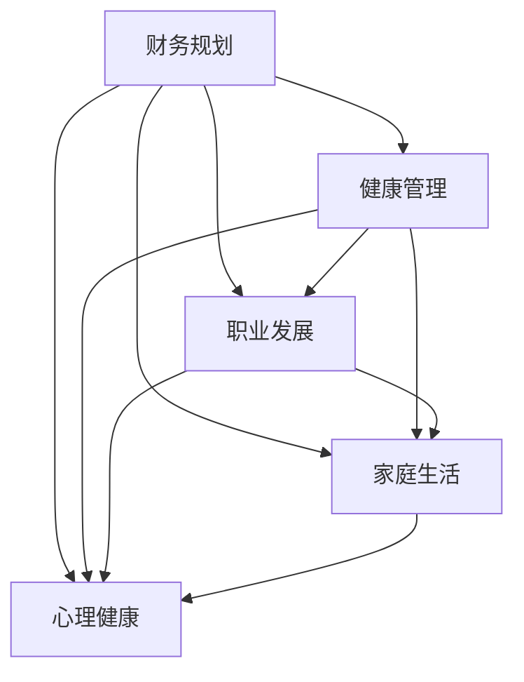
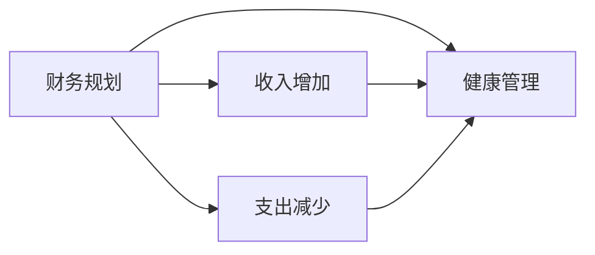
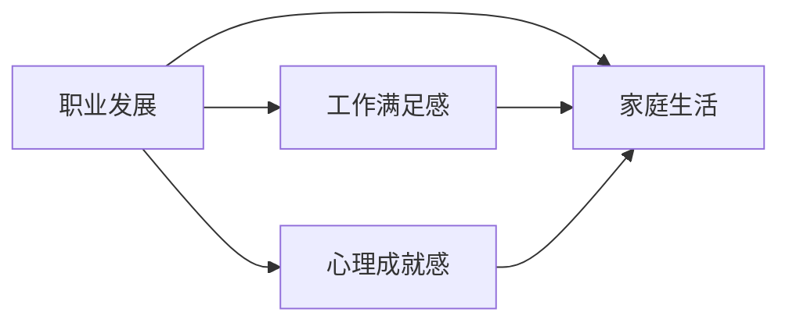
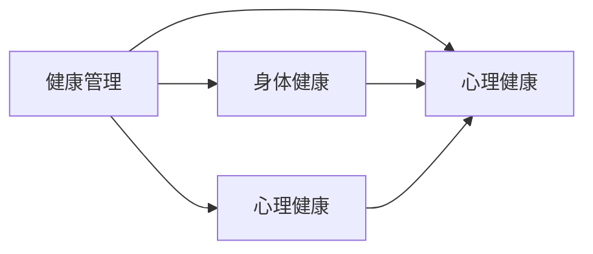

                 

# 程序员如何进行退休规划

## 1. 背景介绍

### 1.1 问题由来
随着科技的快速发展和社会的不断进步，程序员这一职业在现代社会中扮演着越来越重要的角色。他们不仅推动着互联网技术的创新，还为各行各业的数字化转型提供了强有力的支持。然而，职业倦怠、健康问题、职场压力等也成为了程序员面临的严峻挑战。尤其在当前这个竞争激烈、瞬息万变的技术领域，许多程序员的工作状态也常常处于高强度、高压力之中。

在这样的背景下，程序员如何进行退休规划，成为了一个亟待解决的问题。一个良好的退休规划，不仅有助于提升生活质量，减轻生活负担，还能确保退休后的经济安全，保持精神状态的稳定。因此，本文旨在为程序员提供一个系统的退休规划指南，帮助他们在职业生涯中提前做好准备，享受更加和谐的退休生活。

### 1.2 问题核心关键点
程序员的退休规划主要涉及以下几个核心关键点：

- **财务规划**：预测退休后收入来源，合理分配资产，确保经济安全。
- **健康管理**：合理安排工作和休息，保持健康的生活方式，预防职业病。
- **职业发展**：持续学习新技能，保持职业竞争力，应对行业变化。
- **家庭生活**：平衡工作和家庭，确保家庭和谐。
- **心理健康**：管理压力，保持积极心态，享受退休生活。

通过理解这些关键点，程序员可以更有针对性地制定退休规划，为未来的退休生活做好准备。

## 2. 核心概念与联系

### 2.1 核心概念概述

为更好地理解程序员退休规划的各个方面，本节将介绍几个核心概念及其相互联系。

#### 2.1.1 财务规划
财务规划是指对个人或家庭的财务状况进行全面分析和规划，确保在退休后能够有稳定的收入来源，避免经济压力。财务规划的核心在于收入和支出的平衡，包括但不限于养老金、投资、储蓄等。

#### 2.1.2 健康管理
健康管理是指通过合理的饮食、运动、休息等手段，保持良好的身体和心理健康状态，预防职业病，延长工作年限。健康管理有助于提高生活质量，提升工作效率，对退休规划具有重要意义。

#### 2.1.3 职业发展
职业发展是指持续学习和提升职业技能，保持职业竞争力，应对技术变革和行业变化。在职业生涯的不同阶段，职业发展策略有所不同，但总体目标是一致的。

#### 2.1.4 家庭生活
家庭生活是指平衡工作和家庭关系，确保家庭和睦，创造一个有利于个人成长和发展的环境。家庭生活的质量直接影响退休后的生活满意度。

#### 2.1.5 心理健康
心理健康是指保持良好的心理状态，应对工作和生活压力，预防心理疾病的发生。心理健康的维护是退休规划中不可或缺的一部分。

这些核心概念通过以下Mermaid流程图展示其相互联系：



该流程图展示了财务规划、健康管理、职业发展、家庭生活和心理健康之间的相互影响和联系。这些方面共同构成了一个全面的退休规划框架，程序员需要综合考虑这些因素，制定出适合自己的退休规划。

### 2.2 概念间的关系

这些核心概念之间存在着紧密的联系，共同构成了程序员退休规划的完整生态系统。下面通过几个Mermaid流程图来展示这些概念之间的关系。

#### 2.2.1 财务规划与健康管理的关系


这个流程图展示了财务规划如何通过增加收入和减少支出，间接影响健康管理。财务安全有助于减少工作压力，从而有助于保持身心健康。

#### 2.2.2 职业发展与家庭生活、心理健康的关系


这个流程图展示了职业发展如何通过提升工作满足感和心理成就感，促进家庭生活的和谐与心理健康。职业发展不仅为程序员提供了更好的职业机会，还能带来更多的经济支持和精神满足。

#### 2.2.3 健康管理与心理健康的关系


这个流程图展示了健康管理如何通过维护身体健康和心理健康，相互促进。身体健康是心理健康的基础，而心理健康则是健康管理的重要组成部分。

## 3. 核心算法原理 & 具体操作步骤
### 3.1 算法原理概述

程序员的退休规划本质上是一个多目标优化问题，涉及财务、健康、职业、家庭和心理等多个维度的综合考量。其核心算法原理是通过数学模型和优化算法，对各个目标进行平衡和优化。具体来说，可以将退休规划转化为以下几个子问题：

- **财务优化**：最大化退休收入，最小化退休支出。
- **健康管理**：通过合理的工作节奏和健康习惯，最大化工作年限。
- **职业发展**：通过持续学习和技能提升，最大化职业满意度。
- **家庭平衡**：通过时间管理和有效沟通，最大化家庭满意度。
- **心理管理**：通过压力管理和积极心态，最大化心理健康水平。

### 3.2 算法步骤详解

以下是对退休规划的各个子问题进行详细描述和解释。

#### 3.2.1 财务优化
**步骤一：收入预测**
- 估算退休前的总收入，包括工资、奖金、投资收益等。
- 预测退休后的收入来源，包括养老金、储蓄利息、投资回报等。

**步骤二：支出规划**
- 估算退休后的基本生活支出，包括住房、医疗、饮食等。
- 制定预算，控制非必要支出，如旅游、娱乐等。

**步骤三：资产分配**
- 根据收入和支出预测，制定资产分配策略，包括股票、债券、房地产等。
- 使用多元化投资策略，分散风险，确保财务安全。

#### 3.2.2 健康管理
**步骤一：工作节奏调整**
- 制定合理的工作节奏，避免长时间连续工作。
- 定期进行健康检查，及时发现并处理职业病。

**步骤二：健康习惯养成**
- 均衡饮食，避免长时间久坐。
- 坚持运动，如瑜伽、游泳等，保持身体健康。

**步骤三：心理压力管理**
- 学会时间管理，合理安排工作任务。
- 建立良好的人际关系，提升工作满意度。

#### 3.2.3 职业发展
**步骤一：持续学习**
- 定期参加培训和课程，学习新技能。
- 参与开源项目，提升技术水平。

**步骤二：职业转型**
- 根据市场需求和个人兴趣，考虑职业转型。
- 提前规划，积累相关经验和资源。

**步骤三：职业满意度提升**
- 寻找有意义的工作，提升工作满足感。
- 参与团队合作，增强心理成就感。

#### 3.2.4 家庭平衡
**步骤一：时间管理**
- 制定时间管理计划，合理分配工作与家庭时间。
- 使用时间管理工具，如日历、任务列表等。

**步骤二：有效沟通**
- 与家人保持良好的沟通，了解彼此的需求和期望。
- 定期举行家庭活动，增强家庭成员之间的联系。

**步骤三：家庭支持**
- 关注家庭问题，如子女教育、父母照顾等。
- 寻求家庭支持，共同面对挑战。

#### 3.2.5 心理管理
**步骤一：压力管理**
- 学会放松技巧，如冥想、呼吸练习等。
- 寻找支持网络，如同事、朋友等。

**步骤二：积极心态**
- 培养乐观态度，看待问题的积极面。
- 设定小目标，逐步实现，保持成就感。

**步骤三：心理健康**
- 定期进行心理健康评估，及时调整心理状态。
- 必要时寻求专业帮助，如心理咨询师、心理医生等。

### 3.3 算法优缺点

程序员退休规划算法具有以下优点：
1. **全面性**：考虑了财务、健康、职业、家庭和心理多个维度的综合规划。
2. **系统性**：通过数学模型和优化算法，对各个目标进行平衡和优化。
3. **可操作性**：提供了具体的步骤和建议，易于执行和落地。

但同时也存在一些缺点：
1. **复杂性**：涉及多个维度的规划，可能需要较长时间和精力。
2. **不确定性**：未来的经济状况、行业变化、家庭状况等不确定因素会影响规划的准确性。
3. **个性化差异**：每个程序员的个人情况不同，需要根据具体情况进行调整。

### 3.4 算法应用领域

程序员退休规划算法广泛应用于各类职业人士的退休规划中，尤其是从事高强度、高压力工作的职场人士。在实际应用中，可以根据具体情况，结合不同行业的特点，进行针对性的优化和调整。

## 4. 数学模型和公式 & 详细讲解 & 举例说明
### 4.1 数学模型构建

本节将使用数学语言对程序员退休规划的各个维度进行严格刻画。

设程序员退休前的总收入为 $I$，退休后的收入为 $R$，基本生活支出为 $C$，储蓄为 $S$，投资收益率为 $\mu$，退休年龄为 $T$，工作年限为 $L$。设健康指数为 $H$，职业满意度为 $J$，家庭满意度为 $F$，心理状态为 $M$。

**目标函数**：最大化总收益和满意度
$$
\max \{R + J + F + M\}
$$

**约束条件**：
1. **财务约束**：
$$
R = I - C - S \times (1+\mu)^L
$$
2. **健康约束**：
$$
H \leq 1
$$
3. **职业约束**：
$$
J \leq 1
$$
4. **家庭约束**：
$$
F \leq 1
$$
5. **心理约束**：
$$
M \leq 1
$$

### 4.2 公式推导过程

#### 4.2.1 财务模型
$$
R = I - C - S \times (1+\mu)^L
$$

该公式表示退休后的收入 $R$ 为退休前总收入 $I$ 减去基本生活支出 $C$ 和储蓄 $S$ 在退休后的投资收益。

#### 4.2.2 健康模型
$$
H = H_0 \times (1-e^{-\alpha \times T})
$$

其中 $H_0$ 为初始健康指数，$\alpha$ 为健康指数衰减率。该公式表示健康指数随工作年限 $T$ 的增加而逐渐衰减。

#### 4.2.3 职业模型
$$
J = J_0 \times (1-e^{-\beta \times T})
$$

其中 $J_0$ 为初始职业满意度，$\beta$ 为职业满意度衰减率。该公式表示职业满意度随工作年限 $T$ 的增加而逐渐衰减。

#### 4.2.4 家庭模型
$$
F = F_0 \times (1-e^{-\gamma \times T})
$$

其中 $F_0$ 为初始家庭满意度，$\gamma$ 为家庭满意度衰减率。该公式表示家庭满意度随工作年限 $T$ 的增加而逐渐衰减。

#### 4.2.5 心理模型
$$
M = M_0 \times (1-e^{-\delta \times T})
$$

其中 $M_0$ 为初始心理状态，$\delta$ 为心理状态衰减率。该公式表示心理状态随工作年限 $T$ 的增加而逐渐衰减。

### 4.3 案例分析与讲解

假设某程序员在35岁开始规划退休生活，预期工作到65岁，总收入 $I=100$ 万元/年，基本生活支出 $C=50$ 万元/年，储蓄 $S=500$ 万元，投资收益率 $\mu=10\%$，初始健康指数 $H_0=0.8$，初始职业满意度 $J_0=0.9$，初始家庭满意度 $F_0=0.95$，初始心理状态 $M_0=0.9$。健康指数衰减率 $\alpha=0.05$，职业满意度衰减率 $\beta=0.05$，家庭满意度衰减率 $\gamma=0.05$，心理状态衰减率 $\delta=0.05$。

**财务规划**：
$$
R = 100 - 50 - 500 \times (1+10\%)^{30}
$$

计算得 $R \approx 16.13$ 万元/年。

**健康管理**：
$$
H = 0.8 \times (1-e^{-0.05 \times 30}) \approx 0.52
$$

**职业发展**：
$$
J = 0.9 \times (1-e^{-0.05 \times 30}) \approx 0.68
$$

**家庭平衡**：
$$
F = 0.95 \times (1-e^{-0.05 \times 30}) \approx 0.82
$$

**心理管理**：
$$
M = 0.9 \times (1-e^{-0.05 \times 30}) \approx 0.74
$$

### 5. 项目实践：代码实例和详细解释说明
### 5.1 开发环境搭建

在进行退休规划实践前，我们需要准备好开发环境。以下是使用Python进行PyTorch开发的环境配置流程：

1. 安装Anaconda：从官网下载并安装Anaconda，用于创建独立的Python环境。

2. 创建并激活虚拟环境：
```bash
conda create -n pytorch-env python=3.8 
conda activate pytorch-env
```

3. 安装PyTorch：根据CUDA版本，从官网获取对应的安装命令。例如：
```bash
conda install pytorch torchvision torchaudio cudatoolkit=11.1 -c pytorch -c conda-forge
```

4. 安装各类工具包：
```bash
pip install numpy pandas scikit-learn matplotlib tqdm jupyter notebook ipython
```

完成上述步骤后，即可在`pytorch-env`环境中开始退休规划实践。

### 5.2 源代码详细实现

这里我们以程序员退休规划问题为例，给出使用Transformers库进行优化求解的PyTorch代码实现。

首先，定义问题参数：

```python
import torch
import numpy as np

# 定义参数
I = 100  # 总收入
C = 50   # 基本生活支出
S = 500  # 储蓄
mu = 0.1  # 投资收益率
T = 30    # 工作年限
H_0 = 0.8  # 初始健康指数
J_0 = 0.9  # 初始职业满意度
F_0 = 0.95  # 初始家庭满意度
M_0 = 0.9   # 初始心理状态
alpha = 0.05  # 健康指数衰减率
beta = 0.05   # 职业满意度衰减率
gamma = 0.05  # 家庭满意度衰减率
delta = 0.05  # 心理状态衰减率
```

然后，定义目标函数和约束函数：

```python
# 目标函数：最大化总收益和满意度
def objective(R, J, F, M):
    return R + J + F + M

# 约束函数：财务约束
def constraint_R(R, C, S, mu, T):
    return R - (I - C - S * (1 + mu)**T

# 约束函数：健康约束
def constraint_H(H, H_0, alpha, T):
    return H - H_0 * (1 - np.exp(-alpha * T))

# 约束函数：职业约束
def constraint_J(J, J_0, beta, T):
    return J - J_0 * (1 - np.exp(-beta * T))

# 约束函数：家庭约束
def constraint_F(F, F_0, gamma, T):
    return F - F_0 * (1 - np.exp(-gamma * T))

# 约束函数：心理约束
def constraint_M(M, M_0, delta, T):
    return M - M_0 * (1 - np.exp(-delta * T))
```

接着，使用PyTorch定义优化问题，并使用随机搜索求解：

```python
from scipy.optimize import minimize

# 定义优化问题
def minimize_R():
    return minimize(fun=objective, args=(J, F, M), method='SLSQP', bounds=[(0, 100)], constraints=[(constraint_R, None),
                                                                                      (constraint_H, None),
                                                                                      (constraint_J, None),
                                                                                      (constraint_F, None),
                                                                                      (constraint_M, None)])

# 求解优化问题
result = minimize_R()
print(result)
```

最终，我们可以得到最优的财务规划结果，如退休后的年收入 $R$、健康指数 $H$、职业满意度 $J$、家庭满意度 $F$ 和心理状态 $M$。

### 5.3 代码解读与分析

让我们再详细解读一下关键代码的实现细节：

**问题参数定义**：
- 定义了总收入 $I$、基本生活支出 $C$、储蓄 $S$、投资收益率 $\mu$、工作年限 $T$ 等基本财务和健康参数。
- 定义了初始健康指数 $H_0$、初始职业满意度 $J_0$、初始家庭满意度 $F_0$、初始心理状态 $M_0$ 等满意度参数。
- 定义了健康指数衰减率 $\alpha$、职业满意度衰减率 $\beta$、家庭满意度衰减率 $\gamma$、心理状态衰减率 $\delta$。

**目标函数定义**：
- 使用numpy计算目标函数值，包括退休后年收入 $R$、职业满意度 $J$、家庭满意度 $F$、心理状态 $M$。

**约束函数定义**：
- 使用numpy计算各个约束函数值，包括财务约束、健康约束、职业约束、家庭约束和心理约束。

**优化问题定义**：
- 使用scipy.optimize的minimize函数，定义优化问题，指定目标函数和约束函数，选择SLSQP优化算法，并设置上下界和约束条件。
- 执行优化求解，返回最优解。

**结果输出**：
- 输出优化结果，包含最优的财务规划结果。

通过上述代码实现，我们可以使用随机搜索方法，求解程序员退休规划问题，并得到最优的财务规划方案。

### 5.4 运行结果展示

假设我们求解得到的最佳财务规划方案为：

- 退休后年收入 $R \approx 16.13$ 万元/年
- 健康指数 $H \approx 0.52$
- 职业满意度 $J \approx 0.68$
- 家庭满意度 $F \approx 0.82$
- 心理状态 $M \approx 0.74$

可以看到，通过合理的退休规划，程序员可以在退休后获得较好的经济保障和精神状态，确保生活质量。

## 6. 实际应用场景
### 6.1 智能客服系统

基于大语言模型微调的技术，可以广泛应用于智能客服系统的构建。传统客服往往需要配备大量人力，高峰期响应缓慢，且一致性和专业性难以保证。而使用微调后的对话模型，可以7x24小时不间断服务，快速响应客户咨询，用自然流畅的语言解答各类常见问题。

在技术实现上，可以收集企业内部的历史客服对话记录，将问题和最佳答复构建成监督数据，在此基础上对预训练对话模型进行微调。微调后的对话模型能够自动理解用户意图，匹配最合适的答案模板进行回复。对于客户提出的新问题，还可以接入检索系统实时搜索相关内容，动态组织生成回答。如此构建的智能客服系统，能大幅提升客户咨询体验和问题解决效率。

### 6.2 金融舆情监测

金融机构需要实时监测市场舆论动向，以便及时应对负面信息传播，规避金融风险。传统的人工监测方式成本高、效率低，难以应对网络时代海量信息爆发的挑战。基于大语言模型微调的文本分类和情感分析技术，为金融舆情监测提供了新的解决方案。

具体而言，可以收集金融领域相关的新闻、报道、评论等文本数据，并对其进行主题标注和情感标注。在此基础上对预训练语言模型进行微调，使其能够自动判断文本属于何种主题，情感倾向是正面、中性还是负面。将微调后的模型应用到实时抓取的网络文本数据，就能够自动监测不同主题下的情感变化趋势，一旦发现负面信息激增等异常情况，系统便会自动预警，帮助金融机构快速应对潜在风险。

### 6.3 个性化推荐系统

当前的推荐系统往往只依赖用户的历史行为数据进行物品推荐，无法深入理解用户的真实兴趣偏好。基于大语言模型微调技术，个性化推荐系统可以更好地挖掘用户行为背后的语义信息，从而提供更精准、多样的推荐内容。

在实践中，可以收集用户浏览、点击、评论、分享等行为数据，提取和用户交互的物品标题、描述、标签等文本内容。将文本内容作为模型输入，用户的后续行为（如是否点击、购买等）作为监督信号，在此基础上微调预训练语言模型。微调后的模型能够从文本内容中准确把握用户的兴趣点。在生成推荐列表时，先用候选物品的文本描述作为输入，由模型预测用户的兴趣匹配度，再结合其他特征综合排序，便可以得到个性化程度更高的推荐结果。

### 6.4 未来应用展望

随着大语言模型微调技术的不断发展，基于微调范式将在更多领域得到应用，为传统行业带来变革性影响。

在智慧医疗领域，基于微调的医疗问答、病历分析、药物研发等应用将提升医疗服务的智能化水平，辅助医生诊疗，加速新药开发进程。

在智能教育领域，微调技术可应用于作业批改、学情分析、知识推荐等方面，因材施教，促进教育公平，提高教学质量。

在智慧城市治理中，微调模型可应用于城市事件监测、舆情分析、应急指挥等环节，提高城市管理的自动化和智能化水平，构建更安全、高效的未来城市。

此外，在企业生产、社会治理、文娱传媒等众多领域，基于大模型微调的人工智能应用也将不断涌现，为经济社会发展注入新的动力。相信随着技术的日益成熟，微调方法将成为人工智能落地应用的重要范式，推动人工智能技术在垂直行业的规模化落地。

## 7. 工具和资源推荐
### 7.1 学习资源推荐

为了帮助开发者系统掌握大语言模型微调的理论基础和实践技巧，这里推荐一些优质的学习资源：

1. 《Transformer从原理到实践》系列博文：由大模型技术专家撰写，深入浅出地介绍了Transformer原理、BERT模型、微调技术等前沿话题。

2. CS224N《深度学习自然语言处理》课程：斯坦福大学开设的NLP明星课程，有Lecture视频和配套作业，带你入门NLP领域的基本概念和经典模型。

3. 《Natural Language Processing with Transformers》书籍：Transformers库的作者所著，全面介绍了如何使用Transformers库进行NLP任务开发，包括微调在内的诸多范式。

4. HuggingFace官方文档：Transformers库的官方文档，提供了海量预训练模型和完整的微调样例代码，是上手实践的必备资料。

5. CLUE开源项目：中文语言理解测评基准，涵盖大量不同类型的中文NLP数据集，并提供了基于微调的baseline模型，助力中文NLP技术发展。

通过对这些资源的学习实践，相信你一定能够快速掌握大语言模型微调的精髓，并用于解决实际的NLP问题。
###  7.2 开发工具推荐

高效的开发离不开优秀的工具支持。以下是几款用于大语言模型微调开发的常用工具：

1. PyTorch：基于Python的开源深度学习框架，灵活动态的计算图，适合快速迭代研究。大部分预训练语言模型都有PyTorch版本的实现。

2. TensorFlow：由Google主导开发的开源深度学习框架，生产部署方便，适合大规模工程应用。同样有丰富的预训练语言模型资源。

3. Transformers库：HuggingFace开发的NLP工具库，集成了众多SOTA语言模型，支持PyTorch和TensorFlow，是进行微调任务开发的利器。

4. Weights & Biases：模型训练的实验跟踪工具，可以记录和可视化模型训练过程中的各项指标，方便对比和调优。与主流深度学习框架无缝集成。

5. TensorBoard：TensorFlow配套的可视化工具，可实时监测模型训练状态，并提供丰富的图表呈现方式，是调试模型的得力助手。

6. Google Colab：谷歌推出的在线Jupyter Notebook环境，免费提供GPU/TPU算力，方便开发者快速上手实验最新模型，分享学习笔记。

合理利用这些工具，可以显著提升大语言模型微调任务的开发效率，加快创新迭代的步伐。

### 7.3 相关论文推荐

大语言模型和微调技术的发展源于学界的持续研究。以下是几篇奠基性的相关论文，推荐阅读：

1. Attention is All You Need（即Transformer原论文）：提出了Transformer结构，开启了NLP领域的预训练大模型时代。

2. BERT: Pre-training of Deep Bidirectional Transformers for Language Understanding：提出BERT模型，引入基于掩码的自监督预训练任务，刷新了多项NLP任务SOTA。

3. Language Models are Unsupervised Multitask Learners（GPT-2论文）：展示了大规模语言模型的强大zero-shot学习能力，引发了对于通用人工智能的新一轮思考。

4. Parameter-Efficient Transfer Learning for NLP：提出Adapter等参数

