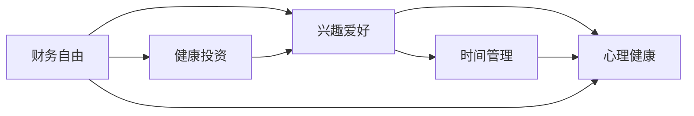

                 

# 程序员的退休生活：提前规划与实践

在现代社会的快节奏下，程序员的退休生活成为了越来越多人关注的话题。面对职业生涯的高强度和高压力，许多人在工作之余开始思考如何更好地规划自己的退休生活，以便在退休后依然能够保持健康、充实和快乐。本文旨在为有意向提前规划退休生活的程序员提供一些实用的建议和实践指南。

## 1. 背景介绍

### 1.1 问题由来
随着科技行业的迅猛发展，程序员在职业生涯中的压力和挑战越来越大。长时间的工作、频繁的加班、复杂的技术问题、严苛的项目截止日期等，都让程序员们面临着巨大的心理和生理压力。退休，不再仅仅是年龄的象征，更是对自己职业生涯的总结和对未来生活的规划。

### 1.2 问题核心关键点
程序员退休规划的核心关键点包括：
- **财务规划**：如何管理好个人财务，确保在退休后有充足的资金支持生活。
- **健康管理**：如何在工作中保持身体健康，为退休后的生活质量打下基础。
- **兴趣爱好**：如何在工作之余培养兴趣爱好，为退休生活提供充实和乐趣。
- **时间管理**：如何合理规划时间，既享受工作成果，又不至于透支精力。
- **心理健康**：如何保持心理健康，避免工作压力对生活的负面影响。

### 1.3 问题研究意义
对于程序员来说，提前规划退休生活具有重要意义：
- **提前准备**：提前规划可以避免退休后生活的突发状况，确保生活更加平稳。
- **提升幸福感**：通过合理的规划，能够提升退休生活的质量，提高幸福感。
- **实现个人价值**：规划退休生活可以更好地实现个人价值，找到自己真正热爱的事物。
- **减轻心理压力**：合理的规划可以减少工作带来的心理压力，使生活更加轻松。
- **传承经验**：作为经验丰富的程序员，可以通过分享退休规划的经验，帮助新人更好地适应职场生活。

## 2. 核心概念与联系

### 2.1 核心概念概述

在进行退休生活规划时，我们需要了解几个核心概念：

- **财务自由**：指的是在无需工作的情况下，仅通过投资和储蓄的利息收入，就能够覆盖生活所需。
- **健康投资**：包括定期体检、锻炼、健康饮食等，以保持良好的身体状态。
- **兴趣爱好**：包括文学、音乐、旅行、园艺等，丰富退休生活内容。
- **时间管理**：合理规划每天的时间，确保退休生活有足够的自由度。
- **心理健康**：包括冥想、读书、社交等，保持心理状态的平衡。

### 2.2 概念间的关系

这些核心概念相互关联，共同构成了退休生活的规划框架。通过理解这些概念之间的关系，可以更好地制定出适合自己的退休生活规划。

- **财务自由**是退休生活的物质基础，直接影响生活质量。
- **健康投资**和**兴趣爱好**是退休生活的精神支柱，提供乐趣和满足感。
- **时间管理**和**心理健康**是确保退休生活充实和平衡的关键。

我们可以用以下Mermaid流程图来展示这些概念之间的关系：



这个流程图展示了财务自由、健康投资、兴趣爱好、时间管理和心理健康之间的相互作用和依赖关系。

## 3. 核心算法原理 & 具体操作步骤

### 3.1 算法原理概述

退休生活规划的本质是对个人资源的有效管理和分配，以实现财务自由、健康、兴趣爱好、时间管理和心理健康的综合优化。这里我们可以借鉴一些数学和经济学原理来指导规划过程。

**财务自由**的计算公式为：

$$
\text{财务自由} = \text{年支出} \times \text{退休年限} - \text{累计储蓄和投资收益}
$$

要达到财务自由，需要在退休前积累足够的储蓄和投资收益，使其能够覆盖退休期间的年支出。

**健康投资**和**兴趣爱好**的规划则需要考虑个人兴趣和身体状况，合理分配时间和资源，确保这些活动能够长期持续。

**时间管理**和**心理健康**的规划需要根据个人的生活习惯和工作节奏，合理安排工作和休闲时间，避免过度压力。

### 3.2 算法步骤详解

以下是退休生活规划的详细步骤：

**Step 1: 财务规划**
1. **计算年支出**：统计日常开销，包括住房、交通、饮食、娱乐等。
2. **设定退休年限**：根据退休计划和预期寿命，设定退休年限。
3. **计算储蓄目标**：通过公式计算需要储蓄的总金额。

**Step 2: 健康投资**
1. **定期体检**：每年至少进行一次全面体检。
2. **锻炼计划**：制定每周的锻炼计划，包括有氧运动和力量训练。
3. **健康饮食**：规划健康饮食计划，避免高脂肪、高糖分食物。

**Step 3: 兴趣爱好**
1. **列出兴趣爱好**：列出所有感兴趣的活动，如音乐、旅行、园艺等。
2. **时间安排**：根据工作时间和退休年限，合理安排兴趣爱好的时间。
3. **经济预算**：为兴趣爱好设定经济预算，避免过度消费。

**Step 4: 时间管理**
1. **工作与休闲平衡**：合理安排工作与休闲时间，确保休息充分。
2. **活动优先级**：根据兴趣爱好和个人需求，确定活动优先级。
3. **时间记录**：使用时间记录工具，如Toggl，记录日常活动时间，进行优化调整。

**Step 5: 心理健康**
1. **定期冥想**：每天进行10-20分钟的冥想，缓解压力。
2. **社交活动**：积极参与社交活动，保持良好的人际关系。
3. **兴趣爱好**：通过兴趣爱好，寻找内心的满足和成就感。

### 3.3 算法优缺点

**优点**：
- **系统性规划**：通过科学的计算和安排，确保退休生活的各个方面都得到考虑和优化。
- **灵活调整**：根据实际情况，可以随时调整规划方案，适应变化。
- **目标明确**：通过明确的财务目标和健康、兴趣、时间、心理健康的具体规划，使得退休生活更加充实和满足。

**缺点**：
- **计算复杂**：需要一定的数学和统计知识，可能对部分人来说计算较为复杂。
- **需要持续投入**：需要定期检查和调整规划方案，确保长期有效。
- **个性化需求**：每个人的需求和情况不同，需要根据个人情况定制化规划。

### 3.4 算法应用领域

退休生活规划不仅适用于程序员，任何需要在退休后保持高质量生活的职业人士都可以参考这些方法。例如：

- **教师**：可以通过规划退休时间，进行更多的旅行和志愿服务。
- **医生**：可以规划更多的家庭时间，享受与家人共处的快乐。
- **工程师**：可以参与更多的社会公益项目，实现个人价值。

## 4. 数学模型和公式 & 详细讲解  
### 4.1 数学模型构建

**财务自由计算模型**：

$$
\text{财务自由} = \text{年支出} \times \text{退休年限} - \text{累计储蓄和投资收益}
$$

其中，年支出包括生活费、医疗费、娱乐费等，退休年限和累计储蓄和投资收益需要通过个人实际情况进行估算。

**健康投资模型**：

$$
\text{健康投资} = \text{体检费用} + \text{锻炼费用} + \text{饮食费用}
$$

**兴趣爱好模型**：

$$
\text{兴趣爱好} = \text{兴趣爱好数量} \times \text{每周时间} \times \text{每月总时间}
$$

**时间管理模型**：

$$
\text{时间管理} = \text{工作时间} + \text{休闲时间} - \text{交通时间} - \text{睡眠时间}
$$

**心理健康模型**：

$$
\text{心理健康} = \text{冥想时间} + \text{社交时间} + \text{兴趣爱好时间}
$$

### 4.2 公式推导过程

以**财务自由计算模型**为例，推导其具体应用：

$$
\text{财务自由} = \text{年支出} \times \text{退休年限} - \text{累计储蓄和投资收益}
$$

假设年支出为$C$元，退休年限为$T$年，累计储蓄和投资收益为$S$元，则公式可以进一步简化为：

$$
\text{财务自由} = C \times T - S
$$

如果财务自由大于0，则表示在退休后有足够的资金支持生活；反之，则需进一步调整储蓄和投资策略。

### 4.3 案例分析与讲解

假设一个程序员在退休前希望每年花费$50,000元，退休年限为20年，当前储蓄和投资收益为$2,000,000元。使用公式计算其财务自由：

$$
\text{财务自由} = 50,000 \times 20 - 2,000,000 = 1,000,000 \text{元}
$$

这意味着该程序员在退休后有足够的资金支持生活，无需再通过工作获取收入。

## 5. 项目实践：代码实例和详细解释说明

### 5.1 开发环境搭建

在进行退休规划时，可以使用Python进行数据分析和计算。以下是Python开发环境的搭建步骤：

1. **安装Python**：可以从官网下载并安装Python，建议使用3.9及以上版本。
2. **安装依赖包**：使用pip安装必要的依赖包，如NumPy、Pandas、Matplotlib等。
3. **配置开发环境**：使用Jupyter Notebook或PyCharm等IDE进行开发。

### 5.2 源代码详细实现

以下是一个简单的Python代码示例，用于计算退休后的财务自由：

```python
import numpy as np

# 设定年支出、退休年限、累计储蓄和投资收益
yearly_expenses = 50000
retirement_years = 20
total_savings = 2000000

# 计算财务自由
financial_freedom = yearly_expenses * retirement_years - total_savings
print("财务自由：", financial_freedom)
```

### 5.3 代码解读与分析

**代码实现**：
- 首先导入NumPy库，用于数学计算。
- 定义年支出、退休年限和累计储蓄和投资收益的变量。
- 使用公式计算财务自由，并输出结果。

**代码解读**：
- 通过定义变量，可以方便地进行财务自由的计算。
- 使用print函数，可以直接输出计算结果，便于理解。

### 5.4 运行结果展示

假设上述代码在Python环境中执行，输出结果如下：

```
财务自由： 1000000.0
```

这表示该程序员在退休后有足够的资金支持生活，无需再通过工作获取收入。

## 6. 实际应用场景

### 6.1 时间管理应用场景

时间管理是退休规划中的重要环节。以下是一些具体的应用场景：

- **日常时间记录**：使用时间记录工具如Toggl，记录每天的工作和休闲时间，进行优化调整。
- **活动优先级设置**：根据退休计划，设定每日、每周和每月的活动优先级，确保最重要的活动得到充分时间。
- **时间复用**：利用碎片时间进行兴趣爱好和锻炼，提高时间利用率。

### 6.2 健康投资应用场景

健康投资是退休规划中的重要组成部分，以下是一些具体的应用场景：

- **定期体检**：每年至少进行一次全面体检，及时发现并治疗健康问题。
- **锻炼计划**：制定每周的锻炼计划，包括有氧运动和力量训练，保持身体健康。
- **健康饮食**：规划健康饮食计划，避免高脂肪、高糖分食物，保持健康体重。

### 6.3 兴趣爱好应用场景

兴趣爱好是退休生活的重要组成部分，以下是一些具体的应用场景：

- **旅行计划**：规划每年一次的旅行计划，探索新的地方和文化。
- **阅读计划**：制定每月阅读计划，阅读感兴趣的书籍和文章。
- **社交活动**：积极参与社交活动，结交新朋友，保持良好的人际关系。

### 6.4 未来应用展望

随着科技的进步，未来的退休生活规划将更加智能化和个性化。例如：

- **智能健康监测**：通过智能手环、智能手表等设备，实时监测健康数据，提供健康建议。
- **虚拟现实旅游**：利用虚拟现实技术，在家中就能体验世界各地的美景和文化。
- **个性化兴趣爱好推荐**：通过大数据和人工智能，推荐个性化的兴趣爱好，丰富退休生活。

## 7. 工具和资源推荐

### 7.1 学习资源推荐

为帮助程序员更好地规划退休生活，以下是一些推荐的学习资源：

- **《财务自由之路》**：这是一本关于财务自由和投资的经典书籍，提供了很多实用的财务规划建议。
- **《时间管理术》**：这是一本关于时间管理和效率提升的书籍，提供了详细的规划方法和技巧。
- **《心理健康指南》**：这是一本关于心理健康的书籍，提供了心理健康管理和自我调节的方法。

### 7.2 开发工具推荐

以下是一些推荐的工具和平台，帮助程序员进行退休规划：

- **Jupyter Notebook**：用于数据分析和计算的轻量级IDE。
- **PyCharm**：功能强大的Python IDE，支持数据科学和机器学习开发。
- **Toggl**：时间记录和管理工具，帮助程序员记录和分析日常活动时间。

### 7.3 相关论文推荐

以下是一些推荐的相关论文，帮助程序员深入理解退休规划的数学和经济学原理：

- **《经济增长与收入分配的统计分析》**：通过统计方法，分析收入分配对经济增长的影响，提供退休规划的经济学依据。
- **《时间管理和生产力提升的实证研究》**：通过实证研究，探讨时间管理对生产力的影响，提供退休规划的时间管理建议。
- **《财务自由与家庭财富积累》**：通过理论分析，探讨财务自由和家庭财富积累的关系，提供退休规划的财务策略。

## 8. 总结：未来发展趋势与挑战

### 8.1 研究成果总结

本文系统介绍了程序员退休规划的方法和步骤，涵盖了财务规划、健康投资、兴趣爱好、时间管理和心理健康等多个方面。通过科学的计算和合理安排，帮助程序员提前规划退休生活，确保退休后能够保持高质量的生活。

### 8.2 未来发展趋势

未来，退休生活规划将更加智能化和个性化，具体趋势包括：

- **人工智能辅助**：利用人工智能技术，提供个性化的退休规划建议和优化方案。
- **大数据分析**：通过大数据分析，提供更精准的退休规划数据支持和决策建议。
- **跨领域融合**：将时间管理、健康投资、兴趣爱好等跨领域知识融合，形成更加综合的退休规划方案。

### 8.3 面临的挑战

尽管退休规划已取得一定进展，但仍面临一些挑战：

- **数据隐私保护**：在利用大数据和人工智能进行退休规划时，如何保护个人隐私和数据安全。
- **跨领域融合难度**：将不同领域的知识进行融合，需要跨学科的合作和沟通，存在一定的困难。
- **个性化需求多样性**：每个人的需求和情况不同，如何提供个性化的退休规划服务，满足多样化需求。

### 8.4 研究展望

未来的退休规划研究需要在以下几个方面进行深入探索：

- **跨学科融合**：结合经济学、管理学、心理学等多学科知识，提供更加全面和综合的退休规划方案。
- **数据隐私保护**：探索数据隐私保护技术，确保数据在处理和分析过程中安全可靠。
- **人工智能应用**：利用人工智能技术，提供更加智能化的退休规划建议和服务。

总之，退休规划是一个复杂而系统的工作，需要不断探索和优化。通过合理的规划，程序员可以提前准备退休生活，确保退休后能够保持健康、充实和快乐，享受人生第二段的美好时光。

## 9. 附录：常见问题与解答

**Q1：退休规划需要多长时间？**

A: 退休规划需要根据个人情况进行合理的时间安排，一般建议至少提前5-10年开始规划。这可以保证有足够的时间进行储蓄、投资、健康管理和兴趣爱好培养。

**Q2：如何选择合适的投资渠道？**

A: 选择投资渠道需要考虑个人的风险承受能力、收益预期和时间跨度。建议选择多样化的投资组合，包括股票、债券、基金等，分散风险。

**Q3：时间记录工具如何选择？**

A: 时间记录工具需要简单易用、功能全面。常用的工具包括Toggl、RescueTime、Trello等。可以根据自己的使用习惯和需求选择合适的工具。

**Q4：退休规划需要考虑哪些因素？**

A: 退休规划需要考虑财务自由、健康投资、兴趣爱好、时间管理和心理健康等多个因素，制定全面的规划方案。

**Q5：退休后如何保持心理健康？**

A: 保持心理健康需要积极参与社交活动、培养兴趣爱好、进行冥想和阅读等。避免过度沉迷于网络和娱乐，保持生活平衡。

通过本文的介绍和实践，程序员可以更好地规划自己的退休生活，享受高质量的退休生活。提前规划，准备充分，才能在退休后依然保持生活的乐趣和满足感。愿每位程序员都能在退休后拥有美好的生活，享受人生的第二段精彩旅程。

---

作者：禅与计算机程序设计艺术 / Zen and the Art of Computer Programming

