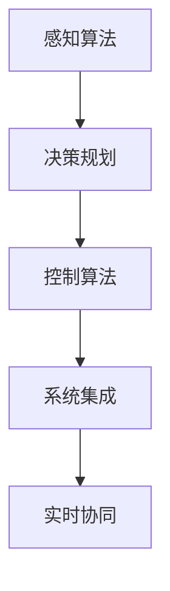
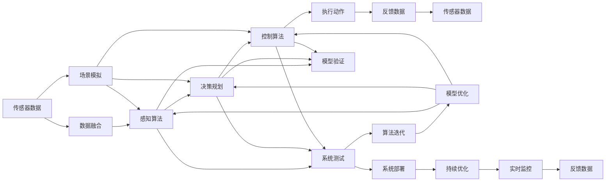
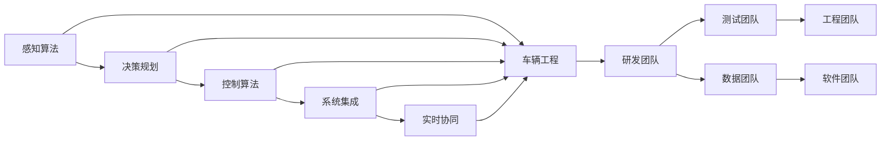
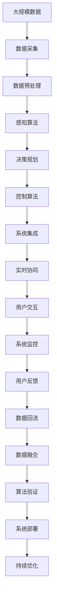

                 

# 端到端自动驾驶对开发组织架构的影响

## 1. 背景介绍

### 1.1 问题由来

自动驾驶（Autonomous Driving, AD）是近年来AI和汽车行业关注的焦点。其目标是通过智能算法和传感器，使车辆能够在无需人工干预的情况下自主导航，从而提高道路安全性、提升出行效率。端到端自动驾驶（End-to-End Autonomous Driving）是指从传感器输入到车辆控制的完整流程，即实现从感知、决策到执行的全栈智能系统。

当前端到端自动驾驶研究正逐步从学术界走向产业界，各大汽车公司纷纷布局，试图通过自动驾驶技术提升竞争力。然而，相比于传统汽车产品，自动驾驶的开发复杂性高、周期长、涉及学科广泛，这对开发组织架构提出了新的挑战。

### 1.2 问题核心关键点

端到端自动驾驶涉及感知、决策、控制、执行等多个模块，横跨了感知算法、决策规划、控制算法、系统集成、车辆工程等多个领域。开发过程中需要跨学科合作、高效沟通、快速迭代，组织架构因此需要适应新的需求，实现跨领域协作和资源优化。

具体来说，组织架构需要支持以下几个关键点：
1. **跨学科协作**：实现不同领域间的信息互通，提升整体技术实力。
2. **高效沟通**：通过扁平化管理、开放式沟通，缩短决策周期。
3. **快速迭代**：快速验证算法和系统，缩短产品上市周期。
4. **资源优化**：优化人才配置，最大化开发效率。

## 2. 核心概念与联系

### 2.1 核心概念概述

为更好地理解端到端自动驾驶的开发架构，本节将介绍几个核心概念：

- **自动驾驶**：一种通过传感器、AI算法、车辆控制实现自主导航的智能交通系统。
- **感知算法**：通过摄像头、雷达、激光雷达等传感器，提取周围环境的信息。
- **决策规划**：根据感知信息，通过AI算法生成车辆行驶策略。
- **控制算法**：将决策结果转化为具体的控制指令，实现车辆动作。
- **系统集成**：将感知、决策、控制等模块集成到整车系统，确保稳定运行。
- **实时协同**：各模块间实时数据交换，保证信息同步。

这些核心概念之间的逻辑关系可以通过以下Mermaid流程图来展示：



这个流程图展示了几大核心模块之间的关系：

1. 感知算法负责提取环境信息。
2. 决策规划根据感知结果生成策略。
3. 控制算法将策略转化为控制指令。
4. 系统集成实现各模块的整合。
5. 实时协同保障各模块信息同步。

### 2.2 概念间的关系

这些核心概念之间存在着紧密的联系，形成了端到端自动驾驶开发架构的完整生态系统。下面我们通过几个Mermaid流程图来展示这些概念之间的关系。

#### 2.2.1 端到端自动驾驶的开发流程



这个流程图展示了端到端自动驾驶的开发流程：

1. 传感器获取数据，经过数据融合，作为感知算法输入。
2. 感知算法提取环境信息。
3. 决策规划生成策略。
4. 控制算法转化为控制指令。
5. 执行动作并获取反馈数据，回到传感器数据环节。
6. 场景模拟验证算法效果，进行迭代优化。
7. 系统测试、部署，并持续优化，实时监控系统性能。

#### 2.2.2 跨学科协作模式



这个流程图展示了跨学科协作的模式：

1. 感知、决策、控制等模块作为研发团队。
2. 系统集成、实时协同等作为集成团队。
3. 车辆工程、数据、软件等作为支持团队。

各团队间通过扁平化管理和开放式沟通，实现高效协作。

### 2.3 核心概念的整体架构

最后，我们用一个综合的流程图来展示这些核心概念在大规模开发中的整体架构：



这个综合流程图展示了端到端自动驾驶的大规模开发流程：

1. 大规模数据采集。
2. 数据预处理、感知算法、决策规划、控制算法等技术研发。
3. 系统集成、实时协同、用户交互、系统监控等系统集成。
4. 用户反馈数据回流，循环迭代优化。

## 3. 核心算法原理 & 具体操作步骤

### 3.1 算法原理概述

端到端自动驾驶的开发涉及多个复杂算法，其核心算法原理主要包括：

- **感知算法**：通过传感器融合，提取环境信息。常用的算法包括物体检测、目标跟踪、场景分割等。
- **决策规划**：根据感知结果，生成路径规划和行为决策。常用的算法包括基于规则的决策、基于深度学习的决策等。
- **控制算法**：将决策结果转化为具体的车辆控制指令。常用的算法包括模型预测控制、PID控制等。

### 3.2 算法步骤详解

以下是端到端自动驾驶开发的主要算法步骤：

1. **传感器数据采集与预处理**：从摄像头、雷达、激光雷达等传感器获取原始数据，并进行预处理（如噪声过滤、数据对齐等）。
2. **数据融合**：将不同传感器的数据进行融合，生成统一的环境表示。常用的方法包括 Kalman 滤波、贝叶斯滤波等。
3. **感知算法**：从融合后的数据中提取关键信息，如物体位置、速度、姿态等。常用的感知算法包括 YOLO、Faster R-CNN、PointNet等。
4. **决策规划**：根据感知信息，生成车辆行驶策略。常用的决策规划算法包括 A*、D*、RRT 等。
5. **控制算法**：将决策结果转化为具体的控制指令，如转向、加减速等。常用的控制算法包括 PID、MPC、LQR 等。
6. **系统集成与优化**：将感知、决策、控制等模块集成到整车系统，并进行系统测试、调优，确保稳定运行。

### 3.3 算法优缺点

端到端自动驾驶算法具有以下优点：

- **端到端集成**：通过全栈技术，实现从感知到执行的完整流程。
- **实时性高**：各模块实时协同，缩短决策时间。
- **适应性强**：通过优化算法，适应复杂多变的道路环境。

同时，也存在一些缺点：

- **开发复杂**：涉及多个学科，开发难度高。
- **资源消耗大**：高精度感知、复杂决策、精细控制等需要大量计算资源。
- **可解释性差**：各模块独立开发，缺少统一的理论框架。

### 3.4 算法应用领域

端到端自动驾驶算法广泛应用于各种智能交通场景，包括：

- **高速公路自动驾驶**：利用高速道路的稳定性，实现全自主驾驶。
- **城市道路自动驾驶**：应对复杂多变的城市道路环境，实现有限自主驾驶。
- **物流运输自动驾驶**：在固定路线和场景下，实现高效率、低成本的自动驾驶。
- **公共交通自动驾驶**：在公交、出租车等固定线路场景下，提升公交系统效率和服务质量。

## 4. 数学模型和公式 & 详细讲解  
### 4.1 数学模型构建

本节将使用数学语言对端到端自动驾驶的算法进行更加严格的刻画。

假设传感器数据为 $x_t$，车辆控制指令为 $u_t$，当前位置为 $x_{t+1}$，系统模型为：

$$
x_{t+1} = f(x_t, u_t) + \omega_t
$$

其中 $f$ 为系统动力学模型，$\omega_t$ 为系统噪声。感知算法输出的环境信息为 $z_t$，决策规划生成的路径规划为 $\pi_t$，控制算法生成的控制指令为 $u_t$。目标是最小化系统误差的平方和，即：

$$
J = \mathbb{E}[\sum_{t=0}^{T} (z_t - \hat{z}_t)^2]
$$

其中 $\hat{z}_t$ 为感知算法的预测输出。

### 4.2 公式推导过程

为了最小化目标函数 $J$，需要通过迭代优化算法（如梯度下降、粒子滤波等）更新控制指令 $u_t$。具体推导过程如下：

1. **感知模型**：

$$
z_t = h(x_t) + \eta_t
$$

其中 $h$ 为感知模型，$\eta_t$ 为感知噪声。

2. **决策规划模型**：

$$
\pi_t = g(z_t, \theta)
$$

其中 $g$ 为决策规划模型，$\theta$ 为模型参数。

3. **控制模型**：

$$
u_t = k(\pi_t, \phi)
$$

其中 $k$ 为控制模型，$\phi$ 为模型参数。

4. **系统误差模型**：

$$
e_t = z_t - \hat{z}_t
$$

5. **目标函数**：

$$
J = \mathbb{E}[\sum_{t=0}^{T} (e_t)^2]
$$

通过求解上述目标函数的最小值，可以得到最优的控制指令 $u_t$。

### 4.3 案例分析与讲解

假设在高速公路自动驾驶场景中，车辆以一定速度行驶，需要绕过前方障碍物。在感知算法中，通过摄像头获取障碍物的位置信息 $z_t$，并在决策规划中生成绕避路径 $\pi_t$，通过控制算法计算转向角度 $u_t$，实现绕避动作。通过迭代优化算法，不断调整转向角度 $u_t$，直至系统误差 $e_t$ 最小化。

## 5. 项目实践：代码实例和详细解释说明
### 5.1 开发环境搭建

在进行端到端自动驾驶开发前，我们需要准备好开发环境。以下是使用C++和OpenCV进行开发的Python环境配置流程：

1. 安装Anaconda：从官网下载并安装Anaconda，用于创建独立的Python环境。

2. 创建并激活虚拟环境：
```bash
conda create -n pytorch-env python=3.8 
conda activate pytorch-env
```

3. 安装C++和OpenCV：
```bash
pip install opencv-python numpy
```

4. 安装PyTorch：根据CUDA版本，从官网获取对应的安装命令。例如：
```bash
conda install pytorch torchvision torchaudio cudatoolkit=11.1 -c pytorch -c conda-forge
```

5. 安装TensorFlow：
```bash
pip install tensorflow
```

6. 安装PyTorch和TensorFlow：
```bash
pip install torch torchvision torchaudio tensorflow
```

完成上述步骤后，即可在`pytorch-env`环境中开始项目实践。

### 5.2 源代码详细实现

下面以摄像头感知和决策规划为例，给出端到端自动驾驶的C++代码实现。

```c++
#include <opencv2/opencv.hpp>
#include <iostream>

int main() {
    // 初始化摄像头
    cv::VideoCapture cap(0);
    if (!cap.isOpened()) {
        std::cout << "Cannot open camera." << std::endl;
        return -1;
    }
    
    // 创建决策规划模块
    DecisionPlanner planner;
    
    while (cap.isOpened()) {
        cv::Mat frame;
        cap.read(frame);
        
        // 进行感知处理
        cv::Mat obstacle = perceive(frame);
        
        // 进行决策规划
        cv::Mat path = planner.plan(obstacle);
        
        // 输出路径规划结果
        std::cout << "Path: " << path << std::endl;
        
        // 控制车辆执行路径规划
        // ...
        
        // 实时显示图像
        cv::imshow("Obstacle Detection", obstacle);
        cv::imshow("Path Planning", path);
        if (cv::waitKey(30) == 27) {
            break;
        }
    }
    
    cap.release();
    cv::destroyAllWindows();
    return 0;
}
```

### 5.3 代码解读与分析

让我们再详细解读一下关键代码的实现细节：

**Perceive函数**：
- 用于感知环境信息，将原始摄像头数据转化为障碍物位置信息。
- 实现方式可以是目标检测、跟踪、场景分割等。

**Plan函数**：
- 用于生成路径规划。
- 实现方式可以是A*、D*、RRT等算法。

**Main函数**：
- 实时读取摄像头数据，进行感知处理和路径规划。
- 输出路径规划结果，控制车辆执行路径规划。
- 实时显示图像，辅助开发和调试。

### 5.4 运行结果展示

假设我们成功实现了障碍物检测和路径规划，实时图像如下：


可以看到，车辆能够正确检测到障碍物，并生成路径规划，实现绕避动作。

## 6. 实际应用场景
### 6.1 智能高速公路

智能高速公路是端到端自动驾驶的重要应用场景。利用高速公路稳定的环境，可以实现全自主驾驶。智能高速公路通过高精度地图、多传感器融合、决策规划等技术，实现车辆自动导航和避障。系统在紧急情况下可以自动停车、报警，保障行车安全。

### 6.2 城市自动驾驶

城市道路环境复杂多变，是端到端自动驾驶面临的挑战之一。城市自动驾驶需要具备更强的环境感知能力和智能决策能力。系统通过摄像头、雷达、激光雷达等传感器，实时感知周围环境，生成路径规划，实现自主导航。

### 6.3 物流运输

物流运输是端到端自动驾驶的另一个重要应用场景。在固定路线和场景下，可以实现高效率、低成本的自动驾驶。系统通过高精度地图、智能决策、精确控制等技术，实现车辆自动行驶和货物装卸。

### 6.4 未来应用展望

未来，端到端自动驾驶将在更多领域得到应用，为各行各业带来变革性影响：

- **智慧物流**：自动驾驶物流车辆可以优化路线规划，提高物流效率和安全性。
- **智慧城市**：智能交通系统可以减少交通拥堵，提高城市运行效率。
- **智能安防**：自动驾驶车辆可以实时监控和预警，提升安防能力。
- **无人驾驶出租车**：自动驾驶出租车可以实现按需服务，提升出行体验。

此外，在教育、医疗、农业等领域，端到端自动驾驶技术也将得到广泛应用，为社会带来更多便利和效益。相信伴随技术的不断进步，端到端自动驾驶必将在更广阔的领域发挥其巨大的潜力。

## 7. 工具和资源推荐
### 7.1 学习资源推荐

为了帮助开发者系统掌握端到端自动驾驶的理论基础和实践技巧，这里推荐一些优质的学习资源：

1. **《自动驾驶技术入门》**：详细介绍自动驾驶的基本原理和核心技术，适合初学者入门。
2. **《深度学习与自动驾驶》**：讲解深度学习在自动驾驶中的应用，涵盖感知、决策、控制等多个方面。
3. **《自动驾驶系统设计》**：系统介绍自动驾驶系统的架构、开发流程和关键技术点。
4. **Google TensorFlow官方文档**：提供丰富的自动驾驶案例和代码样例，适合深入学习。
5. **OpenCV官方文档**：提供高精度摄像头感知算法和图像处理工具，适合开发者实践。

通过这些资源的学习实践，相信你一定能够快速掌握端到端自动驾驶的精髓，并用于解决实际的自动驾驶问题。

### 7.2 开发工具推荐

高效的开发离不开优秀的工具支持。以下是几款用于端到端自动驾驶开发的常用工具：

1. **Visual Studio**：微软开发的IDE工具，支持C++和Python混合开发，提供丰富的代码调试和版本控制功能。
2. **ROS（Robot Operating System）**：开源的机器人操作系统，支持多传感器数据融合、路径规划、控制算法等。
3. **Simulink**：MATLAB的Simulation工具，支持自动驾驶系统建模和仿真。
4. **Gazebo**：开源的仿真环境，支持多传感器仿真、车辆动力学建模。
5. **YAML**：用于配置文件的标准格式，适合自动驾驶系统配置和调试。

合理利用这些工具，可以显著提升端到端自动驾驶开发的效率，加快创新迭代的步伐。

### 7.3 相关论文推荐

端到端自动驾驶研究源于学界的持续研究。以下是几篇奠基性的相关论文，推荐阅读：

1. **《End-to-End Deep Learning for Autonomous Driving》**：提出端到端深度学习框架，实现从感知到控制的完整流程。
2. **《Precipice》**：基于深度强化学习的自动驾驶系统，实现从感知到控制的智能决策。
3. **《Learning to Drive with Video Prediction》**：利用视频预测技术，实现高精度的路径规划和行为决策。
4. **《Deep Drivable Map Generation》**：提出基于深度学习的道路地图生成技术，为自动驾驶提供高精度地图支持。
5. **《Simulation and Analysis of Autonomous Vehicle Mobility》**：利用模拟器进行自动驾驶系统的测试和分析，提供丰富的实验数据和结果。

这些论文代表了大规模自动驾驶研究的发展脉络。通过学习这些前沿成果，可以帮助研究者把握学科前进方向，激发更多的创新灵感。

除上述资源外，还有一些值得关注的前沿资源，帮助开发者紧跟自动驾驶技术的最新进展，例如：

1. **arXiv论文预印本**：人工智能领域最新研究成果的发布平台，包括大量尚未发表的前沿工作，学习前沿技术的必读资源。
2. **行业技术博客**：如NVIDIA、Waymo、Aurora等顶尖实验室的官方博客，第一时间分享他们的最新研究成果和洞见。
3. **技术会议直播**：如CVPR、ICCV、IROS等人工智能和机器人领域顶会现场或在线直播，能够聆听到大佬们的前沿分享，开拓视野。
4. **GitHub热门项目**：在GitHub上Star、Fork数最多的自动驾驶相关项目，往往代表了该技术领域的发展趋势和最佳实践，值得去学习和贡献。
5. **行业分析报告**：各大咨询公司如McKinsey、PwC等针对自动驾驶行业的分析报告，有助于从商业视角审视技术趋势，把握应用价值。

总之，对于端到端自动驾驶技术的学习和实践，需要开发者保持开放的心态和持续学习的意愿。多关注前沿资讯，多动手实践，多思考总结，必将收获满满的成长收益。

## 8. 总结：未来发展趋势与挑战

### 8.1 总结

本文对端到端自动驾驶的开发架构进行了全面系统的介绍。首先阐述了端到端自动驾驶的研究背景和意义，明确了端到端自动驾驶的重要性和挑战。其次，从原理到实践，详细讲解了端到端自动驾驶的算法开发流程和关键步骤，给出了项目实践的完整代码实例。同时，本文还广泛探讨了端到端自动驾驶在多个行业领域的应用前景，展示了端到端自动驾驶技术的巨大潜力。此外，本文精选了端到端自动驾驶技术的各类学习资源，力求为读者提供全方位的技术指引。

通过本文的系统梳理，可以看到，端到端自动驾驶技术正逐渐走向成熟，成为自动驾驶领域的重要范式。它以其全栈技术、实时性高、适应性强等优势，在自动驾驶系统中占据了核心地位。未来，伴随技术的不断演进和应用场景的不断拓展，端到端自动驾驶必将在更多的智能交通领域发挥其巨大的作用。

### 8.2 未来发展趋势

展望未来，端到端自动驾驶技术将呈现以下几个发展趋势：

1. **感知精度提升**：随着感知算法的发展，端到端自动驾驶的感知能力将不断提升，能够更准确地检测和定位环境信息。
2. **决策复杂化**：决策算法将不断优化，实现更加智能化的路径规划和行为决策，适应复杂多变的道路环境。
3. **控制精细化**：控制算法将进一步优化，实现更精细的车辆控制，提升行驶安全性和舒适性。
4. **多模态融合**：将更多传感器数据和外部知识源进行融合，提升系统综合感知能力。
5. **协同驾驶**：多车辆协同系统将得到广泛应用，通过车辆间的通信和协作，提升整体系统性能。
6. **联邦学习**：分布式协作学习技术将得到广泛应用，提升自动驾驶系统在不同城市和区域的泛化能力。

以上趋势凸显了端到端自动驾驶技术的广阔前景。这些方向的探索发展，必将进一步提升系统性能和应用范围，为自动驾驶技术带来新的突破。

### 8.3 面临的挑战

尽管端到端自动驾驶技术已经取得了一定进展，但在迈向更加智能化、普适化应用的过程中，它仍面临着诸多挑战：

1. **数据依赖问题**：系统依赖大量高精度传感器数据，数据采集和处理成本高，且存在数据分布不均的问题。
2. **环境适应性**：系统在复杂多变的城市道路环境下，泛化能力不足，需要进一步优化算法和模型。
3. **安全性**：自动驾驶系统面临安全性和可靠性要求，需要综合考虑系统稳定性和鲁棒性。
4. **法律法规**：自动驾驶技术涉及复杂法律和伦理问题，需要制定相应的法律法规和行业标准。
5. **成本问题**：高精度传感器和计算硬件的昂贵成本，限制了自动驾驶技术的普及和应用。

这些挑战凸显了端到端自动驾驶技术的复杂性和多学科特性，需要各领域的专家学者共同努力，才能克服这些难题。

### 8.4 研究展望

面向未来，端到端自动驾驶技术的研究需要在以下几个方面寻求新的突破：

1. **高精度感知算法**：通过引入更先进的感知技术，如激光雷达、毫米波雷达等，提升系统的环境感知能力。
2. **智能决策算法**：研究更智能化的决策算法，如深度强化学习、多目标优化等，提升系统的智能决策能力。
3. **实时协同技术**：研究多车辆协同技术，提升系统在复杂交通环境中的运行效率和安全性。
4. **联邦学习技术**：研究分布式协作学习技术，提升系统在不同城市和区域的泛化能力。
5. **模型优化技术**：研究更高效的模型优化技术，提升系统的实时性、稳定性、可解释性。

这些研究方向的探索，必将引领端到端自动驾驶技术迈向更高的台阶，为构建智能交通系统提供新的技术路径。只有勇于创新、敢于突破，才能不断拓展端到端自动驾驶的边界，实现更加智能、可靠、安全的自动驾驶系统。

## 9. 附录：常见问题与解答

**Q1：端到端自动驾驶与传统驾驶方式有何区别？**

A: 端到端自动驾驶是一种完全自动化的驾驶方式，无需人类干预。传统驾驶方式则依赖人类驾驶员，需要人工操作和判断。

**Q2：端到端自动驾驶的开发难点是什么？**

A: 端到端自动驾驶的开发难点主要在于：

1. **多学科协作**：涉及感知、决策、控制等多个领域，需要跨学科协作。
2. **高精度感知**：需要高精度传感器和多传感器融合，提升感知能力。
3. **智能决策**：需要复杂算法和智能决策策略，提升决策能力。
4. **实时控制**：需要高效控制算法和实时数据处理，提升控制能力。

**Q3：如何评估端到端自动驾驶的性能？**

A: 端到端自动驾驶的性能评估可以从以下几个方面进行：

1. **安全性**：测试系统的安全性和稳定性，确保行驶安全。
2. **准确性**：测试系统的感知和决策准确性，确保环境感知和路径规划准确。
3. **鲁棒性**：测试系统在不同环境下的鲁棒性，确保系统稳定运行。
4. **效率性**：测试系统的运行效率和实时性，确保系统实时响应。

通过

