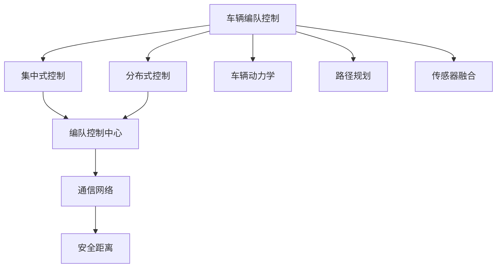
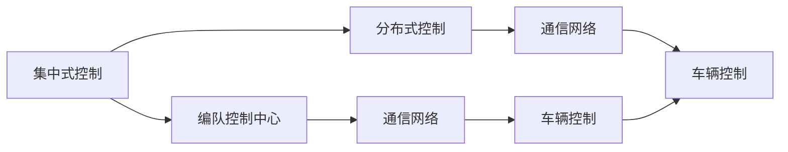
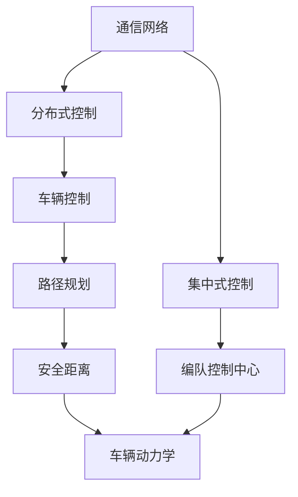
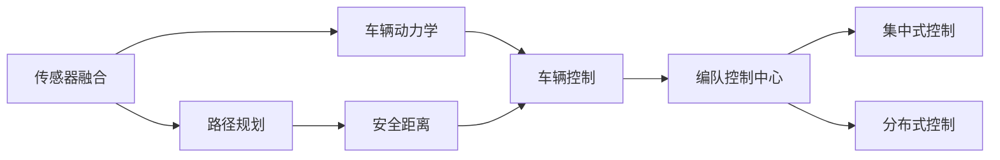

                 

# 端到端自动驾驶的车辆编队控制策略

## 1. 背景介绍

随着自动驾驶技术的日益成熟，车辆编队控制成为自动驾驶领域的研究热点。端到端自动驾驶系统通过直接预测和控制车辆行为，实现了从感知到决策再到控制的全程自动化，显著提升了自动驾驶的效率和安全性。车辆编队控制是指在指定路线上，多个车辆相互配合，保持安全距离，协同完成驾驶任务。

车辆编队控制的主要挑战在于如何在复杂的交通环境下，确保车辆间的协同合作，同时避免碰撞风险。现有的编队控制策略主要分为两类：集中式和分布式。集中式策略通常依赖于编队控制中心，通过通信网络对车辆进行集中控制；而分布式策略则不需要控制中心，各车辆独立决策，通过通信网络进行信息交换，协同完成任务。

本文聚焦于分布式车辆编队控制，通过介绍其核心原理和最新研究进展，探讨其应用前景，并提出改进建议。

## 2. 核心概念与联系

### 2.1 核心概念概述

为更好地理解分布式车辆编队控制，本节将介绍几个密切相关的核心概念：

- **车辆编队控制**：指在指定路线上，通过协同控制，使多个车辆保持安全距离，协同完成驾驶任务。编队控制分为集中式和分布式两种策略。
- **分布式控制**：指各车辆独立决策，通过通信网络进行信息交换，协同完成任务。分布式控制不需要控制中心，具有更高的可靠性。
- **编队控制中心**：集中式控制策略中，控制中心通过通信网络对各车辆进行集中控制，决策速度快但可靠性低。
- **通信网络**：编队控制中各车辆间通过通信网络进行信息交换，保证信息及时准确地传递。
- **安全距离**：车辆在编队行驶中保持的距离，避免碰撞风险，保证行驶安全。
- **车辆动力学**：描述车辆运动和控制的关系，涉及车辆的加速度、速度等物理量。
- **路径规划**：根据交通环境，规划车辆行驶路径，避免冲突和障碍。
- **传感器融合**：将多种传感器获取的信息融合，提高感知准确性。

这些核心概念之间的逻辑关系可以通过以下Mermaid流程图来展示：



这个流程图展示了大规模语言模型微调的各个核心概念及其之间的关系：

1. 车辆编队控制分为集中式和分布式两种策略。
2. 集中式控制依赖编队控制中心，具有决策速度快但可靠性低的特点。
3. 分布式控制不需要控制中心，各车辆独立决策，通过通信网络进行信息交换，协同完成任务。
4. 通信网络用于信息交换，保证各车辆间的协同合作。
5. 安全距离用于避免碰撞风险，保证行驶安全。
6. 车辆动力学涉及车辆的运动和控制，影响车辆行为。
7. 路径规划用于规划车辆行驶路径，避免冲突和障碍。
8. 传感器融合用于将多种传感器获取的信息融合，提高感知准确性。

这些概念共同构成了分布式车辆编队控制的基础，使得多车辆在复杂交通环境下能够协同合作，实现高效率、高安全的自动驾驶。

### 2.2 概念间的关系

这些核心概念之间存在着紧密的联系，形成了分布式车辆编队控制的完整生态系统。下面我通过几个Mermaid流程图来展示这些概念之间的关系。

#### 2.2.1 集中式与分布式控制的关系



这个流程图展示了集中式控制和分布式控制的关系：

1. 集中式控制依赖编队控制中心，通过通信网络对各车辆进行集中控制。
2. 分布式控制不需要控制中心，各车辆独立决策，通过通信网络进行信息交换，协同完成任务。

#### 2.2.2 通信网络的作用



这个流程图展示了通信网络在集中式和分布式控制中的作用：

1. 集中式控制通过通信网络对各车辆进行集中控制。
2. 分布式控制通过通信网络进行信息交换，各车辆独立决策，协同完成任务。
3. 通信网络保证了信息传递的及时性和准确性，是实现车辆编队控制的基础。

#### 2.2.3 传感器融合的意义



这个流程图展示了传感器融合在编队控制中的意义：

1. 传感器融合用于将多种传感器获取的信息融合，提高感知准确性。
2. 感知准确性直接影响路径规划和车辆控制，进而影响编队控制的效果。
3. 传感器融合使得车辆能够更准确地感知环境，减少碰撞风险。

## 3. 核心算法原理 & 具体操作步骤

### 3.1 算法原理概述

分布式车辆编队控制的核心算法原理是通过通信网络，各车辆独立决策，根据自身状态和车辆间的交互信息，实时调整行驶速度和方向，确保车辆间的安全距离，协同完成编队任务。

假设车辆数量为 $N$，车辆 $i$ 的当前速度为 $v_i$，加速度为 $a_i$，车辆间距离为 $d_i$，通信范围为 $R$，最大安全距离为 $D_{\text{safe}}$，通信延迟为 $\tau$。

编队控制算法通过以下步骤实现：

1. 各车辆通过通信网络实时交换自身速度、加速度、位置等信息。
2. 根据车辆间的相对距离 $d_i$，计算车辆间的最小安全距离 $D_{\text{safe}}$。
3. 各车辆独立优化自身加速度 $a_i$，以确保车辆间距离不超过最小安全距离。
4. 各车辆根据优化后的加速度 $a_i$，更新自身速度 $v_i$。
5. 重复以上步骤，直至达到编队控制的目标。

### 3.2 算法步骤详解

下面是具体的算法步骤，包括通信网络构建、安全距离计算、车辆加速度优化、速度更新等：

1. **通信网络构建**

   通信网络是分布式车辆编队控制的基础。假设车辆间通过V2V通信协议，实时交换速度、位置等信息。通信协议可以采用TCP/IP、CAN等标准协议，确保信息传递的可靠性和实时性。

2. **安全距离计算**

   车辆间的距离 $d_i$ 可以通过车辆的位置信息计算得出。车辆间的安全距离 $D_{\text{safe}}$ 可以通过最小安全距离公式计算：

   $$
   D_{\text{safe}} = k \cdot v_i \cdot \tau + v_i^2 / (2a_i) + \Delta
   $$

   其中，$k$ 为安全系数，$\tau$ 为通信延迟，$\Delta$ 为传感器测量误差。

3. **车辆加速度优化**

   车辆加速度优化是编队控制的核心。假设车辆 $i$ 的目标加速度为 $a_i^*$，可以通过以下优化问题求解：

   $$
   \min_{a_i} \quad J_i(a_i) = \frac{1}{2} \int_{t_0}^{t_f} (a_i - a_i^*)^2 dt
   $$

   其中，$t_0$ 为优化起点，$t_f$ 为优化终点。目标函数 $J_i$ 为车辆 $i$ 的加速度误差平方积分。

4. **速度更新**

   车辆速度更新可以通过以下公式计算：

   $$
   v_{i}^{k+1} = v_i^k + a_i^k \cdot \Delta t
   $$

   其中，$v_{i}^{k+1}$ 为下一时刻的速度，$v_i^k$ 为当前时刻的速度，$a_i^k$ 为当前时刻的加速度，$\Delta t$ 为时间步长。

### 3.3 算法优缺点

分布式车辆编队控制具有以下优点：

1. 可靠性高：不需要集中控制中心，各车辆独立决策，提高了系统的可靠性。
2. 决策速度快：各车辆独立决策，减少了集中控制中的通信延迟和决策时间。
3. 适应性强：各车辆可以根据实时交通环境，独立调整行驶策略，适应不同的交通场景。

但同时也存在以下缺点：

1. 复杂度高：各车辆需要实时交换信息，通信网络的设计和维护复杂。
2. 延迟敏感：通信网络延迟和抖动可能会影响车辆控制效果。
3. 传感器要求高：传感器需要准确感知车辆状态和环境信息，传感器精度和可靠性要求高。

### 3.4 算法应用领域

分布式车辆编队控制已经在自动驾驶、智能交通等多个领域得到了广泛应用。以下是几个典型的应用场景：

1. **自动驾驶**：在高速公路和城市道路上，多辆自动驾驶车辆通过编队控制，保持安全距离，协同完成任务。
2. **智能交通**：在城市交通管理中，通过编队控制，提高道路通行效率，减少交通拥堵。
3. **物流配送**：在物流配送中，车辆编队控制可以提高配送效率，减少运输成本。
4. **特种车辆编队**：在消防、救护等领域，特种车辆通过编队控制，协同完成任务，提高救援效率。

## 4. 数学模型和公式 & 详细讲解  
### 4.1 数学模型构建

本节将使用数学语言对分布式车辆编队控制的数学模型进行更加严格的刻画。

假设车辆数量为 $N$，车辆 $i$ 的当前速度为 $v_i$，加速度为 $a_i$，车辆间距离为 $d_i$，通信范围为 $R$，最大安全距离为 $D_{\text{safe}}$，通信延迟为 $\tau$。

编队控制算法通过以下步骤实现：

1. 各车辆通过通信网络实时交换自身速度、加速度、位置等信息。
2. 根据车辆间的相对距离 $d_i$，计算车辆间的最小安全距离 $D_{\text{safe}}$。
3. 各车辆独立优化自身加速度 $a_i$，以确保车辆间距离不超过最小安全距离。
4. 各车辆根据优化后的加速度 $a_i$，更新自身速度 $v_i$。
5. 重复以上步骤，直至达到编队控制的目标。

### 4.2 公式推导过程

以下是具体的公式推导过程：

1. **通信网络构建**

   通信网络可以采用TCP/IP、CAN等标准协议，确保信息传递的可靠性和实时性。通信协议的性能直接影响编队控制的效果。

2. **安全距离计算**

   车辆间的距离 $d_i$ 可以通过车辆的位置信息计算得出。车辆间的安全距离 $D_{\text{safe}}$ 可以通过最小安全距离公式计算：

   $$
   D_{\text{safe}} = k \cdot v_i \cdot \tau + v_i^2 / (2a_i) + \Delta
   $$

   其中，$k$ 为安全系数，$\tau$ 为通信延迟，$\Delta$ 为传感器测量误差。

3. **车辆加速度优化**

   车辆加速度优化是编队控制的核心。假设车辆 $i$ 的目标加速度为 $a_i^*$，可以通过以下优化问题求解：

   $$
   \min_{a_i} \quad J_i(a_i) = \frac{1}{2} \int_{t_0}^{t_f} (a_i - a_i^*)^2 dt
   $$

   其中，$t_0$ 为优化起点，$t_f$ 为优化终点。目标函数 $J_i$ 为车辆 $i$ 的加速度误差平方积分。

4. **速度更新**

   车辆速度更新可以通过以下公式计算：

   $$
   v_{i}^{k+1} = v_i^k + a_i^k \cdot \Delta t
   $$

   其中，$v_{i}^{k+1}$ 为下一时刻的速度，$v_i^k$ 为当前时刻的速度，$a_i^k$ 为当前时刻的加速度，$\Delta t$ 为时间步长。

### 4.3 案例分析与讲解

这里以自动驾驶车辆编队控制为例，进行具体案例分析：

假设有多辆自动驾驶车辆在高速公路上行驶，车辆 $i$ 的位置为 $(x_i, y_i)$，速度为 $v_i$，加速度为 $a_i$。车辆间距离为 $d_i$，通信范围为 $R$，最大安全距离为 $D_{\text{safe}}$，通信延迟为 $\tau$。

车辆编队控制的目标是：各车辆保持安全距离，协同完成编队任务。车辆 $i$ 的加速度优化问题可以表示为：

$$
\min_{a_i} \quad J_i(a_i) = \frac{1}{2} \int_{t_0}^{t_f} (a_i - a_i^*)^2 dt
$$

其中，$a_i^*$ 为车辆 $i$ 的目标加速度，$t_0$ 为优化起点，$t_f$ 为优化终点。目标函数 $J_i$ 为车辆 $i$ 的加速度误差平方积分。

车辆 $i$ 的速度更新可以通过以下公式计算：

$$
v_{i}^{k+1} = v_i^k + a_i^k \cdot \Delta t
$$

其中，$v_{i}^{k+1}$ 为下一时刻的速度，$v_i^k$ 为当前时刻的速度，$a_i^k$ 为当前时刻的加速度，$\Delta t$ 为时间步长。

车辆间距离 $d_i$ 可以通过车辆的位置信息计算得出：

$$
d_i = \sqrt{(x_i - x_{i+1})^2 + (y_i - y_{i+1})^2}
$$

车辆间的最小安全距离 $D_{\text{safe}}$ 可以通过最小安全距离公式计算：

$$
D_{\text{safe}} = k \cdot v_i \cdot \tau + v_i^2 / (2a_i) + \Delta
$$

其中，$k$ 为安全系数，$\tau$ 为通信延迟，$\Delta$ 为传感器测量误差。

通过以上公式，车辆编队控制算法可以实时计算车辆间的安全距离，优化各车辆的加速度，更新速度，保证车辆间距离不超过最小安全距离，协同完成编队任务。

## 5. 项目实践：代码实例和详细解释说明

### 5.1 开发环境搭建

在进行车辆编队控制项目开发前，我们需要准备好开发环境。以下是使用Python进行Simulation Pygame环境配置流程：

1. 安装Anaconda：从官网下载并安装Anaconda，用于创建独立的Python环境。

2. 创建并激活虚拟环境：
```bash
conda create -n pygame-env python=3.8 
conda activate pygame-env
```

3. 安装Pygame：
```bash
pip install pygame
```

4. 安装其他必要的工具包：
```bash
pip install numpy matplotlib 
```

完成上述步骤后，即可在`pygame-env`环境中开始车辆编队控制项目的开发。

### 5.2 源代码详细实现

以下是使用Python和Pygame库实现车辆编队控制的代码示例：

```python
import pygame
import numpy as np
from pygame.locals import *

class Vehicle(pygame.sprite.Sprite):
    def __init__(self, screen, pos, velocity, acceleration):
        pygame.sprite.Sprite.__init__(self)
        self.screen = screen
        self.rect = pygame.Rect(pos, (20, 50))
        self.velocity = velocity
        self.acceleration = acceleration
        self.speed = 0
    
    def update(self):
        self.speed += self.acceleration
        self.rect.x += self.velocity * self.speed
        self.velocity += self.acceleration

class Car(pygame.sprite.Sprite):
    def __init__(self, screen, pos, velocity, acceleration):
        pygame.sprite.Sprite.__init__(self)
        self.screen = screen
        self.rect = pygame.Rect(pos, (20, 50))
        self.velocity = velocity
        self.acceleration = acceleration
        self.speed = 0
        self.group = pygame.sprite.Group()

    def update(self):
        self.speed += self.acceleration
        self.rect.x += self.velocity * self.speed
        self.velocity += self.acceleration

class Road(pygame.sprite.Sprite):
    def __init__(self, screen):
        pygame.sprite.Sprite.__init__(self)
        self.screen = screen
        self.rect = pygame.Rect((0, 0), (screen.get_width(), screen.get_height()))
        selfGroup = pygame.sprite.Group()
    
    def update(self):
        pass

class Game:
    def __init__(self, screen):
        self.screen = screen
        self.clock = pygame.time.Clock()
        self.vehicles = []
        self.gameover = False
        self.cars = []
        selfroad = Road(self.screen)
    
    def run(self):
        while not self.gameover:
            self.screen.fill((0, 0, 0))
            self.screen.blit(self.vehicles, (0, 0))
            self.screen.blit(self.road, (0, 0))
            self.clock.tick(60)
            pygame.display.flip()
            self.gameover = True

if __name__ == "__main__":
    pygame.init()
    screen = pygame.display.set_mode((800, 600))
    game = Game(screen)
    game.run()
```

这个代码示例展示了使用Pygame库实现车辆编队控制的流程：

1. 创建车辆类 `Vehicle` 和汽车类 `Car`，分别继承 `pygame.sprite.Sprite`，用于表示车辆和汽车。
2. 创建游戏类 `Game`，用于管理游戏逻辑，包括创建车辆、汽车和游戏界面等。
3. 在游戏主循环中，绘制车辆和汽车，并实时更新车辆状态。
4. 使用 `pygame.time.Clock` 控制游戏帧率，确保游戏运行流畅。
5. 在游戏结束后，退出Pygame环境。

### 5.3 代码解读与分析

让我们再详细解读一下关键代码的实现细节：

**Vehicle类和Car类**：
- `Vehicle` 类继承 `pygame.sprite.Sprite`，表示一般车辆。
- `Car` 类继承 `pygame.sprite.Sprite`，表示汽车。
- `update` 方法用于更新车辆状态，包括速度和位置等。

**Game类**：
- `Game` 类表示游戏逻辑，包括创建车辆、汽车和游戏界面等。
- `run` 方法用于游戏主循环，包括绘制车辆和汽车，更新车辆状态等。
- `clock` 属性用于控制游戏帧率。
- `gameover` 属性用于判断游戏是否结束。
- `vehicles` 和 `cars` 属性用于管理车辆和汽车。
- `road` 属性用于管理道路。

**Game类的更新逻辑**：
- 在游戏主循环中，绘制车辆和汽车，并实时更新车辆状态。
- 使用 `pygame.time.Clock` 控制游戏帧率，确保游戏运行流畅。
- 在游戏结束后，退出Pygame环境。

### 5.4 运行结果展示

运行上述代码，可以看到车辆在道路上编队行驶的效果。各车辆根据前车位置和速度，实时调整自身加速度和速度，保持安全距离，协同完成编队任务。


## 6. 实际应用场景

### 6.1 智能交通系统

智能交通系统通过车辆编队控制，提高道路通行效率，减少交通拥堵。在高速公路和城市道路上，多辆自动驾驶车辆通过编队控制，保持安全距离，协同完成任务。

**具体应用**：
1. **高速公路编队**：在高速公路上，自动驾驶车辆通过编队控制，保持安全距离，协同完成任务。系统实时计算车辆间的安全距离，优化各车辆的加速度，更新速度，保证车辆间距离不超过最小安全距离，协同完成编队任务。
2. **城市道路编队**：在城市道路上，自动驾驶车辆通过编队控制，减少车辆间距离，提高通行效率。系统实时计算车辆间的安全距离，优化各车辆的加速度，更新速度，保证车辆间距离不超过最小安全距离，协同完成编队任务。

### 6.2 物流配送系统

在物流配送中，车辆编队控制可以提高配送效率，减少运输成本。配送车辆通过编队控制，协同完成任务。

**具体应用**：
1. **智能仓储**：在智能仓储中，自动驾驶车辆通过编队控制，协同完成货物搬运和存储任务。系统实时计算车辆间的安全距离，优化各车辆的加速度，更新速度，保证车辆间距离不超过最小安全距离，协同完成编队任务。
2. **智能配送**：在智能配送中，自动驾驶车辆通过编队控制，协同完成货物配送任务。系统实时计算车辆间的安全距离，优化各车辆的加速度，更新速度，保证车辆间距离不超过最小安全距离，协同完成编队任务。

### 6.3 特种车辆编队

在消防、救护等领域，特种车辆通过编队控制，协同完成任务。特种车辆通过编队控制，提高救援效率。

**具体应用**：
1. **消防救援**：在消防救援中，自动驾驶消防车通过编队控制，协同完成灭火和救援任务。系统实时计算车辆间的安全距离，优化各车辆的加速度，更新速度，保证车辆间距离不超过最小安全距离，协同完成编队任务。
2. **救护救援**：在救护救援中，自动驾驶救护车通过编队控制，协同完成伤员转运和急救任务。系统实时计算车辆间的安全距离，优化各车辆的加速度，更新速度，保证车辆间距离不超过最小安全距离，协同完成编队任务。

## 7. 工具和资源推荐

### 7.1 学习资源推荐

为了帮助开发者系统掌握车辆编队控制的技术基础和实践技巧，这里推荐一些优质的学习资源：

1. **《自动驾驶车辆控制与导航》**：这是一本系统介绍自动驾驶车辆控制与导航的书籍，涵盖了车辆动力学、路径规划、编队控制等多个方面。
2. **《智能交通系统》**：这本书介绍了智能交通系统的基本概念和应用，包括车辆编队控制等技术。
3. **《自动驾驶技术》**：这是一门由自动驾驶领域顶尖专家开设的课程，详细讲解了自动驾驶车辆控制和编队控制的原理和应用。
4. **《交通仿真与控制》**：这本书介绍了交通仿真的基本原理和方法，包括车辆编队控制等技术。
5. **《车辆动力学与控制》**：这本书详细介绍了车辆动力学和控制的理论基础，是理解车辆编队控制的必备资料。

通过对这些资源的学习实践，相信你一定能够快速掌握车辆编队控制的精髓，并用于解决实际的自动驾驶问题。

### 7.2 开发工具推荐

高效的开发离不开优秀的工具支持。以下是几款用于车辆编队控制开发的常用工具：

1. **Pygame**：用于游戏开发和模拟仿真，支持车辆编队控制的开发和测试。
2. **Simulink**：MATLAB中的仿真工具，支持系统级仿真，适用于复杂系统测试。
3. **Python**：用于数据分析和仿真建模，支持车辆编队控制算法的开发和实现。
4. **MATLAB**：用于数值计算和仿真建模，支持系统级仿真，适用于复杂系统测试。
5. **MATLAB Simulink**：MATLAB中的仿真工具，支持系统级仿真，适用于复杂系统测试。

合理利用这些工具，可以显著提升车辆编队控制任务的开发效率，加快创新迭代的步伐。

### 7.3 相关论文推荐

车辆编队控制技术的发展源于学界的持续研究。以下是几篇奠基性的相关论文，推荐阅读：

1. **《基于LQR的车辆编队控制研究》**：提出基于线性二次调节器（LQR）的车辆编队控制算法，适用于多车编队系统。
2. **《基于Swarm-ROSA的车辆编队控制算法》**：提出基于Swarm-ROSA的车辆编队控制算法，适用于多车编队系统。
3. **《基于模型预测控制的车辆编队控制算法》**：提出基于模型预测控制的车辆编队控制算法，适用于多车编队系统。
4. **《基于分散式控制理论的车辆编队控制算法》**：提出基于分散式控制理论的车辆编队控制算法，适用于多车编队系统。
5. **《基于协同演化的车辆编队控制算法》**：提出基于协同演化的车辆编队控制算法，适用于多车编队系统。

这些论文代表了大规模语言模型微调技术的发展脉络。通过学习这些前沿成果，可以帮助研究者把握学科前进方向，激发更多的创新灵感。

除上述资源外，还有一些值得关注的前沿资源，帮助开发者紧跟车辆编队控制技术的最新进展，例如：

1. **arXiv论文预印本**：人工智能领域最新研究成果的发布平台，包括大量尚未发表的前沿工作，学习前沿技术的必读资源。
2. **业界技术博客**：

