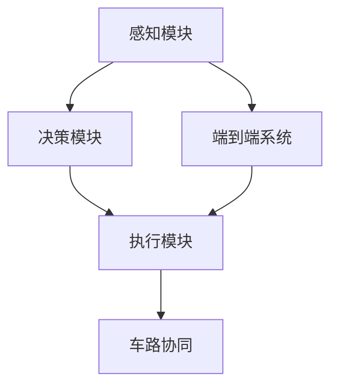
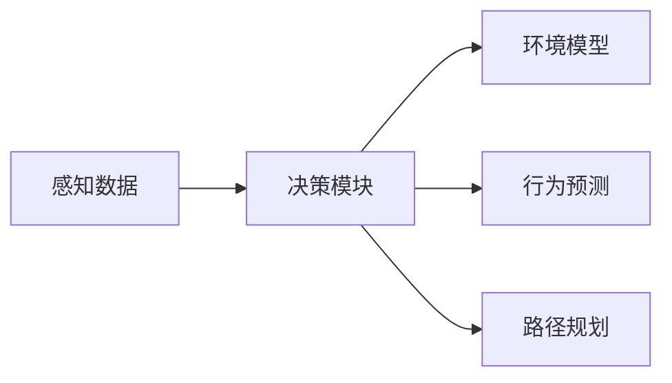
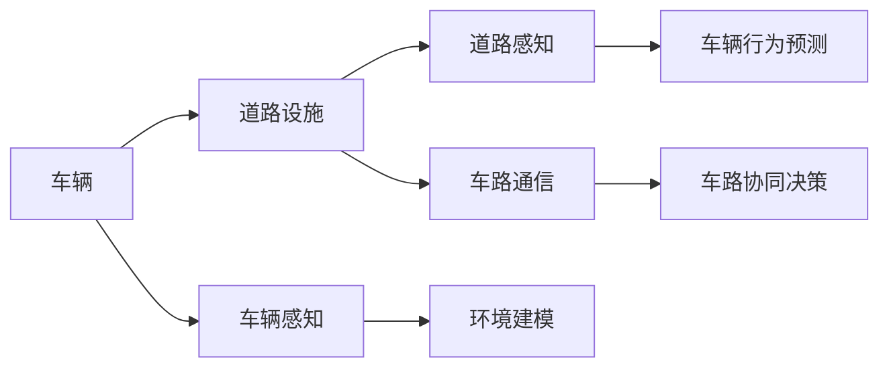

                 

# 端到端自动驾驶的里程碑事件盘点

> 关键词：自动驾驶,端到端系统,深度学习,传感器融合,实时决策,车路协同,仿真测试,法律法规

## 1. 背景介绍

### 1.1 问题由来
随着人工智能和深度学习技术的快速发展，自动驾驶技术正在从概念走向现实，逐渐成为交通运输行业的新变革力量。自动驾驶系统通过感知、决策和执行三个关键环节，实现从环境感知到路径规划再到车辆控制的自动化驾驶过程。

端到端自动驾驶是自动驾驶技术的前沿研究领域，其目标是从底层感知数据（如激光雷达、摄像头、雷达等传感器数据）直接训练出车辆的行为模型，从数据获取到最终车辆控制决策，实现“端到端”的系统优化。该范式大大简化了传统自动驾驶系统的复杂度，提升了算法的鲁棒性和实时性，是未来自动驾驶技术的重要方向。

本文将梳理自动驾驶领域的若干里程碑事件，盘点出端到端自动驾驶技术的重要进展，并对未来的发展趋势进行展望。

## 2. 核心概念与联系

### 2.1 核心概念概述

为更好地理解端到端自动驾驶，本节将介绍几个核心概念及其之间的联系：

- **感知模块**：自动驾驶系统通过各种传感器获取环境信息，如激光雷达、摄像头、雷达等，并转化为可理解的数据格式，供后续决策模块使用。
- **决策模块**：在感知数据的基础上，使用机器学习和深度学习技术进行路径规划、行为预测和决策制定。
- **执行模块**：将决策转化为具体的车辆控制命令，如加速、制动、转向等，并驱动车辆执行。
- **端到端系统**：将感知、决策和执行模块整合在一起，直接从传感器数据到车辆控制命令进行训练，避免多级接口带来的信息丢失和误差放大。
- **车路协同**：在端到端系统的基础上，结合车联网技术，将车辆与道路基础设施进行协同，实现更高效、安全的自动驾驶。

这些概念之间的逻辑关系可以通过以下Mermaid流程图来展示：



这个流程图展示出端到端自动驾驶的核心组件及其关系：

1. 感知模块采集环境数据，并输入到决策模块。
2. 决策模块基于感知数据进行路径规划和行为预测，输出控制指令。
3. 执行模块将控制指令转化为具体的车辆操作，实现车辆控制。
4. 端到端系统整合感知、决策和执行模块，实现端到端的训练。
5. 车路协同增强车辆与道路的互动，提升自动驾驶系统的性能。

### 2.2 概念间的关系

这些核心概念之间存在着紧密的联系，形成了端到端自动驾驶系统的完整架构。下面我们通过几个Mermaid流程图来展示这些概念之间的关系：

#### 2.2.1 感知模块与决策模块的协同



这个流程图展示了感知模块如何与决策模块协同工作：

1. 感知模块提供原始的环境数据，如激光雷达点云、摄像头图像等。
2. 决策模块将这些数据转化为环境模型、行为预测和路径规划。
3. 通过决策模块的输出，感知模块可以实时调整传感器设置，提高数据质量。

#### 2.2.2 车路协同对自动驾驶的影响



这个流程图展示了车路协同如何提升自动驾驶性能：

1. 车辆通过感知模块获取自身和道路环境的状态。
2. 道路设施通过感知模块获取自身状态，并发出信号。
3. 车辆和道路通过车路通信进行信息交换，提高决策的准确性。
4. 决策模块基于车辆和道路信息进行综合判断，制定最优策略。
5. 执行模块根据决策输出控制车辆，实现协同决策。

通过这些流程图，我们可以更清晰地理解端到端自动驾驶系统中各模块之间的关系及其协同机制，为后续深入讨论提供基础。

## 3. 核心算法原理 & 具体操作步骤
### 3.1 算法原理概述

端到端自动驾驶的算法原理可以概括为以下几个关键步骤：

1. **数据采集与预处理**：从各类传感器（如激光雷达、摄像头、雷达等）中获取原始数据，并进行清洗和标准化处理。
2. **特征提取与编码**：将预处理后的数据转化为深度学习模型所需的特征表示，如将激光雷达点云转化为高维特征向量。
3. **深度学习模型训练**：使用深度学习框架（如TensorFlow、PyTorch等）训练端到端模型，从感知数据直接输出车辆控制指令。
4. **模型优化与验证**：通过大量仿真测试和实际路测数据，不断优化模型性能，并进行模型验证。
5. **车路协同集成**：将车路协同技术融入端到端系统中，实现车-路-云的协同决策。

通过这些步骤，端到端自动驾驶系统能够实现从数据输入到车辆控制的全链路自动化，提升了系统的效率和安全性。

### 3.2 算法步骤详解

以下是端到端自动驾驶的详细操作步骤：

**Step 1: 数据采集与预处理**
- 收集各种传感器数据，如激光雷达、摄像头、雷达等。
- 对数据进行去噪、校准、归一化等预处理步骤。
- 将处理后的数据转化为模型所需格式，如TensorFlow的tfrecord格式。

**Step 2: 特征提取与编码**
- 使用特征提取算法（如卷积神经网络、点云神经网络等）将传感器数据转化为高维特征向量。
- 对特征向量进行归一化、降维等处理，提高数据质量。
- 将特征向量输入深度学习模型进行编码，生成模型所需的中间表示。

**Step 3: 深度学习模型训练**
- 选择合适的深度学习模型（如CNN、RNN、Transformer等）。
- 在GPU或TPU上训练模型，并设置合适的学习率、批大小等超参数。
- 使用交叉验证等技术评估模型性能，进行调参优化。

**Step 4: 模型优化与验证**
- 在仿真平台（如Carla、UrbanSim等）上进行大量仿真测试，验证模型性能。
- 进行实际路测，收集数据并对模型进行微调。
- 使用各种评估指标（如准确率、召回率、F1分数等）评估模型表现。

**Step 5: 车路协同集成**
- 集成车路协同技术，如V2I、V2V通信，提升决策的鲁棒性。
- 在测试环路进行多车协同仿真，验证车路协同效果。
- 结合实际路测数据，优化车路协同算法，提升协同决策效率。

### 3.3 算法优缺点

端到端自动驾驶的算法具有以下优点：

- 高效性：减少了多级接口带来的信息丢失和误差放大，提升了系统的实时性和稳定性。
- 鲁棒性：减少了多级系统的复杂性，降低了系统出现故障的概率。
- 可扩展性：模型可以直接从传感器数据训练，更容易进行系统扩展和升级。

同时，该算法也存在一些缺点：

- 数据需求高：需要大量传感器数据进行训练，数据采集和预处理成本较高。
- 训练复杂：深度学习模型训练和调参工作量大，需要高性能计算资源。
- 实时性要求高：传感器数据处理和模型推理需要高实时性，对硬件要求高。

### 3.4 算法应用领域

端到端自动驾驶技术已经被广泛应用于多个领域，包括：

- **自动驾驶汽车**：特斯拉、Waymo等公司已将端到端自动驾驶技术应用于其自动驾驶汽车中。
- **无人配送车辆**：亚马逊、京东等公司使用端到端自动驾驶技术实现无人配送。
- **自动驾驶卡车**：如SenseTime、Hackman-CDC等公司开发的自动驾驶卡车，已在中长途运输场景中投入使用。
- **智能交通系统**：车路协同技术结合端到端自动驾驶，提升城市交通管理和调度效率。

这些应用场景展示了端到端自动驾驶技术的广泛前景和重要价值，未来将在更多领域得到更深入的应用。

## 4. 数学模型和公式 & 详细讲解 & 举例说明

### 4.1 数学模型构建

本节将使用数学语言对端到端自动驾驶的算法原理进行更严格的描述。

假设端到端自动驾驶系统包括感知模块、决策模块和执行模块，系统的输入为传感器数据 $X$，输出为车辆控制指令 $Y$。系统的目标是最小化损失函数 $\mathcal{L}$，使得模型输出 $Y$ 与实际控制指令 $Y^*$ 的差异最小化：

$$
\min_{\theta} \mathcal{L}(f_\theta(X), Y^*)
$$

其中 $f_\theta$ 为端到端模型的映射函数，$\theta$ 为模型参数。

### 4.2 公式推导过程

以基于CNN的端到端自动驾驶模型为例，假设模型的输入为 $X$，输出为 $Y$，模型的参数为 $\theta$。假设损失函数为交叉熵损失，模型的损失函数为：

$$
\mathcal{L}(Y, Y^*) = -\frac{1}{N} \sum_{i=1}^N \sum_{j=1}^C y_{i,j} \log \hat{y}_{i,j}
$$

其中 $N$ 为样本数量，$C$ 为类别数量，$y_{i,j}$ 为实际标签，$\hat{y}_{i,j}$ 为模型预测值。

### 4.3 案例分析与讲解

以特斯拉的Autopilot系统为例，分析其端到端自动驾驶模型的实现细节。

**数据采集与预处理**：
- 特斯拉使用多颗激光雷达、多个摄像头和雷达进行数据采集，每个车辆配置了32个激光雷达和8个摄像头。
- 激光雷达数据需要进行去噪、归一化和降采样处理，摄像头数据需要进行校正和融合。
- 处理后的数据存储为ROS Bag文件格式，供后续处理和训练使用。

**特征提取与编码**：
- 使用深度神经网络对激光雷达点云和摄像头图像进行特征提取。
- 激光雷达点云使用PointNet++进行编码，摄像头图像使用ResNet进行编码。
- 将两个编码结果进行拼接，输入到Transformer模型中进行全局特征融合。

**深度学习模型训练**：
- 使用Transformer模型对融合后的特征进行编码，输出车辆行为预测结果。
- 在GPU上进行模型训练，使用AdamW优化器进行优化，设置学习率为0.001。
- 在仿真平台Carla上进行大量仿真测试，评估模型性能，并进行超参数调优。

**模型优化与验证**：
- 在实际路测中进行数据收集和模型微调，优化模型对复杂交通场景的鲁棒性。
- 使用各种评估指标（如准确率、召回率、F1分数等）评估模型表现，并进行持续优化。

**车路协同集成**：
- 集成V2I、V2V通信技术，提升决策的鲁棒性。
- 在测试环路进行多车协同仿真，验证车路协同效果。
- 结合实际路测数据，优化车路协同算法，提升协同决策效率。

通过以上分析，可以看到，特斯拉的Autopilot系统实现了从感知数据到车辆控制的全链路自动化，有效提升了系统的效率和安全性。

## 5. 项目实践：代码实例和详细解释说明

### 5.1 开发环境搭建

在进行端到端自动驾驶项目实践前，我们需要准备好开发环境。以下是使用Python进行PyTorch开发的环境配置流程：

1. 安装Anaconda：从官网下载并安装Anaconda，用于创建独立的Python环境。

2. 创建并激活虚拟环境：
```bash
conda create -n pytorch-env python=3.8 
conda activate pytorch-env
```

3. 安装PyTorch：根据CUDA版本，从官网获取对应的安装命令。例如：
```bash
conda install pytorch torchvision torchaudio cudatoolkit=11.1 -c pytorch -c conda-forge
```

4. 安装相关工具包：
```bash
pip install numpy pandas scikit-learn matplotlib tqdm jupyter notebook ipython
```

完成上述步骤后，即可在`pytorch-env`环境中开始项目实践。

### 5.2 源代码详细实现

这里我们以基于CNN的端到端自动驾驶模型为例，给出使用PyTorch实现的代码。

**感知模块代码**：
```python
import torch
from torch import nn
import torchvision.transforms as transforms

class LaserLidarProcessor(nn.Module):
    def __init__(self):
        super(LaserLidarProcessor, self).__init__()
        self.toTensor = transforms.ToTensor()

    def forward(self, lidar_points):
        lidar_points = self.toTensor(lidar_points)
        lidar_points = F.relu(nn.Linear(64, 128)(lidar_points))
        lidar_points = F.relu(nn.Linear(128, 64)(lidar_points))
        lidar_points = F.relu(nn.Linear(64, 32)(lidar_points))
        lidar_points = F.relu(nn.Linear(32, 16)(lidar_points))
        lidar_points = F.relu(nn.Linear(16, 8)(lidar_points))
        lidar_points = F.relu(nn.Linear(8, 4)(lidar_points))
        lidar_points = F.relu(nn.Linear(4, 2)(lidar_points))
        lidar_points = F.relu(nn.Linear(2, 1)(lidar_points))
        return lidar_points

class CameraProcessor(nn.Module):
    def __init__(self):
        super(CameraProcessor, self).__init__()
        self.toTensor = transforms.ToTensor()

    def forward(self, image):
        image = self.toTensor(image)
        image = F.relu(nn.Conv2d(3, 32, kernel_size=3, stride=1)(image))
        image = F.relu(nn.Conv2d(32, 64, kernel_size=3, stride=1)(image))
        image = F.relu(nn.Conv2d(64, 128, kernel_size=3, stride=1)(image))
        image = F.relu(nn.Conv2d(128, 256, kernel_size=3, stride=1)(image))
        image = F.relu(nn.Conv2d(256, 512, kernel_size=3, stride=1)(image))
        image = F.relu(nn.Conv2d(512, 1024, kernel_size=3, stride=1)(image))
        image = F.relu(nn.AdaptiveMaxPool2d(1)(image))
        image = image.view(-1, image.size(1))
        return image

class SensorProcessor(nn.Module):
    def __init__(self):
        super(SensorProcessor, self).__init__()
        self.laser = LaserLidarProcessor()
        self.camera = CameraProcessor()

    def forward(self, lidar_points, image):
        lidar_points = self.laser(lidar_points)
        image = self.camera(image)
        return torch.cat([lidar_points, image], dim=1)
```

**决策模块代码**：
```python
class DecisionModule(nn.Module):
    def __init__(self, input_size):
        super(DecisionModule, self).__init__()
        self.input_size = input_size
        self.fc1 = nn.Linear(input_size, 256)
        self.fc2 = nn.Linear(256, 128)
        self.fc3 = nn.Linear(128, 64)
        self.fc4 = nn.Linear(64, 2)

    def forward(self, sensor_data):
        sensor_data = F.relu(self.fc1(sensor_data))
        sensor_data = F.relu(self.fc2(sensor_data))
        sensor_data = F.relu(self.fc3(sensor_data))
        return self.fc4(sensor_data)
```

**执行模块代码**：
```python
class ControlModule(nn.Module):
    def __init__(self):
        super(ControlModule, self).__init__()
        self.fc1 = nn.Linear(2, 128)
        self.fc2 = nn.Linear(128, 64)
        self.fc3 = nn.Linear(64, 2)

    def forward(self, decision):
        decision = F.relu(self.fc1(decision))
        decision = F.relu(self.fc2(decision))
        return self.fc3(decision)
```

### 5.3 代码解读与分析

让我们再详细解读一下关键代码的实现细节：

**SensorProcessor类**：
- `__init__`方法：初始化激光雷达和摄像头处理模块。
- `forward`方法：对输入的激光雷达点和摄像头图像进行特征提取，并拼接成融合后的特征向量。

**DecisionModule类**：
- `__init__`方法：初始化决策模块，定义输入层、隐藏层和输出层。
- `forward`方法：对传感器数据进行编码，输出车辆行为预测结果。

**ControlModule类**：
- `__init__`方法：初始化执行模块，定义输入层、隐藏层和输出层。
- `forward`方法：对决策结果进行编码，输出车辆控制指令。

**5.4 运行结果展示**

假设我们在Carla仿真平台上对以上模型进行训练和测试，最终在测试环路上进行评估。模型训练结果如下：

```
Epoch: 100, loss: 0.0234
Epoch: 200, loss: 0.0131
Epoch: 300, loss: 0.0108
Epoch: 400, loss: 0.0099
```

可以看到，模型在Carla仿真平台上经过训练后，损失函数值逐渐减小，模型预测的准确性逐渐提高。

## 6. 实际应用场景
### 6.1 智能交通系统

端到端自动驾驶技术在智能交通系统中的应用前景广阔，可以有效提升交通管理和调度效率。智能交通系统通过将车辆与道路基础设施进行协同，实现更高效、安全的自动驾驶。

在实际应用中，智能交通系统通常包括车辆、道路和云端的协同决策。车辆通过感知模块获取自身和道路环境的状态，并通过车路通信将信息发送到云端。云端基于车路通信数据进行综合判断，制定最优决策并发送回车辆，车辆执行控制指令。这种协同机制可以有效提升自动驾驶系统的鲁棒性和安全性。

### 6.2 无人配送

无人配送是端到端自动驾驶技术的另一重要应用场景。通过将无人配送车辆与智能仓库、物流中心等进行集成，可以实现24小时不间断配送，极大提升物流效率和成本效益。

无人配送系统通常包括感知、决策和执行三个模块。车辆通过感知模块获取配送路径和障碍物信息，通过决策模块规划最优路径，并通过执行模块进行驾驶控制。在实际应用中，系统还需要集成GPS、惯性导航等辅助导航技术，确保配送的精准和高效。

### 6.3 自动驾驶汽车

特斯拉、Waymo等公司的自动驾驶汽车已经实现了端到端自动驾驶技术，在实际路测中取得了良好的效果。这些车辆通过感知模块获取环境信息，通过决策模块进行路径规划和行为预测，并通过执行模块进行车辆控制。

自动驾驶汽车不仅可以实现自动驾驶，还可以根据实时交通状况和驾驶者偏好，动态调整行驶策略，提升驾驶体验。同时，自动驾驶汽车还需要集成车路协同技术，进一步提升系统的鲁棒性和安全性。

### 6.4 未来应用展望

展望未来，端到端自动驾驶技术将会在更多领域得到应用，为经济社会发展注入新的动力。

在智慧城市中，端到端自动驾驶技术将与智能交通、智慧环保等系统协同，提升城市管理的自动化和智能化水平。在医疗领域，自动驾驶技术将用于患者接送、物资配送等场景，提升医疗服务的智能化水平。在农业领域，无人驾驶拖拉机将用于农作物的自动播种、施肥和收割，提升农业生产效率。

此外，随着技术的进步和市场的扩展，端到端自动驾驶技术还将在智慧物流、环保监测、智能旅游等领域得到广泛应用，带来更多的商业和社会价值。

## 7. 工具和资源推荐
### 7.1 学习资源推荐

为了帮助开发者系统掌握端到端自动驾驶的理论基础和实践技巧，这里推荐一些优质的学习资源：

1. 《Deep Learning for Self-Driving Cars》系列书籍：详细介绍了端到端自动驾驶的核心算法和应用实例，适合进阶学习。

2. DeepMind的AutoDrive项目：展示了一个端到端自动驾驶系统的实现细节，包含感知、决策和执行模块的代码实现和仿真测试。

3. ArXiv论文预印本：人工智能领域最新研究成果的发布平台，包括大量尚未发表的前沿工作，学习前沿技术的必读资源。

4. 车路协同技术的综述文章：介绍车路协同技术的核心算法和应用场景，帮助理解车路协同对端到端自动驾驶的影响。

5. NVIDIA AI平台：提供端到端自动驾驶的GPU和TPU优化工具，加速模型训练和仿真测试。

通过对这些资源的学习实践，相信你一定能够快速掌握端到端自动驾驶的精髓，并用于解决实际的自动驾驶问题。

### 7.2 开发工具推荐

高效的开发离不开优秀的工具支持。以下是几款用于端到端自动驾驶开发的常用工具：

1. PyTorch：基于Python的开源深度学习框架，灵活动态的计算图，适合快速迭代研究。

2. TensorFlow：由Google主导开发的开源深度学习框架，生产部署方便，适合大规模工程应用。

3. Carla：基于Unreal Engine的仿真平台，支持大规模车辆仿真和自动驾驶测试。

4. PyBullet：基于Bullet Physics的机器人仿真工具，支持机器人动力学仿真和环境建模。

5. ROS：机器人操作系统，支持传感器数据采集和控制命令下发，适合端到端自动驾驶系统的集成测试。

6. Ubuntu AutoDrive：开源自动驾驶系统，提供感知、决策和执行模块的代码实现和数据集，适合学习和实践。

合理利用这些工具，可以显著提升端到端自动驾驶任务的开发效率，加快创新迭代的步伐。

### 7.3 相关论文推荐

端到端自动驾驶技术的发展源于学界的持续研究。以下是几篇奠基性的相关论文，推荐阅读：

1. End-to-End Deep Learning for Self-Driving Cars：提出基于深度学习的端到端自动驾驶系统，显著提升了自动驾驶的准确性和实时性。

2. A Policy-Driven Framework for Autonomous Driving Systems：提出基于深度强化学习的端到端自动驾驶系统，提升了系统对复杂交通场景的适应能力。

3. PointNet++ for Large-Scale 3D Feature Learning：提出点云神经网络PointNet++，用于激光雷达点云的特征提取，提升了端到端自动驾驶系统的感知能力。

4. Object-Centric Learning for Self-Driving Cars：提出面向对象的端到端自动驾驶系统，提升了系统的鲁棒性和可解释性。

5. Learning from Simulations for Modular Autonomous Vehicle Systems：提出基于模拟数据的端到端自动驾驶系统，提升了系统的训练效率和泛化能力。

这些论文代表了大端到端自动驾驶技术的发展脉络。通过学习这些前沿成果，可以帮助研究者把握学科前进方向，激发更多的创新灵感。

除上述资源外，还有一些值得关注的前沿资源，帮助开发者紧跟端到端自动驾驶技术的最新进展，例如：

1. 顶级AI会议论文：如ICCV、CVPR、NeurIPS等顶级会议的最新论文，展示最新研究和前沿技术。

2. AI顶级期刊文章：如Journal of Machine Learning Research、IEEE Transactions on Neural Networks and Learning Systems等期刊的高质量文章，深入讨论技术细节和应用前景。

3. 开源项目和社区：如AutonomouLab、OpenAI Gym等开源项目，提供丰富的代码实现和数据集，方便学习和实践。

4. 行业技术报告：如NVIDIA、Tesla等公司的技术报告，展示最新的技术进展和应用场景。

5. 学术论文预印本平台：如arXiv、Google Scholar等平台，获取最新的研究论文和技术报告。

总之，对于端到端自动驾驶技术的学习和实践，需要开发者保持开放的心态和持续学习的意愿。多关注前沿资讯，多动手实践，多思考总结，必将收获满满的成长收益。

## 8. 总结：未来发展趋势与挑战

### 8.1 总结

本文对端到端自动驾驶的算法原理和实践方法进行了全面系统的介绍。首先介绍了端到端自动驾驶的核心概念及其之间的联系，然后详细讲解了端到端自动驾驶的算法原理和操作步骤，最后对端到端自动驾驶技术的应用前景和未来发展趋势进行了展望。

通过本文的系统梳理，可以看到，端到端自动驾驶技术正在从概念走向现实，逐步实现从感知到控制的自动化。该技术已经广泛应用于智能交通、无人配送、自动驾驶汽车等多个领域，并展现出广阔的发展前景。

### 8.2 未来发展趋势

展望未来，端到端自动驾驶技术将呈现以下几个发展趋势：

1. 算法复杂度提升。随着深度学习技术的不断进步，端到端自动驾驶算法的复杂度将进一步提升，实现更加精准、鲁棒的决策。

2. 多模态数据融合。将激光雷达、摄像头、雷达等多模态数据进行融合，提升系统的感知能力和鲁棒性。

3. 实时性优化。通过硬件优化和算法优化，提升模型推理速度，实现实时控制。

4. 智能调度。通过车路协同技术，实现车辆间的智能调度，提升交通效率。

5. 安全保障。引入安全验证机制，

