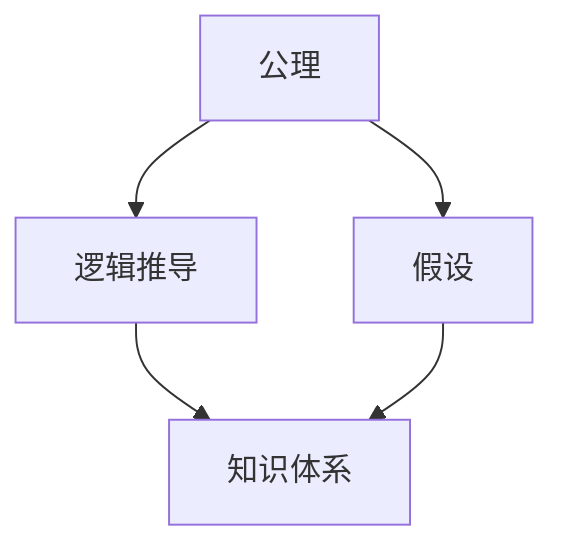

                 

## 1. 背景介绍

### 1.1 问题由来

“第一性原理”是古希腊哲学家亚里士多德提出的一个概念，意指事物的最基本原理。这一概念在物理学家理查德·费曼和企业家埃隆·马斯克等人的普及和推广下，逐渐应用于科技、商业等多个领域。第一性原理强调从基本事实和基本公理出发，通过逻辑推导建立新知识体系。

在IT领域，第一性原理被广泛应用到软件开发、人工智能、系统设计等各个方面。特别是在科学研究、算法开发和工程实践等领域，第一性原理提供了一种有效的科学方法和思维方式。本文将深入探讨第一性原理的原理和应用，以期帮助开发者和研究者更好地理解和运用这一强大工具。

### 1.2 问题核心关键点

第一性原理的核心在于从基本的公理和假设出发，推导出全新的知识和方法。其关键点包括：

1. **公理和假设**：选择最基本的、无需证明的公理和假设作为推理的起点。
2. **逻辑推导**：基于公理和假设，通过逻辑推导构建新的知识体系。
3. **跨学科应用**：第一性原理不仅适用于某一学科或领域，还能够在不同学科间进行迁移和应用。
4. **创新突破**：第一性原理能够帮助人们突破传统思维模式，发现新的解决方案和创新路径。
5. **简洁高效**：第一性原理强调简洁性和高效性，避免不必要的复杂性和冗余。

本文将围绕这些关键点，详细讨论第一性原理在科学、工程和算法开发中的应用，以及其背后的数学模型和算法原理。

## 2. 核心概念与联系

### 2.1 核心概念概述

为更好地理解第一性原理，我们首先介绍几个关键概念：

- **公理**：无需证明的真命题，作为推理的起点。
- **假设**：有一定依据，但尚未完全证明的命题，作为推理的辅助。
- **逻辑推导**：基于公理和假设，通过演绎和推理构建新命题的过程。
- **知识体系**：通过逻辑推导得到的新知识结构，分为理论知识和应用知识。
- **跨学科应用**：将某一学科的知识和方法应用到其他学科，实现学科间的融合和创新。

这些概念共同构成了第一性原理的基本框架，为我们提供了从基本原理推导出复杂系统的思维和方法。

### 2.2 概念间的关系

第一性原理的核心在于从基本的公理和假设出发，通过逻辑推导构建新的知识体系。以下是这些概念之间的关系：



这个流程图展示了公理、假设、逻辑推导和知识体系之间的关系：

1. 公理和假设是推理的起点，公理无需证明，假设有一定依据。
2. 逻辑推导是基于公理和假设进行的推理过程，可以构建新的知识。
3. 知识体系是逻辑推导的结果，包括理论知识和应用知识。

通过这个图示，我们可以更清晰地理解第一性原理的基本结构和工作方式。

## 3. 核心算法原理 & 具体操作步骤

### 3.1 算法原理概述

第一性原理在算法和工程中的应用，主要体现在算法设计和开发的各个环节。其核心思想是通过对基本原理的逻辑推导，构建出高效的算法和解决方案。算法原理通常包含以下几个方面：

1. **算法设计**：从基本的公理和假设出发，推导出新的算法结构和流程。
2. **数据结构设计**：选择最基本的数据结构，如数组、树、图等，进行逻辑推导和优化。
3. **时间复杂度分析**：通过公理和假设推导出算法的时间复杂度，进行优化和改进。
4. **空间复杂度分析**：通过公理和假设推导出算法的空间复杂度，进行优化和压缩。

### 3.2 算法步骤详解

基于第一性原理的算法设计步骤如下：

1. **确定基本公理和假设**：选择最基本、无需证明的公理和有一定依据的假设作为推理起点。
2. **逻辑推导**：基于公理和假设，通过逻辑推导构建新的算法结构和流程。
3. **算法实现**：将逻辑推导的结果转化为具体的算法实现，包括数据结构和代码实现。
4. **性能优化**：通过时间复杂度和空间复杂度的分析，进行算法的优化和改进。

### 3.3 算法优缺点

基于第一性原理的算法设计具有以下优点：

1. **高效简洁**：从基本公理和假设出发，避免了复杂的推导和冗余的计算，提高了算法效率。
2. **创新突破**：通过跨学科的逻辑推导，可以发现新的算法和解决方案，实现技术突破。
3. **可解释性**：基于公理和假设的推导过程，具有较高的可解释性和可理解性。
4. **适应性强**：算法设计以基本原理为基础，具有较强的适应性和扩展性。

同时，第一性原理的算法设计也存在一些缺点：

1. **推导复杂**：对于复杂的系统问题，推导过程可能过于繁琐，难以进行。
2. **依赖假设**：假设的准确性和可靠性直接影响算法的性能和效果。
3. **应用范围有限**：某些问题可能需要特定的领域知识和背景，第一性原理的应用范围受限。

### 3.4 算法应用领域

基于第一性原理的算法设计在多个领域中得到广泛应用，包括但不限于：

1. **计算机科学**：如数据结构、算法设计、计算机网络等。
2. **数学**：如数论、概率论、图论等。
3. **物理学**：如经典力学、量子力学、统计物理学等。
4. **工程学**：如机械工程、电气工程、化学工程等。
5. **生物学**：如分子生物学、生态学、生物信息学等。
6. **金融学**：如风险管理、投资组合优化、市场预测等。
7. **经济学**：如供需分析、博弈论、市场行为等。

这些领域的第一性原理应用展示了其强大的跨学科适应性和创新能力。

## 4. 数学模型和公式 & 详细讲解 & 举例说明

### 4.1 数学模型构建

第一性原理在数学中的应用，主要体现在从基本公理出发，推导出新的数学模型和公式。其基本步骤如下：

1. **选择公理和假设**：如欧几里得几何中的五条公理。
2. **逻辑推导**：通过公理和假设，推导出新的命题和定理。
3. **数学建模**：将逻辑推导结果转化为具体的数学模型。

以欧几里得几何为例，其基本公理包括：

1. 在同一平面内，至少存在一条直线。
2. 若直线l上有两点，则直线l上有且仅有一条经过这两点的直线。
3. 同一平面内的任何直线都可以向两侧无限延长。
4. 若在同一平面内，有三点不共线，则经过这三点的直线有且仅有一条。
5. 所有直角都相等。

基于这些公理，通过逻辑推导，我们可以构建出欧几里得几何的基本定理和公式。

### 4.2 公式推导过程

以勾股定理为例，推导过程如下：

1. 设直角三角形的三边长分别为a、b、c，其中c为斜边。
2. 根据直角三角形的定义，斜边c的长度可以表示为：
   $$
   c^2 = a^2 + b^2
   $$
3. 将c表示为a和b的函数，即：
   $$
   c = \sqrt{a^2 + b^2}
   $$

勾股定理的推导过程展示了从基本公理出发，通过逻辑推导建立新知识体系的方法。

### 4.3 案例分析与讲解

以排序算法为例，常见的排序算法有冒泡排序、插入排序、选择排序等。这些算法的基本原理和推导如下：

1. 选择排序的基本原理是每次选择未排序部分的最小元素，将其放到已排序部分的末尾。
2. 插入排序的基本原理是将未排序部分的元素逐个插入到已排序部分的合适位置。
3. 冒泡排序的基本原理是通过相邻元素的比较和交换，将最大的元素逐步“冒泡”到末尾。

这些排序算法的设计都是基于基本的公理和假设，通过逻辑推导构建的。

## 5. 项目实践：代码实例和详细解释说明

### 5.1 开发环境搭建

第一性原理的算法设计和实现通常需要先进的计算工具和软件环境。以下是常见的开发环境搭建流程：

1. **选择编程语言**：如Python、C++、Java等。
2. **安装编译器**：如GCC、Clang、Visual Studio等。
3. **配置开发环境**：如设置IDE、库文件路径等。
4. **安装依赖库**：如NumPy、SciPy、OpenCV等。
5. **调试工具安装**：如GDB、Valgrind等。

### 5.2 源代码详细实现

以排序算法为例，以下是选择排序的Python代码实现：

```python
def selection_sort(arr):
    n = len(arr)
    for i in range(n):
        min_idx = i
        for j in range(i+1, n):
            if arr[j] < arr[min_idx]:
                min_idx = j
        arr[i], arr[min_idx] = arr[min_idx], arr[i]
    return arr
```

### 5.3 代码解读与分析

选择排序的核心在于每次找到未排序部分的最小元素，并将其放到已排序部分的末尾。具体实现过程中，通过两重循环，首先找到未排序部分的最小元素，然后在已排序部分中找到合适的位置进行交换。

### 5.4 运行结果展示

假设我们有一个未排序的列表`[64, 25, 12, 22, 11]`，通过调用`selection_sort`函数，可以得到排序后的结果`[11, 12, 22, 25, 64]`。

## 6. 实际应用场景

### 6.1 科学研究

第一性原理在科学研究中具有重要应用。例如，物理学家通过公理和假设，推导出经典力学、相对论等基本理论，极大地推动了科学的发展。

### 6.2 工程设计

在工程设计中，第一性原理被广泛应用。如机械设计中的材料力学、电气工程中的电路分析等。通过基本原理的推导，工程师可以构建出高效、可靠的工程系统。

### 6.3 软件工程

第一性原理在软件工程中也得到应用。如算法设计、数据结构设计、系统架构设计等。通过基本原理的推导，可以构建出高效、可扩展的软件系统。

## 7. 工具和资源推荐

### 7.1 学习资源推荐

为帮助开发者和研究者系统掌握第一性原理，以下是一些推荐的学习资源：

1. **《第一性原理》（Richard Feynman）**：介绍了物理学中的基本公理和假设，通过推导构建新的理论体系。
2. **《算法导论》（Thomas H. Cormen）**：详细介绍了常见算法的基本原理和实现方法，适合算法初学者和进阶者。
3. **《计算机科学导论》（Joseph Abraham）**：介绍了计算机科学的基本公理和假设，通过推导构建新的知识体系。
4. **Coursera和edX课程**：提供了丰富的第一性原理和算法课程，适合在线学习。
5. **GitHub代码库**：包含大量的第一性原理和算法实现，适合参考和借鉴。

### 7.2 开发工具推荐

以下是一些推荐的第一性原理和算法开发工具：

1. **Python**：灵活性高，适合多种算法和数据分析任务。
2. **MATLAB**：适用于科学计算和数据可视化，支持广泛的算法和公式推导。
3. **Mathematica**：强大的符号计算和公式推导工具，适合科研和工程应用。
4. **LaTeX**：专业的文档编辑工具，适用于数学公式和科学论文的排版。
5. **Jupyter Notebook**：支持交互式编程和数据可视化，适合数据科学和算法开发。

### 7.3 相关论文推荐

以下是一些推荐的第一性原理和算法论文：

1. **《欧几里得几何的公理系统》**（Euclid）：介绍了几何学的基本公理和定理。
2. **《算法设计与分析》**（Jon Kleinberg和Eva Tardos）：详细介绍了常见算法的原理和实现方法。
3. **《计算机科学中的数学基础》**（Richard E. Bellman）：介绍了计算机科学中的基本公理和假设。
4. **《机器学习中的第一性原理》**（Fei-Fei Li和Kai Yu）：探讨了机器学习中的基本公理和假设，通过推导构建新的算法体系。

## 8. 总结：未来发展趋势与挑战

### 8.1 研究成果总结

本文详细探讨了第一性原理的原理和应用，从基本公理和假设出发，通过逻辑推导构建新的知识体系。第一性原理在科学、工程和算法设计中具有广泛应用，展示了其强大的跨学科适应性和创新能力。

### 8.2 未来发展趋势

未来，第一性原理将在更多领域得到应用，推动科学、工程和技术的发展。主要趋势包括：

1. **跨学科融合**：第一性原理在不同学科间的应用将进一步深化，推动跨学科融合和创新。
2. **自动化推理**：借助人工智能和机器学习技术，实现自动化的第一性原理推导和验证。
3. **大数据分析**：通过大数据和云计算技术，提高第一性原理的推导效率和应用范围。
4. **工程化应用**：第一性原理将在工程设计和实际应用中得到广泛应用，推动新技术和新产品的开发。

### 8.3 面临的挑战

尽管第一性原理具有强大的应用潜力，但其推广和应用也面临一些挑战：

1. **理解难度**：第一性原理的推导过程可能过于复杂，难以理解和掌握。
2. **推导难度**：对于复杂系统问题，第一性原理的推导过程可能过于繁琐。
3. **应用范围**：某些问题可能需要特定的领域知识和背景，第一性原理的应用范围受限。
4. **推广难度**：第一性原理的推广和应用需要跨学科的合作和协调，面临一定的难度。
5. **验证难度**：第一性原理的验证过程可能存在一定的不确定性和误差。

### 8.4 研究展望

未来，第一性原理的研究需要从多个方面进行突破：

1. **简化推导过程**：通过自动化和模型化方法，简化第一性原理的推导过程，提高可操作性。
2. **跨学科应用**：推动第一性原理在更多学科中的应用，促进跨学科融合和创新。
3. **数据驱动验证**：借助大数据和人工智能技术，提高第一性原理的验证效率和准确性。
4. **工程化推广**：推动第一性原理在工程设计和实际应用中的推广和应用，提升工程效率和效果。

## 9. 附录：常见问题与解答

**Q1：如何理解第一性原理的公理和假设？**

A: 公理是无需证明的真命题，假设是有一定依据的命题。理解公理和假设的关键在于深入了解其背后的物理、数学或工程原理。例如，欧几里得几何中的五条公理是基于直观和几何直觉的，而牛顿力学中的三条运动定律则是基于实验和观测的。

**Q2：第一性原理和第二性原理有什么区别？**

A: 第一性原理是从基本公理和假设出发，通过逻辑推导构建新知识体系的方法。第二性原理则是基于实验和观测结果，进一步推导和验证的理论体系。第一性原理强调逻辑推导的严谨性，第二性原理强调实验验证的有效性。

**Q3：第一性原理的应用范围有哪些？**

A: 第一性原理在科学、工程、算法设计和软件工程等多个领域都有广泛应用。例如，在物理学中，第一性原理用于构建基本理论和公式；在机械工程中，第一性原理用于设计和优化机械系统；在算法设计中，第一性原理用于推导和实现高效的算法。

**Q4：如何选择合适的公理和假设？**

A: 选择合适的公理和假设需要根据具体问题和应用场景进行。一般而言，应选择最基本、最通用的公理和假设，避免过于复杂和特定的假设。同时，需确保公理和假设的严谨性和正确性。

**Q5：第一性原理和创新突破有何关系？**

A: 第一性原理提供了一种从基本原理出发，通过逻辑推导构建新知识体系的方法，能够突破传统思维模式，发现新的解决方案和创新路径。例如，牛顿通过三条运动定律推导出了万有引力定律，开创了力学的新篇章。

---

作者：禅与计算机程序设计艺术 / Zen and the Art of Computer Programming

