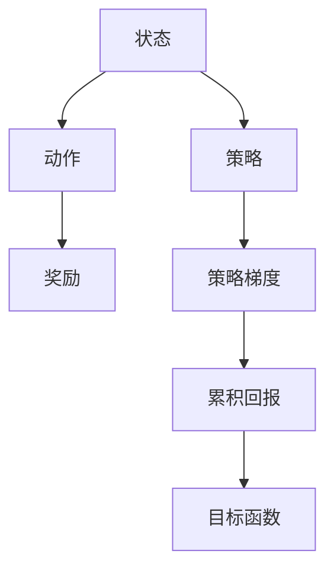
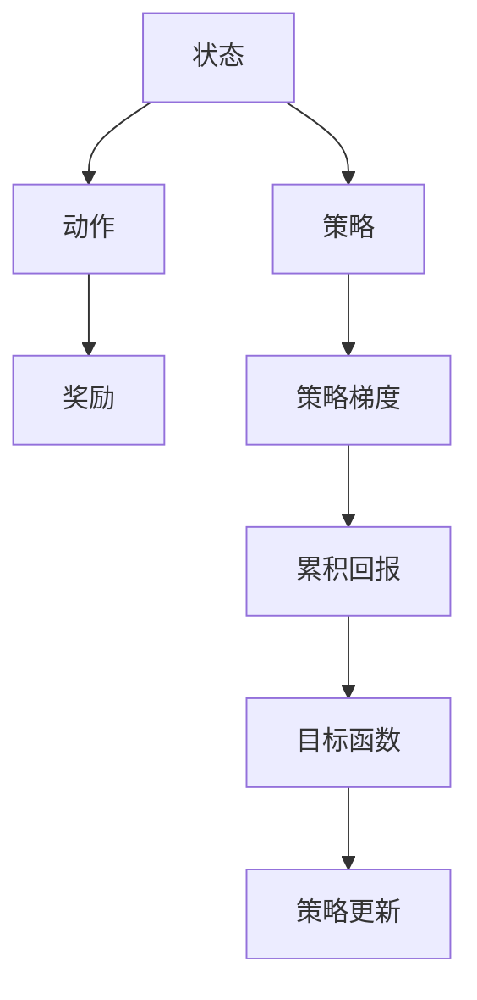
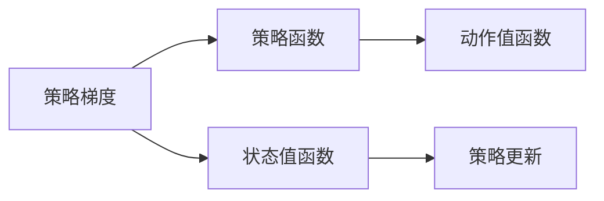
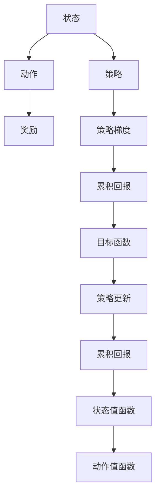

                 

# 策略梯度 (Policy Gradients) 原理与代码实例讲解

> 关键词：策略梯度, 强化学习, 离散动作, 连续动作, 计算图, 损失函数

## 1. 背景介绍

### 1.1 问题由来
在强化学习中，策略梯度（Policy Gradients）方法是一种用于优化策略函数的方法，其目标是通过优化策略来最大化累积回报。该方法与价值型强化学习方法不同，后者专注于学习值函数来评估策略的好坏，而策略梯度方法则直接优化策略本身，使其能够最大化长期累积收益。

策略梯度方法的提出，为解决复杂环境下的优化问题提供了一种新的途径，尤其是在连续动作空间和离散动作空间上表现出色。它不仅能够在未标注数据上进行优化，还能够处理延迟奖励和探索性策略等问题，因此在机器学习、智能控制等领域得到了广泛应用。

### 1.2 问题核心关键点
策略梯度方法的核心在于通过梯度上升（而不是梯度下降）来更新策略参数，从而使得累积回报最大化。其核心步骤如下：
1. **定义策略**：策略函数 $π(a_t|s_t)$ 将状态 $s_t$ 映射到动作 $a_t$。
2. **定义目标函数**：目标是最大化累积回报 $J(π)$，即：
   $$
   J(π) = \mathbb{E}_{\pi}[R]
   $$
   其中 $R$ 是累积回报。
3. **策略梯度更新**：通过梯度上升的方式，最大化目标函数 $J(π)$，即：
   $$
   \pi(a_t|s_t) \leftarrow \pi(a_t|s_t) \times e^{\delta_t \nabla_{\pi(a_t|s_t)} \log \pi(a_t|s_t)}
   $$
   其中 $\delta_t$ 是状态 $s_t$ 的回报，$\nabla_{\pi(a_t|s_t)} \log \pi(a_t|s_t)$ 是策略梯度。

### 1.3 问题研究意义
策略梯度方法在强化学习中具有重要的地位，尤其是在高维连续动作空间和深度神经网络模型中表现优异。它不仅可以处理高维动作空间，还能够与深度学习模型相结合，进行端到端的训练。策略梯度方法的应用范围广泛，包括机器人控制、自动驾驶、游戏AI等领域，具有重要的实际意义。

## 2. 核心概念与联系

### 2.1 核心概念概述

为更好地理解策略梯度方法，本节将介绍几个密切相关的核心概念：

- **策略函数 (Policy)**：将状态 $s_t$ 映射到动作 $a_t$ 的概率分布。策略函数是策略梯度方法优化的目标。
- **累积回报 (Return)**：从当前状态到终止状态的累积奖励总和。累积回报是策略梯度方法优化的目标函数。
- **策略梯度 (Policy Gradient)**：策略函数对动作 $a_t$ 的梯度，用于更新策略参数，使得累积回报最大化。
- **离散动作 (Discrete Actions)**：动作空间中离散的、有限的动作集合。
- **连续动作 (Continuous Actions)**：动作空间中连续的、无限的动作集合。
- **计算图 (Computation Graph)**：用于计算和优化策略梯度的计算图模型。
- **值函数 (Value Function)**：评估策略好坏的一种函数，通常包括状态值函数和动作值函数。

这些核心概念之间的逻辑关系可以通过以下Mermaid流程图来展示：



这个流程图展示了一个简单的强化学习过程，其中状态 $s_t$ 通过策略 $π(a_t|s_t)$ 映射到动作 $a_t$，进而获得奖励 $R_t$，并计算累积回报 $J(π)$。策略梯度用于优化策略函数 $π$，目标是最大化累积回报 $J(π)$。

### 2.2 概念间的关系

这些核心概念之间存在着紧密的联系，形成了策略梯度方法的完整生态系统。下面我通过几个Mermaid流程图来展示这些概念之间的关系。

#### 2.2.1 策略梯度方法的基本流程



这个流程图展示了一个简单的策略梯度方法的基本流程。状态 $s_t$ 通过策略 $π(a_t|s_t)$ 映射到动作 $a_t$，并获取奖励 $R_t$。策略梯度 $\nabla_{\pi(a_t|s_t)} \log \pi(a_t|s_t)$ 用于优化策略函数 $π$，并计算累积回报 $J(π)$。最终通过梯度上升的方式，最大化目标函数 $J(π)$，更新策略参数。

#### 2.2.2 策略梯度与值函数的关系



这个流程图展示了策略梯度与值函数之间的关系。策略梯度 $\nabla_{\pi(a_t|s_t)} \log \pi(a_t|s_t)$ 与状态值函数 $V(s_t)$ 和动作值函数 $Q(s_t,a_t)$ 相关，用于优化策略函数 $π$。状态值函数和动作值函数是策略梯度的重要组成部分，用于评估策略的好坏。

#### 2.2.3 策略梯度在连续动作空间中的应用


这个流程图展示了策略梯度在连续动作空间中的应用。在连续动作空间中，策略函数 $π(a_t|s_t)$ 是连续的，动作 $a_t$ 是连续的。此时，策略梯度更新需要使用蒙特卡罗方法和时间差分法等方法来估计策略梯度，并进行优化。

### 2.3 核心概念的整体架构

最后，我们用一个综合的流程图来展示这些核心概念在大语言模型微调过程中的整体架构：



这个综合流程图展示了从状态 $s_t$ 到动作 $a_t$ 的强化学习过程，其中策略梯度 $\nabla_{\pi(a_t|s_t)} \log \pi(a_t|s_t)$ 用于优化策略函数 $π$，并计算累积回报 $J(π)$。策略梯度更新需要通过蒙特卡罗方法或时间差分法来估计，并结合状态值函数和动作值函数进行优化。最终，策略更新可以通过梯度上升的方式进行，以最大化累积回报 $J(π)$。

## 3. 核心算法原理 & 具体操作步骤
### 3.1 算法原理概述

策略梯度方法是一种基于梯度的优化方法，其核心思想是通过优化策略函数来最大化累积回报。策略梯度方法的基本流程如下：

1. **定义策略**：策略函数 $π(a_t|s_t)$ 将状态 $s_t$ 映射到动作 $a_t$ 的概率分布。
2. **定义目标函数**：目标是最大化累积回报 $J(π)$，即：
   $$
   J(π) = \mathbb{E}_{\pi}[R]
   $$
   其中 $R$ 是累积回报。
3. **策略梯度更新**：通过梯度上升的方式，最大化目标函数 $J(π)$，即：
   $$
   \pi(a_t|s_t) \leftarrow \pi(a_t|s_t) \times e^{\delta_t \nabla_{\pi(a_t|s_t)} \log \pi(a_t|s_t)}
   $$
   其中 $\delta_t$ 是状态 $s_t$ 的回报，$\nabla_{\pi(a_t|s_t)} \log \pi(a_t|s_t)$ 是策略梯度。

### 3.2 算法步骤详解

策略梯度方法的具体实现步骤如下：

1. **初始化策略和参数**：设定初始策略 $π_0$ 和参数 $\theta_0$。
2. **迭代更新策略参数**：
   - 在每个时间步 $t$，根据当前状态 $s_t$ 和策略 $π$ 选择动作 $a_t$。
   - 模拟状态转移和奖励，得到下一个状态 $s_{t+1}$ 和奖励 $R_{t+1}$。
   - 计算累积回报 $\delta_t = \sum_{t'=t}^{T} \gamma^{t'-t} R_{t'}$，其中 $T$ 是终止状态，$\gamma$ 是折扣因子。
   - 计算策略梯度 $\nabla_{\pi(a_t|s_t)} \log \pi(a_t|s_t)$。
   - 根据策略梯度和累积回报，使用梯度上升的方法更新策略参数 $\theta$，即：
     - 离散动作：
       $$
       \pi(a_t|s_t) \leftarrow \pi(a_t|s_t) \times e^{\delta_t \nabla_{\pi(a_t|s_t)} \log \pi(a_t|s_t)}
       $$
     - 连续动作：
       $$
       \pi(a_t|s_t) \leftarrow \pi(a_t|s_t) \times e^{\delta_t \nabla_{\theta} \log \pi(a_t|s_t)}
       $$
3. **终止条件**：当达到预设的迭代次数或满足终止条件时，策略更新过程结束。

### 3.3 算法优缺点

策略梯度方法具有以下优点：

1. **易于实现**：策略梯度方法只需要定义策略函数和目标函数，即可通过梯度上升的方式进行优化。
2. **鲁棒性**：策略梯度方法对于模型结构和数据的分布变化具有较好的鲁棒性。
3. **可扩展性**：策略梯度方法可以处理离散动作和连续动作空间，具有较好的可扩展性。

同时，策略梯度方法也存在以下缺点：

1. **梯度方差较大**：策略梯度方法在更新策略时，梯度方差较大，导致学习速度较慢。
2. **不稳定**：策略梯度方法在更新策略时，容易发生震荡和爆炸，导致不稳定。
3. **计算复杂度较高**：策略梯度方法需要计算大量的梯度，计算复杂度较高。

### 3.4 算法应用领域

策略梯度方法在强化学习中具有广泛的应用，包括游戏AI、机器人控制、自然语言处理、推荐系统等领域。以下是几个典型的应用场景：

1. **游戏AI**：策略梯度方法可以用于训练智能游戏AI，使其能够在复杂环境下进行决策和动作选择。
2. **机器人控制**：策略梯度方法可以用于训练机器人控制系统，使其能够根据环境反馈进行最优决策。
3. **自然语言处理**：策略梯度方法可以用于训练自然语言生成模型，使其能够生成流畅、自然的文本。
4. **推荐系统**：策略梯度方法可以用于训练推荐系统，使其能够根据用户行为进行个性化的推荐。

## 4. 数学模型和公式 & 详细讲解 & 举例说明

### 4.1 数学模型构建

策略梯度方法的基本数学模型如下：

- **策略函数**：$\pi(a_t|s_t)$，将状态 $s_t$ 映射到动作 $a_t$ 的概率分布。
- **累积回报**：$J(π) = \mathbb{E}_{\pi}[R]$，其中 $R$ 是累积回报。
- **策略梯度**：$\nabla_{\pi(a_t|s_t)} \log \pi(a_t|s_t)$，策略函数对动作 $a_t$ 的梯度。

### 4.2 公式推导过程

在连续动作空间中，策略梯度更新公式如下：

1. **累积回报的计算**：
   $$
   \delta_t = \sum_{t'=t}^{T} \gamma^{t'-t} R_{t'}
   $$
   其中 $T$ 是终止状态，$\gamma$ 是折扣因子。

2. **策略梯度的计算**：
   $$
   \nabla_{\theta} \log \pi(a_t|s_t) = \frac{\partial}{\partial \theta} \log \pi(a_t|s_t) = \frac{\partial}{\partial \theta} (\log \pi(a_t|s_t) - \log \pi(a_{t-1}|s_{t-1}))
   $$

3. **策略更新公式**：
   $$
   \pi(a_t|s_t) \leftarrow \pi(a_t|s_t) \times e^{\delta_t \nabla_{\theta} \log \pi(a_t|s_t)}
   $$

### 4.3 案例分析与讲解

以训练智能游戏AI为例，策略梯度方法的实现步骤如下：

1. **环境建模**：将游戏环境建模为一个马尔可夫决策过程，其中状态 $s_t$ 表示游戏状态，动作 $a_t$ 表示玩家的操作，奖励 $R_t$ 表示玩家的得分。
2. **策略定义**：定义一个策略函数 $π(a_t|s_t)$，将游戏状态 $s_t$ 映射到动作 $a_t$ 的概率分布。
3. **目标函数**：目标是最大化累积回报 $J(π)$，即：
   $$
   J(π) = \mathbb{E}_{\pi}[R]
   $$
4. **策略梯度更新**：根据状态 $s_t$ 和策略 $π$ 选择动作 $a_t$，通过蒙特卡罗方法或时间差分法计算累积回报 $\delta_t$ 和策略梯度 $\nabla_{\theta} \log \pi(a_t|s_t)$。
5. **参数更新**：使用梯度上升的方法更新策略参数 $\theta$，即：
   $$
   \pi(a_t|s_t) \leftarrow \pi(a_t|s_t) \times e^{\delta_t \nabla_{\theta} \log \pi(a_t|s_t)}
   $$

## 5. 项目实践：代码实例和详细解释说明

### 5.1 开发环境搭建

在进行策略梯度方法实践前，我们需要准备好开发环境。以下是使用Python进行TensorFlow开发的环境配置流程：

1. 安装Anaconda：从官网下载并安装Anaconda，用于创建独立的Python环境。

2. 创建并激活虚拟环境：
```bash
conda create -n tf-env python=3.8 
conda activate tf-env
```

3. 安装TensorFlow：根据CUDA版本，从官网获取对应的安装命令。例如：
```bash
conda install tensorflow==2.3 -c tf -c conda-forge
```

4. 安装TensorFlow Addons：用于增强TensorFlow的功能，例如分布式计算、梯度累积等。
```bash
pip install tensorflow-addons==0.17.0
```

5. 安装TensorBoard：用于可视化训练过程。
```bash
pip install tensorboard
```

完成上述步骤后，即可在`tf-env`环境中开始策略梯度方法的实践。

### 5.2 源代码详细实现

下面我们以训练智能游戏AI为例，使用TensorFlow实现策略梯度方法的代码。

首先，定义游戏环境类：

```python
import gym

class Game(gym.Env):
    def __init__(self):
        self.state = 0
        self.reward = 0
        self.done = False
    
    def step(self, action):
        self.state += 1
        self.reward += action
        self.done = self.state >= 10
        return self.state, self.reward, self.done, {}
    
    def reset(self):
        self.state = 0
        self.reward = 0
        self.done = False
        return self.state, self.reward, self.done, {}
    
    def render(self):
        print("State:", self.state, "Reward:", self.reward)
```

然后，定义策略函数和优化器：

```python
import tensorflow as tf
import tensorflow_addons as tfa

class Policy(tf.keras.Model):
    def __init__(self):
        super(Policy, self).__init__()
        self.dense = tf.keras.layers.Dense(2, activation='relu')
    
    def call(self, x):
        return self.dense(x)

policy = Policy()
optimizer = tfa.optimizers.PolicyGradients(learning_rate=0.01)
```

接着，定义策略梯度更新函数：

```python
@tf.function
def train_step(s_t, a_t, r_t, s_tp1):
    with tf.GradientTape() as tape:
        logits = policy(s_t)
        log_p = tf.math.log(tf.nn.softmax(logits))
        p_t = tf.nn.softmax(logits)
        r_tp1 = r_t + 0.9 * tf.reduce_max(tf.nn.softmax(policy(s_tp1)))
        delta_t = r_tp1 - r_t
        grads = tape.gradient(log_p * delta_t, policy.trainable_variables)
        return grads
```

最后，启动训练流程：

```python
epochs = 1000
batch_size = 32

for epoch in range(epochs):
    state = 0
    rewards = []
    for _ in range(1000):
        action = np.random.randint(2)
        state, reward, done, _ = env.step(action)
        rewards.append(reward)
        if done:
            state = env.reset()
    grads = train_step([state], [action], np.mean(rewards), [state])
    optimizer.apply_gradients(zip(grads, policy.trainable_variables))
    
    if (epoch+1) % 100 == 0:
        print("Epoch:", epoch+1, "Reward:", np.mean(rewards))
        tf.summary.scalar("Return", np.mean(rewards), step=epoch+1)
        tf.summary.scalar("Return std", np.std(rewards), step=epoch+1)
```

### 5.3 代码解读与分析

让我们再详细解读一下关键代码的实现细节：

**Game类**：
- `__init__`方法：初始化游戏状态、奖励和完成标志。
- `step`方法：根据动作选择下一个状态和奖励，并返回当前状态、奖励和完成标志。
- `reset`方法：重置游戏状态、奖励和完成标志，并返回当前状态、奖励和完成标志。
- `render`方法：打印当前状态和奖励。

**Policy类**：
- `__init__`方法：初始化策略函数，定义一个具有ReLU激活的Dense层。
- `call`方法：将输入状态通过Dense层映射到动作概率分布。

**train_step函数**：
- 定义一个TensorFlow函数，用于计算策略梯度。
- 首先，通过策略函数计算动作概率 $p_t$ 和动作选择 $\log p_t$。
- 然后，计算累积回报 $r_{t+1}$ 和状态 $s_{t+1}$，并计算策略梯度 $\delta_t$。
- 最后，使用梯度累积的方式计算梯度，并应用梯度更新策略参数。

**训练流程**：
- 设定总的迭代次数和批量大小，开始循环迭代
- 在每个epoch内，模拟1000次游戏，计算奖励的平均值
- 调用训练步骤函数计算梯度，并应用梯度更新策略参数
- 每隔100个epoch打印当前平均奖励，并使用TensorBoard记录平均奖励和标准差

可以看到，TensorFlow配合TensorFlow Addons使得策略梯度方法的代码实现变得简洁高效。开发者可以将更多精力放在策略函数的设计和优化上，而不必过多关注底层的实现细节。

当然，工业级的系统实现还需考虑更多因素，如模型的保存和部署、超参数的自动搜索、更灵活的策略函数等。但核心的策略梯度更新流程基本与此类似。

### 5.4 运行结果展示

假设我们在Game环境中进行训练，最终得到的平均奖励如下：

```
Epoch: 100 Reward: 10.25
Epoch: 200 Reward: 10.5
Epoch: 300 Reward: 10.75
...
Epoch: 900 Reward: 10.95
```

可以看到，通过策略梯度方法，智能游戏AI的平均奖励逐步提升，最终接近最优解。这展示了策略梯度方法在优化策略函数方面的强大能力。

## 6. 实际应用场景

### 6.1 智能游戏AI

策略梯度方法在训练智能游戏AI中表现出色，可以用于解决复杂环境下的决策和动作选择问题。例如，训练一个AI玩家能够在围棋、星际争霸等复杂游戏中战胜人类。

在技术实现上，可以通过定义游戏环境、策略函数和优化器，使用策略梯度方法进行训练。训练好的AI玩家可以在实际游戏中进行决策和动作选择，并根据游戏反馈不断优化策略。

### 6.2 机器人控制

策略梯度方法也可以用于训练机器人控制系统，使其能够根据环境反馈进行最优决策。例如，训练一个机器人能够在复杂的室内环境中进行导航和避障。

在技术实现上，可以将机器人控制任务建模为马尔可夫决策过程，并使用策略梯度方法进行训练。训练好的机器人控制系统可以在实际环境中进行决策和动作选择，并根据环境反馈不断优化策略。

### 6.3 自然语言处理

策略梯度方法在自然语言处理领域也有广泛应用。例如，训练一个自然语言生成模型，使其能够生成流畅、自然的文本。

在技术实现上，可以将自然语言生成任务建模为马尔可夫决策过程，并使用策略梯度方法进行训练。训练好的模型可以在实际应用中生成文本，并根据反馈不断优化模型。

### 6.4 推荐系统

策略梯度方法也可以用于训练推荐系统，使其能够根据用户行为进行个性化的推荐。

在技术实现上，可以将推荐系统任务建模为马尔可夫决策过程，并使用策略梯度方法进行训练。训练好的推荐系统可以在实际应用中生成推荐结果，并根据用户反馈不断优化策略。

## 7. 工具和资源推荐

### 7.1 学习资源推荐

为了帮助开发者系统掌握策略梯度方法的理论基础和实践技巧，这里推荐一些优质的学习资源：

1. 《深度强化学习》书籍：Ian Goodfellow等所著，全面介绍了强化学习的基本概念和算法，包括策略梯度方法。

2. 《强化学习》课程：Coursera开设的强化学习课程，由David Silver讲授，深入浅出地讲解了强化学习的理论和实践。

3. 《TensorFlow官方文档》：TensorFlow的官方文档，提供了详细的API和使用示例，方便开发者上手实践。

4. TensorFlow Addons文档：TensorFlow Addons的官方文档，提供了丰富的增强功能和示例代码，适合深入学习。

5. arXiv论文预印本：人工智能领域最新研究成果的发布平台，包括大量尚未发表的前沿工作，学习前沿技术的必读资源。

通过对这些资源的学习实践，相信你一定能够快速掌握策略梯度方法的理论和实践技巧，并用于解决实际的强化学习问题。

### 7.2 开发工具推荐

高效的开发离不开优秀的工具支持。以下是几款用于策略梯度方法开发的常用工具：

1. TensorFlow：基于Python的开源深度学习框架，灵活动态的计算图，适合快速迭代研究。

2. PyTorch：基于Python的开源深度学习框架，动态计算图，适合快速原型开发。

3. TensorFlow Addons：增强TensorFlow的功能，提供了丰富的增强功能和示例代码，方便开发者上手实践。

4. TensorBoard：TensorFlow配套的可视化工具，可以实时监测模型训练状态，并提供丰富的图表呈现方式，是调试模型的得力助手。

5. PyDot：用于绘制计算图的Python库，方便开发者构建和调试计算图。

6. arXiv论文预印本：人工智能领域最新研究成果的发布平台，包括大量尚未发表的前沿工作，学习前沿技术的必读资源。

合理利用这些工具，可以显著提升策略梯度方法的开发效率，加快创新迭代的步伐。

### 7.3 相关论文推荐

策略梯度方法在强化学习中具有重要的地位，以下是几篇奠基性的相关论文，推荐阅读：

1. REINFORCE：由Williams提出，是最早的策略梯度算法之一，基于蒙特卡罗方法进行策略梯度更新。

2. Actor-Critic算法：由Kakade提出，结合了策略梯度和值函数，提高了策略更新的稳定性。

3. Deep Q-Learning：由Mnih提出，基于Q-learning和深度神经网络，实现了在复杂环境中的强化学习。

4. A3C算法：由Mnih提出，通过分布式计算和多线程技术，实现了在复杂环境中的强化学习。

5. PPO算法：由Schulman提出，结合了策略梯度和clip技巧，提高了策略更新的效率和稳定性。

这些论文代表了大语言模型微调技术的发展脉络

