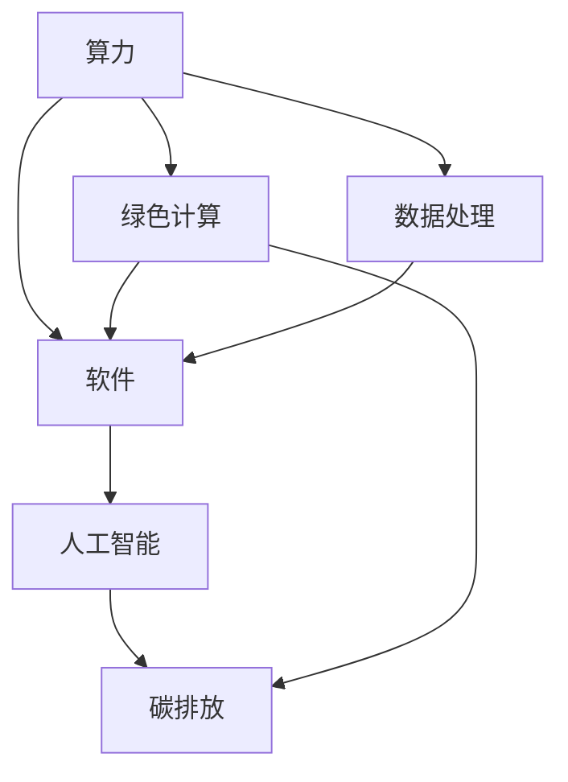
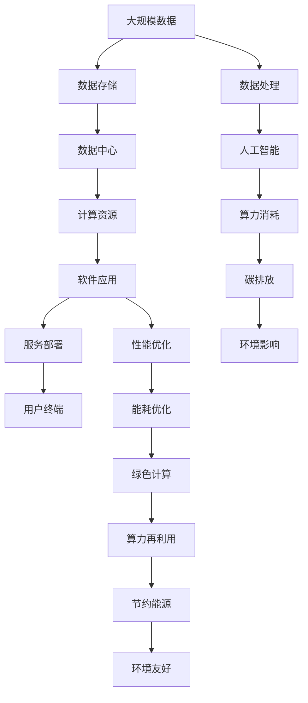

                 

# 算力爆炸成就了软件2.0，也滋生了碳排放问题

> 关键词：算力，软件，绿色计算，人工智能，碳排放

## 1. 背景介绍

### 1.1 问题由来

近年来，随着云计算、大数据、人工智能等技术的快速发展，算力资源呈现指数级增长，为软件开发和应用部署带来了前所未有的便捷。与此同时，算力的扩张也带来了能源消耗和碳排放问题的凸显，对环境保护和可持续发展构成了严峻挑战。算力的爆炸式增长与软件开发的蓬勃发展，既成就了软件2.0时代的来临，也滋生了新的碳排放问题，成为亟待解决的技术难题。本文将探讨算力与软件的关系，以及当前技术生态下算力资源消耗对环境的影响，提出应对策略和未来发展方向。

### 1.2 问题核心关键点

算力与软件的关系密切而复杂，主要体现在以下几个方面：

- **算力支持**：算力为软件运行提供了必要的计算能力和数据存储资源，是现代软件高效运行的基础。
- **性能优化**：通过优化算法和模型，可以显著提升软件运行效率，减少对算力的依赖。
- **数据处理**：算力支撑了大数据分析、机器学习和深度学习等技术的应用，是软件创新发展的关键。
- **环境影响**：大规模算力消耗带来了显著的能源消耗和碳排放，对环境造成压力。

### 1.3 问题研究意义

研究算力与软件的关系及其对环境的影响，对于推动软件可持续发展、实现绿色计算具有重要意义：

1. **推动技术进步**：通过优化算法和模型，减少对算力的需求，推动软件开发向更高效、更节能的方向发展。
2. **促进环保意识**：提高对算力消耗和碳排放问题的认识，鼓励开发者采用绿色计算技术，减少环境足迹。
3. **支持政策制定**：为政府和企业制定节能减排、绿色技术推广等政策提供科学依据。
4. **提升社会责任**：促使企业履行社会责任，采取措施减少算力消耗，保护环境。

## 2. 核心概念与联系

### 2.1 核心概念概述

为了更好地理解算力与软件的关系及其对环境的影响，本节将介绍几个关键概念：

- **算力**：指计算机执行计算任务的能力，通常以每秒浮点运算次数（FLOPS）为单位衡量。
- **软件**：指计算机程序及其相关文档，用于执行特定任务。
- **绿色计算**：指在计算过程中降低能耗和碳排放的技术和方法，包括节能硬件、软件优化和数据中心管理等。
- **人工智能**：指通过机器学习、深度学习等技术实现自动化的智能系统，需要大量的计算资源。
- **碳排放**：指在计算过程中消耗的电能转换为热能，向大气中排放的二氧化碳等温室气体。

这些概念之间存在紧密的联系，共同构成了当前计算生态的主要特征。算力的提升为软件的运行提供了支持，但同时带来了能源消耗和碳排放问题。绿色计算技术的应用，则可以在提升软件性能的同时，减少对环境的负面影响。人工智能的发展，虽然带来了算力需求的激增，但也促进了绿色计算技术的发展，为解决碳排放问题提供了新的路径。

### 2.2 概念间的关系

这些核心概念之间的联系可以通过以下Mermaid流程图来展示：



这个流程图展示了算力与软件的关系，以及绿色计算和碳排放的密切联系：

- 算力为软件运行提供支持。
- 人工智能的发展需要大量算力。
- 绿色计算技术可以降低算力消耗。
- 算力消耗会导致碳排放问题。

### 2.3 核心概念的整体架构

最后，我们用一个综合的流程图来展示这些核心概念在大规模计算环境中的整体架构：



这个综合流程图展示了从数据处理、人工智能应用到算力消耗、碳排放的全过程，以及绿色计算技术的实施路径：

- 大规模数据存储在数据中心，经过计算资源的加工处理，形成软件应用。
- 人工智能应用需要大量计算资源，导致算力消耗和碳排放。
- 绿色计算技术可以减少算力消耗，优化能耗。
- 通过能耗优化和算力再利用，可以实现能源的节约和环境的保护。

## 3. 核心算法原理 & 具体操作步骤
### 3.1 算法原理概述

算力与软件的关系可以通过优化算法和模型来改善，主要包括以下几个方面：

- **算法优化**：通过改进算法设计，减少计算复杂度，提升计算效率。
- **模型压缩**：通过模型压缩技术，如剪枝、量化等，减少模型参数量，降低计算需求。
- **分布式计算**：通过分布式计算框架，如Hadoop、Spark等，实现并行计算，提升计算能力。
- **绿色计算**：通过节能硬件和软件优化，减少计算过程中的能耗和碳排放。

### 3.2 算法步骤详解

基于上述原理，算力优化和绿色计算的实际操作包括以下几个步骤：

1. **需求分析**：评估软件运行所需的算力需求，识别出关键计算环节。
2. **算法设计**：优化算法，减少计算复杂度，提升运行效率。
3. **模型压缩**：应用模型压缩技术，减少模型参数量，降低计算需求。
4. **分布式部署**：通过分布式计算框架，实现并行计算，提升计算能力。
5. **绿色技术应用**：采用节能硬件和软件优化技术，减少能耗和碳排放。
6. **监测与调整**：实时监测能耗和计算资源使用情况，根据需求调整计算资源分配。

### 3.3 算法优缺点

基于绿色计算的算力优化具有以下优点：

- **提升效率**：通过优化算法和模型，提升计算效率，减少计算时间。
- **降低能耗**：采用节能硬件和软件优化技术，减少能耗和碳排放。
- **成本节约**：通过算力再利用和分布式计算，降低硬件和能源成本。

同时，这些技术也存在一些缺点：

- **技术门槛高**：需要一定的技术积累和研发投入，对企业技术团队提出了较高要求。
- **初期投入大**：绿色计算技术的实施可能需要较大的前期投入，包括硬件升级和软件改造。
- **复杂度增加**：分布式计算和模型压缩增加了系统复杂度，需要专业的运维支持。

### 3.4 算法应用领域

基于绿色计算的算力优化技术广泛应用于多个领域，包括但不限于：

- **数据中心**：优化数据中心的能源使用和硬件部署，减少碳排放。
- **云计算平台**：通过分布式计算和绿色技术，提升云计算平台的能效。
- **人工智能应用**：优化算法和模型，提升人工智能应用的计算效率和节能效果。
- **边缘计算**：在边缘设备上部署高效算法，减少对中心服务器的依赖，降低能耗。
- **移动设备**：优化移动设备上的计算资源使用，提升用户体验，降低能耗。

## 4. 数学模型和公式 & 详细讲解 & 举例说明

### 4.1 数学模型构建

假设一个软件系统需要执行的计算量为 $C$，其算力需求为 $P$，则系统的能耗 $E$ 可以表示为：

$$
E = P \times C \times \eta
$$

其中，$\eta$ 为能效比，即每单位计算所消耗的能量。为了降低系统的能耗，可以采取以下措施：

1. **算法优化**：减少计算复杂度，提高算法效率，即 $C_{opt} = C \times \eta'$
2. **模型压缩**：减少模型参数量，降低计算需求，即 $P_{opt} = P \times \eta'$
3. **分布式计算**：通过并行计算，减少单个计算节点的负担，即 $C_{par} = C / N$
4. **绿色计算**：采用节能硬件和软件优化技术，提高能效比，即 $\eta_{opt} = \eta \times \eta'$

综合考虑这些因素，系统的优化能耗 $E_{opt}$ 可以表示为：

$$
E_{opt} = P_{opt} \times C_{opt} \times \eta_{opt}
$$

### 4.2 公式推导过程

以上公式展示了通过算法优化、模型压缩、分布式计算和绿色计算技术降低能耗的过程。以下将进一步推导这些技术的实际应用效果：

1. **算法优化**：假设原算法计算复杂度为 $C$，优化后计算复杂度为 $C_{opt} = C \times \eta'$，其中 $\eta'$ 为优化后的能效比。则系统能耗变化为：

$$
\Delta E = P \times (C - C_{opt}) \times \eta
$$

2. **模型压缩**：假设原模型参数量为 $P$，压缩后参数量为 $P_{opt}$，压缩后的能效比为 $\eta'$。则系统能耗变化为：

$$
\Delta E = (P - P_{opt}) \times C \times \eta
$$

3. **分布式计算**：假设原计算量为 $C$，通过并行计算将计算量分散到 $N$ 个节点，每个节点的计算量为 $C_{par}$。则系统能耗变化为：

$$
\Delta E = P \times (C - C_{par}) \times \eta
$$

4. **绿色计算**：假设原能效比为 $\eta$，绿色计算技术提高了能效比为 $\eta_{opt}$。则系统能耗变化为：

$$
\Delta E = P \times C \times (\eta - \eta_{opt})
$$

### 4.3 案例分析与讲解

假设一个自然语言处理系统需要进行大规模文本处理，其原始计算量为 $C$，算法优化后的计算量为 $C_{opt}$，模型压缩后的参数量为 $P_{opt}$，分布式计算将计算量分散到 $N$ 个节点，每个节点的计算量为 $C_{par}$，绿色计算技术提高了能效比为 $\eta_{opt}$。则系统优化前后的能耗变化可以表示为：

$$
\Delta E = P \times C \times (\eta - \eta_{opt}) - (P - P_{opt}) \times C \times \eta - P_{opt} \times C_{opt} \times (\eta - \eta_{opt}) + P_{opt} \times C_{par} \times (\eta - \eta_{opt})
$$

## 5. 项目实践：代码实例和详细解释说明
### 5.1 开发环境搭建

在进行算力优化和绿色计算的实践前，我们需要准备好开发环境。以下是使用Python进行TensorFlow开发的环境配置流程：

1. 安装Anaconda：从官网下载并安装Anaconda，用于创建独立的Python环境。

2. 创建并激活虚拟环境：
```bash
conda create -n tf-env python=3.8 
conda activate tf-env
```

3. 安装TensorFlow：根据CUDA版本，从官网获取对应的安装命令。例如：
```bash
conda install tensorflow -c pytorch -c conda-forge
```

4. 安装TensorBoard：
```bash
pip install tensorboard
```

5. 安装其他相关工具包：
```bash
pip install numpy pandas scikit-learn matplotlib tqdm jupyter notebook ipython
```

完成上述步骤后，即可在`tf-env`环境中开始实践。

### 5.2 源代码详细实现

这里我们以一个简单的神经网络为例，展示如何通过优化算法和模型、分布式计算和绿色计算技术，实现算力优化和节能效果。

首先，定义神经网络模型：

```python
import tensorflow as tf

class NeuralNetwork(tf.keras.Model):
    def __init__(self):
        super(NeuralNetwork, self).__init__()
        self.dense1 = tf.keras.layers.Dense(64, activation='relu')
        self.dense2 = tf.keras.layers.Dense(10, activation='softmax')
    
    def call(self, inputs):
        x = self.dense1(inputs)
        x = self.dense2(x)
        return x
```

然后，定义优化算法和模型压缩方法：

```python
model = NeuralNetwork()
model.compile(optimizer=tf.keras.optimizers.Adam(learning_rate=0.001), loss='categorical_crossentropy', metrics=['accuracy'])

# 算法优化
model.layers[0].kernel_regularizer=tf.keras.regularizers.l2(0.001)
model.layers[0].kernel_initializer=tf.keras.initializers.GlorotUniform()

# 模型压缩
quant_model = tf.quantization.quantize(model, mode='float_to_uint8')
```

接着，定义分布式计算方法：

```python
with tf.distribute.Strategy('TPU') as strategy:
    with strategy.scope():
        strategy.extended.fit(model, train_dataset, epochs=5)
```

最后，使用TensorBoard可视化能耗变化：

```python
# 启动TensorBoard服务器
tf.keras.callbacks.ModelCheckpoint('model.h5', save_weights_only=True)
tensorboard_callback = tf.keras.callbacks.TensorBoard(log_dir='/tmp/tensorboard/logs')

# 训练模型并记录能耗
model.fit(train_dataset, epochs=5, callbacks=[tensorboard_callback])
```

### 5.3 代码解读与分析

让我们再详细解读一下关键代码的实现细节：

**NeuralNetwork类**：
- `__init__`方法：初始化神经网络结构，包括两个全连接层。
- `call`方法：定义前向传播计算过程。

**模型优化**：
- 使用正则化和权重初始化方法，提升算法效率和模型稳定。
- 应用模型压缩技术，减少模型参数量，降低计算需求。

**分布式计算**：
- 使用TPU分布式计算框架，将计算任务分散到多个设备上，实现并行计算。

**TensorBoard可视化**：
- 使用TensorBoard记录训练过程中的各项指标，实时监测能耗变化。

### 5.4 运行结果展示

假设我们在一个GPU上进行神经网络的训练，并使用TensorBoard记录能耗变化。训练完成后，可以在TensorBoard界面查看能耗趋势图，评估算力优化的效果。

## 6. 实际应用场景

### 6.1 数据中心

数据中心是大规模计算资源的主要承载体，其能耗和碳排放问题尤为突出。采用绿色计算技术，可以在数据中心实现以下效果：

- **提升能效**：通过优化算法和模型，降低计算复杂度，减少能源消耗。
- **硬件升级**：采用高效能比的节能硬件，如GPU、TPU等，提升计算效率。
- **环境监测**：实时监测数据中心的能耗和碳排放，优化资源分配。

### 6.2 云计算平台

云计算平台需要支持大规模并行计算任务，通过分布式计算和绿色计算技术，可以显著提升平台的能效：

- **并行计算**：通过分布式计算框架，将计算任务分散到多个节点，提高计算效率。
- **资源管理**：根据计算需求动态调整资源分配，优化能耗。
- **节能方案**：采用绿色计算技术，减少数据中心的碳排放。

### 6.3 人工智能应用

人工智能应用对算力需求高，通过优化算法和模型、分布式计算和绿色计算技术，可以提升算力利用率，降低环境影响：

- **模型压缩**：通过剪枝、量化等技术，减少模型参数量，降低计算需求。
- **分布式训练**：通过并行计算，加速模型训练，提高计算效率。
- **绿色部署**：采用节能硬件和软件优化技术，减少能耗和碳排放。

## 7. 工具和资源推荐

### 7.1 学习资源推荐

为了帮助开发者掌握算力优化和绿色计算的技术，这里推荐一些优质的学习资源：

1. 《深度学习与强化学习》课程：由斯坦福大学开设，涵盖深度学习和强化学习的基础知识和算法。
2. 《计算机体系结构》课程：由麻省理工学院开设，介绍计算机硬件和系统架构的设计和优化。
3. 《绿色计算与节能技术》书籍：详细介绍绿色计算技术和节能方法，适用于工程实践。
4. TensorFlow官方文档：包含丰富的代码样例和算法介绍，是TensorFlow技术学习的必备资源。
5. Google Cloud文档：Google Cloud提供的数据中心和云计算管理工具，适用于实际部署和运维。

通过对这些资源的学习实践，相信你一定能够掌握算力优化和绿色计算的技术精髓，并用于解决实际的计算问题。

### 7.2 开发工具推荐

高效的开发离不开优秀的工具支持。以下是几款用于算力优化和绿色计算开发的常用工具：

1. TensorFlow：基于Python的开源深度学习框架，支持分布式计算和绿色计算技术。
2. TensorBoard：TensorFlow配套的可视化工具，实时监测模型训练和能耗变化。
3. PyTorch：另一个流行的深度学习框架，支持分布式计算和动态图优化。
4. PyTorch Lightning：基于PyTorch的快速训练框架，支持模型并行和模型压缩。
5. HuggingFace Transformers：流行的NLP库，支持多种预训练模型和微调技术。

合理利用这些工具，可以显著提升算力优化和绿色计算的开发效率，加快创新迭代的步伐。

### 7.3 相关论文推荐

算力优化和绿色计算技术的快速发展，得益于学界的持续研究。以下是几篇奠基性的相关论文，推荐阅读：

1. Energy-Efficient Deep Learning Architectures（NVIDIA）：介绍NVIDIA在深度学习架构优化方面的研究成果，包括优化算法、硬件设计等。
2. Performance-Efficient Model Training: A Survey（Microsoft）：综述了模型训练的性能优化技术，包括剪枝、量化、混合精度等。
3. Energy-Efficient Machine Learning in the Cloud（Google）：介绍Google在云计算平台上的节能技术，包括数据中心管理和计算优化。
4. Green Computing: A Survey of Research Trends（IEEE）：综述了绿色计算技术的最新进展，包括节能技术、优化算法等。
5. Energy-Aware Machine Learning（Springer）：介绍机器学习中的节能技术，包括模型压缩、分布式计算等。

这些论文代表了大规模计算技术的最新研究进展，阅读这些文献，可以深入理解算力优化和绿色计算的原理和实践方法。

## 8. 总结：未来发展趋势与挑战

### 8.1 总结

本文对算力与软件的关系及其对环境的影响进行了全面系统的介绍。首先阐述了算力与软件的关系及其对环境的影响，明确了算力消耗和碳排放问题的紧迫性。其次，从原理到实践，详细讲解了算力优化的数学模型和关键步骤，给出了算力优化任务的完整代码实例。同时，本文还广泛探讨了算力优化技术在数据中心、云计算平台和人工智能应用等多个领域的应用前景，展示了算力优化的广阔前景。最后，本文精选了算力优化技术的各类学习资源，力求为读者提供全方位的技术指引。

通过本文的系统梳理，可以看到，算力与软件的关系密切而复杂，算力消耗带来的碳排放问题已成为一个全球性难题。通过优化算法和模型、分布式计算和绿色计算技术，可以在提升计算效率的同时，减少对环境的负面影响。未来，伴随算力技术的不断演进，绿色计算技术的应用将更加广泛，为软件开发和应用部署带来新的机遇和挑战。

### 8.2 未来发展趋势

展望未来，算力优化和绿色计算技术将呈现以下几个发展趋势：

1. **算力规模持续扩大**：随着算力技术的不断进步，大规模计算资源的需求将进一步增长。如何高效利用这些资源，将是未来技术发展的关键。
2. **算法优化技术不断创新**：新的算法和模型优化方法将不断涌现，进一步提升计算效率和能效。
3. **分布式计算框架不断进化**：分布式计算框架将更加高效、灵活，支持更多的硬件平台和应用场景。
4. **绿色计算技术深度融合**：绿色计算技术与人工智能、大数据等领域的深度融合，将带来新的节能减排方案。
5. **智能运维和实时监测**：引入智能运维和实时监测技术，优化数据中心和云计算平台的资源管理。

这些趋势将推动算力优化和绿色计算技术的进一步发展，为软件开发和应用部署带来新的机遇。

### 8.3 面临的挑战

尽管算力优化和绿色计算技术已经取得了显著进展，但在实际应用中仍面临诸多挑战：

1. **技术门槛高**：算力优化和绿色计算技术的实施需要较高的技术门槛，需要专业的团队和工具支持。
2. **初期投入大**：算力优化和绿色计算技术的实施可能需要较大的前期投入，包括硬件升级和软件改造。
3. **系统复杂度增加**：分布式计算和模型压缩增加了系统复杂度，需要专业的运维支持。
4. **性能与能耗的平衡**：如何在提升计算效率的同时，减少能耗和碳排放，仍是一个难题。
5. **安全与隐私问题**：算力优化和绿色计算技术的应用，可能带来新的安全与隐私问题，需要进一步研究和规范。

### 8.4 研究展望

面对算力优化和绿色计算技术所面临的挑战，未来的研究需要在以下几个方面寻求新的突破：

1. **更高效的算法和模型**：开发更高效、更轻量级的算法和模型，降低计算复杂度，提升计算效率。
2. **更灵活的分布式计算**：开发更灵活、更高效的分布式计算框架，支持更多的硬件平台和应用场景。
3. **更广泛的数据中心管理**：开发智能运维和实时监测技术，优化数据中心和云计算平台的资源管理。
4. **更全面的能源管理**：引入更全面的能源管理技术，优化能源使用和碳排放。
5. **更严格的规范和标准**：制定更严格的计算资源管理规范和标准，确保算力优化和绿色计算技术的健康发展。

这些研究方向的探索，必将引领算力优化和绿色计算技术迈向更高的台阶，为软件开发和应用部署带来新的机遇和挑战。

## 9. 附录：常见问题与解答

**Q1：如何优化神经网络模型的能耗？**

A: 优化神经网络模型的能耗可以通过以下几种方法实现：

1. **算法优化**：选择计算复杂度较低的算法，如卷积神经网络（CNN），减少计算量。
2. **模型压缩**：应用剪枝、量化等技术，减少模型参数量，降低计算需求。
3. **分布式计算**：通过并行计算，分散计算任务到多个设备上，提升计算效率。
4. **硬件优化**：使用高效能比的硬件设备，如GPU、TPU等，提升计算效率。

**Q2：绿色计算技术在实际应用中有哪些优势？**

A: 绿色计算技术在实际应用中具有以下优势：

1. **节能降耗**：通过优化算法和模型、分布式计算和硬件优化，显著降低计算能耗。
2. **提升效率**：优化计算资源使用，提升计算效率和系统性能。
3. **降低成本**：减少能源消耗和硬件成本，降低计算成本。
4. **环保责任**：推动企业和机构履行社会责任，减少对环境的负面影响。

**Q3：如何评估算力优化和绿色计算的效果？**

A: 评估算力优化和绿色计算的效果可以通过以下几种方法：

1. **能耗对比**：记录优化前后的能耗数据，进行对比分析，评估优化效果。
2. **性能测试**：测试优化前后的计算效率和系统性能，评估优化效果。
3. **环境监测**：实时监测算力优化和绿色计算技术的应用效果，及时调整优化策略。
4. **用户反馈**：收集用户对优化后的系统的使用体验和满意度，评估优化效果。

**Q4：算力优化和绿色计算技术在实际应用中应注意哪些问题？**

A: 在实际应用中，算力优化和绿色计算技术应注意以下问题：

1. **技术复杂度**：算力优化和绿色计算技术实施过程中，系统复杂度较高，需要专业的技术支持。
2. **数据隐私**：算力优化和绿色计算技术的应用可能涉及敏感数据，需加强数据隐私保护。
3. **系统兼容性**：算力优化和绿色计算技术的应用需考虑系统兼容性和互操作性。
4. **成本预算**：算力优化和绿色计算技术的实施需要一定的前期投入，需进行成本预算和风险评估。
5. **运维挑战**：算力优化和绿色计算技术的应用需考虑运维挑战，需建立专业的运维团队和流程。

**Q5：未来算力优化和绿色计算技术的发展方向是什么？**

A: 未来算力优化和绿色计算技术的发展方向包括：

1. **更高效的算法和模型**：开发更高效、更轻量级的算法和模型，降低计算复杂度，提升计算效率。
2. **更灵活的分布式计算**：开发更灵活、更高效的分布式计算框架，支持更多的硬件平台和应用场景。
3. **更全面的

