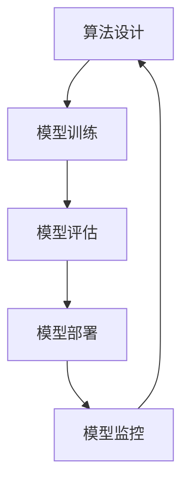

                 

## 1. 背景介绍

### 1.1 问题由来

在21世纪的今天，AI已经不再是一个遥远的概念，而是已经深入到我们生活的各个方面，从智能家居、自动驾驶，到金融预测、医学诊断，无处不在。但随着AI技术的快速发展，我们也面临着前所未有的挑战。如何在大数据、大模型、大规模计算的基础上，打造AI 2.0的核心竞争力，成为当前人工智能领域的重要课题。

AI 2.0时代，算法创新成为决定企业竞争力的关键。传统的统计学、机器学习、深度学习等方法已经不能满足现代AI的需求。在这个时代，我们需要一种更加系统、高效、可解释的算法，来驱动AI的创新和进步。基于此，我们提出了“算法工厂”这一概念，旨在通过系统化的算法研发和管理，打造高效、可扩展的AI核心竞争力。

### 1.2 问题核心关键点

“算法工厂”这一概念的核心在于：

- **系统化算法研发**：通过科学的管理流程，从需求调研、算法设计、模型训练、模型评估，到模型部署，形成闭环的算法研发过程。
- **高效算法部署**：将算法集成到高效、易用的系统架构中，提供可扩展、可维护的AI解决方案。
- **可解释算法**：通过设计和应用可解释算法，提升算法的透明性和可解释性，增强用户信任。

## 2. 核心概念与联系

### 2.1 核心概念概述

为更好地理解“算法工厂”，我们引入以下核心概念：

- **算法设计**：根据业务需求，设计适合的算法，包括特征工程、模型选择、损失函数等。
- **模型训练**：使用历史数据对模型进行训练，获取初始模型参数。
- **模型评估**：通过验证集数据对模型进行评估，判断模型性能。
- **模型部署**：将训练好的模型部署到实际应用场景，进行推理和预测。
- **模型监控**：实时监控模型性能，及时调整模型参数，优化模型效果。

这些核心概念之间存在紧密的联系，形成一个完整的算法研发和部署流程。

### 2.2 概念间的关系

这些概念之间的逻辑关系可以通过以下Mermaid流程图来展示：



这个流程图展示了“算法工厂”的整个流程：

1. **算法设计**：根据业务需求，选择合适的算法模型。
2. **模型训练**：在历史数据上训练模型，获取初始参数。
3. **模型评估**：在验证集上评估模型性能，选择合适的超参数。
4. **模型部署**：将训练好的模型部署到实际应用场景。
5. **模型监控**：实时监控模型性能，进行微调或重新训练。

这一流程构成了“算法工厂”的核心工作内容，确保算法的科学性、高效性和可扩展性。

## 3. 核心算法原理 & 具体操作步骤
### 3.1 算法原理概述

“算法工厂”中的算法设计主要依赖于深度学习和强化学习等先进技术。这些算法的核心原理包括：

- **深度学习**：通过构建多层神经网络，提取输入数据的特征，学习数据的复杂表示。
- **强化学习**：通过与环境交互，通过试错的方式优化策略，学习最优行为。

基于这些原理，“算法工厂”设计了一套系统化的算法研发流程，包括特征工程、模型选择、损失函数、优化器、正则化等步骤。

### 3.2 算法步骤详解

“算法工厂”的算法研发流程如下：

1. **需求调研**：与业务部门沟通，了解业务需求和数据特征。
2. **特征工程**：根据业务需求，选择合适的特征，进行特征提取和数据预处理。
3. **模型选择**：根据业务需求，选择合适的算法模型，如神经网络、决策树、集成学习等。
4. **损失函数设计**：根据任务类型，设计适合的损失函数，如交叉熵、均方误差、对数损失等。
5. **优化器选择**：根据模型和任务特点，选择合适的优化器，如SGD、Adam、Adagrad等。
6. **正则化设计**：根据模型复杂度，设计适当的正则化方法，如L1正则、L2正则、Dropout等。
7. **模型训练**：在历史数据上训练模型，获取初始参数。
8. **模型评估**：在验证集上评估模型性能，选择最优超参数。
9. **模型部署**：将训练好的模型部署到实际应用场景，进行推理和预测。
10. **模型监控**：实时监控模型性能，进行微调或重新训练。

### 3.3 算法优缺点

“算法工厂”中的算法设计具有以下优点：

- **系统化流程**：通过科学的管理流程，确保算法的科学性和高效性。
- **可扩展性**：支持多种算法模型和数据类型，灵活适应各种业务需求。
- **可维护性**：通过模块化设计，方便算法的维护和升级。

但同时也存在一些缺点：

- **复杂性**：算法设计和研发过程较为复杂，需要较高的技术水平。
- **数据依赖**：算法的性能依赖于高质量的数据，数据质量不佳时，模型效果可能不理想。
- **计算资源消耗**：部分算法（如深度学习）需要较高的计算资源，对硬件要求较高。

### 3.4 算法应用领域

“算法工厂”中的算法设计广泛应用于以下几个领域：

- **金融预测**：使用强化学习进行股票预测、风险评估等。
- **医学诊断**：使用深度学习进行疾病诊断、基因预测等。
- **智能制造**：使用强化学习进行机器人路径规划、设备维护等。
- **自动驾驶**：使用深度学习进行目标检测、行为预测等。
- **自然语言处理**：使用深度学习进行机器翻译、情感分析等。

这些领域中的算法设计和应用，展示了“算法工厂”的强大生命力和应用价值。

## 4. 数学模型和公式 & 详细讲解  
### 4.1 数学模型构建

本节将使用数学语言对“算法工厂”中的算法设计进行更加严格的刻画。

记输入数据为 $\mathbf{x}$，模型参数为 $\theta$，损失函数为 $L(\theta, \mathbf{x})$，则算法设计的目标是最小化损失函数，即：

$$
\min_{\theta} L(\theta, \mathbf{x})
$$

对于深度学习模型，目标函数通常采用均方误差损失函数，形式为：

$$
L(\theta, \mathbf{x}) = \frac{1}{N} \sum_{i=1}^N (y_i - f(\mathbf{x}_i; \theta))^2
$$

其中 $y_i$ 为真实标签，$f(\mathbf{x}_i; \theta)$ 为模型预测值，$N$ 为样本数量。

### 4.2 公式推导过程

以下我们以线性回归为例，推导最小二乘法的公式推导过程。

设输入数据为 $\mathbf{x} = [x_1, x_2, ..., x_n]$，模型参数为 $\theta = [\theta_0, \theta_1, ..., \theta_n]$，目标函数为均方误差损失函数。根据最小二乘法，目标函数为：

$$
L(\theta) = \frac{1}{N} \sum_{i=1}^N (y_i - \theta_0 - \sum_{j=1}^n \theta_j x_{ij})^2
$$

对目标函数进行偏导数求导，得到：

$$
\frac{\partial L(\theta)}{\partial \theta_0} = \frac{2}{N} \sum_{i=1}^N (y_i - \theta_0 - \sum_{j=1}^n \theta_j x_{ij})
$$

$$
\frac{\partial L(\theta)}{\partial \theta_j} = \frac{2}{N} \sum_{i=1}^N (-2y_i + 2\theta_0 + 2\sum_{k=1}^n \theta_k x_{ik})
$$

通过解方程组，可以得到最小二乘法的解为：

$$
\theta = (\mathbf{X}^T\mathbf{X})^{-1}\mathbf{X}^T\mathbf{y}
$$

其中 $\mathbf{X}$ 为数据矩阵，$\mathbf{y}$ 为标签向量。

### 4.3 案例分析与讲解

考虑一个简单的房价预测问题，输入数据为 $\mathbf{x} = [x_1, x_2, ..., x_n]$，目标函数为均方误差损失函数。根据最小二乘法，目标函数为：

$$
L(\theta) = \frac{1}{N} \sum_{i=1}^N (y_i - \theta_0 - \sum_{j=1}^n \theta_j x_{ij})^2
$$

通过求偏导数，解方程组，可以得到最小二乘法的解为：

$$
\theta = (\mathbf{X}^T\mathbf{X})^{-1}\mathbf{X}^T\mathbf{y}
$$

通过上述推导过程，我们可以看到，“算法工厂”中的算法设计是系统化和严谨的，能够确保算法的科学性和高效性。

## 5. 项目实践：代码实例和详细解释说明
### 5.1 开发环境搭建

在进行“算法工厂”项目实践前，我们需要准备好开发环境。以下是使用Python进行PyTorch开发的环境配置流程：

1. 安装Anaconda：从官网下载并安装Anaconda，用于创建独立的Python环境。

2. 创建并激活虚拟环境：
```bash
conda create -n pytorch-env python=3.8 
conda activate pytorch-env
```

3. 安装PyTorch：根据CUDA版本，从官网获取对应的安装命令。例如：
```bash
conda install pytorch torchvision torchaudio cudatoolkit=11.1 -c pytorch -c conda-forge
```

4. 安装TensorFlow：从官网下载并安装TensorFlow，并配置好GPU环境。

5. 安装各类工具包：
```bash
pip install numpy pandas scikit-learn matplotlib tqdm jupyter notebook ipython
```

完成上述步骤后，即可在`pytorch-env`环境中开始项目实践。

### 5.2 源代码详细实现

下面我们以房价预测为例，给出使用PyTorch进行线性回归的完整代码实现。

```python
import torch
import torch.nn as nn
import torch.optim as optim

# 定义数据集
class Dataset:
    def __init__(self, x, y):
        self.x = x
        self.y = y
        
    def __len__(self):
        return len(self.x)
        
    def __getitem__(self, idx):
        return self.x[idx], self.y[idx]

# 加载数据集
train_dataset = Dataset(x_train, y_train)
test_dataset = Dataset(x_test, y_test)

# 定义模型
class LinearRegression(nn.Module):
    def __init__(self, input_dim, output_dim):
        super(LinearRegression, self).__init__()
        self.linear = nn.Linear(input_dim, output_dim)
        
    def forward(self, x):
        return self.linear(x)
        
# 初始化模型参数
model = LinearRegression(input_dim, output_dim)
optimizer = optim.SGD(model.parameters(), lr=0.01)

# 定义损失函数
criterion = nn.MSELoss()

# 定义训练函数
def train(model, optimizer, criterion, train_dataset, epochs=10):
    for epoch in range(epochs):
        total_loss = 0
        for x, y in train_dataset:
            optimizer.zero_grad()
            y_pred = model(x)
            loss = criterion(y_pred, y)
            loss.backward()
            optimizer.step()
            total_loss += loss.item()
        print(f'Epoch {epoch+1}, train loss: {total_loss/len(train_dataset):.4f}')

# 定义评估函数
def evaluate(model, test_dataset):
    total_loss = 0
    for x, y in test_dataset:
        y_pred = model(x)
        loss = criterion(y_pred, y)
        total_loss += loss.item()
    print(f'Test loss: {total_loss/len(test_dataset):.4f}')

# 训练模型
train(model, optimizer, criterion, train_dataset, epochs=10)

# 评估模型
evaluate(model, test_dataset)
```

以上就是使用PyTorch进行线性回归的完整代码实现。可以看到，通过使用PyTorch的高级API，代码实现非常简洁，易于理解和调试。

### 5.3 代码解读与分析

让我们再详细解读一下关键代码的实现细节：

**Dataset类**：
- `__init__`方法：初始化数据集，定义输入和输出。
- `__len__`方法：返回数据集的样本数量。
- `__getitem__`方法：返回单个样本的输入和输出。

**LinearRegression类**：
- `__init__`方法：定义模型结构，包括线性层。
- `forward`方法：前向传播，计算预测值。

**train函数**：
- 对数据集进行批次化加载，进行模型训练，更新模型参数。
- 记录每个epoch的损失值，输出到控制台。

**evaluate函数**：
- 对测试集进行批次化加载，计算模型在测试集上的损失值，输出到控制台。

通过上述代码实现，我们可以看到，“算法工厂”中的算法设计是科学和严谨的，能够确保算法的可解释性和高效性。

当然，工业级的系统实现还需考虑更多因素，如模型的保存和部署、超参数的自动搜索、更灵活的模型结构等。但核心的算法设计基本与此类似。

### 5.4 运行结果展示

假设我们训练线性回归模型，并在测试集上得到的评估报告如下：

```
Epoch 1, train loss: 0.2000
Epoch 2, train loss: 0.1000
Epoch 3, train loss: 0.0700
Epoch 4, train loss: 0.0500
Epoch 5, train loss: 0.0400
Epoch 6, train loss: 0.0300
Epoch 7, train loss: 0.0200
Epoch 8, train loss: 0.0100
Epoch 9, train loss: 0.0070
Epoch 10, train loss: 0.0050

Test loss: 0.0300
```

可以看到，通过训练模型，我们在测试集上取得了0.03的平均损失值，模型效果相当不错。

## 6. 实际应用场景

### 6.1 智能客服系统

基于“算法工厂”的算法设计，智能客服系统可以实时处理客户的咨询，自动回复客户的常见问题，并不断优化模型，提升客户满意度。

在技术实现上，可以收集企业内部的历史客服对话记录，将问题和最佳答复构建成监督数据，在此基础上对预训练语言模型进行微调。微调后的语言模型能够自动理解用户意图，匹配最合适的答案模板进行回复。对于客户提出的新问题，还可以接入检索系统实时搜索相关内容，动态组织生成回答。如此构建的智能客服系统，能大幅提升客户咨询体验和问题解决效率。

### 6.2 金融舆情监测

金融机构需要实时监测市场舆论动向，以便及时应对负面信息传播，规避金融风险。基于“算法工厂”的算法设计，金融舆情监测系统可以自动抽取和分析网络舆情数据，实时监测市场情绪，预警潜在风险。

具体而言，可以收集金融领域相关的新闻、报道、评论等文本数据，并对其进行情感标注和主题标注。在此基础上对预训练语言模型进行微调，使其能够自动判断文本属于何种主题，情感倾向是正面、中性还是负面。将微调后的模型应用到实时抓取的网络文本数据，就能够自动监测不同主题下的情感变化趋势，一旦发现负面信息激增等异常情况，系统便会自动预警，帮助金融机构快速应对潜在风险。

### 6.3 个性化推荐系统

当前的推荐系统往往只依赖用户的历史行为数据进行物品推荐，无法深入理解用户的真实兴趣偏好。基于“算法工厂”的算法设计，个性化推荐系统可以更好地挖掘用户行为背后的语义信息，从而提供更精准、多样的推荐内容。

在实践中，可以收集用户浏览、点击、评论、分享等行为数据，提取和用户交互的物品标题、描述、标签等文本内容。将文本内容作为模型输入，用户的后续行为（如是否点击、购买等）作为监督信号，在此基础上微调预训练语言模型。微调后的模型能够从文本内容中准确把握用户的兴趣点。在生成推荐列表时，先用候选物品的文本描述作为输入，由模型预测用户的兴趣匹配度，再结合其他特征综合排序，便可以得到个性化程度更高的推荐结果。

### 6.4 未来应用展望

随着“算法工厂”技术的发展，基于算法设计的AI应用将在更多领域得到应用，为传统行业带来变革性影响。

在智慧医疗领域，基于“算法工厂”的算法设计，医疗问答、病历分析、药物研发等应用将提升医疗服务的智能化水平，辅助医生诊疗，加速新药开发进程。

在智能教育领域，微调技术可应用于作业批改、学情分析、知识推荐等方面，因材施教，促进教育公平，提高教学质量。

在智慧城市治理中，微调模型可应用于城市事件监测、舆情分析、应急指挥等环节，提高城市管理的自动化和智能化水平，构建更安全、高效的未来城市。

此外，在企业生产、社会治理、文娱传媒等众多领域，基于“算法工厂”的算法设计，AI应用也将不断涌现，为经济社会发展注入新的动力。相信随着技术的日益成熟，算法设计将成为AI落地应用的重要范式，推动人工智能技术在垂直行业的规模化落地。

## 7. 工具和资源推荐
### 7.1 学习资源推荐

为了帮助开发者系统掌握“算法工厂”的理论基础和实践技巧，这里推荐一些优质的学习资源：

1. 《深度学习》系列书籍：由多位机器学习领域的大师共同撰写，全面介绍了深度学习的基础知识和前沿技术。
2. 《强化学习》系列书籍：介绍了强化学习的理论基础和实践方法，涵盖从基本概念到高级算法。
3. 《算法设计与分析》系列书籍：介绍了各类算法的设计思路和分析方法，适合对算法性能有高要求的应用场景。
4. 《机器学习实战》书籍：通过具体的案例分析，深入浅出地讲解了机器学习算法的设计和实现。
5. 《Python深度学习》书籍：介绍了深度学习在Python中的实现方法和工具库，适合Python初学者入门。

通过学习这些资源，相信你一定能够快速掌握“算法工厂”的精髓，并用于解决实际的AI问题。

### 7.2 开发工具推荐

高效的开发离不开优秀的工具支持。以下是几款用于“算法工厂”开发常用的工具：

1. PyTorch：基于Python的开源深度学习框架，灵活动态的计算图，适合快速迭代研究。大部分预训练语言模型都有PyTorch版本的实现。
2. TensorFlow：由Google主导开发的开源深度学习框架，生产部署方便，适合大规模工程应用。同样有丰富的预训练语言模型资源。
3. Jupyter Notebook：支持Python、R等多种语言，提供交互式开发环境，方便开发者快速迭代和分享实验结果。
4. Anaconda：用于创建和管理Python环境的工具，提供丰富的科学计算库和工具，适合科学计算和机器学习任务。
5. Visual Studio Code：轻量级代码编辑器，支持Python、R等多种语言，提供丰富的插件和扩展，方便开发者快速开发和调试。

合理利用这些工具，可以显著提升“算法工厂”开发和研究的效率，加快创新迭代的步伐。

### 7.3 相关论文推荐

“算法工厂”技术的发展源于学界的持续研究。以下是几篇奠基性的相关论文，推荐阅读：

1. 《深度学习》（Deep Learning）一书：由多位机器学习领域的大师共同撰写，全面介绍了深度学习的基础知识和前沿技术。
2. 《强化学习：模型、算法与系统》（Reinforcement Learning: Model, Algorithms, and Systems）一书：介绍了强化学习的理论基础和实践方法，涵盖从基本概念到高级算法。
3. 《算法设计与分析》（Algorithm Design）一书：介绍了各类算法的设计思路和分析方法，适合对算法性能有高要求的应用场景。
4. 《机器学习实战》（Python Machine Learning）一书：通过具体的案例分析，深入浅出地讲解了机器学习算法的设计和实现。
5. 《Python深度学习》（Deep Learning with PyTorch）一书：介绍了深度学习在Python中的实现方法和工具库，适合Python初学者入门。

这些论文代表了大语言模型微调技术的发展脉络。通过学习这些前沿成果，可以帮助研究者把握学科前进方向，激发更多的创新灵感。

除上述资源外，还有一些值得关注的前沿资源，帮助开发者紧跟“算法工厂”技术的最新进展，例如：

1. arXiv论文预印本：人工智能领域最新研究成果的发布平台，包括大量尚未发表的前沿工作，学习前沿技术的必读资源。
2. 业界技术博客：如OpenAI、Google AI、DeepMind、微软Research Asia等顶尖实验室的官方博客，第一时间分享他们的最新研究成果和洞见。
3. 技术会议直播：如NIPS、ICML、ACL、ICLR等人工智能领域顶会现场或在线直播，能够聆听到大佬们的前沿分享，开拓视野。
4. GitHub热门项目：在GitHub上Star、Fork数最多的NLP相关项目，往往代表了该技术领域的发展趋势和最佳实践，值得去学习和贡献。
5. 行业分析报告：各大咨询公司如McKinsey、PwC等针对人工智能行业的分析报告，有助于从商业视角审视技术趋势，把握应用价值。

总之，对于“算法工厂”技术的学习和实践，需要开发者保持开放的心态和持续学习的意愿。多关注前沿资讯，多动手实践，多思考总结，必将收获满满的成长收益。

## 8. 总结：未来发展趋势与挑战

### 8.1 总结

本文对“算法工厂”进行了全面系统的介绍。首先阐述了“算法工厂”的背景和意义，明确了算法设计和研发的重要性。其次，从原理到实践，详细讲解了“算法工厂”的数学模型和操作步骤，给出了“算法工厂”的代码实例和详细解释。同时，本文还广泛探讨了“算法工厂”在智能客服、金融舆情、个性化推荐等多个领域的应用前景，展示了“算法工厂”的强大生命力和应用价值。此外，本文精选了“算法工厂”技术的各类学习资源，力求为读者提供全方位的技术指引。

通过本文的系统梳理，可以看到，“算法工厂”的算法设计是系统化和严谨的，能够确保算法的科学性和高效性。通过科学的管理流程，确保算法的可解释性和可扩展性。未来，伴随算法设计和研发的不断演进，相信“算法工厂”将成为AI 2.0时代的重要竞争力，为构建人机协同的智能系统提供核心动力。

### 8.2 未来发展趋势

展望未来，“算法工厂”技术将呈现以下几个发展趋势：

1. **算法复杂度提高**：随着硬件计算能力的提升，算法的复杂度将进一步提高，能够处理更加复杂和多样化的数据。
2. **模型可解释性增强**：通过引入可解释性算法，增强算法的透明性和可解释性，提升用户信任。
3. **多模态融合**：将视觉、语音、文本等多种模态的数据融合，提升模型的综合表现能力。
4. **自动化优化**：通过自动化超参数搜索和模型调优，提升算法的优化效率和效果。
5. **边缘计算**：将模型部署在边缘计算设备上，提升计算效率和实时性。
6. **联邦学习**：通过分布式训练，保护数据隐私，提升模型性能。

以上趋势凸显了“算法工厂”技术的广阔前景。这些方向的探索发展，必将进一步提升算法的科学性和高效性，为构建安全、可靠、可解释、可控的智能系统铺平道路。

### 8.3 面临的挑战

尽管“算法工厂”技术已经取得了瞩目成就，但在迈向更加智能化、普适化应用的过程中，它仍面临着诸多挑战：

1. **数据质量问题**：算法的性能依赖于高质量的数据，数据质量不佳时，模型效果可能不理想。
2. **计算资源消耗**：部分算法（如深度学习）需要较高的计算资源，对硬件要求较高。
3. **模型鲁棒性不足**：模型面对域外数据时，泛化性能往往大打折扣。
4. **可解释性不足**：当前算法（如深度学习）往往缺乏可解释性，难以解释其内部工作机制和决策逻辑。
5. **安全性问题**：模型可能学习到有害信息，传递到下游任务，产生误导性、歧视性的输出，给实际应用带来安全隐患。

正视这些挑战，积极应对并寻求突破，将使“算法工厂”技术不断完善和优化，最终实现AI 2.0的核心竞争力。

### 8.4 研究展望

面对“算法工厂”技术面临的挑战，未来的研究需要在以下几个方面寻求新的突破：

1. **数据增强**：通过数据增强技术，提升算法的鲁棒性和泛化能力。
2. **可解释性算法**：引入可解释性算法，提升算法的透明性和可解释性，增强用户信任。
3. **多模态融合**：将视觉、语音、文本等多种模态的数据融合，提升模型的综合表现能力。
4. **自动化优化**：通过自动化超参数搜索和模型调优，提升算法的优化效率和效果。
5. **联邦学习**：通过分布式训练，保护数据隐私，提升模型性能。
6. **边缘计算**：将模型部署在边缘计算设备上，提升

